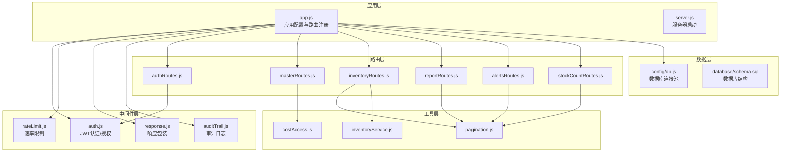
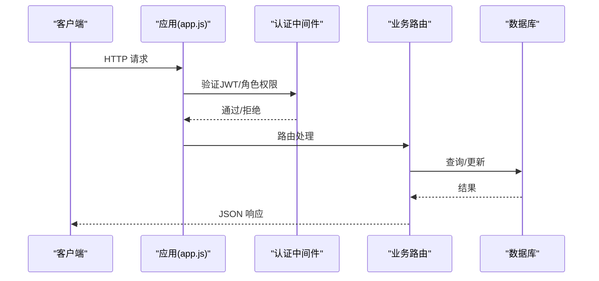
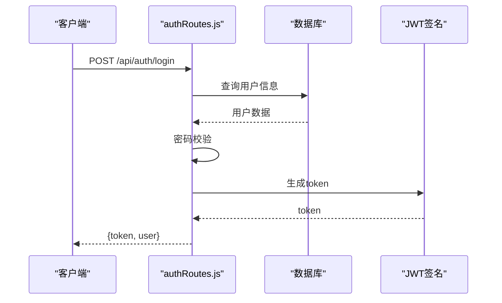
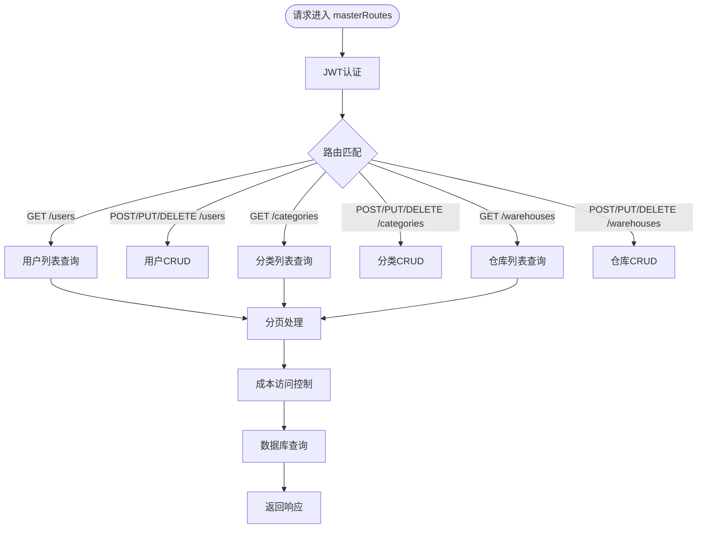
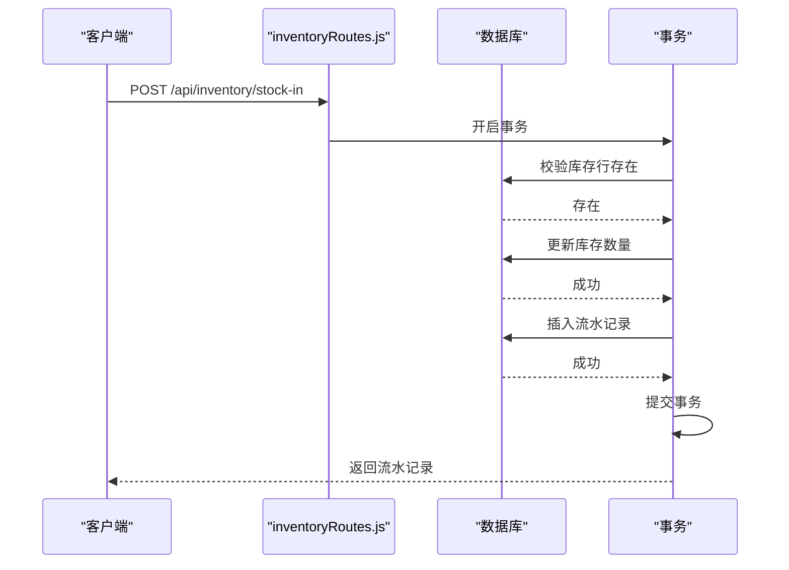
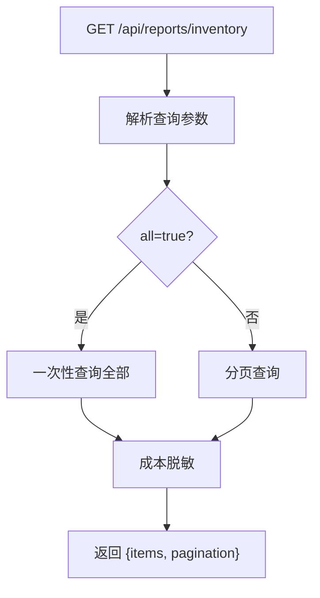
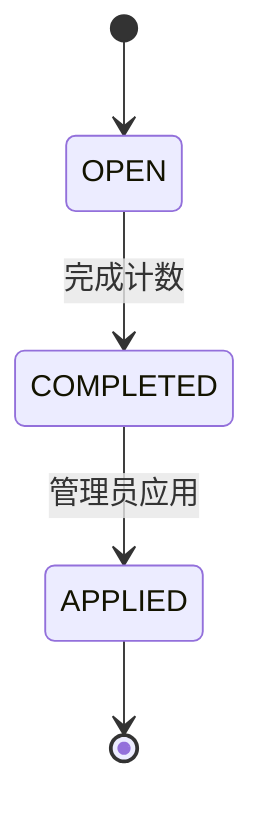
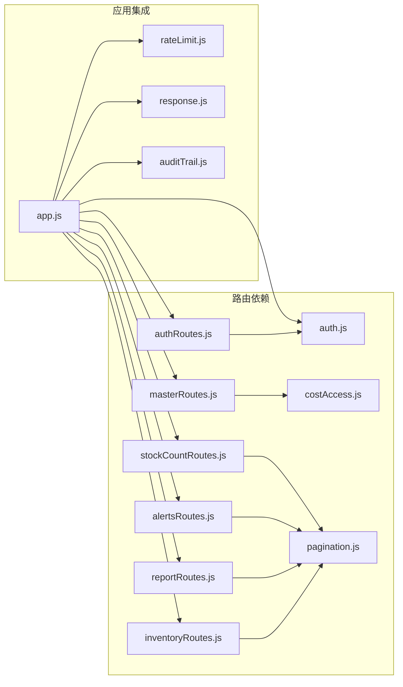

# API接口文档

<cite>
**本文档引用的文件**
- [server/src/app.js](file://server/src/app.js)
- [server/src/server.js](file://server/src/server.js)
- [server/package.json](file://server/package.json)
- [README.md](file://README.md)
- [POSTMAN_BACKEND_GUIDE.md](file://POSTMAN_BACKEND_GUIDE.md)
- [server/src/routes/authRoutes.js](file://server/src/routes/authRoutes.js)
- [server/src/routes/inventoryRoutes.js](file://server/src/routes/inventoryRoutes.js)
- [server/src/routes/masterRoutes.js](file://server/src/routes/masterRoutes.js)
- [server/src/routes/reportRoutes.js](file://server/src/routes/reportRoutes.js)
- [server/src/routes/alertsRoutes.js](file://server/src/routes/alertsRoutes.js)
- [server/src/routes/stockCountRoutes.js](file://server/src/routes/stockCountRoutes.js)
- [server/src/middleware/auth.js](file://server/src/middleware/auth.js)
- [server/src/middleware/rateLimit.js](file://server/src/middleware/rateLimit.js)
- [server/src/utils/pagination.js](file://server/src/utils/pagination.js)
- [server/src/utils/costAccess.js](file://server/src/utils/costAccess.js)
</cite>

## 目录
1. [简介](#简介)
2. [项目结构](#项目结构)
3. [核心组件](#核心组件)
4. [架构概览](#架构概览)
5. [详细组件分析](#详细组件分析)
6. [依赖关系分析](#依赖关系分析)
7. [性能考虑](#性能考虑)
8. [故障排除指南](#故障排除指南)
9. [结论](#结论)
10. [附录](#附录)

## 简介
本项目是一个基于 Node.js + Express + PostgreSQL 的库存管理系统后端 API。系统提供完整的库存管理能力，包括商品主数据、仓库管理、库存出入库、调拨、盘点、报表、告警、审计日志等功能模块。API 采用 RESTful 设计，支持分页、搜索、成本解锁等特性，并内置 JWT 认证、角色权限控制、速率限制和审计追踪。

## 项目结构
后端采用模块化路由组织方式，按业务领域划分路由文件，统一在应用入口注册。核心中间件包括认证、速率限制、响应包装、审计日志等。

**图表来源**
- [server/src/app.js:1-67](file://server/src/app.js#L1-L67)
- [server/src/server.js:1-28](file://server/src/server.js#L1-L28)
- [server/src/routes/authRoutes.js:1-72](file://server/src/routes/authRoutes.js#L1-L72)
- [server/src/routes/inventoryRoutes.js:1-493](file://server/src/routes/inventoryRoutes.js#L1-L493)
- [server/src/routes/masterRoutes.js:1-800](file://server/src/routes/masterRoutes.js#L1-L800)
- [server/src/routes/reportRoutes.js:1-252](file://server/src/routes/reportRoutes.js#L1-L252)
- [server/src/routes/alertsRoutes.js:1-290](file://server/src/routes/alertsRoutes.js#L1-L290)
- [server/src/routes/stockCountRoutes.js:1-434](file://server/src/routes/stockCountRoutes.js#L1-L434)
- [server/src/middleware/auth.js:1-46](file://server/src/middleware/auth.js#L1-L46)
- [server/src/middleware/rateLimit.js:1-40](file://server/src/middleware/rateLimit.js#L1-L40)
- [server/src/utils/pagination.js:1-28](file://server/src/utils/pagination.js#L1-L28)
- [server/src/utils/costAccess.js:1-32](file://server/src/utils/costAccess.js#L1-L32)

**章节来源**
- [server/src/app.js:1-67](file://server/src/app.js#L1-L67)
- [server/src/server.js:1-28](file://server/src/server.js#L1-L28)
- [README.md:1-105](file://README.md#L1-L105)

## 核心组件
- 应用入口与中间件：设置安全头、CORS、JSON 解析、日志、审计、统一错误处理。
- 认证与授权：JWT 验证、角色权限控制（ADMIN/MANAGER/STAFF）。
- 速率限制：基于内存桶的滑动窗口限流，支持命名空间隔离。
- 分页工具：统一分页参数解析与结果封装。
- 成本访问控制：通过独立 Token 解锁成本字段展示。
- 数据库连接：PostgreSQL 连接池，启动时进行连通性检查。

**章节来源**
- [server/src/app.js:28-64](file://server/src/app.js#L28-L64)
- [server/src/middleware/auth.js:1-46](file://server/src/middleware/auth.js#L1-L46)
- [server/src/middleware/rateLimit.js:1-40](file://server/src/middleware/rateLimit.js#L1-L40)
- [server/src/utils/pagination.js:1-28](file://server/src/utils/pagination.js#L1-L28)
- [server/src/utils/costAccess.js:1-32](file://server/src/utils/costAccess.js#L1-L32)
- [server/src/server.js:13-25](file://server/src/server.js#L13-L25)

## 架构概览
系统采用分层架构，路由层负责请求处理，中间件层提供横切关注点，工具层提供通用能力，数据层负责持久化。

**图表来源**
- [server/src/app.js:28-64](file://server/src/app.js#L28-L64)
- [server/src/middleware/auth.js:5-29](file://server/src/middleware/auth.js#L5-L29)
- [server/src/routes/authRoutes.js:17-64](file://server/src/routes/authRoutes.js#L17-L64)

## 详细组件分析

### 认证模块
- 登录接口：邮箱+密码登录，返回 JWT 令牌与用户信息。
- 用户信息接口：携带 JWT 访问，返回当前用户信息。
- 速率限制：登录接口使用独立命名空间限流，防止暴力破解。
- 安全头：使用 Helmet 提升安全防护。

**图表来源**
- [server/src/routes/authRoutes.js:17-64](file://server/src/routes/authRoutes.js#L17-L64)
- [server/src/middleware/rateLimit.js:9-35](file://server/src/middleware/rateLimit.js#L9-L35)

**章节来源**
- [server/src/routes/authRoutes.js:1-72](file://server/src/routes/authRoutes.js#L1-L72)
- [server/src/middleware/auth.js:1-46](file://server/src/middleware/auth.js#L1-L46)
- [server/src/middleware/rateLimit.js:1-40](file://server/src/middleware/rateLimit.js#L1-L40)

### 主数据模块（商品、分类、仓库）
- 用户管理：支持搜索、分页、CRUD，管理员可创建/修改/删除用户。
- 分类管理：支持搜索、分页、CRUD，管理员/经理可操作。
- 仓库管理：支持搜索、启用状态筛选、分页，管理员/经理可操作。
- 成本访问：通过独立 Token 解锁成本字段展示。

**图表来源**
- [server/src/routes/masterRoutes.js:492-800](file://server/src/routes/masterRoutes.js#L492-L800)
- [server/src/utils/costAccess.js:25-27](file://server/src/utils/costAccess.js#L25-L27)

**章节来源**
- [server/src/routes/masterRoutes.js:1-800](file://server/src/routes/masterRoutes.js#L1-L800)
- [server/src/utils/costAccess.js:1-32](file://server/src/utils/costAccess.js#L1-L32)

### 库存模块
- 库存总览：支持搜索、分类筛选、仓库筛选、低库存筛选、分页。
- 库存流水：支持搜索、类型筛选、分页。
- 库存变动：支持入库、出库、调拨、预留/释放分配。
- 成本脱敏：未解锁时成本字段返回 null。

**图表来源**
- [server/src/routes/inventoryRoutes.js:229-403](file://server/src/routes/inventoryRoutes.js#L229-L403)

**章节来源**
- [server/src/routes/inventoryRoutes.js:1-493](file://server/src/routes/inventoryRoutes.js#L1-L493)
- [server/src/utils/pagination.js:1-28](file://server/src/utils/pagination.js#L1-L28)

### 报表模块
- 库存报表：支持搜索、分页，导出时可拉取全量。
- 流水报表：支持时间范围、关键词搜索、分页。

**图表来源**
- [server/src/routes/reportRoutes.js:15-127](file://server/src/routes/reportRoutes.js#L15-L127)

**章节来源**
- [server/src/routes/reportRoutes.js:1-252](file://server/src/routes/reportRoutes.js#L1-L252)

### 告警模块
- 低库存告警：支持搜索、仓库筛选、状态筛选、分页，返回汇总统计。
- 单个告警更新：支持状态变更、指派人员。
- 批量更新：支持批量状态变更与备注。

**章节来源**
- [server/src/routes/alertsRoutes.js:1-290](file://server/src/routes/alertsRoutes.js#L1-L290)

### 盘点模块
- 盘点任务：创建、完成、应用（仅管理员/经理）。
- 盘点明细：支持编辑已计数数量、差异计算。
- 盘点流程：OPEN -> COMPLETED -> APPLIED，应用时自动产生出入库流水。

**图表来源**
- [server/src/routes/stockCountRoutes.js:326-431](file://server/src/routes/stockCountRoutes.js#L326-L431)

**章节来源**
- [server/src/routes/stockCountRoutes.js:1-434](file://server/src/routes/stockCountRoutes.js#L1-L434)

## 依赖关系分析

**图表来源**
- [server/src/app.js:9-25](file://server/src/app.js#L9-L25)
- [server/src/routes/authRoutes.js:5-6](file://server/src/routes/authRoutes.js#L5-L6)
- [server/src/routes/masterRoutes.js:7-8](file://server/src/routes/masterRoutes.js#L7-L8)
- [server/src/routes/inventoryRoutes.js:4-5](file://server/src/routes/inventoryRoutes.js#L4-L5)
- [server/src/routes/reportRoutes.js:4-5](file://server/src/routes/reportRoutes.js#L4-L5)
- [server/src/routes/alertsRoutes.js:4](file://server/src/routes/alertsRoutes.js#L4)
- [server/src/routes/stockCountRoutes.js:4](file://server/src/routes/stockCountRoutes.js#L4)

**章节来源**
- [server/src/app.js:1-67](file://server/src/app.js#L1-L67)

## 性能考虑
- 分页与搜索：所有列表接口均支持分页与搜索，避免一次性加载大量数据。
- 并行查询：库存与报表接口使用 Promise 并行查询数据与总数，减少往返延迟。
- 成本脱敏：默认隐藏成本字段，降低敏感信息泄露风险。
- 事务处理：库存变动与盘点应用使用数据库事务保证一致性。
- 速率限制：登录接口独立限流，防止暴力破解。

**章节来源**
- [server/src/utils/pagination.js:1-28](file://server/src/utils/pagination.js#L1-L28)
- [server/src/routes/inventoryRoutes.js:76-139](file://server/src/routes/inventoryRoutes.js#L76-L139)
- [server/src/routes/reportRoutes.js:65-114](file://server/src/routes/reportRoutes.js#L65-L114)
- [server/src/middleware/rateLimit.js:9-35](file://server/src/middleware/rateLimit.js#L9-L35)

## 故障排除指南
- 启动失败：检查数据库连通性与 schema/seed 是否正确执行。
- 认证失败：确认 Authorization 头是否包含有效的 Bearer Token。
- 权限不足：确保用户角色满足接口要求（ADMIN/MANAGER/STAFF）。
- 速率限制：查看 Retry-After 响应头或错误码 429。
- 健康检查：访问 /api/health 确认服务可用。

**章节来源**
- [server/src/server.js:13-25](file://server/src/server.js#L13-L25)
- [server/src/middleware/auth.js:9-28](file://server/src/middleware/auth.js#L9-L28)
- [server/src/middleware/rateLimit.js:23-29](file://server/src/middleware/rateLimit.js#L23-L29)
- [server/src/app.js:36-38](file://server/src/app.js#L36-L38)

## 结论
本 API 提供了完整的库存管理能力，具备良好的扩展性与安全性。通过模块化的路由设计、统一的中间件体系与完善的分页/搜索机制，能够满足大规模数据场景下的性能需求。建议在生产环境中结合反向代理与监控系统进一步增强稳定性与可观测性。

## 附录

### API 一览表
- 认证
  - POST /api/auth/login
  - GET /api/auth/me
- 主数据
  - GET /api/users
  - POST /api/users
  - PUT /api/users/:id
  - DELETE /api/users/:id
  - GET /api/categories
  - POST /api/categories
  - PUT /api/categories/:id
  - DELETE /api/categories/:id
  - GET /api/warehouses
  - POST /api/warehouses
  - PUT /api/warehouses/:id
  - DELETE /api/warehouses/:id
- 库存
  - GET /api/inventory
  - GET /api/inventory/transactions
  - POST /api/inventory/stock-in
  - POST /api/inventory/stock-out
  - POST /api/inventory/transfer
  - POST /api/inventory/allocate
- 报表
  - GET /api/reports/inventory
  - GET /api/reports/movements
- 告警
  - GET /api/alerts/low-stock
  - PUT /api/alerts/low-stock/:productId/:warehouseId
  - POST /api/alerts/low-stock/bulk-update
- 盘点
  - GET /api/stock-counts
  - POST /api/stock-counts
  - GET /api/stock-counts/:id
  - PUT /api/stock-counts/:id/items
  - POST /api/stock-counts/:id/complete
  - POST /api/stock-counts/:id/apply
- 健康检查
  - GET /api/health

**章节来源**
- [POSTMAN_BACKEND_GUIDE.md:26-302](file://POSTMAN_BACKEND_GUIDE.md#L26-L302)

### 认证与授权
- 认证方式：JWT Bearer Token，放置在 Authorization 头。
- 成本解锁：通过 x-cost-access-token 头部传递独立 Token。
- 角色权限：ADMIN（超级管理员）、MANAGER（经理）、STAFF（员工）。

**章节来源**
- [server/src/middleware/auth.js:1-46](file://server/src/middleware/auth.js#L1-L46)
- [server/src/utils/costAccess.js:1-32](file://server/src/utils/costAccess.js#L1-L32)

### 分页、搜索与排序
- 分页参数：page（默认1，最小1）、pageSize（默认10，范围1-100）。
- 搜索参数：search（模糊匹配），支持多字段。
- 排序：多数接口按创建时间倒序；库存报表按产品名与仓库名排序。

**章节来源**
- [server/src/utils/pagination.js:1-28](file://server/src/utils/pagination.js#L1-L28)
- [server/src/routes/inventoryRoutes.js:17-151](file://server/src/routes/inventoryRoutes.js#L17-L151)
- [server/src/routes/reportRoutes.js:16-127](file://server/src/routes/reportRoutes.js#L16-L127)

### 速率限制
- 登录接口：1分钟内最多10次请求。
- 其他接口：默认基于内存桶的滑动窗口限流。
- 响应头：Retry-After（秒）。

**章节来源**
- [server/src/middleware/rateLimit.js:1-40](file://server/src/middleware/rateLimit.js#L1-L40)
- [server/src/routes/authRoutes.js:10-14](file://server/src/routes/authRoutes.js#L10-L14)

### 错误处理
- 统一错误中间件：捕获未处理异常，返回标准化错误响应。
- 业务错误：返回具体错误消息与状态码。
- 审计日志：记录关键操作上下文。

**章节来源**
- [server/src/app.js:57-64](file://server/src/app.js#L57-L64)

### 版本控制与安全
- 版本控制：URL 中包含 /api 前缀，后续可扩展 /api/v1。
- 安全措施：Helmet 安全头、CORS 配置、JWT 令牌、角色权限、审计日志。

**章节来源**
- [server/src/app.js:28-34](file://server/src/app.js#L28-L34)
- [server/package.json:15-29](file://server/package.json#L15-L29)

### 客户端实现指南
- 基础URL：http://localhost:4000/api
- 认证流程：先登录获取 token，再调用受保护接口。
- 成本解锁：登录后获取 x-cost-access-token，用于访问成本相关字段。
- 分页处理：根据 pagination.totalPages 计算总页数，按需加载。

**章节来源**
- [POSTMAN_BACKEND_GUIDE.md:3-25](file://POSTMAN_BACKEND_GUIDE.md#L3-L25)

### 调试工具与监控
- 健康检查：GET /api/health
- 日志：开发环境使用 morgan 输出请求日志
- 建议：结合反向代理（如 Nginx）与监控系统（Prometheus/Grafana）进行生产级监控

**章节来源**
- [server/src/app.js:36-38](file://server/src/app.js#L36-L38)
- [README.md:73-105](file://README.md#L73-L105)