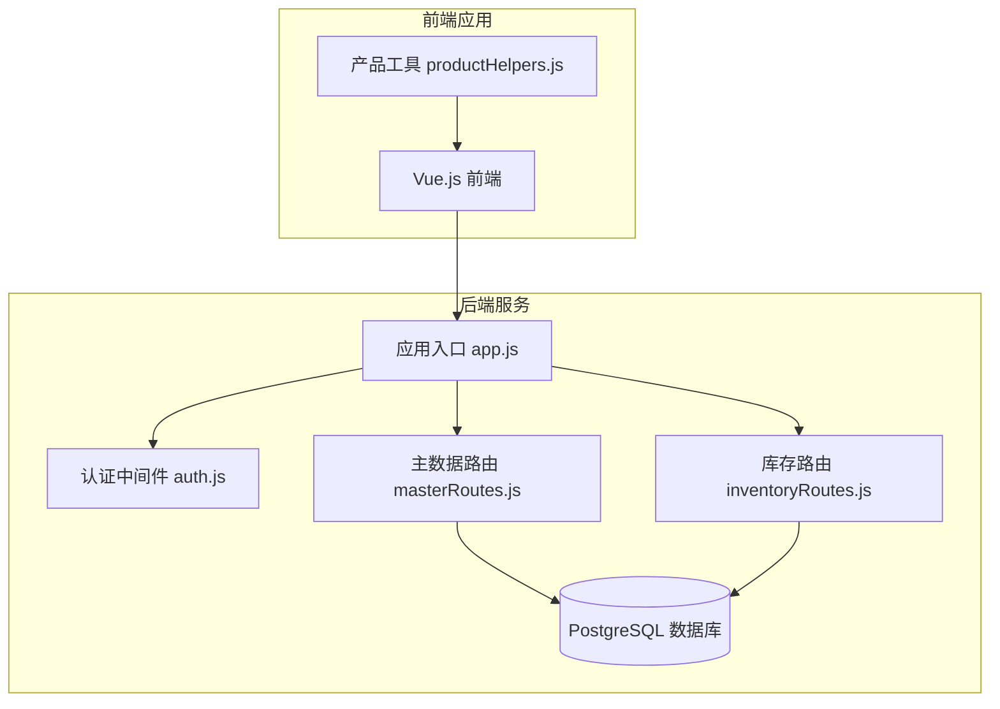
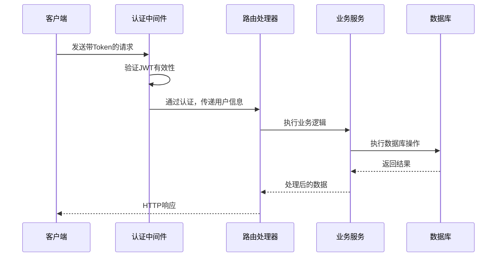
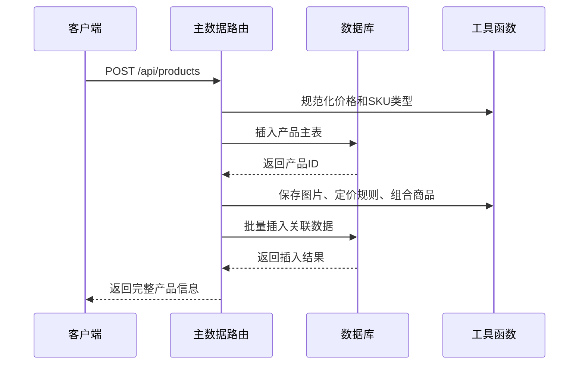
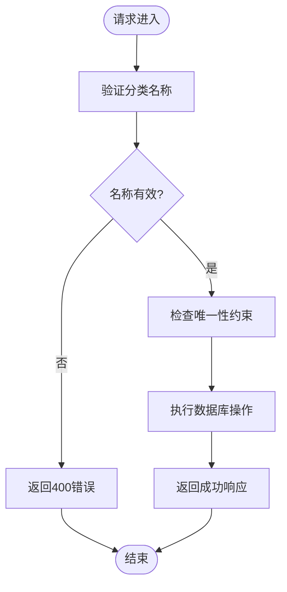
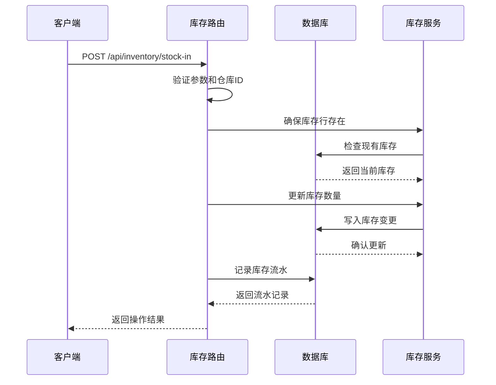
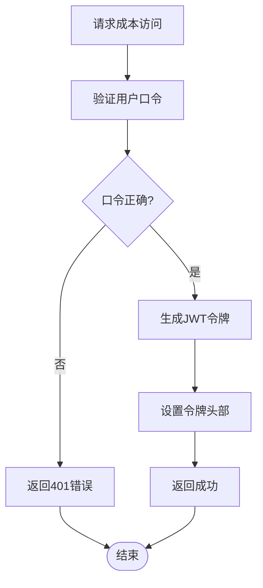
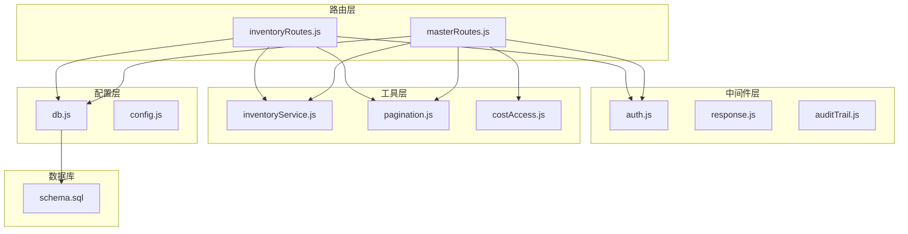
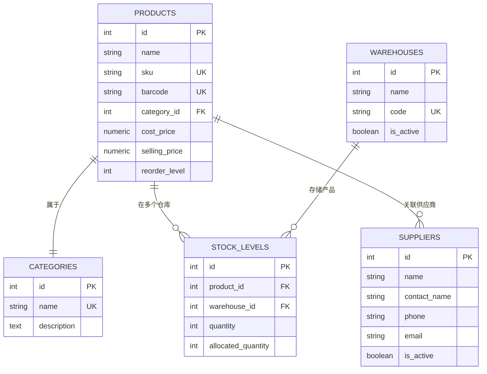

# 产品主数据API

<cite>
**本文档引用的文件**
- [masterRoutes.js](file://server/src/routes/masterRoutes.js)
- [inventoryRoutes.js](file://server/src/routes/inventoryRoutes.js)
- [schema.sql](file://server/database/schema.sql)
- [seed.sql](file://server/database/seed.sql)
- [app.js](file://server/src/app.js)
- [auth.js](file://server/src/middleware/auth.js)
- [inventoryService.js](file://server/src/utils/inventoryService.js)
- [productHelpers.js](file://web/src/utils/productHelpers.js)
- [inventory_system_backend.postman_collection.json](file://postman/inventory_system_backend.postman_collection.json)
</cite>

## 目录
1. [简介](#简介)
2. [项目结构](#项目结构)
3. [核心组件](#核心组件)
4. [架构概览](#架构概览)
5. [详细组件分析](#详细组件分析)
6. [依赖关系分析](#依赖关系分析)
7. [性能考虑](#性能考虑)
8. [故障排除指南](#故障排除指南)
9. [结论](#结论)
10. [附录](#附录)

## 简介
本文件为库存管理系统中的产品主数据API文档，涵盖产品、分类、品牌（供应商）等主数据的CRUD操作接口。重点说明产品信息管理、分类体系维护、条形码管理、产品图片上传、规格属性定义以及多仓库价格管理。同时提供批量导入导出、数据验证和冲突处理机制的说明。

## 项目结构
后端采用Express.js + PostgreSQL架构，API通过RESTful路由组织，主数据相关功能集中在masterRoutes中，库存相关在inventoryRoutes中。前端使用Vue.js，提供产品标签打印、二维码生成等功能辅助。

**图表来源**
- [app.js:1-67](file://server/src/app.js#L1-L67)
- [masterRoutes.js:1-1513](file://server/src/routes/masterRoutes.js#L1-L1513)
- [inventoryRoutes.js:1-493](file://server/src/routes/inventoryRoutes.js#L1-L493)

**章节来源**
- [app.js:1-67](file://server/src/app.js#L1-L67)
- [masterRoutes.js:1-1513](file://server/src/routes/masterRoutes.js#L1-L1513)
- [inventoryRoutes.js:1-493](file://server/src/routes/inventoryRoutes.js#L1-L493)

## 核心组件
- 认证与授权中间件：基于JWT的用户认证和角色授权
- 主数据路由：产品、分类、仓库、供应商的CRUD操作
- 库存路由：库存查询、出入库、调拨、分配等操作
- 数据访问层：统一的数据库查询和事务处理
- 工具函数：成本访问令牌、库存操作封装、产品助手

**章节来源**
- [auth.js:1-46](file://server/src/middleware/auth.js#L1-L46)
- [masterRoutes.js:1-1513](file://server/src/routes/masterRoutes.js#L1-L1513)
- [inventoryRoutes.js:1-493](file://server/src/routes/inventoryRoutes.js#L1-L493)
- [inventoryService.js:1-45](file://server/src/utils/inventoryService.js#L1-L45)

## 架构概览
系统采用分层架构，路由层负责HTTP请求处理，业务逻辑层处理数据转换和规则计算，数据访问层负责数据库交互。所有API均经过认证中间件保护，并根据角色进行权限控制。

**图表来源**
- [auth.js:5-29](file://server/src/middleware/auth.js#L5-L29)
- [masterRoutes.js:1258-1360](file://server/src/routes/masterRoutes.js#L1258-L1360)
- [inventoryRoutes.js:229-403](file://server/src/routes/inventoryRoutes.js#L229-L403)

## 详细组件分析

### 产品管理API

#### 产品CRUD操作
- GET /api/products - 获取产品列表，支持搜索、分页、状态筛选
- GET /api/products/:id - 获取产品详情，包含图片、定价规则、库存等关联信息
- POST /api/products - 创建新产品，支持批量图片、定价规则、组合商品
- PUT /api/products/:id - 更新产品信息，支持成本价变更审计
- DELETE /api/products/:id - 删除产品

**图表来源**
- [masterRoutes.js:1258-1360](file://server/src/routes/masterRoutes.js#L1258-L1360)
- [masterRoutes.js:377-463](file://server/src/routes/masterRoutes.js#L377-L463)

#### 条形码管理
- 支持唯一性约束，确保条形码不重复
- 条形码可为空，用于无条形码商品
- 查询时支持按条形码模糊匹配

**章节来源**
- [masterRoutes.js:892-1022](file://server/src/routes/masterRoutes.js#L892-L1022)
- [schema.sql:32-54](file://server/database/schema.sql#L32-L54)

### 分类管理API

#### 分类CRUD操作
- GET /api/categories - 获取分类列表，支持搜索和全量加载
- POST /api/categories - 创建分类
- PUT /api/categories/:id - 更新分类
- DELETE /api/categories/:id - 删除分类

**图表来源**
- [masterRoutes.js:718-773](file://server/src/routes/masterRoutes.js#L718-L773)
- [schema.sql:15-20](file://server/database/schema.sql#L15-L20)

**章节来源**
- [masterRoutes.js:664-773](file://server/src/routes/masterRoutes.js#L664-L773)

### 供应商管理API

#### 供应商CRUD操作
- GET /api/suppliers - 供应商列表查询
- POST /api/suppliers - 创建供应商
- PUT /api/suppliers/:id - 更新供应商
- DELETE /api/suppliers/:id - 删除供应商

**章节来源**
- [masterRoutes.js:1228-1256](file://server/src/routes/masterRoutes.js#L1228-L1256)

### 仓库管理API

#### 仓库CRUD操作
- GET /api/warehouses - 仓库列表查询，支持激活状态筛选
- POST /api/warehouses - 创建仓库
- PUT /api/warehouses/:id - 更新仓库
- DELETE /api/warehouses/:id - 删除仓库

**章节来源**
- [masterRoutes.js:775-889](file://server/src/routes/masterRoutes.js#L775-L889)

### 库存管理API

#### 库存查询
- GET /api/inventory - 库存总览，支持多条件筛选和分页
- GET /api/inventory/transactions - 库存流水查询

#### 库存操作
- POST /api/inventory/stock-in - 入库操作
- POST /api/inventory/stock-out - 出库操作  
- POST /api/inventory/transfer - 调拨操作
- POST /api/inventory/allocate - 库存分配/释放

**图表来源**
- [inventoryRoutes.js:229-403](file://server/src/routes/inventoryRoutes.js#L229-L403)
- [inventoryService.js:1-45](file://server/src/utils/inventoryService.js#L1-L45)

**章节来源**
- [inventoryRoutes.js:16-151](file://server/src/routes/inventoryRoutes.js#L16-L151)
- [inventoryRoutes.js:405-490](file://server/src/routes/inventoryRoutes.js#L405-L490)

### 成本访问管理

#### 成本访问令牌
- POST /api/products/cost-access - 验证用户口令获取成本访问令牌
- 通过自定义头部x-cost-access-token访问敏感成本数据

**图表来源**
- [masterRoutes.js:1024-1052](file://server/src/routes/masterRoutes.js#L1024-L1052)

**章节来源**
- [masterRoutes.js:1024-1052](file://server/src/routes/masterRoutes.js#L1024-L1052)

## 依赖关系分析

**图表来源**
- [masterRoutes.js:1-11](file://server/src/routes/masterRoutes.js#L1-L11)
- [inventoryRoutes.js:1-6](file://server/src/routes/inventoryRoutes.js#L1-L6)
- [auth.js:1-46](file://server/src/middleware/auth.js#L1-L46)

**章节来源**
- [masterRoutes.js:1-11](file://server/src/routes/masterRoutes.js#L1-L11)
- [inventoryRoutes.js:1-6](file://server/src/routes/inventoryRoutes.js#L1-L6)

## 性能考虑
- 分页查询：所有列表接口均支持分页，避免大数据量一次性传输
- 并行查询：复杂查询使用Promise.all并行获取关联数据
- 索引优化：数据库为关键字段建立索引，提升查询性能
- 事务处理：库存操作使用数据库事务保证数据一致性
- 缓存策略：成本价格历史限制最近5条记录，避免无限增长

## 故障排除指南

### 常见错误及解决方案
- 401 未认证：检查Authorization头部是否包含有效的Bearer Token
- 403 权限不足：确认用户角色是否具备相应操作权限
- 400 参数错误：检查必填字段是否完整，数据格式是否正确
- 404 资源不存在：确认ID是否存在且未被删除
- 409 数据冲突：检查唯一性约束（SKU、条形码、仓库编码等）

### 数据验证规则
- 产品：名称和SKU为必填，SKU需唯一
- 分类：名称需唯一
- 仓库：名称和编码需唯一
- 库存：数量必须为正数，分配数量不能超过可用数量

**章节来源**
- [masterRoutes.js:1284-1286](file://server/src/routes/masterRoutes.js#L1284-L1286)
- [schema.sql:32-54](file://server/database/schema.sql#L32-L54)

## 结论
该产品主数据API提供了完整的主数据管理能力，包括产品、分类、供应商、仓库等核心实体的CRUD操作。系统通过严格的权限控制、数据验证和事务处理确保了数据的一致性和安全性。同时，丰富的查询筛选和分页机制满足了大规模数据场景下的性能需求。

## 附录

### API端点一览
- 产品：GET/POST/PUT/DELETE /api/products
- 产品详情：GET /api/products/:id
- 产品成本访问：POST /api/products/cost-access
- 产品成本历史：GET /api/products/:id/cost-price-history
- 产品主供应商：PUT /api/products/:id/primary-supplier
- 分类：GET/POST/PUT/DELETE /api/categories
- 仓库：GET/POST/PUT/DELETE /api/warehouses
- 供应商：GET/POST/PUT/DELETE /api/suppliers
- 库存：GET /api/inventory
- 库存流水：GET /api/inventory/transactions
- 入库：POST /api/inventory/stock-in
- 出库：POST /api/inventory/stock-out
- 调拨：POST /api/inventory/transfer
- 分配：POST /api/inventory/allocate

### 数据模型关系

**图表来源**
- [schema.sql:32-54](file://server/database/schema.sql#L32-L54)
- [schema.sql:15-20](file://server/database/schema.sql#L15-L20)
- [schema.sql:22-30](file://server/database/schema.sql#L22-L30)
- [schema.sql:302-318](file://server/database/schema.sql#L302-L318)
- [schema.sql:125-133](file://server/database/schema.sql#L125-L133)