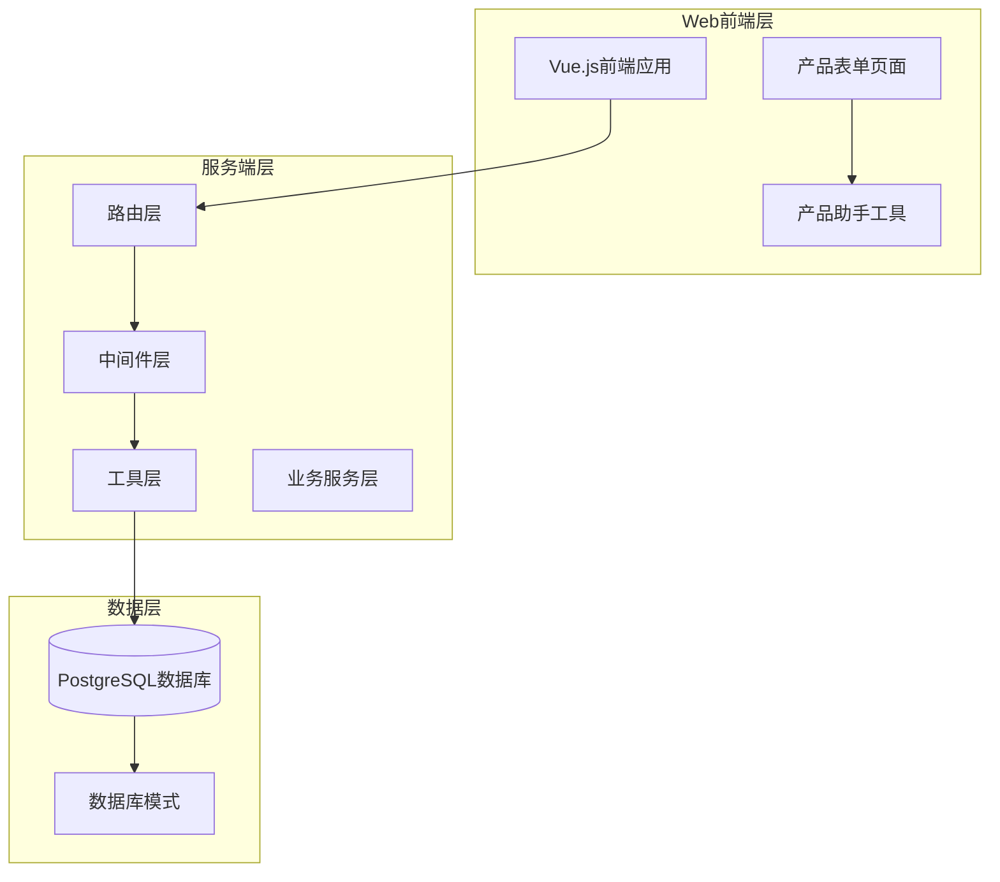
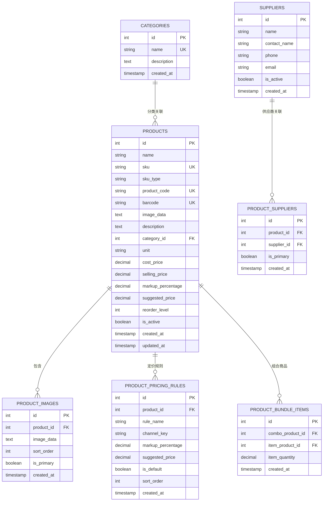
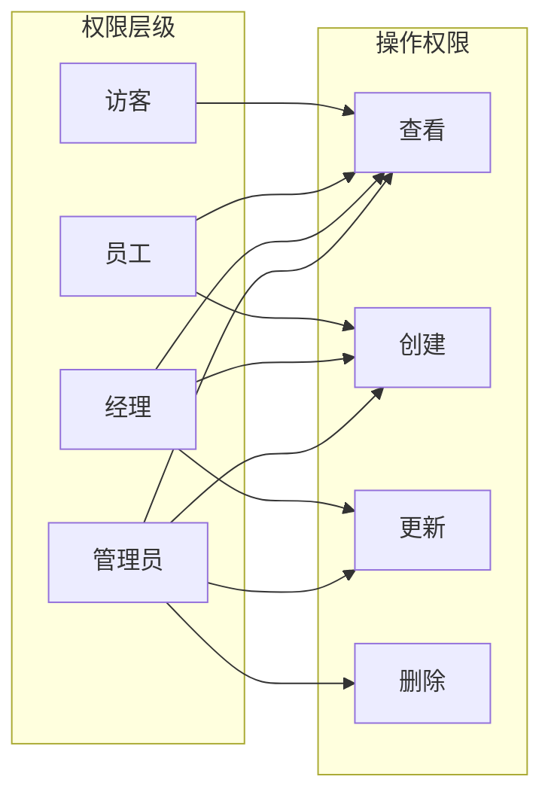
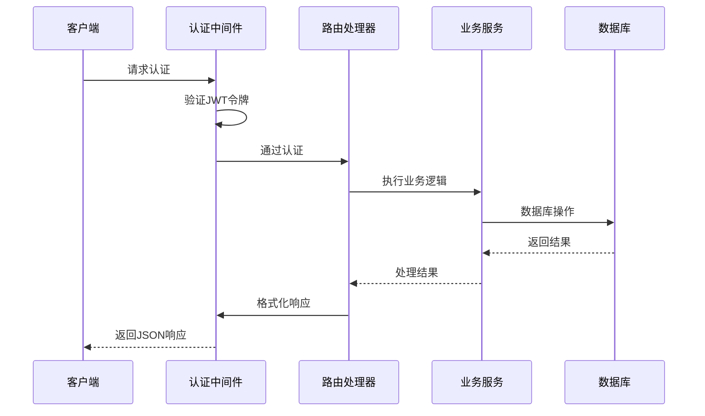
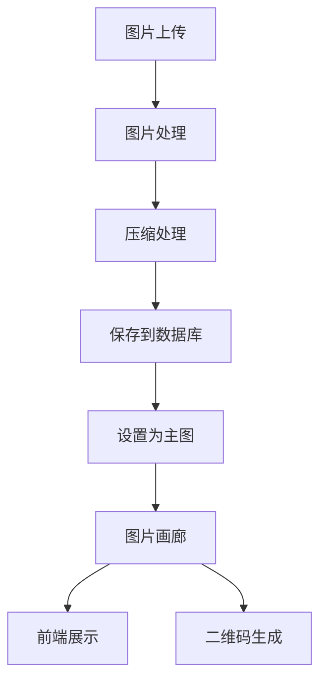
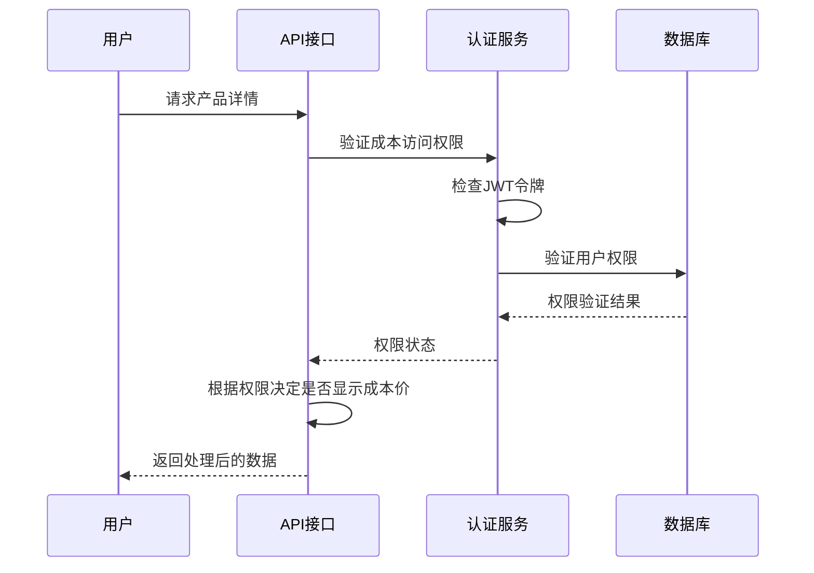
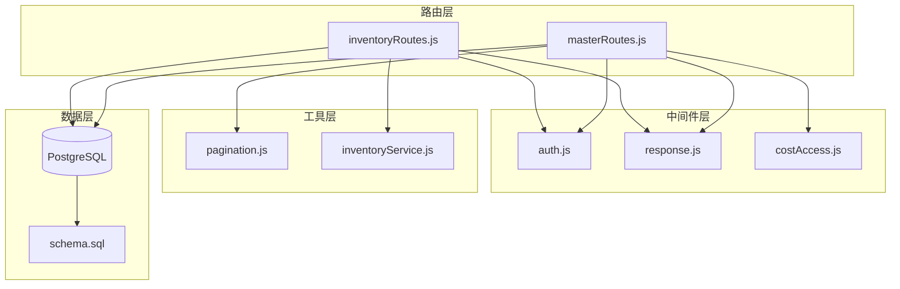
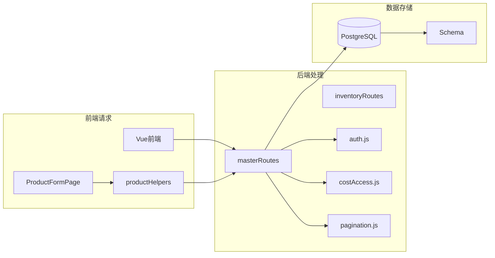
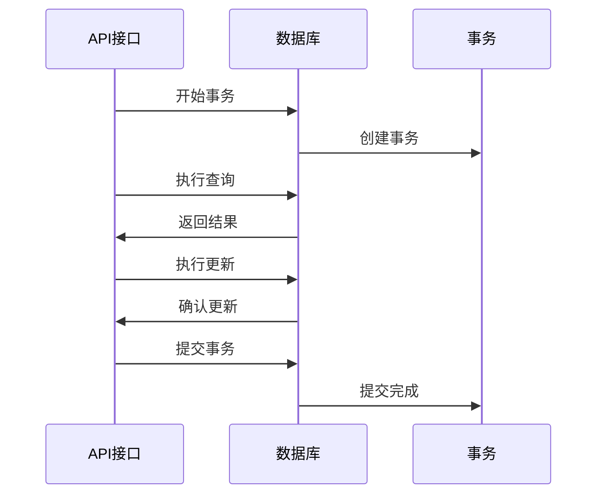
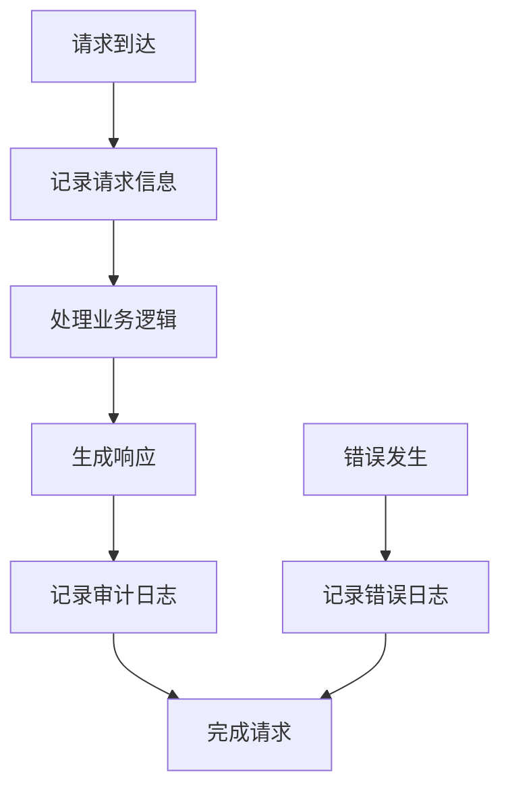

# 产品管理API

<cite>
**本文档引用的文件**
- [masterRoutes.js](file://server/src/routes/masterRoutes.js)
- [inventoryRoutes.js](file://server/src/routes/inventoryRoutes.js)
- [schema.sql](file://server/database/schema.sql)
- [auth.js](file://server/src/middleware/auth.js)
- [response.js](file://server/src/middleware/response.js)
- [pagination.js](file://server/src/utils/pagination.js)
- [costAccess.js](file://server/src/utils/costAccess.js)
- [inventoryService.js](file://server/src/utils/inventoryService.js)
- [productHelpers.js](file://web/src/utils/productHelpers.js)
- [ProductFormPage.vue](file://web/src/pages/ProductFormPage.vue)
</cite>

## 目录
1. [简介](#简介)
2. [项目结构](#项目结构)
3. [核心组件](#核心组件)
4. [架构概览](#架构概览)
5. [详细组件分析](#详细组件分析)
6. [依赖关系分析](#依赖关系分析)
7. [性能考虑](#性能考虑)
8. [故障排除指南](#故障排除指南)
9. [结论](#结论)

## 简介

产品管理API是库存管理系统的核心模块，负责产品的完整生命周期管理。该系统提供了完整的CRUD操作接口，支持产品基本信息管理、图片上传与管理、分类关联、供应商关联等功能。系统采用现代化的架构设计，具备高性能的搜索过滤、分页查询能力，并支持批量操作和高级权限控制。

## 项目结构

系统采用分层架构设计，主要分为以下几个层次：



**图表来源**
- [masterRoutes.js:1-50](file://server/src/routes/masterRoutes.js#L1-L50)
- [schema.sql:1-60](file://server/database/schema.sql#L1-L60)

**章节来源**
- [masterRoutes.js:1-100](file://server/src/routes/masterRoutes.js#L1-L100)
- [schema.sql:1-100](file://server/database/schema.sql#L1-L100)

## 核心组件

### 数据模型

系统基于以下核心数据模型构建：



**图表来源**
- [schema.sql:32-87](file://server/database/schema.sql#L32-L87)
- [schema.sql:161-172](file://server/database/schema.sql#L161-L172)

### 权限控制体系

系统实现了多层次的权限控制机制：



**图表来源**
- [auth.js:32-40](file://server/src/middleware/auth.js#L32-L40)

**章节来源**
- [auth.js:1-46](file://server/src/middleware/auth.js#L1-L46)
- [costAccess.js:1-32](file://server/src/utils/costAccess.js#L1-L32)

## 架构概览

系统采用RESTful API设计，结合中间件模式实现统一的请求处理流程：



**图表来源**
- [auth.js:5-29](file://server/src/middleware/auth.js#L5-L29)
- [response.js:9-34](file://server/src/middleware/response.js#L9-L34)

## 详细组件分析

### 产品管理核心API

#### GET /master/products - 产品列表查询

**功能描述**: 支持多维度的产品查询和筛选，包括搜索、状态过滤、分类筛选等。

**请求参数**:
- `search`: 搜索关键词（支持名称、SKU、产品编码、条码、描述）
- `activeOnly`: 是否仅显示激活状态（true/false）
- `all`: 是否返回所有数据（true/false）
- `categoryId`: 分类ID筛选
- `status`: 状态筛选（all/active/inactive）
- `hasBarcode`: 条码存在性筛选（all/yes/no）
- `pricingChannel`: 定价渠道
- `page`: 页码，默认1
- `pageSize`: 每页数量，默认10，最大100

**响应结构**:
```javascript
{
  "items": [
    {
      "id": 1,
      "name": "产品名称",
      "sku": "SKU001",
      "product_code": "PRD-00001",
      "barcode": "123456789",
      "category_id": 1,
      "unit": "pcs",
      "cost_price": 100.00,
      "selling_price": 150.00,
      "markup_percentage": 50.00,
      "suggested_price": 150.00,
      "reorder_level": 10,
      "is_active": true,
      "images": [],
      "pricing_rules": [],
      "bundle_items": []
    }
  ],
  "pagination": {
    "total": 100,
    "page": 1,
    "pageSize": 10,
    "totalPages": 10
  }
}
```

**章节来源**
- [masterRoutes.js:892-1022](file://server/src/routes/masterRoutes.js#L892-L1022)
- [pagination.js:1-28](file://server/src/utils/pagination.js#L1-L28)

#### GET /master/products/:id - 获取产品详情

**功能描述**: 获取单个产品的详细信息，包括库存状态、最近交易记录、预警信息等。

**路径参数**:
- `id`: 产品ID

**查询参数**:
- `pricingChannel`: 定价渠道

**响应内容**:
- `product`: 产品基础信息
- `images`: 产品图片列表
- `pricingRules`: 定价规则
- `stockLevels`: 库存水平
- `recentMovements`: 最近交易记录
- `alerts`: 库存预警
- `supplier`: 主供应商
- `costPriceHistory`: 成本价格历史
- `summary`: 统计摘要

**章节来源**
- [masterRoutes.js:1054-1200](file://server/src/routes/masterRoutes.js#L1054-L1200)

#### POST /master/products - 创建产品

**功能描述**: 创建新产品，支持基本属性、图片、定价规则、组合商品等。

**请求体参数**:
- `name`: 产品名称（必需）
- `sku`: SKU（必需）
- `skuType`: SKU类型（SINGLE/COMBO，默认SINGLE）
- `productCode`: 产品编码（可选）
- `barcode`: 条码（可选）
- `imageData`: 主图片数据（可选）
- `images`: 图片数组（可选）
- `description`: 描述（可选）
- `usageGuide`: 使用指南（可选）
- `pros`: 优点（可选）
- `cons`: 缺点（可选）
- `categoryId`: 分类ID（可选）
- `unit`: 单位（默认pcs）
- `costPrice`: 成本价（可选）
- `sellingPrice`: 售价（可选）
- `markupPercentage`: 加价率（可选）
- `suggestedPrice`: 建议价（可选）
- `pricingRules`: 定价规则数组（可选）
- `bundleItems`: 组合商品项（可选）
- `reorderLevel`: 补货线（可选）
- `isActive`: 是否激活（默认true）
- `primarySupplierId`: 主供应商ID（可选）

**响应**: 返回创建的产品信息

**章节来源**
- [masterRoutes.js:1258-1360](file://server/src/routes/masterRoutes.js#L1258-L1360)

#### PUT /master/products/:id - 更新产品

**功能描述**: 更新现有产品信息，支持成本价变更的特殊权限控制。

**路径参数**:
- `id`: 产品ID

**请求体参数**:
- 支持所有创建产品的参数
- `costChangeReason`: 成本价变更原因（当变更成本价时必需）

**权限要求**:
- 成本价变更需要特殊权限验证
- 需要ADMIN或MANAGER角色

**章节来源**
- [masterRoutes.js:1362-1501](file://server/src/routes/masterRoutes.js#L1362-L1501)

#### DELETE /master/products/:id - 删除产品

**功能描述**: 删除指定产品，仅管理员可执行。

**路径参数**:
- `id`: 产品ID

**权限要求**: ADMIN角色

**章节来源**
- [masterRoutes.js:1503-1510](file://server/src/routes/masterRoutes.js#L1503-L1510)

### 产品图片管理API

#### 图片上传与管理

系统支持产品图片的上传、管理和展示：



**图表来源**
- [ProductFormPage.vue:223-244](file://web/src/pages/ProductFormPage.vue#L223-L244)
- [productHelpers.js:168-196](file://web/src/utils/productHelpers.js#L168-L196)

**章节来源**
- [ProductFormPage.vue:126-171](file://web/src/pages/ProductFormPage.vue#L126-L171)
- [productHelpers.js:168-196](file://web/src/utils/productHelpers.js#L168-L196)

### 库存管理API

#### 库存查询API

**GET /inventory/** - 库存总览查询

**功能描述**: 提供库存总量查询，支持搜索、分类筛选、仓库筛选、低库存筛选等。

**查询参数**:
- `search`: 搜索关键词
- `categoryId`: 分类ID
- `warehouseId`: 仓库ID
- `lowStockOnly`: 是否仅显示低库存
- `all`: 是否返回所有数据

**响应结构**:
包含产品基本信息、库存数量、可用数量、仓库信息等。

**章节来源**
- [inventoryRoutes.js:17-151](file://server/src/routes/inventoryRoutes.js#L17-L151)

#### 库存操作API

**POST /inventory/stock-in** - 入库操作
**POST /inventory/stock-out** - 出库操作  
**POST /inventory/transfer** - 转仓操作
**POST /inventory/allocate** - 预留/释放库存

**权限要求**: ADMIN, MANAGER, STAFF角色

**章节来源**
- [inventoryRoutes.js:405-490](file://server/src/routes/inventoryRoutes.js#L405-L490)

### 成本价格管理

#### 成本访问控制

系统实现了严格的成本价格访问控制：



**图表来源**
- [costAccess.js:25-27](file://server/src/utils/costAccess.js#L25-L27)
- [masterRoutes.js:119-130](file://server/src/routes/masterRoutes.js#L119-L130)

**章节来源**
- [costAccess.js:1-32](file://server/src/utils/costAccess.js#L1-L32)
- [masterRoutes.js:1024-1052](file://server/src/routes/masterRoutes.js#L1024-L1052)

## 依赖关系分析

### 组件间依赖关系



**图表来源**
- [masterRoutes.js:1-12](file://server/src/routes/masterRoutes.js#L1-L12)
- [inventoryRoutes.js:1-10](file://server/src/routes/inventoryRoutes.js#L1-L10)

### 数据流分析



**图表来源**
- [ProductFormPage.vue:1-50](file://web/src/pages/ProductFormPage.vue#L1-L50)
- [productHelpers.js:1-50](file://web/src/utils/productHelpers.js#L1-L50)

**章节来源**
- [ProductFormPage.vue:1-100](file://web/src/pages/ProductFormPage.vue#L1-L100)
- [productHelpers.js:1-100](file://web/src/utils/productHelpers.js#L1-L100)

## 性能考虑

### 查询优化策略

1. **索引优化**: 数据库为常用查询字段建立了适当的索引
2. **分页查询**: 默认每页10条记录，最大100条，防止大数据量查询
3. **延迟加载**: 关联数据采用按需加载策略
4. **缓存机制**: 对于不频繁变化的数据采用缓存策略

### 并发控制

系统使用数据库事务确保数据一致性：



**图表来源**
- [inventoryService.js:29-38](file://server/src/utils/inventoryService.js#L29-L38)

**章节来源**
- [inventoryService.js:1-45](file://server/src/utils/inventoryService.js#L1-L45)

## 故障排除指南

### 常见错误及解决方案

| 错误类型 | HTTP状态码 | 错误原因 | 解决方案 |
|---------|-----------|----------|----------|
| 认证失败 | 401 | 令牌缺失或过期 | 检查Authorization头，重新登录获取有效令牌 |
| 权限不足 | 403 | 角色权限不够 | 确认用户角色，申请相应权限 |
| 参数错误 | 400 | 请求参数无效 | 检查必填字段，确认数据格式 |
| 资源不存在 | 404 | 查找的资源不存在 | 确认ID正确性，检查数据是否存在 |

### 日志记录

系统实现了完整的审计日志记录：



**图表来源**
- [auth.js:5-29](file://server/src/middleware/auth.js#L5-L29)

**章节来源**
- [auth.js:1-46](file://server/src/middleware/auth.js#L1-L46)

## 结论

产品管理API系统提供了完整的企业级产品管理解决方案，具有以下特点：

1. **功能完整性**: 覆盖产品管理的所有核心功能
2. **安全性强**: 多层次权限控制和数据保护
3. **性能优化**: 合理的查询策略和索引设计
4. **扩展性强**: 模块化设计便于功能扩展
5. **用户体验好**: 前后端分离，界面友好

系统采用现代化的技术栈和最佳实践，为企业提供了可靠的产品管理基础设施。通过合理的权限控制和数据保护机制，确保了系统的安全性和可靠性。