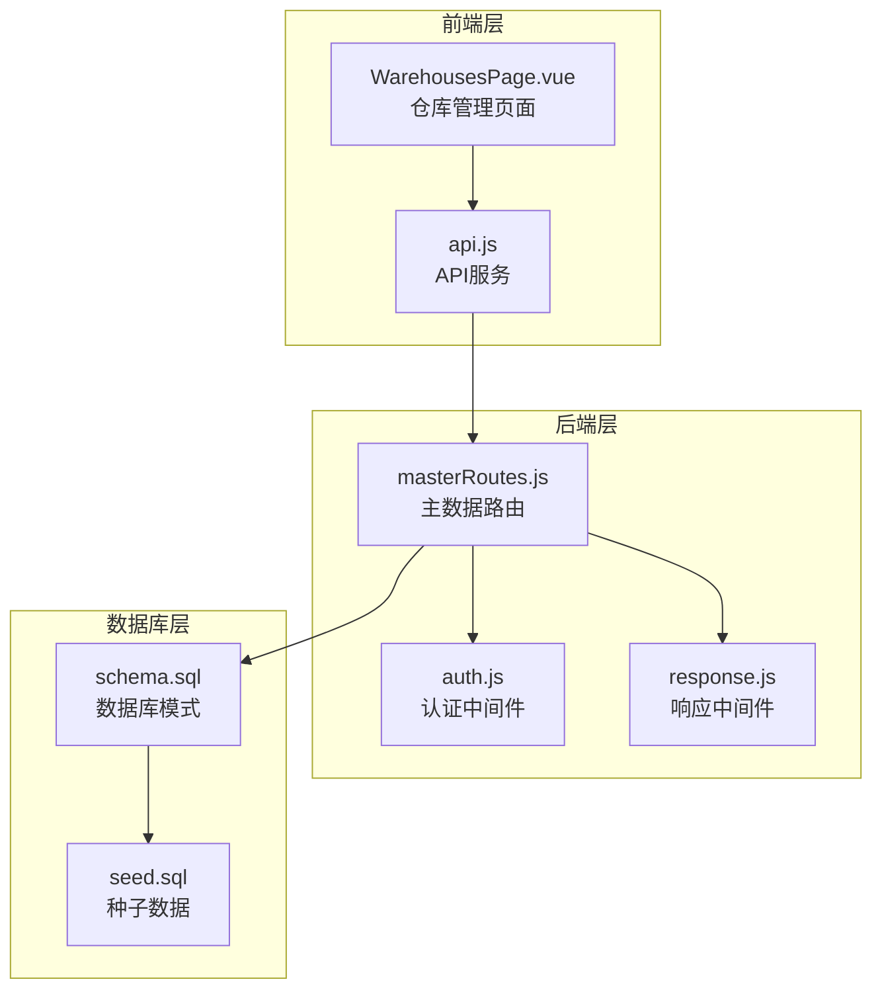
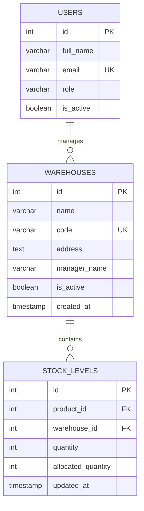
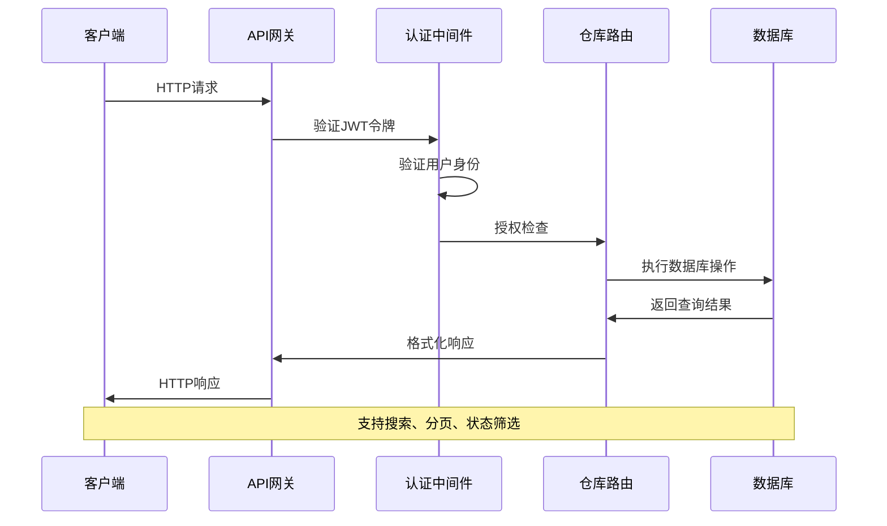
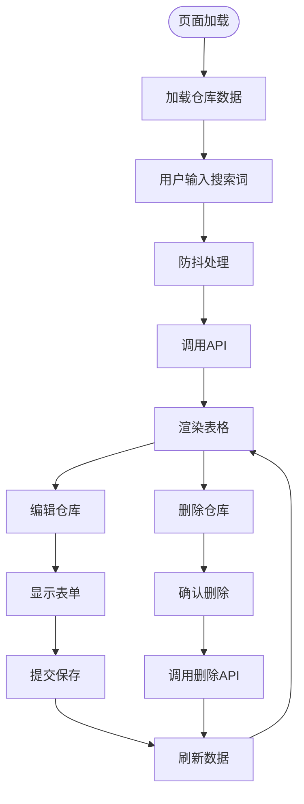
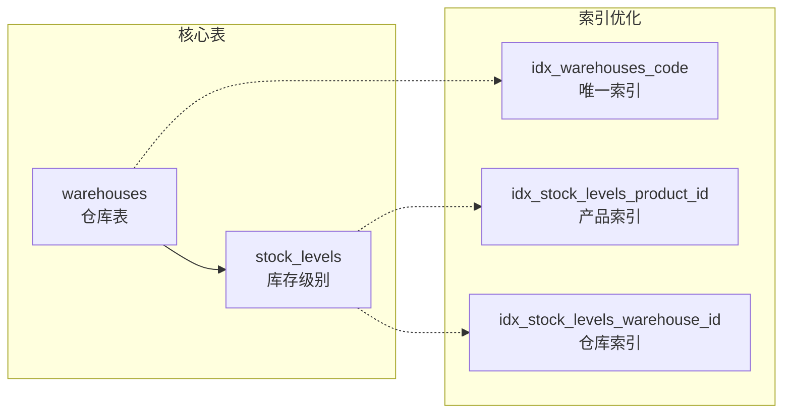
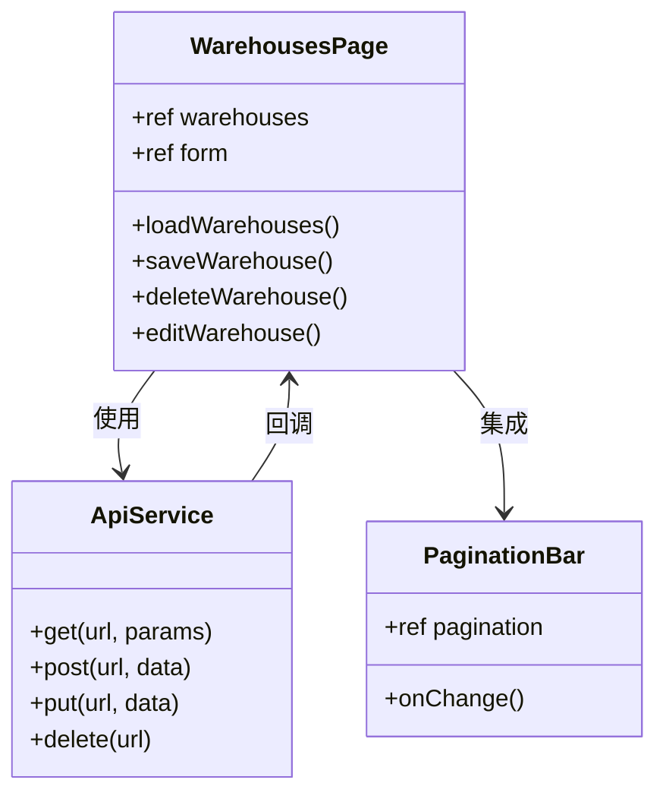

# 仓库管理API

<cite>
**本文档引用的文件**
- [masterRoutes.js](file://server/src/routes/masterRoutes.js)
- [schema.sql](file://server/database/schema.sql)
- [WAREHOUSE.md](file://POSTMAN_BACKEND_GUIDE.md)
- [WarehousesPage.vue](file://web/src/pages/WarehousesPage.vue)
- [api.js](file://web/src/services/api.js)
- [seed.sql](file://server/database/seed.sql)
</cite>

## 目录
1. [简介](#简介)
2. [项目结构](#项目结构)
3. [核心组件](#核心组件)
4. [架构概览](#架构概览)
5. [详细组件分析](#详细组件分析)
6. [依赖关系分析](#依赖关系分析)
7. [性能考虑](#性能考虑)
8. [故障排除指南](#故障排除指南)
9. [结论](#结论)

## 简介

仓库管理API是库存管理系统的核心功能模块，负责管理仓库的基本信息、状态和权限控制。该模块提供了完整的CRUD操作接口，支持仓库的创建、更新、删除和查询功能，同时集成了搜索、状态筛选、分页查询等高级功能。

系统采用基于角色的权限控制机制，确保只有具备相应权限的用户才能执行仓库管理操作。仓库信息包括名称、编码、地址、负责人等基本信息，以及激活状态管理功能。

## 项目结构

仓库管理功能在系统中的组织结构如下：



**图表来源**
- [masterRoutes.js:775-889](file://server/src/routes/masterRoutes.js#L775-L889)
- [schema.sql:22-30](file://server/database/schema.sql#L22-L30)

**章节来源**
- [masterRoutes.js:775-889](file://server/src/routes/masterRoutes.js#L775-L889)
- [schema.sql:22-30](file://server/database/schema.sql#L22-L30)

## 核心组件

### 数据模型

仓库管理涉及以下核心数据表：



**图表来源**
- [schema.sql:22-30](file://server/database/schema.sql#L22-L30)
- [schema.sql:125-133](file://server/database/schema.sql#L125-L133)

### 权限控制机制

系统采用基于角色的访问控制（RBAC）机制：

| 角色 | 可执行操作 |
|------|------------|
| ADMIN | 所有仓库管理操作 |
| MANAGER | 创建、更新、删除仓库 |
| STAFF | 仅能查看仓库信息 |

**章节来源**
- [masterRoutes.js:834-889](file://server/src/routes/masterRoutes.js#L834-L889)

## 架构概览

仓库管理API采用RESTful架构设计，遵循HTTP协议标准，提供统一的资源访问接口。



**图表来源**
- [masterRoutes.js:775-889](file://server/src/routes/masterRoutes.js#L775-L889)
- [schema.sql:22-30](file://server/database/schema.sql#L22-L30)

## 详细组件分析

### 仓库查询接口

#### GET /api/master/warehouses

**功能描述**: 获取仓库列表，支持搜索、状态筛选和分页查询

**请求参数**:
- `search`: 搜索关键词（可选）
- `activeOnly`: 仅显示激活状态（true/false，默认false）
- `all`: 是否返回所有数据（true/false，默认false）
- `page`: 页码（默认1）
- `pageSize`: 每页条数（1-100，默认10）

**响应结构**:
```javascript
{
  "items": [
    {
      "id": 1,
      "name": "主仓库",
      "code": "WH-MAIN",
      "address": "深圳总部",
      "manager_name": "Alice",
      "is_active": true,
      "created_at": "2024-01-01T00:00:00Z"
    }
  ],
  "pagination": {
    "total": 100,
    "page": 1,
    "pageSize": 10,
    "totalPages": 10
  }
}
```

**章节来源**
- [masterRoutes.js:776-832](file://server/src/routes/masterRoutes.js#L776-L832)

### 仓库创建接口

#### POST /api/master/warehouses

**功能描述**: 创建新仓库

**请求体参数**:
- `name`: 仓库名称（必填）
- `code`: 仓库编码（必填）
- `address`: 地址（可选）
- `managerName`: 负责人姓名（可选）
- `isActive`: 是否激活（可选，默认true）

**响应**: 返回创建的仓库对象

**章节来源**
- [masterRoutes.js:834-855](file://server/src/routes/masterRoutes.js#L834-L855)

### 仓库更新接口

#### PUT /api/master/warehouses/:id

**功能描述**: 更新现有仓库信息

**路径参数**:
- `id`: 仓库ID（必填）

**请求体参数**:
- `name`: 仓库名称（必填）
- `code`: 仓库编码（必填）
- `address`: 地址（可选）
- `managerName`: 负责人姓名（可选）
- `isActive`: 是否激活（可选）

**响应**: 返回更新后的仓库对象

**章节来源**
- [masterRoutes.js:857-880](file://server/src/routes/masterRoutes.js#L857-L880)

### 仓库删除接口

#### DELETE /api/master/warehouses/:id

**功能描述**: 删除仓库

**路径参数**:
- `id`: 仓库ID（必填）

**响应**: 204 No Content

**章节来源**
- [masterRoutes.js:882-889](file://server/src/routes/masterRoutes.js#L882-L889)

### 前端集成示例



**图表来源**
- [WarehousesPage.vue:28-98](file://web/src/pages/WarehousesPage.vue#L28-L98)

**章节来源**
- [WarehousesPage.vue:1-260](file://web/src/pages/WarehousesPage.vue#L1-L260)

## 依赖关系分析

### 数据库依赖

仓库管理功能依赖以下数据库表和索引：



**图表来源**
- [schema.sql:22-30](file://server/database/schema.sql#L22-L30)
- [schema.sql:125-133](file://server/database/schema.sql#L125-L133)
- [schema.sql:416-417](file://server/database/schema.sql#L416-L417)

### 前端依赖



**图表来源**
- [WarehousesPage.vue:1-260](file://web/src/pages/WarehousesPage.vue#L1-L260)
- [api.js:1-45](file://web/src/services/api.js#L1-L45)

**章节来源**
- [api.js:1-45](file://web/src/services/api.js#L1-L45)

## 性能考虑

### 分页优化

系统实现了智能分页机制，支持大数据量场景下的高效查询：

- **默认分页大小**: 10条记录
- **最大分页大小**: 100条记录  
- **全量加载**: 当`all=true`时返回所有数据
- **并发查询**: 使用Promise.all并行执行查询和计数

### 搜索优化

- **模糊搜索**: 支持按名称、编码、地址、负责人姓名搜索
- **条件筛选**: 支持激活状态筛选
- **索引优化**: 仓库表建立唯一索引提高查询性能

### 缓存策略

- **响应缓存**: 使用ETag和Last-Modified头实现缓存控制
- **数据库连接池**: 复用数据库连接减少连接开销
- **批量操作**: 支持批量删除和更新操作

## 故障排除指南

### 常见错误及解决方案

| 错误类型 | 错误代码 | 描述 | 解决方案 |
|----------|----------|------|----------|
| 认证失败 | 401 | 令牌缺失或无效 | 检查Authorization头是否正确设置 |
| 权限不足 | 403 | 角色权限不足 | 确认用户角色具有相应权限 |
| 参数错误 | 400 | 请求参数不合法 | 检查必需参数是否完整 |
| 数据冲突 | 409 | 编码重复 | 修改仓库编码确保唯一性 |
| 服务器错误 | 500 | 服务器内部错误 | 查看服务器日志获取详细信息 |

### 调试建议

1. **检查网络连接**: 确保API端点可达
2. **验证令牌格式**: 确保使用Bearer前缀的JWT令牌
3. **检查数据库连接**: 验证数据库服务正常运行
4. **查看服务器日志**: 分析错误堆栈信息
5. **测试基本功能**: 先进行简单的GET请求验证

**章节来源**
- [masterRoutes.js:776-889](file://server/src/routes/masterRoutes.js#L776-L889)

## 结论

仓库管理API提供了完整的企业级仓库管理功能，具有以下特点：

### 核心优势
- **完整的CRUD操作**: 支持仓库的创建、查询、更新、删除
- **灵活的查询功能**: 支持搜索、状态筛选、分页查询
- **严格的权限控制**: 基于角色的访问控制机制
- **高性能设计**: 优化的数据库查询和缓存策略
- **前后端分离**: 清晰的API接口和前端集成

### 技术特色
- **RESTful设计**: 符合HTTP协议标准的API设计
- **数据完整性**: 数据库约束确保数据一致性
- **安全性**: JWT认证和权限验证机制
- **可扩展性**: 模块化的架构设计便于功能扩展

### 应用价值
该API模块为企业提供了可靠的仓库管理基础，支持多仓库配置、库存跟踪、权限控制等核心业务需求，为整个库存管理系统的稳定运行奠定了坚实基础。