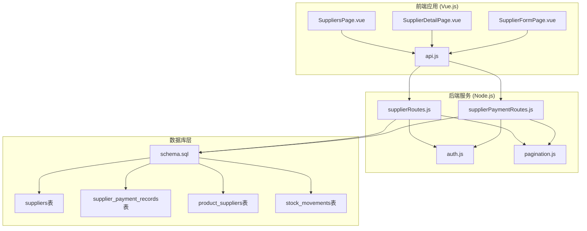
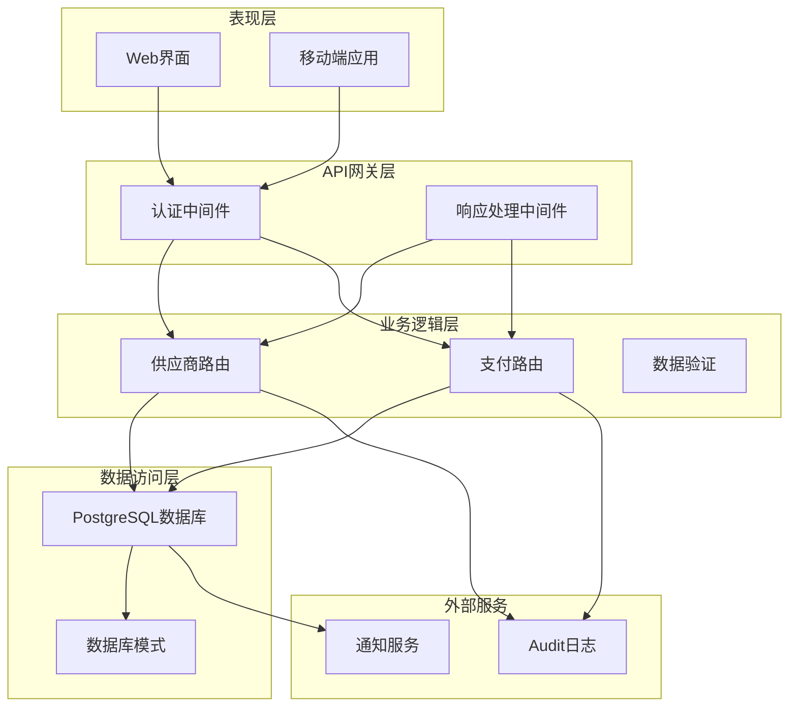
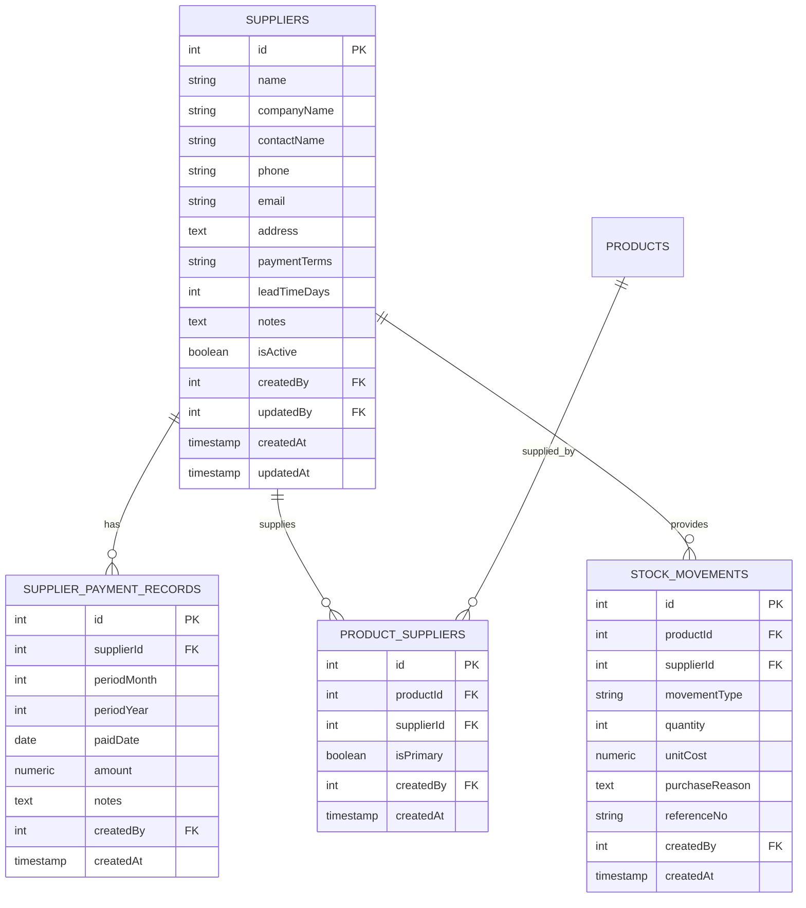
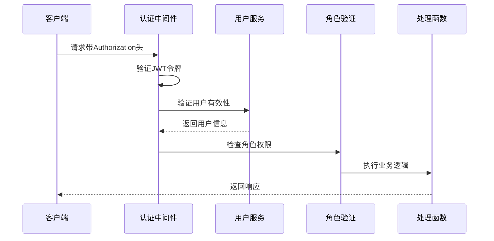
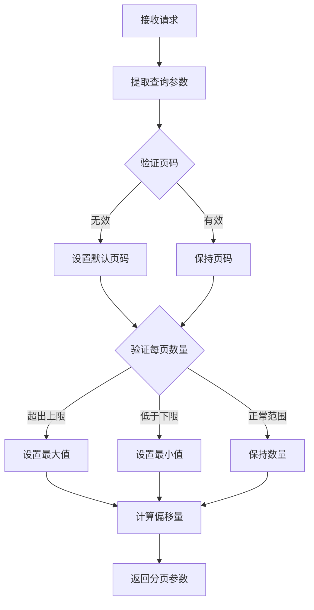

# 供应商管理API

<cite>
**本文档引用的文件**
- [server/src/routes/supplierRoutes.js](file://server/src/routes/supplierRoutes.js)
- [server/src/routes/supplierPaymentRoutes.js](file://server/src/routes/supplierPaymentRoutes.js)
- [server/database/schema.sql](file://server/database/schema.sql)
- [server/src/middleware/auth.js](file://server/src/middleware/auth.js)
- [server/src/utils/pagination.js](file://server/src/utils/pagination.js)
- [web/src/pages/SuppliersPage.vue](file://web/src/pages/SuppliersPage.vue)
- [web/src/pages/SupplierDetailPage.vue](file://web/src/pages/SupplierDetailPage.vue)
- [web/src/pages/SupplierFormPage.vue](file://web/src/pages/SupplierFormPage.vue)
- [web/src/services/api.js](file://web/src/services/api.js)
</cite>

## 目录
1. [简介](#简介)
2. [项目结构](#项目结构)
3. [核心组件](#核心组件)
4. [架构概览](#架构概览)
5. [详细组件分析](#详细组件分析)
6. [依赖关系分析](#依赖关系分析)
7. [性能考虑](#性能考虑)
8. [故障排除指南](#故障排除指南)
9. [结论](#结论)

## 简介

供应商管理API是库存管理系统中的核心功能模块，负责供应商的全生命周期管理。该系统提供了完整的供应商CRUD操作接口，包括供应商基本信息管理、分类管理、信用额度管理、付款条件设置等功能。系统支持供应商搜索、分页查询、统计分析等高级功能，并集成了供应商对账和采购历史查询等业务功能。

本API采用RESTful设计原则，基于Express.js框架构建，使用PostgreSQL作为数据库存储，实现了完整的数据验证、错误处理和审计日志功能。

## 项目结构

供应商管理功能在项目中的组织结构如下：



**图表来源**
- [server/src/routes/supplierRoutes.js:1-370](file://server/src/routes/supplierRoutes.js#L1-L370)
- [server/src/routes/supplierPaymentRoutes.js:1-177](file://server/src/routes/supplierPaymentRoutes.js#L1-L177)
- [server/database/schema.sql:302-366](file://server/database/schema.sql#L302-L366)

**章节来源**
- [server/src/routes/supplierRoutes.js:1-370](file://server/src/routes/supplierRoutes.js#L1-L370)
- [server/src/routes/supplierPaymentRoutes.js:1-177](file://server/src/routes/supplierPaymentRoutes.js#L1-L177)
- [server/database/schema.sql:302-366](file://server/database/schema.sql#L302-L366)

## 核心组件

### 供应商路由模块 (supplierRoutes.js)

供应商路由模块提供了完整的供应商管理接口，包含以下核心功能：

- **供应商查询**: 支持多字段搜索、状态过滤、排序和分页
- **供应商创建**: 完整的供应商信息录入和验证
- **供应商更新**: 详细的供应商信息修改功能
- **状态管理**: 启用/停用供应商状态切换
- **供应商删除**: 安全的供应商删除机制
- **详细信息**: 提供供应商关联产品和采购历史

### 供应商支付路由模块 (supplierPaymentRoutes.js)

供应商支付路由模块专注于供应商对账和支付记录管理：

- **支付记录查询**: 支持按供应商和年份过滤的支付记录列表
- **支付汇总**: 年度支付汇总统计功能
- **支付记录创建**: 月度支付记录的创建和更新
- **支付记录删除**: 支付记录的删除功能

### 数据库架构

系统采用关系型数据库设计，主要表结构包括：

- **suppliers**: 存储供应商基本信息
- **supplier_payment_records**: 记录供应商支付历史
- **product_suppliers**: 维护供应商与产品的关联关系
- **stock_movements**: 记录与供应商相关的采购入库信息

**章节来源**
- [server/src/routes/supplierRoutes.js:23-367](file://server/src/routes/supplierRoutes.js#L23-L367)
- [server/src/routes/supplierPaymentRoutes.js:19-174](file://server/src/routes/supplierPaymentRoutes.js#L19-L174)
- [server/database/schema.sql:302-366](file://server/database/schema.sql#L302-L366)

## 架构概览

系统采用分层架构设计，确保了良好的可维护性和扩展性：



**图表来源**
- [server/src/middleware/auth.js:1-46](file://server/src/middleware/auth.js#L1-L46)
- [server/src/middleware/response.js:1-62](file://server/src/middleware/response.js#L1-L62)
- [server/src/routes/supplierRoutes.js:1-370](file://server/src/routes/supplierRoutes.js#L1-L370)
- [server/src/routes/supplierPaymentRoutes.js:1-177](file://server/src/routes/supplierPaymentRoutes.js#L1-L177)

## 详细组件分析

### 供应商CRUD操作

#### 供应商创建接口

供应商创建接口支持完整的供应商信息录入，包括基本信息、联系方式、业务信息等。

**请求方法**: POST `/api/suppliers`

**请求头**:
- Authorization: Bearer {token}
- Content-Type: application/json

**请求体参数**:
| 参数名 | 类型 | 必填 | 描述 |
|--------|------|------|------|
| name | string | 是 | 公司名称 *
| contactName | string | 否 | 联系人姓名 |
| phone | string | 否 | 联系电话 |
| email | string | 否 | 邮箱地址 |
| address | string | 否 | 地址信息 |
| paymentTerms | string | 否 | 付款条件 |
| leadTimeDays | number | 否 | 交货周期（天） |
| branch | string | 否 | 分公司 |
| businessHours | string | 否 | 营业时间 |
| parentCompany | string | 向 | 母公司 |
| mapLink | string | 否 | 地图链接 |
| notes | string | 否 | 备注信息 |
| isActive | boolean | 否 | 是否启用 |

**响应示例**:
```json
{
  "id": 1,
  "name": "ABC科技有限公司",
  "companyName": "ABC科技有限公司",
  "contactName": "张三",
  "phone": "13800001111",
  "email": "zhangsan@abc.com",
  "address": "广东省深圳市南山区科技园",
  "paymentTerms": "1_month",
  "leadTimeDays": 7,
  "branch": "深圳分公司",
  "businessHours": "9:00-18:00",
  "parentCompany": "ABC集团",
  "mapLink": "https://maps.google.com/...",
  "notes": "长期合作伙伴",
  "isActive": true,
  "createdBy": 1,
  "updatedBy": 1,
  "createdAt": "2024-01-15T10:30:00Z",
  "updatedAt": "2024-01-15T10:30:00Z"
}
```

#### 供应商查询接口

供应商查询接口支持复杂的搜索、过滤和排序功能。

**请求方法**: GET `/api/suppliers`

**查询参数**:
| 参数名 | 类型 | 默认值 | 描述 |
|--------|------|--------|------|
| search | string | '' | 搜索关键词（支持公司名、联系人、电话、邮箱） |
| status | string | 'all' | 状态过滤 (all/active/inactive) |
| sortBy | string | 'updated_at' | 排序字段 (name/created_at/updated_at/lead_time_days) |
| sortOrder | string | 'desc' | 排序顺序 (asc/desc) |
| page | number | 1 | 页码 |
| pageSize | number | 10 | 每页条数 (1-100) |

**响应结构**:
```json
{
  "items": [
    {
      "id": 1,
      "name": "ABC科技有限公司",
      "linkedProductCount": 15
    }
  ],
  "pagination": {
    "total": 100,
    "page": 1,
    "pageSize": 10,
    "totalPages": 10
  }
}
```

#### 供应商详细信息

**请求方法**: GET `/api/suppliers/:id`

**路径参数**:
- id: 供应商ID

**响应包含**:
- 供应商基本信息
- 关联产品列表（主供应商/次要供应商标识）
- 最近采购记录（最近10条入库记录）

#### 供应商更新接口

**请求方法**: PUT `/api/suppliers/:id`

**路径参数**:
- id: 供应商ID

**请求体**: 与创建接口相同的参数结构

#### 供应商状态更新

**请求方法**: PATCH `/api/suppliers/:id/status`

**请求体**:
```json
{
  "isActive": true
}
```

#### 供应商删除接口

**请求方法**: DELETE `/api/suppliers/:id`

**安全机制**: 删除前会检查供应商是否存在，删除后记录审计日志。

**章节来源**
- [server/src/routes/supplierRoutes.js:94-367](file://server/src/routes/supplierRoutes.js#L94-L367)

### 供应商支付管理

#### 支付记录查询

**请求方法**: GET `/api/supplier-payments`

**查询参数**:
| 参数名 | 类型 | 描述 |
|--------|------|------|
| supplierId | number | 供应商ID |
| year | number | 年份 |
| page | number | 页码 |
| pageSize | number | 每页条数 |

**响应示例**:
```json
{
  "items": [
    {
      "id": 1,
      "supplierId": 1,
      "periodMonth": 1,
      "periodYear": 2024,
      "paidDate": "2024-01-15",
      "amount": 50000.00,
      "notes": "1月份货款",
      "supplierName": "ABC科技有限公司",
      "supplierBranch": "深圳分公司"
    }
  ],
  "pagination": {
    "total": 12,
    "page": 1,
    "pageSize": 20,
    "totalPages": 1
  }
}
```

#### 支付汇总查询

**请求方法**: GET `/api/supplier-payments/summary`

**查询参数**:
- year: 年份（默认当前年份）

**响应结构**:
```json
{
  "year": 2024,
  "months": [
    {"month": 1, "label": "January"},
    {"month": 2, "label": "February"}
    // ... 12个月
  ],
  "suppliers": [
    {
      "supplierId": 1,
      "supplierName": "ABC科技有限公司",
      "supplierBranch": "深圳分公司",
      "payments": [
        {
          "id": 1,
          "periodMonth": 1,
          "periodYear": 2024,
          "paidDate": "2024-01-15",
          "amount": 50000.00,
          "notes": "1月份货款"
        }
      ]
    }
  ]
}
```

#### 创建支付记录

**请求方法**: POST `/api/supplier-payments`

**请求体**:
```json
{
  "supplierId": 1,
  "periodMonth": 1,
  "periodYear": 2024,
  "paidDate": "2024-01-15",
  "amount": 50000.00,
  "notes": "1月份货款"
}
```

**冲突处理**: 使用ON CONFLICT子句，相同供应商同月同年的记录会自动更新。

#### 删除支付记录

**请求方法**: DELETE `/api/supplier-payments/:id`

**章节来源**
- [server/src/routes/supplierPaymentRoutes.js:19-174](file://server/src/routes/supplierPaymentRoutes.js#L19-L174)

### 数据模型关系



**图表来源**
- [server/database/schema.sql:302-366](file://server/database/schema.sql#L302-L366)

**章节来源**
- [server/database/schema.sql:302-366](file://server/database/schema.sql#L302-L366)

## 依赖关系分析

### 认证和授权机制

系统采用JWT令牌进行身份认证，支持基于角色的访问控制：



**图表来源**
- [server/src/middleware/auth.js:5-29](file://server/src/middleware/auth.js#L5-L29)

### 分页处理机制

系统统一处理分页参数，确保所有查询接口的一致性：



**图表来源**
- [server/src/utils/pagination.js:2-12](file://server/src/utils/pagination.js#L2-L12)

**章节来源**
- [server/src/middleware/auth.js:32-40](file://server/src/middleware/auth.js#L32-L40)
- [server/src/utils/pagination.js:1-28](file://server/src/utils/pagination.js#L1-L28)

## 性能考虑

### 数据库优化策略

1. **索引优化**: 在关键查询字段上建立了适当的索引
   - `idx_suppliers_name`: 供应商名称索引
   - `idx_suppliers_is_active`: 状态过滤索引
   - `idx_supplier_payment_records_supplier_id`: 支付记录查询索引
   - `idx_supplier_payment_records_period`: 月度查询索引

2. **查询优化**: 使用LEFT JOIN和COUNT聚合函数优化供应商统计查询

3. **并发处理**: 使用Promise.all并行执行查询，减少响应时间

### 缓存策略

系统通过以下方式优化性能：
- 统一分页参数处理，避免重复计算
- 响应数据结构标准化，便于前端缓存
- 批量查询优化，减少数据库连接开销

## 故障排除指南

### 常见错误类型

1. **认证失败**
   - 症状: 401 Unauthorized
   - 原因: 缺少或无效的JWT令牌
   - 解决: 确保请求头包含正确的Authorization: Bearer token

2. **权限不足**
   - 症状: 403 Forbidden
   - 原因: 用户角色不满足操作要求
   - 解决: 确保用户具有ADMIN或MANAGER权限

3. **数据验证错误**
   - 症状: 400 Bad Request
   - 原因: 必填字段缺失或数据格式不正确
   - 解决: 检查请求体中的必填字段

4. **资源不存在**
   - 症状: 404 Not Found
   - 原因: 供应商或支付记录不存在
   - 解决: 确认ID的有效性

### 调试建议

1. **检查网络请求**: 使用浏览器开发者工具查看API调用
2. **验证令牌**: 确保JWT令牌未过期且格式正确
3. **查看响应头**: 检查x-request-id用于追踪请求
4. **数据库连接**: 确认数据库服务正常运行

**章节来源**
- [server/src/middleware/response.js:14-27](file://server/src/middleware/response.js#L14-L27)

## 结论

供应商管理API提供了完整的企业级供应商管理解决方案，具有以下特点：

1. **功能完整性**: 覆盖供应商管理的所有核心需求
2. **安全性**: 实现了完善的认证授权机制
3. **可扩展性**: 基于模块化设计，易于功能扩展
4. **用户体验**: 提供了友好的前后端交互体验
5. **性能优化**: 采用多种技术手段确保系统性能

该API为库存管理系统的供应商管理提供了坚实的技术基础，能够满足企业级应用的各种需求。