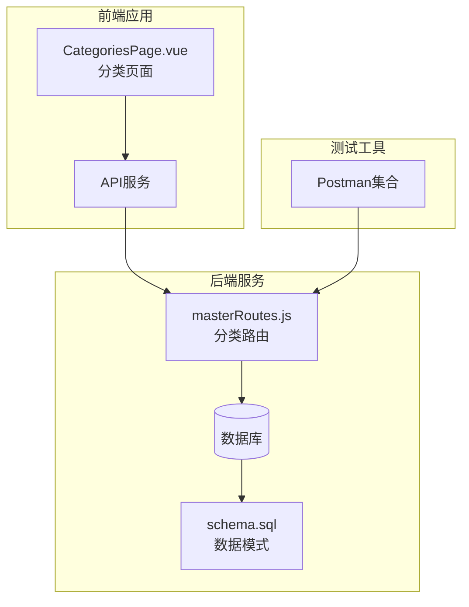
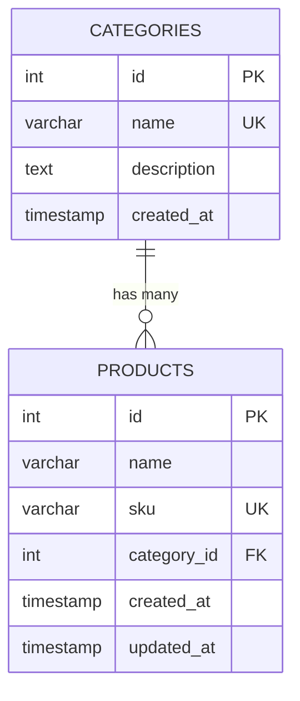
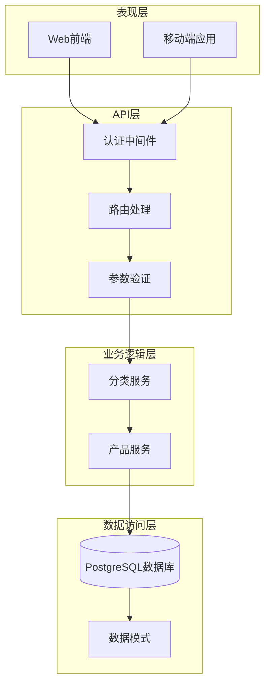
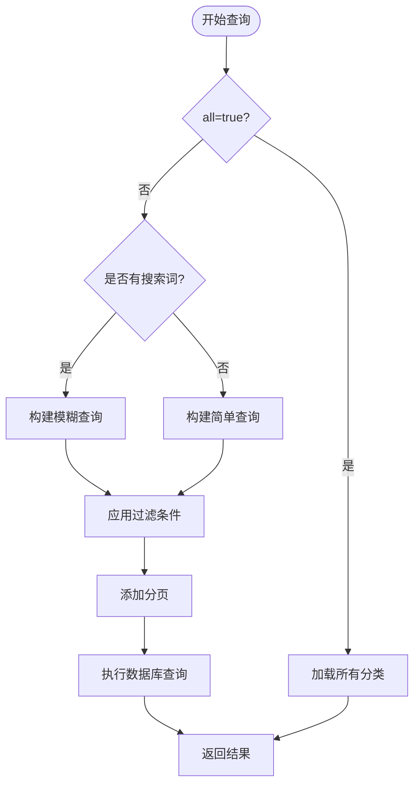
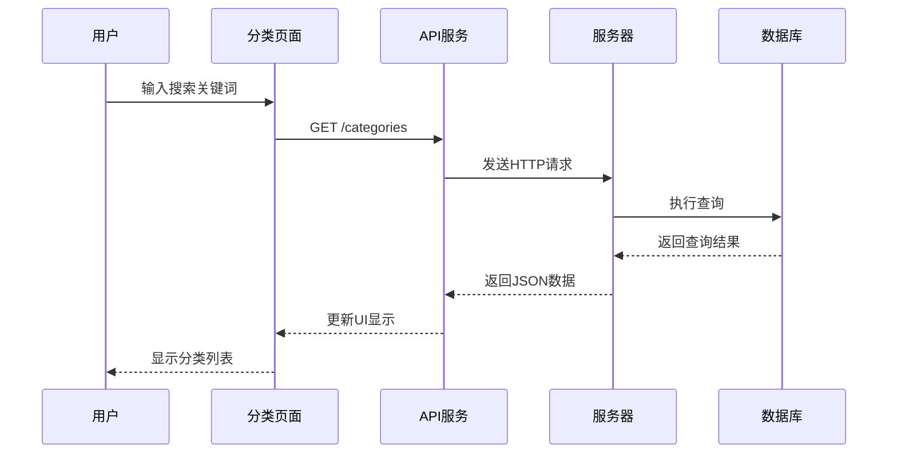
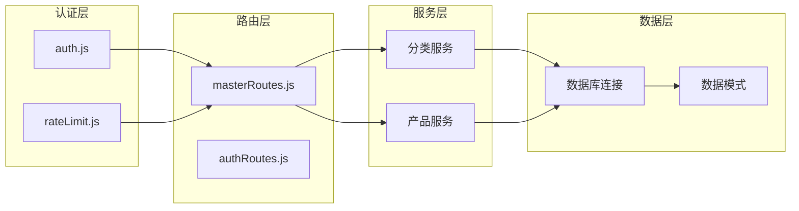

# 分类管理API

<cite>
**本文档引用的文件**
- [masterRoutes.js](file://server/src/routes/masterRoutes.js)
- [schema.sql](file://server/database/schema.sql)
- [CategoriesPage.vue](file://web/src/pages/CategoriesPage.vue)
- [inventory_system_backend.postman_collection.json](file://postman/inventory_system_backend.postman_collection.json)
</cite>

## 目录
1. [简介](#简介)
2. [项目结构](#项目结构)
3. [核心组件](#核心组件)
4. [架构概览](#架构概览)
5. [详细组件分析](#详细组件分析)
6. [依赖分析](#依赖分析)
7. [性能考虑](#性能考虑)
8. [故障排除指南](#故障排除指南)
9. [结论](#结论)

## 简介

本文件为库存系统的分类管理API提供完整的技术文档。该系统实现了产品分类的完整CRUD操作，包括分类创建、更新、删除和查询功能。文档详细说明了分类层级结构、分类名称规范、描述信息管理等，并包含了分类搜索、分页查询、父子分类关系维护等功能。此外，还提供了分类树形结构查询、分类统计信息获取等高级功能的接口说明。

## 项目结构

分类管理功能主要分布在以下模块中：



**图表来源**
- [masterRoutes.js:663-773](file://server/src/routes/masterRoutes.js#L663-L773)
- [schema.sql:15-20](file://server/database/schema.sql#L15-L20)

**章节来源**
- [masterRoutes.js:1-1513](file://server/src/routes/masterRoutes.js#L1-L1513)
- [schema.sql:1-447](file://server/database/schema.sql#L1-L447)

## 核心组件

### 数据模型

分类表采用简单的扁平化设计，支持基础的分类管理需求：



**图表来源**
- [schema.sql:15-20](file://server/database/schema.sql#L15-L20)
- [schema.sql:32-54](file://server/database/schema.sql#L32-L54)

### 路由配置

分类管理API提供RESTful接口，支持标准的CRUD操作：

| 方法 | 路径 | 权限要求 | 功能描述 |
|------|------|----------|----------|
| GET | `/api/categories` | 无需认证 | 获取分类列表（支持搜索和分页） |
| POST | `/api/categories` | ADMIN, MANAGER | 创建新分类 |
| PUT | `/api/categories/:id` | ADMIN, MANAGER | 更新指定分类 |
| DELETE | `/api/categories/:id` | ADMIN, MANAGER | 删除指定分类 |

**章节来源**
- [masterRoutes.js:663-773](file://server/src/routes/masterRoutes.js#L663-L773)

## 架构概览

分类管理系统采用典型的三层架构设计：



**图表来源**
- [masterRoutes.js:12-12](file://server/src/routes/masterRoutes.js#L12-L12)
- [schema.sql:15-20](file://server/database/schema.sql#L15-L20)

## 详细组件分析

### 分类查询接口

#### 基础查询功能

分类查询接口支持多种查询条件和分页机制：

**请求参数：**
- `search`: 搜索关键词（支持名称和描述模糊匹配）
- `all`: 是否返回所有结果（默认false，用于下拉框场景）
- `page`: 当前页码（默认1）
- `pageSize`: 每页条数（默认8）

**响应格式：**
```javascript
{
  "items": [
    {
      "id": 1,
      "name": "电子设备",
      "description": "电子产品分类",
      "created_at": "2024-01-01T00:00:00Z"
    }
  ],
  "pagination": {
    "total": 100,
    "page": 1,
    "pageSize": 8,
    "totalPages": 13
  }
}
```

**章节来源**
- [masterRoutes.js:664-716](file://server/src/routes/masterRoutes.js#L664-L716)

#### 高级查询功能

查询接口支持复杂的过滤条件：



**图表来源**
- [masterRoutes.js:664-716](file://server/src/routes/masterRoutes.js#L664-L716)

### 分类管理接口

#### 创建分类

**请求体参数：**
- `name` (必需): 分类名称，必须唯一
- `description`: 分类描述信息

**权限控制：**
- 需要ADMIN或MANAGER角色
- 使用JWT令牌进行身份验证

**章节来源**
- [masterRoutes.js:718-739](file://server/src/routes/masterRoutes.js#L718-L739)

#### 更新分类

**路径参数：**
- `id`: 分类ID

**请求体参数：**
- `name` (必需): 新的分类名称
- `description`: 新的描述信息

**章节来源**
- [masterRoutes.js:741-764](file://server/src/routes/masterRoutes.js#L741-L764)

#### 删除分类

**注意事项：**
- 删除操作会级联影响关联的产品记录
- 产品分类字段会被设置为NULL

**章节来源**
- [masterRoutes.js:766-773](file://server/src/routes/masterRoutes.js#L766-L773)

### 前端集成

#### Vue.js页面组件

前端使用Vue.js实现分类管理界面，支持实时搜索和分页：



**图表来源**
- [CategoriesPage.vue:25-43](file://web/src/pages/CategoriesPage.vue#L25-L43)
- [masterRoutes.js:664-716](file://server/src/routes/masterRoutes.js#L664-L716)

**章节来源**
- [CategoriesPage.vue:1-211](file://web/src/pages/CategoriesPage.vue#L1-L211)

### 数据库设计

#### 表结构定义

分类表采用简洁的设计模式：

| 字段名 | 类型 | 约束 | 描述 |
|--------|------|------|------|
| id | SERIAL | PRIMARY KEY | 分类唯一标识符 |
| name | VARCHAR(120) | NOT NULL, UNIQUE | 分类名称 |
| description | TEXT | NULL | 分类描述信息 |
| created_at | TIMESTAMP | NOT NULL, DEFAULT CURRENT_TIMESTAMP | 创建时间戳 |

#### 外键关系

产品表与分类表建立一对多关系：
- `products.category_id` 引用 `categories.id`
- 删除分类时，相关产品的分类字段设为NULL

**章节来源**
- [schema.sql:15-20](file://server/database/schema.sql#L15-L20)
- [schema.sql:44](file://server/database/schema.sql#L44)

## 依赖分析

### 组件耦合关系



**图表来源**
- [masterRoutes.js:1-12](file://server/src/routes/masterRoutes.js#L1-L12)
- [schema.sql:15-20](file://server/database/schema.sql#L15-L20)

### 外部依赖

系统依赖的关键外部库：
- **Express.js**: Web框架
- **bcryptjs**: 密码加密
- **jsonwebtoken**: JWT令牌处理
- **PostgreSQL**: 数据存储

**章节来源**
- [masterRoutes.js:1-8](file://server/src/routes/masterRoutes.js#L1-L8)

## 性能考虑

### 查询优化

1. **索引策略**:
   - 分类名称建立唯一索引，确保数据完整性
   - 支持高效的模糊搜索操作

2. **分页机制**:
   - 默认每页8条记录，避免大量数据传输
   - 支持`all=true`参数用于需要全量数据的场景

3. **缓存策略**:
   - 分类数据相对稳定，适合缓存
   - 建议在应用层实现适当的缓存机制

### 安全考虑

1. **权限控制**:
   - 所有分类管理操作都需要认证
   - 不同角色具有不同的操作权限

2. **输入验证**:
   - 对所有用户输入进行验证和清理
   - 防止SQL注入和XSS攻击

## 故障排除指南

### 常见错误及解决方案

| 错误类型 | 错误代码 | 可能原因 | 解决方案 |
|----------|----------|----------|----------|
| 认证失败 | 401 | 无效的JWT令牌 | 检查令牌格式和有效期 |
| 权限不足 | 403 | 角色权限不够 | 确保用户具有ADMIN或MANAGER角色 |
| 参数错误 | 400 | 缺少必需参数 | 检查请求体中的必需字段 |
| 资源不存在 | 404 | 分类ID不存在 | 验证分类ID的有效性 |
| 内部错误 | 500 | 服务器内部错误 | 查看服务器日志获取详细信息 |

### 调试建议

1. **API测试**:
   - 使用Postman集合进行API测试
   - 检查请求头中的认证信息

2. **日志分析**:
   - 查看服务器错误日志
   - 监控数据库查询性能

3. **前端调试**:
   - 检查网络请求状态
   - 验证Vue.js组件的状态更新

**章节来源**
- [inventory_system_backend.postman_collection.json:1-200](file://postman/inventory_system_backend.postman_collection.json#L1-L200)

## 结论

分类管理API提供了完整的产品分类管理功能，具有以下特点：

1. **功能完整**: 支持分类的完整生命周期管理
2. **易于使用**: 提供清晰的RESTful接口设计
3. **安全可靠**: 实现了完善的认证授权机制
4. **性能优化**: 采用分页和索引策略提升查询效率
5. **扩展性强**: 支持未来功能的扩展和增强

该API设计符合现代Web应用的最佳实践，能够满足大多数库存管理系统的分类管理需求。对于需要更复杂分类层次结构的场景，可以在现有基础上进行扩展，如添加父分类字段实现真正的树形结构。