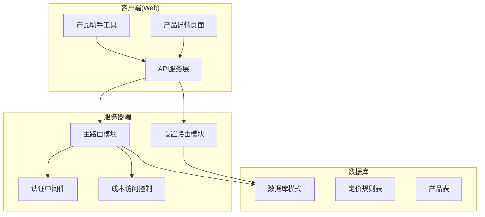
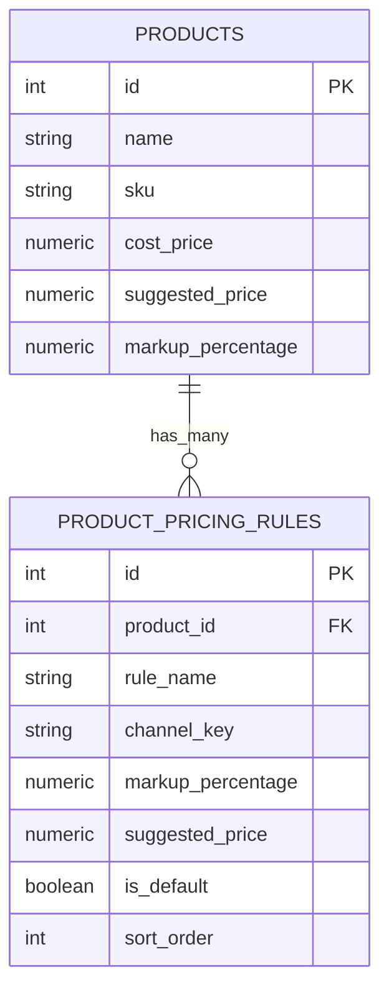
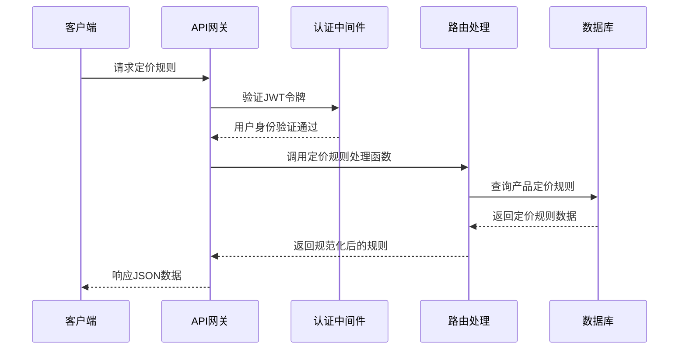
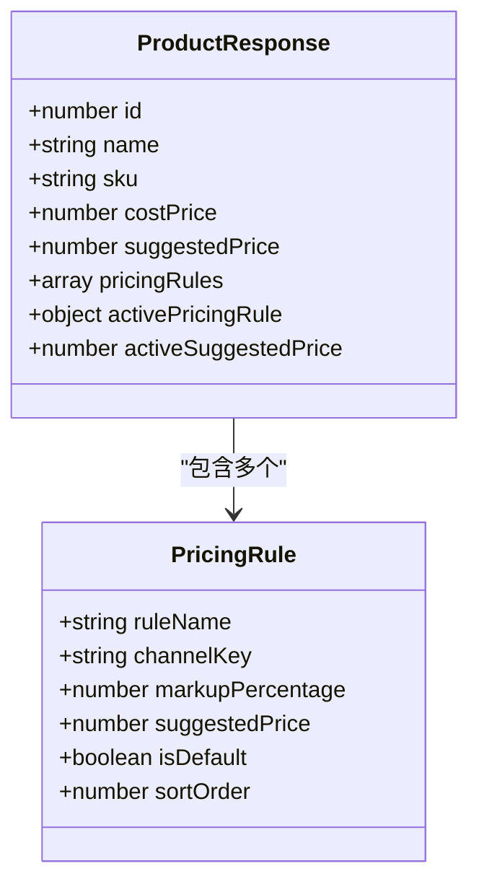
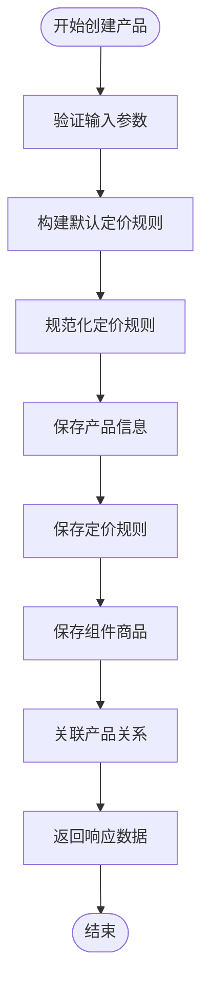
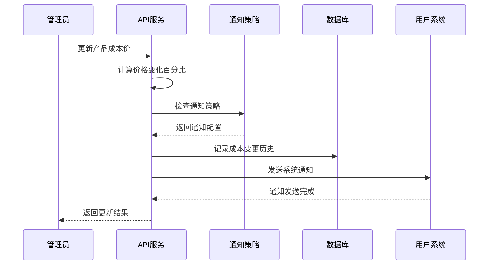
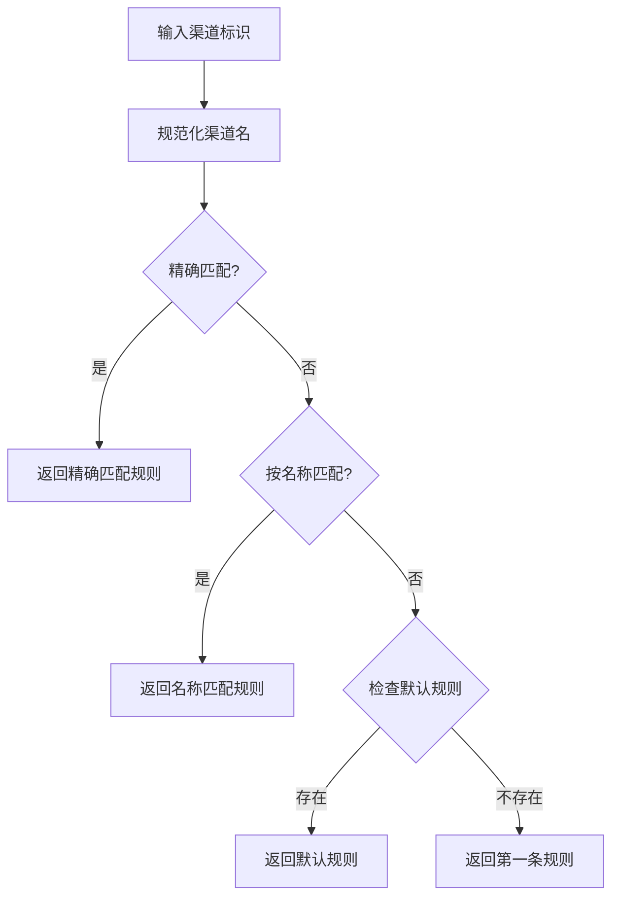
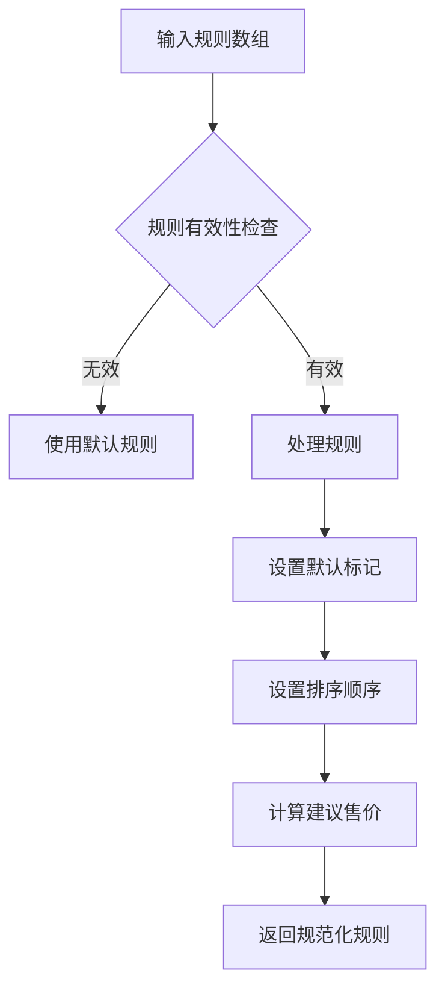
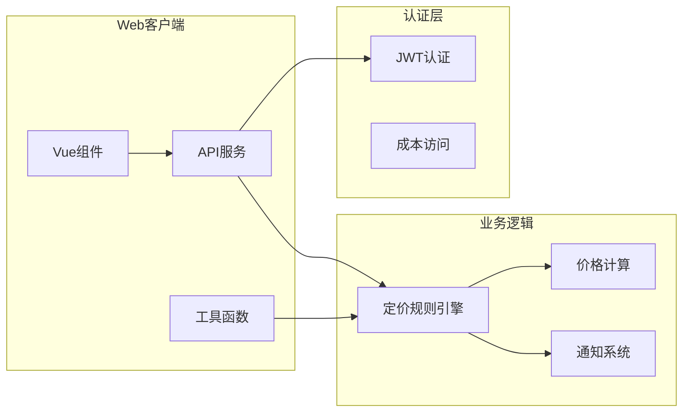

# 定价规则API

<cite>
**本文档引用的文件**
- [masterRoutes.js](file://server/src/routes/masterRoutes.js)
- [settingsRoutes.js](file://server/src/routes/settingsRoutes.js)
- [schema.sql](file://server/database/schema.sql)
- [auth.js](file://server/src/middleware/auth.js)
- [costAccess.js](file://server/src/utils/costAccess.js)
- [api.js](file://web/src/services/api.js)
- [productHelpers.js](file://web/src/utils/productHelpers.js)
- [ProductDetailPage.vue](file://web/src/pages/ProductDetailPage.vue)
</cite>

## 目录
1. [简介](#简介)
2. [项目结构](#项目结构)
3. [核心组件](#核心组件)
4. [架构概览](#架构概览)
5. [详细组件分析](#详细组件分析)
6. [依赖关系分析](#依赖关系分析)
7. [性能考虑](#性能考虑)
8. [故障排除指南](#故障排除指南)
9. [结论](#结论)

## 简介

本文件为库存管理系统中的定价规则管理API文档。系统支持多渠道定价策略、批量定价规则管理以及定价规则继承机制。通过统一的定价规则引擎，系统能够根据成本价、加价百分比和建议售价生成多种定价方案，并支持在不同销售渠道间进行规则切换。

## 项目结构

**图表来源**
- [masterRoutes.js:1-1513](file://server/src/routes/masterRoutes.js#L1-L1513)
- [settingsRoutes.js:1-144](file://server/src/routes/settingsRoutes.js#L1-L144)
- [schema.sql:99-124](file://server/database/schema.sql#L99-L124)

**章节来源**
- [masterRoutes.js:1-1513](file://server/src/routes/masterRoutes.js#L1-L1513)
- [settingsRoutes.js:1-144](file://server/src/routes/settingsRoutes.js#L1-L144)
- [schema.sql:99-124](file://server/database/schema.sql#L99-L124)

## 核心组件

### 定价规则数据模型

系统采用关系型数据库存储定价规则，核心表结构如下：

**图表来源**
- [schema.sql:32-54](file://server/database/schema.sql#L32-L54)
- [schema.sql:99-124](file://server/database/schema.sql#L99-L124)

### 定价规则规范化函数

系统提供了完整的定价规则规范化机制：

| 函数 | 功能描述 | 参数 |
|------|----------|------|
| `normalizePricingRules` | 规范化定价规则数组 | `rules, costPrice, markupPercentage, suggestedPrice` |
| `buildDefaultPricingRules` | 构建默认定价规则 | `costPrice, markupPercentage, suggestedPrice` |
| `getDefaultPricingRule` | 获取默认定价规则 | `pricingRules, costPrice, markupPercentage, suggestedPrice` |
| `resolveActivePricingRule` | 解析活动定价规则 | `pricingRules, pricingChannel` |

**章节来源**
- [masterRoutes.js:41-93](file://server/src/routes/masterRoutes.js#L41-L93)

## 架构概览

**图表来源**
- [auth.js:5-29](file://server/src/middleware/auth.js#L5-L29)
- [masterRoutes.js:1-12](file://server/src/routes/masterRoutes.js#L1-L12)

## 详细组件分析

### 定价规则创建接口

#### 接口定义
- **方法**: POST
- **路径**: `/api/v1/products`
- **权限**: ADMIN, MANAGER

#### 请求体参数

| 参数名 | 类型 | 必填 | 描述 | 默认值 |
|--------|------|------|------|--------|
| name | string | 是 | 产品名称 | - |
| sku | string | 是 | 产品SKU | - |
| costPrice | number | 否 | 成本价 | 0 |
| markupPercentage | number | 否 | 加价百分比 | 0 |
| suggestedPrice | number | 否 | 建议售价 | 自动生成 |
| pricingRules | array | 否 | 定价规则数组 | 默认规则 |
| bundleItems | array | 否 | 组件商品项 | - |

#### 响应数据结构

**图表来源**
- [masterRoutes.js:1258-1360](file://server/src/routes/masterRoutes.js#L1258-L1360)

#### 创建流程图

**图表来源**
- [masterRoutes.js:1288-1358](file://server/src/routes/masterRoutes.js#L1288-L1358)

**章节来源**
- [masterRoutes.js:1258-1360](file://server/src/routes/masterRoutes.js#L1258-L1360)

### 定价规则更新接口

#### 接口定义
- **方法**: PUT
- **路径**: `/api/v1/products/:id`
- **权限**: ADMIN, MANAGER

#### 更新特性

系统支持以下更新场景：

1. **成本价变更**: 需要成本访问令牌
2. **定价规则批量更新**: 支持一次更新多个规则
3. **渠道规则切换**: 根据渠道标识自动选择规则
4. **默认规则继承**: 新规则自动继承默认设置

#### 成本变更通知机制

**图表来源**
- [masterRoutes.js:199-281](file://server/src/routes/masterRoutes.js#L199-L281)

**章节来源**
- [masterRoutes.js:1362-1501](file://server/src/routes/masterRoutes.js#L1362-L1501)

### 定价规则查询接口

#### 接口定义
- **方法**: GET
- **路径**: `/api/v1/products/:id`
- **权限**: ADMIN, MANAGER

#### 查询参数

| 参数名 | 类型 | 必填 | 描述 | 默认值 |
|--------|------|------|------|--------|
| pricingChannel | string | 否 | 渠道标识 | 空字符串 |
| all | string | 否 | 是否查询全部 | 'false' |

#### 响应数据

系统返回完整的产品信息，包括：
- 基础产品信息
- 所有定价规则
- 活动定价规则
- 库存状态
- 成本历史

**章节来源**
- [masterRoutes.js:1054-1200](file://server/src/routes/masterRoutes.js#L1054-L1200)

### 多渠道定价支持

#### 渠道配置

系统支持以下内置渠道：

| 渠道键 | 描述 | 加价百分比 |
|--------|------|------------|
| retail | 零售渠道 | 30% |
| wholesale | 批发渠道 | 18% |
| vip | VIP会员 | 12% |

#### 渠道规则解析

**图表来源**
- [masterRoutes.js:75-93](file://server/src/routes/masterRoutes.js#L75-L93)

**章节来源**
- [masterRoutes.js:75-93](file://server/src/routes/masterRoutes.js#L75-L93)

### 定价规则继承机制

#### 继承规则

1. **默认规则优先**: 第一条规则自动设为默认
2. **渠道继承**: 新渠道自动继承默认规则配置
3. **排序继承**: 新规则继承默认排序顺序
4. **成本保护**: 成本价变更时保持规则完整性

#### 规则同步函数

**图表来源**
- [masterRoutes.js:54-68](file://server/src/routes/masterRoutes.js#L54-L68)

**章节来源**
- [masterRoutes.js:54-68](file://server/src/routes/masterRoutes.js#L54-L68)

## 依赖关系分析

### 客户端集成

**图表来源**
- [api.js:1-45](file://web/src/services/api.js#L1-L45)
- [productHelpers.js:1-196](file://web/src/utils/productHelpers.js#L1-L196)

### 权限控制

系统采用多层次权限控制：

| 层级 | 角色 | 权限范围 |
|------|------|----------|
| 1级 | STAFF | 查看基础信息 |
| 2级 | MANAGER | 管理产品信息 |
| 3级 | ADMIN | 系统管理权限 |

**章节来源**
- [auth.js:32-40](file://server/src/middleware/auth.js#L32-L40)

## 性能考虑

### 数据库优化

1. **索引优化**: 为定价规则表建立复合索引
2. **查询优化**: 使用预编译语句减少SQL注入风险
3. **连接池**: 使用连接池管理数据库连接
4. **缓存策略**: 对常用查询结果进行缓存

### 前端性能

1. **懒加载**: 定价规则按需加载
2. **虚拟滚动**: 大数据集使用虚拟滚动技术
3. **防抖处理**: 输入验证使用防抖机制
4. **增量更新**: 支持局部数据更新

## 故障排除指南

### 常见错误及解决方案

| 错误类型 | 错误码 | 描述 | 解决方案 |
|----------|--------|------|----------|
| 认证失败 | 401 | 令牌无效或过期 | 重新登录获取新令牌 |
| 权限不足 | 403 | 角色权限不足 | 联系管理员提升权限 |
| 数据验证 | 400 | 请求参数无效 | 检查必填字段和数据格式 |
| 数据库错误 | 500 | 数据库操作失败 | 检查数据库连接和权限 |

### 调试建议

1. **启用日志**: 在开发环境启用详细日志
2. **监控指标**: 监控API响应时间和错误率
3. **性能分析**: 使用性能分析工具识别瓶颈
4. **单元测试**: 编写针对定价规则的单元测试

**章节来源**
- [auth.js:9-28](file://server/src/middleware/auth.js#L9-L28)

## 结论

本定价规则API提供了完整的多渠道定价管理解决方案，支持灵活的规则配置、批量管理以及智能继承机制。通过标准化的数据模型和完善的权限控制，系统能够满足不同规模企业的定价需求。建议在生产环境中结合监控和缓存策略，进一步提升系统性能和可靠性。