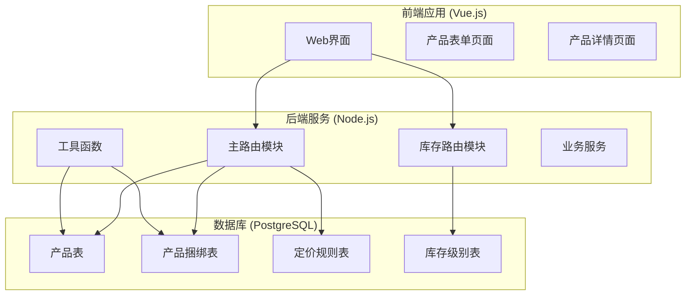
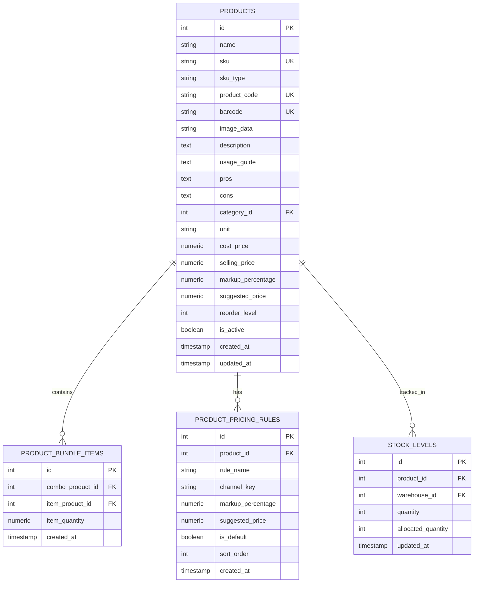
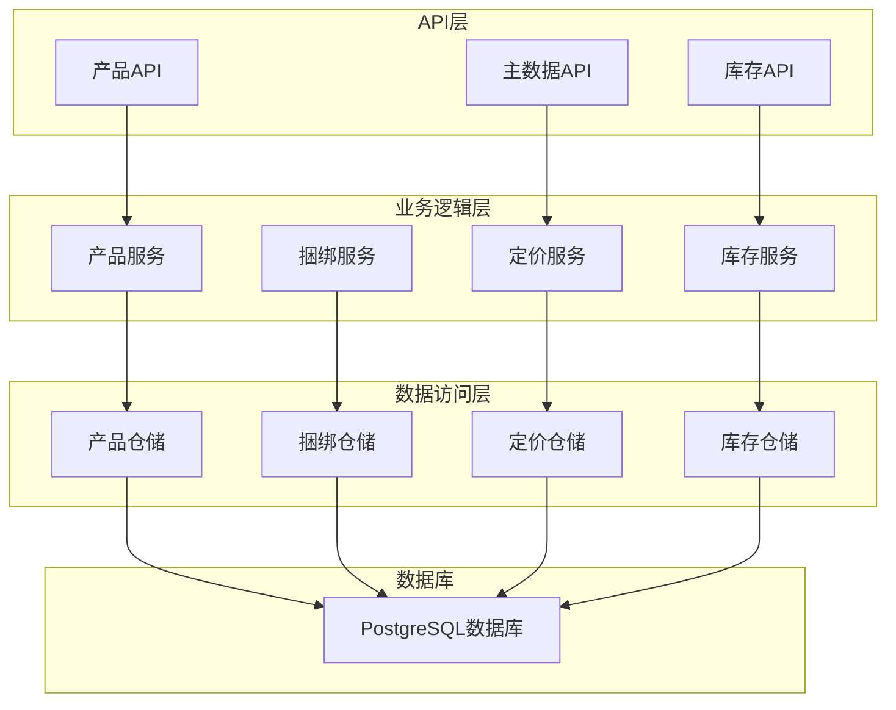
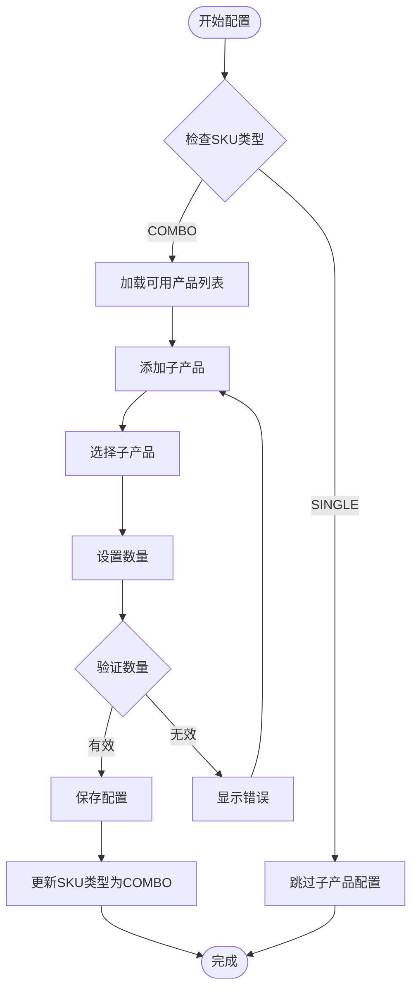
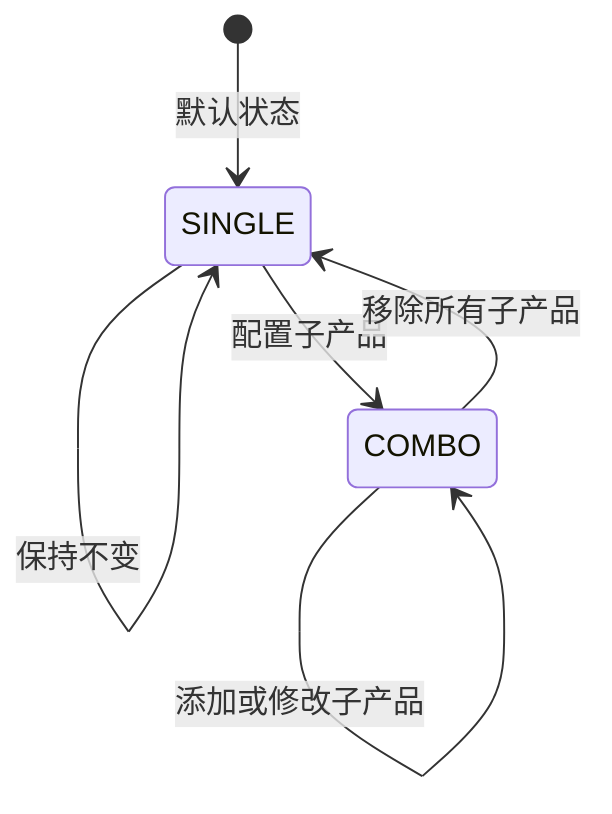
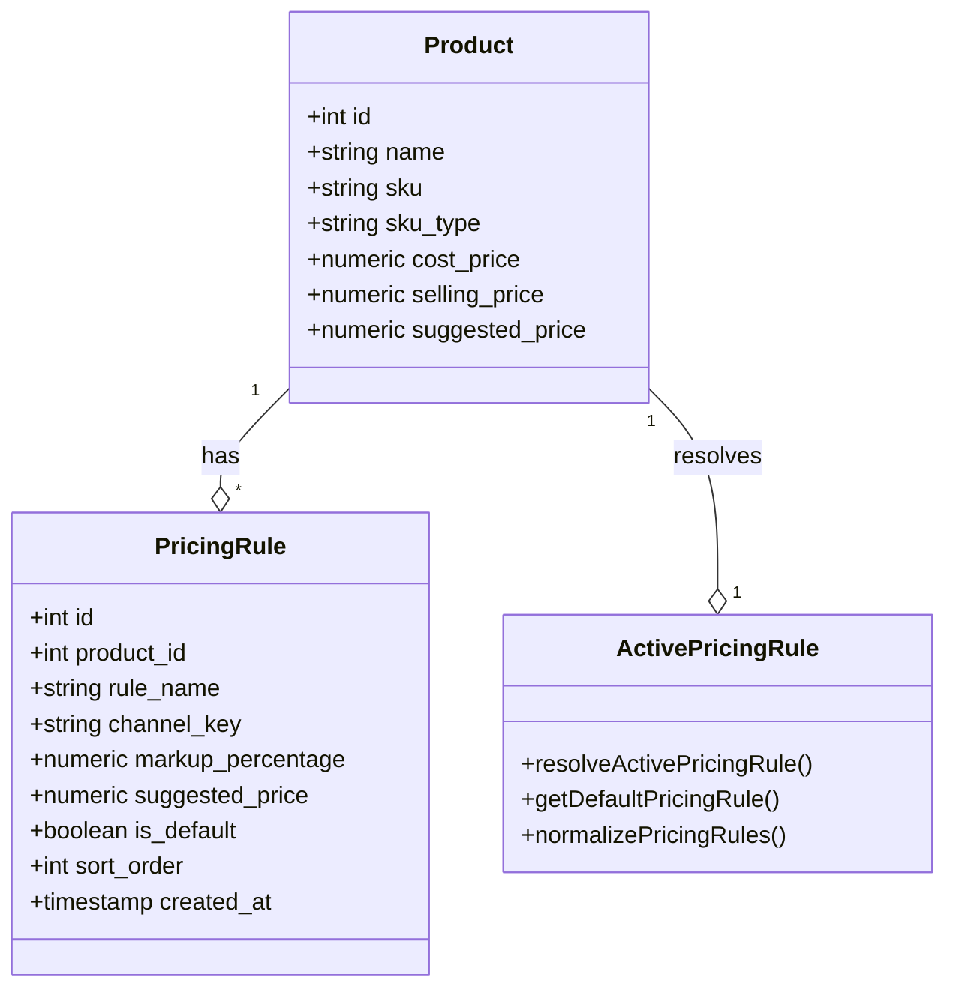
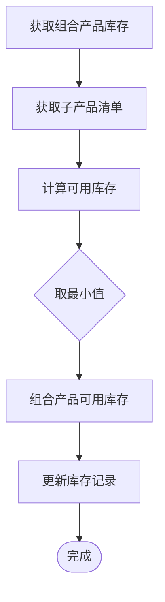
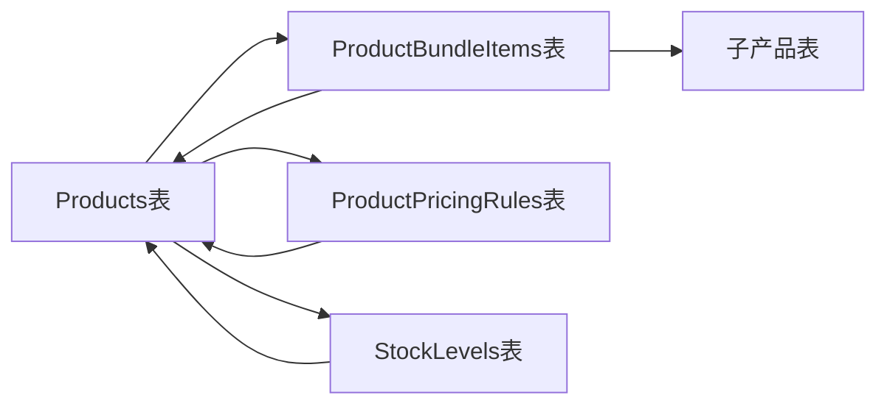
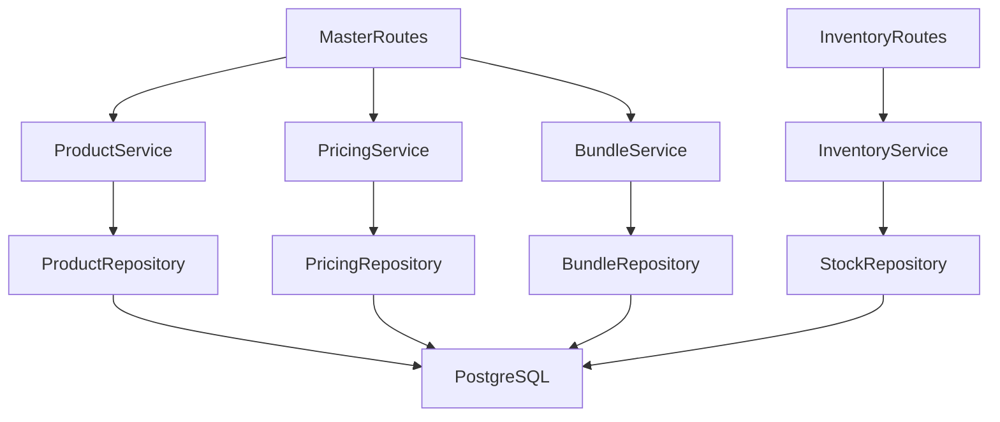

# 组合产品API

<cite>
**本文档引用的文件**
- [masterRoutes.js](file://server/src/routes/masterRoutes.js)
- [inventoryRoutes.js](file://server/src/routes/inventoryRoutes.js)
- [inventoryService.js](file://server/src/utils/inventoryService.js)
- [schema.sql](file://server/database/schema.sql)
- [ProductFormPage.vue](file://web/src/pages/ProductFormPage.vue)
- [ProductDetailPage.vue](file://web/src/pages/ProductDetailPage.vue)
- [POSTMAN_BACKEND_GUIDE.md](file://POSTMAN_BACKEND_GUIDE.md)
</cite>

## 目录
1. [简介](#简介)
2. [项目结构](#项目结构)
3. [核心组件](#核心组件)
4. [架构概览](#架构概览)
5. [详细组件分析](#详细组件分析)
6. [依赖关系分析](#依赖关系分析)
7. [性能考虑](#性能考虑)
8. [故障排除指南](#故障排除指南)
9. [结论](#结论)

## 简介

本文件为库存管理系统中的组合产品管理API文档。组合产品（Combo Product）是指由多个子产品（子SKU）组成的捆绑产品，系统通过产品捆绑表实现组合产品的配置管理。该系统提供了完整的组合产品CRUD操作接口，包括组合产品的创建、更新、删除和查询功能，以及相关的SKU类型管理、组合产品定价、库存管理和销售统计等业务功能。

## 项目结构

库存管理系统采用前后端分离架构，后端使用Node.js + Express框架，数据库采用PostgreSQL。项目主要分为以下模块：



**图表来源**
- [masterRoutes.js:1258-1510](file://server/src/routes/masterRoutes.js#L1258-L1510)
- [inventoryRoutes.js:1-493](file://server/src/routes/inventoryRoutes.js#L1-L493)
- [schema.sql:32-87](file://server/database/schema.sql#L32-L87)

**章节来源**
- [masterRoutes.js:1-1513](file://server/src/routes/masterRoutes.js#L1-L1513)
- [inventoryRoutes.js:1-493](file://server/src/routes/inventoryRoutes.js#L1-L493)
- [schema.sql:1-447](file://server/database/schema.sql#L1-L447)

## 核心组件

### 组合产品数据模型

系统通过以下核心表结构支持组合产品管理：



**图表来源**
- [schema.sql:32-133](file://server/database/schema.sql#L32-L133)

### SKU类型管理

系统支持两种SKU类型：
- **SINGLE**: 单一产品，不可拆分
- **COMBO**: 组合产品，可包含多个子产品

SKU类型在产品创建时自动设置，默认为'SINGLE'，当配置bundleItems时自动转换为'COMBO'。

**章节来源**
- [masterRoutes.js:37-39](file://server/src/routes/masterRoutes.js#L37-L39)
- [masterRoutes.js:1258-1360](file://server/src/routes/masterRoutes.js#L1258-L1360)

## 架构概览

系统采用分层架构设计，各模块职责清晰：



**图表来源**
- [masterRoutes.js:1-1513](file://server/src/routes/masterRoutes.js#L1-L1513)
- [inventoryRoutes.js:1-493](file://server/src/routes/inventoryRoutes.js#L1-L493)

## 详细组件分析

### 组合产品CRUD操作

#### 1. 组合产品创建

**接口定义**
- 方法: POST
- 路径: `/api/master/products`
- 权限: ADMIN, MANAGER

**请求参数**
```javascript
{
  "name": "组合产品名称",
  "sku": "SKU编码",
  "skuType": "COMBO", // 可选，默认为SINGLE
  "productCode": "产品代码",
  "barcode": "条形码",
  "images": [
    {
      "imageData": "base64图片数据",
      "isPrimary": true,
      "sortOrder": 0
    }
  ],
  "description": "产品描述",
  "usageGuide": "使用指南",
  "pros": "优点",
  "cons": "缺点",
  "categoryId": 1,
  "unit": "单位",
  "costPrice": 1000,
  "sellingPrice": 1600,
  "markupPercentage": 30,
  "suggestedPrice": 1600,
  "pricingRules": [
    {
      "ruleName": "零售",
      "channelKey": "retail",
      "markupPercentage": 30,
      "isDefault": true,
      "sortOrder": 0
    }
  ],
  "bundleItems": [
    {
      "itemProductId": 1,
      "itemQuantity": 2
    }
  ],
  "reorderLevel": 5,
  "isActive": true,
  "primarySupplierId": 1
}
```

**响应结构**
```javascript
{
  "id": 1,
  "name": "组合产品名称",
  "sku": "SKU编码",
  "sku_type": "COMBO",
  "product_code": "产品代码",
  "barcode": "条形码",
  "images": [...],
  "bundle_items": [
    {
      "id": 1,
      "combo_product_id": 1,
      "item_product_id": 2,
      "item_quantity": 2,
      "item_product_name": "子产品名称",
      "item_product_sku": "子产品SKU"
    }
  ],
  "pricing_rules": [...],
  "active_pricing_rule": {...},
  "active_suggested_price": 1600,
  "cost_price": 1000,
  "can_view_cost": true
}
```

**章节来源**
- [masterRoutes.js:1258-1360](file://server/src/routes/masterRoutes.js#L1258-L1360)
- [schema.sql:80-87](file://server/database/schema.sql#L80-L87)

#### 2. 组合产品查询

**接口定义**
- 方法: GET
- 路径: `/api/master/products`
- 权限: ADMIN, MANAGER

**查询参数**
- `search`: 搜索关键词
- `categoryId`: 分类ID
- `status`: 状态 (all, active, inactive)
- `hasBarcode`: 是否有条形码 (all, yes, no)
- `pricingChannel`: 定价渠道 (retail, wholesale, vip)
- `page`: 页码
- `pageSize`: 页面大小

**响应结构**
```javascript
{
  "items": [
    {
      "id": 1,
      "name": "组合产品名称",
      "sku": "SKU编码",
      "sku_type": "COMBO",
      "category_name": "分类名称",
      "bundle_items": [...],
      "pricing_rules": [...],
      "active_pricing_rule": {...},
      "active_suggested_price": 1600,
      "cost_price": null // 未解锁时为null
    }
  ],
  "pagination": {
    "total": 100,
    "page": 1,
    "pageSize": 20,
    "totalPages": 5
  }
}
```

**章节来源**
- [masterRoutes.js:892-1022](file://server/src/routes/masterRoutes.js#L892-L1022)

#### 3. 组合产品详情查询

**接口定义**
- 方法: GET
- 路径: `/api/master/products/:id`
- 权限: ADMIN, MANAGER

**查询参数**
- `pricingChannel`: 定价渠道

**响应结构**
```javascript
{
  "product": {
    "id": 1,
    "name": "组合产品名称",
    "sku": "SKU编码",
    "sku_type": "COMBO",
    "bundle_items": [...],
    "pricing_rules": [...],
    "active_pricing_rule": {...},
    "cost_price": 1000
  },
  "images": [...],
  "pricingRules": [...],
  "stockLevels": [...],
  "recentMovements": [...],
  "alerts": [...],
  "supplier": {...},
  "costPriceHistory": [...],
  "summary": {
    "totalOnHand": 100,
    "totalAllocated": 20,
    "totalAvailable": 80,
    "warehouseCount": 3,
    "lowStockCount": 1
  }
}
```

**章节来源**
- [masterRoutes.js:1054-1200](file://server/src/routes/masterRoutes.js#L1054-L1200)

#### 4. 组合产品更新

**接口定义**
- 方法: PUT
- 路径: `/api/master/products/:id`
- 权限: ADMIN, MANAGER

**请求参数**
- 包含所有创建参数，其中某些字段可选
- 新增 `costChangeReason`: 成本变更原因

**章节来源**
- [masterRoutes.js:1362-1501](file://server/src/routes/masterRoutes.js#L1362-L1501)

#### 5. 组合产品删除

**接口定义**
- 方法: DELETE
- 路径: `/api/master/products/:id`
- 权限: ADMIN

**章节来源**
- [masterRoutes.js:1503-1510](file://server/src/routes/masterRoutes.js#L1503-L1510)

### 组合产品配置管理

#### 1. 子产品管理

系统通过 `product_bundle_items` 表管理组合产品的子产品配置：



**图表来源**
- [masterRoutes.js:433-463](file://server/src/routes/masterRoutes.js#L433-L463)
- [ProductFormPage.vue:440-461](file://web/src/pages/ProductFormPage.vue#L440-L461)

**章节来源**
- [masterRoutes.js:433-463](file://server/src/routes/masterRoutes.js#L433-L463)
- [schema.sql:80-87](file://server/database/schema.sql#L80-L87)

#### 2. 批量配置功能

前端提供了批量配置子产品的功能，支持动态添加和删除子产品项：

**功能特性**
- 动态添加子产品项
- 设置子产品数量关系
- 实时验证配置有效性
- 自动计算组合产品价格

**章节来源**
- [ProductFormPage.vue:198-204](file://web/src/pages/ProductFormPage.vue#L198-L204)
- [ProductFormPage.vue:440-461](file://web/src/pages/ProductFormPage.vue#L440-L461)

### SKU类型管理

#### 1. SKU类型转换

系统支持SKU类型的自动转换机制：



**图表来源**
- [masterRoutes.js:37-39](file://server/src/routes/masterRoutes.js#L37-L39)
- [masterRoutes.js:433-463](file://server/src/routes/masterRoutes.js#L433-L463)

#### 2. SKU类型验证

系统在创建和更新产品时进行SKU类型验证：

**验证规则**
- SKU必须唯一
- COMBO类型必须配置至少一个子产品
- 子产品数量必须大于0
- 子产品不能是自身

**章节来源**
- [masterRoutes.js:1284-1286](file://server/src/routes/masterRoutes.js#L1284-L1286)
- [masterRoutes.js:440-446](file://server/src/routes/masterRoutes.js#L440-L446)

### 组合产品定价

#### 1. 定价规则管理

系统支持多渠道定价规则：



**图表来源**
- [masterRoutes.js:54-93](file://server/src/routes/masterRoutes.js#L54-L93)
- [schema.sql:99-109](file://server/database/schema.sql#L99-L109)

#### 2. 定价计算逻辑

**默认定价规则**
- 零售渠道：成本价基础上加价30%
- 批发渠道：成本价基础上加价15%
- VIP渠道：成本价基础上加价25%

**定价规则解析**
- 支持自定义渠道键
- 支持排序优先级
- 支持默认规则标识

**章节来源**
- [masterRoutes.js:26-68](file://server/src/routes/masterRoutes.js#L26-L68)

### 库存管理

#### 1. 组合产品库存计算

系统通过子产品的库存情况计算组合产品的可用库存：



**图表来源**
- [inventoryService.js:1-45](file://server/src/utils/inventoryService.js#L1-L45)

#### 2. 库存事务处理

系统支持组合产品的库存事务操作，包括入库、出库和调拨：

**章节来源**
- [inventoryRoutes.js:229-403](file://server/src/routes/inventoryRoutes.js#L229-L403)
- [inventoryService.js:1-45](file://server/src/utils/inventoryService.js#L1-L45)

### 销售统计

#### 1. 成本价格历史追踪

系统自动追踪产品成本价格的历史变更：

**历史记录字段**
- `old_cost_price`: 旧成本价
- `new_cost_price`: 新成本价
- `percent_change`: 变化百分比
- `reason`: 变更原因
- `changed_by`: 变更人
- `changed_at`: 变更时间

**章节来源**
- [masterRoutes.js:234-281](file://server/src/routes/masterRoutes.js#L234-L281)
- [schema.sql:367-376](file://server/database/schema.sql#L367-L376)

#### 2. 仪表板统计

系统提供综合的库存统计信息：

**统计指标**
- 总在库数量
- 订单占用数量  
- 可用数量
- 仓库数量
- 缺货数量

**章节来源**
- [ProductDetailPage.vue:227-244](file://web/src/pages/ProductDetailPage.vue#L227-L244)

## 依赖关系分析

### 数据库依赖关系



**图表来源**
- [schema.sql:32-133](file://server/database/schema.sql#L32-L133)

### 业务逻辑依赖

系统采用依赖注入模式，各服务模块相互独立：



**图表来源**
- [masterRoutes.js:1-1513](file://server/src/routes/masterRoutes.js#L1-L1513)
- [inventoryRoutes.js:1-493](file://server/src/routes/inventoryRoutes.js#L1-L493)

**章节来源**
- [masterRoutes.js:1-1513](file://server/src/routes/masterRoutes.js#L1-L1513)
- [inventoryRoutes.js:1-493](file://server/src/routes/inventoryRoutes.js#L1-L493)

## 性能考虑

### 数据库优化

1. **索引优化**
   - 产品表: `idx_products_category_id`, `idx_products_product_code_unique`
   - 捆绑表: `idx_product_bundle_items_combo_id`
   - 定价表: `idx_product_pricing_rules_product_id`
   - 库存表: `idx_stock_levels_product_id`, `idx_stock_levels_warehouse_id`

2. **查询优化**
   - 使用分页查询避免全量加载
   - 支持条件过滤减少数据传输
   - 批量操作减少数据库往返

### 前端性能

1. **懒加载**
   - 组合产品详情按需加载
   - 图片资源延迟加载
   - 分页加载大量数据

2. **缓存策略**
   - 本地缓存常用配置
   - 避免重复网络请求
   - 合理的数据更新策略

## 故障排除指南

### 常见问题

**1. 组合产品创建失败**
- 检查子产品是否已配置
- 验证子产品数量是否大于0
- 确认SKU类型是否正确

**2. 库存计算异常**
- 检查子产品的库存状态
- 验证数量关系配置
- 确认仓库分配正确

**3. 定价规则不生效**
- 检查默认规则设置
- 验证渠道键匹配
- 确认排序优先级

### 调试方法

**后端调试**
- 查看数据库日志
- 检查事务执行状态
- 验证数据完整性约束

**前端调试**
- 检查API响应状态
- 验证表单数据绑定
- 确认权限验证

**章节来源**
- [masterRoutes.js:1284-1286](file://server/src/routes/masterRoutes.js#L1284-L1286)
- [masterRoutes.js:440-448](file://server/src/routes/masterRoutes.js#L440-L448)

## 结论

本组合产品API系统提供了完整的组合产品管理功能，包括：

1. **完整的CRUD操作**: 支持组合产品的创建、查询、更新、删除
2. **灵活的配置管理**: 支持子产品配置、数量关系设置、SKU类型管理
3. **智能定价系统**: 支持多渠道定价规则和自动计算
4. **完善的库存管理**: 支持组合产品库存计算和事务处理
5. **丰富的统计功能**: 提供成本历史追踪和仪表板统计

系统采用模块化设计，具有良好的扩展性和维护性，能够满足复杂的库存管理需求。通过合理的数据库设计和API架构，确保了系统的高性能和可靠性。