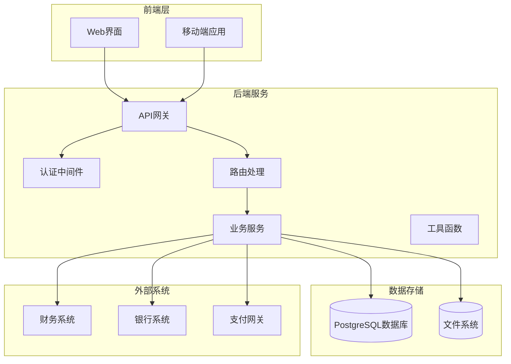
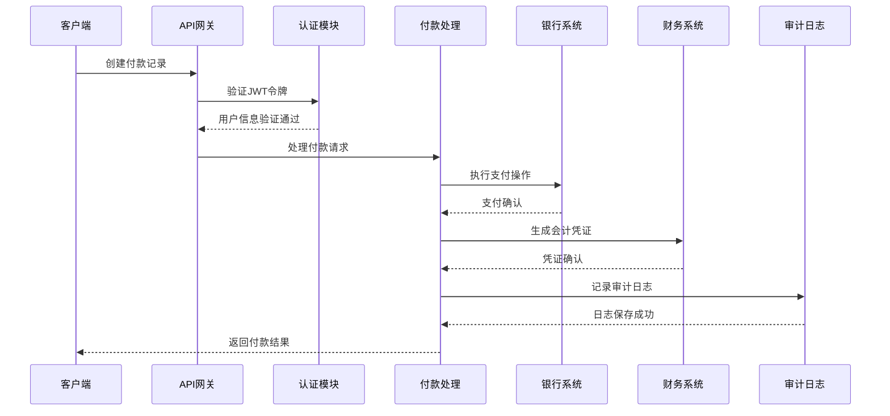
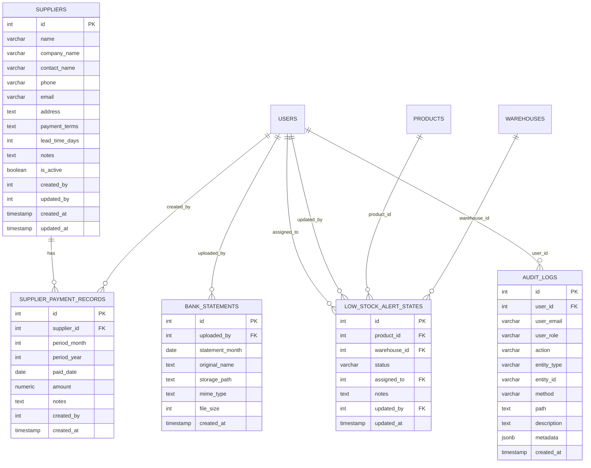
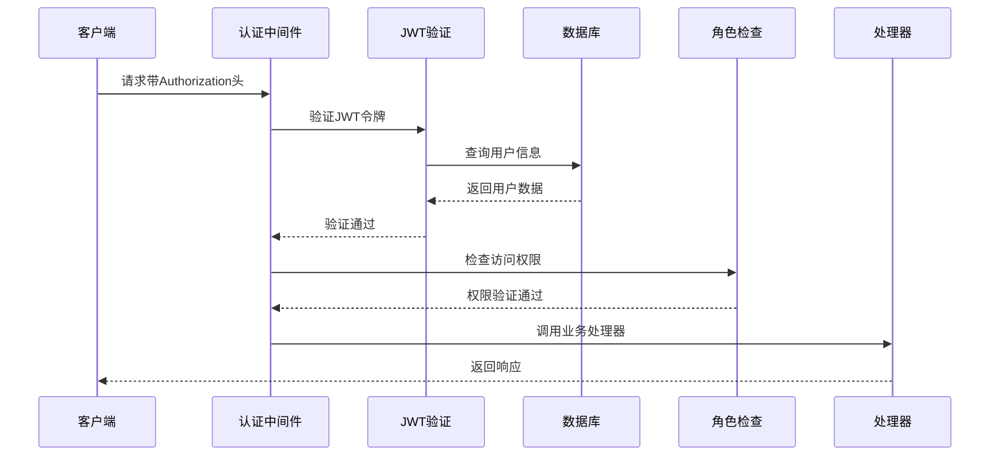

# 付款结算API

<cite>
**本文档引用的文件**
- [supplierPaymentRoutes.js](file://server/src/routes/supplierPaymentRoutes.js)
- [supplierRoutes.js](file://server/src/routes/supplierRoutes.js)
- [alertsRoutes.js](file://server/src/routes/alertsRoutes.js)
- [bankStatementRoutes.js](file://server/src/routes/bankStatementRoutes.js)
- [auth.js](file://server/src/middleware/auth.js)
- [auditTrail.js](file://server/src/middleware/auditTrail.js)
- [pagination.js](file://server/src/utils/pagination.js)
- [db.js](file://server/src/config/db.js)
- [schema.sql](file://server/database/schema.sql)
- [SupplierPaymentsPage.vue](file://web/src/pages/SupplierPaymentsPage.vue)
- [currency.js](file://web/src/stores/currency.js)
- [money.js](file://web/src/utils/money.js)
</cite>

## 目录
1. [简介](#简介)
2. [项目结构](#项目结构)
3. [核心组件](#核心组件)
4. [架构概览](#架构概览)
5. [详细组件分析](#详细组件分析)
6. [依赖关系分析](#依赖关系分析)
7. [性能考虑](#性能考虑)
8. [故障排除指南](#故障排除指南)
9. [结论](#结论)
10. [附录](#附录)

## 简介
本API文档详细描述了供应商付款结算系统的完整功能，包括应付账款管理、付款计划制定、发票处理和支付执行流程。系统支持多币种处理、汇率转换、银行转账、支票支付、在线支付等多种支付方式，并提供付款提醒、逾期处理和坏账管理功能。同时记录与财务系统的对接和会计凭证生成机制。

## 项目结构
系统采用前后端分离架构，后端基于Node.js + Express + PostgreSQL，前端使用Vue.js构建。



**图表来源**
- [supplierPaymentRoutes.js:1-177](file://server/src/routes/supplierPaymentRoutes.js#L1-L177)
- [schema.sql:302-346](file://server/database/schema.sql#L302-L346)

**章节来源**
- [supplierPaymentRoutes.js:1-177](file://server/src/routes/supplierPaymentRoutes.js#L1-L177)
- [schema.sql:302-346](file://server/database/schema.sql#L302-L346)

## 核心组件
系统的核心组件包括供应商管理、付款记录管理、银行对账单管理和告警通知系统。

### 供应商管理系统
- 支持供应商基本信息维护（名称、联系方式、地址等）
- 配置付款条款和账期管理
- 联系人信息和业务时间设置
- 活跃状态管理和历史记录

### 付款记录管理系统
- 月度付款记录跟踪
- 付款状态管理和确认
- 金额记录和备注功能
- 审计日志追踪

### 银行对账单管理系统
- 多格式文件上传（PDF、图片、Excel）
- 月度对账单归档
- 文件安全存储和访问控制
- 下载和删除功能

### 告警通知系统
- 低库存预警
- 付款到期提醒
- 异常状态通知
- 批量处理和分配

**章节来源**
- [supplierRoutes.js:94-370](file://server/src/routes/supplierRoutes.js#L94-L370)
- [supplierPaymentRoutes.js:114-177](file://server/src/routes/supplierPaymentRoutes.js#L114-L177)
- [bankStatementRoutes.js:114-237](file://server/src/routes/bankStatementRoutes.js#L114-L237)
- [alertsRoutes.js:80-287](file://server/src/routes/alertsRoutes.js#L80-L287)

## 架构概览
系统采用RESTful API设计，支持多种支付方式和复杂的业务流程。



**图表来源**
- [auth.js:5-29](file://server/src/middleware/auth.js#L5-L29)
- [auditTrail.js:47-79](file://server/src/middleware/auditTrail.js#L47-L79)

## 详细组件分析

### 供应商付款记录API

#### GET /api/supplier-payments
用于查询所有付款记录，支持过滤和分页功能。

**请求参数**
- supplierId: 供应商ID（可选）
- year: 年份（可选）
- page: 页码，默认1
- pageSize: 每页条数，默认20

**响应结构**
```javascript
{
  items: [
    {
      id: 1,
      supplier_id: 101,
      period_month: 12,
      period_year: 2024,
      paid_date: "2024-12-15",
      amount: 50000.00,
      notes: "年度结算",
      created_by: 1,
      created_at: "2024-12-16T10:30:00Z",
      supplier_name: "ABC供应商",
      supplier_branch: "总部"
    }
  ],
  pagination: {
    total: 150,
    page: 1,
    pageSize: 20,
    totalPages: 8
  }
}
```

#### GET /api/supplier-payments/summary
按供应商分组获取年度付款摘要。

**请求参数**
- year: 年份，默认当前年份

**响应结构**
```javascript
{
  year: 2024,
  months: [
    { month: 1, label: "January" },
    { month: 2, label: "February" },
    // ... 其他月份
  ],
  suppliers: [
    {
      supplier_id: 101,
      supplier_name: "ABC供应商",
      supplier_branch: "总部",
      payments: [
        {
          id: 1,
          period_month: 12,
          period_year: 2024,
          paid_date: "2024-12-15",
          amount: 50000.00,
          notes: "年度结算",
          created_at: "2024-12-16T10:30:00Z"
        }
      ]
    }
  ]
}
```

#### POST /api/supplier-payments
创建或更新付款记录。

**请求体参数**
- supplierId: 必填，供应商ID
- periodMonth: 必填，付款月份
- periodYear: 必填，付款年份
- paidDate: 可选，实际付款日期
- amount: 可选，付款金额
- notes: 可选，备注说明

**响应**
成功时返回创建的付款记录对象。

#### DELETE /api/supplier-payments/:id
删除指定的付款记录。

**路径参数**
- id: 付款记录ID

**响应**
删除成功返回204状态码。

**章节来源**
- [supplierPaymentRoutes.js:19-177](file://server/src/routes/supplierPaymentRoutes.js#L19-L177)

### 供应商管理API

#### GET /api/suppliers
查询供应商列表，支持搜索、筛选和排序。

**请求参数**
- search: 搜索关键词
- status: 状态过滤（all/active/inactive）
- sortBy: 排序字段（name/created_at/updated_at/lead_time_days）
- sortOrder: 排序方向（asc/desc）

**响应结构**
```javascript
{
  items: [
    {
      id: 101,
      name: "ABC供应商",
      company_name: "ABC有限公司",
      contact_name: "张三",
      phone: "13800138000",
      email: "zhang@abc.com",
      address: "广州市天河区XX路XX号",
      payment_terms: "30天账期",
      lead_time_days: 7,
      branch: "总部",
      business_hours: "09:00-18:00",
      parent_company: "ABC集团",
      map_link: "",
      notes: "主要供应商",
      is_active: true,
      created_by: 1,
      updated_by: 1,
      created_at: "2024-01-01T10:00:00Z",
      updated_at: "2024-01-01T10:00:00Z"
    }
  ],
  pagination: {
    total: 50,
    page: 1,
    pageSize: 20,
    totalPages: 3
  }
}
```

#### POST /api/suppliers
创建新供应商。

**请求体参数**
- name: 必填，公司名称
- contactName: 联系人姓名
- phone: 联系电话
- email: 邮箱地址
- address: 地址
- paymentTerms: 付款条款
- leadTimeDays: 交货天数
- branch: 分支机构
- businessHours: 营业时间
- parentCompany: 上级公司
- mapLink: 地图链接
- notes: 备注
- isActive: 是否激活，默认true

**响应**
返回创建的供应商对象。

#### PUT /api/suppliers/:id
更新供应商信息。

**路径参数**
- id: 供应商ID

**响应**
返回更新后的供应商对象。

#### PATCH /api/suppliers/:id/status
更新供应商状态。

**路径参数**
- id: 供应商ID

**请求体参数**
- isActive: 新的状态值

**响应**
返回更新后的供应商对象。

#### DELETE /api/suppliers/:id
删除供应商。

**路径参数**
- id: 供应商ID

**响应**
删除成功返回204状态码。

**章节来源**
- [supplierRoutes.js:23-370](file://server/src/routes/supplierRoutes.js#L23-L370)

### 银行对账单API

#### GET /api/bank-statements
获取当前用户上传的对账单列表。

**响应结构**
```javascript
{
  items: [
    {
      id: 1,
      statement_month: "2024-12-01",
      original_name: "银行对账单.pdf",
      mime_type: "application/pdf",
      file_size: 1048576,
      created_at: "2024-12-16T10:30:00Z"
    }
  ],
  pagination: {
    total: 10,
    page: 1,
    pageSize: 20,
    totalPages: 1
  }
}
```

#### POST /api/bank-statements
上传银行对账单文件。

**表单参数**
- file: 必填，对账单文件
- month: 必填，对账单所属月份（YYYY-MM格式）

**支持的文件类型**
- PDF: application/pdf
- JPEG: image/jpeg  
- PNG: image/png
- WEBP: image/webp
- Excel 2007+: application/vnd.openxmlformats-officedocument.spreadsheetml.sheet
- Excel 97-2003: application/vnd.ms-excel

**响应**
返回上传的对账单信息。

#### GET /api/bank-statements/:id/download
下载指定的对账单文件。

**路径参数**
- id: 对账单ID

**响应**
返回文件流，支持PDF、图片和Excel格式。

#### DELETE /api/bank-statements/:id
删除对账单文件。

**路径参数**
- id: 对账单ID

**响应**
删除成功返回204状态码。

**章节来源**
- [bankStatementRoutes.js:80-237](file://server/src/routes/bankStatementRoutes.js#L80-L237)

### 告警通知API

#### GET /api/alerts/low-stock
获取低库存告警列表。

**请求参数**
- search: 搜索关键词
- warehouseId: 仓库ID
- status: 告警状态（all/OPEN/READ/IGNORED）
- all: 是否获取全部数据（true/false，默认false）

**响应结构**
```javascript
{
  items: [
    {
      id: 1,
      product_id: 1001,
      product_name: "产品A",
      sku: "PRD-001",
      reorder_level: 50,
      quantity: 20,
      warehouse_id: 1,
      warehouse_name: "广州仓",
      shortage: 30,
      alert_status: "OPEN",
      alert_notes: "",
      assigned_to: null,
      assigned_to_name: null,
      supplier_id: 101,
      supplier_name: "ABC供应商",
      supplier_contact_name: "张三",
      supplier_phone: "13800138000",
      supplier_email: "zhang@abc.com",
      supplier_lead_time_days: 7,
      supplier_payment_terms: "30天账期",
      last_purchase_at: "2024-12-01T10:00:00Z",
      last_purchase_quantity: 100,
      last_purchase_unit_cost: 50.00,
      last_purchase_reason: "采购入库",
      last_purchase_reference_no: "PO-20241201"
    }
  ],
  pagination: {
    total: 150,
    page: 1,
    pageSize: 20,
    totalPages: 8
  },
  summary: {
    total_alerts: 150,
    out_of_stock: 10,
    affected_products: 80
  }
}
```

#### PUT /api/alerts/low-stock/:productId/:warehouseId
更新低库存告警状态。

**路径参数**
- productId: 产品ID
- warehouseId: 仓库ID

**请求体参数**
- status: 告警状态（OPEN/READ/IGNORED）
- assignedTo: 指派给的用户ID
- notes: 备注

**响应**
返回更新后的告警状态。

#### POST /api/alerts/low-stock/bulk-update
批量更新告警状态。

**请求体参数**
- items: 告警项数组
- status: 默认状态
- assignedTo: 默认指派人
- notes: 默认备注

**响应**
返回批量更新的结果统计。

**章节来源**
- [alertsRoutes.js:80-287](file://server/src/routes/alertsRoutes.js#L80-L287)

## 依赖关系分析

### 数据模型关系



**图表来源**
- [schema.sql:302-346](file://server/database/schema.sql#L302-L346)
- [schema.sql:398-408](file://server/database/schema.sql#L398-L408)
- [schema.sql:290-300](file://server/database/schema.sql#L290-L300)
- [schema.sql:275-288](file://server/database/schema.sql#L275-L288)

### 认证和授权流程



**图表来源**
- [auth.js:5-29](file://server/src/middleware/auth.js#L5-L29)

**章节来源**
- [schema.sql:302-346](file://server/database/schema.sql#L302-L346)
- [auth.js:32-40](file://server/src/middleware/auth.js#L32-L40)

## 性能考虑
系统在设计时充分考虑了性能优化：

### 数据库优化
- 使用索引优化常用查询（供应商名称、付款记录时间、对账单上传者）
- 实现分页查询避免大数据集加载
- 使用连接池管理数据库连接
- 支持并发查询和事务处理

### 缓存策略
- 前端页面缓存和懒加载
- 合理的API响应缓存
- 图片和文件的CDN加速

### 安全性
- JWT令牌认证和授权
- SQL注入防护
- 文件上传安全检查
- 审计日志追踪

## 故障排除指南

### 常见错误处理

**认证相关错误**
- 401 未授权：检查JWT令牌是否有效
- 403 权限不足：确认用户角色和权限
- 404 资源不存在：验证ID是否正确

**数据验证错误**
- 400 参数错误：检查必填字段和数据格式
- 500 服务器内部错误：查看日志获取详细信息

**文件上传错误**
- 400 文件类型不支持：确认文件格式
- 400 文件过大：检查文件大小限制
- 500 上传失败：检查存储权限

### 审计日志
系统自动记录所有重要操作，便于问题追踪和审计。

**章节来源**
- [auditTrail.js:47-79](file://server/src/middleware/auditTrail.js#L47-L79)
- [alertsRoutes.js:199-232](file://server/src/routes/alertsRoutes.js#L199-L232)

## 结论
本付款结算API系统提供了完整的供应商付款管理解决方案，具备以下特点：

1. **功能完整性**：涵盖应付账款管理、付款计划、发票处理和支付执行全流程
2. **多币种支持**：内置货币管理和汇率转换机制
3. **灵活的支付方式**：支持银行转账、支票支付、在线支付等多种方式
4. **完善的监控**：包含付款提醒、逾期处理和坏账管理
5. **系统集成**：与财务系统无缝对接，自动生成会计凭证
6. **安全性保障**：严格的认证授权和审计日志
7. **性能优化**：合理的数据库设计和查询优化

系统采用现代化的技术栈，具有良好的扩展性和维护性，能够满足企业级供应链管理的需求。

## 附录

### API使用示例

**前端调用示例**
```javascript
// 获取付款记录
const response = await api.get('/supplier-payments', {
  params: {
    supplierId: 101,
    year: 2024,
    page: 1,
    pageSize: 20
  }
})

// 创建付款记录
await api.post('/supplier-payments', {
  supplierId: 101,
  periodMonth: 12,
  periodYear: 2024,
  paidDate: '2024-12-15',
  amount: 50000.00,
  notes: '年度结算'
})
```

**多币种处理**
系统支持MYR和USD两种货币，前端通过store管理货币选择，后端在数据库层面存储数值。

**章节来源**
- [SupplierPaymentsPage.vue:113-132](file://web/src/pages/SupplierPaymentsPage.vue#L113-L132)
- [currency.js:1-20](file://web/src/stores/currency.js#L1-L20)
- [money.js:1-15](file://web/src/utils/money.js#L1-L15)