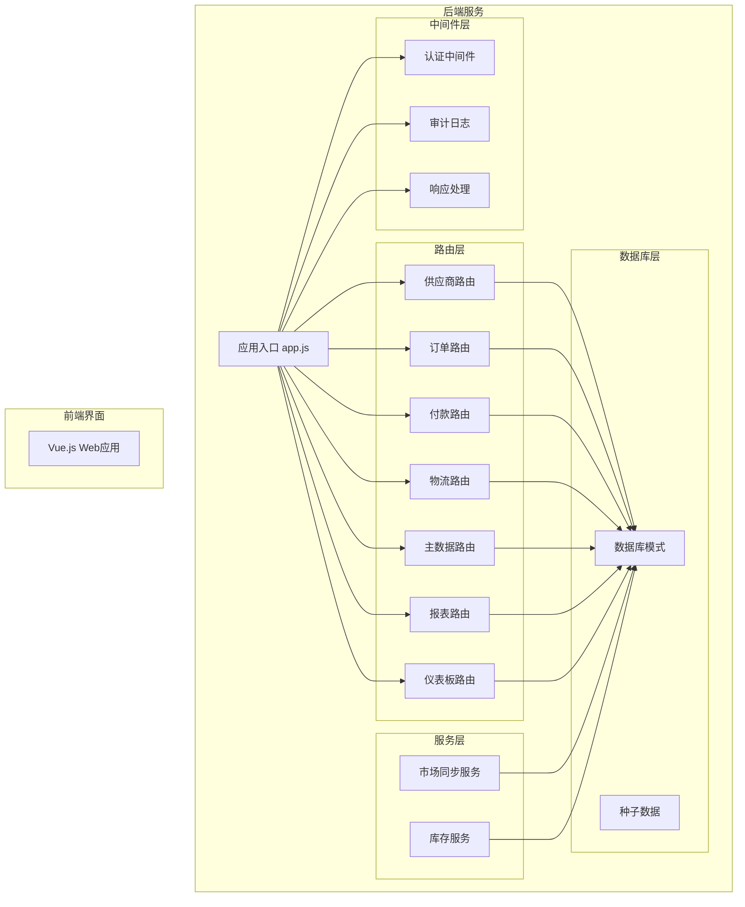
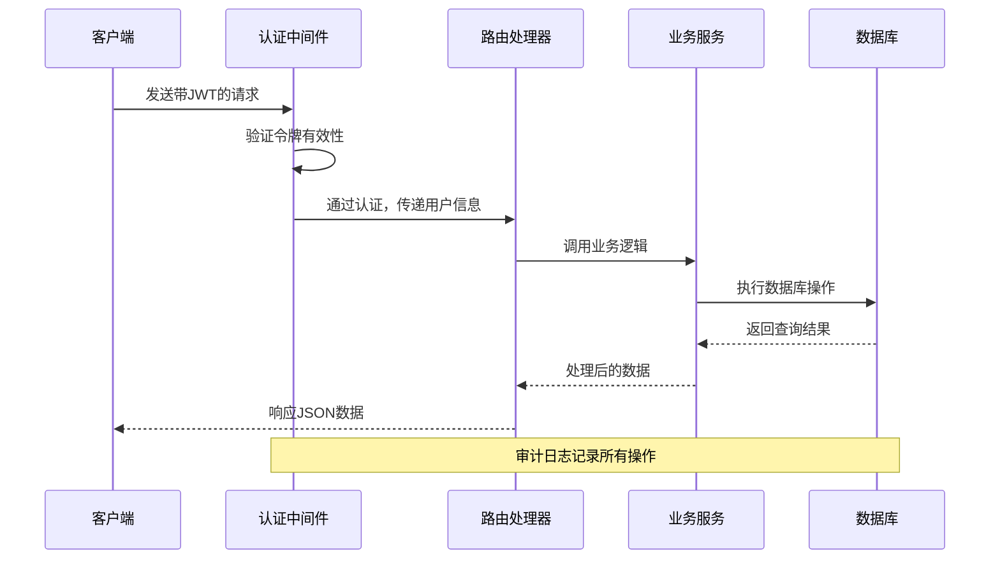
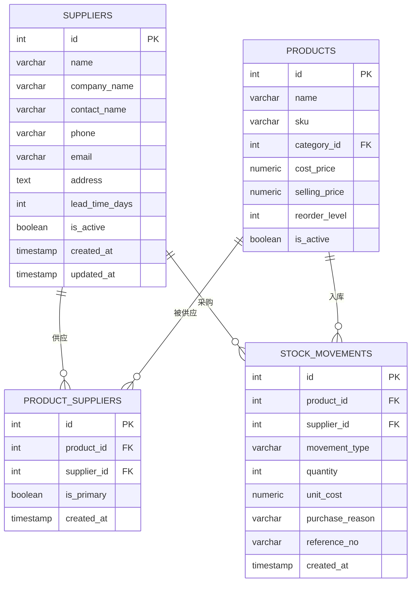
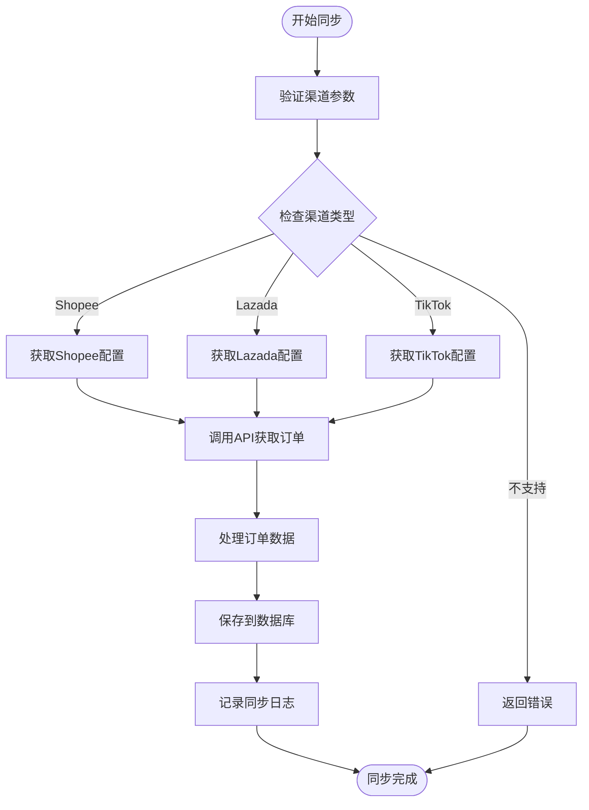
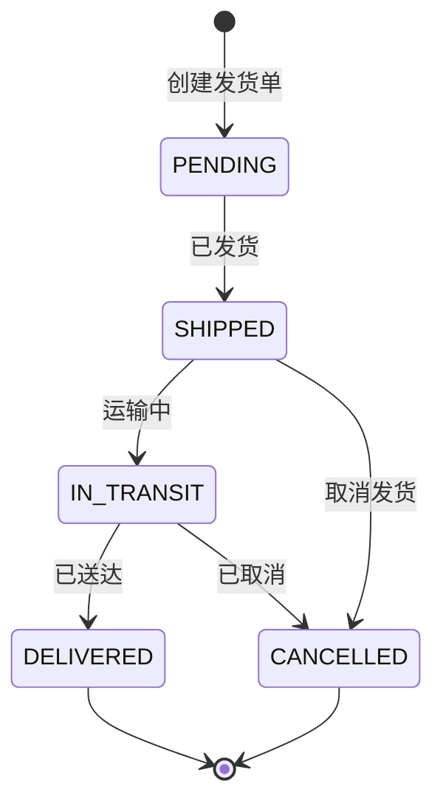
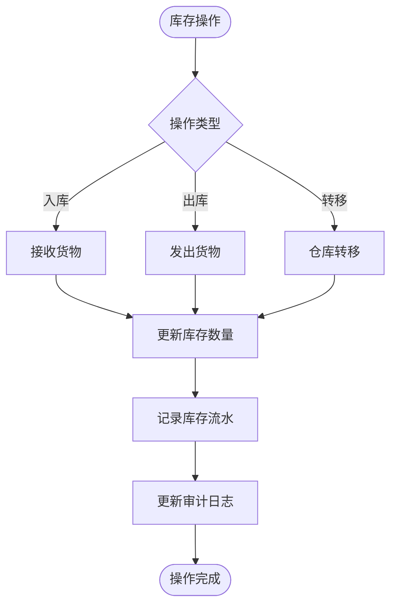
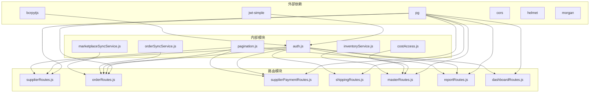

# 供应商供应链API

<cite>
**本文档引用的文件**
- [server/src/routes/supplierRoutes.js](file://server/src/routes/supplierRoutes.js)
- [server/src/routes/orderRoutes.js](file://server/src/routes/orderRoutes.js)
- [server/src/routes/supplierPaymentRoutes.js](file://server/src/routes/supplierPaymentRoutes.js)
- [server/src/routes/shippingRoutes.js](file://server/src/routes/shippingRoutes.js)
- [server/src/routes/masterRoutes.js](file://server/src/routes/masterRoutes.js)
- [server/src/routes/reportRoutes.js](file://server/src/routes/reportRoutes.js)
- [server/src/routes/dashboardRoutes.js](file://server/src/routes/dashboardRoutes.js)
- [server/src/utils/inventoryService.js](file://server/src/utils/inventoryService.js)
- [server/src/services/marketplaceSyncService.js](file://server/src/services/marketplaceSyncService.js)
- [server/database/schema.sql](file://server/database/schema.sql)
- [server/src/middleware/auth.js](file://server/src/middleware/auth.js)
- [server/src/app.js](file://server/src/app.js)
- [server/database/seed.sql](file://server/database/seed.sql)
</cite>

## 目录
1. [简介](#简介)
2. [项目结构](#项目结构)
3. [核心组件](#核心组件)
4. [架构概览](#架构概览)
5. [详细组件分析](#详细组件分析)
6. [依赖关系分析](#依赖关系分析)
7. [性能考虑](#性能考虑)
8. [故障排除指南](#故障排除指南)
9. [结论](#结论)

## 简介

本项目是一个完整的库存管理系统，专注于供应商和供应链管理。系统提供了从供应商管理、采购订单处理到付款结算的全流程API接口，支持多平台电商集成、实时库存跟踪、交货管理和质量检验等功能。

系统采用现代化的技术栈，包括Node.js + Express后端框架、PostgreSQL数据库、JWT认证机制和响应式前端界面。通过模块化的路由设计和中间件架构，实现了高内聚、低耦合的系统结构。

## 项目结构

**图表来源**
- [server/src/app.js:26-56](file://server/src/app.js#L26-L56)
- [server/src/routes/supplierRoutes.js:6](file://server/src/routes/supplierRoutes.js#L6)
- [server/src/routes/orderRoutes.js:8](file://server/src/routes/orderRoutes.js#L8)

**章节来源**
- [server/src/app.js:26-67](file://server/src/app.js#L26-L67)

## 核心组件

### 认证与授权中间件

系统采用JWT令牌进行用户认证，并通过角色权限控制实现细粒度的访问控制：

- **authenticateToken**: 验证JWT令牌的有效性，解析用户信息
- **authorizeRoles**: 基于角色的权限控制，支持ADMIN、MANAGER、STAFF三种角色
- **成本访问控制**: 特殊的x-cost-access-token头用于控制成本价格的可见性

### 数据库架构

系统采用关系型数据库设计，核心表包括：

- **suppliers**: 供应商信息表，支持多字段搜索和状态管理
- **marketplace_orders**: 电商平台订单同步表
- **shipping_shipments**: 物流发货跟踪表
- **supplier_payment_records**: 供应商付款记录表
- **stock_movements**: 库存变动流水表

**章节来源**
- [server/database/schema.sql:302-346](file://server/database/schema.sql#L302-L346)
- [server/src/middleware/auth.js:5-45](file://server/src/middleware/auth.js#L5-L45)

## 架构概览

**图表来源**
- [server/src/middleware/auth.js:5-29](file://server/src/middleware/auth.js#L5-L29)
- [server/src/app.js:34-35](file://server/src/app.js#L34-L35)

## 详细组件分析

### 供应商管理API

供应商管理是整个供应链系统的核心，提供了完整的供应商生命周期管理功能。

#### 主要功能特性

- **多维搜索**: 支持按公司名称、联系人、电话、邮箱等字段模糊搜索
- **状态管理**: 支持启用/停用供应商，自动更新审计日志
- **产品关联**: 自动统计每个供应商关联的产品数量
- **排序功能**: 支持按名称、创建时间、更新时间、交货周期排序
- **分页查询**: 高效处理大量供应商数据的分页显示

#### API接口定义

| 接口 | 方法 | 路径 | 权限 | 功能描述 |
|------|------|------|------|----------|
| 获取供应商列表 | GET | `/api/suppliers` | 所有用户 | 搜索和分页获取供应商列表 |
| 创建供应商 | POST | `/api/suppliers` | ADMIN, MANAGER | 创建新的供应商记录 |
| 获取供应商详情 | GET | `/api/suppliers/:id` | 所有用户 | 获取供应商详细信息及关联数据 |
| 更新供应商 | PUT | `/api/suppliers/:id` | ADMIN, MANAGER | 更新供应商基本信息 |
| 更新供应商状态 | PATCH | `/api/suppliers/:id/status` | ADMIN, MANAGER | 启用或停用供应商 |
| 删除供应商 | DELETE | `/api/suppliers/:id` | ADMIN, MANAGER | 删除供应商记录 |

#### 数据模型关系

**图表来源**
- [server/database/schema.sql:302-366](file://server/database/schema.sql#L302-L366)

**章节来源**
- [server/src/routes/supplierRoutes.js:23-367](file://server/src/routes/supplierRoutes.js#L23-L367)

### 采购订单管理API

系统集成了多个电商平台的订单同步功能，支持Shopee、Lazada、TikTok等平台的订单自动获取。

#### 订单同步流程

**图表来源**
- [server/src/services/marketplaceSyncService.js:18-140](file://server/src/services/marketplaceSyncService.js#L18-L140)

#### 订单管理功能

- **多平台同步**: 支持主流电商平台的订单自动同步
- **状态跟踪**: 实时跟踪订单状态变化
- **分页查询**: 高效处理大量订单数据
- **搜索过滤**: 支持按渠道、状态、关键词搜索

**章节来源**
- [server/src/routes/orderRoutes.js:13-110](file://server/src/routes/orderRoutes.js#L13-L110)
- [server/src/services/marketplaceSyncService.js:18-140](file://server/src/services/marketplaceSyncService.js#L18-L140)

### 付款处理API

供应商付款管理提供了完整的付款记录和统计功能。

#### 付款记录管理

| 接口 | 方法 | 路径 | 权限 | 功能描述 |
|------|------|------|------|----------|
| 获取付款记录 | GET | `/api/supplier-payments` | 所有用户 | 获取付款记录列表（支持筛选） |
| 付款汇总统计 | GET | `/api/supplier-payments/summary` | 所有用户 | 按供应商分组的付款汇总 |
| 创建付款记录 | POST | `/api/supplier-payments` | ADMIN, MANAGER | 记录供应商付款信息 |
| 删除付款记录 | DELETE | `/api/supplier-payments/:id` | ADMIN, MANAGER | 删除付款记录 |

#### 统计分析功能

系统提供月度付款统计功能，支持：
- 按年份查询供应商付款情况
- 生成月度付款报告
- 供应商付款历史追踪

**章节来源**
- [server/src/routes/supplierPaymentRoutes.js:19-174](file://server/src/routes/supplierPaymentRoutes.js#L19-L174)

### 物流配送API

物流配送管理涵盖了从订单发货到货物签收的完整流程。

#### 发货管理流程

**图表来源**
- [server/src/routes/shippingRoutes.js:108-152](file://server/src/routes/shippingRoutes.js#L108-L152)

#### 物流功能特性

- **状态管理**: 支持PENDING、SHIPPED、IN_TRANSIT、DELIVERED、CANCELLED五种状态
- **跟踪信息**: 支持快递单号、物流服务商、服务等级等信息
- **批量查询**: 支持按状态和关键词批量查询发货单
- **实时更新**: 支持发货状态的实时更新和追踪

**章节来源**
- [server/src/routes/shippingRoutes.js:10-152](file://server/src/routes/shippingRoutes.js#L10-L152)

### 库存管理API

系统提供了完整的库存管理功能，包括库存查询、出入库操作、盘点管理等。

#### 库存操作流程

**图表来源**
- [server/src/utils/inventoryService.js:29-38](file://server/src/utils/inventoryService.js#L29-L38)

**章节来源**
- [server/src/utils/inventoryService.js:1-45](file://server/src/utils/inventoryService.js#L1-L45)

### 报表与仪表板

系统提供了丰富的报表和可视化功能，帮助管理者全面了解供应链状况。

#### 关键指标

- **库存报表**: 实时库存、可用库存、库存价值等
- **流水报表**: 详细的库存变动记录
- **仪表板汇总**: 产品数量、仓库数量、缺货预警等关键指标
- **趋势分析**: 月度库存变化趋势图

**章节来源**
- [server/src/routes/reportRoutes.js:16-249](file://server/src/routes/reportRoutes.js#L16-L249)
- [server/src/routes/dashboardRoutes.js:10-120](file://server/src/routes/dashboardRoutes.js#L10-L120)

## 依赖关系分析

**图表来源**
- [server/src/app.js:9-24](file://server/src/app.js#L9-L24)
- [server/src/middleware/auth.js:1-45](file://server/src/middleware/auth.js#L1-L45)

**章节来源**
- [server/src/app.js:9-24](file://server/src/app.js#L9-L24)

## 性能考虑

### 数据库优化策略

1. **索引优化**: 为常用查询字段建立适当索引，如供应商名称、订单状态、产品SKU等
2. **分页查询**: 对大量数据采用分页查询，避免一次性加载过多数据
3. **连接池**: 使用连接池管理数据库连接，提高并发性能
4. **查询优化**: 使用预编译语句和参数化查询，防止SQL注入

### 缓存策略

1. **会话缓存**: 使用Redis缓存用户会话信息
2. **配置缓存**: 缓存系统配置和设置信息
3. **查询结果缓存**: 对静态数据和不频繁变更的数据进行缓存

### API性能优化

1. **批量操作**: 支持批量数据操作，减少网络往返
2. **异步处理**: 对耗时操作采用异步处理机制
3. **压缩传输**: 启用Gzip压缩减少数据传输量

## 故障排除指南

### 常见问题诊断

#### 认证失败
- 检查JWT令牌是否正确传递
- 验证令牌是否过期
- 确认用户账户状态正常

#### 权限不足
- 验证用户角色是否具有相应权限
- 检查API端点的权限要求
- 确认成本访问令牌的有效性

#### 数据库连接问题
- 检查数据库连接字符串
- 验证数据库服务状态
- 查看数据库连接池配置

#### API响应错误

| 错误代码 | 可能原因 | 解决方案 |
|----------|----------|----------|
| 401 | 未提供有效令牌 | 检查Authorization头，重新登录 |
| 403 | 权限不足 | 验证用户角色，确认操作权限 |
| 404 | 资源不存在 | 检查ID是否正确，确认资源存在 |
| 500 | 服务器内部错误 | 查看服务器日志，检查数据库连接 |

**章节来源**
- [server/src/middleware/auth.js:9-28](file://server/src/middleware/auth.js#L9-L28)

### 日志分析

系统提供了完善的日志记录功能，包括：
- **访问日志**: 记录所有API请求的详细信息
- **审计日志**: 记录用户的重要操作行为
- **错误日志**: 记录系统运行时的异常信息
- **性能日志**: 记录关键操作的执行时间和性能指标

## 结论

本供应商供应链管理系统提供了完整的供应链管理解决方案，具有以下特点：

### 核心优势

1. **功能完整性**: 覆盖了从供应商管理到付款结算的完整供应链流程
2. **技术先进性**: 采用现代化的技术栈和最佳实践
3. **扩展性强**: 模块化设计便于功能扩展和维护
4. **安全性高**: 完善的认证授权机制和数据保护措施
5. **用户体验好**: 提供直观的API接口和清晰的错误反馈

### 应用场景

- 中小型制造企业的供应链管理
- 电商企业的供应商协作平台
- 多仓库运营的库存管理中心
- 跨境贸易的供应商管理系统

### 发展建议

1. **移动端支持**: 开发移动应用或PWA版本
2. **AI集成**: 集成预测分析和智能推荐功能
3. **区块链**: 考虑使用区块链技术增强供应链透明度
4. **IoT集成**: 集成物联网设备进行实时监控

该系统为供应商和供应链管理提供了坚实的技术基础，能够满足大多数企业的日常运营需求，并具备良好的扩展性和适应性。