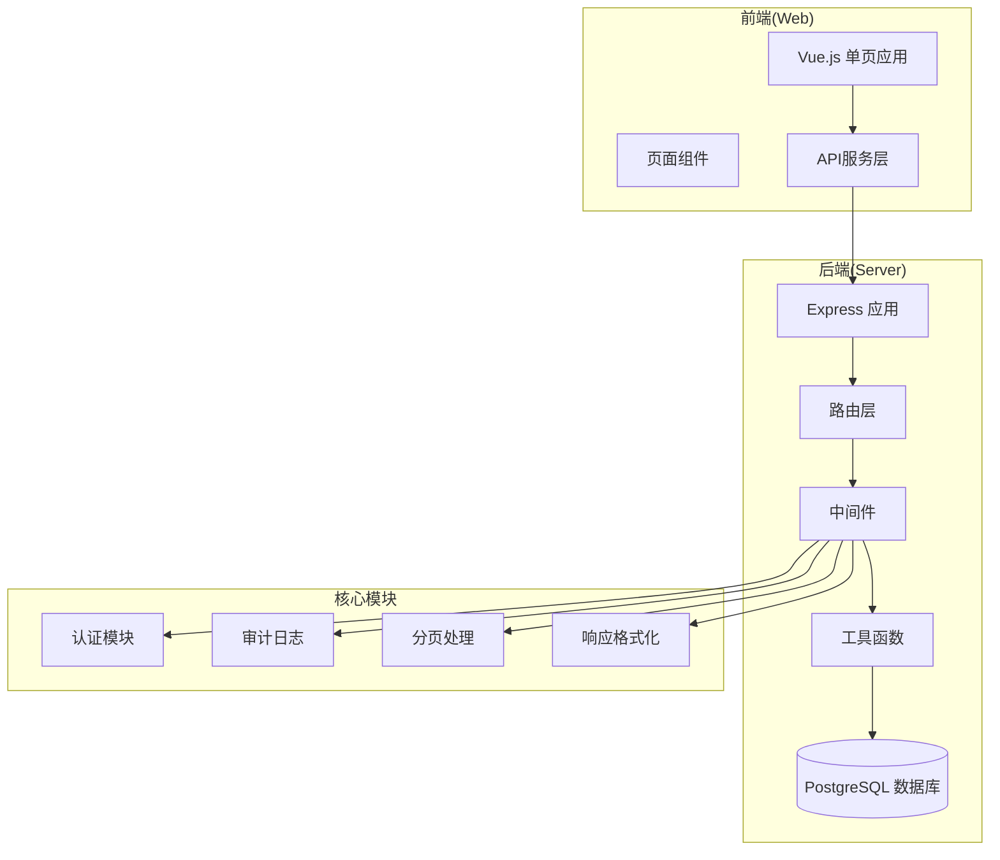
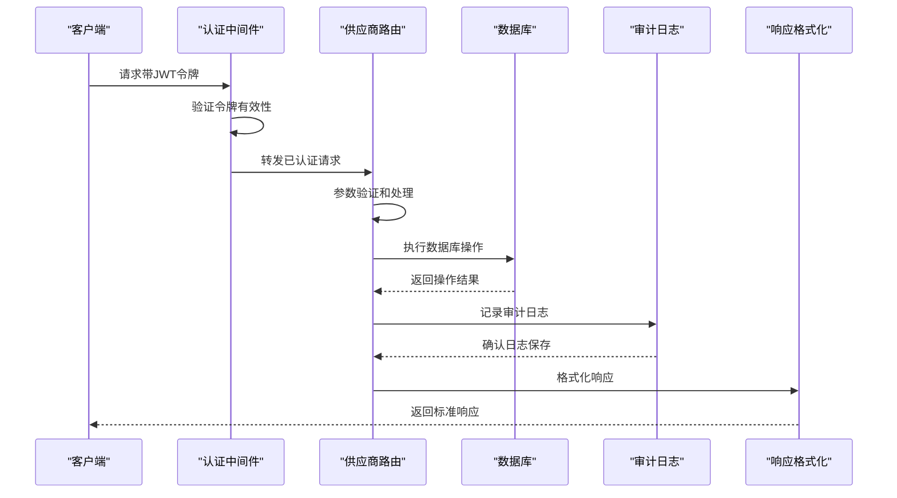
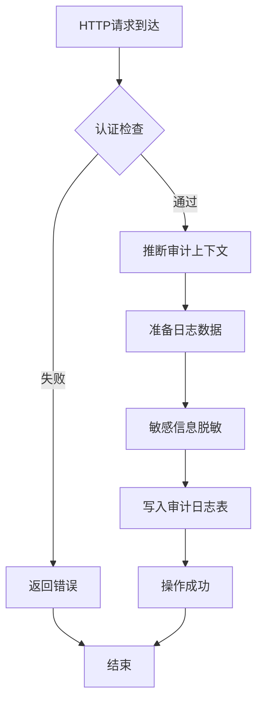
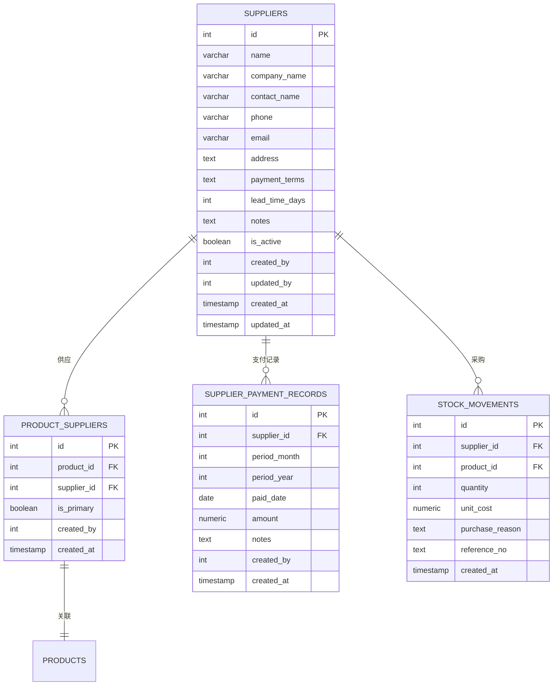
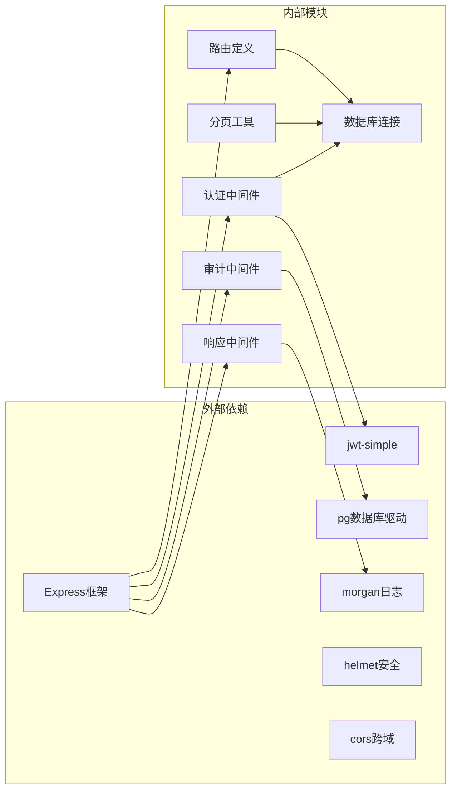

# 供应商管理API

<cite>
**本文档引用的文件**
- [server/src/routes/supplierRoutes.js](file://server/src/routes/supplierRoutes.js)
- [server/src/middleware/auditTrail.js](file://server/src/middleware/auditTrail.js)
- [server/src/utils/auditLog.js](file://server/src/utils/auditLog.js)
- [server/src/middleware/response.js](file://server/src/middleware/response.js)
- [server/src/middleware/auth.js](file://server/src/middleware/auth.js)
- [server/src/utils/pagination.js](file://server/src/utils/pagination.js)
- [server/database/schema.sql](file://server/database/schema.sql)
- [server/src/app.js](file://server/src/app.js)
- [server/src/server.js](file://server/src/server.js)
- [web/src/pages/SuppliersPage.vue](file://web/src/pages/SuppliersPage.vue)
- [web/src/pages/SupplierDetailPage.vue](file://web/src/pages/SupplierDetailPage.vue)
- [web/src/services/api.js](file://web/src/services/api.js)
</cite>

## 目录
1. [简介](#简介)
2. [项目结构](#项目结构)
3. [核心组件](#核心组件)
4. [架构概览](#架构概览)
5. [详细组件分析](#详细组件分析)
6. [依赖关系分析](#依赖关系分析)
7. [性能考虑](#性能考虑)
8. [故障排除指南](#故障排除指南)
9. [结论](#结论)

## 简介

本文件为库存管理系统的供应商管理API提供完整的文档说明。该系统基于Node.js + Express构建，采用PostgreSQL数据库存储，实现了完整的供应商CRUD操作功能。系统支持供应商信息管理、状态控制、联系信息维护、支付条款设置等核心业务功能，并内置了完善的审计日志记录机制。

## 项目结构

库存管理系统采用前后端分离架构，主要由以下模块组成：



**图表来源**
- [server/src/app.js:26-56](file://server/src/app.js#L26-L56)
- [server/src/routes/supplierRoutes.js:6-8](file://server/src/routes/supplierRoutes.js#L6-L8)

**章节来源**
- [server/src/app.js:1-67](file://server/src/app.js#L1-L67)
- [server/src/server.js:13-25](file://server/src/server.js#L13-L25)

## 核心组件

### 认证与授权中间件

系统使用JWT令牌进行用户身份验证，并通过角色授权控制访问权限：

- **authenticateToken**: 验证JWT令牌有效性，解析用户信息
- **authorizeRoles**: 基于角色的访问控制，支持ADMIN、MANAGER、STAFF角色
- **响应格式化**: 统一API响应格式，支持成功/失败两种模式

### 审计日志系统

内置完整的审计日志记录机制，自动追踪所有供应商相关的操作：

- **自动审计**: 基于URL路径和HTTP方法自动推断审计上下文
- **敏感信息保护**: 自动屏蔽密码等敏感字段
- **统一格式**: 标准化的审计日志结构，便于查询和分析

### 分页处理

统一的分页参数处理机制，支持灵活的分页配置：

- **参数验证**: 自动验证和标准化分页参数
- **范围限制**: 默认每页1-100条记录，防止过度请求
- **结果格式**: 统一的分页结果结构

**章节来源**
- [server/src/middleware/auth.js:5-40](file://server/src/middleware/auth.js#L5-L40)
- [server/src/middleware/auditTrail.js:47-79](file://server/src/middleware/auditTrail.js#L47-L79)
- [server/src/utils/pagination.js:2-22](file://server/src/utils/pagination.js#L2-L22)

## 架构概览

供应商管理API采用RESTful设计原则，遵循统一的架构模式：



**图表来源**
- [server/src/middleware/auth.js:5-28](file://server/src/middleware/auth.js#L5-L28)
- [server/src/middleware/auditTrail.js:47-79](file://server/src/middleware/auditTrail.js#L47-L79)
- [server/src/middleware/response.js:3-57](file://server/src/middleware/response.js#L3-L57)

## 详细组件分析

### 供应商路由定义

系统提供完整的供应商CRUD操作接口，每个接口都经过严格的参数验证和错误处理。

#### GET /api/suppliers - 获取供应商列表

**查询参数**:
- `search`: 搜索关键词，支持公司名称、联系人、电话、邮箱模糊匹配
- `status`: 状态过滤，可选值：all(全部)、active(启用)、inactive(停用)
- `sortBy`: 排序字段，可选值：name(名称)、created_at(创建时间)、updated_at(更新时间)、lead_time_days(交货周期)
- `sortOrder`: 排序顺序，可选值：asc(升序)、desc(降序)
- `page`: 页码，默认1，最小1
- `pageSize`: 每页条数，默认10，最大100

**响应数据结构**:
```javascript
{
  "items": [
    {
      "id": 1,
      "name": "供应商名称",
      "company_name": "公司名称",
      "contact_name": "联系人",
      "phone": "电话",
      "email": "邮箱",
      "address": "地址",
      "payment_terms": "付款条件",
      "lead_time_days": 7,
      "notes": "备注",
      "is_active": true,
      "linked_product_count": 5,
      "created_by": 1,
      "updated_by": 1,
      "created_at": "2024-01-01T00:00:00Z",
      "updated_at": "2024-01-01T00:00:00Z"
    }
  ],
  "pagination": {
    "total": 100,
    "page": 1,
    "pageSize": 10,
    "totalPages": 10
  }
}
```

**章节来源**
- [server/src/routes/supplierRoutes.js:23-92](file://server/src/routes/supplierRoutes.js#L23-L92)
- [server/src/utils/pagination.js:15-22](file://server/src/utils/pagination.js#L15-L22)

#### POST /api/suppliers - 创建供应商

**请求体字段**:
- `name` *(必填)*: 公司名称
- `contactName`: 联系人姓名
- `phone`: 联系电话
- `email`: 邮箱地址
- `address`: 公司地址
- `paymentTerms`: 付款条件
- `leadTimeDays`: 交货周期(天)
- `branch`: 分公司
- `businessHours`: 营业时间
- `parentCompany`: 母公司
- `mapLink`: 地图链接
- `notes`: 备注
- `isActive`: 是否启用，默认true

**字段验证规则**:
- `name` 字段必须存在且非空
- 数值字段自动转换为数字类型
- 可选字段为空时转换为NULL
- `isActive` 默认值为true

**响应**: 返回完整的供应商信息，包含自动生成的ID和时间戳

**章节来源**
- [server/src/routes/supplierRoutes.js:94-169](file://server/src/routes/supplierRoutes.js#L94-L169)

#### GET /api/suppliers/:id - 获取供应商详情

**路径参数**:
- `id`: 供应商唯一标识符

**响应数据结构**:
```javascript
{
  "supplier": {
    // 供应商基本信息
  },
  "products": [
    {
      "id": 1,
      "name": "产品名称",
      "sku": "SKU001",
      "product_code": "PRD001",
      "is_active": true,
      "is_primary": true,
      "category_name": "分类名称"
    }
  ],
  "recentPurchases": [
    {
      "id": 1,
      "product_id": 1,
      "quantity": 10,
      "unit_cost": 100.00,
      "purchase_reason": "采购原因",
      "reference_no": "REF001",
      "created_at": "2024-01-01T00:00:00Z",
      "product_name": "产品名称",
      "sku": "SKU001",
      "warehouse_name": "仓库名称",
      "created_by_name": "操作员"
    }
  ]
}
```

**章节来源**
- [server/src/routes/supplierRoutes.js:171-232](file://server/src/routes/supplierRoutes.js#L171-L232)

#### PUT /api/suppliers/:id - 更新供应商信息

**请求体字段**: 与创建接口相同，所有字段均为可选

**更新逻辑**:
- 支持部分字段更新
- 自动更新 `updated_by` 和 `updated_at` 字段
- 保持 `name` 字段与 `company_name` 同步

**响应**: 返回更新后的完整供应商信息

**章节来源**
- [server/src/routes/supplierRoutes.js:234-313](file://server/src/routes/supplierRoutes.js#L234-L313)

#### PATCH /api/suppliers/:id/status - 更新供应商状态

**请求体字段**:
- `isActive` *(必填)*: 新的状态值(true/false)

**状态变更规则**:
- 仅允许更新 `is_active` 字段
- 自动记录操作员信息和时间戳
- 支持启用/停用切换

**响应**: 返回状态更新后的供应商信息

**章节来源**
- [server/src/routes/supplierRoutes.js:315-344](file://server/src/routes/supplierRoutes.js#L315-L344)

#### DELETE /api/suppliers/:id - 删除供应商

**删除规则**:
- 支持级联删除(依赖数据库约束)
- 删除前会检查供应商是否存在
- 自动记录删除审计日志

**响应**: 204 No Content

**章节来源**
- [server/src/routes/supplierRoutes.js:346-367](file://server/src/routes/supplierRoutes.js#L346-L367)

### 审计日志记录

系统自动为所有供应商相关操作生成审计日志：



**图表来源**
- [server/src/middleware/auditTrail.js:47-79](file://server/src/middleware/auditTrail.js#L47-L79)
- [server/src/utils/auditLog.js:1-33](file://server/src/utils/auditLog.js#L1-L33)

**审计日志字段**:
- `action`: 操作类型(SUPPLIER_CREATE/SUPPLIER_UPDATE等)
- `entity_type`: 实体类型(SUPPLIER)
- `entity_id`: 实体ID
- `method`: HTTP方法
- `path`: 请求路径
- `description`: 操作描述
- `metadata`: 请求元数据(JSON格式)

**章节来源**
- [server/src/middleware/auditTrail.js:14-44](file://server/src/middleware/auditTrail.js#L14-L44)
- [server/src/utils/auditLog.js:1-33](file://server/src/utils/auditLog.js#L1-L33)

### 数据模型关系

供应商管理涉及多个相关表的数据结构：



**图表来源**
- [server/database/schema.sql:302-318](file://server/database/schema.sql#L302-L318)
- [server/database/schema.sql:348-356](file://server/database/schema.sql#L348-L356)
- [server/database/schema.sql:335-346](file://server/database/schema.sql#L335-L346)
- [server/database/schema.sql:237-248](file://server/database/schema.sql#L237-L248)

**章节来源**
- [server/database/schema.sql:302-366](file://server/database/schema.sql#L302-L366)

## 依赖关系分析

系统各组件之间的依赖关系如下：



**图表来源**
- [server/src/app.js:1-67](file://server/src/app.js#L1-L67)
- [server/src/middleware/auth.js:1-2](file://server/src/middleware/auth.js#L1-L2)

**依赖特性**:
- **认证依赖**: JWT令牌验证和用户信息查询
- **审计依赖**: 数据库连接用于日志持久化
- **响应依赖**: HTTP请求日志记录
- **分页依赖**: 数据库查询优化
- **路由依赖**: 数据库连接池

**章节来源**
- [server/src/app.js:28-34](file://server/src/app.js#L28-L34)
- [server/src/server.js:1-28](file://server/src/server.js#L1-L28)

## 性能考虑

### 查询优化策略

1. **索引优化**: 供应商表建立了多处索引以支持常用查询
2. **分页限制**: 默认每页10条，最大100条，防止大结果集
3. **批量查询**: 列表接口使用Promise.all并行执行多个查询
4. **模糊搜索**: 使用ILIKE进行大小写不敏感搜索

### 缓存策略

- **数据库连接池**: 使用连接池减少连接开销
- **响应缓存**: 对只读查询结果进行短期缓存
- **前端缓存**: 前端页面组件支持本地状态缓存

### 错误处理

- **统一错误格式**: 所有错误响应遵循统一格式
- **超时处理**: 数据库连接超时检测
- **资源清理**: 异常情况下确保资源正确释放

## 故障排除指南

### 常见问题及解决方案

**认证失败**
- 检查JWT令牌是否过期或格式错误
- 确认用户账户状态正常
- 验证请求头Authorization格式

**权限不足**
- 确认用户角色具有相应权限
- 检查管理员或经理权限
- 验证用户是否被停用

**数据库连接问题**
- 检查数据库服务状态
- 验证连接字符串配置
- 查看启动超时设置

**审计日志异常**
- 检查审计日志表结构
- 验证数据库权限设置
- 查看日志写入错误信息

**章节来源**
- [server/src/middleware/auth.js:9-28](file://server/src/middleware/auth.js#L9-L28)
- [server/src/middleware/auditTrail.js:73-75](file://server/src/middleware/auditTrail.js#L73-L75)

### API调用示例

**获取供应商列表**:
```
GET /api/suppliers?page=1&pageSize=10&status=all&sortBy=updated_at&sortOrder=desc
Authorization: Bearer <token>
```

**创建供应商**:
```
POST /api/suppliers
Authorization: Bearer <token>
Content-Type: application/json

{
  "name": "新供应商",
  "contactName": "张三",
  "phone": "13800000000",
  "email": "zhangsan@supplier.com",
  "address": "广东省深圳市南山区科技园",
  "paymentTerms": "1_month",
  "leadTimeDays": 7,
  "isActive": true
}
```

**更新供应商状态**:
```
PATCH /api/suppliers/1/status
Authorization: Bearer <token>
Content-Type: application/json

{
  "isActive": false
}
```

## 结论

供应商管理API提供了完整的供应商生命周期管理功能，具有以下特点：

1. **功能完整性**: 支持供应商的全生命周期操作
2. **安全性**: 内置认证授权和审计日志机制
3. **易用性**: 统一的API设计和响应格式
4. **可扩展性**: 模块化设计便于功能扩展
5. **可靠性**: 完善的错误处理和性能优化

系统通过合理的架构设计和严格的质量控制，为库存管理提供了稳定可靠的供应商管理基础。建议在生产环境中配合适当的监控和备份策略，确保系统的高可用性和数据安全。