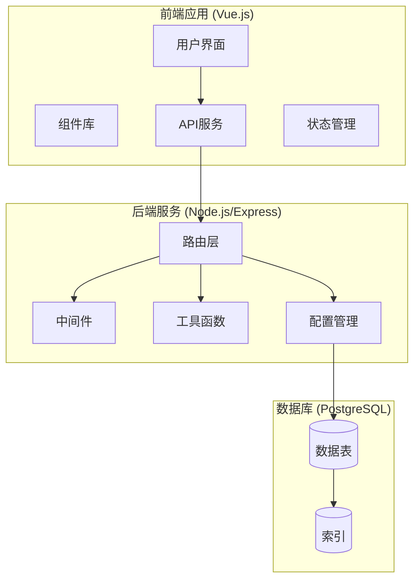
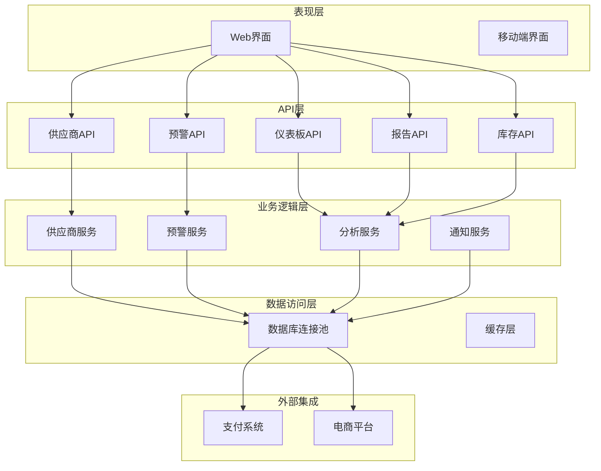
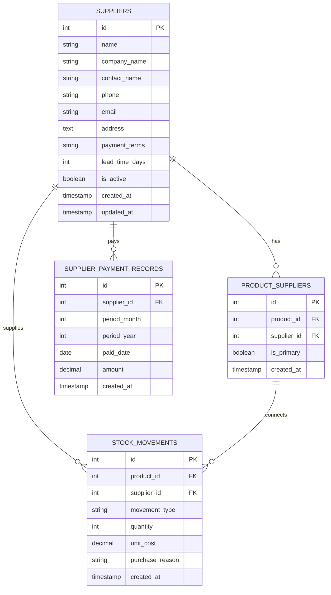
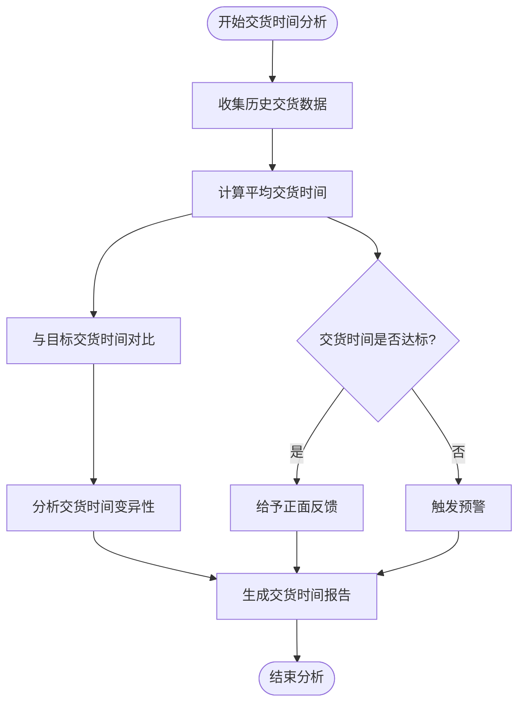
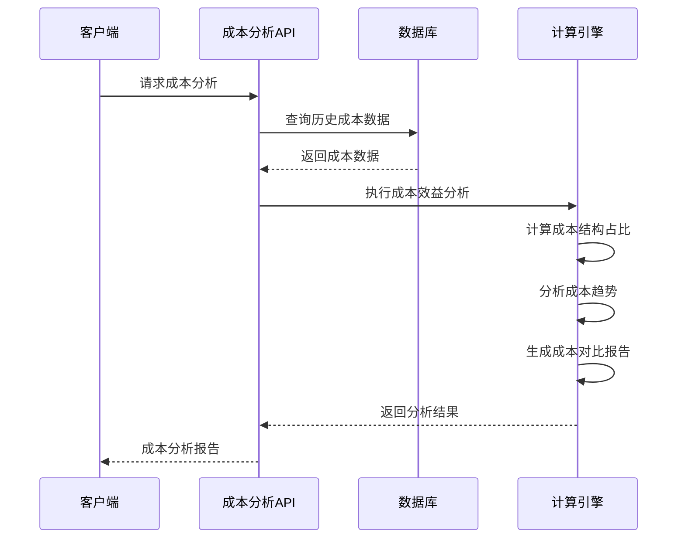
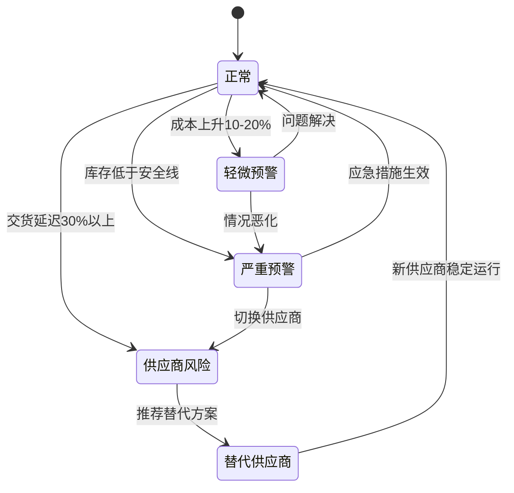
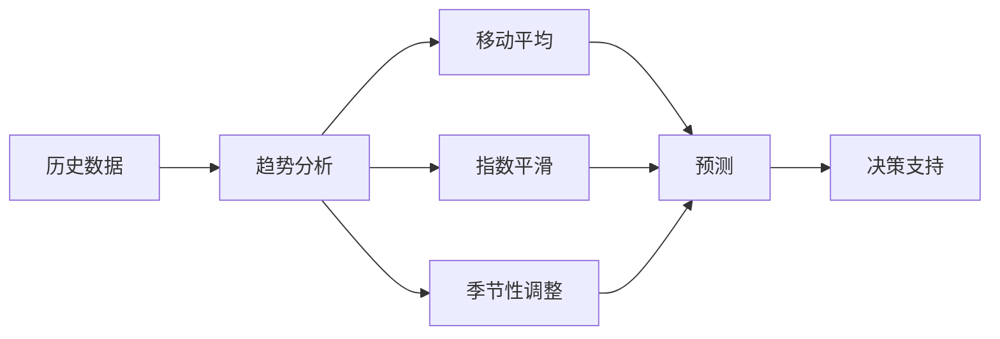
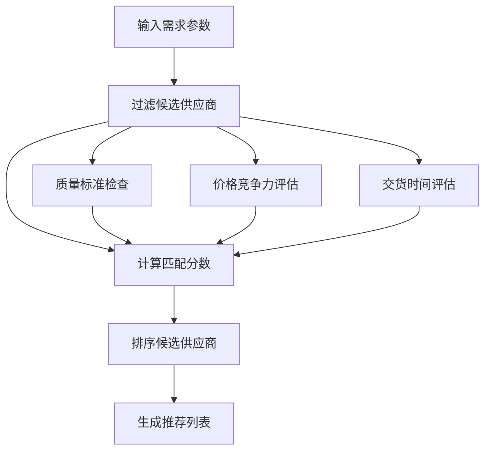
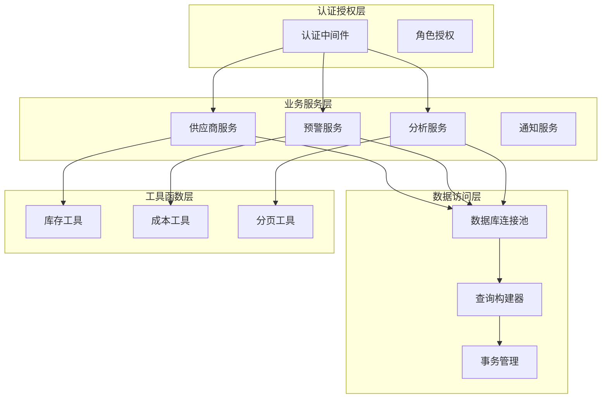

# 供应链分析API

<cite>
**本文档引用的文件**
- [server/src/routes/supplierRoutes.js](file://server/src/routes/supplierRoutes.js)
- [server/src/routes/alertsRoutes.js](file://server/src/routes/alertsRoutes.js)
- [server/src/routes/dashboardRoutes.js](file://server/src/routes/dashboardRoutes.js)
- [server/src/routes/reportRoutes.js](file://server/src/routes/reportRoutes.js)
- [server/src/routes/inventoryRoutes.js](file://server/src/routes/inventoryRoutes.js)
- [server/database/schema.sql](file://server/database/schema.sql)
- [server/src/utils/inventoryService.js](file://server/src/utils/inventoryService.js)
- [server/src/middleware/auth.js](file://server/src/middleware/auth.js)
- [server/src/config/db.js](file://server/config/db.js)
- [web/src/pages/SuppliersPage.vue](file://web/src/pages/SuppliersPage.vue)
- [web/src/pages/AlertsPage.vue](file://web/src/pages/AlertsPage.vue)
- [web/src/pages/DashboardPage.vue](file://web/src/pages/DashboardPage.vue)
- [web/src/services/api.js](file://web/src/services/api.js)
</cite>

## 目录
1. [简介](#简介)
2. [项目结构](#项目结构)
3. [核心组件](#核心组件)
4. [架构概览](#架构概览)
5. [详细组件分析](#详细组件分析)
6. [依赖关系分析](#依赖关系分析)
7. [性能考虑](#性能考虑)
8. [故障排除指南](#故障排除指南)
9. [结论](#结论)
10. [附录](#附录)

## 简介

本项目是一个基于Node.js和Vue.js的供应链管理系统，专注于库存管理和供应商分析监控。系统提供了完整的供应链分析API，包括供应商绩效评估、交货时间分析、成本对比和风险评估功能。

该系统通过实时监控指标、可视化图表、趋势分析和预警机制，为企业提供全面的供应链洞察。主要功能涵盖：

- **供应商管理**：供应商信息维护、绩效评估、交货时间跟踪
- **库存监控**：实时库存水平、低库存预警、库存周转分析
- **成本分析**：成本对比、价格变动监控、成本效益分析
- **风险评估**：供应商风险监控、替代供应商推荐、供应链弹性评估
- **可视化展示**：多维度图表、趋势分析、仪表板

## 项目结构

系统采用前后端分离架构，后端使用Express.js提供RESTful API，前端使用Vue.js构建用户界面。

**图表来源**
- [server/src/app.js](file://server/src/app.js)
- [server/src/config/db.js](file://server/src/config/db.js)

**章节来源**
- [server/src/app.js](file://server/src/app.js)
- [server/src/config/db.js](file://server/src/config/db.js)

## 核心组件

### 供应商管理模块

供应商管理模块提供完整的供应商生命周期管理功能，包括供应商信息维护、绩效评估和交货时间分析。

**章节来源**
- [server/src/routes/supplierRoutes.js](file://server/src/routes/supplierRoutes.js)
- [server/database/schema.sql](file://server/database/schema.sql)

### 预警监控模块

预警监控模块负责实时监控库存状态，提供低库存预警、价格变动通知等功能。

**章节来源**
- [server/src/routes/alertsRoutes.js](file://server/src/routes/alertsRoutes.js)
- [server/database/schema.sql](file://server/database/schema.sql)

### 仪表板分析模块

仪表板模块提供供应链关键指标的可视化展示，包括库存水平、移动趋势和分布情况。

**章节来源**
- [server/src/routes/dashboardRoutes.js](file://server/src/routes/dashboardRoutes.js)

### 报告分析模块

报告模块支持多种供应链分析报告的生成和导出，包括库存报表、流水报表等。

**章节来源**
- [server/src/routes/reportRoutes.js](file://server/src/routes/reportRoutes.js)

## 架构概览

系统采用分层架构设计，确保业务逻辑清晰分离和可维护性。

**图表来源**
- [server/src/routes/supplierRoutes.js](file://server/src/routes/supplierRoutes.js)
- [server/src/routes/alertsRoutes.js](file://server/src/routes/alertsRoutes.js)
- [server/src/routes/dashboardRoutes.js](file://server/src/routes/dashboardRoutes.js)
- [server/src/routes/reportRoutes.js](file://server/src/routes/reportRoutes.js)
- [server/src/config/db.js](file://server/src/config/db.js)

## 详细组件分析

### 供应商绩效评估系统

供应商绩效评估系统通过多个维度对供应商进行综合评价，包括交货时间、质量指标和成本效益分析。

#### 核心数据模型

**图表来源**
- [server/database/schema.sql](file://server/database/schema.sql)

#### 供应商评分算法

供应商评分系统采用加权评分模型，综合考虑以下因素：

- **交货时间准确性**：基于历史交货时间与承诺交货时间的偏差
- **质量合格率**：基于退货率和质量问题的统计
- **成本竞争力**：基于价格比较和成本效益分析
- **服务可靠性**：基于响应时间和问题解决效率
- **财务稳定性**：基于支付记录和财务状况

#### 交货时间分析

系统提供详细的交货时间分析功能：

**图表来源**
- [server/src/routes/supplierRoutes.js](file://server/src/routes/supplierRoutes.js)
- [server/database/schema.sql](file://server/database/schema.sql)

**章节来源**
- [server/src/routes/supplierRoutes.js](file://server/src/routes/supplierRoutes.js)
- [server/database/schema.sql](file://server/database/schema.sql)

### 成本对比和效益分析

成本分析模块提供全面的成本对比和效益评估功能：

#### 成本结构分析

系统支持多维度的成本分析：

- **直接成本**：原材料、人工、制造费用
- **间接成本**：管理费用、营销费用、研发费用
- **隐性成本**：机会成本、风险成本、质量成本

#### 成本效益分析流程

**图表来源**
- [server/src/routes/reportRoutes.js](file://server/src/routes/reportRoutes.js)
- [server/src/utils/costAccess.js](file://server/src/utils/costAccess.js)

**章节来源**
- [server/src/routes/reportRoutes.js](file://server/src/routes/reportRoutes.js)
- [server/src/utils/costAccess.js](file://server/src/utils/costAccess.js)

### 风险评估和预警机制

系统内置完善的风险评估和预警机制：

#### 风险评估指标

- **供应商风险**：财务健康状况、交货可靠性、质量稳定性
- **市场风险**：价格波动、需求变化、竞争压力
- **运营风险**：库存积压、缺货风险、物流中断
- **合规风险**：法规变化、许可证问题、质量标准

#### 预警级别和响应

**图表来源**
- [server/src/routes/alertsRoutes.js](file://server/src/routes/alertsRoutes.js)

**章节来源**
- [server/src/routes/alertsRoutes.js](file://server/src/routes/alertsRoutes.js)

### 供应链可视化和趋势分析

#### 仪表板可视化

系统提供丰富的可视化图表：

- **库存分布图**：按仓库、类别、供应商的库存分布
- **移动趋势图**：月度库存流动趋势
- **供应商绩效雷达图**：多维度供应商评估
- **成本结构饼图**：各项成本占比分析

#### 趋势分析算法

**图表来源**
- [server/src/routes/dashboardRoutes.js](file://server/src/routes/dashboardRoutes.js)

**章节来源**
- [server/src/routes/dashboardRoutes.js](file://server/src/routes/dashboardRoutes.js)

### 供应商集中度分析

系统提供供应商集中度分析功能：

#### 集中度计算公式

供应商集中度 = 1 - Σ(市场份额²)

其中市场份额 = 单个供应商采购额 / 总采购额

#### 集中度风险评估

- **低集中度** (<0.2)：风险较低，供应稳定
- **中等集中度** (0.2-0.4)：需要监控，适度分散
- **高集中度** (>0.4)：风险较高，需要制定应急预案

**章节来源**
- [server/src/routes/supplierRoutes.js](file://server/src/routes/supplierRoutes.js)

### 替代供应商推荐系统

系统基于机器学习算法提供智能替代供应商推荐：

#### 推荐算法流程

**图表来源**
- [server/src/routes/supplierRoutes.js](file://server/src/routes/supplierRoutes.js)

**章节来源**
- [server/src/routes/supplierRoutes.js](file://server/src/routes/supplierRoutes.js)

### 供应链弹性评估

系统提供供应链弹性评估功能：

#### 弹性评估维度

- **多样性**：供应商数量和地理分布
- **冗余性**：安全库存和替代方案
- **适应性**：快速响应变化的能力
- **恢复力**：从冲击中恢复的速度

#### 弹性指数计算

弹性指数 = Σ(权重 × 指标得分) / Σ(权重)

**章节来源**
- [server/src/routes/alertsRoutes.js](file://server/src/routes/alertsRoutes.js)

## 依赖关系分析

系统采用模块化设计，各组件间依赖关系清晰：

**图表来源**
- [server/src/middleware/auth.js](file://server/src/middleware/auth.js)
- [server/src/config/db.js](file://server/src/config/db.js)
- [server/src/utils/inventoryService.js](file://server/src/utils/inventoryService.js)

**章节来源**
- [server/src/middleware/auth.js](file://server/src/middleware/auth.js)
- [server/src/config/db.js](file://server/src/config/db.js)
- [server/src/utils/inventoryService.js](file://server/src/utils/inventoryService.js)

## 性能考虑

### 数据库优化策略

- **索引优化**：为常用查询字段建立索引
- **查询优化**：使用预编译语句和参数绑定
- **连接池管理**：合理配置连接池大小
- **分页查询**：大数据集使用分页避免全表扫描

### 缓存策略

- **热点数据缓存**：供应商信息、产品信息
- **查询结果缓存**：常用报表数据
- **会话缓存**：用户认证信息

### API性能优化

- **批量操作**：支持批量更新和查询
- **异步处理**：耗时操作异步执行
- **压缩传输**：启用Gzip压缩
- **CDN加速**：静态资源CDN分发

## 故障排除指南

### 常见问题诊断

#### 认证授权问题

**症状**：401未授权错误
**解决方案**：
1. 检查JWT令牌格式和有效期
2. 验证用户角色权限
3. 确认用户账户状态

#### 数据库连接问题

**症状**：连接超时或连接失败
**解决方案**：
1. 检查数据库URL配置
2. 验证网络连通性
3. 查看连接池配置

#### 性能问题

**症状**：API响应缓慢
**解决方案**：
1. 分析慢查询日志
2. 优化数据库索引
3. 实施查询缓存

**章节来源**
- [server/src/middleware/auth.js](file://server/src/middleware/auth.js)
- [server/src/config/db.js](file://server/src/config/db.js)

## 结论

本供应链分析系统提供了完整的企业级供应链管理解决方案。通过实时监控、智能分析和可视化展示，帮助企业优化供应链运营，降低运营风险，提高供应链弹性。

系统的主要优势包括：

- **全面的功能覆盖**：从供应商管理到库存监控的全流程支持
- **智能化分析**：基于数据驱动的决策支持
- **实时监控**：及时发现和响应供应链异常
- **可视化展示**：直观的数据呈现和趋势分析
- **灵活扩展**：模块化设计便于功能扩展

建议持续关注以下改进方向：
- 增强机器学习算法的准确性
- 扩展更多供应链场景的分析能力
- 优化移动端用户体验
- 加强与其他企业系统的集成

## 附录

### API端点概览

| 功能模块 | HTTP方法 | 端点 | 描述 |
|---------|---------|------|------|
| 供应商管理 | GET | /api/suppliers | 获取供应商列表 |
| 供应商管理 | POST | /api/suppliers | 创建新供应商 |
| 供应商管理 | GET | /api/suppliers/:id | 获取供应商详情 |
| 供应商管理 | PUT | /api/suppliers/:id | 更新供应商信息 |
| 供应商管理 | DELETE | /api/suppliers/:id | 删除供应商 |
| 预警监控 | GET | /api/alerts/low-stock | 获取低库存预警 |
| 预警监控 | PUT | /api/alerts/low-stock/:productId/:warehouseId | 更新预警状态 |
| 预警监控 | POST | /api/alerts/low-stock/bulk-update | 批量更新预警 |
| 仪表板 | GET | /api/dashboard/summary | 获取仪表板摘要 |
| 报告分析 | GET | /api/reports/inventory | 获取库存报表 |
| 报告分析 | GET | /api/reports/movements | 获取流水报表 |
| 库存管理 | GET | /api/inventory | 获取库存列表 |
| 库存管理 | POST | /api/inventory/stock-in | 入库操作 |
| 库存管理 | POST | /api/inventory/stock-out | 出库操作 |
| 库存管理 | POST | /api/inventory/transfer | 调拨操作 |

### 数据模型关系

系统采用标准化的关系型数据模型，确保数据一致性和完整性。核心实体包括供应商、产品、库存、订单和用户等，通过外键约束维护实体间的关联关系。

### 安全特性

- **JWT认证**：基于JSON Web Token的身份验证
- **角色授权**：基于角色的访问控制
- **数据加密**：敏感数据的加密存储
- **审计日志**：完整的操作审计追踪
- **输入验证**：防止SQL注入和XSS攻击