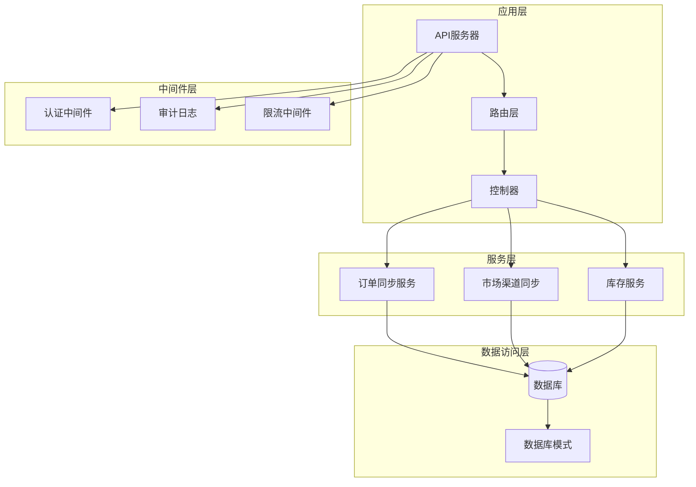
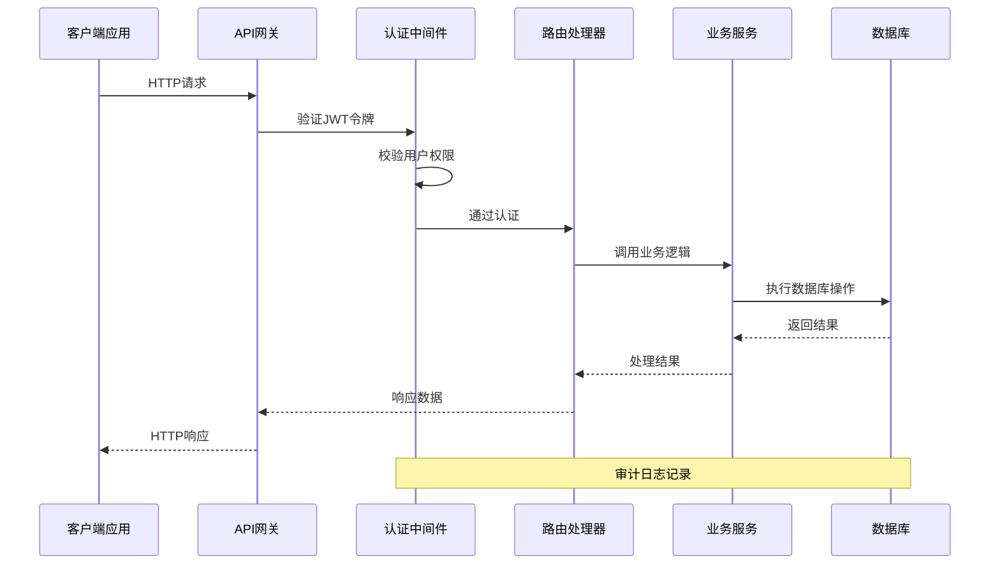
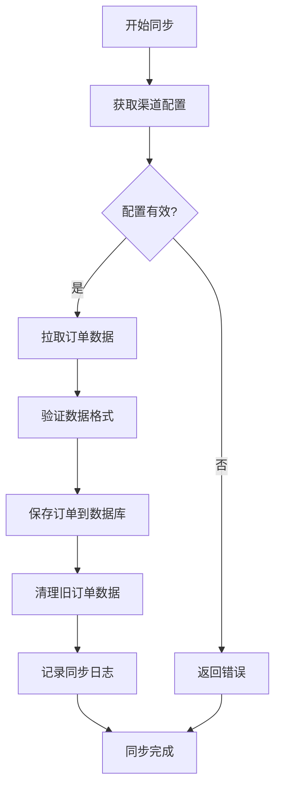
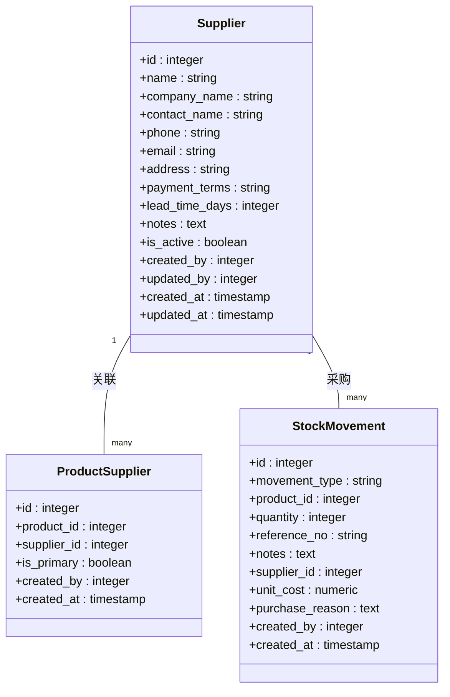
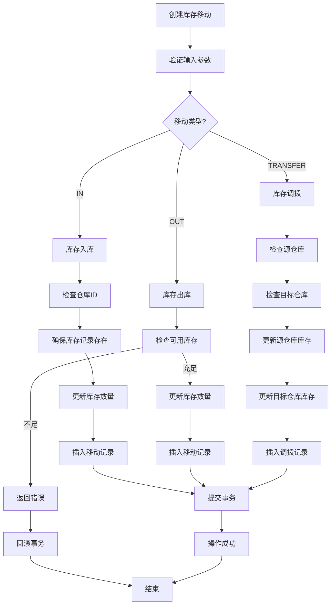
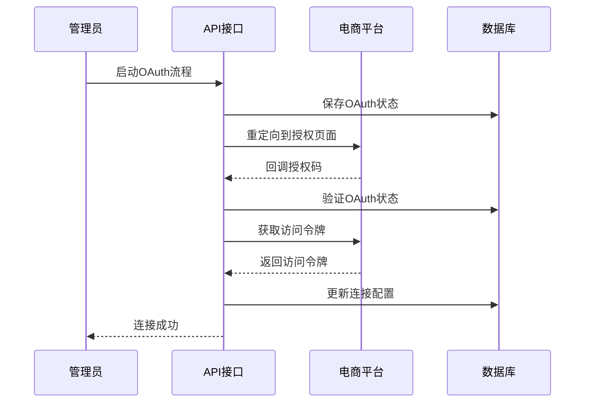
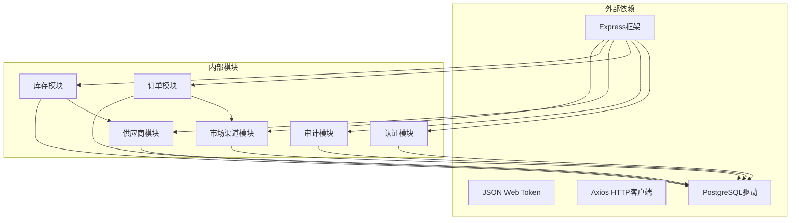

# 采购订单API

<cite>
**本文档引用的文件**
- [server/src/app.js](file://server/src/app.js)
- [server/src/routes/orderRoutes.js](file://server/src/routes/orderRoutes.js)
- [server/src/routes/supplierRoutes.js](file://server/src/routes/supplierRoutes.js)
- [server/src/routes/inventoryRoutes.js](file://server/src/routes/inventoryRoutes.js)
- [server/src/routes/marketplaceRoutes.js](file://server/src/routes/marketplaceRoutes.js)
- [server/src/services/orderSyncService.js](file://server/src/services/orderSyncService.js)
- [server/src/services/marketplaceSyncService.js](file://server/src/services/marketplaceSyncService.js)
- [server/src/utils/inventoryService.js](file://server/src/utils/inventoryService.js)
- [server/src/middleware/auth.js](file://server/src/middleware/auth.js)
- [server/src/middleware/auditTrail.js](file://server/src/middleware/auditTrail.js)
- [server/database/schema.sql](file://server/database/schema.sql)
- [web/src/services/api.js](file://web/src/services/api.js)
</cite>

## 目录
1. [简介](#简介)
2. [项目结构](#项目结构)
3. [核心组件](#核心组件)
4. [架构概览](#架构概览)
5. [详细组件分析](#详细组件分析)
6. [依赖关系分析](#依赖关系分析)
7. [性能考虑](#性能考虑)
8. [故障排除指南](#故障排除指南)
9. [结论](#结论)

## 简介

本API文档针对库存管理系统的采购订单管理功能进行全面说明。系统通过市场渠道同步、供应商管理、库存管理和库存移动等核心模块，为采购订单的创建、审批、执行和跟踪提供完整的基础设施支持。

系统支持与Shopee、Lazada、TikTok等电商平台的订单同步，提供供应商管理、库存监控、自动补货触发等功能，为采购业务流程提供全面的技术支撑。

## 项目结构

**图表来源**
- [server/src/app.js:26-55](file://server/src/app.js#L26-L55)
- [server/src/middleware/auth.js:5-29](file://server/src/middleware/auth.js#L5-L29)
- [server/src/middleware/auditTrail.js:47-79](file://server/src/middleware/auditTrail.js#L47-L79)

**章节来源**
- [server/src/app.js:1-67](file://server/src/app.js#L1-L67)

## 核心组件

### 认证与授权中间件

系统采用JWT令牌进行用户认证，并通过角色授权控制访问权限。支持ADMIN、MANAGER、STAFF三种角色级别的权限控制。

### 审计日志系统

提供完整的操作审计功能，记录所有重要的业务操作，包括创建、更新、删除等操作，便于追踪和合规要求。

### 数据库模式设计

系统采用PostgreSQL数据库，包含完整的采购订单相关表结构，支持订单管理、供应商管理、库存跟踪等功能。

**章节来源**
- [server/src/middleware/auth.js:32-40](file://server/src/middleware/auth.js#L32-L40)
- [server/src/middleware/auditTrail.js:14-44](file://server/src/middleware/auditTrail.js#L14-L44)
- [server/database/schema.sql:196-235](file://server/database/schema.sql#L196-L235)

## 架构概览

**图表来源**
- [server/src/app.js:28-34](file://server/src/app.js#L28-L34)
- [server/src/middleware/auth.js:5-29](file://server/src/middleware/auth.js#L5-L29)
- [server/src/middleware/auditTrail.js:47-79](file://server/src/middleware/auditTrail.js#L47-L79)

## 详细组件分析

### 订单管理模块

#### 市场渠道订单同步

系统支持从多个电商平台同步订单数据，包括Shopee、Lazada、TikTok等渠道。

**图表来源**
- [server/src/services/orderSyncService.js:19-114](file://server/src/services/orderSyncService.js#L19-L114)

**章节来源**
- [server/src/routes/orderRoutes.js:13-29](file://server/src/routes/orderRoutes.js#L13-L29)
- [server/src/services/orderSyncService.js:19-114](file://server/src/services/orderSyncService.js#L19-L114)

#### 订单查询接口

系统提供灵活的订单查询功能，支持按渠道、状态、关键词等条件进行筛选。

**章节来源**
- [server/src/routes/orderRoutes.js:31-81](file://server/src/routes/orderRoutes.js#L31-L81)
- [server/src/routes/orderRoutes.js:83-110](file://server/src/routes/orderRoutes.js#L83-L110)

### 供应商管理模块

#### 供应商信息管理

系统提供完整的供应商生命周期管理功能，包括供应商创建、更新、状态变更、删除等操作。

**图表来源**
- [server/database/schema.sql:302-356](file://server/database/schema.sql#L302-L356)
- [server/database/schema.sql:358-366](file://server/database/schema.sql#L358-L366)

**章节来源**
- [server/src/routes/supplierRoutes.js:23-92](file://server/src/routes/supplierRoutes.js#L23-L92)
- [server/src/routes/supplierRoutes.js:171-232](file://server/src/routes/supplierRoutes.js#L171-L232)
- [server/src/routes/supplierRoutes.js:234-344](file://server/src/routes/supplierRoutes.js#L234-L344)

### 库存管理模块

#### 库存移动处理

系统提供完整的库存移动功能，包括入库、出库、调拨等操作，支持事务性处理确保数据一致性。

**图表来源**
- [server/src/routes/inventoryRoutes.js:229-403](file://server/src/routes/inventoryRoutes.js#L229-L403)
- [server/src/utils/inventoryService.js:2-38](file://server/src/utils/inventoryService.js#L2-L38)

**章节来源**
- [server/src/routes/inventoryRoutes.js:405-415](file://server/src/routes/inventoryRoutes.js#L405-L415)
- [server/src/routes/inventoryRoutes.js:417-490](file://server/src/routes/inventoryRoutes.js#L417-L490)

### 市场渠道集成

#### 渠道连接管理

系统支持多种电商渠道的连接和管理，提供OAuth认证流程和连接状态监控。

**图表来源**
- [server/src/routes/marketplaceRoutes.js:204-269](file://server/src/routes/marketplaceRoutes.js#L204-L269)
- [server/src/routes/marketplaceRoutes.js:271-375](file://server/src/routes/marketplaceRoutes.js#L271-L375)

**章节来源**
- [server/src/routes/marketplaceRoutes.js:47-142](file://server/src/routes/marketplaceRoutes.js#L47-L142)
- [server/src/routes/marketplaceRoutes.js:595-638](file://server/src/routes/marketplaceRoutes.js#L595-L638)

## 依赖关系分析

**图表来源**
- [server/src/app.js:9-25](file://server/src/app.js#L9-L25)
- [server/src/middleware/auth.js:1-2](file://server/src/middleware/auth.js#L1-L2)

**章节来源**
- [server/src/app.js:1-67](file://server/src/app.js#L1-L67)

## 性能考虑

### 数据库优化

系统通过索引优化、查询优化和连接池管理来提升性能。关键表建立了适当的索引以支持高频查询。

### 缓存策略

- **查询缓存**: 对常用的查询结果进行缓存，减少数据库压力
- **会话缓存**: 使用Redis或内存缓存存储用户会话信息
- **静态资源缓存**: CDN缓存静态资源文件

### 异步处理

- **批量操作**: 支持批量数据导入和导出
- **异步任务**: 订单同步、报表生成等耗时操作采用异步处理
- **队列系统**: 使用消息队列处理高并发场景

## 故障排除指南

### 常见问题

#### 认证失败
- 检查JWT令牌是否正确传递
- 验证令牌是否过期
- 确认用户账户状态正常

#### 权限不足
- 确认用户角色具有相应权限
- 检查API端点的访问控制配置

#### 数据库连接问题
- 验证数据库连接字符串
- 检查数据库服务状态
- 确认网络连接正常

#### 审计日志问题
- 检查审计中间件配置
- 验证日志表结构完整性
- 确认磁盘空间充足

**章节来源**
- [server/src/middleware/auth.js:9-28](file://server/src/middleware/auth.js#L9-L28)
- [server/src/middleware/auditTrail.js:47-79](file://server/src/middleware/auditTrail.js#L47-L79)

## 结论

本采购订单管理API系统提供了完整的供应链管理基础设施，通过市场渠道同步、供应商管理、库存管理和审计日志等核心功能，为企业采购业务提供了可靠的技术支撑。

系统采用模块化设计，具有良好的扩展性和维护性。通过合理的架构设计和性能优化，能够满足企业级采购订单管理的需求。

未来可以考虑增加：
- 更完善的采购申请审批流程
- 采购合同管理功能
- 价格协商和数量确认接口
- 自动补货触发机制的完善
- 与ERP系统的深度集成