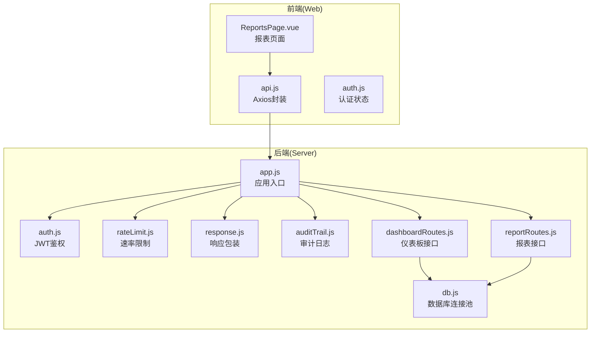
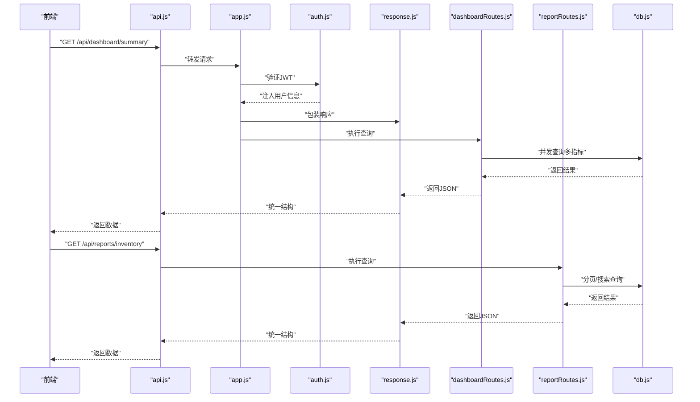
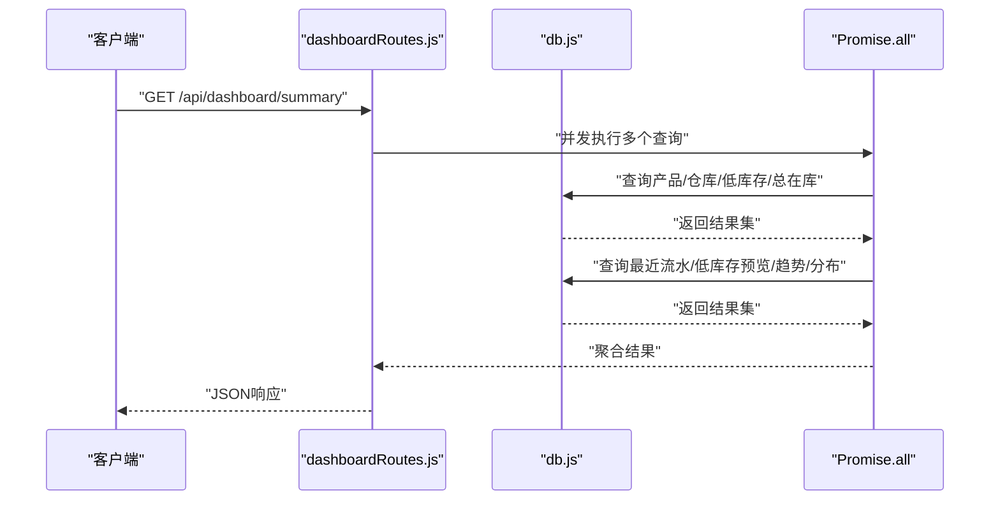
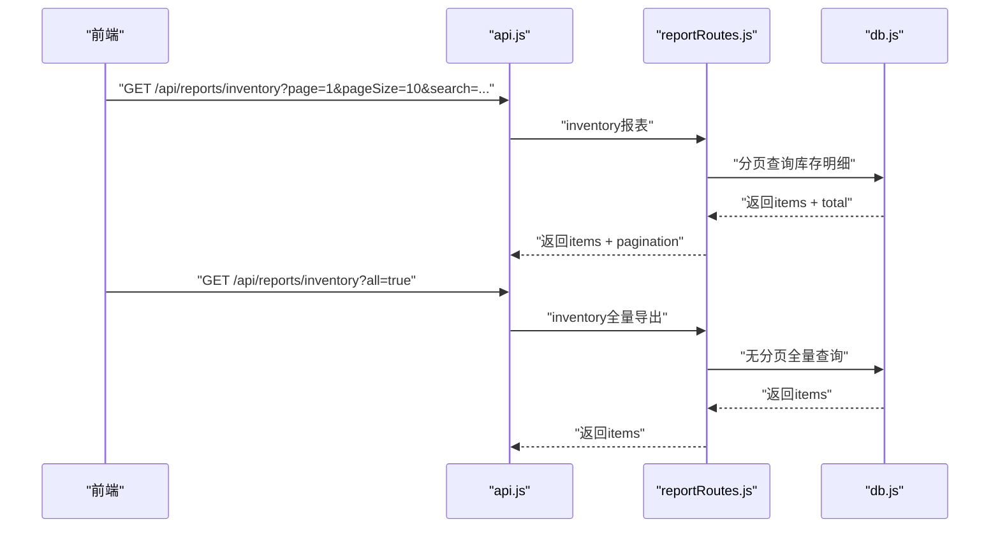
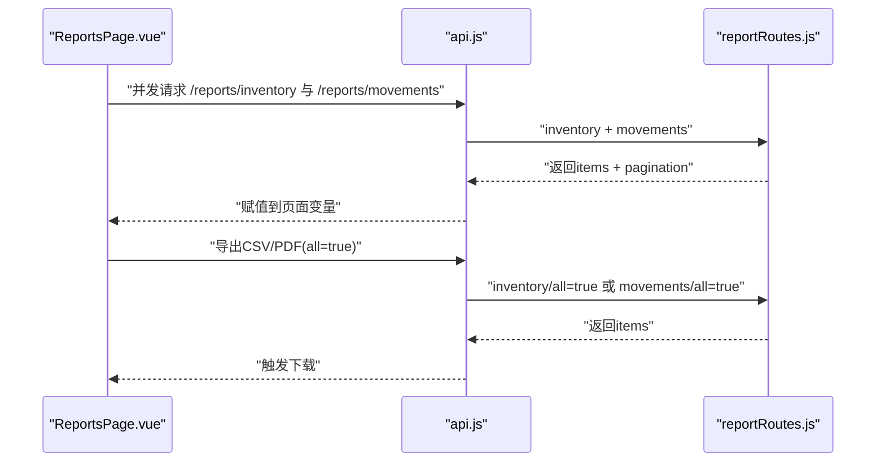
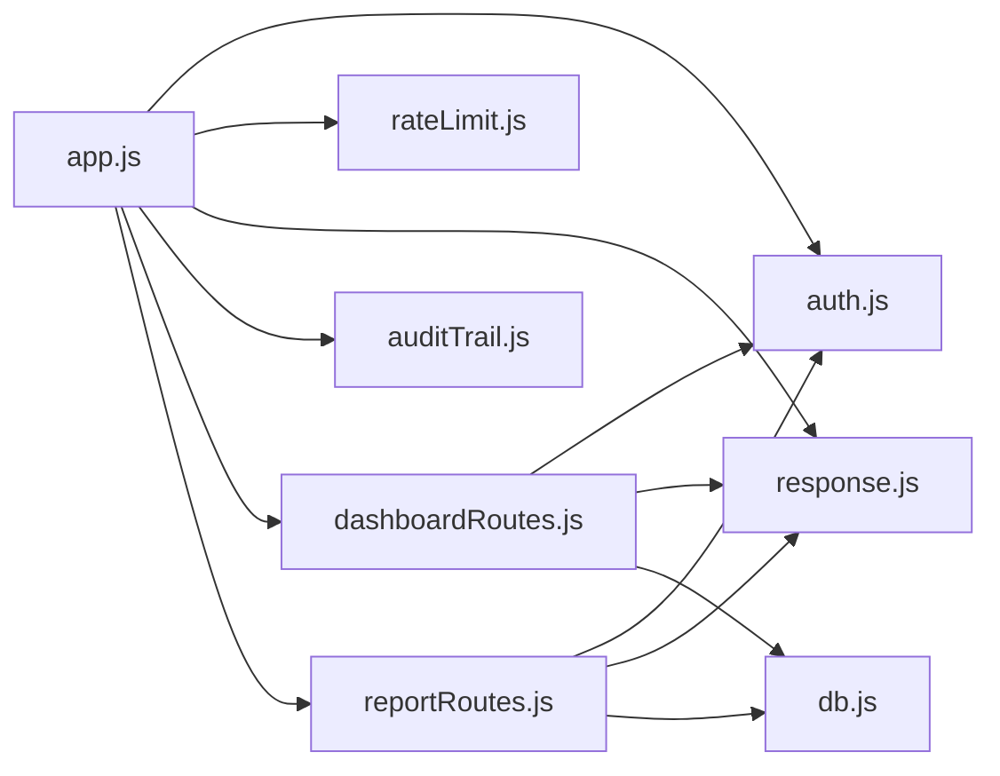

# 分析报表API

<cite>
**本文引用的文件**
- [server/src/app.js](file://server/src/app.js)
- [server/src/routes/dashboardRoutes.js](file://server/src/routes/dashboardRoutes.js)
- [server/src/routes/reportRoutes.js](file://server/src/routes/reportRoutes.js)
- [server/src/middleware/auth.js](file://server/src/middleware/auth.js)
- [server/src/middleware/rateLimit.js](file://server/src/middleware/rateLimit.js)
- [server/src/middleware/response.js](file://server/src/middleware/response.js)
- [server/src/middleware/auditTrail.js](file://server/src/middleware/auditTrail.js)
- [server/src/utils/costAccess.js](file://server/src/utils/costAccess.js)
- [server/src/utils/pagination.js](file://server/src/utils/pagination.js)
- [server/src/config/db.js](file://server/src/config/db.js)
- [server/database/schema.sql](file://server/database/schema.sql)
- [web/src/services/api.js](file://web/src/services/api.js)
- [web/src/pages/ReportsPage.vue](file://web/src/pages/ReportsPage.vue)
- [web/src/stores/auth.js](file://web/src/stores/auth.js)
</cite>

## 目录
1. [简介](#简介)
2. [项目结构](#项目结构)
3. [核心组件](#核心组件)
4. [架构总览](#架构总览)
5. [详细组件分析](#详细组件分析)
6. [依赖关系分析](#依赖关系分析)
7. [性能考虑](#性能考虑)
8. [故障排查指南](#故障排查指南)
9. [结论](#结论)
10. [附录](#附录)

## 简介
本文件为“分析与报表系统”的API文档，聚焦以下能力：
- 仪表板数据聚合：卡片数据、最近流水、低库存预览、库存趋势与分布（按仓库/品类）
- 统计报表：当前库存报表、流水报表（支持时间范围、关键词搜索、分页）
- 导出功能：CSV/PDF导出（全量拉取+前端渲染）
- 数据权限与隐私：成本价字段的细粒度访问控制、审计日志、速率限制
- 性能优化：统一分页、批量查询、索引设计、响应格式标准化

## 项目结构
后端采用Express + PostgreSQL，路由集中在server/src/routes，中间件负责鉴权、限流、响应包装与审计；前端通过Axios封装统一请求拦截器，报表页面负责调用后端接口并触发导出。

**图示来源**
- [server/src/app.js:1-67](file://server/src/app.js#L1-L67)
- [server/src/routes/dashboardRoutes.js:1-123](file://server/src/routes/dashboardRoutes.js#L1-L123)
- [server/src/routes/reportRoutes.js:1-252](file://server/src/routes/reportRoutes.js#L1-L252)
- [server/src/middleware/auth.js:1-46](file://server/src/middleware/auth.js#L1-L46)
- [server/src/middleware/rateLimit.js:1-40](file://server/src/middleware/rateLimit.js#L1-L40)
- [server/src/middleware/response.js:1-62](file://server/src/middleware/response.js#L1-L62)
- [server/src/middleware/auditTrail.js:1-84](file://server/src/middleware/auditTrail.js#L1-L84)
- [server/src/config/db.js:1-25](file://server/src/config/db.js#L1-L25)
- [web/src/services/api.js:1-45](file://web/src/services/api.js#L1-L45)
- [web/src/pages/ReportsPage.vue:1-384](file://web/src/pages/ReportsPage.vue#L1-L384)

**章节来源**
- [server/src/app.js:1-67](file://server/src/app.js#L1-L67)
- [web/src/services/api.js:1-45](file://web/src/services/api.js#L1-L45)

## 核心组件
- 鉴权中间件：解析Authorization头中的Bearer Token，校验JWT并注入用户信息
- 速率限制中间件：基于客户端IP与命名空间的滑动窗口限流
- 响应包装中间件：统一success/data结构与错误包装，附带请求ID
- 审计日志中间件：记录变更类请求的操作上下文与请求体摘要
- 成本访问控制工具：基于自定义头部的二次令牌，限定ADMIN/MANAGER可见成本价与库存金额
- 分页工具：统一分页参数与返回结构
- 数据库连接池：根据环境自动选择SSL策略与超时配置

**章节来源**
- [server/src/middleware/auth.js:1-46](file://server/src/middleware/auth.js#L1-L46)
- [server/src/middleware/rateLimit.js:1-40](file://server/src/middleware/rateLimit.js#L1-L40)
- [server/src/middleware/response.js:1-62](file://server/src/middleware/response.js#L1-L62)
- [server/src/middleware/auditTrail.js:1-84](file://server/src/middleware/auditTrail.js#L1-L84)
- [server/src/utils/costAccess.js:1-32](file://server/src/utils/costAccess.js#L1-L32)
- [server/src/utils/pagination.js:1-28](file://server/src/utils/pagination.js#L1-L28)
- [server/src/config/db.js:1-25](file://server/src/config/db.js#L1-L25)

## 架构总览
后端路由按功能模块划分，仪表板与报表接口均受JWT鉴权保护，并通过响应包装统一输出格式。前端通过api.js自动附加Authorization与成本访问令牌，报表页面并发拉取两个报表并支持导出。

**图示来源**
- [server/src/app.js:1-67](file://server/src/app.js#L1-L67)
- [server/src/middleware/auth.js:1-46](file://server/src/middleware/auth.js#L1-L46)
- [server/src/middleware/response.js:1-62](file://server/src/middleware/response.js#L1-L62)
- [server/src/routes/dashboardRoutes.js:1-123](file://server/src/routes/dashboardRoutes.js#L1-L123)
- [server/src/routes/reportRoutes.js:1-252](file://server/src/routes/reportRoutes.js#L1-L252)
- [server/src/config/db.js:1-25](file://server/src/config/db.js#L1-L25)
- [web/src/services/api.js:1-45](file://web/src/services/api.js#L1-L45)

## 详细组件分析

### 仪表板接口
- 路径：/api/dashboard/summary
- 方法：GET
- 认证：需要JWT
- 功能：一次性返回以下聚合数据
  - 卡片数据：产品数、仓库数、低库存项数、总在库数量
  - 最近流水：最近10条出入库/转移记录
  - 低库存预览：按缺货程度排序的前N项
  - 图表数据：月度出入库趋势、按仓库/品类的库存分布
- 并发策略：使用Promise.all并发执行多个SQL查询，减少RTT
- 返回结构：包含cards、recentMovements、lowStockPreview、charts三部分

**图示来源**
- [server/src/routes/dashboardRoutes.js:10-120](file://server/src/routes/dashboardRoutes.js#L10-L120)
- [server/src/config/db.js:21-24](file://server/src/config/db.js#L21-L24)

**章节来源**
- [server/src/routes/dashboardRoutes.js:1-123](file://server/src/routes/dashboardRoutes.js#L1-L123)

### 报表接口
- 路径：/api/reports/inventory
  - 方法：GET
  - 查询参数：search（关键词）、all（是否全量导出）、page/pageSize
  - 功能：当前库存明细（支持搜索、分页），可选返回成本价与库存金额（受成本访问令牌控制）
  - 全量导出：当all=true时，不使用LIMIT/OFFSET，返回所有匹配行
- 路径：/api/reports/movements
  - 方法：GET
  - 查询参数：startDate、endDate、search、all、page/pageSize
  - 功能：出入库流水明细（支持时间范围与关键词搜索）

**图示来源**
- [server/src/routes/reportRoutes.js:16-127](file://server/src/routes/reportRoutes.js#L16-L127)
- [server/src/routes/reportRoutes.js:129-249](file://server/src/routes/reportRoutes.js#L129-L249)
- [server/src/utils/pagination.js:1-28](file://server/src/utils/pagination.js#L1-L28)
- [server/src/utils/costAccess.js:25-27](file://server/src/utils/costAccess.js#L25-L27)

**章节来源**
- [server/src/routes/reportRoutes.js:1-252](file://server/src/routes/reportRoutes.js#L1-L252)
- [server/src/utils/pagination.js:1-28](file://server/src/utils/pagination.js#L1-L28)
- [server/src/utils/costAccess.js:1-32](file://server/src/utils/costAccess.js#L1-L32)

### 前端调用与导出流程
- 前端通过api.js自动附加Authorization与成本访问令牌
- 报表页面并发请求两个接口，分别填充库存报表与流水报表
- 支持导出：点击“导出全部”时以all=true方式请求，再由前端导出CSV/PDF

**图示来源**
- [web/src/pages/ReportsPage.vue:62-181](file://web/src/pages/ReportsPage.vue#L62-L181)
- [web/src/services/api.js:8-24](file://web/src/services/api.js#L8-L24)

**章节来源**
- [web/src/pages/ReportsPage.vue:1-384](file://web/src/pages/ReportsPage.vue#L1-L384)
- [web/src/services/api.js:1-45](file://web/src/services/api.js#L1-L45)

### 数据模型与索引要点
- 用户、仓库、产品、库存、出入库流水、审计日志等核心表
- 关键索引：stock_movements.created_at、stock_levels.product_id/warehouse_id、audit_logs.created_at等
- 该设计支撑报表接口的高效查询与分页

**章节来源**
- [server/database/schema.sql:1-447](file://server/database/schema.sql#L1-L447)

## 依赖关系分析
- 路由依赖中间件：鉴权、限流、响应包装、审计
- 报表与仪表板依赖数据库连接池
- 前端依赖api.js进行统一请求拦截与错误处理

**图示来源**
- [server/src/app.js:1-67](file://server/src/app.js#L1-L67)
- [server/src/routes/dashboardRoutes.js:1-123](file://server/src/routes/dashboardRoutes.js#L1-L123)
- [server/src/routes/reportRoutes.js:1-252](file://server/src/routes/reportRoutes.js#L1-L252)
- [server/src/middleware/auth.js:1-46](file://server/src/middleware/auth.js#L1-L46)
- [server/src/middleware/rateLimit.js:1-40](file://server/src/middleware/rateLimit.js#L1-L40)
- [server/src/middleware/response.js:1-62](file://server/src/middleware/response.js#L1-L62)
- [server/src/middleware/auditTrail.js:1-84](file://server/src/middleware/auditTrail.js#L1-L84)
- [server/src/config/db.js:1-25](file://server/src/config/db.js#L1-L25)

**章节来源**
- [server/src/app.js:1-67](file://server/src/app.js#L1-L67)

## 性能考虑
- 并发查询：仪表板接口使用Promise.all并发执行多个指标查询，降低整体延迟
- 分页与上限：统一分页参数与最大页大小，避免超大结果集
- 索引优化：针对高频查询字段建立索引（如stock_movements.created_at、stock_levels.product_id/warehouse_id）
- 连接池与SSL：根据环境自动选择SSL策略，设置连接超时，提升稳定性
- 导出策略：全量导出仅在前端触发，避免阻塞常规分页接口

**章节来源**
- [server/src/routes/dashboardRoutes.js:23-100](file://server/src/routes/dashboardRoutes.js#L23-L100)
- [server/src/utils/pagination.js:3-5](file://server/src/utils/pagination.js#L3-L5)
- [server/src/config/db.js:3-19](file://server/src/config/db.js#L3-L19)
- [server/database/schema.sql:410-447](file://server/database/schema.sql#L410-L447)

## 故障排查指南
- 鉴权失败
  - 现象：401 Authentication token is required / Invalid or expired token / User is not available
  - 排查：确认Authorization头格式为Bearer Token；检查JWT是否过期；确认用户存在且激活
- 权限不足
  - 现象：403 You do not have permission to do this action
  - 排查：确认用户角色满足接口要求（如成本访问令牌仅限ADMIN/MANAGER）
- 请求过于频繁
  - 现象：429 Too many requests. Please retry later
  - 排查：检查限流窗口与阈值；确认是否在同一客户端IP下触发
- 数据库连接异常
  - 现象：连接超时或SSL握手失败
  - 排查：检查DATABASE_URL与PGSSLMODE；确认网络可达性
- 审计日志未记录
  - 现象：变更类请求未产生审计记录
  - 排查：确认中间件顺序与finish事件监听；检查数据库写入权限

**章节来源**
- [server/src/middleware/auth.js:9-28](file://server/src/middleware/auth.js#L9-L28)
- [server/src/middleware/rateLimit.js:23-29](file://server/src/middleware/rateLimit.js#L23-L29)
- [server/src/config/db.js:3-11](file://server/src/config/db.js#L3-L11)
- [server/src/middleware/auditTrail.js:47-76](file://server/src/middleware/auditTrail.js#L47-L76)

## 结论
本API体系围绕“仪表板聚合+报表明细+导出”的核心场景构建，通过鉴权、限流、响应包装与审计中间件保障安全性与可观测性；借助并发查询与索引设计实现良好的性能表现；前端通过统一拦截器与导出流程简化了集成复杂度。建议后续结合业务增长持续优化索引覆盖与缓存策略。

## 附录

### 接口清单与规范

- 通用响应格式
  - 成功：{ success: true, data, requestId }
  - 失败：{ success: false, code, message, details?, requestId }
  - 速率限制：返回Header retry-after，或自定义fail结构

- 认证与授权
  - Authorization: Bearer <token>
  - 成本访问：x-cost-access-token: <JWT>（ADMIN/MANAGER有效）

- 仪表板接口
  - GET /api/dashboard/summary
  - 返回字段：cards、recentMovements、lowStockPreview、charts

- 报表接口
  - GET /api/reports/inventory
    - 查询参数：search、all、page、pageSize
    - 返回字段：items（含可选成本价与库存金额）、pagination
  - GET /api/reports/movements
    - 查询参数：startDate、endDate、search、all、page、pageSize
    - 返回字段：items、pagination

- 导出流程
  - 前端点击导出按钮时，以all=true请求对应报表接口，再由前端导出CSV/PDF

**章节来源**
- [server/src/middleware/response.js:9-54](file://server/src/middleware/response.js#L9-L54)
- [server/src/middleware/rateLimit.js:23-29](file://server/src/middleware/rateLimit.js#L23-L29)
- [server/src/utils/costAccess.js:5-27](file://server/src/utils/costAccess.js#L5-L27)
- [server/src/routes/dashboardRoutes.js:10-120](file://server/src/routes/dashboardRoutes.js#L10-L120)
- [server/src/routes/reportRoutes.js:16-127](file://server/src/routes/reportRoutes.js#L16-L127)
- [server/src/routes/reportRoutes.js:129-249](file://server/src/routes/reportRoutes.js#L129-L249)
- [web/src/pages/ReportsPage.vue:115-181](file://web/src/pages/ReportsPage.vue#L115-L181)