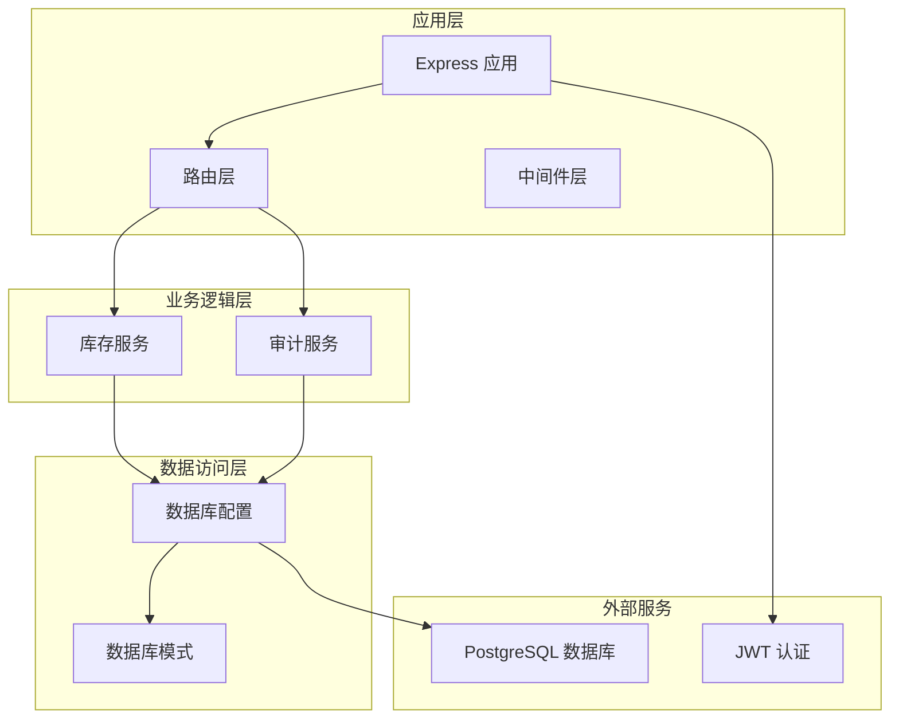
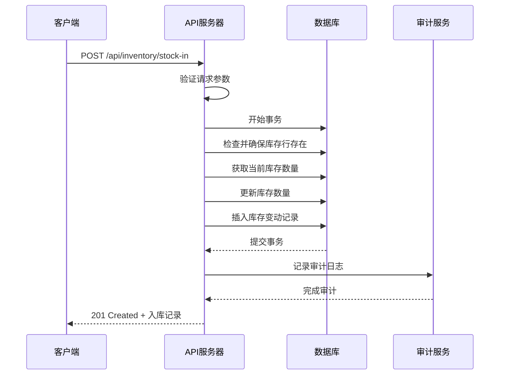
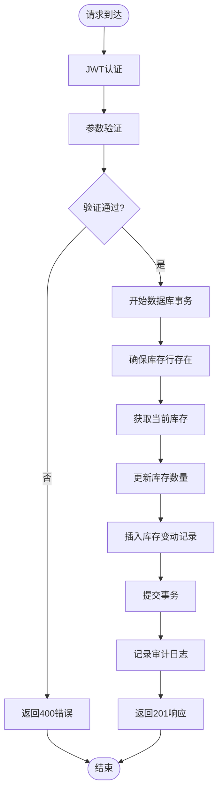
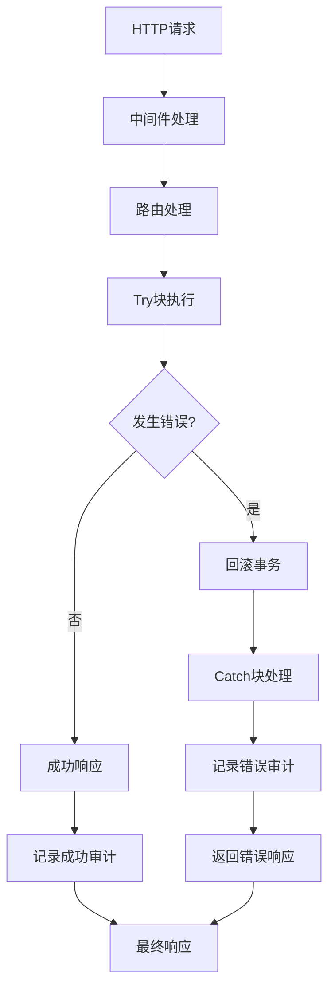
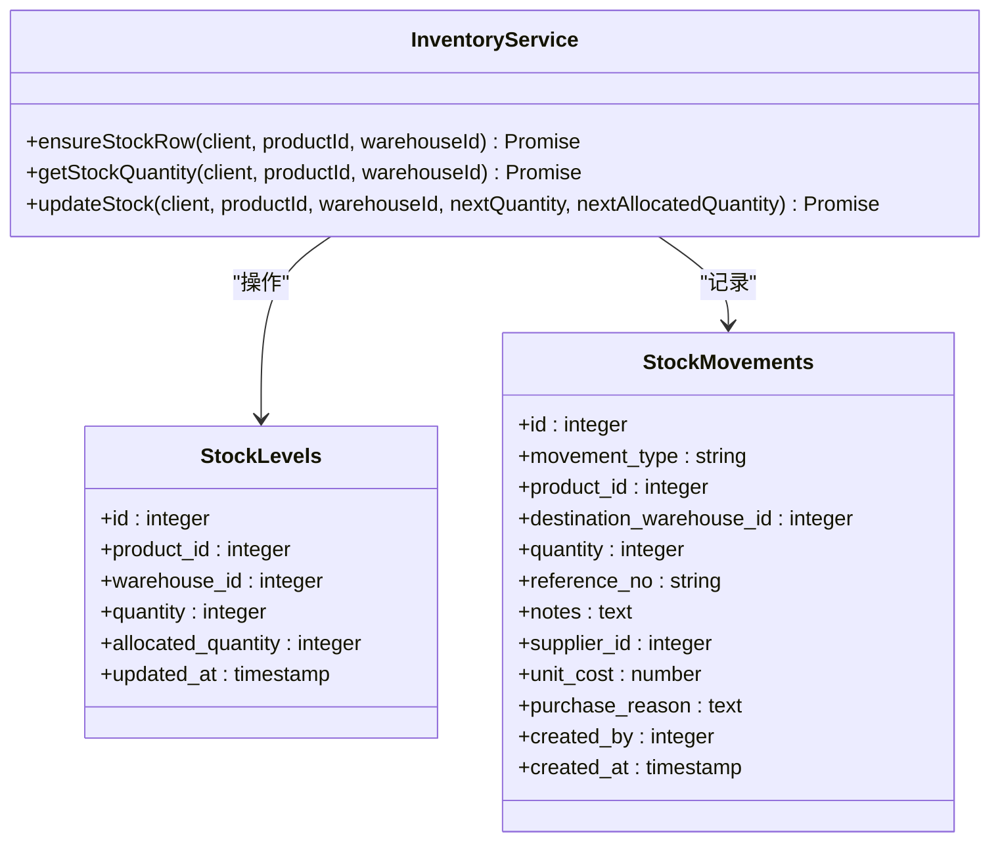
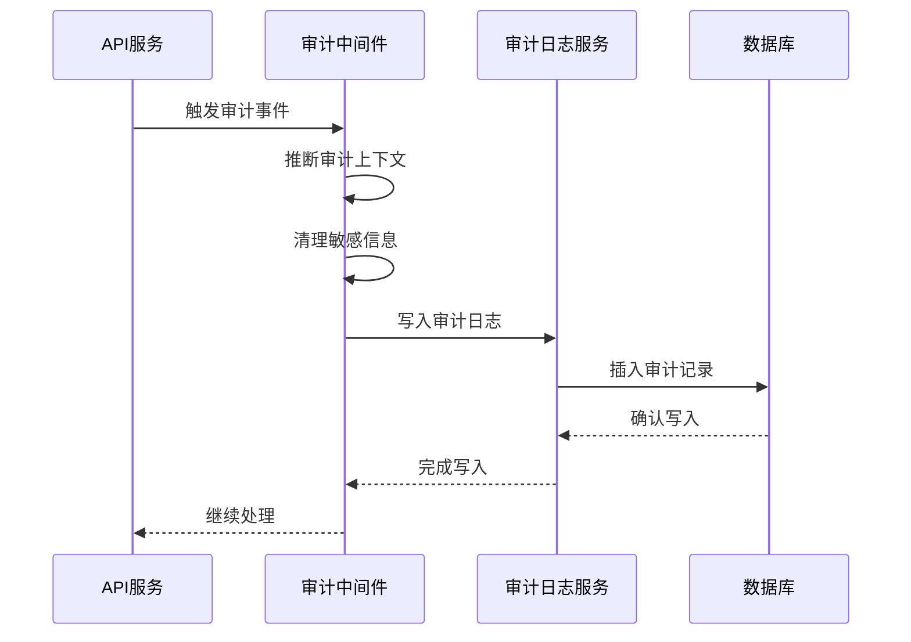
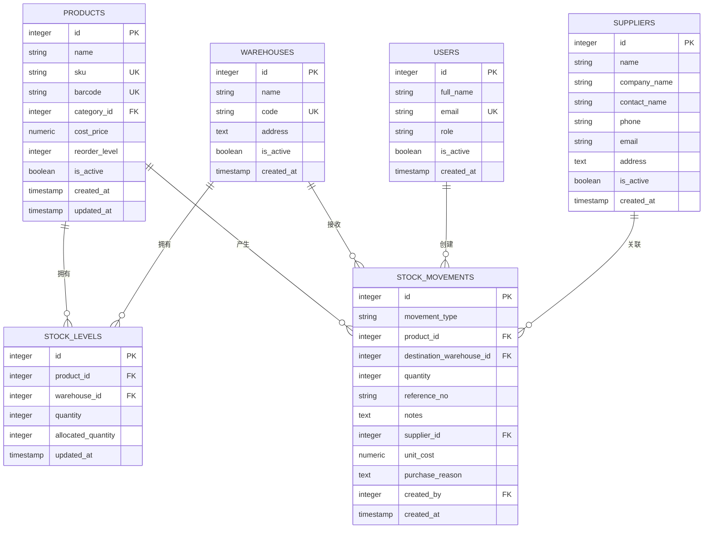
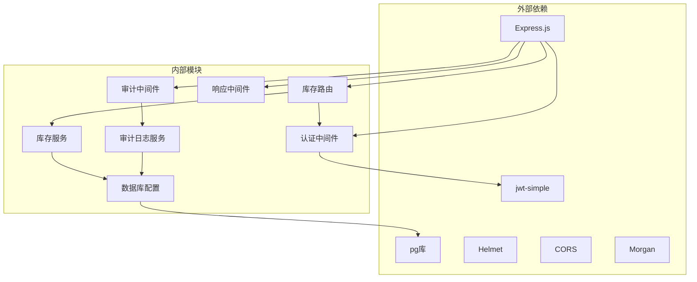

# 入库操作API

<cite>
**本文档引用的文件**
- [inventoryRoutes.js](file://server/src/routes/inventoryRoutes.js)
- [inventoryService.js](file://server/src/utils/inventoryService.js)
- [auditTrail.js](file://server/src/middleware/auditTrail.js)
- [auditLog.js](file://server/src/utils/auditLog.js)
- [schema.sql](file://server/database/schema.sql)
- [db.js](file://server/src/config/db.js)
- [auth.js](file://server/src/middleware/auth.js)
- [app.js](file://server/src/app.js)
- [inventory_system_backend.postman_collection.json](file://postman/inventory_system_backend.postman_collection.json)
</cite>

## 目录
1. [简介](#简介)
2. [项目结构](#项目结构)
3. [核心组件](#核心组件)
4. [架构概览](#架构概览)
5. [详细组件分析](#详细组件分析)
6. [依赖关系分析](#依赖关系分析)
7. [性能考虑](#性能考虑)
8. [故障排除指南](#故障排除指南)
9. [结论](#结论)

## 简介

本文档详细说明了库存管理系统中的入库操作API，特别是POST `/api/inventory/stock-in` 接口。该接口用于执行商品入库操作，涉及库存更新、成本计算和审计日志记录等核心业务逻辑。

## 项目结构

库存管理系统采用模块化架构设计，主要包含以下关键组件：

**图表来源**
- [app.js:26-67](file://server/src/app.js#L26-L67)
- [inventoryRoutes.js:1-493](file://server/src/routes/inventoryRoutes.js#L1-L493)

**章节来源**
- [app.js:26-67](file://server/src/app.js#L26-L67)
- [inventoryRoutes.js:1-493](file://server/src/routes/inventoryRoutes.js#L1-L493)

## 核心组件

### API 接口定义

**端点**: `POST /api/inventory/stock-in`

**认证要求**: 需要有效的JWT令牌

**授权角色**: ADMIN, MANAGER, STAFF

**请求头**:
- `Authorization: Bearer <token>`
- `Content-Type: application/json`

### 请求参数

入库操作需要以下必需参数：

| 参数名称 | 类型 | 必需 | 描述 | 示例值 |
|---------|------|------|------|--------|
| productId | integer | ✓ | 产品ID | 123 |
| warehouseId | integer | ✓ | 仓库ID | 1 |
| quantity | integer | ✓ | 入库数量 | 10 |
| supplierId | integer | ✗ | 供应商ID | 5 |
| unitCost | number | ✗ | 单价（保留两位小数） | 99.99 |
| purchaseReason | string | ✗ | 购买原因 | "采购订单#PO-001" |
| referenceNo | string | ✗ | 参考号 | "IN-001" |
| notes | string | ✗ | 备注 | "批量采购入库" |

### 成功响应

当入库操作成功时，返回状态码201和完整的入库记录：

**图表来源**
- [inventoryRoutes.js:229-403](file://server/src/routes/inventoryRoutes.js#L229-L403)

**章节来源**
- [inventoryRoutes.js:405-407](file://server/src/routes/inventoryRoutes.js#L405-L407)

## 架构概览

### 数据流架构

**图表来源**
- [inventoryRoutes.js:229-403](file://server/src/routes/inventoryRoutes.js#L229-L403)
- [inventoryService.js:1-45](file://server/src/utils/inventoryService.js#L1-L45)

### 错误处理机制

系统实现了多层次的错误处理机制：

**图表来源**
- [inventoryRoutes.js:397-402](file://server/src/routes/inventoryRoutes.js#L397-L402)
- [auditTrail.js:47-79](file://server/src/middleware/auditTrail.js#L47-L79)

**章节来源**
- [inventoryRoutes.js:397-402](file://server/src/routes/inventoryRoutes.js#L397-L402)

## 详细组件分析

### 库存服务组件

库存服务提供了统一的库存操作封装，避免在多个接口中重复编写事务代码：

**图表来源**
- [inventoryService.js:1-45](file://server/src/utils/inventoryService.js#L1-L45)
- [schema.sql:125-133](file://server/database/schema.sql#L125-L133)
- [schema.sql:237-248](file://server/database/schema.sql#L237-L248)

### 审计日志组件

系统实现了完整的审计追踪机制，自动记录所有重要的业务操作：

**图表来源**
- [auditTrail.js:47-79](file://server/src/middleware/auditTrail.js#L47-L79)
- [auditLog.js:1-38](file://server/src/utils/auditLog.js#L1-L38)

**章节来源**
- [auditTrail.js:14-45](file://server/src/middleware/auditTrail.js#L14-L45)
- [auditLog.js:1-38](file://server/src/utils/auditLog.js#L1-L38)

### 数据库架构

系统使用PostgreSQL作为数据存储，核心表结构如下：

**图表来源**
- [schema.sql:32-54](file://server/database/schema.sql#L32-L54)
- [schema.sql:22-30](file://server/database/schema.sql#L22-L30)
- [schema.sql:125-133](file://server/database/schema.sql#L125-L133)
- [schema.sql:237-248](file://server/database/schema.sql#L237-L248)
- [schema.sql:302-318](file://server/database/schema.sql#L302-L318)

**章节来源**
- [schema.sql:125-133](file://server/database/schema.sql#L125-L133)
- [schema.sql:237-248](file://server/database/schema.sql#L237-L248)

## 依赖关系分析

### 组件依赖图

**图表来源**
- [app.js:1-67](file://server/src/app.js#L1-L67)
- [inventoryRoutes.js:1-8](file://server/src/routes/inventoryRoutes.js#L1-L8)
- [db.js:1-25](file://server/src/config/db.js#L1-L25)

### 关键依赖关系

1. **认证链路**: `auth.js` → `inventoryRoutes.js` → `app.js`
2. **数据访问链路**: `inventoryRoutes.js` → `inventoryService.js` → `db.js`
3. **审计链路**: `auditTrail.js` → `auditLog.js` → `db.js`

**章节来源**
- [app.js:9-25](file://server/src/app.js#L9-L25)
- [auth.js:32-40](file://server/src/middleware/auth.js#L32-L40)

## 性能考虑

### 查询优化策略

1. **索引优化**: 数据库表已建立适当的索引以支持高频查询
2. **批量操作**: 支持一次性处理多个产品的库存变更
3. **连接池管理**: 使用连接池减少数据库连接开销
4. **内存管理**: 合理的中间件顺序避免不必要的内存占用

### 并发控制

系统通过以下机制确保数据一致性：
- **事务隔离**: 所有库存操作都在事务中执行
- **冲突处理**: 使用ON CONFLICT避免重复数据
- **锁机制**: PostgreSQL的行级锁保证并发安全性

## 故障排除指南

### 常见错误及解决方案

| 错误类型 | HTTP状态码 | 错误原因 | 解决方案 |
|---------|------------|----------|----------|
| 认证失败 | 401 | 缺少或无效的JWT令牌 | 检查Authorization头格式和令牌有效性 |
| 权限不足 | 403 | 用户角色不满足要求 | 确保用户具有ADMIN/MANAGER/STAFF角色 |
| 参数缺失 | 400 | 必需参数未提供 | 验证productId、warehouseId、quantity参数 |
| 库存不足 | 400 | 出库数量超过可用库存 | 检查当前库存水平和已分配数量 |
| 数据库错误 | 500 | 数据库操作失败 | 检查数据库连接和SQL语句 |

### 调试建议

1. **启用详细日志**: 在开发环境中使用`morgan('dev')`中间件
2. **检查审计日志**: 查看`audit_logs`表确认操作记录
3. **验证数据库连接**: 确保`DATABASE_URL`环境变量正确配置
4. **测试JWT令牌**: 使用Postman验证令牌的有效性

**章节来源**
- [inventoryRoutes.js:234-236](file://server/src/routes/inventoryRoutes.js#L234-L236)
- [auth.js:9-28](file://server/src/middleware/auth.js#L9-L28)

## 结论

入库操作API提供了完整的企业级库存管理功能，具备以下特点：

1. **安全性**: 实现了严格的认证授权机制
2. **可靠性**: 通过事务确保数据一致性和完整性
3. **可追溯性**: 完整的审计日志记录所有重要操作
4. **扩展性**: 模块化设计便于功能扩展和维护

该API设计符合现代Web应用的最佳实践，能够满足中小型企业的库存管理需求，并为未来的功能扩展奠定了良好的基础。