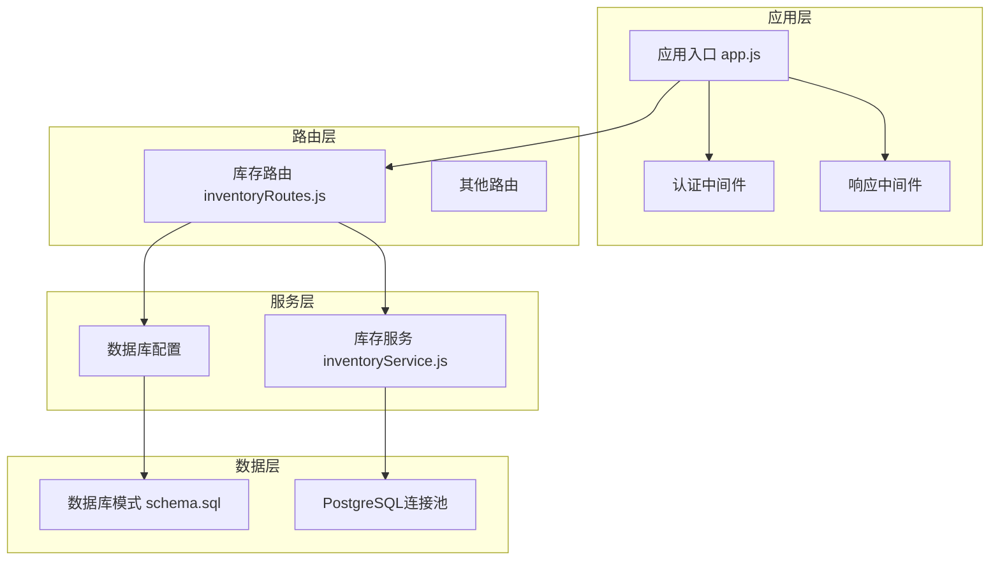
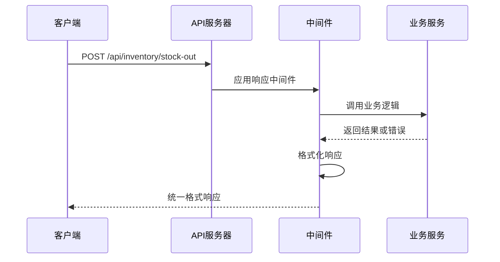
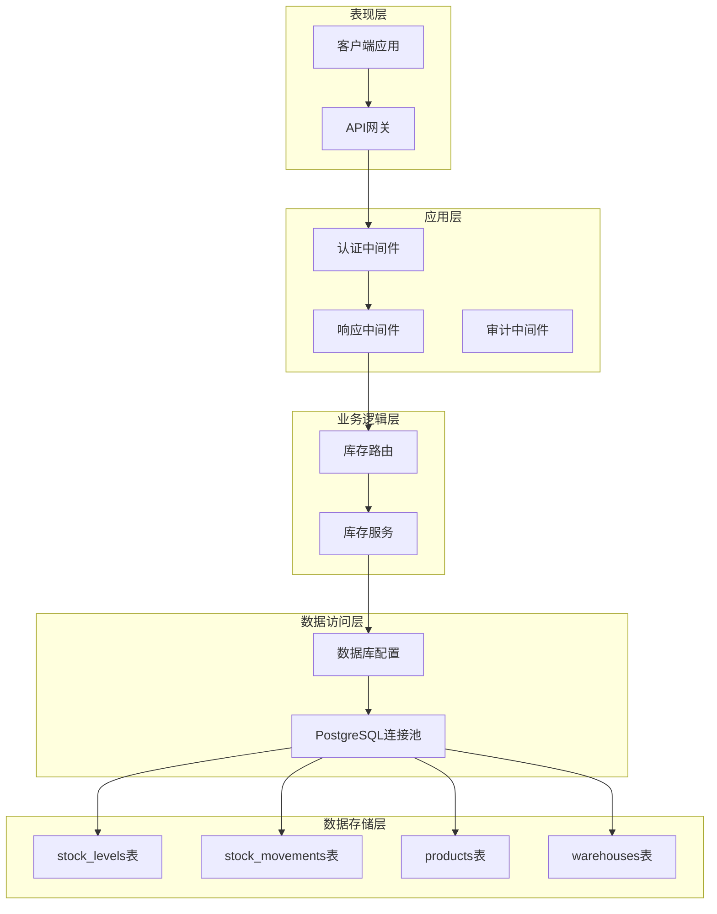
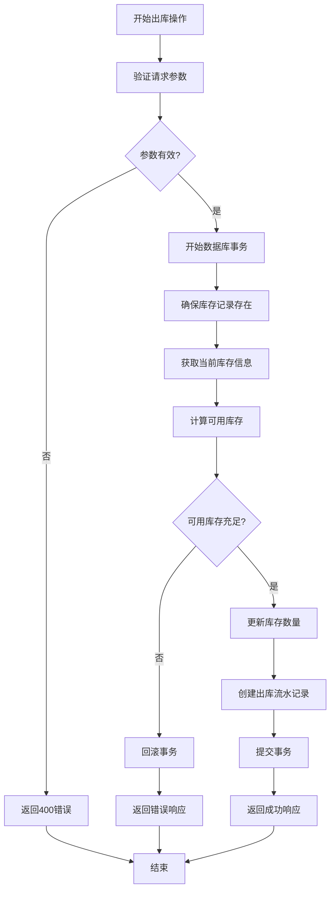
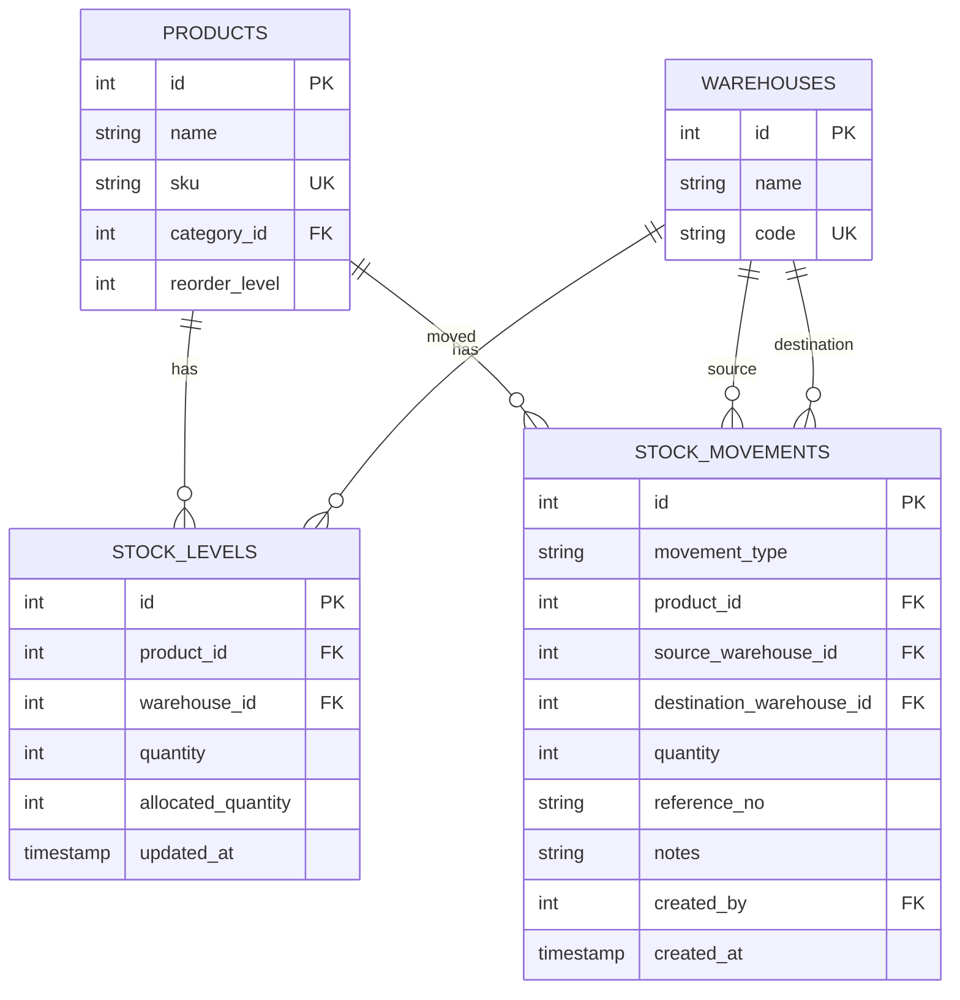
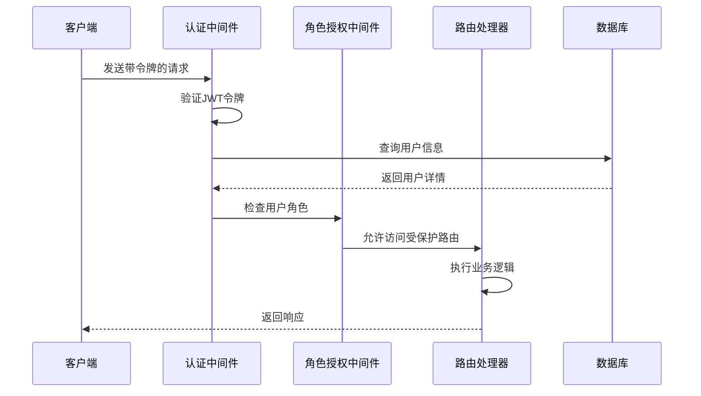
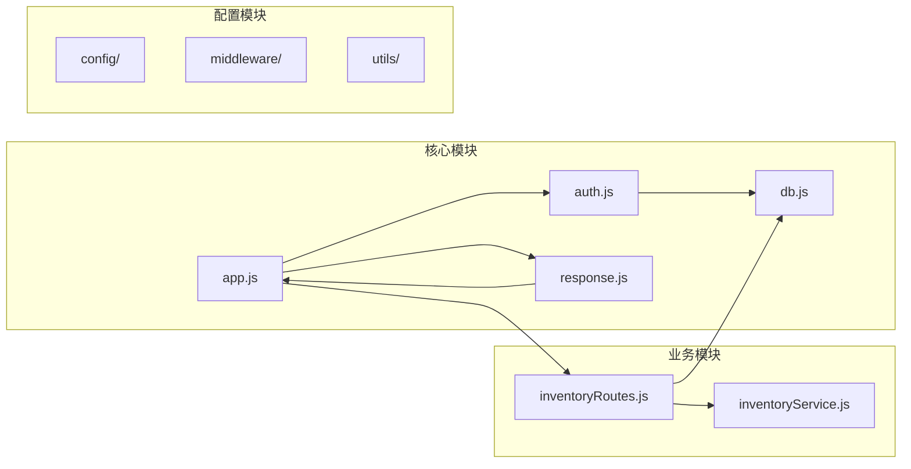

# 出库操作API

<cite>
**本文档引用的文件**
- [inventoryRoutes.js](file://server/src/routes/inventoryRoutes.js)
- [inventoryService.js](file://server/src/utils/inventoryService.js)
- [schema.sql](file://server/database/schema.sql)
- [auth.js](file://server/src/middleware/auth.js)
- [response.js](file://server/src/middleware/response.js)
- [db.js](file://server/src/config/db.js)
- [app.js](file://server/src/app.js)
- [package.json](file://server/package.json)
- [inventory_system_backend.postman_collection.json](file://postman/inventory_system_backend.postman_collection.json)
</cite>

## 目录
1. [简介](#简介)
2. [项目结构](#项目结构)
3. [核心组件](#核心组件)
4. [架构概览](#架构概览)
5. [详细组件分析](#详细组件分析)
6. [依赖关系分析](#依赖关系分析)
7. [性能考虑](#性能考虑)
8. [故障排除指南](#故障排除指南)
9. [结论](#结论)

## 简介

本文档详细说明了库存管理系统中的出库操作API，特别是POST `/api/inventory/stock-out` 接口。该接口用于执行产品从指定仓库的出库操作，包含完整的请求验证、库存检查、业务流程处理以及错误处理机制。

该系统采用现代化的Node.js技术栈构建，使用Express框架、PostgreSQL数据库，并实现了严格的安全控制和数据一致性保证。

## 项目结构

库存管理系统采用模块化的架构设计，主要由以下核心组件构成：



**图表来源**
- [app.js:1-67](file://server/src/app.js#L1-L67)
- [inventoryRoutes.js:1-493](file://server/src/routes/inventoryRoutes.js#L1-L493)
- [inventoryService.js:1-45](file://server/src/utils/inventoryService.js#L1-L45)

**章节来源**
- [app.js:1-67](file://server/src/app.js#L1-L67)
- [package.json:1-31](file://server/package.json#L1-L31)

## 核心组件

### API端点定义

POST `/api/inventory/stock-out` 是专门用于执行库存出库操作的REST API端点。该端点继承了整个应用的中间件链，确保了统一的安全性和响应格式。

### 请求参数规范

出库操作需要以下必需参数：

| 参数名称 | 类型 | 必需 | 描述 |
|---------|------|------|------|
| productId | integer | ✓ | 产品唯一标识符 |
| warehouseId | integer | ✓ | 仓库唯一标识符 |
| quantity | integer | ✓ | 出库数量（必须为正数） |
| referenceNo | string | ✗ | 参考编号（可选） |
| notes | string | ✗ | 备注信息（可选） |

### 响应格式

系统使用统一的响应中间件，所有API响应都遵循以下格式：



**图表来源**
- [response.js:1-62](file://server/src/middleware/response.js#L1-L62)
- [inventoryRoutes.js:292-332](file://server/src/routes/inventoryRoutes.js#L292-L332)

**章节来源**
- [inventoryRoutes.js:292-332](file://server/src/routes/inventoryRoutes.js#L292-L332)
- [response.js:1-62](file://server/src/middleware/response.js#L1-L62)

## 架构概览

系统采用分层架构设计，确保了关注点分离和代码的可维护性：



**图表来源**
- [app.js:26-56](file://server/src/app.js#L26-L56)
- [inventoryRoutes.js:1-493](file://server/src/routes/inventoryRoutes.js#L1-L493)
- [schema.sql:125-248](file://server/database/schema.sql#L125-L248)

## 详细组件分析

### 出库业务流程

出库操作是一个复杂的事务性过程，包含多个验证步骤和数据更新操作：



**图表来源**
- [inventoryRoutes.js:292-332](file://server/src/routes/inventoryRoutes.js#L292-L332)
- [inventoryService.js:29-38](file://server/src/utils/inventoryService.js#L29-L38)

### 库存计算公式

系统使用以下公式计算可用库存：

```
可用库存 = 实际库存 - 已分配库存
```

其中：
- **实际库存**：当前仓库中产品的总数量
- **已分配库存**：已被订单或其他业务流程预留的数量
- **可用库存**：可以自由使用的库存数量

### 数据库模式设计

库存系统基于以下核心表结构：



**图表来源**
- [schema.sql:32-54](file://server/database/schema.sql#L32-L54)
- [schema.sql:125-133](file://server/database/schema.sql#L125-L133)
- [schema.sql:237-248](file://server/database/schema.sql#L237-L248)

**章节来源**
- [schema.sql:125-248](file://server/database/schema.sql#L125-L248)
- [inventoryRoutes.js:292-332](file://server/src/routes/inventoryRoutes.js#L292-L332)

### 安全与权限控制

系统实现了多层安全控制机制：



**图表来源**
- [auth.js:5-29](file://server/src/middleware/auth.js#L5-L29)
- [auth.js:32-40](file://server/src/middleware/auth.js#L32-L40)
- [inventoryRoutes.js:10](file://server/src/routes/inventoryRoutes.js#L10)

**章节来源**
- [auth.js:1-46](file://server/src/middleware/auth.js#L1-L46)
- [inventoryRoutes.js:10](file://server/src/routes/inventoryRoutes.js#L10)

## 依赖关系分析

### 外部依赖

系统依赖以下关键外部库：

| 依赖包 | 版本 | 用途 |
|--------|------|------|
| express | ^5.2.1 | Web应用框架 |
| pg | ^8.20.0 | PostgreSQL驱动程序 |
| jsonwebtoken | ^9.0.3 | JWT令牌处理 |
| bcryptjs | ^3.0.3 | 密码哈希 |
| helmet | ^8.1.0 | 安全HTTP头部 |
| cors | ^2.8.6 | 跨域资源共享 |
| dotenv | ^17.4.1 | 环境变量管理 |

### 内部模块依赖



**图表来源**
- [app.js:8-24](file://server/src/app.js#L8-L24)
- [inventoryRoutes.js:1-8](file://server/src/routes/inventoryRoutes.js#L1-L8)

**章节来源**
- [package.json:15-25](file://server/package.json#L15-L25)
- [app.js:1-67](file://server/src/app.js#L1-L67)

## 性能考虑

### 数据库优化策略

1. **索引优化**：系统为关键查询字段建立了适当的索引，包括产品ID、仓库ID等
2. **连接池管理**：使用PostgreSQL连接池减少连接开销
3. **批量查询**：在库存概览功能中使用Promise.all并行查询提高性能

### 缓存策略

系统通过以下方式优化性能：
- 使用连接池复用数据库连接
- 在库存查询中使用LIMIT和OFFSET进行分页
- 对频繁访问的数据建立合适的索引

### 错误处理优化

系统实现了完善的错误处理机制：
- 统一的错误响应格式
- 事务回滚确保数据一致性
- 详细的错误信息但不泄露敏感信息

## 故障排除指南

### 常见错误场景

| 错误类型 | HTTP状态码 | 错误原因 | 解决方案 |
|----------|------------|----------|----------|
| 认证失败 | 401 | 无效或过期的JWT令牌 | 检查令牌格式和有效期 |
| 权限不足 | 403 | 用户角色无权执行此操作 | 确认用户具有相应权限 |
| 参数验证失败 | 400 | 缺少必需参数或参数无效 | 检查请求体格式和必填字段 |
| 库存不足 | 400 | 可用库存小于请求数量 | 增加库存或减少出库数量 |
| 数据库错误 | 500 | 数据库连接或查询异常 | 检查数据库连接和SQL语句 |

### 调试建议

1. **启用详细日志**：使用Morgan中间件记录请求日志
2. **检查环境变量**：确认DATABASE_URL和JWT_SECRET配置正确
3. **验证数据库连接**：确保PostgreSQL服务正常运行
4. **测试API端点**：使用Postman验证基本功能

**章节来源**
- [inventoryRoutes.js:397-402](file://server/src/routes/inventoryRoutes.js#L397-L402)
- [response.js:14-27](file://server/src/middleware/response.js#L14-L27)

## 结论

出库操作API提供了完整、安全且高效的库存管理解决方案。通过严格的参数验证、完整的库存检查机制、事务性操作保证以及统一的错误处理，确保了系统的可靠性和数据的一致性。

该API的设计充分考虑了实际业务需求，支持灵活的参数配置和详细的审计追踪，为库存管理提供了坚实的技术基础。同时，系统的模块化架构和清晰的依赖关系使得代码易于维护和扩展。

建议在生产环境中：
1. 配置适当的监控和告警机制
2. 实施定期的数据库备份策略
3. 进行性能基准测试和容量规划
4. 建立完整的API文档和开发指南