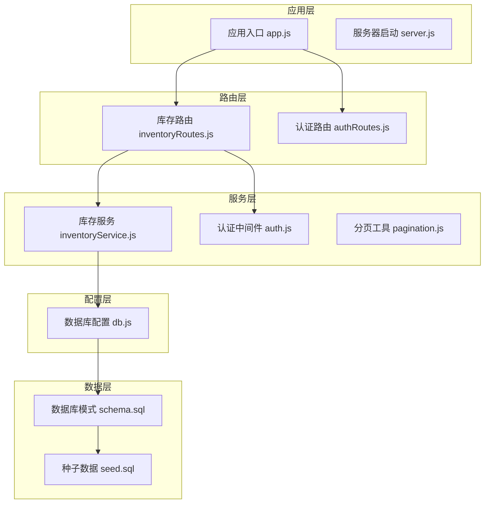
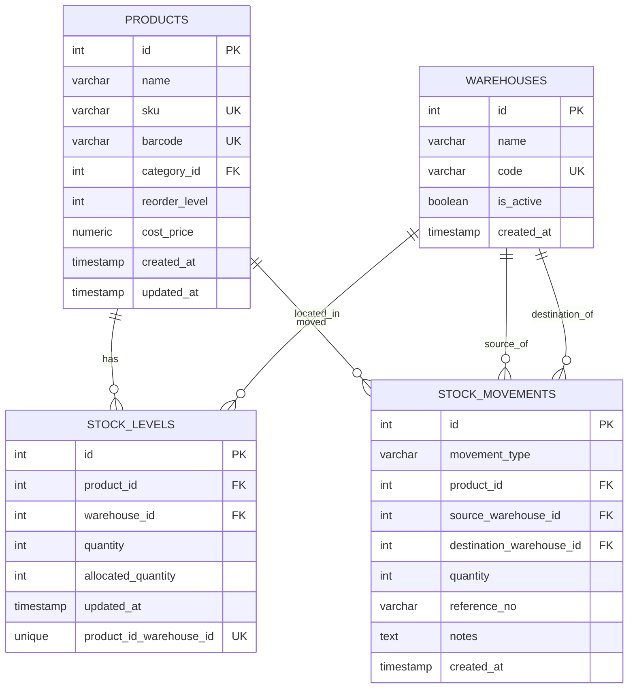
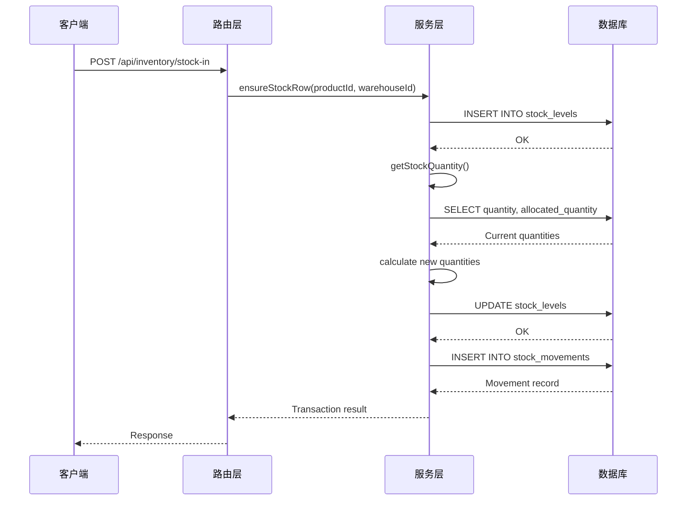
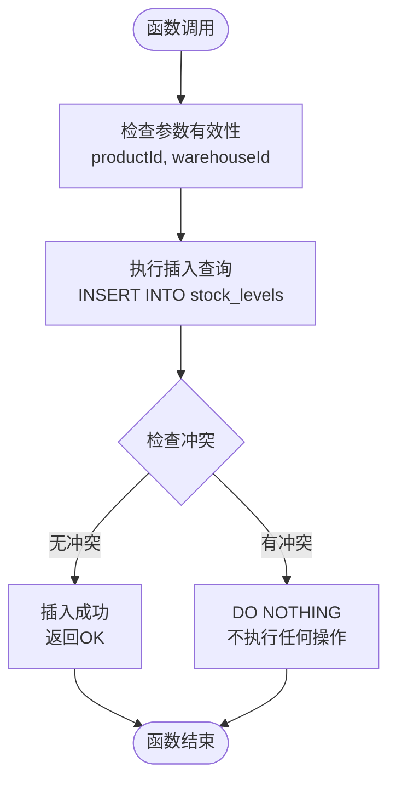
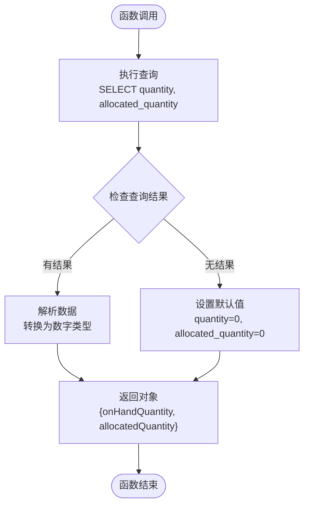
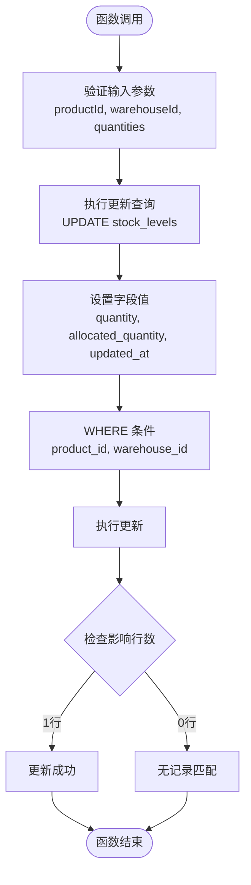
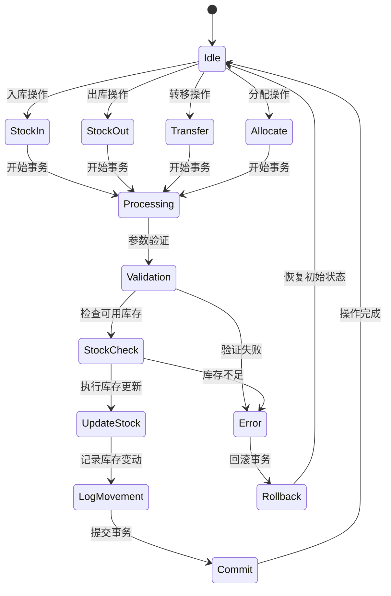
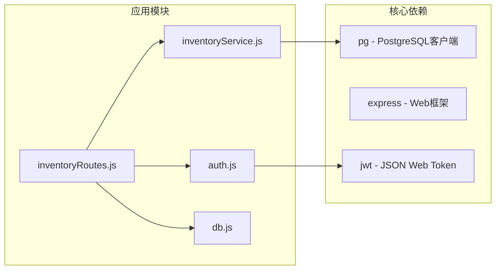
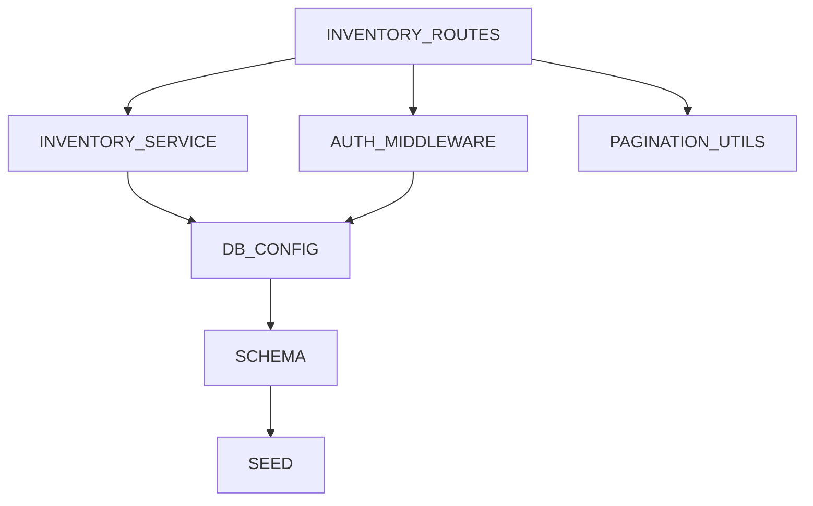

# 库存业务逻辑

<cite>
**本文档引用的文件**
- [inventoryService.js](file://server/src/utils/inventoryService.js)
- [inventoryRoutes.js](file://server/src/routes/inventoryRoutes.js)
- [db.js](file://server/src/config/db.js)
- [schema.sql](file://server/database/schema.sql)
- [seed.sql](file://server/database/seed.sql)
- [auth.js](file://server/src/middleware/auth.js)
- [pagination.js](file://server/src/utils/pagination.js)
- [app.js](file://server/src/app.js)
- [server.js](file://server/src/server.js)
</cite>

## 目录
1. [简介](#简介)
2. [项目结构](#项目结构)
3. [核心组件](#核心组件)
4. [架构概览](#架构概览)
5. [详细组件分析](#详细组件分析)
6. [依赖关系分析](#依赖关系分析)
7. [性能考虑](#性能考虑)
8. [故障排除指南](#故障排除指南)
9. [结论](#结论)

## 简介

本技术文档深入分析了库存业务逻辑系统，重点涵盖库存行确保、库存查询和库存更新三个核心服务函数。该系统采用PostgreSQL作为数据存储，通过统一的库存服务层封装库存操作，确保数据一致性和业务规则的正确执行。

系统支持多种库存操作类型：入库(stock-in)、出库(stock-out)、转移(transfer)和分配(allocation)，并通过严格的并发控制和事务管理保证数据完整性。

## 项目结构

库存系统采用模块化架构设计，主要分为以下几个层次：

**图表来源**
- [app.js:1-67](file://server/src/app.js#L1-L67)
- [server.js:1-28](file://server/src/server.js#L1-L28)
- [inventoryRoutes.js:1-493](file://server/src/routes/inventoryRoutes.js#L1-L493)
- [inventoryService.js:1-45](file://server/src/utils/inventoryService.js#L1-L45)

**章节来源**
- [app.js:1-67](file://server/src/app.js#L1-L67)
- [server.js:1-28](file://server/src/server.js#L1-L28)

## 核心组件

### 库存服务层

库存服务层是整个库存系统的核心，提供了三个关键的异步函数：

1. **ensureStockRow**: 确保库存记录存在
2. **getStockQuantity**: 获取库存数量信息
3. **updateStock**: 更新库存状态

这些函数都接受数据库客户端连接作为第一个参数，确保在事务上下文中正确执行。

**章节来源**
- [inventoryService.js:1-45](file://server/src/utils/inventoryService.js#L1-L45)

### 数据模型

库存系统基于以下核心数据表：

**图表来源**
- [schema.sql:125-133](file://server/database/schema.sql#L125-L133)
- [schema.sql:237-248](file://server/database/schema.sql#L237-L248)

**章节来源**
- [schema.sql:125-133](file://server/database/schema.sql#L125-L133)
- [schema.sql:237-248](file://server/database/schema.sql#L237-L248)

## 架构概览

库存系统采用分层架构，通过统一的服务层封装底层数据库操作：

**图表来源**
- [inventoryRoutes.js:229-403](file://server/src/routes/inventoryRoutes.js#L229-L403)
- [inventoryService.js:2-38](file://server/src/utils/inventoryService.js#L2-L38)

## 详细组件分析

### ensureStockRow 函数分析

ensureStockRow函数负责确保库存记录的存在性，采用PostgreSQL的ON CONFLICT机制实现幂等操作：

**图表来源**
- [inventoryService.js:2-11](file://server/src/utils/inventoryService.js#L2-L11)

#### 实现特点

1. **幂等性保证**: 使用ON CONFLICT (product_id, warehouse_id) DO NOTHING确保重复调用不会产生副作用
2. **默认值设置**: 新建库存记录时quantity和allocated_quantity默认为0
3. **唯一约束**: 通过UNIQUE (product_id, warehouse_id)确保每个产品在每个仓库只有一个库存记录

**章节来源**
- [inventoryService.js:2-11](file://server/src/utils/inventoryService.js#L2-L11)
- [schema.sql:129-132](file://server/database/schema.sql#L129-L132)

### getStockQuantity 函数分析

getStockQuantity函数提供库存数据的获取和计算逻辑：

**图表来源**
- [inventoryService.js:13-27](file://server/src/utils/inventoryService.js#L13-L27)

#### 数据处理逻辑

1. **空值处理**: 当查询不到库存记录时，返回默认值0
2. **类型转换**: 确保返回的数值为Number类型
3. **结构化输出**: 返回包含onHandQuantity和allocatedQuantity的对象

**章节来源**
- [inventoryService.js:13-27](file://server/src/utils/inventoryService.js#L13-L27)

### updateStock 函数分析

updateStock函数实现库存的原子性更新，确保数据一致性：

**图表来源**
- [inventoryService.js:29-38](file://server/src/utils/inventoryService.js#L29-L38)

#### 并发控制机制

1. **事务边界**: 所有库存操作都在数据库事务中执行
2. **WHERE条件**: 通过精确的WHERE条件确保只更新目标记录
3. **时间戳更新**: 自动更新updated_at字段记录最后修改时间

**章节来源**
- [inventoryService.js:29-38](file://server/src/utils/inventoryService.js#L29-L38)

### 库存操作流程

系统支持三种主要的库存操作，每种都有严格的状态转换规则：

**图表来源**
- [inventoryRoutes.js:229-403](file://server/src/routes/inventoryRoutes.js#L229-L403)

#### 入库操作流程

1. **参数验证**: 确保productId和正数quantity存在
2. **库存行确保**: 调用ensureStockRow确保库存记录存在
3. **数量计算**: 获取当前库存量并增加入库数量
4. **库存更新**: 调用updateStock更新库存
5. **流水记录**: 插入stock_movements记录

#### 出库操作流程

1. **参数验证**: 确保warehouseId和正数quantity存在
2. **可用库存检查**: 计算可用库存(已入库-已分配)
3. **库存充足性验证**: 确保可用库存大于等于出库数量
4. **库存更新**: 从已入库数量中减去出库数量
5. **流水记录**: 插入stock_movements记录

#### 转移操作流程

1. **参数验证**: 确保源仓库和目的仓库ID不同且有效
2. **双仓库库存行确保**: 为目标仓库创建库存记录
3. **源仓库可用库存检查**: 确保源仓库有足够的可用库存
4. **双重库存更新**: 从源仓库减少数量，在目的仓库增加数量
5. **流水记录**: 插入stock_movements记录

#### 分配操作流程

1. **参数验证**: 确保productId、warehouseId、quantity和mode有效
2. **分配模式验证**: 确保mode为'reserve'或'release'
3. **分配数量计算**: 根据模式增加或减少已分配数量
4. **分配限制检查**: 确保分配数量不为负且不超过已入库数量
5. **库存更新**: 更新已分配数量
6. **流水记录**: 插入stock_movements记录

**章节来源**
- [inventoryRoutes.js:229-490](file://server/src/routes/inventoryRoutes.js#L229-L490)

## 依赖关系分析

### 外部依赖

**图表来源**
- [inventoryService.js:1](file://server/src/utils/inventoryService.js#L1)
- [inventoryRoutes.js:1](file://server/src/routes/inventoryRoutes.js#L1)
- [auth.js:1](file://server/src/middleware/auth.js#L1)
- [db.js:1](file://server/src/config/db.js#L1)

### 内部模块依赖

**图表来源**
- [inventoryRoutes.js:2-6](file://server/src/routes/inventoryRoutes.js#L2-L6)
- [auth.js:1](file://server/src/middleware/auth.js#L1)
- [db.js:1](file://server/src/config/db.js#L1)

**章节来源**
- [inventoryRoutes.js:2-6](file://server/src/routes/inventoryRoutes.js#L2-L6)
- [auth.js:1](file://server/src/middleware/auth.js#L1)
- [db.js:1](file://server/src/config/db.js#L1)

## 性能考虑

### 查询优化

1. **索引策略**: 
   - stock_levels表对product_id和warehouse_id建立索引
   - stock_movements表对created_at建立降序索引
   - products表对category_id建立索引

2. **分页机制**: 
   - 支持最大100条记录的分页查询
   - 使用LIMIT和OFFSET优化大数据集查询

3. **批量操作**: 
   - 使用Promise.all并行执行查询
   - 减少数据库往返次数

### 连接池管理

1. **连接超时**: 
   - 默认连接超时时间为5秒
   - 启动时进行数据库连接测试

2. **SSL配置**: 
   - 生产环境自动启用SSL连接
   - 支持自定义SSL模式配置

**章节来源**
- [schema.sql:415-416](file://server/database/schema.sql#L415-L416)
- [schema.sql:417-418](file://server/database/schema.sql#L417-L418)
- [db.js:15-19](file://server/src/config/db.js#L15-L19)

## 故障排除指南

### 常见错误及解决方案

1. **库存不足错误**
   - **症状**: 出库或转移操作时报错"库存不足"
   - **原因**: 可用库存(已入库-已分配)小于请求数量
   - **解决方案**: 检查库存分配状态，先进行入库操作

2. **重复库存记录**
   - **症状**: 确保库存行时出现重复键冲突
   - **原因**: 并发环境下同时创建相同产品的库存记录
   - **解决方案**: 系统已通过ON CONFLICT机制自动处理

3. **权限不足**
   - **症状**: 库存操作返回403错误
   - **原因**: 用户角色不满足操作要求
   - **解决方案**: 确保用户具有相应的角色权限

4. **数据库连接问题**
   - **症状**: 应用启动时数据库连接失败
   - **原因**: 数据库不可达或配置错误
   - **解决方案**: 检查DATABASE_URL环境变量和网络连接

### 调试建议

1. **启用详细日志**: 在开发环境中使用morgan中间件查看请求日志
2. **检查事务状态**: 确保所有库存操作都在事务中正确提交或回滚
3. **监控数据库性能**: 关注慢查询和高并发场景下的性能表现

**章节来源**
- [inventoryRoutes.js:397-402](file://server/src/routes/inventoryRoutes.js#L397-L402)
- [auth.js:32-40](file://server/src/middleware/auth.js#L32-L40)

## 结论

库存业务逻辑系统通过精心设计的服务层架构，实现了以下核心目标：

1. **数据一致性**: 通过事务管理和严格的约束检查确保库存数据的准确性
2. **并发安全**: 采用ON CONFLICT机制和精确的WHERE条件防止竞态条件
3. **业务规则**: 严格的库存状态转换和业务规则验证
4. **可扩展性**: 模块化的架构设计便于功能扩展和维护

该系统为库存管理提供了可靠的技术基础，支持复杂的库存操作场景，包括多仓库管理、库存分配和实时库存跟踪等功能。通过合理的性能优化和错误处理机制，系统能够在高并发环境下稳定运行。