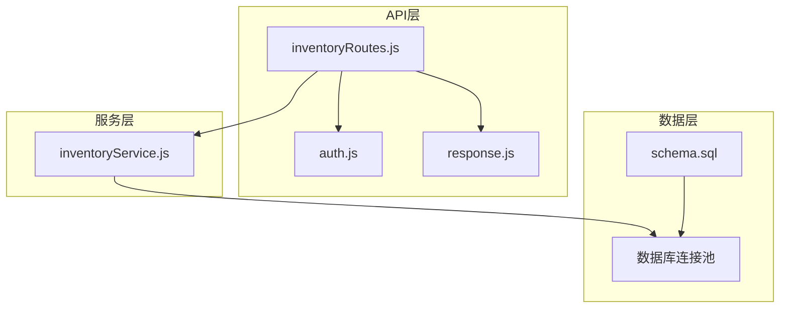
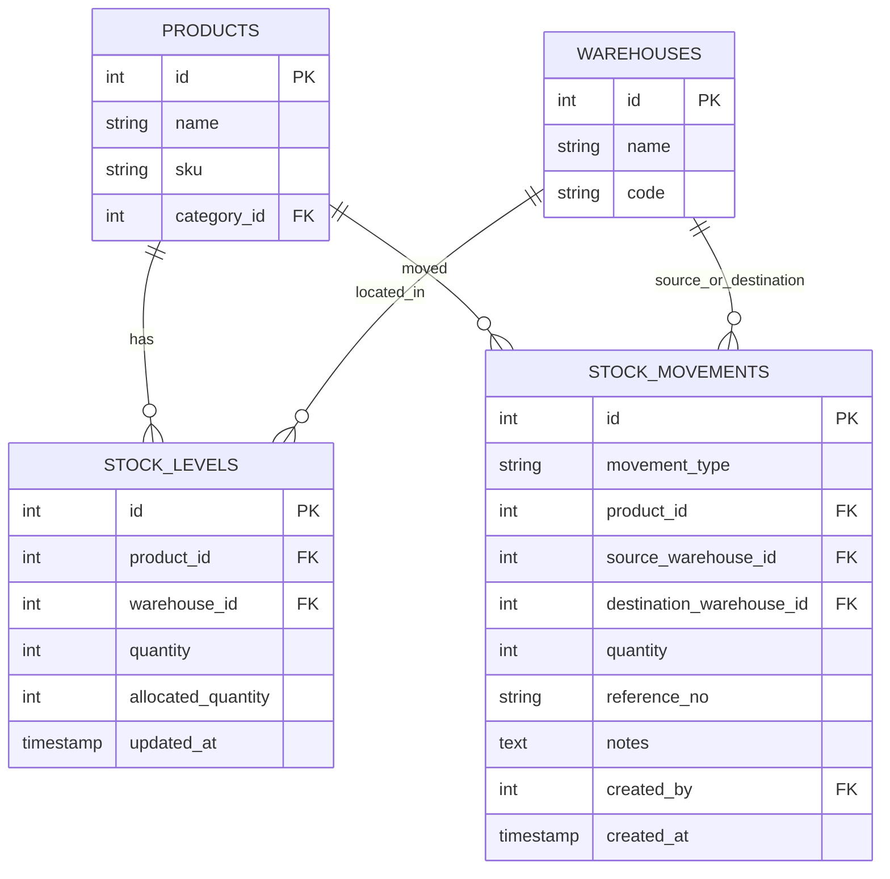
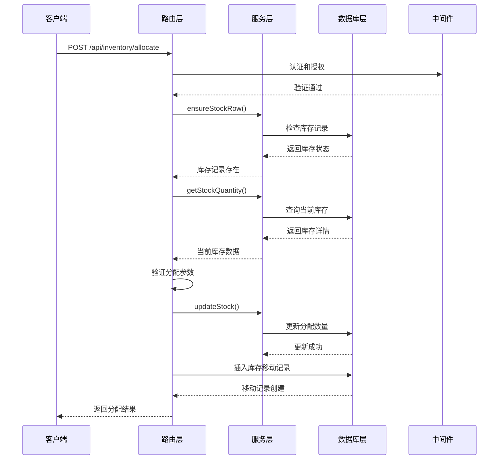
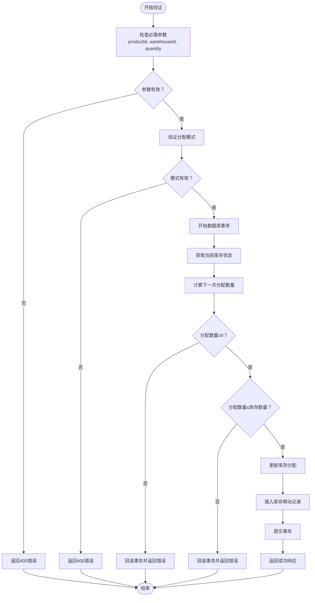
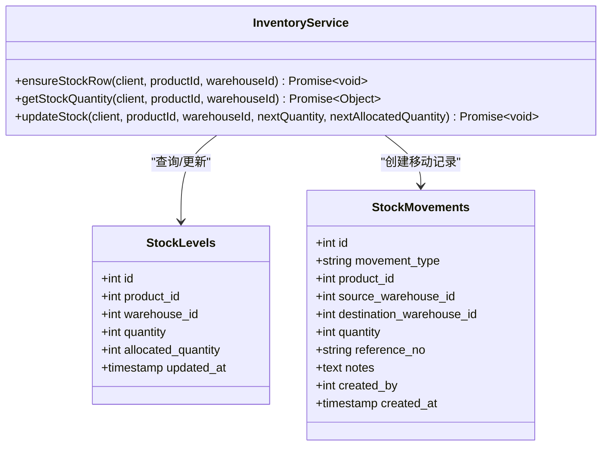
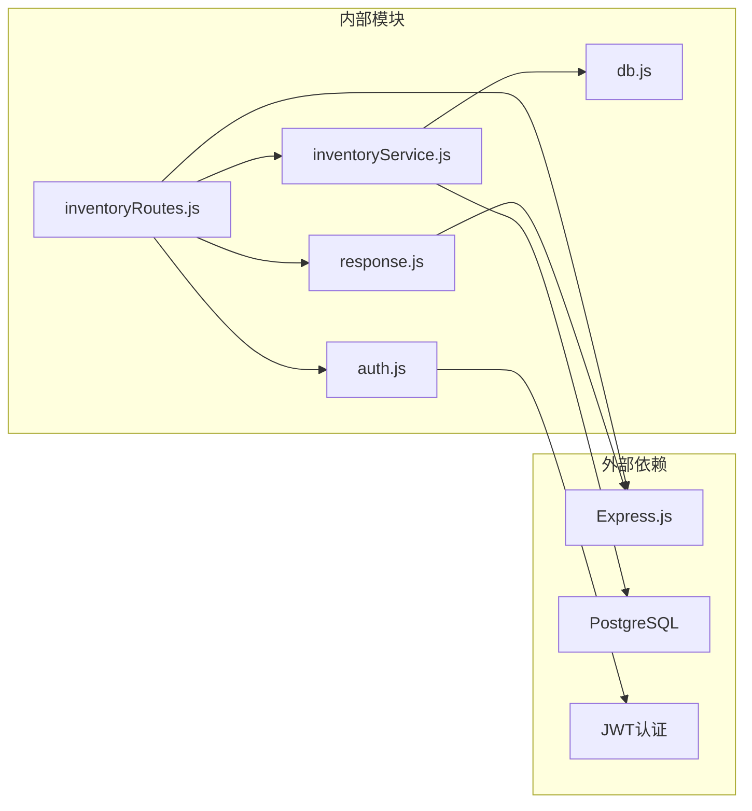

# 库存分配API

<cite>
**本文档引用的文件**
- [inventoryRoutes.js](file://server/src/routes/inventoryRoutes.js)
- [inventoryService.js](file://server/src/utils/inventoryService.js)
- [schema.sql](file://server/database/schema.sql)
- [app.js](file://server/src/app.js)
- [response.js](file://server/src/middleware/response.js)
</cite>

## 目录
1. [简介](#简介)
2. [项目结构](#项目结构)
3. [核心组件](#核心组件)
4. [架构概览](#架构概览)
5. [详细组件分析](#详细组件分析)
6. [依赖关系分析](#依赖关系分析)
7. [性能考虑](#性能考虑)
8. [故障排除指南](#故障排除指南)
9. [结论](#结论)

## 简介

库存分配API是库存管理系统的核心功能模块，专门用于处理订单预留和库存释放操作。该API提供了精确的库存控制机制，确保在订单处理过程中能够准确跟踪和管理可用库存。

本API支持两种分配模式：
- **预留（reserve）**：为待处理订单预留库存，减少可用库存但不影响实际出库
- **释放（release）**：释放已预留的库存，恢复到可用状态

## 项目结构

库存分配功能位于后端服务器的路由层中，采用模块化设计：

**图表来源**
- [inventoryRoutes.js:1-493](file://server/src/routes/inventoryRoutes.js#L1-L493)
- [inventoryService.js:1-45](file://server/src/utils/inventoryService.js#L1-L45)
- [schema.sql:125-133](file://server/database/schema.sql#L125-L133)

**章节来源**
- [inventoryRoutes.js:1-493](file://server/src/routes/inventoryRoutes.js#L1-L493)
- [app.js:1-67](file://server/src/app.js#L1-L67)

## 核心组件

### 主要功能模块

库存分配API由以下核心组件构成：

1. **路由处理器**：处理HTTP请求和响应
2. **库存服务**：封装库存查询和更新逻辑
3. **数据库模型**：定义库存表结构和约束
4. **中间件**：提供认证、授权和响应格式化

### 数据模型

库存分配涉及以下关键数据表：

**图表来源**
- [schema.sql:125-133](file://server/database/schema.sql#L125-L133)
- [schema.sql:237-248](file://server/database/schema.sql#L237-L248)

**章节来源**
- [schema.sql:125-133](file://server/database/schema.sql#L125-L133)
- [schema.sql:237-248](file://server/database/schema.sql#L237-L248)

## 架构概览

库存分配API采用三层架构设计，确保业务逻辑与数据访问的分离：

**图表来源**
- [inventoryRoutes.js:417-490](file://server/src/routes/inventoryRoutes.js#L417-L490)
- [inventoryService.js:29-38](file://server/src/utils/inventoryService.js#L29-L38)

## 详细组件分析

### POST /api/inventory/allocate 接口

#### 请求参数

| 参数名 | 类型 | 必需 | 描述 | 默认值 |
|--------|------|------|------|--------|
| productId | integer | 是 | 产品ID | - |
| warehouseId | integer | 是 | 仓库ID | - |
| quantity | integer | 是 | 分配数量 | - |
| mode | string | 否 | 分配模式 | reserve |
| referenceNo | string | 否 | 参考编号 | - |
| notes | string | 否 | 备注说明 | - |

#### 分配模式说明

**预留（reserve）模式**：
- 将指定数量的库存标记为已预留
- 减少可用库存但不进行实际出库
- 适用于订单创建后的库存锁定

**释放（release）模式**：
- 释放之前预留的库存
- 恢复到可用库存状态
- 适用于订单取消或超时未支付的情况

#### 验证规则

**图表来源**
- [inventoryRoutes.js:417-490](file://server/src/routes/inventoryRoutes.js#L417-L490)

#### 成功响应格式

成功的分配操作返回以下结构：

| 字段名 | 类型 | 描述 |
|--------|------|------|
| id | integer | 库存移动记录ID |
| movement_type | string | 库存移动类型（OUT） |
| product_id | integer | 产品ID |
| source_warehouse_id | integer | 仓库ID |
| quantity | integer | 移动数量 |
| reference_no | string | 参考编号 |
| notes | string | 备注说明 |
| created_by | integer | 创建用户ID |
| created_at | timestamp | 创建时间 |
| mode | string | 分配模式（reserve/release） |
| on_hand_quantity | integer | 当前库存数量 |
| order_allocated_quantity | integer | 订单已分配数量 |
| warehouse_available_quantity | integer | 仓库可用数量 |

#### 错误处理

| 错误码 | 触发条件 | 错误消息 |
|--------|----------|----------|
| 400 | 缺少必需参数 | productId, warehouseId and positive quantity are required. |
| 400 | 模式无效 | mode must be reserve or release. |
| 400 | 分配数量为负数 | Allocated quantity cannot be negative. |
| 400 | 分配数量超过库存 | Allocated quantity cannot exceed on hand quantity. |

**章节来源**
- [inventoryRoutes.js:417-490](file://server/src/routes/inventoryRoutes.js#L417-L490)
- [inventoryService.js:13-27](file://server/src/utils/inventoryService.js#L13-L27)

### 库存服务组件

库存服务提供了统一的库存操作接口：

**图表来源**
- [inventoryService.js:1-45](file://server/src/utils/inventoryService.js#L1-L45)
- [schema.sql:125-133](file://server/database/schema.sql#L125-L133)
- [schema.sql:237-248](file://server/database/schema.sql#L237-L248)

**章节来源**
- [inventoryService.js:1-45](file://server/src/utils/inventoryService.js#L1-L45)

### 数据库约束

库存表具有严格的约束条件以确保数据完整性：

| 约束类型 | 字段 | 约束条件 | 描述 |
|----------|------|----------|------|
| CHECK | quantity | ≥ 0 | 库存数量不能为负数 |
| CHECK | allocated_quantity | ≥ 0 | 已分配数量不能为负数 |
| UNIQUE | (product_id, warehouse_id) | 唯一组合 | 每个产品在每个仓库只有一个库存记录 |
| FOREIGN KEY | product_id | products(id) | 关联产品表 |
| FOREIGN KEY | warehouse_id | warehouses(id) | 关联仓库表 |

**章节来源**
- [schema.sql:125-133](file://server/database/schema.sql#L125-L133)

## 依赖关系分析

库存分配API的依赖关系如下：

**图表来源**
- [inventoryRoutes.js:1-8](file://server/src/routes/inventoryRoutes.js#L1-L8)
- [app.js:1-67](file://server/src/app.js#L1-L67)

**章节来源**
- [inventoryRoutes.js:1-8](file://server/src/routes/inventoryRoutes.js#L1-L8)
- [app.js:1-67](file://server/src/app.js#L1-L67)

## 性能考虑

### 查询优化

1. **索引策略**：库存表在product_id和warehouse_id上建立了复合索引
2. **批量操作**：支持分页查询以处理大量库存数据
3. **缓存机制**：可考虑在应用层添加库存状态缓存

### 并发控制

1. **事务隔离**：使用数据库事务确保操作原子性
2. **锁机制**：在高并发场景下可能需要行级锁
3. **重试机制**：网络异常时自动重试

## 故障排除指南

### 常见问题

1. **库存不足**：当可用库存小于分配数量时返回错误
2. **重复分配**：系统会自动检查并防止重复分配
3. **权限问题**：需要适当的用户角色才能执行分配操作

### 调试建议

1. **启用日志**：检查数据库事务日志
2. **验证参数**：确认所有必需参数都已正确传递
3. **检查约束**：验证库存表约束是否被违反

**章节来源**
- [inventoryRoutes.js:442-448](file://server/src/routes/inventoryRoutes.js#L442-L448)

## 结论

库存分配API提供了完整的库存预留和释放机制，具有以下特点：

1. **精确控制**：支持细粒度的库存分配管理
2. **数据安全**：通过数据库约束和事务保证数据完整性
3. **灵活扩展**：模块化设计便于功能扩展
4. **性能优化**：合理的索引和查询策略

该API为订单管理系统提供了可靠的库存基础，确保库存数据的准确性和一致性。