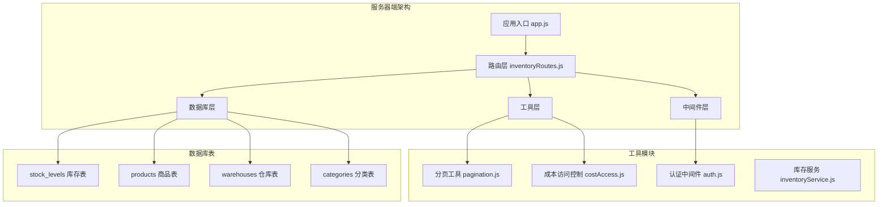
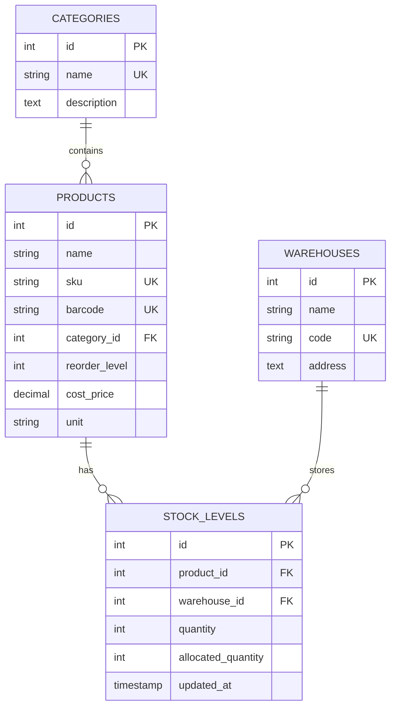
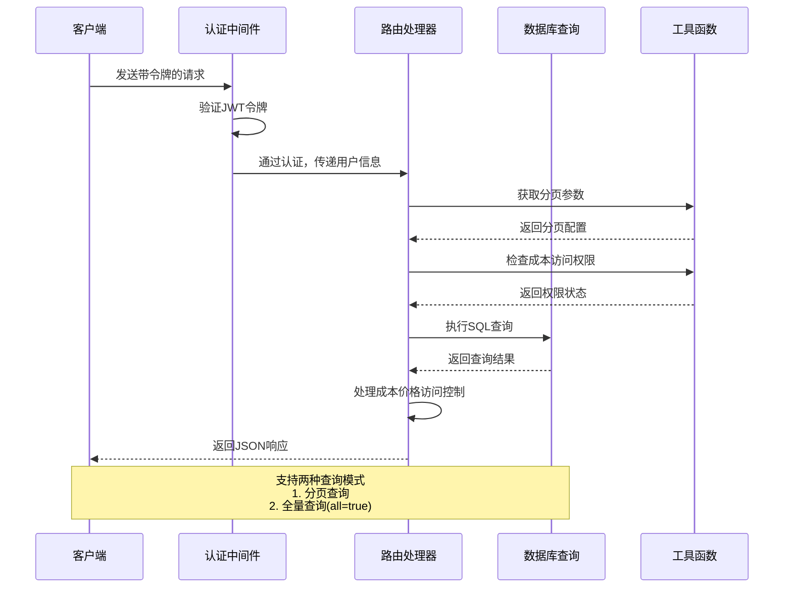
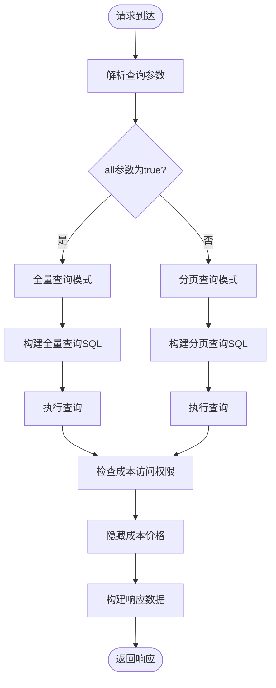
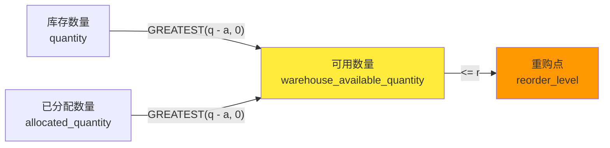
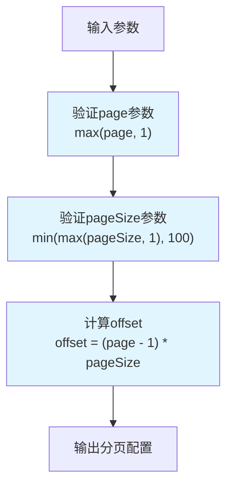
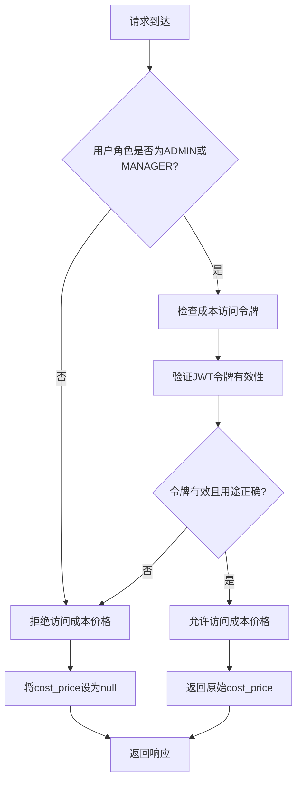
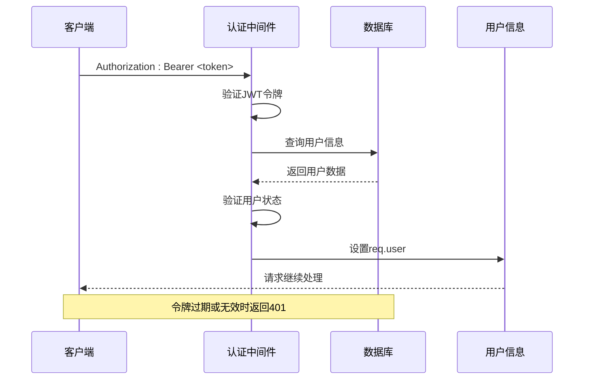
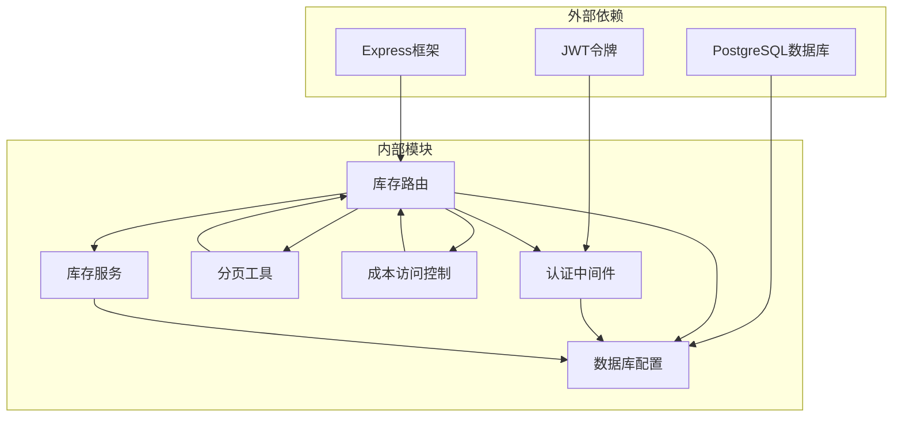

# 库存总览查询API

<cite>
**本文档引用的文件**
- [inventoryRoutes.js](file://server/src/routes/inventoryRoutes.js)
- [pagination.js](file://server/src/utils/pagination.js)
- [costAccess.js](file://server/src/utils/costAccess.js)
- [auth.js](file://server/src/middleware/auth.js)
- [schema.sql](file://server/database/schema.sql)
- [seed.sql](file://server/database/seed.sql)
- [app.js](file://server/src/app.js)
- [inventory_system_backend.postman_collection.json](file://postman/inventory_system_backend.postman_collection.json)
</cite>

## 目录
1. [简介](#简介)
2. [项目结构](#项目结构)
3. [核心组件](#核心组件)
4. [架构概览](#架构概览)
5. [详细组件分析](#详细组件分析)
6. [依赖关系分析](#依赖关系分析)
7. [性能考虑](#性能考虑)
8. [故障排除指南](#故障排除指南)
9. [结论](#结论)

## 简介

库存总览查询API是库存管理系统的核心接口之一，提供对所有仓库库存的综合查询能力。该API支持分页、搜索和高级筛选功能，能够高效处理大量库存数据，特别适用于需要实时监控库存状态的场景。

本API通过统一的查询接口，为前端提供完整的库存信息，包括可用数量、已分配数量、重购点等关键指标，并实现了基于角色的成本价格访问控制机制。

## 项目结构

库存总览查询API位于服务器端的路由层，采用模块化设计，与其他业务模块保持清晰的分离：



**图表来源**
- [app.js:40-55](file://server/src/app.js#L40-L55)
- [inventoryRoutes.js:1-10](file://server/src/routes/inventoryRoutes.js#L1-L10)

**章节来源**
- [app.js:1-67](file://server/src/app.js#L1-L67)
- [inventoryRoutes.js:1-151](file://server/src/routes/inventoryRoutes.js#L1-L151)

## 核心组件

### API端点定义

库存总览查询API提供以下核心功能：

- **基础查询端点**: `GET /api/inventory`
- **高级筛选**: 支持按分类、仓库、低库存状态筛选
- **全文搜索**: 支持产品名称、SKU、条形码、分类名称、仓库名称和代码的模糊搜索
- **分页机制**: 支持自定义页面大小和页码
- **成本价格保护**: 基于角色的敏感信息访问控制

### 查询参数详解

| 参数名 | 类型 | 默认值 | 必填 | 描述 |
|--------|------|--------|------|------|
| search | string | '' | 否 | 搜索关键词，支持多字段模糊匹配 |
| categoryId | string | '' | 否 | 分类ID过滤器 |
| warehouseId | string | '' | 否 | 仓库ID过滤器 |
| lowStockOnly | string | 'false' | 否 | 是否仅显示低库存商品（true/false） |
| all | string | 'false' | 否 | 是否加载全部数据（true/false） |
| page | number | 1 | 否 | 页码，默认1 |
| pageSize | number | 10 | 否 | 页面大小，默认10，最大100 |

### 数据模型关系



**图表来源**
- [schema.sql:32-54](file://server/database/schema.sql#L32-L54)
- [schema.sql:125-133](file://server/database/schema.sql#L125-L133)

**章节来源**
- [inventoryRoutes.js:17-23](file://server/src/routes/inventoryRoutes.js#L17-L23)
- [schema.sql:125-133](file://server/database/schema.sql#L125-L133)

## 架构概览

库存总览查询API采用经典的三层架构设计，确保了良好的可维护性和扩展性：



**图表来源**
- [inventoryRoutes.js:17-151](file://server/src/routes/inventoryRoutes.js#L17-L151)
- [auth.js:5-29](file://server/src/middleware/auth.js#L5-L29)

## 详细组件分析

### 路由处理器实现

库存总览查询API的核心实现位于路由处理器中，采用了异步编程模式来优化数据库查询性能：

#### 查询流程分析



**图表来源**
- [inventoryRoutes.js:17-151](file://server/src/routes/inventoryRoutes.js#L17-L151)

#### 关键查询条件

API支持多种查询条件的组合使用：

1. **搜索条件**: 支持产品名称、SKU、条形码、分类名称、仓库名称和代码的模糊匹配
2. **分类过滤**: 通过`categoryId`参数精确过滤特定分类的商品
3. **仓库过滤**: 通过`warehouseId`参数精确过滤特定仓库的商品
4. **低库存筛选**: 通过`lowStockOnly`参数筛选可用库存小于等于重购点的商品

#### 库存计算字段关系

API提供了三个核心库存计算字段，它们之间存在明确的数学关系：



**图表来源**
- [inventoryRoutes.js:35](file://server/src/routes/inventoryRoutes.js#L35)

**章节来源**
- [inventoryRoutes.js:27-147](file://server/src/routes/inventoryRoutes.js#L27-L147)

### 分页机制实现

API采用统一的分页工具函数来处理分页逻辑，确保了各接口的一致性：

#### 分页参数验证



**图表来源**
- [pagination.js:2-12](file://server/src/utils/pagination.js#L2-L12)

#### 分页响应格式

API返回标准的分页响应结构：

```json
{
  "items": [
    {
      "id": 1,
      "product_id": 1,
      "warehouse_id": 1,
      "on_hand_quantity": 120,
      "order_allocated_quantity": 0,
      "warehouse_available_quantity": 120,
      "updated_at": "2024-01-01T00:00:00Z",
      "product_name": "Wireless Mouse",
      "sku": "SKU-MOUSE-001",
      "barcode": "6901234567890",
      "reorder_level": 15,
      "unit": "pcs",
      "cost_price": 12.50,
      "category_name": "Electronics",
      "warehouse_name": "Main Warehouse",
      "warehouse_code": "WH-MAIN"
    }
  ],
  "pagination": {
    "total": 100,
    "page": 1,
    "pageSize": 10,
    "totalPages": 10
  }
}
```

**章节来源**
- [pagination.js:15-22](file://server/src/utils/pagination.js#L15-L22)

### 成本价格访问控制

API实现了基于角色的敏感信息访问控制机制：

#### 访问控制流程



**图表来源**
- [costAccess.js:25-27](file://server/src/utils/costAccess.js#L25-L27)

#### 访问控制策略

1. **角色限制**: 仅限ADMIN和MANAGER角色用户
2. **令牌验证**: 需要专门的"cost-access"用途令牌
3. **用户绑定**: 令牌必须与当前用户绑定
4. **动态控制**: 运行时根据权限决定是否显示成本价格

**章节来源**
- [costAccess.js:1-32](file://server/src/utils/costAccess.js#L1-L32)
- [inventoryRoutes.js:70-71](file://server/src/routes/inventoryRoutes.js#L70-L71)

### 认证和授权机制

API采用JWT令牌进行身份验证和授权控制：

#### 认证流程



**图表来源**
- [auth.js:5-29](file://server/src/middleware/auth.js#L5-L29)

**章节来源**
- [auth.js:1-46](file://server/src/middleware/auth.js#L1-L46)

## 依赖关系分析

### 组件依赖图



**图表来源**
- [inventoryRoutes.js:1-6](file://server/src/routes/inventoryRoutes.js#L1-L6)

### 数据库索引优化

为了支持高效的库存查询，数据库建立了以下关键索引：

| 索引名称 | 表名 | 列 | 用途 |
|----------|------|----|------|
| idx_stock_levels_product_id | stock_levels | product_id | 快速查找商品库存 |
| idx_stock_levels_warehouse_id | stock_levels | warehouse_id | 快速查找仓库库存 |
| idx_products_category_id | products | category_id | 分类过滤 |
| idx_stock_movements_created_at | stock_movements | created_at | 时间排序查询 |

**章节来源**
- [schema.sql:415-416](file://server/database/schema.sql#L415-L416)
- [schema.sql:410](file://server/database/schema.sql#L410)

## 性能考虑

### 查询优化策略

1. **索引利用**: 通过适当的索引设计支持快速的搜索和过滤操作
2. **分页查询**: 默认采用分页查询模式，避免一次性加载大量数据
3. **条件优化**: 使用参数化查询防止SQL注入攻击
4. **内存管理**: 异步查询模式减少内存占用

### 缓存策略建议

虽然当前实现未包含缓存层，但可以考虑以下优化方案：
- 对热门商品的库存信息进行短期缓存
- 实现查询结果的智能缓存失效机制
- 考虑使用Redis等内存数据库存储热点数据

## 故障排除指南

### 常见问题及解决方案

#### 认证失败
**症状**: 返回401状态码
**原因**: 令牌缺失、过期或无效
**解决**: 重新登录获取有效的JWT令牌

#### 权限不足
**症状**: 成功认证但无法查看成本价格
**原因**: 用户角色不是ADMIN或MANAGER
**解决**: 使用具有适当权限的账户登录

#### 查询参数错误
**症状**: 返回400状态码
**解决**: 检查查询参数的类型和格式

#### 数据库连接问题
**症状**: 返回500状态码
**解决**: 检查数据库连接配置和网络连通性

**章节来源**
- [auth.js:9-28](file://server/src/middleware/auth.js#L9-L28)
- [inventoryRoutes.js:148-150](file://server/src/routes/inventoryRoutes.js#L148-L150)

## 结论

库存总览查询API通过精心设计的架构和实现，为库存管理提供了强大而灵活的查询能力。其主要特点包括：

1. **全面的功能覆盖**: 支持搜索、筛选、分页和成本价格访问控制
2. **高性能设计**: 采用分页查询和数据库索引优化
3. **安全性保障**: 实现了多层次的身份验证和授权机制
4. **可扩展性**: 模块化设计便于功能扩展和维护

该API为库存管理系统提供了坚实的数据基础，能够满足从日常库存监控到复杂报表生成的各种需求。通过合理的参数配置和最佳实践，可以充分发挥API的性能优势，为用户提供流畅的库存管理体验。