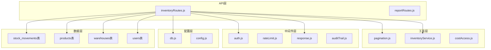
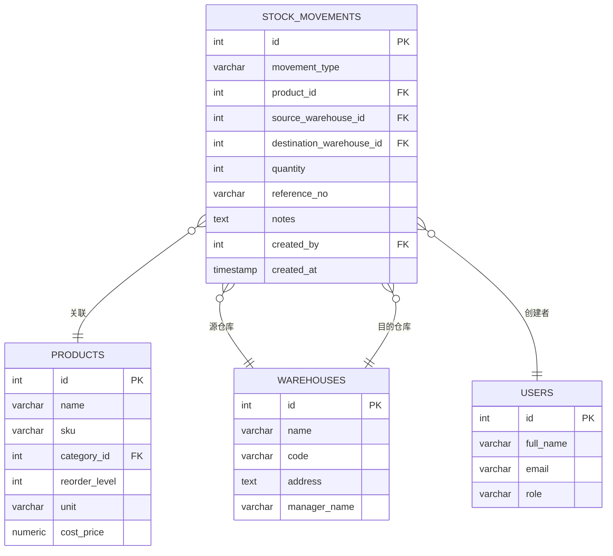
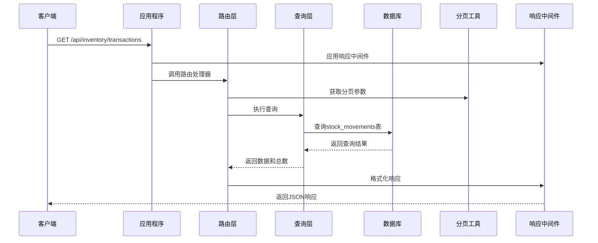
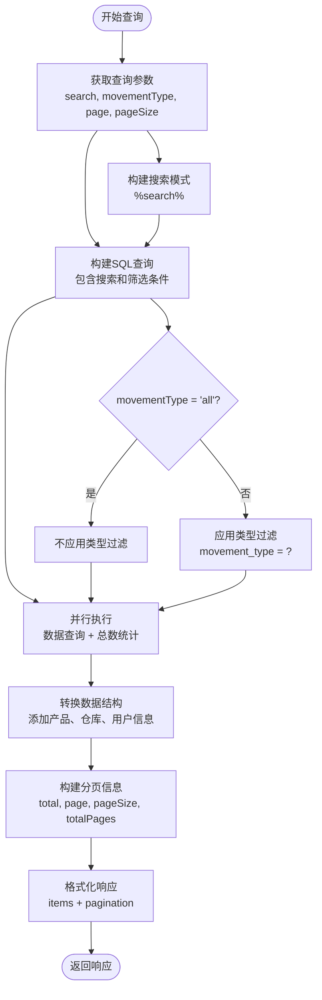
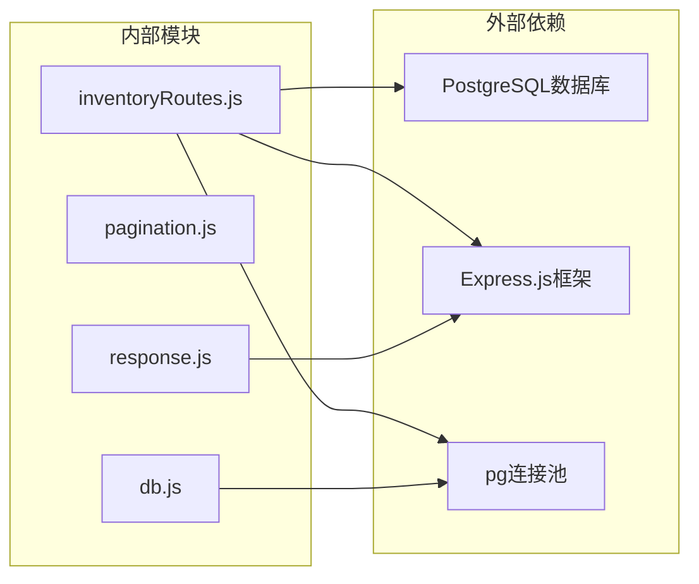
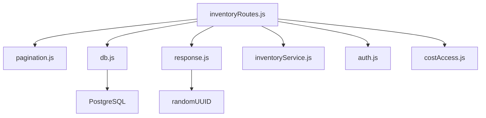
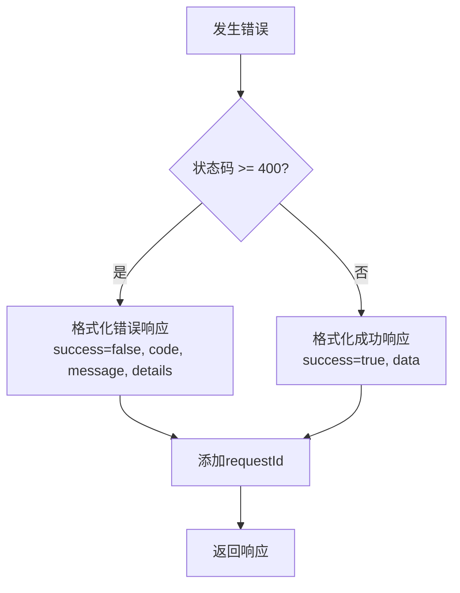

# 库存流水查询API

<cite>
**本文档引用的文件**
- [inventoryRoutes.js](file://server/src/routes/inventoryRoutes.js)
- [pagination.js](file://server/src/utils/pagination.js)
- [response.js](file://server/src/middleware/response.js)
- [db.js](file://server/src/config/db.js)
- [schema.sql](file://server/database/schema.sql)
- [app.js](file://server/src/app.js)
- [inventory_system_backend.postman_collection.json](file://postman/inventory_system_backend.postman_collection.json)
</cite>

## 目录
1. [简介](#简介)
2. [项目结构](#项目结构)
3. [核心组件](#核心组件)
4. [架构概览](#架构概览)
5. [详细组件分析](#详细组件分析)
6. [依赖关系分析](#依赖关系分析)
7. [性能考虑](#性能考虑)
8. [故障排除指南](#故障排除指南)
9. [结论](#结论)

## 简介

本文档详细说明了库存流水查询API，特别是GET /api/inventory/transactions接口的功能特性。该API提供了完整的库存移动记录查询能力，支持搜索功能、类型筛选和分页机制。系统支持三种移动类型：IN（入库）、OUT（出库）和TRANSFER（调拨），能够显示产品信息、仓库信息和操作员信息。

## 项目结构

库存流水查询API位于后端服务器的路由层，采用模块化设计：



**图表来源**
- [inventoryRoutes.js:154-227](file://server/src/routes/inventoryRoutes.js#L154-L227)
- [pagination.js:1-28](file://server/src/utils/pagination.js#L1-28)

**章节来源**
- [inventoryRoutes.js:154-227](file://server/src/routes/inventoryRoutes.js#L154-L227)
- [app.js:43](file://server/src/app.js#L43)

## 核心组件

### API端点定义

GET /api/inventory/transactions 接口是本次文档的重点，它提供了以下核心功能：

- **搜索功能**：支持按产品名称、SKU、参考号、移动类型、仓库名称和操作员姓名进行模糊搜索
- **类型筛选**：支持按移动类型(IN、OUT、TRANSFER)进行精确筛选
- **分页机制**：支持标准的分页参数(page、pageSize)控制结果集大小
- **实时排序**：按创建时间降序排列，确保最新记录优先显示

### 数据模型关系



**图表来源**
- [schema.sql:237-248](file://server/database/schema.sql#L237-L248)
- [schema.sql:32-54](file://server/database/schema.sql#L32-L54)
- [schema.sql:22-30](file://server/database/schema.sql#L22-L30)
- [schema.sql:2-11](file://server/database/schema.sql#L2-L11)

**章节来源**
- [schema.sql:237-248](file://server/database/schema.sql#L237-L248)
- [schema.sql:32-54](file://server/database/schema.sql#L32-L54)
- [schema.sql:22-30](file://server/database/schema.sql#L22-L30)

## 架构概览

### 请求处理流程



**图表来源**
- [inventoryRoutes.js:154-227](file://server/src/routes/inventoryRoutes.js#L154-L227)
- [pagination.js:2-12](file://server/src/utils/pagination.js#L2-L12)
- [response.js:3-57](file://server/src/middleware/response.js#L3-L57)

### 移动类型处理流程



**图表来源**
- [inventoryRoutes.js:154-227](file://server/src/routes/inventoryRoutes.js#L154-L227)
- [inventoryRoutes.js:160-218](file://server/src/routes/inventoryRoutes.js#L160-L218)

**章节来源**
- [inventoryRoutes.js:154-227](file://server/src/routes/inventoryRoutes.js#L154-L227)
- [pagination.js:15-22](file://server/src/utils/pagination.js#L15-L22)

## 详细组件分析

### 搜索功能实现

搜索功能支持多字段模糊匹配，包括：

- **产品相关**：产品名称、SKU
- **移动相关**：参考号、移动类型
- **仓库相关**：源仓库名称、目的仓库名称
- **用户相关**：操作员姓名

搜索模式使用通配符格式`%search%`，通过ILIKE操作符实现不区分大小写的模糊匹配。

### 类型筛选机制

移动类型筛选支持三种值：
- `all`：返回所有类型的移动记录
- `IN`：仅返回入库记录
- `OUT`：仅返回出库记录  
- `TRANSFER`：仅返回调拨记录

当`movementType`参数为'all'时，查询不应用类型过滤条件。

### 分页机制详解

分页参数采用标准RESTful设计：

| 参数名 | 类型 | 默认值 | 有效范围 | 描述 |
|--------|------|--------|----------|------|
| page | number | 1 | ≥1 | 当前页码 |
| pageSize | number | 10 | 1-100 | 每页记录数 |

分页计算逻辑：
- `offset = (page - 1) × pageSize`
- `page`最小值为1
- `pageSize`限制在1-100范围内

### 响应数据结构

#### 成功响应格式

```javascript
{
  "success": true,
  "data": {
    "items": [
      {
        "id": 1,
        "movement_type": "IN",
        "quantity": 10,
        "reference_no": "IN-001",
        "notes": "采购入库",
        "created_at": "2024-01-15T10:30:00Z",
        "product_name": "激光切割机",
        "sku": "SKU-LASER-001",
        "source_warehouse_name": null,
        "destination_warehouse_name": "主仓库",
        "created_by_name": "张三"
      }
    ],
    "pagination": {
      "total": 150,
      "page": 1,
      "pageSize": 10,
      "totalPages": 15
    }
  },
  "requestId": "uuid-string"
}
```

#### 错误响应格式

```javascript
{
  "success": false,
  "code": "REQUEST_FAILED",
  "message": "查询失败",
  "details": {
    "error": "数据库连接错误"
  },
  "requestId": "uuid-string"
}
```

**章节来源**
- [inventoryRoutes.js:154-227](file://server/src/routes/inventoryRoutes.js#L154-L227)
- [response.js:9-34](file://server/src/middleware/response.js#L9-L34)

### 查询示例

#### 基本查询示例

**请求URL**: `GET /api/inventory/transactions?page=1&pageSize=10`

**响应**: 返回第1页的10条库存流水记录，按创建时间降序排列。

#### 搜索查询示例

**请求URL**: `GET /api/inventory/transactions?search=激光&page=1&pageSize=8`

**效果**: 返回包含"激光"关键词的所有库存流水记录。

#### 类型筛选示例

**请求URL**: `GET /api/inventory/transactions?movementType=IN&page=1&pageSize=8`

**效果**: 仅返回入库类型的库存流水记录。

#### 组合查询示例

**请求URL**: `GET /api/inventory/transactions?search=激光&movementType=IN&page=1&pageSize=8`

**效果**: 返回包含"激光"且为入库类型的库存流水记录。

**章节来源**
- [inventory_system_backend.postman_collection.json:256-272](file://postman/inventory_system_backend.postman_collection.json#L256-L272)

## 依赖关系分析

### 外部依赖



**图表来源**
- [db.js:15-19](file://server/src/config/db.js#L15-L19)
- [app.js:31](file://server/src/app.js#L31)

### 内部模块依赖



**图表来源**
- [inventoryRoutes.js:1-8](file://server/src/routes/inventoryRoutes.js#L1-L8)
- [response.js:1](file://server/src/middleware/response.js#L1)

**章节来源**
- [inventoryRoutes.js:1-8](file://server/src/routes/inventoryRoutes.js#L1-L8)
- [db.js:15-24](file://server/src/config/db.js#L15-L24)

## 性能考虑

### 数据库优化策略

1. **索引优化**：stock_movements表对product_id和created_at建立了索引，支持快速查询
2. **并行查询**：使用Promise.all同时执行数据查询和总数统计，减少响应时间
3. **分页优化**：使用LIMIT和OFFSET控制结果集大小，避免一次性加载大量数据

### 缓存策略

- **查询缓存**：对于频繁访问的查询结果，可以考虑添加Redis缓存
- **配置缓存**：数据库连接配置可以缓存以减少初始化开销

### 性能监控

建议添加以下监控指标：
- 查询响应时间
- 数据库连接池使用率
- 并发请求数
- 错误率统计

## 故障排除指南

### 常见问题及解决方案

#### 1. 数据库连接问题

**症状**: 响应状态码500，错误信息包含数据库连接错误

**解决方案**:
- 检查DATABASE_URL环境变量配置
- 验证数据库服务是否正常运行
- 确认网络连接和防火墙设置

#### 2. 查询超时问题

**症状**: 请求处理时间过长或超时

**解决方案**:
- 优化搜索条件，避免过于宽泛的查询
- 使用更精确的筛选条件
- 调整pageSize参数，减少单次查询的数据量

#### 3. 权限不足问题

**症状**: 返回401未授权或403禁止访问

**解决方案**:
- 确保请求包含有效的认证令牌
- 验证用户角色权限
- 检查API端点的访问控制配置

**章节来源**
- [db.js:3-11](file://server/src/config/db.js#L3-L11)
- [response.js:14-27](file://server/src/middleware/response.js#L14-L27)

### 错误处理机制

系统采用统一的错误处理中间件，自动将错误响应格式化为标准结构：



**图表来源**
- [response.js:9-34](file://server/src/middleware/response.js#L9-L34)

## 结论

库存流水查询API提供了完整、高效的库存移动记录查询能力。通过合理的搜索、筛选和分页机制，用户可以快速定位所需的库存流水信息。系统采用模块化设计，具有良好的可维护性和扩展性。建议在生产环境中结合适当的缓存策略和监控机制，以进一步提升性能和可靠性。