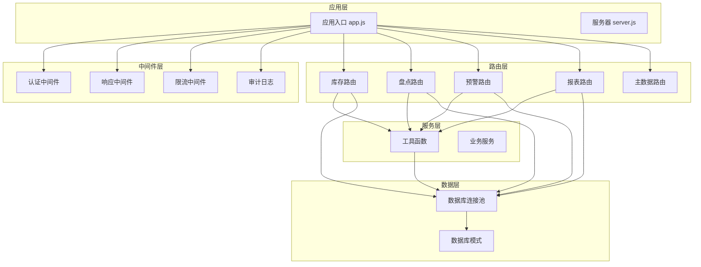
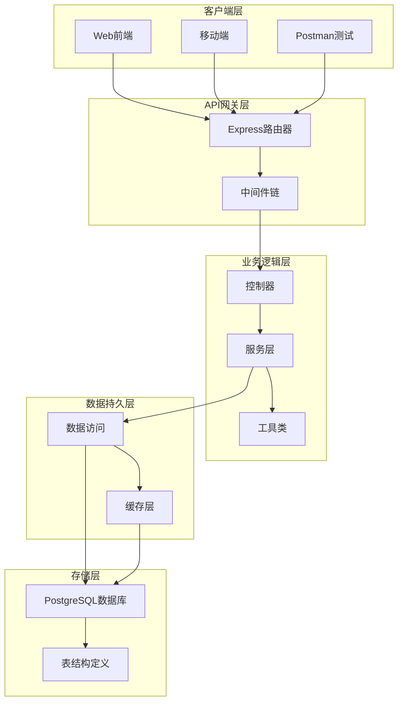
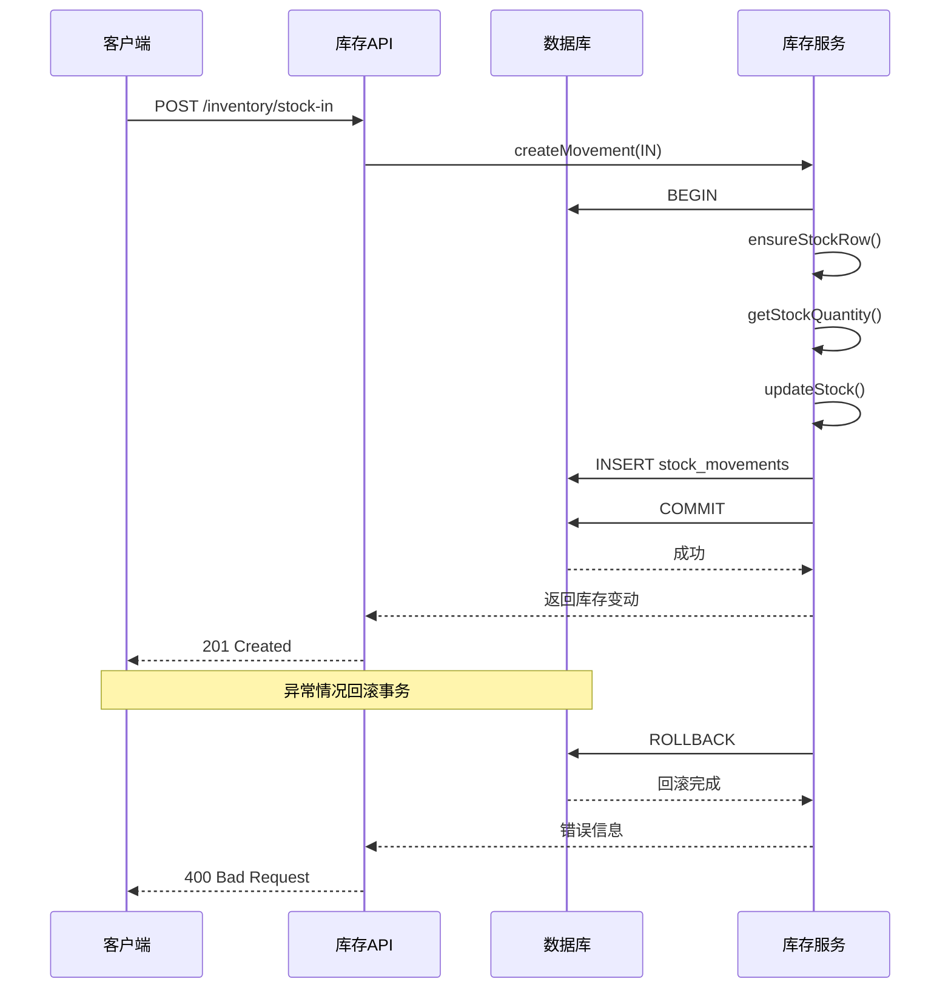
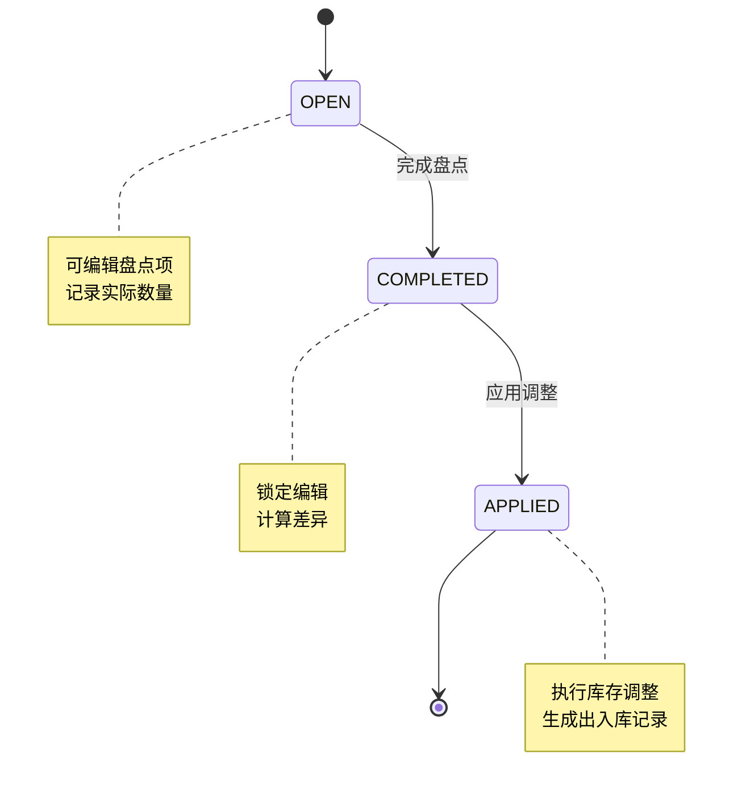
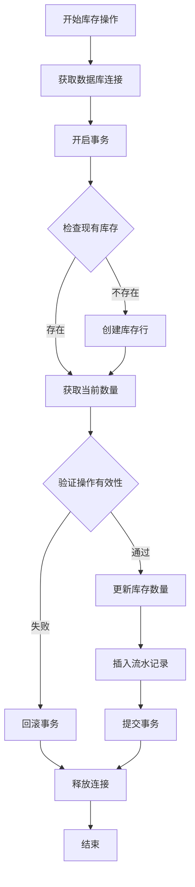
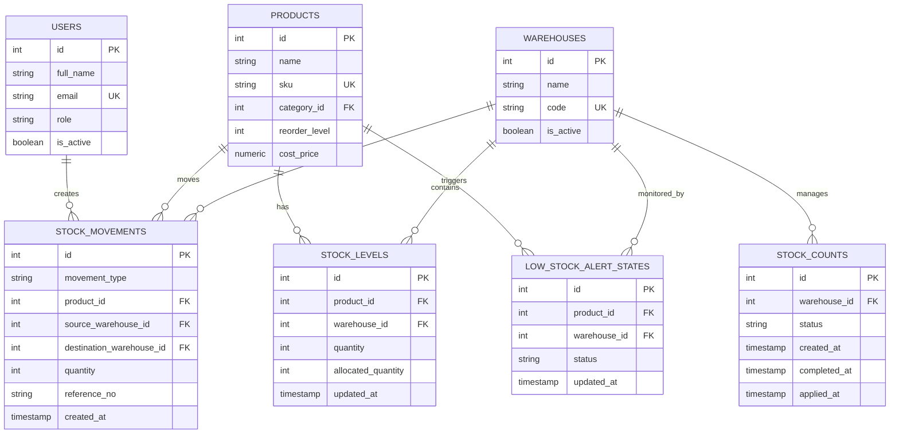
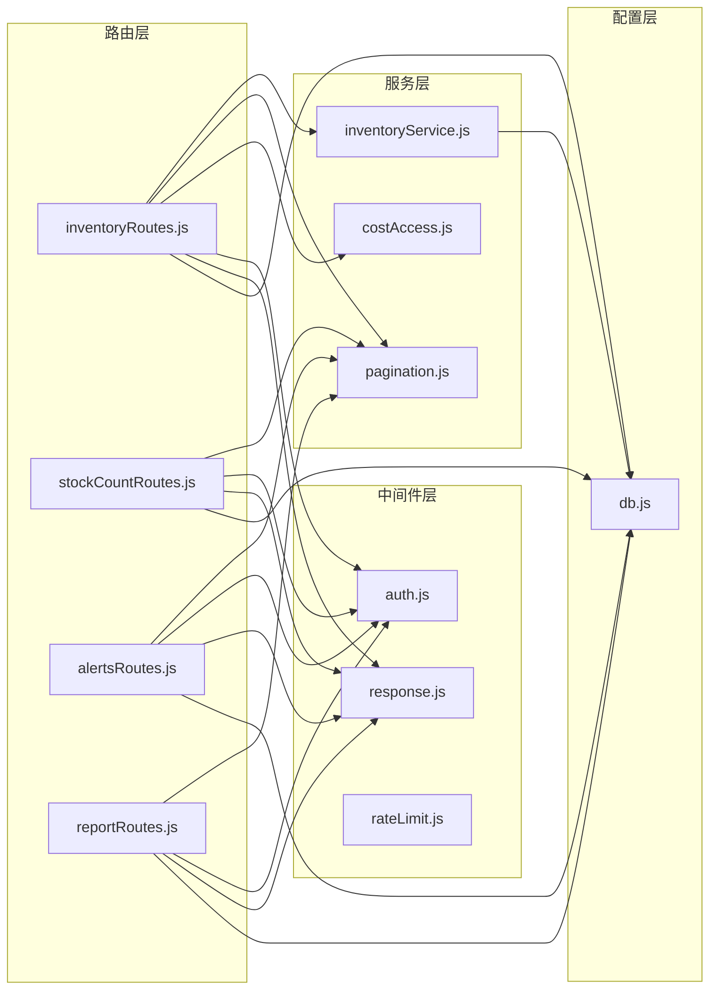

# 库存管理API

<cite>
**本文档引用的文件**
- [server/src/app.js](file://server/src/app.js)
- [server/src/server.js](file://server/src/server.js)
- [server/src/config/db.js](file://server/src/config/db.js)
- [server/src/middleware/auth.js](file://server/src/middleware/auth.js)
- [server/src/middleware/response.js](file://server/src/middleware/response.js)
- [server/src/middleware/rateLimit.js](file://server/src/middleware/rateLimit.js)
- [server/src/utils/pagination.js](file://server/src/utils/pagination.js)
- [server/src/utils/costAccess.js](file://server/src/utils/costAccess.js)
- [server/src/utils/inventoryService.js](file://server/src/utils/inventoryService.js)
- [server/src/routes/inventoryRoutes.js](file://server/src/routes/inventoryRoutes.js)
- [server/src/routes/stockCountRoutes.js](file://server/src/routes/stockCountRoutes.js)
- [server/src/routes/alertsRoutes.js](file://server/src/routes/alertsRoutes.js)
- [server/src/routes/reportRoutes.js](file://server/src/routes/reportRoutes.js)
- [server/database/schema.sql](file://server/database/schema.sql)
- [POSTMAN_BACKEND_GUIDE.md](file://POSTMAN_BACKEND_GUIDE.md)
</cite>

## 目录
1. [简介](#简介)
2. [项目结构](#项目结构)
3. [核心组件](#核心组件)
4. [架构概览](#架构概览)
5. [详细组件分析](#详细组件分析)
6. [依赖关系分析](#依赖关系分析)
7. [性能考虑](#性能考虑)
8. [故障排除指南](#故障排除指南)
9. [结论](#结论)
10. [附录](#附录)

## 简介
本项目是一个基于Node.js和PostgreSQL的库存管理系统后端API。系统提供了完整的库存操作功能，包括入库、出库、调拨、盘点、预警、报表等核心业务能力。所有接口均采用RESTful设计，支持事务处理、并发控制和数据一致性保证。

## 项目结构
系统采用模块化架构，按功能领域划分路由层、服务层和工具层：



**图表来源**
- [server/src/app.js:1-67](file://server/src/app.js#L1-L67)
- [server/src/server.js:1-28](file://server/src/server.js#L1-L28)

**章节来源**
- [server/src/app.js:1-67](file://server/src/app.js#L1-L67)
- [server/src/server.js:1-28](file://server/src/server.js#L1-L28)

## 核心组件
系统的核心组件包括认证授权、数据库连接、事务处理和业务逻辑封装：

### 认证授权组件
- **JWT认证**：基于Bearer Token的无状态认证
- **角色授权**：基于用户角色的权限控制
- **成本访问控制**：敏感数据的二次验证机制

### 数据库组件
- **连接池管理**：PostgreSQL连接池配置
- **SSL支持**：生产环境自动启用SSL
- **超时控制**：数据库连接超时保护

### 业务组件
- **库存服务**：统一封装库存增减逻辑
- **分页工具**：统一的分页参数处理
- **成本访问**：敏感数据访问控制

**章节来源**
- [server/src/middleware/auth.js:1-46](file://server/src/middleware/auth.js#L1-L46)
- [server/src/config/db.js:1-25](file://server/src/config/db.js#L1-L25)
- [server/src/utils/inventoryService.js:1-45](file://server/src/utils/inventoryService.js#L1-L45)

## 架构概览
系统采用分层架构，确保关注点分离和代码可维护性：



**图表来源**
- [server/src/app.js:26-55](file://server/src/app.js#L26-L55)
- [server/src/config/db.js:15-19](file://server/src/config/db.js#L15-L19)

## 详细组件分析

### 库存管理API

#### 库存查询接口
系统提供多种库存查询方式，支持分页、搜索和高级筛选：

**接口定义**
- `GET /api/inventory` - 库存总览查询
- `GET /api/inventory/transactions` - 库存流水查询

**查询参数**
- `search`: 关键词搜索
- `categoryId`: 分类筛选
- `warehouseId`: 仓库筛选
- `lowStockOnly`: 仅显示缺货
- `movementType`: 流水类型筛选
- `page`/`pageSize`: 分页参数

**响应结构**
```javascript
{
  "items": [
    {
      "id": 1,
      "product_id": 1,
      "warehouse_id": 1,
      "on_hand_quantity": 100,
      "warehouse_available_quantity": 95,
      "updated_at": "2024-01-01T00:00:00Z"
    }
  ],
  "pagination": {
    "total": 100,
    "page": 1,
    "pageSize": 10,
    "totalPages": 10
  }
}
```

**章节来源**
- [server/src/routes/inventoryRoutes.js:17-151](file://server/src/routes/inventoryRoutes.js#L17-L151)

#### 库存操作接口

**入库操作**
- `POST /api/inventory/stock-in`
- 角色要求：ADMIN, MANAGER, STAFF
- 参数：productId, warehouseId, quantity, referenceNo, notes, supplierId, unitCost, purchaseReason

**出库操作**
- `POST /api/inventory/stock-out`
- 角色要求：ADMIN, MANAGER, STAFF
- 参数：productId, warehouseId, quantity, referenceNo, notes

**调拨操作**
- `POST /api/inventory/transfer`
- 角色要求：ADMIN, MANAGER
- 参数：productId, sourceWarehouseId, destinationWarehouseId, quantity, referenceNo, notes

**分配操作**
- `POST /api/inventory/allocate`
- 角色要求：ADMIN, MANAGER, STAFF
- 参数：productId, warehouseId, quantity, mode(reserve/release), referenceNo, notes

**事务处理流程**


**图表来源**
- [server/src/routes/inventoryRoutes.js:229-403](file://server/src/routes/inventoryRoutes.js#L229-L403)
- [server/src/utils/inventoryService.js:2-38](file://server/src/utils/inventoryService.js#L2-L38)

**章节来源**
- [server/src/routes/inventoryRoutes.js:405-490](file://server/src/routes/inventoryRoutes.js#L405-L490)

#### 库存盘点接口

**盘点流程**
- 创建盘点单：`POST /api/stock-counts`
- 编辑盘点项：`PUT /api/stock-counts/:id/items`
- 完成盘点：`POST /api/stock-counts/:id/complete`
- 应用盘点结果：`POST /api/stock-counts/:id/apply`

**状态转换**


**图表来源**
- [server/src/routes/stockCountRoutes.js:273-431](file://server/src/routes/stockCountRoutes.js#L273-L431)

**章节来源**
- [server/src/routes/stockCountRoutes.js:87-164](file://server/src/routes/stockCountRoutes.js#L87-L164)

#### 预警管理接口

**低库存预警**
- 查询：`GET /api/alerts/low-stock`
- 单个更新：`PUT /api/alerts/low-stock/:productId/:warehouseId`
- 批量更新：`POST /api/alerts/low-stock/bulk-update`

**预警状态**
- OPEN: 待处理
- READ: 已查看
- IGNORED: 已忽略

**章节来源**
- [server/src/routes/alertsRoutes.js:80-232](file://server/src/routes/alertsRoutes.js#L80-L232)

#### 报表统计接口

**库存报表**
- `GET /api/reports/inventory` - 当前库存明细
- 支持搜索和分页，导出时可加载全部数据

**流水报表**
- `GET /api/reports/movements` - 库存流水明细
- 支持时间范围筛选

**章节来源**
- [server/src/routes/reportRoutes.js:16-249](file://server/src/routes/reportRoutes.js#L16-L249)

### 并发控制与事务处理

#### 事务隔离策略
系统使用PostgreSQL的ACID特性确保数据一致性：

1. **显式事务管理**：每个库存操作都在独立事务中执行
2. **连接池管理**：避免连接泄漏和资源争用
3. **异常回滚**：任何错误都会触发事务回滚

#### 并发控制机制


**图表来源**
- [server/src/utils/inventoryService.js:2-38](file://server/src/utils/inventoryService.js#L2-L38)
- [server/src/routes/inventoryRoutes.js:238-402](file://server/src/routes/inventoryRoutes.js#L238-L402)

**章节来源**
- [server/src/utils/inventoryService.js:29-38](file://server/src/utils/inventoryService.js#L29-L38)

## 依赖关系分析

### 数据模型关系
系统采用关系型数据库设计，主要实体间的关系如下：



**图表来源**
- [server/database/schema.sql:125-300](file://server/database/schema.sql#L125-L300)

### 组件依赖关系


**图表来源**
- [server/src/routes/inventoryRoutes.js:1-8](file://server/src/routes/inventoryRoutes.js#L1-L8)
- [server/src/utils/inventoryService.js:1-45](file://server/src/utils/inventoryService.js#L1-L45)

**章节来源**
- [server/src/routes/inventoryRoutes.js:1-8](file://server/src/routes/inventoryRoutes.js#L1-L8)
- [server/src/utils/inventoryService.js:1-45](file://server/src/utils/inventoryService.js#L1-L45)

## 性能考虑

### 查询优化策略
1. **索引优化**：为常用查询字段建立索引
2. **分页查询**：默认分页限制，支持大数据量场景
3. **条件查询**：支持多字段模糊匹配
4. **成本价格脱敏**：敏感数据按需显示

### 缓存策略
- **连接池复用**：避免频繁创建数据库连接
- **查询结果缓存**：热点数据短期缓存
- **会话状态缓存**：用户认证信息缓存

### 并发处理
- **连接池大小**：根据系统负载动态调整
- **超时设置**：防止长时间占用连接
- **重试机制**：网络异常自动重试

## 故障排除指南

### 常见错误类型
1. **认证失败**：检查JWT Token是否有效
2. **权限不足**：确认用户角色是否满足接口要求
3. **数据验证错误**：检查必填参数和数据格式
4. **数据库连接错误**：检查连接字符串和网络配置

### 调试方法
1. **启用详细日志**：使用Morgan中间件查看请求日志
2. **检查响应头**：查看x-request-id进行问题追踪
3. **验证数据库连接**：确认PostgreSQL服务状态
4. **监控连接池**：观察连接使用情况

**章节来源**
- [server/src/middleware/response.js:36-54](file://server/src/middleware/response.js#L36-L54)
- [server/src/server.js:13-25](file://server/src/server.js#L13-L25)

## 结论
本库存管理系统提供了完整的企业级库存管理解决方案，具有以下特点：

1. **功能完整**：涵盖库存管理的全生命周期操作
2. **安全可靠**：完善的认证授权和数据保护机制
3. **性能优秀**：优化的查询和并发处理能力
4. **易于扩展**：模块化的架构设计便于功能扩展
5. **文档完善**：详细的API文档和Postman测试集合

系统采用现代化的技术栈和最佳实践，能够满足中小型企业到大型企业的库存管理需求。

## 附录

### API测试指南
使用Postman进行API测试的推荐流程：
1. 先登录获取token
2. 请求成本访问权限
3. 测试各功能模块接口
4. 验证错误处理机制

### 环境配置
- 数据库连接：DATABASE_URL环境变量
- JWT密钥：JWT_SECRET环境变量
- 端口配置：PORT环境变量
- SSL配置：PGSSLMODE环境变量

**章节来源**
- [POSTMAN_BACKEND_GUIDE.md:1-302](file://POSTMAN_BACKEND_GUIDE.md#L1-L302)