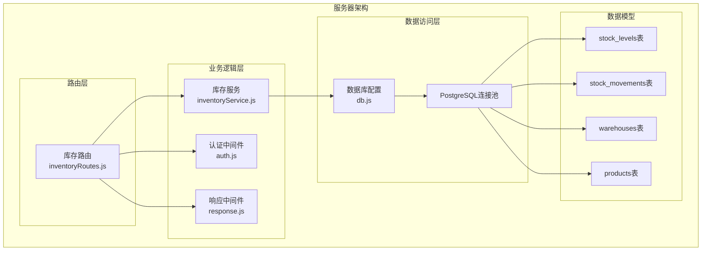
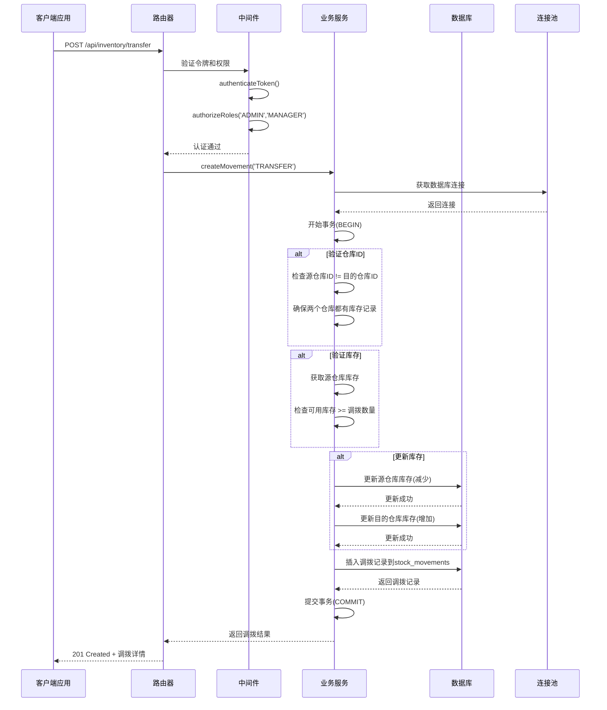
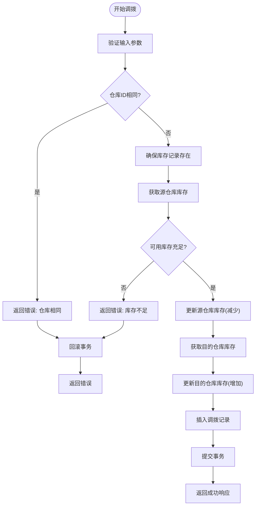
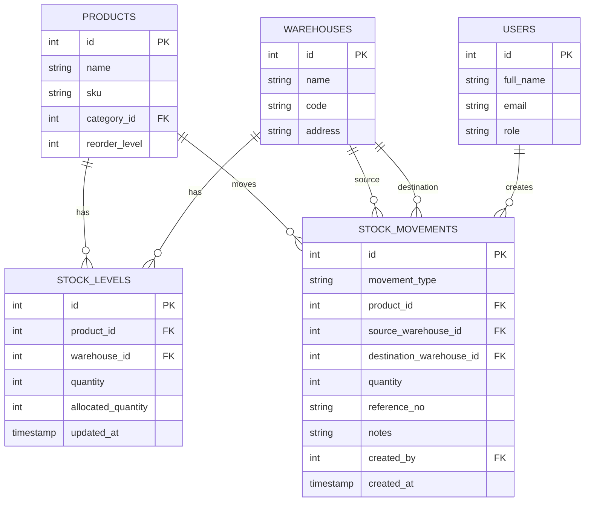
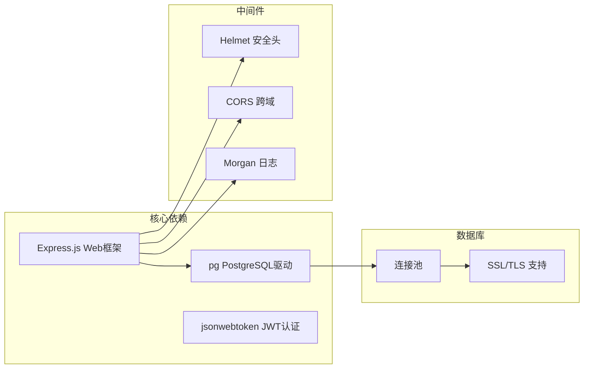
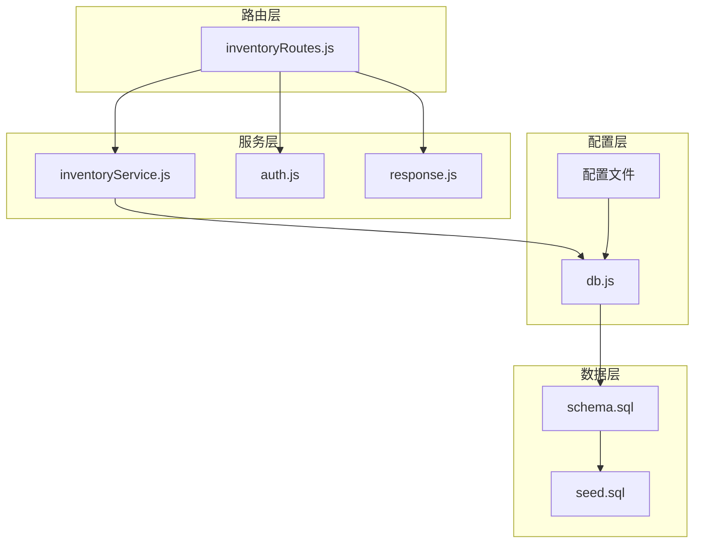

# 库存调拨API

<cite>
**本文档引用的文件**
- [inventoryRoutes.js](file://server/src/routes/inventoryRoutes.js)
- [inventoryService.js](file://server/src/utils/inventoryService.js)
- [db.js](file://server/src/config/db.js)
- [schema.sql](file://server/database/schema.sql)
- [seed.sql](file://server/database/seed.sql)
- [app.js](file://server/src/app.js)
- [response.js](file://server/src/middleware/response.js)
- [inventory_system_backend.postman_collection.json](file://postman/inventory_system_backend.postman_collection.json)
</cite>

## 目录
1. [简介](#简介)
2. [项目结构](#项目结构)
3. [核心组件](#核心组件)
4. [架构概览](#架构概览)
5. [详细组件分析](#详细组件分析)
6. [依赖关系分析](#依赖关系分析)
7. [性能考虑](#性能考虑)
8. [故障排除指南](#故障排除指南)
9. [结论](#结论)

## 简介

本文档详细说明了库存调拨API的跨仓库库存转移流程。该API允许在不同的仓库之间进行产品库存的物理转移，确保库存数据的准确性和一致性。系统采用严格的事务保证和双重库存更新机制，确保调拨过程中的数据完整性。

## 项目结构

库存调拨功能位于后端服务器的库存管理模块中，采用模块化设计，清晰分离了路由处理、业务逻辑和服务层。



**图表来源**
- [inventoryRoutes.js:1-493](file://server/src/routes/inventoryRoutes.js#L1-L493)
- [inventoryService.js:1-45](file://server/src/utils/inventoryService.js#L1-L45)
- [db.js:1-25](file://server/src/config/db.js#L1-L25)

**章节来源**
- [inventoryRoutes.js:1-493](file://server/src/routes/inventoryRoutes.js#L1-L493)
- [app.js:1-67](file://server/src/app.js#L1-L67)

## 核心组件

### 调拨API端点

POST `/api/inventory/transfer` 是专门用于跨仓库库存转移的API端点。该端点要求调拨管理员和仓库经理角色才能访问。

### 必需参数

调拨操作需要以下必需参数：

| 参数名称 | 类型 | 必需 | 描述 |
|---------|------|------|------|
| productId | integer | 是 | 产品的唯一标识符 |
| sourceWarehouseId | integer | 是 | 源仓库的唯一标识符 |
| destinationWarehouseId | integer | 是 | 目的仓库的唯一标识符 |
| quantity | integer | 是 | 调拨的数量（必须为正数） |

### 可选参数

| 参数名称 | 类型 | 默认值 | 描述 |
|---------|------|--------|------|
| referenceNo | string | null | 调拨单号或参考编号 |
| notes | string | null | 调拨备注信息 |

**章节来源**
- [inventoryRoutes.js:413-415](file://server/src/routes/inventoryRoutes.js#L413-L415)
- [inventoryRoutes.js:334-336](file://server/src/routes/inventoryRoutes.js#L334-L336)

## 架构概览

库存调拨系统采用三层架构设计，确保了良好的可维护性和扩展性。



**图表来源**
- [inventoryRoutes.js:229-403](file://server/src/routes/inventoryRoutes.js#L229-L403)
- [db.js:15-24](file://server/src/config/db.js#L15-L24)

## 详细组件分析

### 调拨流程实现

调拨操作的核心逻辑集中在 `createMovement` 函数中，该函数处理所有类型的库存移动操作，包括调拨。

#### 调拨前置检查

系统执行严格的数据验证和前置检查：

1. **仓库ID验证**：确保源仓库ID和目的仓库ID不相同
2. **库存验证**：检查源仓库的可用库存是否足够
3. **库存记录确保**：自动为两个仓库创建库存记录（如果不存在）

#### 双重库存更新机制

调拨操作采用双重库存更新机制，确保数据一致性：



**图表来源**
- [inventoryRoutes.js:338-396](file://server/src/routes/inventoryRoutes.js#L338-L396)

#### 事务保证机制

系统使用PostgreSQL的事务机制确保调拨操作的原子性：

- **BEGIN**：开始数据库事务
- **COMMIT**：成功完成所有操作后提交事务
- **ROLLBACK**：任何步骤失败时回滚所有更改

#### 库存验证逻辑

库存验证采用"可用库存"概念，即实际可使用的库存数量：

```
可用库存 = 实际库存 - 已分配库存
```

这种设计避免了已预订订单占用库存的问题。

**章节来源**
- [inventoryRoutes.js:338-396](file://server/src/routes/inventoryRoutes.js#L338-L396)
- [inventoryService.js:13-27](file://server/src/utils/inventoryService.js#L13-L27)

### 数据模型关系

库存调拨涉及多个核心数据表之间的复杂关系：



**图表来源**
- [schema.sql:125-133](file://server/database/schema.sql#L125-L133)
- [schema.sql:237-248](file://server/database/schema.sql#L237-L248)

**章节来源**
- [schema.sql:125-133](file://server/database/schema.sql#L125-L133)
- [schema.sql:237-248](file://server/database/schema.sql#L237-L248)

### 库存服务工具

库存服务提供了三个核心函数来支持库存操作：

#### ensureStockRow
确保指定产品和仓库的库存记录存在，如果不存在则自动创建。

#### getStockQuantity  
获取指定产品在特定仓库的库存信息，包括实际库存和已分配库存。

#### updateStock
原子性地更新库存数量，同时更新更新时间戳。

**章节来源**
- [inventoryService.js:1-45](file://server/src/utils/inventoryService.js#L1-L45)

## 依赖关系分析

### 外部依赖

系统依赖以下关键外部组件：



**图表来源**
- [app.js:28-34](file://server/src/app.js#L28-L34)
- [db.js:15-19](file://server/src/config/db.js#L15-L19)

### 内部依赖关系



**图表来源**
- [inventoryRoutes.js:1-8](file://server/src/routes/inventoryRoutes.js#L1-L8)
- [db.js:1-25](file://server/src/config/db.js#L1-L25)

**章节来源**
- [app.js:1-67](file://server/src/app.js#L1-L67)
- [db.js:1-25](file://server/src/config/db.js#L1-L25)

## 性能考虑

### 查询优化

系统采用了多种查询优化策略：

1. **索引优化**：为关键查询字段建立索引
2. **批量查询**：使用Promise.all并行执行多个查询
3. **分页支持**：大型库存列表的分页查询

### 连接池管理

- **连接超时**：默认5秒连接超时
- **SSL支持**：根据环境自动启用SSL连接
- **连接复用**：使用连接池避免频繁创建连接

### 缓存策略

虽然当前版本没有实现缓存，但系统设计支持未来添加缓存层来提高性能。

## 故障排除指南

### 常见错误及解决方案

#### 1. 认证失败
**症状**：返回401未授权
**原因**：缺少有效的认证令牌或令牌过期
**解决方案**：重新登录获取新令牌

#### 2. 权限不足
**症状**：返回403禁止访问
**原因**：用户角色不是ADMIN或MANAGER
**解决方案**：使用具有适当权限的账户

#### 3. 仓库相同错误
**症状**：返回"Source and destination warehouses must be different"
**原因**：源仓库ID等于目的仓库ID
**解决方案**：使用不同的源仓库和目的仓库

#### 4. 库存不足
**症状**：返回"Not enough stock for transfer"
**原因**：源仓库可用库存少于调拨数量
**解决方案**：检查源仓库库存或减少调拨数量

#### 5. 数据库连接问题
**症状**：返回数据库连接错误
**原因**：数据库不可达或连接池耗尽
**解决方案**：检查数据库状态和连接配置

### 调试建议

1. **启用详细日志**：使用Morgan中间件查看请求日志
2. **检查事务状态**：确认事务是否正确提交或回滚
3. **验证数据完整性**：检查stock_levels和stock_movements表的一致性

**章节来源**
- [inventoryRoutes.js:397-402](file://server/src/routes/inventoryRoutes.js#L397-L402)
- [response.js:14-27](file://server/src/middleware/response.js#L14-L27)

## 结论

库存调拨API提供了完整、可靠的跨仓库库存转移解决方案。通过严格的参数验证、事务保证和双重库存更新机制，确保了数据的准确性和一致性。系统的模块化设计便于维护和扩展，为未来的功能增强奠定了良好基础。

主要优势包括：
- **数据完整性**：事务保证确保操作的原子性
- **安全性**：基于角色的访问控制
- **可扩展性**：模块化架构支持功能扩展
- **可观测性**：完整的审计日志和错误处理