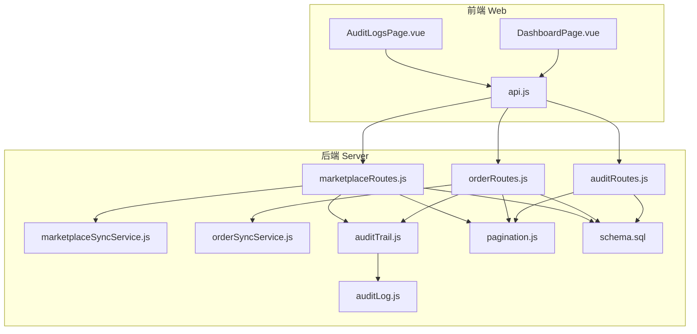
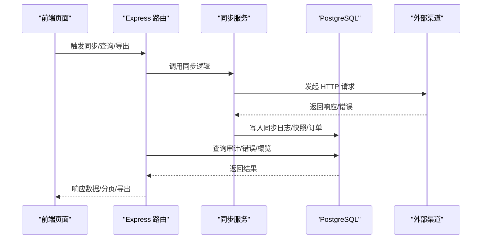
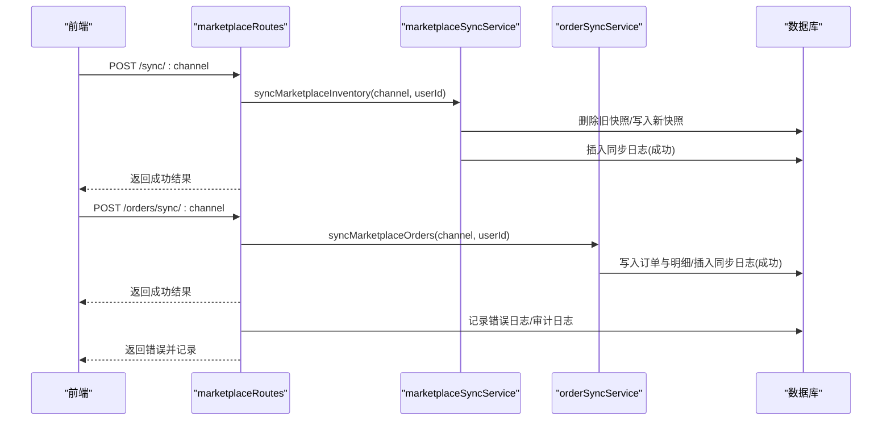
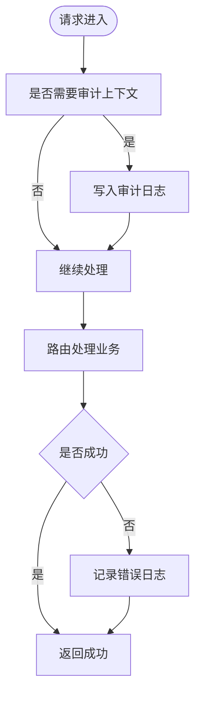
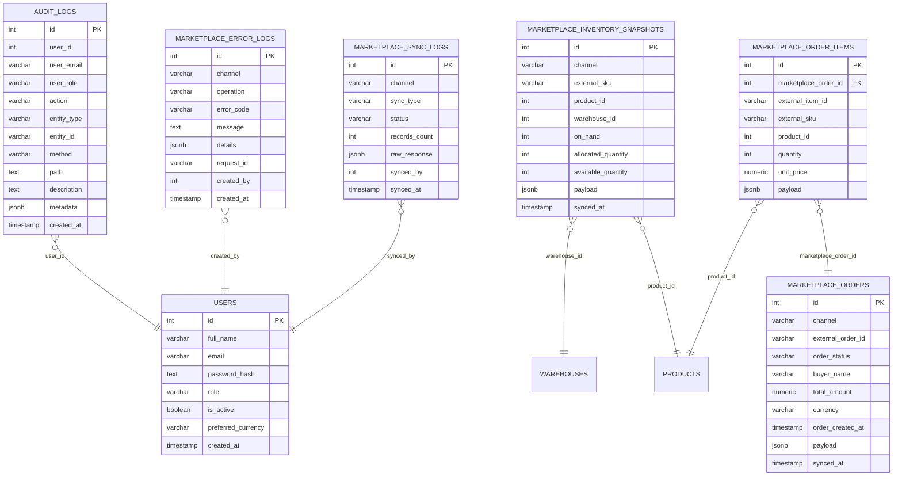
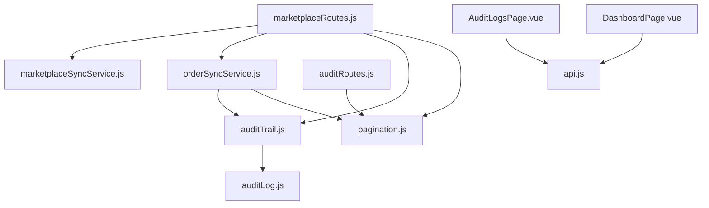

# 同步监控与日志

<cite>
**本文引用的文件**
- [server/src/routes/marketplaceRoutes.js](file://server/src/routes/marketplaceRoutes.js)
- [server/src/services/marketplaceSyncService.js](file://server/src/services/marketplaceSyncService.js)
- [server/src/services/orderSyncService.js](file://server/src/services/orderSyncService.js)
- [server/src/utils/auditLog.js](file://server/src/utils/auditLog.js)
- [server/src/middleware/auditTrail.js](file://server/src/middleware/auditTrail.js)
- [server/src/routes/auditRoutes.js](file://server/src/routes/auditRoutes.js)
- [server/src/utils/pagination.js](file://server/src/utils/pagination.js)
- [server/database/schema.sql](file://server/database/schema.sql)
- [web/src/pages/AuditLogsPage.vue](file://web/src/pages/AuditLogsPage.vue)
- [web/src/pages/DashboardPage.vue](file://web/src/pages/DashboardPage.vue)
- [web/src/services/api.js](file://web/src/services/api.js)
</cite>

## 目录
1. [简介](#简介)
2. [项目结构](#项目结构)
3. [核心组件](#核心组件)
4. [架构总览](#架构总览)
5. [详细组件分析](#详细组件分析)
6. [依赖关系分析](#依赖关系分析)
7. [性能考量](#性能考量)
8. [故障排查指南](#故障排查指南)
9. [结论](#结论)
10. [附录](#附录)

## 简介
本文件面向电商同步监控与日志系统，聚焦于以下目标：
- 同步状态监控：库存与订单同步状态、连接健康检查、概览视图
- 错误日志记录：同步失败、OAuth 回调异常、连接测试失败等错误归档
- 性能监控接口：分页查询、过滤、导出能力，支撑报表与审计
- 日志查询与分析：审计日志、错误日志、同步历史记录的检索与统计
- 监控仪表板：概览卡片、趋势图、低库存提醒与图表可视化
- 告警机制与故障诊断：基于错误计数与状态的告警建议与排障流程

## 项目结构
后端采用 Express + PostgreSQL 架构，核心模块包括：
- 路由层：市场渠道同步、订单同步、审计日志、仪表板、告警等路由
- 服务层：市场渠道同步服务、订单同步服务
- 工具与中间件：审计日志写入、审计轨迹中间件、分页工具
- 数据库：统一的表结构与索引，涵盖同步日志、错误日志、快照、审计日志等

**图表来源**
- [server/src/routes/marketplaceRoutes.js:1-641](file://server/src/routes/marketplaceRoutes.js#L1-L641)
- [server/src/routes/orderRoutes.js:1-113](file://server/src/routes/orderRoutes.js#L1-L113)
- [server/src/routes/auditRoutes.js:1-110](file://server/src/routes/auditRoutes.js#L1-L110)
- [server/src/services/marketplaceSyncService.js:1-146](file://server/src/services/marketplaceSyncService.js#L1-L146)
- [server/src/services/orderSyncService.js:1-119](file://server/src/services/orderSyncService.js#L1-L119)
- [server/src/middleware/auditTrail.js:1-84](file://server/src/middleware/auditTrail.js#L1-L84)
- [server/src/utils/auditLog.js:1-38](file://server/src/utils/auditLog.js#L1-L38)
- [server/src/utils/pagination.js:1-28](file://server/src/utils/pagination.js#L1-L28)
- [server/database/schema.sql:137-288](file://server/database/schema.sql#L137-L288)
- [web/src/pages/AuditLogsPage.vue:1-457](file://web/src/pages/AuditLogsPage.vue#L1-L457)
- [web/src/pages/DashboardPage.vue:1-800](file://web/src/pages/DashboardPage.vue#L1-L800)
- [web/src/services/api.js:1-45](file://web/src/services/api.js#L1-L45)

**章节来源**
- [server/src/routes/marketplaceRoutes.js:1-641](file://server/src/routes/marketplaceRoutes.js#L1-L641)
- [server/src/routes/orderRoutes.js:1-113](file://server/src/routes/orderRoutes.js#L1-L113)
- [server/src/routes/auditRoutes.js:1-110](file://server/src/routes/auditRoutes.js#L1-L110)
- [server/src/services/marketplaceSyncService.js:1-146](file://server/src/services/marketplaceSyncService.js#L1-L146)
- [server/src/services/orderSyncService.js:1-119](file://server/src/services/orderSyncService.js#L1-L119)
- [server/src/middleware/auditTrail.js:1-84](file://server/src/middleware/auditTrail.js#L1-L84)
- [server/src/utils/auditLog.js:1-38](file://server/src/utils/auditLog.js#L1-L38)
- [server/src/utils/pagination.js:1-28](file://server/src/utils/pagination.js#L1-L28)
- [server/database/schema.sql:137-288](file://server/database/schema.sql#L137-L288)
- [web/src/pages/AuditLogsPage.vue:1-457](file://web/src/pages/AuditLogsPage.vue#L1-L457)
- [web/src/pages/DashboardPage.vue:1-800](file://web/src/pages/DashboardPage.vue#L1-L800)
- [web/src/services/api.js:1-45](file://web/src/services/api.js#L1-L45)

## 核心组件
- 同步路由与服务
  - 市场渠道同步：库存与订单同步、OAuth 流程、连接测试、概览聚合
  - 订单同步：从渠道拉取订单并落库，维护订单与明细
- 审计与错误日志
  - 审计轨迹中间件：自动记录成功变更操作
  - 审计日志路由：支持搜索、筛选、分页、导出
  - 错误日志：统一记录同步失败、OAuth 异常、连接测试失败等
- 可视化与报表
  - 仪表板：卡片、趋势图、低库存预览、最近流水
  - 审计日志页面：筛选、预设、展开查看元数据、导出 CSV/JSON/PDF

**章节来源**
- [server/src/routes/marketplaceRoutes.js:144-641](file://server/src/routes/marketplaceRoutes.js#L144-L641)
- [server/src/services/marketplaceSyncService.js:100-146](file://server/src/services/marketplaceSyncService.js#L100-L146)
- [server/src/services/orderSyncService.js:19-119](file://server/src/services/orderSyncService.js#L19-L119)
- [server/src/middleware/auditTrail.js:14-84](file://server/src/middleware/auditTrail.js#L14-L84)
- [server/src/routes/auditRoutes.js:15-110](file://server/src/routes/auditRoutes.js#L15-L110)
- [server/database/schema.sql:137-288](file://server/database/schema.sql#L137-L288)
- [web/src/pages/AuditLogsPage.vue:54-155](file://web/src/pages/AuditLogsPage.vue#L54-L155)
- [web/src/pages/DashboardPage.vue:310-434](file://web/src/pages/DashboardPage.vue#L310-L434)

## 架构总览
系统通过路由层协调业务流程，服务层负责与外部渠道交互与数据落库，审计中间件与工具保障可追溯性，数据库提供结构化存储与索引优化。

**图表来源**
- [server/src/routes/marketplaceRoutes.js:144-202](file://server/src/routes/marketplaceRoutes.js#L144-L202)
- [server/src/services/marketplaceSyncService.js:100-146](file://server/src/services/marketplaceSyncService.js#L100-L146)
- [server/src/services/orderSyncService.js:19-119](file://server/src/services/orderSyncService.js#L19-L119)
- [server/database/schema.sql:137-208](file://server/database/schema.sql#L137-L208)

## 详细组件分析

### 市场渠道同步与监控
- 支持渠道：Shopee、Lazada、TikTok
- 关键能力
  - 连接管理：增删改查、激活状态、元数据存储
  - 同步执行：库存与订单同步，记录成功/失败日志
  - OAuth 流程：生成 state、回调校验、令牌交换
  - 连接测试：调用渠道健康接口验证连通性
  - 概览聚合：连接状态、最后同步时间、失败次数、订单/发货统计、7 天错误计数
  - 快照查询：按渠道筛选的库存快照列表
  - 同步日志：最近同步记录（含用户信息）
  - 错误日志：分页查询、按渠道过滤、带分页构建

**图表来源**
- [server/src/routes/marketplaceRoutes.js:144-202](file://server/src/routes/marketplaceRoutes.js#L144-L202)
- [server/src/services/marketplaceSyncService.js:100-146](file://server/src/services/marketplaceSyncService.js#L100-L146)
- [server/src/services/orderSyncService.js:19-119](file://server/src/services/orderSyncService.js#L19-L119)

**章节来源**
- [server/src/routes/marketplaceRoutes.js:47-554](file://server/src/routes/marketplaceRoutes.js#L47-L554)
- [server/src/services/marketplaceSyncService.js:18-146](file://server/src/services/marketplaceSyncService.js#L18-L146)
- [server/src/services/orderSyncService.js:19-119](file://server/src/services/orderSyncService.js#L19-L119)

### 审计日志与错误日志
- 审计日志
  - 自动记录：登录、资源变更等关键动作
  - 手动扩展：路由中可设置审计上下文
  - 查询能力：支持搜索、按动作/实体类型/日期范围筛选、分页
  - 导出能力：支持导出全部数据为 CSV/JSON/PDF
- 错误日志
  - 统一字段：渠道、操作、错误码、消息、详情、请求 ID、创建人
  - 查询能力：按渠道过滤、分页、构建分页结构

**图表来源**
- [server/src/middleware/auditTrail.js:14-84](file://server/src/middleware/auditTrail.js#L14-L84)
- [server/src/utils/auditLog.js:1-38](file://server/src/utils/auditLog.js#L1-L38)
- [server/src/routes/auditRoutes.js:15-110](file://server/src/routes/auditRoutes.js#L15-L110)
- [server/database/schema.sql:275-288](file://server/database/schema.sql#L275-L288)

**章节来源**
- [server/src/middleware/auditTrail.js:14-84](file://server/src/middleware/auditTrail.js#L14-L84)
- [server/src/utils/auditLog.js:1-38](file://server/src/utils/auditLog.js#L1-L38)
- [server/src/routes/auditRoutes.js:15-110](file://server/src/routes/auditRoutes.js#L15-L110)
- [web/src/pages/AuditLogsPage.vue:54-155](file://web/src/pages/AuditLogsPage.vue#L54-L155)

### 仪表板与可视化
- 卡片数据：商品数、仓库数、低库存数、总在手数
- 图表：月度流水趋势、按分类/仓库的库存分布
- 最近流水与低库存预览
- 用户管理（管理员/经理）：用户列表、搜索、创建/编辑/删除

**图表来源**
- [web/src/pages/DashboardPage.vue:310-434](file://web/src/pages/DashboardPage.vue#L310-L434)
- [web/src/services/api.js:1-45](file://web/src/services/api.js#L1-L45)
- [server/src/routes/dashboardRoutes.js:9-123](file://server/src/routes/dashboardRoutes.js#L9-L123)
- [server/database/schema.sql:26-136](file://server/database/schema.sql#L26-L136)

**章节来源**
- [web/src/pages/DashboardPage.vue:310-434](file://web/src/pages/DashboardPage.vue#L310-L434)
- [server/src/routes/dashboardRoutes.js:9-123](file://server/src/routes/dashboardRoutes.js#L9-L123)

### 数据模型与索引
- 同步日志表：记录每次同步的渠道、类型、状态、条数、原始响应、执行人与时间
- 快照表：按渠道存储库存快照，关联产品与仓库
- 错误日志表：记录同步/回调/测试失败的错误信息
- 审计日志表：记录用户行为与元数据
- 订单与明细：渠道订单与子项，支持去重与更新

**图表来源**
- [server/database/schema.sql:137-235](file://server/database/schema.sql#L137-L235)

**章节来源**
- [server/database/schema.sql:137-235](file://server/database/schema.sql#L137-L235)

## 依赖关系分析
- 路由依赖服务：同步路由依赖同步服务进行外部调用与入库
- 审计依赖工具：审计中间件依赖审计工具写入审计日志
- 查询依赖分页：审计/错误/概览均使用统一分页工具
- 前后端通信：前端通过封装的 API 客户端统一注入认证头与响应处理

**图表来源**
- [server/src/routes/marketplaceRoutes.js:1-14](file://server/src/routes/marketplaceRoutes.js#L1-L14)
- [server/src/services/marketplaceSyncService.js:1-2](file://server/src/services/marketplaceSyncService.js#L1-L2)
- [server/src/services/orderSyncService.js:1-2](file://server/src/services/orderSyncService.js#L1-L2)
- [server/src/middleware/auditTrail.js:1-3](file://server/src/middleware/auditTrail.js#L1-L3)
- [server/src/utils/auditLog.js:1-3](file://server/src/utils/auditLog.js#L1-L3)
- [server/src/utils/pagination.js:1-28](file://server/src/utils/pagination.js#L1-L28)
- [server/src/routes/auditRoutes.js:1-6](file://server/src/routes/auditRoutes.js#L1-L6)
- [web/src/pages/AuditLogsPage.vue:1-10](file://web/src/pages/AuditLogsPage.vue#L1-L10)
- [web/src/pages/DashboardPage.vue:1-24](file://web/src/pages/DashboardPage.vue#L1-L24)
- [web/src/services/api.js:1-24](file://web/src/services/api.js#L1-L24)

**章节来源**
- [server/src/routes/marketplaceRoutes.js:1-14](file://server/src/routes/marketplaceRoutes.js#L1-L14)
- [server/src/services/marketplaceSyncService.js:1-2](file://server/src/services/marketplaceSyncService.js#L1-L2)
- [server/src/services/orderSyncService.js:1-2](file://server/src/services/orderSyncService.js#L1-L2)
- [server/src/middleware/auditTrail.js:1-3](file://server/src/middleware/auditTrail.js#L1-L3)
- [server/src/utils/auditLog.js:1-3](file://server/src/utils/auditLog.js#L1-L3)
- [server/src/utils/pagination.js:1-28](file://server/src/utils/pagination.js#L1-L28)
- [server/src/routes/auditRoutes.js:1-6](file://server/src/routes/auditRoutes.js#L1-L6)
- [web/src/pages/AuditLogsPage.vue:1-10](file://web/src/pages/AuditLogsPage.vue#L1-L10)
- [web/src/pages/DashboardPage.vue:1-24](file://web/src/pages/DashboardPage.vue#L1-L24)
- [web/src/services/api.js:1-24](file://web/src/services/api.js#L1-L24)

## 性能考量
- 分页与索引
  - 使用统一分页工具限制每页最大条数，避免一次性返回大量数据
  - 数据库为关键表建立索引（如错误日志按渠道与创建时间、审计日志按创建时间等），提升查询性能
- 并发与限流
  - 同步路由内置速率限制器，防止突发请求导致外部渠道或自身系统过载
- I/O 优化
  - 批量写入：库存快照与订单明细采用批量插入策略
  - 原始响应 JSON 存储，便于后续分析但需注意字段大小控制

[本节为通用指导，无需特定文件引用]

## 故障排查指南
- 同步失败
  - 查看同步日志：确认渠道、类型、状态、记录数与原始响应
  - 查看错误日志：定位具体错误码与详情，结合请求 ID 追踪
  - 连接测试：调用连接测试接口验证渠道端点与令牌有效性
- OAuth 回调异常
  - 校验 state 是否存在且未过期
  - 校验回调返回的错误参数并记录到错误日志
- 审计与溯源
  - 使用审计日志页面按动作/实体类型/日期范围筛选，展开查看元数据
  - 对异常操作进行回溯与责任定位
- 导出与分析
  - 审计日志支持导出 CSV/JSON/PDF，便于离线分析与合规审计

**章节来源**
- [server/src/routes/marketplaceRoutes.js:377-435](file://server/src/routes/marketplaceRoutes.js#L377-L435)
- [server/src/routes/marketplaceRoutes.js:271-375](file://server/src/routes/marketplaceRoutes.js#L271-L375)
- [server/src/routes/auditRoutes.js:15-110](file://server/src/routes/auditRoutes.js#L15-L110)
- [web/src/pages/AuditLogsPage.vue:106-155](file://web/src/pages/AuditLogsPage.vue#L106-L155)

## 结论
该系统通过“路由-服务-审计-数据库”的清晰分层，实现了电商同步的可观测性与可追溯性。统一的分页与导出能力为运营与审计提供了便利；概览与图表帮助快速掌握整体状态；错误日志与审计日志共同构成完整的故障诊断与合规基线。

[本节为总结性内容，无需特定文件引用]

## 附录

### 监控指标与告警建议
- 指标
  - 同步成功率/失败率（按渠道与类型）
  - 最后同步时间（延迟告警）
  - 7 天错误计数（异常激增告警）
  - 订单/发货同步条数（波动告警）
- 告警
  - 失败率超阈值、延迟超阈值、错误计数突增
  - 建议结合外部监控平台（如 Prometheus/Grafana 或云监控）采集上述指标并配置告警规则

[本节为通用指导，无需特定文件引用]

### 日志过滤、分页与导出
- 过滤
  - 审计日志：支持搜索关键词、动作、实体类型、日期范围
  - 错误日志：支持按渠道过滤
- 分页
  - 统一分页参数与分页结构，前端表格直接复用
- 导出
  - 审计日志支持导出全部数据为 CSV/JSON/PDF

**章节来源**
- [server/src/routes/auditRoutes.js:15-110](file://server/src/routes/auditRoutes.js#L15-L110)
- [server/src/utils/pagination.js:1-28](file://server/src/utils/pagination.js#L1-L28)
- [web/src/pages/AuditLogsPage.vue:106-155](file://web/src/pages/AuditLogsPage.vue#L106-L155)