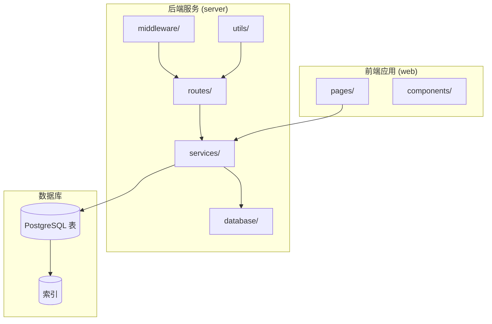
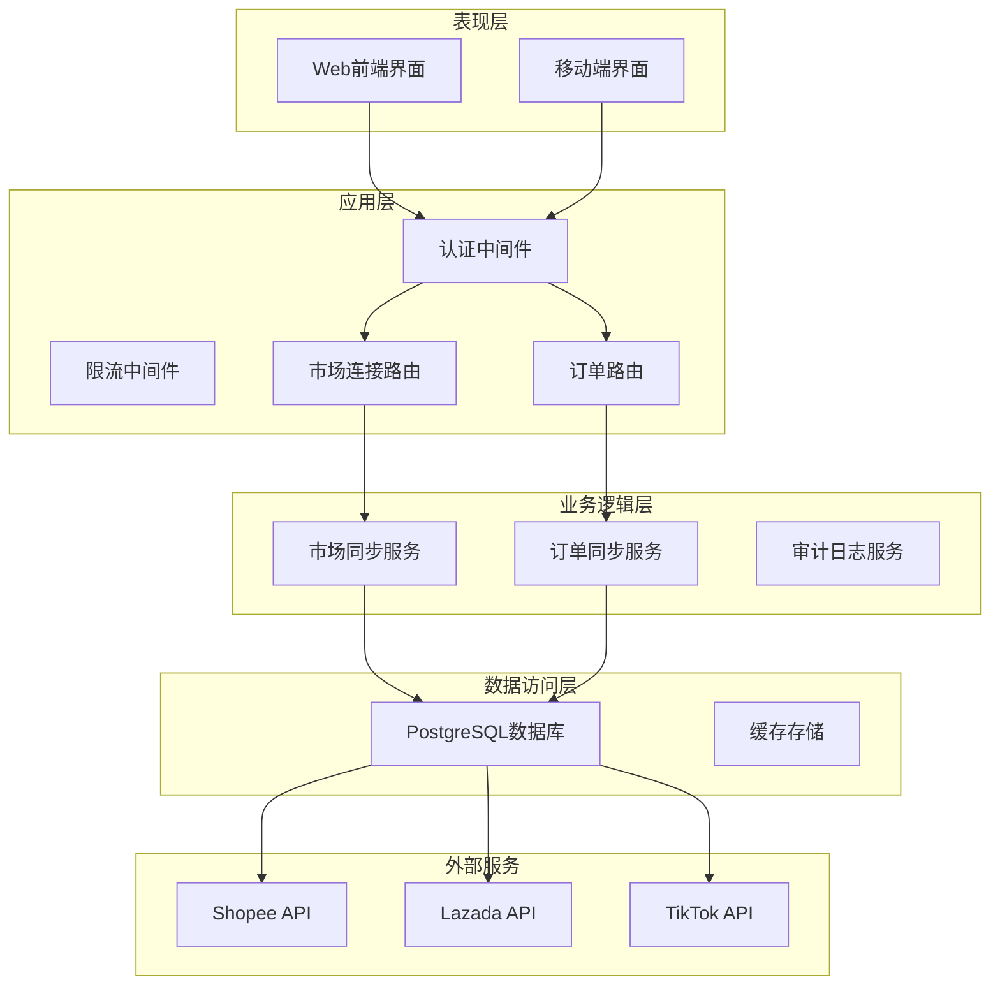
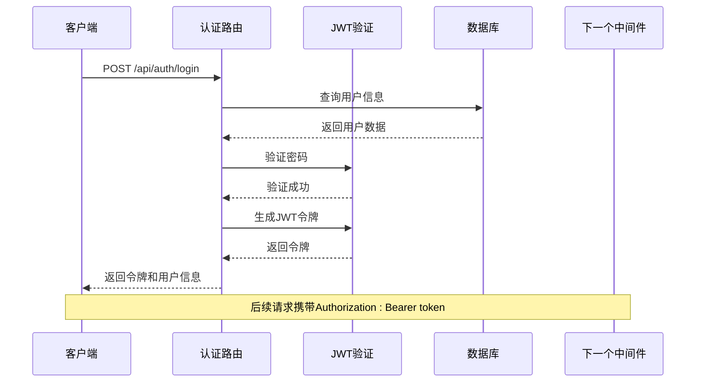
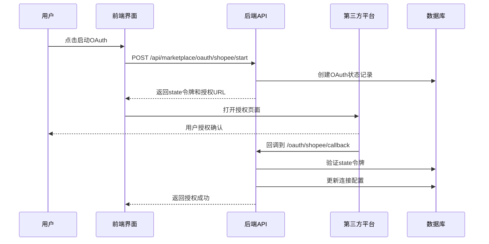
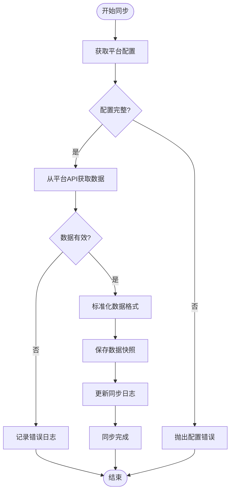
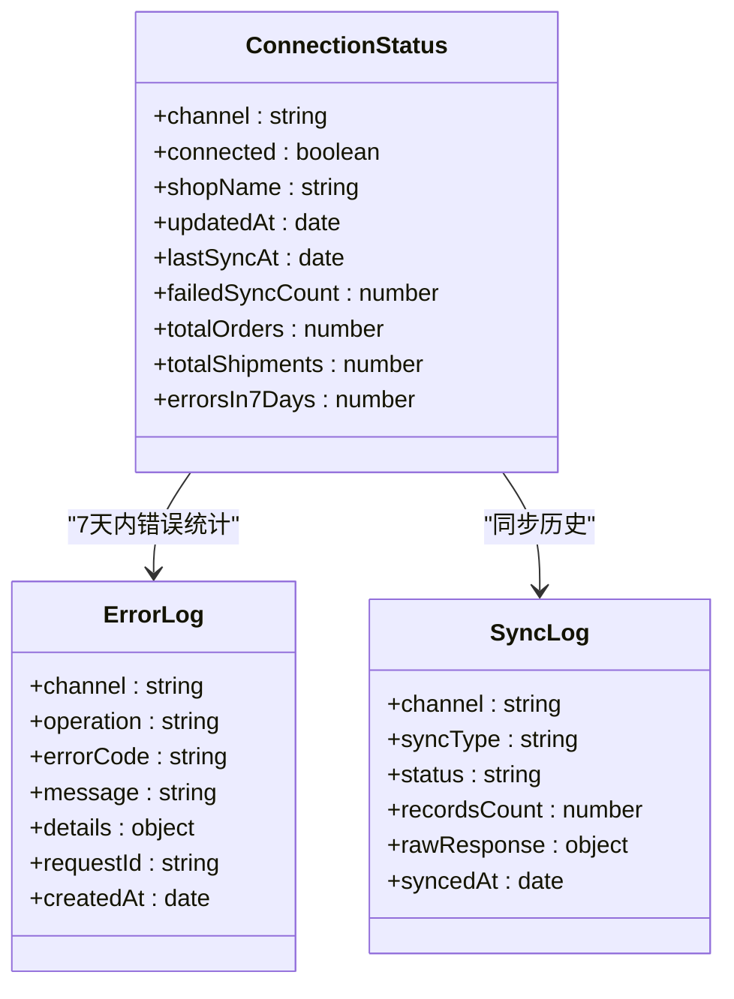
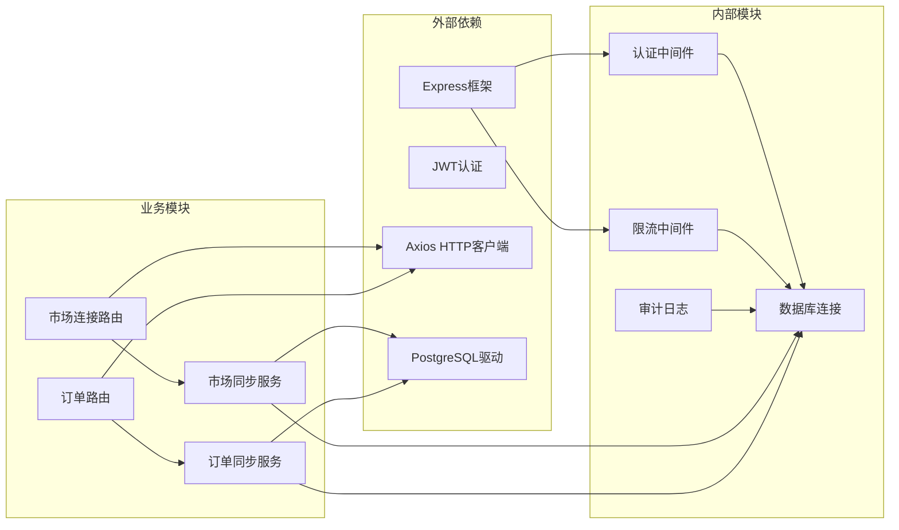
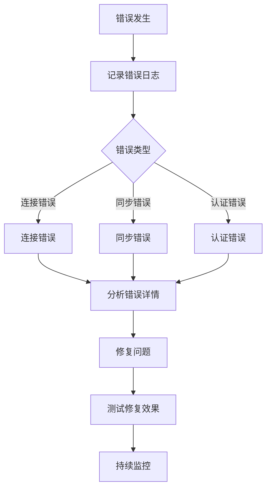

# 平台连接管理

<cite>
**本文档引用的文件**
- [marketplaceRoutes.js](file://server/src/routes/marketplaceRoutes.js)
- [marketplaceSyncService.js](file://server/src/services/marketplaceSyncService.js)
- [orderSyncService.js](file://server/src/services/orderSyncService.js)
- [auth.js](file://server/src/middleware/auth.js)
- [authRoutes.js](file://server/src/routes/authRoutes.js)
- [rateLimit.js](file://server/src/middleware/rateLimit.js)
- [auditLog.js](file://server/src/utils/auditLog.js)
- [schema.sql](file://server/database/schema.sql)
- [MarketplaceCenterPage.vue](file://web/src/pages/MarketplaceCenterPage.vue)
- [api.js](file://web/src/services/api.js)
</cite>

## 目录
1. [简介](#简介)
2. [项目结构](#项目结构)
3. [核心组件](#核心组件)
4. [架构概览](#架构概览)
5. [详细组件分析](#详细组件分析)
6. [依赖关系分析](#依赖关系分析)
7. [性能考虑](#性能考虑)
8. [故障排除指南](#故障排除指南)
9. [结论](#结论)

## 简介

平台连接管理是电商库存管理系统的核心功能模块，负责管理与各大电商平台（Shopee、Lazada、TikTok）的连接配置、认证授权、数据同步和状态监控。该系统提供了完整的API接口，支持连接的创建、更新、测试和状态监控，确保与各电商平台的数据实时同步。

系统采用前后端分离架构，后端使用Node.js + Express提供RESTful API服务，前端使用Vue.js构建用户界面，通过OAuth 2.0协议实现安全的第三方平台授权。

## 项目结构

平台连接管理模块主要分布在以下目录结构中：

**图表来源**
- [marketplaceRoutes.js:1-641](file://server/src/routes/marketplaceRoutes.js#L1-L641)
- [schema.sql:161-194](file://server/database/schema.sql#L161-L194)

**章节来源**
- [marketplaceRoutes.js:1-641](file://server/src/routes/marketplaceRoutes.js#L1-L641)
- [schema.sql:1-447](file://server/database/schema.sql#L1-L447)

## 核心组件

平台连接管理模块包含以下核心组件：

### 1. 连接管理路由层
- **连接配置接口**：支持创建、更新和查询电商平台连接
- **同步接口**：提供库存和订单数据同步功能
- **OAuth授权接口**：实现第三方平台的OAuth 2.0授权流程
- **状态监控接口**：提供连接状态检查和错误日志查询

### 2. 业务服务层
- **市场同步服务**：处理与电商平台的数据同步逻辑
- **订单同步服务**：专门处理订单数据的同步和存储
- **配置管理服务**：管理各平台的连接配置和环境变量

### 3. 数据持久化层
- **连接配置表**：存储各电商平台的连接信息
- **同步日志表**：记录所有同步操作的状态和结果
- **错误日志表**：追踪和记录同步过程中的错误信息
- **快照表**：存储同步后的数据快照用于审计

**章节来源**
- [marketplaceRoutes.js:47-641](file://server/src/routes/marketplaceRoutes.js#L47-L641)
- [marketplaceSyncService.js:1-146](file://server/src/services/marketplaceSyncService.js#L1-L146)
- [orderSyncService.js:1-118](file://server/src/services/orderSyncService.js#L1-L118)

## 架构概览

平台连接管理采用分层架构设计，确保职责分离和代码可维护性：

**图表来源**
- [marketplaceRoutes.js:1-641](file://server/src/routes/marketplaceRoutes.js#L1-L641)
- [auth.js:1-46](file://server/src/middleware/auth.js#L1-L46)
- [rateLimit.js:1-40](file://server/src/middleware/rateLimit.js#L1-L40)

## 详细组件分析

### 认证与授权系统

系统采用JWT（JSON Web Token）进行用户认证，结合基于角色的访问控制（RBAC）实现精细化权限管理。

**图表来源**
- [authRoutes.js:17-64](file://server/src/routes/authRoutes.js#L17-L64)
- [auth.js:5-29](file://server/src/middleware/auth.js#L5-L29)

#### 角色权限控制
系统支持三种用户角色：
- **ADMIN**：管理员，拥有最高权限
- **MANAGER**：经理，可以管理连接和查看状态
- **STAFF**：员工，只能查看订单等基础功能

**章节来源**
- [auth.js:32-40](file://server/src/middleware/auth.js#L32-L40)
- [authRoutes.js:17-64](file://server/src/routes/authRoutes.js#L17-L64)

### 连接配置管理

#### 支持的电商平台
系统目前支持以下三个主要电商平台：
- **Shopee**：东南亚最大的电商平台
- **Lazada**：东南亚地区领先的电商平台  
- **TikTok Shop**：字节跳动旗下的短视频电商平台

#### 连接配置参数
每个电商平台的连接配置包含以下关键参数：

| 参数名称 | 类型 | 必需 | 描述 |
|---------|------|------|------|
| channel | string | 是 | 平台标识符（shopee/lazada/tiktok） |
| shopName | string | 否 | 店铺名称 |
| apiBaseUrl | string | 是 | API基础URL |
| accessToken | string | 是 | 访问令牌 |
| refreshToken | string | 否 | 刷新令牌 |
| isActive | boolean | 是 | 是否启用连接 |
| metadata | object | 否 | 元数据配置 |

**章节来源**
- [marketplaceRoutes.js:72-142](file://server/src/routes/marketplaceRoutes.js#L72-L142)
- [schema.sql:161-172](file://server/database/schema.sql#L161-L172)

### OAuth 2.0 授权流程

系统实现了完整的OAuth 2.0授权流程，支持与各电商平台的安全授权：

**图表来源**
- [marketplaceRoutes.js:204-375](file://server/src/routes/marketplaceRoutes.js#L204-L375)

#### OAuth状态管理
系统使用临时状态令牌确保授权流程的安全性：

1. **状态令牌生成**：每次授权开始时生成唯一UUID
2. **过期时间控制**：状态令牌有效期10分钟
3. **一次性使用**：授权完成后立即删除状态记录
4. **防重放攻击**：验证state令牌的有效性和时效性

**章节来源**
- [marketplaceRoutes.js:204-375](file://server/src/routes/marketplaceRoutes.js#L204-L375)

### 数据同步服务

#### 库存同步流程
系统提供定时和手动两种库存同步方式：

**图表来源**
- [marketplaceSyncService.js:100-140](file://server/src/services/marketplaceSyncService.js#L100-L140)

#### 订单同步流程
订单同步采用增量更新策略，确保数据的实时性和准确性：

1. **数据获取**：从平台API获取最新的订单数据
2. **数据标准化**：统一不同平台的订单字段格式
3. **去重处理**：使用外部订单ID进行去重
4. **关联匹配**：将SKU映射到系统产品
5. **批量存储**：高效地批量插入订单和订单项

**章节来源**
- [marketplaceSyncService.js:100-140](file://server/src/services/marketplaceSyncService.js#L100-L140)
- [orderSyncService.js:19-118](file://server/src/services/orderSyncService.js#L19-L118)

### 状态监控与审计

#### 连接状态概览
系统提供全面的连接状态监控功能：

**图表来源**
- [marketplaceRoutes.js:484-554](file://server/src/routes/marketplaceRoutes.js#L484-L554)
- [marketplaceRoutes.js:556-593](file://server/src/routes/marketplaceRoutes.js#L556-L593)

#### 审计日志系统
所有重要的操作都会被记录到审计日志中：

- **用户操作**：登录、连接配置、同步操作
- **系统事件**：OAuth授权、错误处理、状态变更
- **数据变更**：连接更新、订单创建、库存调整

**章节来源**
- [auditLog.js:1-38](file://server/src/utils/auditLog.js#L1-L38)
- [marketplaceRoutes.js:32-45](file://server/src/routes/marketplaceRoutes.js#L32-L45)

## 依赖关系分析

平台连接管理模块的依赖关系如下：

**图表来源**
- [marketplaceRoutes.js:1-10](file://server/src/routes/marketplaceRoutes.js#L1-L10)
- [auth.js:1-5](file://server/src/middleware/auth.js#L1-L5)

### 外部服务集成

系统通过HTTP API与各电商平台进行集成：

| 平台 | 主要功能 | 认证方式 | 同步频率 |
|------|----------|----------|----------|
| Shopee | 库存同步、订单同步 | OAuth 2.0 | 实时/定时 |
| Lazada | 库存同步、订单同步 | OAuth 2.0 | 实时/定时 |
| TikTok | 库存同步、订单同步 | OAuth 2.0 | 实时/定时 |

**章节来源**
- [marketplaceSyncService.js:3-16](file://server/src/services/marketplaceSyncService.js#L3-L16)
- [orderSyncService.js:19-37](file://server/src/services/orderSyncService.js#L19-L37)

## 性能考虑

### 限流机制
系统实现了多级限流机制防止API滥用：

1. **OAuth授权限流**：每分钟最多20次OAuth请求
2. **同步操作限流**：每分钟最多12次同步请求
3. **登录限流**：每分钟最多10次登录尝试

### 数据库优化
- **索引优化**：为常用查询字段建立索引
- **批量操作**：使用批量插入减少数据库往返
- **连接池**：使用连接池提高数据库访问效率

### 缓存策略
- **配置缓存**：缓存平台配置减少数据库查询
- **状态缓存**：缓存连接状态提高响应速度
- **会话缓存**：使用Redis存储用户会话信息

## 故障排除指南

### 常见问题及解决方案

#### 1. 连接配置问题
**症状**：连接测试失败或同步报错
**可能原因**：
- API基础URL配置错误
- 访问令牌无效或过期
- 网络连接问题

**解决步骤**：
1. 验证API基础URL格式正确
2. 检查访问令牌是否有效
3. 使用连接测试功能验证网络连通性

#### 2. OAuth授权失败
**症状**：OAuth回调返回错误
**可能原因**：
- state令牌过期
- 回调URL配置不正确
- 平台授权配置错误

**解决步骤**：
1. 检查OAuth状态记录的有效期
2. 验证回调URL与平台配置一致
3. 重新发起OAuth授权流程

#### 3. 同步数据异常
**症状**：同步后数据不准确或缺失
**可能原因**：
- 平台API限制导致数据截断
- SKU映射关系错误
- 数据格式标准化失败

**解决步骤**：
1. 检查平台API返回的数据完整性
2. 验证SKU与系统产品的对应关系
3. 查看错误日志定位具体问题

### 错误日志分析

系统提供了详细的错误日志查询功能：

**图表来源**
- [marketplaceRoutes.js:556-593](file://server/src/routes/marketplaceRoutes.js#L556-L593)

### 监控指标

建议关注以下关键监控指标：

| 指标类型 | 监控内容 | 告警阈值 |
|----------|----------|----------|
| 连接状态 | 连接可用性 | 99.9% |
| 同步成功率 | 库存/订单同步成功率 | ≥95% |
| 响应时间 | API响应时间 | ≤2秒 |
| 错误率 | 系统错误率 | ≤0.1% |
| 同步延迟 | 数据同步延迟 | ≤5分钟 |

**章节来源**
- [marketplaceRoutes.js:484-554](file://server/src/routes/marketplaceRoutes.js#L484-L554)
- [marketplaceRoutes.js:556-593](file://server/src/routes/marketplaceRoutes.js#L556-L593)

## 结论

平台连接管理模块为电商库存管理系统提供了完整、可靠、可扩展的连接管理解决方案。通过OAuth 2.0认证、完善的错误处理机制、全面的状态监控和审计日志，确保了与各大电商平台连接的稳定性和安全性。

系统的主要优势包括：
- **多平台支持**：同时支持Shopee、Lazada、TikTok三大主流电商平台
- **安全可靠**：采用JWT认证和OAuth 2.0授权，确保数据安全
- **易于维护**：清晰的分层架构和完善的错误处理机制
- **可观测性**：全面的日志记录和状态监控功能
- **高性能**：合理的限流机制和数据库优化策略

未来可以考虑的功能增强：
- 添加更多电商平台的支持
- 实现更智能的重试和故障转移机制
- 提供更丰富的数据分析和报表功能
- 增强移动端的用户体验