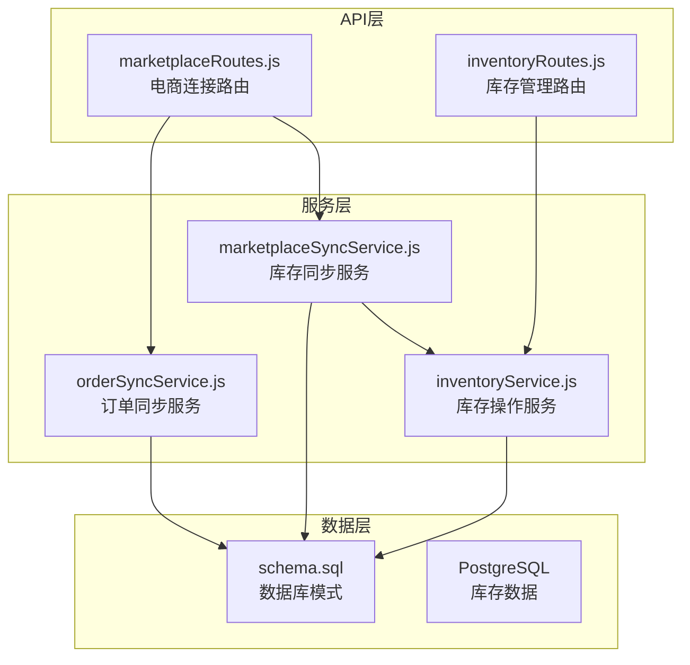
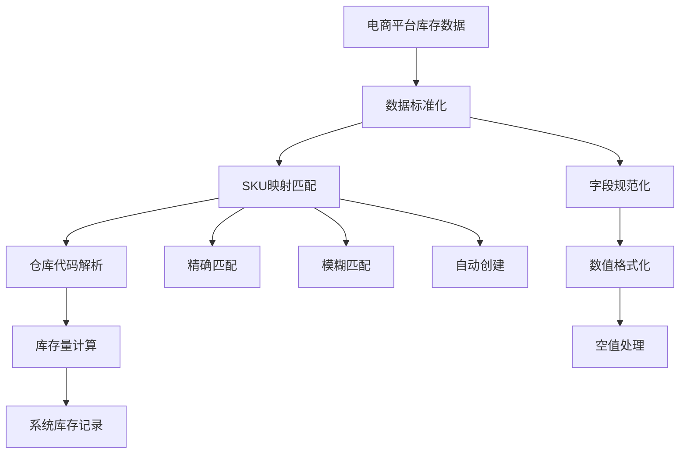
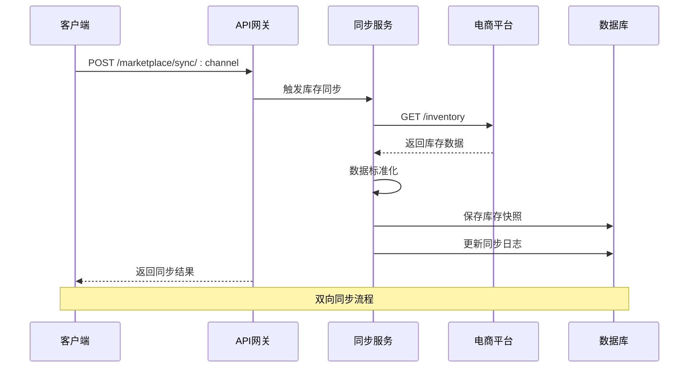
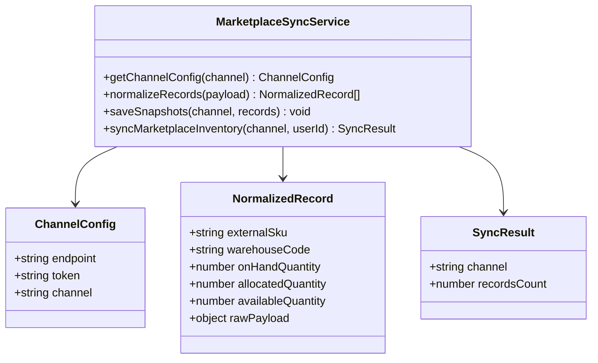
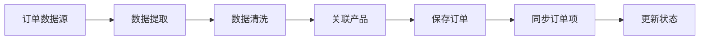
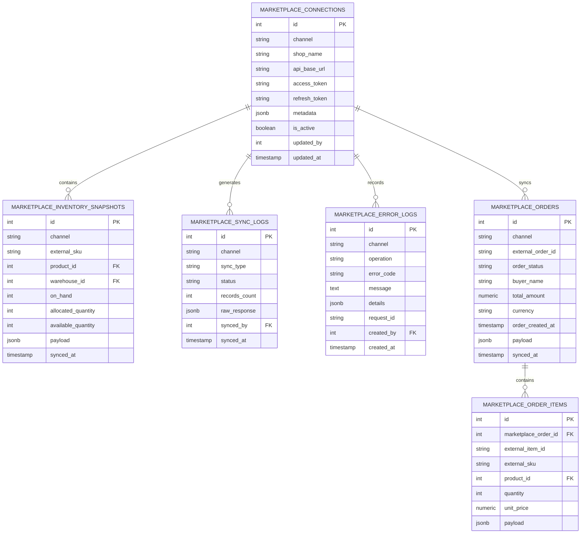
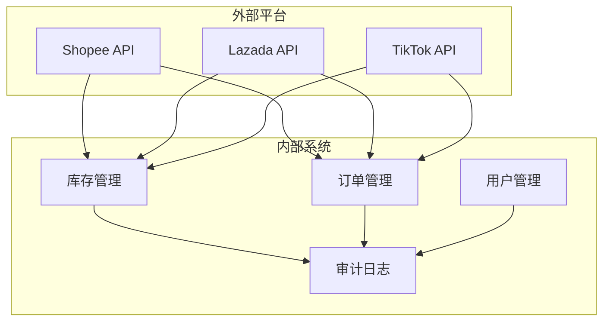
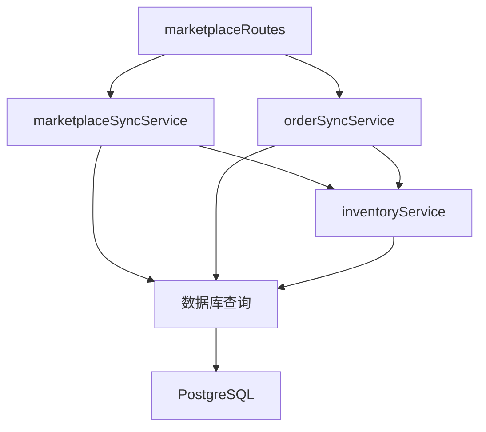
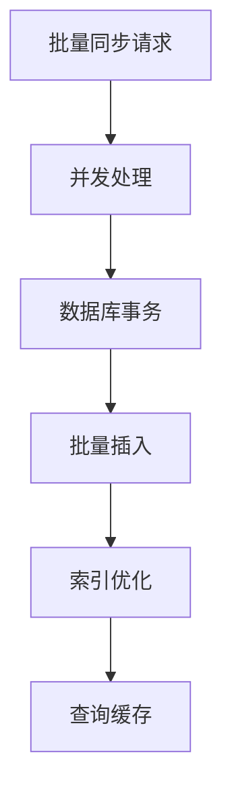
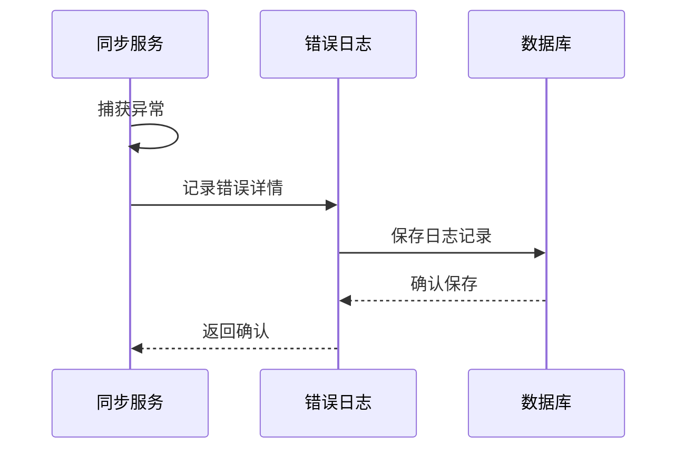

# 库存同步API

<cite>
**本文档引用的文件**
- [server/src/routes/marketplaceRoutes.js](file://server/src/routes/marketplaceRoutes.js)
- [server/src/services/marketplaceSyncService.js](file://server/src/services/marketplaceSyncService.js)
- [server/src/utils/inventoryService.js](file://server/src/utils/inventoryService.js)
- [server/src/services/orderSyncService.js](file://server/src/services/orderSyncService.js)
- [server/database/schema.sql](file://server/database/schema.sql)
- [postman/inventory_system_backend.postman_collection.json](file://postman/inventory_system_backend.postman_collection.json)
</cite>

## 目录
1. [简介](#简介)
2. [项目结构](#项目结构)
3. [核心组件](#核心组件)
4. [架构概览](#架构概览)
5. [详细组件分析](#详细组件分析)
6. [依赖关系分析](#依赖关系分析)
7. [性能考虑](#性能考虑)
8. [故障排除指南](#故障排除指南)
9. [结论](#结论)

## 简介

库存同步API是电商库存管理系统的核心功能模块，负责实现企业内部库存与电商平台（Shopee、Lazada、TikTok）之间的双向库存数据同步。该系统提供了完整的库存同步解决方案，包括从电商平台拉取库存数据、向电商平台推送库存变更、库存数据映射、同步状态跟踪和冲突解决策略。

## 项目结构

系统采用Express.js + PostgreSQL的后端架构，主要包含以下核心模块：

**图表来源**
- [server/src/routes/marketplaceRoutes.js:1-641](file://server/src/routes/marketplaceRoutes.js#L1-L641)
- [server/src/services/marketplaceSyncService.js:1-146](file://server/src/services/marketplaceSyncService.js#L1-L146)
- [server/database/schema.sql:1-447](file://server/database/schema.sql#L1-L447)

**章节来源**
- [server/src/routes/marketplaceRoutes.js:1-641](file://server/src/routes/marketplaceRoutes.js#L1-L641)
- [server/database/schema.sql:1-447](file://server/database/schema.sql#L1-L447)

## 核心组件

### 1. 电商连接管理

系统支持三个主流电商平台的连接管理，每个平台都有独立的配置和认证机制：

| 平台 | 支持状态 | 认证方式 | 同步能力 |
|------|----------|----------|----------|
| Shopee | ✅ 已支持 | OAuth 2.0 | ✅ 库存/订单同步 |
| Lazada | ✅ 已支持 | OAuth 2.0 | ✅ 库存/订单同步 |
| TikTok | ✅ 已支持 | OAuth 2.0 | ✅ 库存/订单同步 |

### 2. 库存同步机制

系统提供四种同步模式：

- **批量同步**: 一次性获取所有库存数据
- **增量同步**: 基于时间戳的增量更新
- **实时同步**: 推送库存变更到电商平台
- **手动触发**: 通过API手动启动同步任务

### 3. 数据映射规则

**图表来源**
- [server/src/services/marketplaceSyncService.js:39-58](file://server/src/services/marketplaceSyncService.js#L39-L58)

**章节来源**
- [server/src/services/marketplaceSyncService.js:1-146](file://server/src/services/marketplaceSyncService.js#L1-L146)

## 架构概览

**图表来源**
- [server/src/routes/marketplaceRoutes.js:144-202](file://server/src/routes/marketplaceRoutes.js#L144-L202)
- [server/src/services/marketplaceSyncService.js:100-140](file://server/src/services/marketplaceSyncService.js#L100-L140)

## 详细组件分析

### 库存同步服务

#### 核心功能

库存同步服务是整个系统的核心组件，负责处理与电商平台的库存数据交互：

**图表来源**
- [server/src/services/marketplaceSyncService.js:1-146](file://server/src/services/marketplaceSyncService.js#L1-L146)

#### 数据标准化流程

系统实现了强大的数据标准化功能，能够处理不同电商平台的数据格式差异：

| 字段 | Shopee | Lazada | TikTok | 统一格式 |
|------|--------|--------|--------|----------|
| SKU | sku | item_sku | external_sku | externalSku |
| 库存数量 | on_hand | available_stock | available_stock | onHandQuantity |
| 已分配数量 | order_locked_stock | reserved_stock | reserved_stock | allocatedQuantity |
| 可用数量 | available_stock | available_stock | available_stock | availableQuantity |

**章节来源**
- [server/src/services/marketplaceSyncService.js:39-58](file://server/src/services/marketplaceSyncService.js#L39-L58)

### 订单同步服务

虽然主要文档关注库存同步，但系统也提供了完整的订单同步功能：

**图表来源**
- [server/src/services/orderSyncService.js:1-119](file://server/src/services/orderSyncService.js#L1-L119)

**章节来源**
- [server/src/services/orderSyncService.js:1-119](file://server/src/services/orderSyncService.js#L1-L119)

### 数据库设计

系统使用PostgreSQL存储所有同步相关的数据，核心表结构如下：

**图表来源**
- [server/database/schema.sql:137-235](file://server/database/schema.sql#L137-L235)

**章节来源**
- [server/database/schema.sql:137-235](file://server/database/schema.sql#L137-L235)

## 依赖关系分析

### 外部依赖

系统对外部依赖的管理：

### 内部依赖

**图表来源**
- [server/src/routes/marketplaceRoutes.js:1-15](file://server/src/routes/marketplaceRoutes.js#L1-L15)
- [server/src/services/marketplaceSyncService.js:1-3](file://server/src/services/marketplaceSyncService.js#L1-L3)

**章节来源**
- [server/src/routes/marketplaceRoutes.js:1-15](file://server/src/routes/marketplaceRoutes.js#L1-L15)
- [server/src/services/marketplaceSyncService.js:1-3](file://server/src/services/marketplaceSyncService.js#L1-L3)

## 性能考虑

### 1. 同步频率限制

系统实现了智能的速率限制机制：

- **库存同步**: 每分钟最多12次请求
- **OAuth流程**: 每分钟最多20次请求
- **订单同步**: 每分钟最多12次请求

### 2. 批量处理优化

### 3. 内存管理

系统采用流式处理和分页机制，避免大量数据导致内存溢出。

## 故障排除指南

### 常见错误及解决方案

| 错误类型 | 错误代码 | 描述 | 解决方案 |
|----------|----------|------|----------|
| 认证失败 | AUTH_FAILED | 访问令牌无效 | 检查access_token配置 |
| 平台不支持 | UNSUPPORTED_CHANNEL | 不支持的电商平台 | 确认渠道名称正确 |
| 连接超时 | CONNECTION_TIMEOUT | 平台响应超时 | 检查网络连接和API状态 |
| 数据格式错误 | INVALID_PAYLOAD | 返回数据格式不符 | 验证平台API版本 |
| 权限不足 | INSUFFICIENT_PERMISSION | 缺少必要的API权限 | 重新授权平台权限 |

### 日志监控

系统提供了完整的错误日志记录机制：

**图表来源**
- [server/src/routes/marketplaceRoutes.js:20-30](file://server/src/routes/marketplaceRoutes.js#L20-L30)

**章节来源**
- [server/src/routes/marketplaceRoutes.js:20-30](file://server/src/routes/marketplaceRoutes.js#L20-L30)

## 结论

库存同步API提供了完整的企业级电商库存管理解决方案。通过标准化的数据处理、完善的错误处理机制和灵活的同步策略，系统能够稳定可靠地处理复杂的库存同步需求。

### 主要优势

1. **多平台支持**: 支持Shopee、Lazada、TikTok三大主流电商平台
2. **数据标准化**: 统一不同平台的数据格式和字段映射
3. **实时监控**: 完整的同步日志和错误追踪
4. **性能优化**: 智能的速率限制和批量处理机制
5. **安全可靠**: OAuth认证和审计日志保障数据安全

### 未来扩展

系统具备良好的扩展性，可以轻松添加新的电商平台支持和增强同步功能。