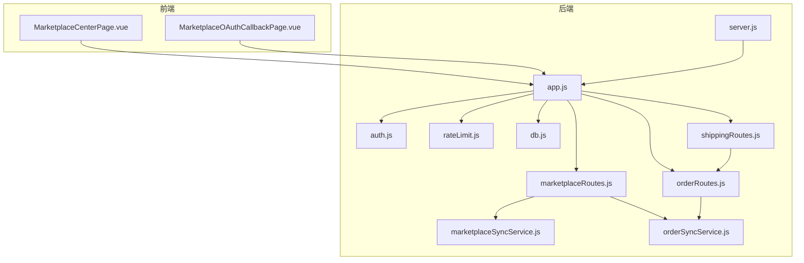
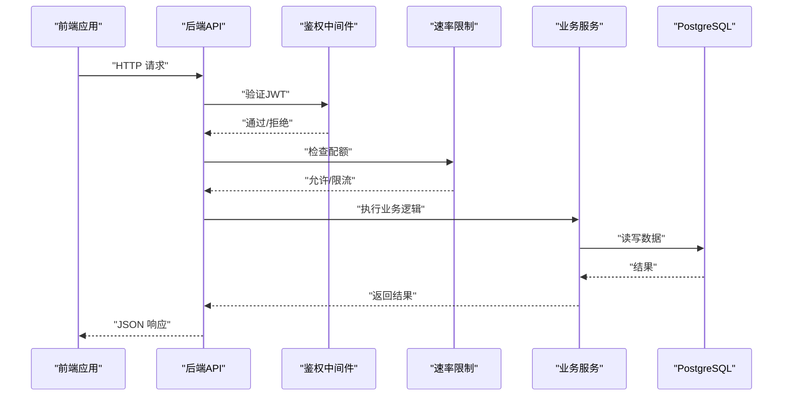
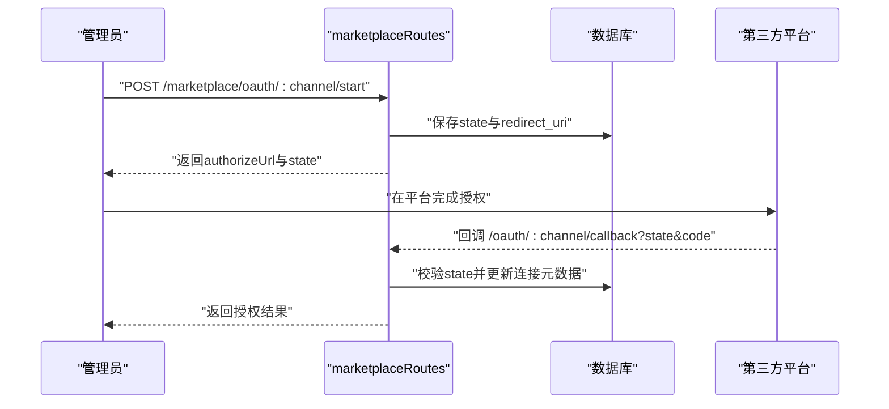
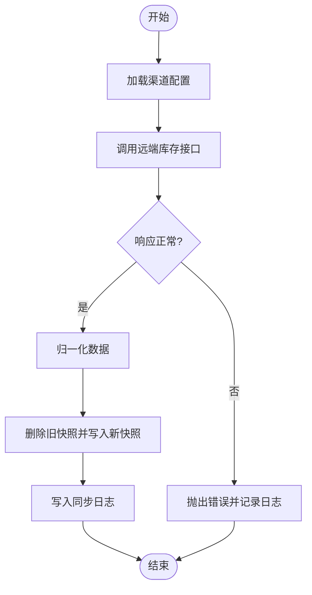
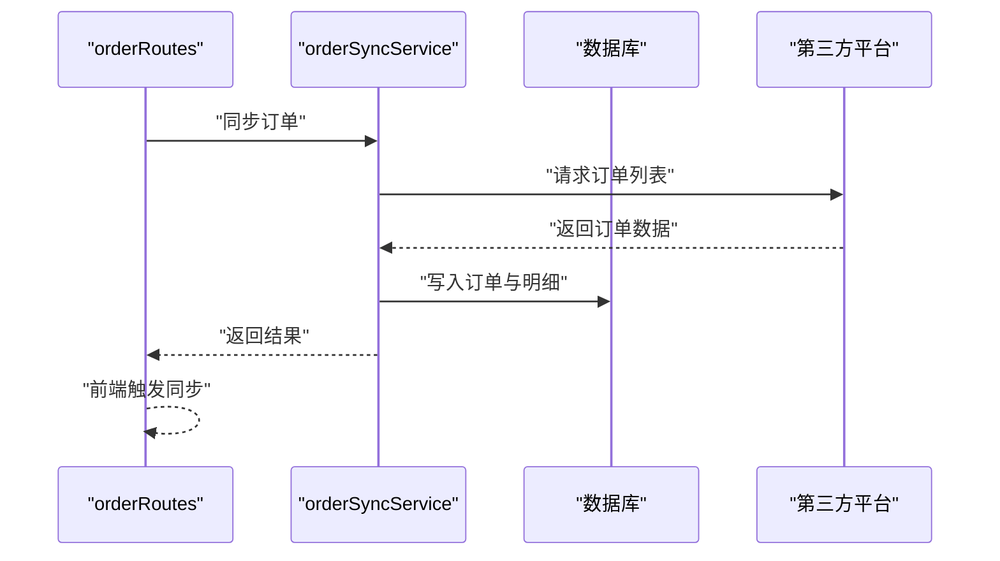
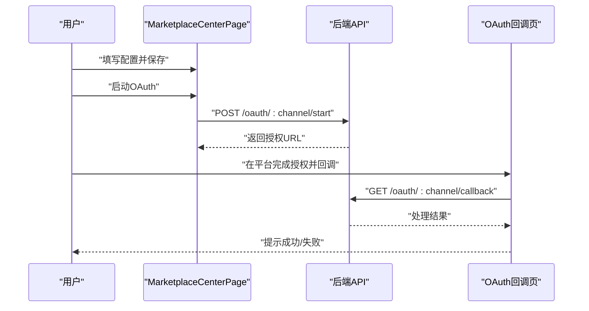
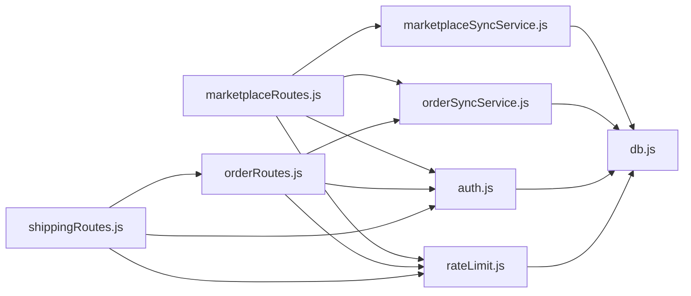

# 电商集成API

<cite>
**本文引用的文件**   
- [server/src/app.js](file://server/src/app.js)
- [server/src/server.js](file://server/src/server.js)
- [server/src/routes/marketplaceRoutes.js](file://server/src/routes/marketplaceRoutes.js)
- [server/src/services/marketplaceSyncService.js](file://server/src/services/marketplaceSyncService.js)
- [server/src/services/orderSyncService.js](file://server/src/services/orderSyncService.js)
- [server/src/routes/orderRoutes.js](file://server/src/routes/orderRoutes.js)
- [server/src/routes/shippingRoutes.js](file://server/src/routes/shippingRoutes.js)
- [server/src/middleware/auth.js](file://server/src/middleware/auth.js)
- [server/src/middleware/rateLimit.js](file://server/src/middleware/rateLimit.js)
- [server/src/config/db.js](file://server/src/config/db.js)
- [server/database/schema.sql](file://server/database/schema.sql)
- [web/src/pages/MarketplaceCenterPage.vue](file://web/src/pages/MarketplaceCenterPage.vue)
- [web/src/pages/MarketplaceOAuthCallbackPage.vue](file://web/src/pages/MarketplaceOAuthCallbackPage.vue)
- [postman/inventory_system_backend.postman_collection.json](file://postman/inventory_system_backend.postman_collection.json)
</cite>

## 目录
1. [简介](#简介)
2. [项目结构](#项目结构)
3. [核心组件](#核心组件)
4. [架构总览](#架构总览)
5. [详细组件分析](#详细组件分析)
6. [依赖关系分析](#依赖关系分析)
7. [性能考虑](#性能考虑)
8. [故障排查指南](#故障排查指南)
9. [结论](#结论)
10. [附录](#附录)

## 简介
本文件为电商平台集成API的技术文档，覆盖Shopee、Lazada、TikTok Shop三大平台的连接配置、库存同步、价格更新、订单抓取与发货处理流程。系统采用前后端分离架构，后端基于Express提供REST API，前端Vue应用提供可视化操作界面；数据库采用PostgreSQL，配合统一的审计与错误日志体系，支持OAuth授权、速率限制、健康检查与错误重试等机制。

## 项目结构
后端服务通过路由模块化组织功能，核心模块包括：
- 路由层：市场连接、订单、发货等API路由
- 服务层：市场同步、订单同步等业务逻辑
- 中间件：鉴权、速率限制、响应包装
- 数据库：PostgreSQL表结构与索引
- 前端：Vue页面负责连接配置、OAuth引导、同步任务与错误监控

**图表来源**
- [server/src/app.js:1-67](file://server/src/app.js#L1-L67)
- [server/src/server.js:1-28](file://server/src/server.js#L1-L28)
- [server/src/routes/marketplaceRoutes.js:1-641](file://server/src/routes/marketplaceRoutes.js#L1-L641)
- [server/src/routes/orderRoutes.js:1-113](file://server/src/routes/orderRoutes.js#L1-L113)
- [server/src/routes/shippingRoutes.js:1-155](file://server/src/routes/shippingRoutes.js#L1-L155)
- [server/src/services/marketplaceSyncService.js:1-146](file://server/src/services/marketplaceSyncService.js#L1-L146)
- [server/src/services/orderSyncService.js:1-119](file://server/src/services/orderSyncService.js#L1-L119)
- [server/src/middleware/auth.js:1-46](file://server/src/middleware/auth.js#L1-L46)
- [server/src/middleware/rateLimit.js:1-40](file://server/src/middleware/rateLimit.js#L1-L40)
- [server/src/config/db.js:1-25](file://server/src/config/db.js#L1-L25)

**章节来源**
- [server/src/app.js:1-67](file://server/src/app.js#L1-L67)
- [server/src/server.js:1-28](file://server/src/server.js#L1-L28)

## 核心组件
- 认证与授权：基于JWT的令牌校验与角色授权，确保仅管理员与经理可执行敏感操作。
- 速率限制：按命名空间与客户端IP进行限流，防止突发请求冲击下游平台。
- 市场连接：支持Shopee/Lazada/TikTok的连接配置、OAuth授权流程、连接测试与健康检查。
- 同步服务：库存快照与订单拉取，支持幂等写入与错误日志记录。
- 发货管理：订单发货创建与状态更新，支持跟踪号、物流商与服务等级。
- 审计与错误：统一审计日志与错误日志表，便于追踪与排障。

**章节来源**
- [server/src/middleware/auth.js:1-46](file://server/src/middleware/auth.js#L1-L46)
- [server/src/middleware/rateLimit.js:1-40](file://server/src/middleware/rateLimit.js#L1-L40)
- [server/src/routes/marketplaceRoutes.js:1-641](file://server/src/routes/marketplaceRoutes.js#L1-L641)
- [server/src/services/marketplaceSyncService.js:1-146](file://server/src/services/marketplaceSyncService.js#L1-L146)
- [server/src/services/orderSyncService.js:1-119](file://server/src/services/orderSyncService.js#L1-L119)
- [server/src/routes/shippingRoutes.js:1-155](file://server/src/routes/shippingRoutes.js#L1-L155)

## 架构总览
系统通过Express应用聚合中间件与路由，数据库连接池提供事务与查询能力。前端通过HTTP调用后端API，实现从连接配置到同步任务与发货处理的完整闭环。

**图表来源**
- [server/src/app.js:28-64](file://server/src/app.js#L28-L64)
- [server/src/middleware/auth.js:5-29](file://server/src/middleware/auth.js#L5-L29)
- [server/src/middleware/rateLimit.js:9-35](file://server/src/middleware/rateLimit.js#L9-L35)
- [server/src/config/db.js:15-24](file://server/src/config/db.js#L15-L24)

## 详细组件分析

### 市场连接与OAuth
- 支持平台：Shopee、Lazada、TikTok
- 连接配置：保存渠道、店铺名、API基础URL、访问令牌、刷新令牌与元数据
- OAuth流程：
  - 启动授权：生成state并持久化，返回授权URL与过期时间
  - 回调处理：校验state有效性与过期时间，写入最新授权信息并清理state
  - 连接测试：调用远端健康接口验证连通性
- 错误与审计：所有异常均写入错误日志表，同时记录审计日志

**图表来源**
- [server/src/routes/marketplaceRoutes.js:204-375](file://server/src/routes/marketplaceRoutes.js#L204-L375)
- [server/src/database/schema.sql:161-182](file://server/database/schema.sql#L161-L182)

**章节来源**
- [server/src/routes/marketplaceRoutes.js:47-142](file://server/src/routes/marketplaceRoutes.js#L47-L142)
- [server/src/routes/marketplaceRoutes.js:204-375](file://server/src/routes/marketplaceRoutes.js#L204-L375)
- [server/src/database/schema.sql:161-182](file://server/database/schema.sql#L161-L182)

### 库存同步
- 配置优先级：优先读取数据库中的活动连接配置，否则回退至环境变量
- 数据归一化：统一字段如可用量、占用量、外部SKU等
- 快照存储：删除旧快照后批量写入新快照，关联产品与仓库ID
- 日志记录：成功/失败均写入同步日志表

**图表来源**
- [server/src/services/marketplaceSyncService.js:100-140](file://server/src/services/marketplaceSyncService.js#L100-L140)
- [server/src/database/schema.sql:148-159](file://server/database/schema.sql#L148-L159)

**章节来源**
- [server/src/services/marketplaceSyncService.js:18-37](file://server/src/services/marketplaceSyncService.js#L18-L37)
- [server/src/services/marketplaceSyncService.js:39-58](file://server/src/services/marketplaceSyncService.js#L39-L58)
- [server/src/services/marketplaceSyncService.js:60-98](file://server/src/services/marketplaceSyncService.js#L60-L98)
- [server/src/services/marketplaceSyncService.js:100-140](file://server/src/services/marketplaceSyncService.js#L100-L140)

### 订单同步与发货处理
- 订单同步：从远端订单接口拉取，归一化后写入订单与订单明细表，支持去重与更新
- 发货管理：根据订单创建发货单，支持状态变更（待发货/已发货/在途/已送达/取消）

**图表来源**
- [server/src/routes/orderRoutes.js:13-29](file://server/src/routes/orderRoutes.js#L13-L29)
- [server/src/services/orderSyncService.js:19-114](file://server/src/services/orderSyncService.js#L19-L114)

**章节来源**
- [server/src/routes/orderRoutes.js:31-110](file://server/src/routes/orderRoutes.js#L31-L110)
- [server/src/services/orderSyncService.js:4-17](file://server/src/services/orderSyncService.js#L4-L17)
- [server/src/services/orderSyncService.js:19-114](file://server/src/services/orderSyncService.js#L19-L114)
- [server/src/routes/shippingRoutes.js:64-152](file://server/src/routes/shippingRoutes.js#L64-L152)

### 前端集成与使用
- 电商连接中心：集中展示连接概览、错误日志与分页；支持保存配置、连接测试、库存/订单同步、OAuth引导
- OAuth回调页：接收并处理平台回调，完成后跳转回连接中心

**图表来源**
- [web/src/pages/MarketplaceCenterPage.vue:176-246](file://web/src/pages/MarketplaceCenterPage.vue#L176-L246)
- [web/src/pages/MarketplaceOAuthCallbackPage.vue:19-54](file://web/src/pages/MarketplaceOAuthCallbackPage.vue#L19-L54)

**章节来源**
- [web/src/pages/MarketplaceCenterPage.vue:80-246](file://web/src/pages/MarketplaceCenterPage.vue#L80-L246)
- [web/src/pages/MarketplaceOAuthCallbackPage.vue:19-54](file://web/src/pages/MarketplaceOAuthCallbackPage.vue#L19-L54)

## 依赖关系分析
- 路由依赖服务：marketplaceRoutes依赖marketplaceSyncService与orderSyncService
- 服务依赖数据库：通过db.js提供的pool执行查询
- 中间件依赖：auth.js与rateLimit.js贯穿各路由
- 前端依赖：Vue页面通过api.js封装的HTTP调用后端

**图表来源**
- [server/src/routes/marketplaceRoutes.js:7-8](file://server/src/routes/marketplaceRoutes.js#L7-L8)
- [server/src/services/marketplaceSyncService.js:1](file://server/src/services/marketplaceSyncService.js#L1)
- [server/src/services/orderSyncService.js:1-2](file://server/src/services/orderSyncService.js#L1-L2)
- [server/src/middleware/auth.js:1-3](file://server/src/middleware/auth.js#L1-L3)
- [server/src/middleware/rateLimit.js:1-2](file://server/src/middleware/rateLimit.js#L1-L2)
- [server/src/config/db.js:1-2](file://server/src/config/db.js#L1-L2)

**章节来源**
- [server/src/routes/marketplaceRoutes.js:1-14](file://server/src/routes/marketplaceRoutes.js#L1-L14)
- [server/src/services/marketplaceSyncService.js:1](file://server/src/services/marketplaceSyncService.js#L1)
- [server/src/services/orderSyncService.js:1-2](file://server/src/services/orderSyncService.js#L1-L2)
- [server/src/middleware/auth.js:1-3](file://server/src/middleware/auth.js#L1-L3)
- [server/src/middleware/rateLimit.js:1-2](file://server/src/middleware/rateLimit.js#L1-L2)
- [server/src/config/db.js:1-2](file://server/src/config/db.js#L1-L2)

## 性能考虑
- 速率限制：针对不同业务场景设置独立命名空间与窗口，避免相互影响
- 并发查询：使用Promise.all并行拉取概览与错误日志，减少往返延迟
- 数据库连接：连接池与可选SSL配置，生产环境自动启用更严格的安全策略
- 前端分页：错误日志与概览均支持分页，降低一次性传输压力

**章节来源**
- [server/src/middleware/rateLimit.js:9-35](file://server/src/middleware/rateLimit.js#L9-L35)
- [server/src/routes/marketplaceRoutes.js:484-554](file://server/src/routes/marketplaceRoutes.js#L484-L554)
- [server/src/config/db.js:3-19](file://server/src/config/db.js#L3-L19)

## 故障排查指南
- 健康检查：通过健康端点确认服务可用性
- 连接测试：验证远端端点可达与令牌有效
- 错误日志：查看marketplace_error_logs表定位具体错误码与详情
- 审计日志：通过audit_logs追踪操作人、方法与路径
- 重试建议：检查限流状态、网络连通性与远端状态码

**章节来源**
- [server/src/app.js:36-38](file://server/src/app.js#L36-L38)
- [server/src/routes/marketplaceRoutes.js:377-435](file://server/src/routes/marketplaceRoutes.js#L377-L435)
- [server/src/database/schema.sql:184-194](file://server/database/schema.sql#L184-L194)
- [server/src/database/schema.sql:275-288](file://server/database/schema.sql#L275-L288)

## 结论
该系统提供了完整的电商集成能力，涵盖连接配置、OAuth授权、库存与订单同步以及发货管理。通过统一的鉴权、速率限制与审计/错误日志体系，保障了安全性与可观测性。建议在生产环境中结合监控告警与自动化重试策略，进一步提升稳定性与运维效率。

## 附录

### API定义与使用示例
- 健康检查
  - 方法：GET
  - 路径：/api/health
  - 示例：参见Postman集合中的“Health Check”项

- 登录与个人信息
  - 方法：POST/GET
  - 路径：/api/auth/login、/api/auth/me
  - 示例：参见Postman集合中的“Auth”项

- 市场连接
  - 获取连接：GET /api/marketplace/connections
  - 更新连接：PUT /api/marketplace/connections/{channel}
  - 连接测试：POST /api/marketplace/connections/{channel}/test
  - 启动OAuth：POST /api/marketplace/oauth/{channel}/start
  - OAuth回调：GET /api/marketplace/oauth/{channel}/callback
  - 同步库存：POST /api/marketplace/sync/{channel}
  - 同步订单：POST /api/marketplace/orders/sync/{channel}
  - 同步日志：GET /api/marketplace/sync-logs
  - 快照查询：GET /api/marketplace/snapshots
  - 状态概览：GET /api/marketplace/status/overview
  - 错误列表：GET /api/marketplace/errors

- 订单管理
  - 同步订单：POST /api/orders/sync/{channel}
  - 订单列表：GET /api/orders/?channel=&status=&search=
  - 订单详情：GET /api/orders/{id}

- 发货管理
  - 创建发货单：POST /api/shipping/shipments/{orderId}/create
  - 更新发货状态：PUT /api/shipping/shipments/{id}/status
  - 发货单列表：GET /api/shipping/shipments?status=&search=

- 前端页面
  - 电商连接中心：/marketplace-center
  - OAuth回调页：/marketplace/oauth/callback/{channel}

**章节来源**
- [postman/inventory_system_backend.postman_collection.json:10-200](file://postman/inventory_system_backend.postman_collection.json#L10-L200)
- [server/src/routes/marketplaceRoutes.js:47-641](file://server/src/routes/marketplaceRoutes.js#L47-L641)
- [server/src/routes/orderRoutes.js:13-110](file://server/src/routes/orderRoutes.js#L13-L110)
- [server/src/routes/shippingRoutes.js:10-152](file://server/src/routes/shippingRoutes.js#L10-L152)
- [web/src/pages/MarketplaceCenterPage.vue:80-246](file://web/src/pages/MarketplaceCenterPage.vue#L80-L246)
- [web/src/pages/MarketplaceOAuthCallbackPage.vue:19-54](file://web/src/pages/MarketplaceOAuthCallbackPage.vue#L19-L54)