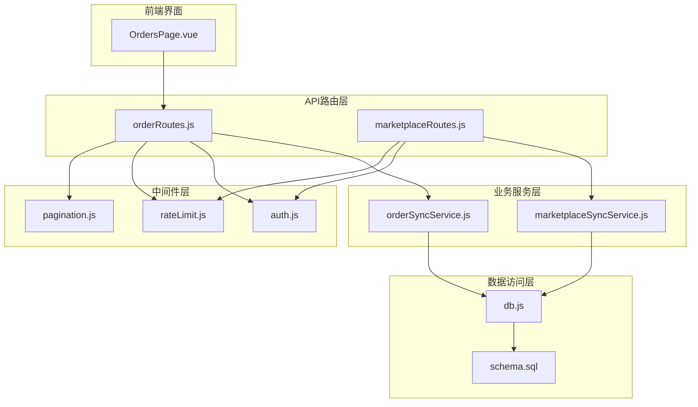
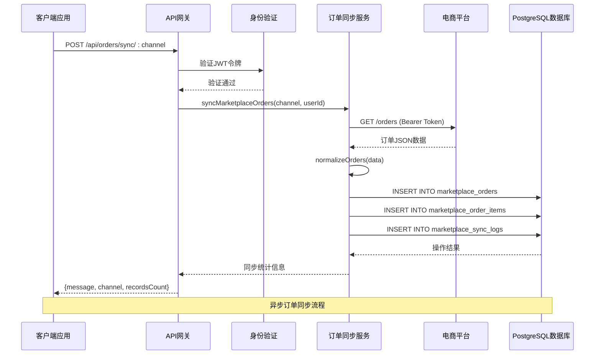
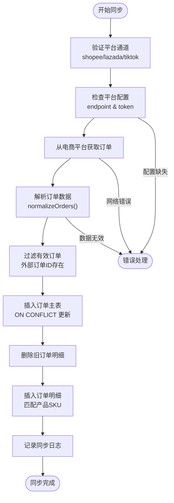
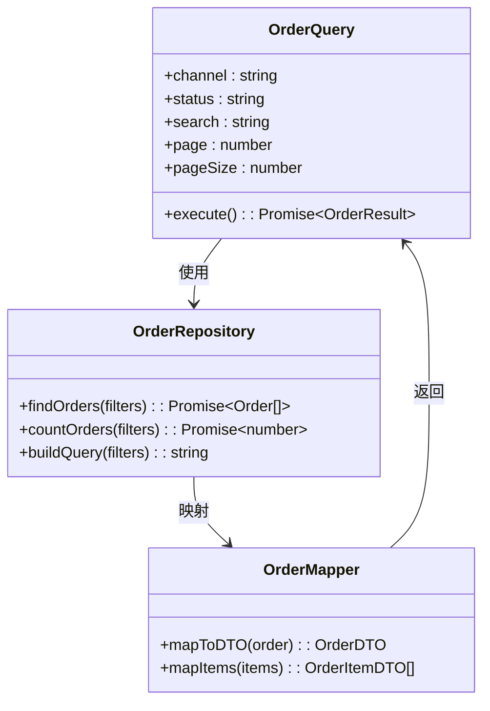
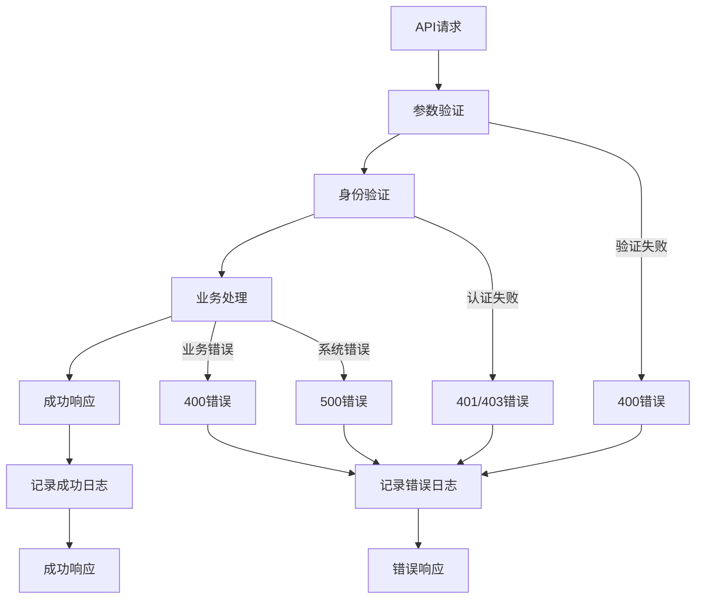
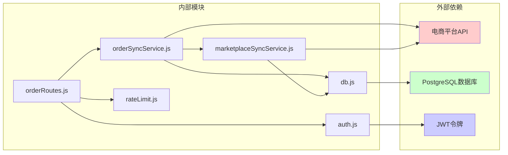

# 订单同步API

<cite>
**本文档引用的文件**
- [orderRoutes.js](file://server/src/routes/orderRoutes.js)
- [marketplaceRoutes.js](file://server/src/routes/marketplaceRoutes.js)
- [orderSyncService.js](file://server/src/services/orderSyncService.js)
- [marketplaceSyncService.js](file://server/src/services/marketplaceSyncService.js)
- [schema.sql](file://server/database/schema.sql)
- [auth.js](file://server/src/middleware/auth.js)
- [rateLimit.js](file://server/src/middleware/rateLimit.js)
- [pagination.js](file://server/src/utils/pagination.js)
- [db.js](file://server/src/config/db.js)
- [OrdersPage.vue](file://web/src/pages/OrdersPage.vue)
</cite>

## 目录
1. [简介](#简介)
2. [项目结构](#项目结构)
3. [核心组件](#核心组件)
4. [架构概览](#架构概览)
5. [详细组件分析](#详细组件分析)
6. [依赖关系分析](#依赖关系分析)
7. [性能考虑](#性能考虑)
8. [故障排除指南](#故障排除指南)
9. [结论](#结论)

## 简介

订单同步API是库存管理系统的核心功能模块，负责从电商平台（Shopee、Lazada、TikTok）抓取订单数据并进行本地化处理。该系统实现了完整的订单生命周期管理，包括订单抓取、数据解析、状态映射和自动化处理。

系统采用现代化的微服务架构，通过RESTful API提供订单同步功能，支持实时订单监控和批量处理。所有操作都经过严格的身份验证和授权控制，确保系统的安全性和可靠性。

## 项目结构

订单同步功能主要分布在以下目录结构中：



**图表来源**
- [orderRoutes.js:1-113](file://server/src/routes/orderRoutes.js#L1-L113)
- [marketplaceRoutes.js:1-641](file://server/src/routes/marketplaceRoutes.js#L1-L641)
- [orderSyncService.js:1-119](file://server/src/services/orderSyncService.js#L1-L119)
- [marketplaceSyncService.js:1-146](file://server/src/services/marketplaceSyncService.js#L1-L146)

**章节来源**
- [orderRoutes.js:1-113](file://server/src/routes/orderRoutes.js#L1-L113)
- [marketplaceRoutes.js:1-641](file://server/src/routes/marketplaceRoutes.js#L1-L641)

## 核心组件

### 订单路由处理器

订单路由系统提供了完整的订单管理API接口，包括订单同步、查询和详情获取功能。

**主要路由端点：**
- `POST /api/orders/sync/:channel` - 同步指定平台的订单
- `GET /api/orders` - 分页查询订单列表
- `GET /api/orders/:id` - 获取订单详情

### 订单同步服务

订单同步服务负责与电商平台API交互，获取订单数据并进行本地化存储。

**核心功能：**
- 平台配置管理
- 订单数据抓取
- 数据标准化处理
- 本地数据库持久化

### 数据库架构

系统使用PostgreSQL作为数据存储，设计了专门的订单管理表结构。

**关键数据表：**
- `marketplace_orders` - 订单主表
- `marketplace_order_items` - 订单明细表
- `marketplace_sync_logs` - 同步日志表

**章节来源**
- [orderRoutes.js:13-110](file://server/src/routes/orderRoutes.js#L13-L110)
- [orderSyncService.js:19-114](file://server/src/services/orderSyncService.js#L19-L114)
- [schema.sql:196-219](file://server/database/schema.sql#L196-L219)

## 架构概览

订单同步系统采用分层架构设计，确保各层职责清晰分离：



**图表来源**
- [orderRoutes.js:13-29](file://server/src/routes/orderRoutes.js#L13-L29)
- [orderSyncService.js:19-114](file://server/src/services/orderSyncService.js#L19-L114)
- [marketplaceSyncService.js:18-37](file://server/src/services/marketplaceSyncService.js#L18-L37)

## 详细组件分析

### 订单同步流程

订单同步过程包含多个关键步骤，确保数据的准确性和完整性：



**图表来源**
- [orderSyncService.js:4-17](file://server/src/services/orderSyncService.js#L4-L17)
- [orderSyncService.js:42-100](file://server/src/services/orderSyncService.js#L42-L100)

#### 订单数据标准化

系统实现了灵活的订单数据标准化机制，支持不同电商平台的数据格式：

**标准化字段映射：**
- 外部订单ID → `external_order_id`
- 订单状态 → `order_status` (默认: PENDING)
- 买家姓名 → `buyer_name`
- 总金额 → `total_amount`
- 货币代码 → `currency` (默认: USD)
- 下单时间 → `order_created_at`
- 订单明细 → `items` 数组

**章节来源**
- [orderSyncService.js:4-17](file://server/src/services/orderSyncService.js#L4-L17)

### 订单查询接口

订单查询系统提供了强大的搜索和过滤功能：



**图表来源**
- [orderRoutes.js:31-81](file://server/src/routes/orderRoutes.js#L31-L81)
- [pagination.js:2-27](file://server/src/utils/pagination.js#L2-L27)

#### 查询参数规范

**URL查询参数：**
- `channel` - 平台筛选 (shopee/lazada/tiktok/all)
- `status` - 订单状态筛选 (PENDING/PAID/SHIPPED/CANCELLED/all)
- `search` - 搜索关键词 (订单号或买家姓名)
- `page` - 页码 (默认: 1)
- `pageSize` - 每页数量 (1-100，默认: 10)

**章节来源**
- [orderRoutes.js:31-81](file://server/src/routes/orderRoutes.js#L31-L81)
- [pagination.js:2-27](file://server/src/utils/pagination.js#L2-L27)

### 错误处理机制

系统实现了完善的错误处理和日志记录机制：



**图表来源**
- [orderRoutes.js:13-29](file://server/src/routes/orderRoutes.js#L13-L29)
- [marketplaceRoutes.js:20-30](file://server/src/routes/marketplaceRoutes.js#L20-L30)

#### 错误日志表结构

系统使用专门的错误日志表记录所有异常情况：

**错误日志字段：**
- `channel` - 平台名称
- `operation` - 操作类型 (order_sync, inventory_sync等)
- `error_code` - 错误代码
- `message` - 错误消息
- `details` - 详细信息 (JSON格式)
- `request_id` - 请求标识符

**章节来源**
- [marketplaceRoutes.js:20-30](file://server/src/routes/marketplaceRoutes.js#L20-L30)
- [schema.sql:184-194](file://server/database/schema.sql#L184-L194)

## 依赖关系分析

订单同步系统的关键依赖关系如下：



**图表来源**
- [orderRoutes.js:1-113](file://server/src/routes/orderRoutes.js#L1-L113)
- [orderSyncService.js:1-119](file://server/src/services/orderSyncService.js#L1-L119)
- [marketplaceSyncService.js:1-146](file://server/src/services/marketplaceSyncService.js#L1-L146)

### 数据模型关系

订单系统的核心数据模型具有清晰的关联关系：

```mermaid
erDiagram
MARKETPLACE_ORDERS {
int id PK
varchar channel
varchar external_order_id UK
varchar order_status
varchar buyer_name
numeric total_amount
varchar currency
timestamp order_created_at
jsonb payload
timestamp synced_at
}
MARKETPLACE_ORDER_ITEMS {
int id PK
int marketplace_order_id FK
varchar external_item_id
varchar external_sku
int product_id FK
int quantity
numeric unit_price
jsonb payload
}
PRODUCTS {
int id PK
varchar sku UK
varchar name
}
MARKETPLACE_ORDERS ||--o{ MARKETPLACE_ORDER_ITEMS : contains
PRODUCTS ||--o{ MARKETPLACE_ORDER_ITEMS : linked_to
note for MARKETPLACE_ORDERS """
存储来自电商平台的原始订单数据
包含订单基本信息和原始payload
"""
note for MARKETPLACE_ORDER_ITEMS """
存储订单的详细商品信息
支持与本地产品SKU关联
"""
```

**图表来源**
- [schema.sql:196-219](file://server/database/schema.sql#L196-L219)

**章节来源**
- [schema.sql:196-219](file://server/database/schema.sql#L196-L219)

## 性能考虑

### 并发控制

系统实现了多层并发控制机制：

**速率限制配置：**
- 订单同步: 12次/分钟 (namespace: orders-sync)
- 平台同步: 12次/分钟 (namespace: marketplace-sync)
- OAuth流程: 20次/分钟 (namespace: marketplace-oauth)

**数据库连接池：**
- 自动SSL检测和配置
- 连接超时设置 (默认5秒)
- 生产环境自动启用SSL

### 批量处理优化

**批量插入策略：**
- 使用ON CONFLICT DO UPDATE减少查询次数
- 批量删除旧数据后批量插入新数据
- JSONB格式存储原始数据，提高查询效率

**索引优化：**
- 订单表: channel, order_status索引
- 订单项表: marketplace_order_id索引
- OAuth状态表: expires_at索引

**章节来源**
- [rateLimit.js:9-35](file://server/src/middleware/rateLimit.js#L9-L35)
- [db.js:13-24](file://server/src/config/db.js#L13-L24)
- [schema.sql:419-427](file://server/database/schema.sql#L419-L427)

## 故障排除指南

### 常见问题诊断

**1. 平台连接失败**
- 检查环境变量配置
- 验证API端点可达性
- 确认访问令牌有效性

**2. 订单同步错误**
- 查看同步日志表
- 检查错误日志表
- 验证订单数据格式

**3. 权限问题**
- 确认JWT令牌有效性
- 检查用户角色权限
- 验证API访问范围

### 调试工具

**前端调试：**
- Vue.js开发工具
- 浏览器网络面板
- 控制台错误输出

**后端调试：**
- PostgreSQL日志
- Node.js进程监控
- API响应时间分析

**章节来源**
- [marketplaceRoutes.js:556-593](file://server/src/routes/marketplaceRoutes.js#L556-L593)
- [OrdersPage.vue:63-78](file://web/src/pages/OrdersPage.vue#L63-L78)

## 结论

订单同步API系统提供了完整、可靠的电商订单管理解决方案。通过模块化的架构设计、严格的错误处理机制和完善的性能优化，系统能够高效处理来自多个电商平台的订单数据。

**主要优势：**
- 支持多平台订单同步
- 实时状态监控和日志记录
- 灵活的查询和过滤功能
- 强大的错误处理和恢复机制
- 可扩展的架构设计

**未来改进方向：**
- 增加订单状态自动流转
- 实现订单确认和处理自动化
- 优化大数据量下的查询性能
- 添加更多平台支持

该系统为企业提供了统一的订单管理平台，简化了多渠道电商业务的运营复杂度。