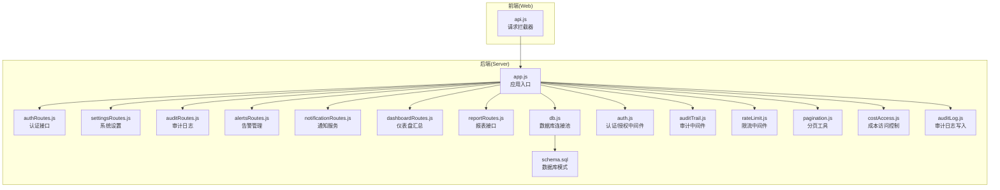
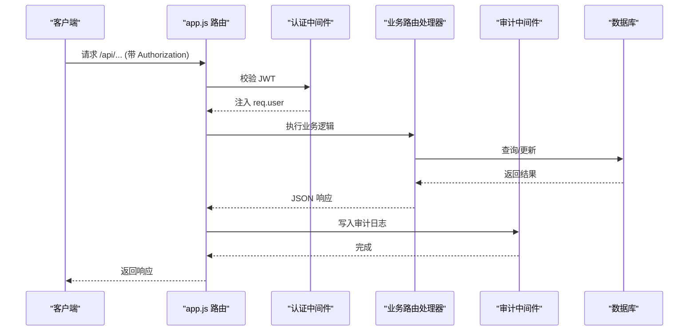
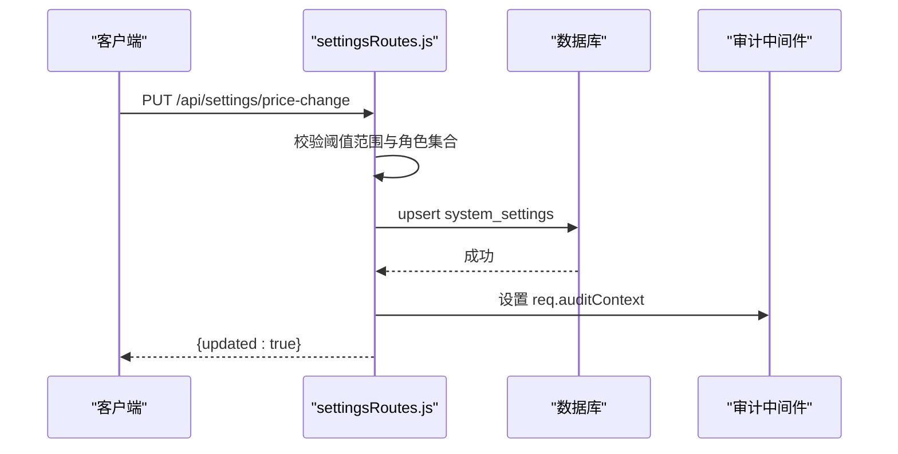
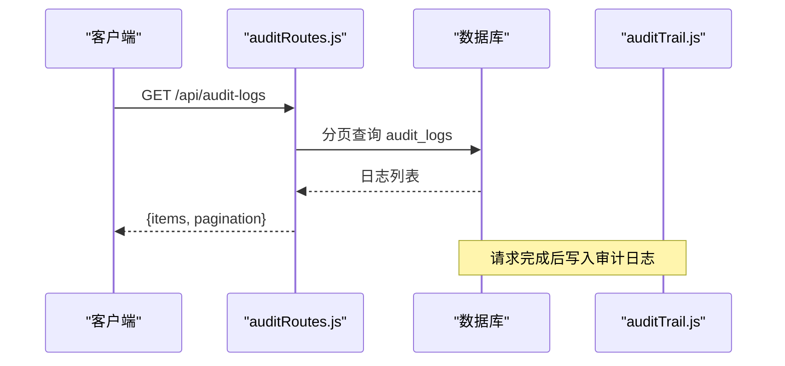
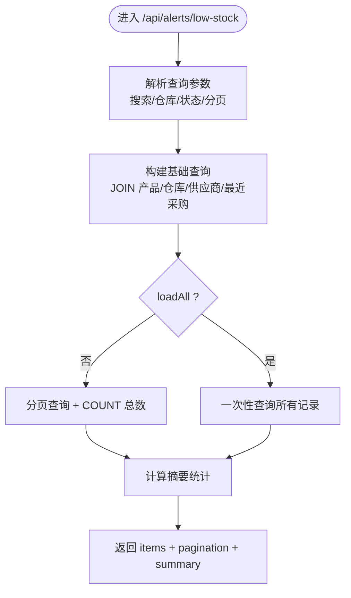
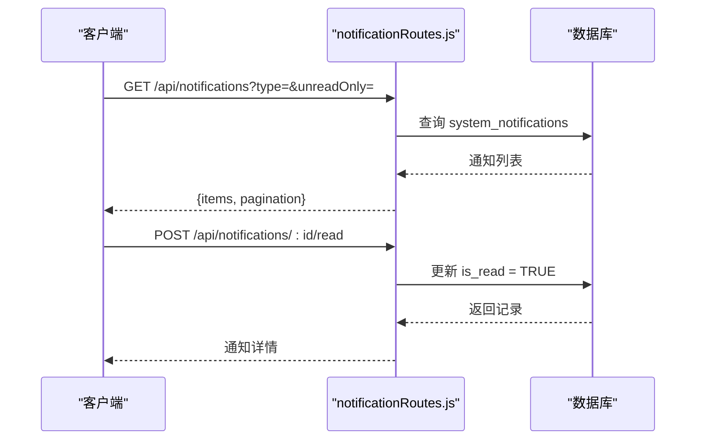
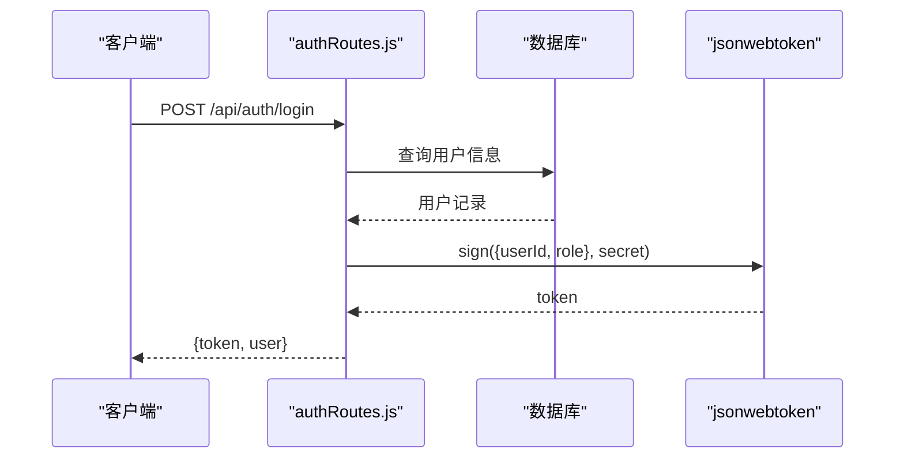
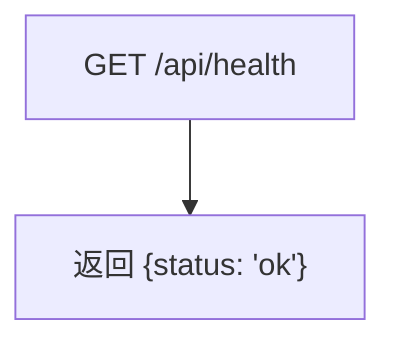
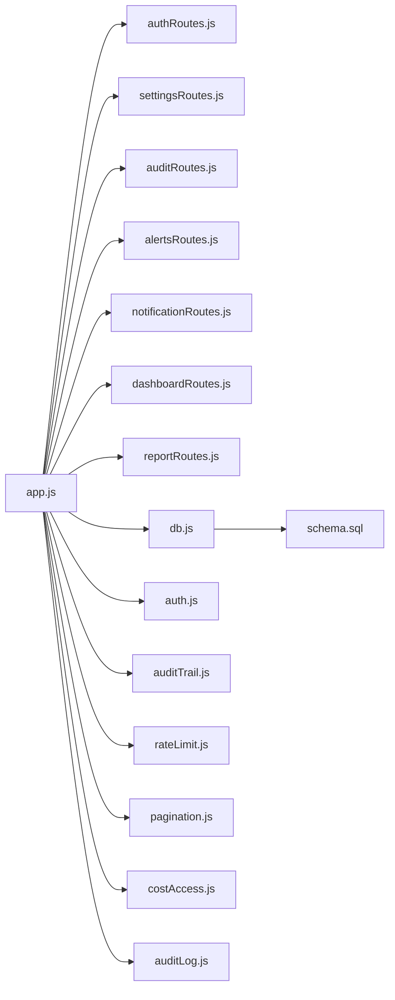
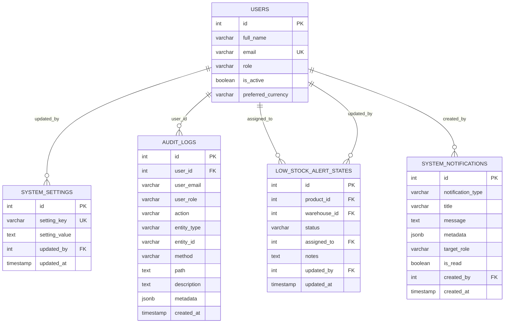

# 系统管理API

<cite>
**本文档引用的文件**
- [server/src/app.js](file://server/src/app.js)
- [server/src/config/db.js](file://server/src/config/db.js)
- [server/src/middleware/auth.js](file://server/src/middleware/auth.js)
- [server/src/middleware/auditTrail.js](file://server/src/middleware/auditTrail.js)
- [server/src/middleware/rateLimit.js](file://server/src/middleware/rateLimit.js)
- [server/src/utils/auditLog.js](file://server/src/utils/auditLog.js)
- [server/src/utils/pagination.js](file://server/src/utils/pagination.js)
- [server/src/utils/costAccess.js](file://server/src/utils/costAccess.js)
- [server/src/routes/authRoutes.js](file://server/src/routes/authRoutes.js)
- [server/src/routes/settingsRoutes.js](file://server/src/routes/settingsRoutes.js)
- [server/src/routes/auditRoutes.js](file://server/src/routes/auditRoutes.js)
- [server/src/routes/alertsRoutes.js](file://server/src/routes/alertsRoutes.js)
- [server/src/routes/notificationRoutes.js](file://server/src/routes/notificationRoutes.js)
- [server/src/routes/dashboardRoutes.js](file://server/src/routes/dashboardRoutes.js)
- [server/src/routes/reportRoutes.js](file://server/src/routes/reportRoutes.js)
- [server/database/schema.sql](file://server/database/schema.sql)
- [web/src/services/api.js](file://web/src/services/api.js)
- [server/package.json](file://server/package.json)
</cite>

## 目录
1. [简介](#简介)
2. [项目结构](#项目结构)
3. [核心组件](#核心组件)
4. [架构总览](#架构总览)
5. [详细组件分析](#详细组件分析)
6. [依赖关系分析](#依赖关系分析)
7. [性能考虑](#性能考虑)
8. [故障排除指南](#故障排除指南)
9. [结论](#结论)
10. [附录](#附录)

## 简介
本文件为库存管理系统的“系统管理API”技术文档，聚焦以下能力：
- 系统配置与设置管理（含价格变更通知阈值、启用状态、通知角色等）
- 审计日志查询与分析
- 告警管理（低库存告警状态更新与批量更新）
- 通知服务（系统消息的查询与已读标记）
- 用户管理、权限分配与角色控制
- 系统监控、性能指标与故障诊断接口
- 配置中心、日志分析与合规报告
- 系统安全、备份恢复与灾难恢复机制

本文件以仓库现有代码为基础进行分析，确保所有接口定义、数据模型与流程均来自实际实现。

## 项目结构
后端采用 Express + PostgreSQL 架构，路由按功能模块划分，中间件统一处理认证、审计、限流与响应格式化。前端通过 axios 封装统一请求拦截器，自动注入认证与成本访问令牌。

**图表来源**
- [server/src/app.js:28-55](file://server/src/app.js#L28-L55)
- [server/src/config/db.js:13-19](file://server/src/config/db.js#L13-L19)
- [server/src/middleware/auth.js:5-29](file://server/src/middleware/auth.js#L5-L29)
- [server/src/middleware/auditTrail.js:47-79](file://server/src/middleware/auditTrail.js#L47-L79)
- [server/src/middleware/rateLimit.js:9-35](file://server/src/middleware/rateLimit.js#L9-L35)
- [server/src/utils/pagination.js:2-12](file://server/src/utils/pagination.js#L2-L12)
- [server/src/utils/costAccess.js:25-27](file://server/src/utils/costAccess.js#L25-L27)
- [server/src/utils/auditLog.js:1-33](file://server/src/utils/auditLog.js#L1-L33)
- [server/database/schema.sql:275-396](file://server/database/schema.sql#L275-L396)

**章节来源**
- [server/src/app.js:28-55](file://server/src/app.js#L28-L55)
- [server/src/config/db.js:13-19](file://server/src/config/db.js#L13-L19)
- [server/database/schema.sql:275-396](file://server/database/schema.sql#L275-L396)

## 核心组件
- 认证与授权中间件：负责 JWT 校验与角色授权，确保受保护接口的安全访问。
- 审计中间件：统一记录用户行为，生成审计日志，支持敏感字段脱敏。
- 限流中间件：基于客户端 IP 的滑动窗口限流，防止滥用。
- 分页工具：统一处理分页参数与返回结构，便于前后端一致化。
- 成本访问控制：通过独立的访问令牌控制敏感成本数据的可见性。
- 数据库连接池：根据环境变量动态启用 SSL，提升生产环境安全性。

**章节来源**
- [server/src/middleware/auth.js:5-29](file://server/src/middleware/auth.js#L5-L29)
- [server/src/middleware/auditTrail.js:47-79](file://server/src/middleware/auditTrail.js#L47-L79)
- [server/src/middleware/rateLimit.js:9-35](file://server/src/middleware/rateLimit.js#L9-L35)
- [server/src/utils/pagination.js:2-12](file://server/src/utils/pagination.js#L2-L12)
- [server/src/utils/costAccess.js:25-27](file://server/src/utils/costAccess.js#L25-L27)
- [server/src/config/db.js:13-19](file://server/src/config/db.js#L13-L19)

## 架构总览
系统采用“中间件 + 路由 + 工具函数”的分层设计：
- 中间件层：认证、审计、限流、响应格式化
- 路由层：按业务域划分的 REST 接口
- 工具层：分页、成本访问、审计日志写入
- 数据层：PostgreSQL 表结构与索引优化

**图表来源**
- [server/src/app.js:28-55](file://server/src/app.js#L28-L55)
- [server/src/middleware/auth.js:5-29](file://server/src/middleware/auth.js#L5-L29)
- [server/src/middleware/auditTrail.js:47-79](file://server/src/middleware/auditTrail.js#L47-L79)
- [server/src/utils/auditLog.js:1-33](file://server/src/utils/auditLog.js#L1-L33)

## 详细组件分析

### 系统配置与设置管理
- 接口概览
  - 获取用户偏好货币
  - 更新用户偏好货币
  - 获取价格变更通知设置（阈值百分比、启用状态、通知角色）
  - 更新价格变更通知设置（含阈值范围校验、角色集合规范化）

- 关键特性
  - 设置项存储在 system_settings 表，使用 upsert 保证幂等
  - 角色规范化与布尔值归一化，确保输入一致性
  - 审计上下文在更新时写入，便于追踪变更历史

**图表来源**
- [server/src/routes/settingsRoutes.js:108-141](file://server/src/routes/settingsRoutes.js#L108-L141)
- [server/src/middleware/auditTrail.js:47-79](file://server/src/middleware/auditTrail.js#L47-L79)

**章节来源**
- [server/src/routes/settingsRoutes.js:54-83](file://server/src/routes/settingsRoutes.js#L54-L83)
- [server/src/routes/settingsRoutes.js:85-141](file://server/src/routes/settingsRoutes.js#L85-L141)
- [server/database/schema.sql:390-396](file://server/database/schema.sql#L390-L396)

### 审计日志
- 接口概览
  - 分页查询审计日志，支持按用户邮箱、动作类型、实体类型、时间范围搜索
  - 支持一次性加载全部数据（用于导出）

- 关键特性
  - 统一的审计上下文推断规则，覆盖登录成功、增删改查等场景
  - 敏感字段（如密码）自动脱敏
  - 审计日志表包含 JSONB 元数据，便于扩展

**图表来源**
- [server/src/routes/auditRoutes.js:15-107](file://server/src/routes/auditRoutes.js#L15-L107)
- [server/src/middleware/auditTrail.js:47-79](file://server/src/middleware/auditTrail.js#L47-L79)
- [server/src/utils/auditLog.js:1-33](file://server/src/utils/auditLog.js#L1-L33)

**章节来源**
- [server/src/routes/auditRoutes.js:15-107](file://server/src/routes/auditRoutes.js#L15-L107)
- [server/src/middleware/auditTrail.js:14-45](file://server/src/middleware/auditTrail.js#L14-L45)
- [server/src/utils/auditLog.js:1-33](file://server/src/utils/auditLog.js#L1-L33)
- [server/database/schema.sql:275-288](file://server/database/schema.sql#L275-L288)

### 告警管理（低库存）
- 接口概览
  - 查询低库存告警，支持搜索、仓库筛选、状态过滤与分页
  - 单条更新告警状态、指派人员与备注
  - 批量更新多个告警的状态、指派与备注

- 关键特性
  - 基于 stock_levels 与 products.reorder_level 的关联查询
  - 状态枚举限制（OPEN/READ/IGNORED），仅管理员或主管可指派
  - 审计上下文记录告警更新与批量更新操作

**图表来源**
- [server/src/routes/alertsRoutes.js:80-197](file://server/src/routes/alertsRoutes.js#L80-L197)

**章节来源**
- [server/src/routes/alertsRoutes.js:80-232](file://server/src/routes/alertsRoutes.js#L80-L232)
- [server/src/routes/alertsRoutes.js:234-287](file://server/src/routes/alertsRoutes.js#L234-L287)
- [server/database/schema.sql:290-300](file://server/database/schema.sql#L290-L300)

### 通知服务
- 接口概览
  - 查询系统通知，支持按类型过滤与仅未读过滤
  - 标记单条通知为已读，并记录审计日志

- 关键特性
  - 通知目标角色可为空（全角色可见）或指定角色
  - 仅登录用户可访问通知接口
  - 审计上下文记录通知已读操作

**图表来源**
- [server/src/routes/notificationRoutes.js:15-83](file://server/src/routes/notificationRoutes.js#L15-L83)
- [server/database/schema.sql:378-388](file://server/database/schema.sql#L378-L388)

**章节来源**
- [server/src/routes/notificationRoutes.js:15-83](file://server/src/routes/notificationRoutes.js#L15-L83)
- [server/database/schema.sql:378-388](file://server/database/schema.sql#L378-L388)

### 用户管理、权限分配与角色控制
- 用户认证
  - 登录接口：校验邮箱与密码，签发 JWT；登录成功写入审计上下文
  - 恢复登录态：验证 JWT 并返回当前用户信息

- 权限控制
  - authenticateToken：从 Authorization 头提取 Bearer Token，解码并查询用户
  - authorizeRoles：基于角色白名单进行访问控制
  - 成本访问控制：通过独立的 x-cost-access-token 进行二次授权

**图表来源**
- [server/src/routes/authRoutes.js:17-64](file://server/src/routes/authRoutes.js#L17-L64)
- [server/src/middleware/auth.js:5-29](file://server/src/middleware/auth.js#L5-L29)

**章节来源**
- [server/src/routes/authRoutes.js:17-69](file://server/src/routes/authRoutes.js#L17-L69)
- [server/src/middleware/auth.js:32-40](file://server/src/middleware/auth.js#L32-L40)
- [server/src/utils/costAccess.js:25-27](file://server/src/utils/costAccess.js#L25-L27)
- [server/database/schema.sql:2-11](file://server/database/schema.sql#L2-L11)

### 系统监控、性能指标与故障诊断
- 健康检查
  - GET /api/health：返回服务状态，便于负载均衡与编排平台探测

- 性能与可观测性
  - 审计中间件：记录每次成功的增删改查操作，便于追踪与回溯
  - 限流中间件：防止恶意或异常请求导致资源耗尽
  - 分页工具：统一分页参数，避免一次性拉取大量数据造成性能问题

**图表来源**
- [server/src/app.js:36-38](file://server/src/app.js#L36-L38)

**章节来源**
- [server/src/app.js:36-38](file://server/src/app.js#L36-L38)
- [server/src/middleware/auditTrail.js:47-79](file://server/src/middleware/auditTrail.js#L47-L79)
- [server/src/middleware/rateLimit.js:9-35](file://server/src/middleware/rateLimit.js#L9-L35)
- [server/src/utils/pagination.js:2-12](file://server/src/utils/pagination.js#L2-L12)

### 配置中心、日志分析与合规报告
- 配置中心
  - system_settings 表作为集中式配置存储，支持阈值、开关与角色等设置
  - settingsRoutes 提供统一的读取与更新接口，配合审计日志实现合规追踪

- 日志分析
  - audit_logs 表提供完整的审计轨迹，支持按时间、用户、动作、实体类型检索
  - 前端可结合 loadAll 参数一次性导出大量审计数据

- 合规报告
  - 通过审计日志与通知记录，形成可追溯的操作证据链
  - 成本访问控制确保敏感财务数据仅限授权用户查看

**章节来源**
- [server/src/routes/settingsRoutes.js:37-52](file://server/src/routes/settingsRoutes.js#L37-L52)
- [server/src/routes/auditRoutes.js:15-107](file://server/src/routes/auditRoutes.js#L15-L107)
- [server/src/utils/costAccess.js:25-27](file://server/src/utils/costAccess.js#L25-L27)
- [server/database/schema.sql:390-396](file://server/database/schema.sql#L390-L396)

### 系统安全、备份恢复与灾难恢复机制
- 安全机制
  - Helmet：设置安全 HTTP 头
  - CORS：跨域资源共享策略
  - JWT：无状态认证，支持角色授权
  - 审计日志：记录关键操作，支持安全审计
  - 限流：防暴力破解与滥用
  - SSL：根据环境变量自动启用数据库 SSL

- 备份与恢复
  - 建议使用数据库层面的逻辑/物理备份策略
  - 结合审计日志与通知记录，建立可追溯的变更证据链

- 灾难恢复
  - 健康检查接口用于自动发现与故障转移
  - 审计日志可用于回滚与取证

**章节来源**
- [server/src/app.js:28-34](file://server/src/app.js#L28-L34)
- [server/src/config/db.js:13-19](file://server/src/config/db.js#L13-L19)
- [server/src/middleware/auditTrail.js:47-79](file://server/src/middleware/auditTrail.js#L47-L79)
- [server/src/middleware/rateLimit.js:9-35](file://server/src/middleware/rateLimit.js#L9-L35)

## 依赖关系分析

**图表来源**
- [server/src/app.js:28-55](file://server/src/app.js#L28-L55)
- [server/src/config/db.js:13-19](file://server/src/config/db.js#L13-L19)
- [server/database/schema.sql:275-396](file://server/database/schema.sql#L275-L396)

**章节来源**
- [server/src/app.js:28-55](file://server/src/app.js#L28-L55)
- [server/src/config/db.js:13-19](file://server/src/config/db.js#L13-L19)
- [server/database/schema.sql:275-396](file://server/database/schema.sql#L275-L396)

## 性能考虑
- 数据库连接
  - 使用连接池与可选 SSL，生产环境自动启用更安全的连接方式
- 查询优化
  - 审计日志与报表接口均支持分页，避免一次性加载大量数据
  - 审计中间件仅在成功且需要的动作上记录日志，减少无效写入
- 缓存建议
  - 对高频读取的系统设置可引入应用层缓存（当前实现未内置缓存）
- 限流策略
  - 登录接口已内置限流，可根据业务需求扩展到其他接口

[本节为通用指导，无需特定文件引用]

## 故障排除指南
- 认证失败
  - 检查 Authorization 头是否包含有效的 Bearer Token
  - 确认用户存在且处于激活状态
- 权限不足
  - 确认用户角色满足接口要求（ADMIN/MANAGER/STAFF）
- 审计日志缺失
  - 确认请求方法为 POST/PUT/PATCH/DELETE 且响应状态码小于 400
  - 检查审计中间件是否正确挂载
- 通知未读标记失败
  - 确认通知 ID 存在且属于当前用户或未指定角色
- 报表数据异常
  - 检查分页参数与搜索条件，确认索引是否生效

**章节来源**
- [server/src/middleware/auth.js:5-29](file://server/src/middleware/auth.js#L5-L29)
- [server/src/middleware/auditTrail.js:30-45](file://server/src/middleware/auditTrail.js#L30-L45)
- [server/src/routes/notificationRoutes.js:56-83](file://server/src/routes/notificationRoutes.js#L56-L83)
- [server/database/schema.sql:410-447](file://server/database/schema.sql#L410-L447)

## 结论
本系统通过中间件与路由的清晰分层，提供了完善的系统管理能力：从配置中心到审计日志，从告警管理到通知服务，再到用户权限与安全防护，均具备可追溯、可审计、可扩展的实现基础。建议在现有基础上进一步引入应用层缓存与更细粒度的指标采集，以支撑更高并发与更复杂的运维场景。

[本节为总结性内容，无需特定文件引用]

## 附录

### 数据模型图（关键表）

**图表来源**
- [server/database/schema.sql:2-11](file://server/database/schema.sql#L2-L11)
- [server/database/schema.sql:390-396](file://server/database/schema.sql#L390-L396)
- [server/database/schema.sql:275-288](file://server/database/schema.sql#L275-L288)
- [server/database/schema.sql:290-300](file://server/database/schema.sql#L290-L300)
- [server/database/schema.sql:378-388](file://server/database/schema.sql#L378-L388)

### 前端请求封装
- 自动注入 Authorization 与成本访问令牌
- 统一响应处理与错误提示

**章节来源**
- [web/src/services/api.js:8-42](file://web/src/services/api.js#L8-L42)

### 依赖清单
- Express、CORS、Helmet、Morgan、bcryptjs、jsonwebtoken、pg、multer、supertest 等

**章节来源**
- [server/package.json:15-29](file://server/package.json#L15-L29)