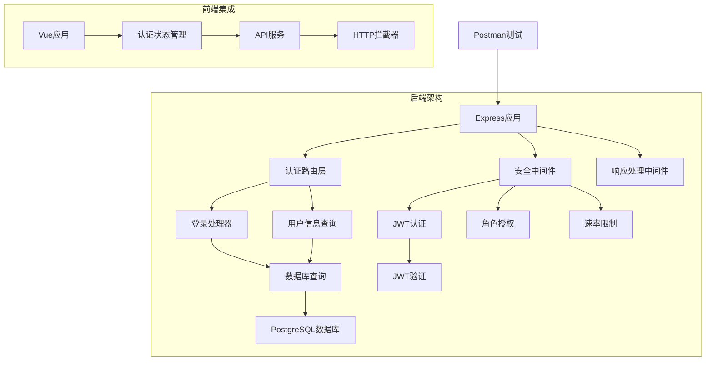
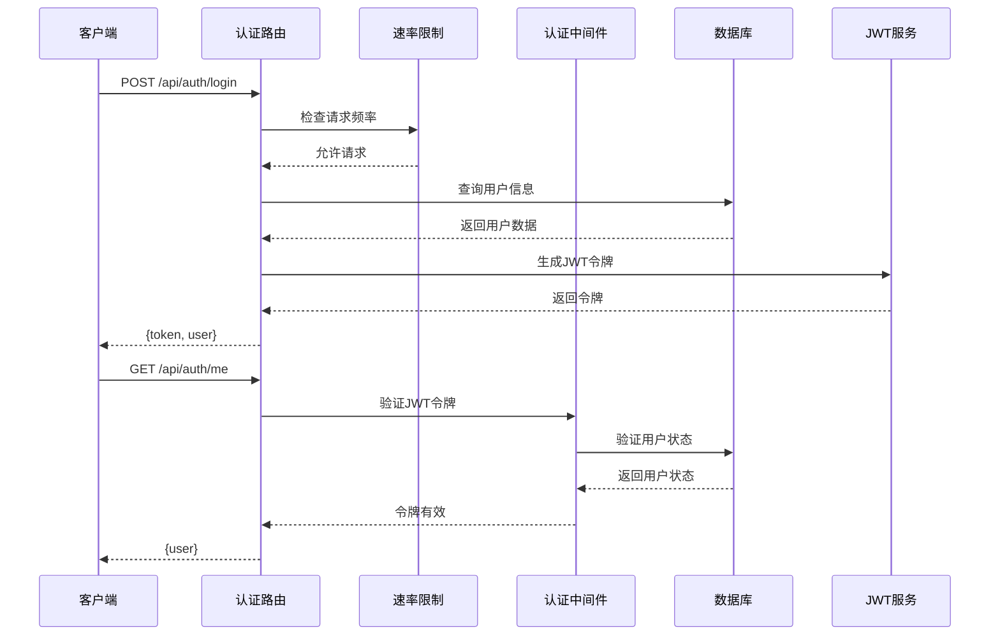
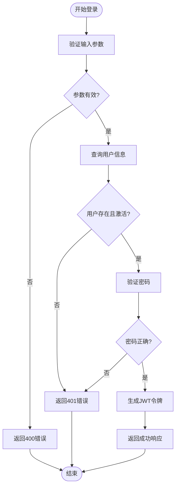
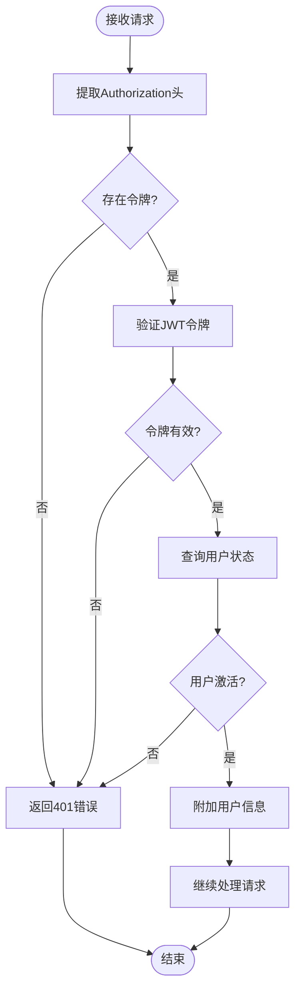
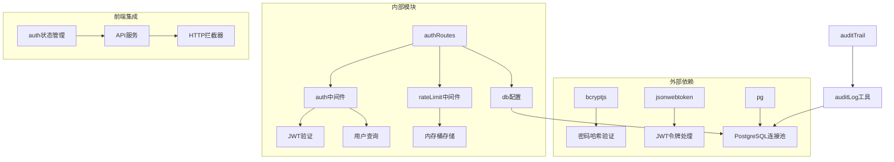

# 认证API

<cite>
**本文档引用的文件**
- [authRoutes.js](file://server/src/routes/authRoutes.js)
- [auth.js](file://server/src/middleware/auth.js)
- [rateLimit.js](file://server/src/middleware/rateLimit.js)
- [app.js](file://server/src/app.js)
- [db.js](file://server/src/config/db.js)
- [auditTrail.js](file://server/src/middleware/auditTrail.js)
- [response.js](file://server/src/middleware/response.js)
- [auditLog.js](file://server/src/utils/auditLog.js)
- [schema.sql](file://server/database/schema.sql)
- [auth.js](file://web/src/stores/auth.js)
- [api.js](file://web/src/services/api.js)
- [inventory_system_backend.postman_collection.json](file://postman/inventory_system_backend.postman_collection.json)
</cite>

## 目录
1. [简介](#简介)
2. [项目结构](#项目结构)
3. [核心组件](#核心组件)
4. [架构概览](#架构概览)
5. [详细组件分析](#详细组件分析)
6. [依赖关系分析](#依赖关系分析)
7. [性能考虑](#性能考虑)
8. [故障排除指南](#故障排除指南)
9. [结论](#结论)

## 简介

本文件为库存管理系统的认证API提供详细的文档说明。系统采用JWT（JSON Web Token）进行身份验证，结合密码哈希验证、速率限制和审计日志等安全机制，确保用户登录、登出和身份验证接口的安全性和可靠性。

认证系统主要包含以下功能：
- 用户登录与会话管理
- JWT令牌生成、验证和刷新
- 密码哈希验证
- 登录速率限制
- 权限检查和角色控制
- 审计日志记录

## 项目结构

认证系统在后端采用模块化设计，主要由路由层、中间件层和数据访问层组成：



**图表来源**
- [app.js:26-67](file://server/src/app.js#L26-L67)
- [authRoutes.js:8-72](file://server/src/routes/authRoutes.js#L8-L72)
- [auth.js:1-46](file://server/src/middleware/auth.js#L1-L46)

**章节来源**
- [app.js:26-67](file://server/src/app.js#L26-L67)
- [authRoutes.js:8-72](file://server/src/routes/authRoutes.js#L8-L72)

## 核心组件

### 认证路由层

认证路由层负责处理所有与用户认证相关的HTTP请求，包括登录、用户信息查询等功能。

### 安全中间件

安全中间件提供JWT认证、角色授权和速率限制等安全功能：
- JWT认证中间件：验证请求中的JWT令牌有效性
- 角色授权中间件：基于用户角色控制访问权限
- 速率限制中间件：防止暴力破解和DDoS攻击

### 数据访问层

数据访问层通过PostgreSQL连接池执行数据库操作，包括用户查询、审计日志写入等。

**章节来源**
- [authRoutes.js:16-72](file://server/src/routes/authRoutes.js#L16-L72)
- [auth.js:4-46](file://server/src/middleware/auth.js#L4-L46)
- [rateLimit.js:9-40](file://server/src/middleware/rateLimit.js#L9-L40)

## 架构概览

认证系统的整体架构采用分层设计，确保了安全性、可维护性和扩展性：



**图表来源**
- [authRoutes.js:17-69](file://server/src/routes/authRoutes.js#L17-L69)
- [auth.js:5-29](file://server/src/middleware/auth.js#L5-L29)

## 详细组件分析

### 登录接口

登录接口是认证系统的核心入口，负责验证用户凭据并颁发JWT令牌。

#### 接口规范

**请求方法**: POST
**路径**: `/api/auth/login`
**认证要求**: 无

**请求体参数**:
| 参数名 | 类型 | 必填 | 描述 |
|--------|------|------|------|
| email | string | 是 | 用户邮箱地址 |
| password | string | 是 | 用户密码 |

**响应体结构**:
```javascript
{
  "token": "string",           // JWT访问令牌
  "user": {
    "id": "integer",           // 用户ID
    "full_name": "string",     // 用户全名
    "email": "string",         // 用户邮箱
    "role": "string",          // 用户角色
    "preferred_currency": "string" // 用户偏好货币
  }
}
```

**状态码**:
- 200: 登录成功
- 400: 请求参数无效
- 401: 凭据无效或用户未激活
- 500: 服务器内部错误

#### 实现流程



**图表来源**
- [authRoutes.js:17-64](file://server/src/routes/authRoutes.js#L17-L64)

**章节来源**
- [authRoutes.js:17-64](file://server/src/routes/authRoutes.js#L17-L64)

### 用户信息查询接口

用户信息查询接口用于在页面刷新时恢复用户的登录状态。

#### 接口规范

**请求方法**: GET
**路径**: `/api/auth/me`
**认证要求**: 需要有效的JWT令牌

**请求头**:
- Authorization: Bearer {token}

**响应体**:
```javascript
{
  "user": {
    "id": "integer",
    "full_name": "string",
    "email": "string",
    "role": "string",
    "preferred_currency": "string"
  }
}
```

**状态码**:
- 200: 查询成功
- 401: 令牌无效或过期
- 403: 权限不足

**章节来源**
- [authRoutes.js:67-69](file://server/src/routes/authRoutes.js#L67-L69)

### JWT认证中间件

JWT认证中间件负责验证请求中的JWT令牌，并将用户信息注入到请求对象中。

#### 工作原理



**图表来源**
- [auth.js:5-29](file://server/src/middleware/auth.js#L5-L29)

**章节来源**
- [auth.js:5-29](file://server/src/middleware/auth.js#L5-L29)

### 速率限制中间件

速率限制中间件防止暴力破解和DDoS攻击，通过内存桶算法实现请求频率控制。

#### 配置参数

| 参数名 | 默认值 | 描述 |
|--------|--------|------|
| windowMs | 60000 | 时间窗口（毫秒） |
| max | 10 | 窗口内的最大请求数 |
| namespace | 'auth-login' | 速率限制命名空间 |

**章节来源**
- [rateLimit.js:9-35](file://server/src/middleware/rateLimit.js#L9-L35)

### 角色授权中间件

角色授权中间件基于用户角色控制访问权限，支持多角色白名单机制。

**章节来源**
- [auth.js:32-40](file://server/src/middleware/auth.js#L32-L40)

## 依赖关系分析

认证系统的依赖关系体现了清晰的分层架构：



**图表来源**
- [authRoutes.js:1-7](file://server/src/routes/authRoutes.js#L1-L7)
- [auth.js:1-2](file://server/src/middleware/auth.js#L1-L2)
- [rateLimit.js:1](file://server/src/middleware/rateLimit.js#L1)

**章节来源**
- [authRoutes.js:1-7](file://server/src/routes/authRoutes.js#L1-L7)
- [auth.js:1-2](file://server/src/middleware/auth.js#L1-L2)

## 性能考虑

### JWT令牌优化

系统采用8小时有效期的JWT令牌，平衡了安全性与用户体验。建议：
- 在高并发场景下考虑令牌缓存策略
- 定期轮换JWT密钥以增强安全性
- 考虑实现令牌撤销机制

### 数据库查询优化

用户查询操作包含索引优化：
- 用户邮箱字段建立唯一索引
- 审计日志表建立多个复合索引
- 使用连接池减少数据库连接开销

### 内存存储策略

速率限制使用内存桶存储，适用于单实例部署。对于集群部署：
- 考虑使用Redis等分布式缓存
- 实现令牌桶算法的分布式版本
- 设置合理的过期时间避免内存泄漏

## 故障排除指南

### 常见错误及解决方案

**401 未授权错误**
- 检查Authorization头格式是否正确
- 验证JWT令牌是否过期
- 确认用户账户是否激活

**403 权限不足**
- 验证用户角色是否具有相应权限
- 检查路由级权限中间件配置
- 确认角色授权列表包含当前用户角色

**429 请求过于频繁**
- 检查客户端重试逻辑
- 调整速率限制配置
- 实现指数退避策略

**500 服务器内部错误**
- 查看服务器日志获取详细错误信息
- 验证数据库连接配置
- 检查环境变量设置

### 调试技巧

1. **启用详细日志**：在开发环境中使用Morgan中间件查看请求日志
2. **检查令牌格式**：确保Authorization头格式为"Bearer {token}"
3. **验证数据库连接**：确认DATABASE_URL环境变量配置正确
4. **测试JWT密钥**：验证JWT_SECRET环境变量设置

**章节来源**
- [auth.js:10-28](file://server/src/middleware/auth.js#L10-L28)
- [rateLimit.js:23-29](file://server/src/middleware/rateLimit.js#L23-L29)

## 结论

本认证系统通过JWT令牌、密码哈希验证、速率限制和审计日志等多重安全机制，为库存管理系统提供了可靠的身份验证和授权服务。系统架构清晰、组件职责明确，既满足了功能需求又兼顾了安全性和性能。

建议后续改进方向：
1. 实现JWT令牌撤销机制
2. 添加双因素认证支持
3. 优化前端认证状态管理
4. 增强错误处理和监控告警
5. 考虑实现OAuth2.0协议支持