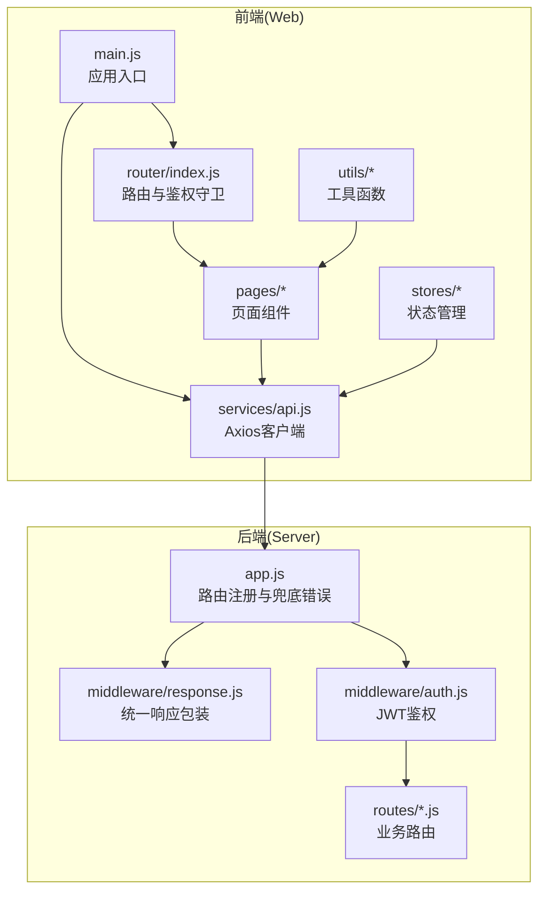
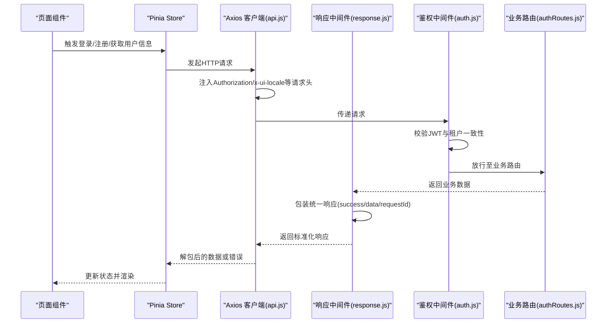
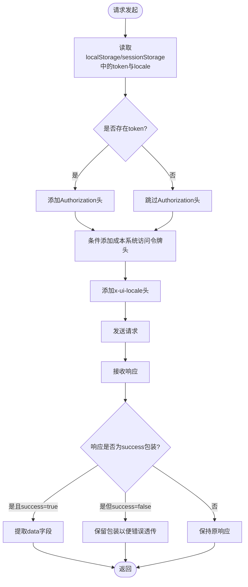
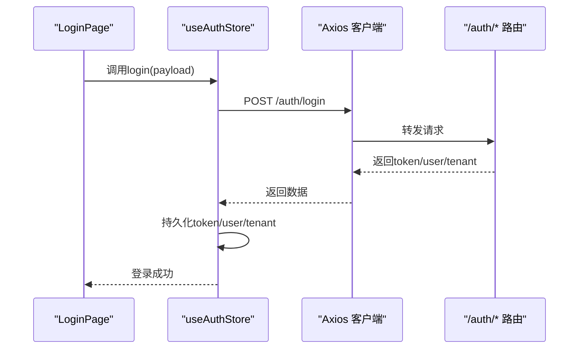
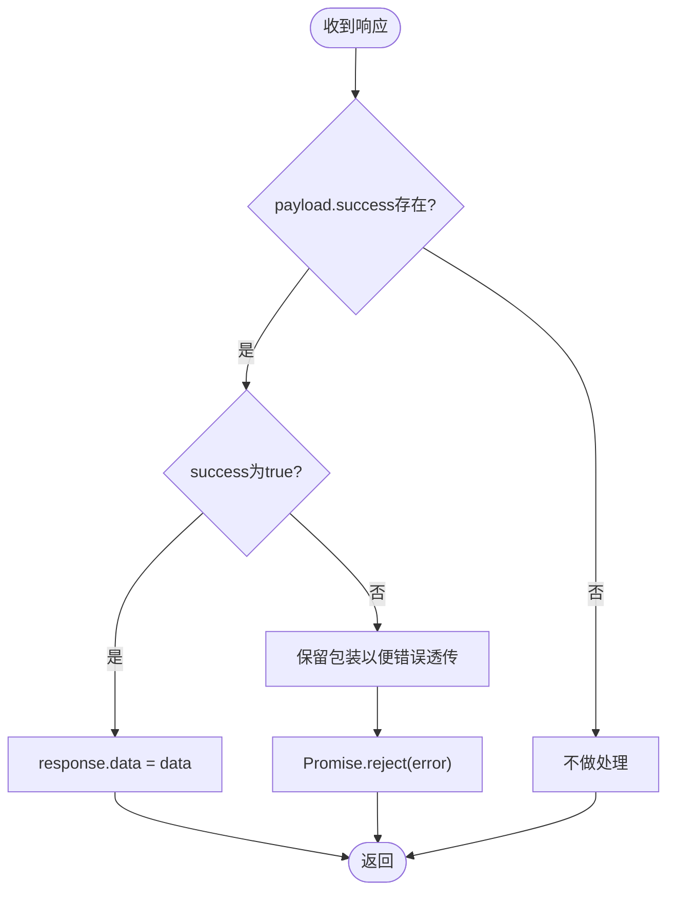
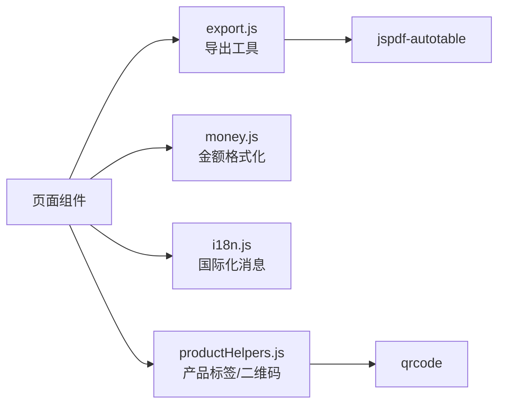
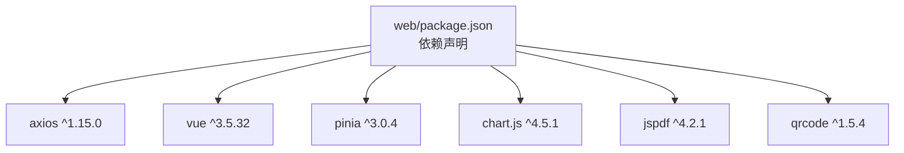

# API客户端与集成

<cite>
**本文档引用的文件**
- [web/src/services/api.js](file://web/src/services/api.js)
- [web/src/stores/auth.js](file://web/src/stores/auth.js)
- [web/src/stores/notifications.js](file://web/src/stores/notifications.js)
- [web/src/stores/currency.js](file://web/src/stores/currency.js)
- [web/src/stores/locale.js](file://web/src/stores/locale.js)
- [web/src/utils/export.js](file://web/src/utils/export.js)
- [web/src/utils/money.js](file://web/src/utils/money.js)
- [web/src/utils/i18n.js](file://web/src/utils/i18n.js)
- [web/src/utils/productHelpers.js](file://web/src/utils/productHelpers.js)
- [web/src/pages/LoginPage.vue](file://web/src/pages/LoginPage.vue)
- [web/src/router/index.js](file://web/src/router/index.js)
- [web/src/main.js](file://web/src/main.js)
- [server/src/middleware/response.js](file://server/src/middleware/response.js)
- [server/src/middleware/auth.js](file://server/src/middleware/auth.js)
- [server/src/routes/authRoutes.js](file://server/src/routes/authRoutes.js)
- [server/src/app.js](file://server/src/app.js)
- [web/package.json](file://web/package.json)
</cite>

## 目录
1. [简介](#简介)
2. [项目结构](#项目结构)
3. [核心组件](#核心组件)
4. [架构总览](#架构总览)
5. [详细组件分析](#详细组件分析)
6. [依赖关系分析](#依赖关系分析)
7. [性能考虑](#性能考虑)
8. [故障排查指南](#故障排查指南)
9. [结论](#结论)
10. [附录](#附录)

## 简介
本文件面向前端开发者与集成工程师，系统性阐述基于 Axios 的 API 客户端配置与使用方式，涵盖统一请求配置、响应拦截器设计、认证状态与 API 请求集成、数据导出与格式化工具、错误处理策略以及最佳实践与性能优化建议。文档同时结合后端中间件与路由层的约定，帮助读者建立从前端到后端的完整调用链路认知。

## 项目结构
前端采用 Vue 3 + Pinia 架构，API 客户端集中于 services 层，业务状态集中在 stores，通用工具位于 utils。路由层负责鉴权守卫与页面导航。

**图表来源**
- [web/src/main.js:1-14](file://web/src/main.js#L1-L14)
- [web/src/router/index.js:1-209](file://web/src/router/index.js#L1-L209)
- [web/src/services/api.js:1-45](file://web/src/services/api.js#L1-L45)
- [server/src/app.js:60-90](file://server/src/app.js#L60-L90)
- [server/src/middleware/response.js:1-61](file://server/src/middleware/response.js#L1-L61)
- [server/src/middleware/auth.js:1-38](file://server/src/middleware/auth.js#L1-L38)

**章节来源**
- [web/src/main.js:1-14](file://web/src/main.js#L1-L14)
- [web/src/router/index.js:1-209](file://web/src/router/index.js#L1-L209)
- [web/src/services/api.js:1-45](file://web/src/services/api.js#L1-L45)
- [server/src/app.js:60-90](file://server/src/app.js#L60-L90)

## 核心组件
- Axios 客户端封装：统一基础 URL、请求头注入、响应体解包与错误消息透传。
- 认证状态管理：登录、注册、拉取用户信息、清理会话，持久化 token 与用户信息。
- 通知与货币/语言本地化：通知列表、未读计数、货币单位与界面语言切换。
- 数据导出与格式化：CSV/PDF/JSON 导出、金额格式化、国际化文案。
- 页面与路由集成：登录页发起 API 调用，路由守卫基于本地存储进行鉴权判断。

**章节来源**
- [web/src/services/api.js:1-45](file://web/src/services/api.js#L1-L45)
- [web/src/stores/auth.js:1-120](file://web/src/stores/auth.js#L1-L120)
- [web/src/stores/notifications.js:1-52](file://web/src/stores/notifications.js#L1-L52)
- [web/src/stores/currency.js:1-21](file://web/src/stores/currency.js#L1-L21)
- [web/src/stores/locale.js:1-38](file://web/src/stores/locale.js#L1-L38)
- [web/src/utils/export.js:1-91](file://web/src/utils/export.js#L1-L91)
- [web/src/utils/money.js:1-16](file://web/src/utils/money.js#L1-L16)
- [web/src/utils/i18n.js:1-189](file://web/src/utils/i18n.js#L1-L189)
- [web/src/pages/LoginPage.vue:1-320](file://web/src/pages/LoginPage.vue#L1-L320)

## 架构总览
下图展示从前端 Axios 客户端到后端中间件与路由的整体调用流程，包括请求头注入、响应体包装与错误透传。

**图表来源**
- [web/src/services/api.js:7-24](file://web/src/services/api.js#L7-L24)
- [web/src/stores/auth.js:53-106](file://web/src/stores/auth.js#L53-L106)
- [server/src/middleware/response.js:3-34](file://server/src/middleware/response.js#L3-L34)
- [server/src/middleware/auth.js:5-38](file://server/src/middleware/auth.js#L5-L38)
- [server/src/routes/authRoutes.js:174-179](file://server/src/routes/authRoutes.js#L174-L179)

## 详细组件分析

### Axios 客户端与统一配置
- 基础 URL：通过环境变量注入，开发默认为 /api。
- 请求头注入：自动附加 Authorization、成本系统访问令牌、UI 语言标识。
- 响应拦截：对后端统一包装的响应进行解包；若后端返回错误包装，将 message 透传到前端错误对象。

**图表来源**
- [web/src/services/api.js:3-5](file://web/src/services/api.js#L3-L5)
- [web/src/services/api.js:8-24](file://web/src/services/api.js#L8-L24)
- [web/src/services/api.js:26-42](file://web/src/services/api.js#L26-L42)

**章节来源**
- [web/src/services/api.js:1-45](file://web/src/services/api.js#L1-L45)

### 认证状态与API集成
- 登录/注册：通过 store 调用 /auth/login 与 /auth/register-tenant，成功后持久化 token、用户与租户信息，并联动货币与通知初始化。
- 获取当前用户：/auth/me 接口用于刷新页面恢复登录态，失败时清理本地状态。
- 路由守卫：基于本地存储判断是否需要登录或角色限制，未登录重定向至登录页。

**图表来源**
- [web/src/pages/LoginPage.vue:73-90](file://web/src/pages/LoginPage.vue#L73-L90)
- [web/src/stores/auth.js:53-67](file://web/src/stores/auth.js#L53-L67)
- [server/src/routes/authRoutes.js:174-179](file://server/src/routes/authRoutes.js#L174-L179)

**章节来源**
- [web/src/stores/auth.js:1-120](file://web/src/stores/auth.js#L1-L120)
- [web/src/pages/LoginPage.vue:1-320](file://web/src/pages/LoginPage.vue#L1-L320)
- [web/src/router/index.js:187-206](file://web/src/router/index.js#L187-L206)

### 响应拦截器与错误处理策略
- 成功响应：当后端返回 success=true 时，拦截器自动提取 data 字段，简化前端取值。
- 错误响应：当后端返回 success=false 时，拦截器将 message 提升到 error.message，便于统一捕获与提示。
- 后端约定：响应中间件统一包装 success/data/requestId，错误时包含 code/message/details。

**图表来源**
- [web/src/services/api.js:26-42](file://web/src/services/api.js#L26-L42)
- [server/src/middleware/response.js:9-34](file://server/src/middleware/response.js#L9-L34)

**章节来源**
- [web/src/services/api.js:26-42](file://web/src/services/api.js#L26-L42)
- [server/src/middleware/response.js:1-61](file://server/src/middleware/response.js#L1-L61)

### 数据导出与格式化工具
- 导出：支持 CSV、PDF、JSON 三种格式；打印 HTML 文档；批量生成产品二维码标签并导出 PDF。
- 金额格式化：根据币种与语言环境使用 Intl.NumberFormat 进行货币格式化。
- 国际化：提供英文与中文键值映射，支持运行时切换语言并回退逻辑。

**图表来源**
- [web/src/utils/export.js:1-91](file://web/src/utils/export.js#L1-L91)
- [web/src/utils/money.js:1-16](file://web/src/utils/money.js#L1-L16)
- [web/src/utils/i18n.js:1-189](file://web/src/utils/i18n.js#L1-L189)
- [web/src/utils/productHelpers.js:1-196](file://web/src/utils/productHelpers.js#L1-L196)

**章节来源**
- [web/src/utils/export.js:1-91](file://web/src/utils/export.js#L1-L91)
- [web/src/utils/money.js:1-16](file://web/src/utils/money.js#L1-L16)
- [web/src/utils/i18n.js:1-189](file://web/src/utils/i18n.js#L1-L189)
- [web/src/utils/productHelpers.js:1-196](file://web/src/utils/productHelpers.js#L1-L196)

### 通知与本地化集成
- 通知：拉取未读通知列表，标记已读并维护未读计数；登录后自动刷新。
- 货币：根据用户偏好设置货币单位，持久化到本地存储。
- 语言：切换/en/cn，回退到英文，提供 t(key) 查询本地化文本。

**章节来源**
- [web/src/stores/notifications.js:1-52](file://web/src/stores/notifications.js#L1-L52)
- [web/src/stores/currency.js:1-21](file://web/src/stores/currency.js#L1-L21)
- [web/src/stores/locale.js:1-38](file://web/src/stores/locale.js#L1-L38)

## 依赖关系分析
- Axios 版本：1.x，提供拦截器与请求/响应处理能力。
- 前端依赖：Vue 3、Pinia、Vue Router、axios、chart.js、jspdf、qrcode 等。
- 后端中间件：统一响应包装与 JWT 鉴权，确保前后端契约一致。

**图表来源**
- [web/package.json:12-22](file://web/package.json#L12-L22)

**章节来源**
- [web/package.json:1-34](file://web/package.json#L1-L34)

## 性能考虑
- 减少重复请求：在页面级或 store 中对相同参数的请求进行缓存，避免短时间内重复触发。
- 批量导出：导出工具按需异步加载 jspdf 与插件，降低首屏体积。
- 本地化与格式化：金额格式化与国际化查询基于本地存储与预置映射，减少网络开销。
- 路由守卫：基于本地存储快速判定登录状态，避免不必要的网络请求。
- 建议：对高频接口增加防抖/节流，对大列表分页加载，对图片/二维码生成进行懒加载与缓存复用。

## 故障排查指南
- 登录失败：检查后端 /auth/login 是否返回标准包装；前端 LoginPage 捕获 error.response.data.message 并展示。
- 未登录跳转：路由守卫检测 localStorage 中 token，缺失则强制跳转登录。
- 通知未刷新：确认登录后调用通知 store 的 refresh 方法；检查 /notifications 接口返回结构。
- 金额/语言异常：检查本地存储中的 preferred_currency 与 inventory_locale；确认 money.js 与 locale store 的回退逻辑。
- 后端错误：后端响应中间件会将错误包装为统一格式，前端拦截器会透传 message；可在页面弹窗或全局通知中展示。

**章节来源**
- [web/src/pages/LoginPage.vue:73-90](file://web/src/pages/LoginPage.vue#L73-L90)
- [web/src/router/index.js:187-206](file://web/src/router/index.js#L187-L206)
- [web/src/stores/notifications.js:13-25](file://web/src/stores/notifications.js#L13-L25)
- [web/src/stores/currency.js:8-14](file://web/src/stores/currency.js#L8-L14)
- [web/src/stores/locale.js:21-29](file://web/src/stores/locale.js#L21-L29)
- [server/src/middleware/response.js:9-34](file://server/src/middleware/response.js#L9-L34)

## 结论
本项目通过 Axios 客户端与 Pinia 状态管理实现了统一的 API 调用与认证集成，配合后端响应中间件与 JWT 鉴权，形成前后端一致的契约与错误处理机制。数据导出与格式化工具进一步提升了用户体验。建议在实际生产中补充请求缓存与重复请求防抖策略，并持续优化大列表与媒体资源的加载性能。

## 附录
- 环境变量：VITE_API_URL 用于覆盖基础 URL，默认 /api。
- 常用接口路径：/auth/login、/auth/register-tenant、/auth/me、/notifications、/marketplace/oauth/{channel}/start 等。
- 本地存储键名：inventory_token、inventory_user、inventory_tenant、inventory_locale、inventory_currency 等。