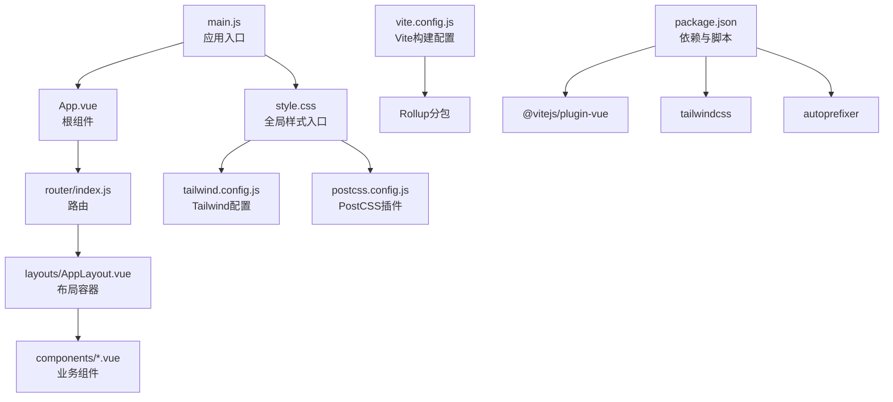
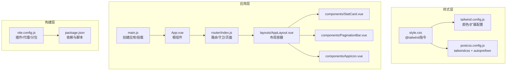
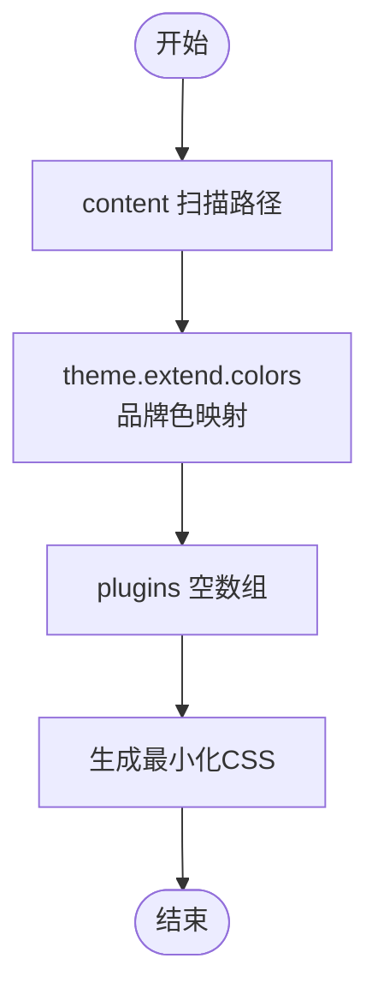
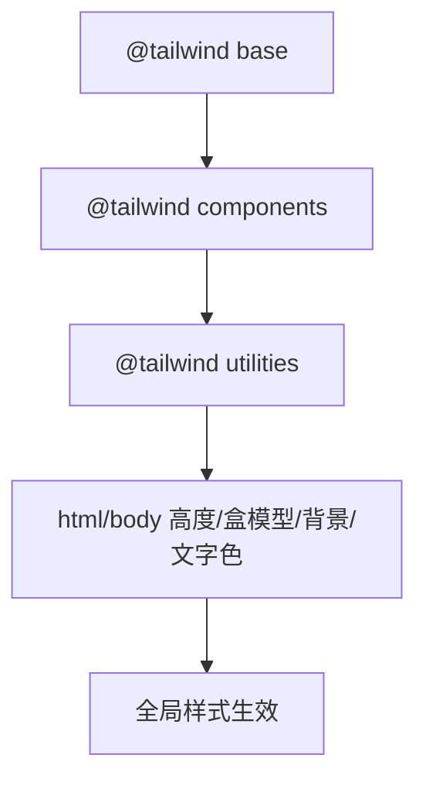
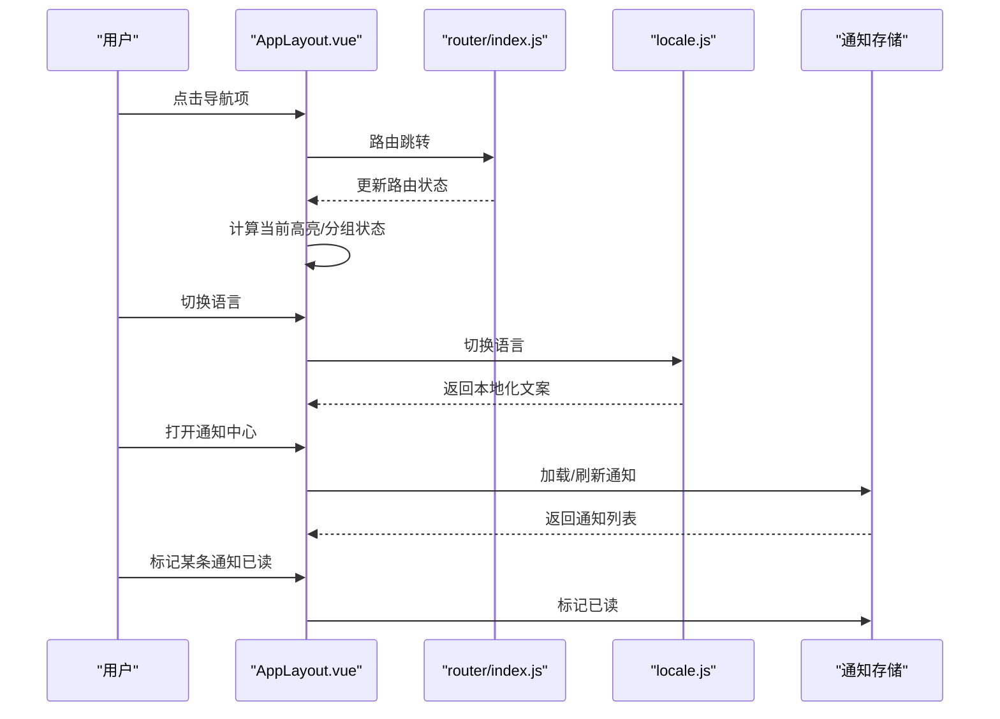
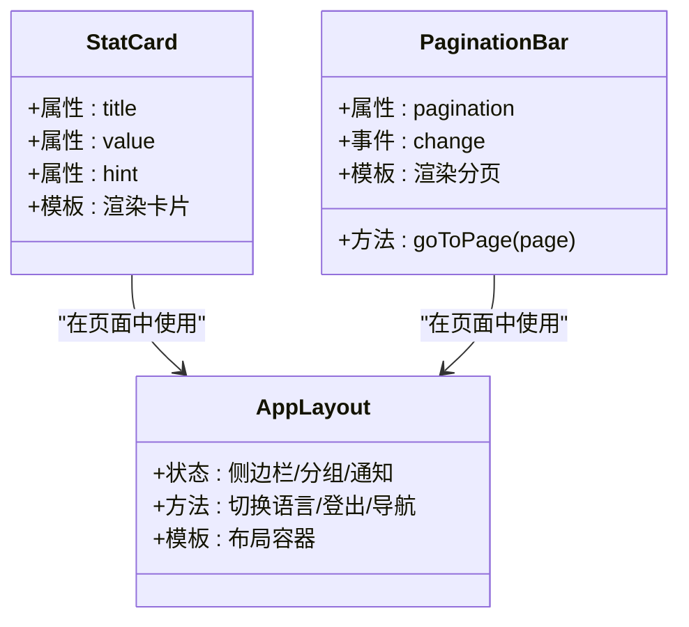
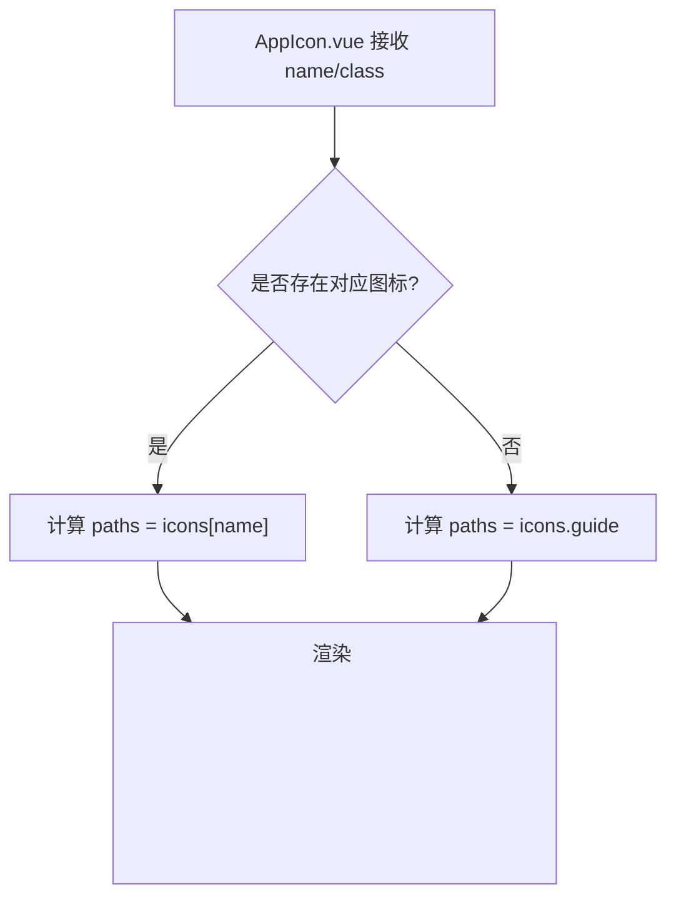
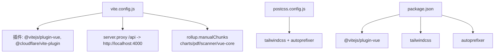
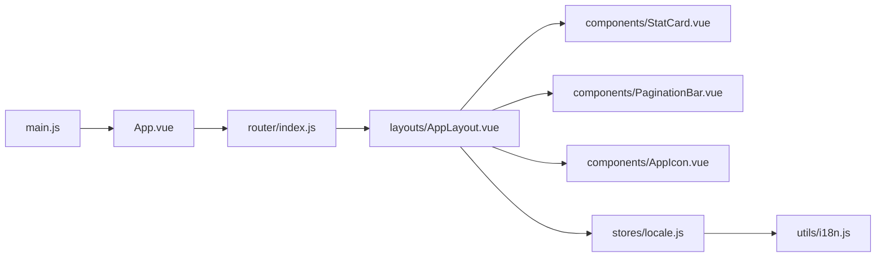

# UI设计系统

<cite>
**本文引用的文件**
- [tailwind.config.js](file://web/tailwind.config.js)
- [postcss.config.js](file://web/postcss.config.js)
- [vite.config.js](file://web/vite.config.js)
- [style.css](file://web/src/style.css)
- [main.js](file://web/src/main.js)
- [App.vue](file://web/src/App.vue)
- [AppLayout.vue](file://web/src/layouts/AppLayout.vue)
- [StatCard.vue](file://web/src/components/StatCard.vue)
- [PaginationBar.vue](file://web/src/components/PaginationBar.vue)
- [AppIcon.vue](file://web/src/components/AppIcon.vue)
- [locale.js](file://web/src/stores/locale.js)
- [i18n.js](file://web/src/utils/i18n.js)
- [router/index.js](file://web/src/router/index.js)
- [package.json](file://web/package.json)
</cite>

## 目录
1. [简介](#简介)
2. [项目结构](#项目结构)
3. [核心组件](#核心组件)
4. [架构总览](#架构总览)
5. [详细组件分析](#详细组件分析)
6. [依赖关系分析](#依赖关系分析)
7. [性能考量](#性能考量)
8. [故障排查指南](#故障排查指南)
9. [结论](#结论)
10. [附录](#附录)

## 简介
本文件系统性梳理该库存管理前端的UI设计系统，围绕Tailwind CSS配置与自定义、颜色与字体体系、间距与排版规范、模块化样式组织、响应式设计策略、主题与暗色模式支持、动画与过渡规范、图标系统与SVG使用、移动端适配与断点策略、样式开发规范与命名约定，以及构建配置中的样式处理与优化策略进行说明。目标是帮助开发者与设计师在保持一致性的前提下高效扩展与维护界面。

## 项目结构
前端位于 web 目录，采用 Vue 3 + Vite 架构，样式通过 Tailwind CSS 按需生成，PostCSS 负责编译与自动前缀，构建时通过 Rollup 进行分包优化。

**图表来源**
- [main.js:1-14](file://web/src/main.js#L1-L14)
- [App.vue:1-9](file://web/src/App.vue#L1-L9)
- [router/index.js:1-209](file://web/src/router/index.js#L1-L209)
- [AppLayout.vue:1-831](file://web/src/layouts/AppLayout.vue#L1-L831)
- [style.css:1-18](file://web/src/style.css#L1-L18)
- [tailwind.config.js:1-18](file://web/tailwind.config.js#L1-L18)
- [postcss.config.js:1-7](file://web/postcss.config.js#L1-L7)
- [vite.config.js:1-46](file://web/vite.config.js#L1-L46)
- [package.json:1-34](file://web/package.json#L1-L34)

**章节来源**
- [main.js:1-14](file://web/src/main.js#L1-L14)
- [style.css:1-18](file://web/src/style.css#L1-L18)
- [tailwind.config.js:1-18](file://web/tailwind.config.js#L1-L18)
- [postcss.config.js:1-7](file://web/postcss.config.js#L1-L7)
- [vite.config.js:1-46](file://web/vite.config.js#L1-L46)
- [package.json:1-34](file://web/package.json#L1-L34)

## 核心组件
- 全局样式入口：通过全局样式文件引入 Tailwind 的 base、components、utilities 三段，统一基础排版与默认样式。
- 布局容器：AppLayout 提供导航、面包屑、通知中心、侧边栏等通用布局能力，贯穿各页面。
- 业务组件：如统计卡片、分页条等，遵循统一的间距、边框、阴影与颜色体系。
- 图标系统：AppIcon 将语义化的图标名映射为 SVG 路径，保证尺寸与描边一致性。
- 国际化与本地化：locale store 与 i18n 工具配合，支撑中英双语界面文本与文案。

**章节来源**
- [style.css:1-18](file://web/src/style.css#L1-L18)
- [AppLayout.vue:1-831](file://web/src/layouts/AppLayout.vue#L1-L831)
- [StatCard.vue:1-16](file://web/src/components/StatCard.vue#L1-L16)
- [PaginationBar.vue:1-51](file://web/src/components/PaginationBar.vue#L1-L51)
- [AppIcon.vue:1-49](file://web/src/components/AppIcon.vue#L1-L49)
- [locale.js:1-38](file://web/src/stores/locale.js#L1-L38)
- [i18n.js:1-189](file://web/src/utils/i18n.js#L1-L189)

## 架构总览
UI设计系统以 Tailwind CSS 为核心样式引擎，结合 PostCSS 自动前缀与浏览器兼容，通过 Vite 构建时进行资源打包与分包优化。全局样式文件集中引入 Tailwind 指令，确保按需生成与最小体积输出。布局层负责导航、通知、用户动作与响应式交互，业务组件遵循统一的视觉与交互规范。

**图表来源**
- [tailwind.config.js:1-18](file://web/tailwind.config.js#L1-L18)
- [postcss.config.js:1-7](file://web/postcss.config.js#L1-L7)
- [style.css:1-18](file://web/src/style.css#L1-L18)
- [main.js:1-14](file://web/src/main.js#L1-L14)
- [App.vue:1-9](file://web/src/App.vue#L1-L9)
- [router/index.js:1-209](file://web/src/router/index.js#L1-L209)
- [AppLayout.vue:1-831](file://web/src/layouts/AppLayout.vue#L1-L831)
- [StatCard.vue:1-16](file://web/src/components/StatCard.vue#L1-L16)
- [PaginationBar.vue:1-51](file://web/src/components/PaginationBar.vue#L1-L51)
- [AppIcon.vue:1-49](file://web/src/components/AppIcon.vue#L1-L49)
- [vite.config.js:1-46](file://web/vite.config.js#L1-L46)
- [package.json:1-34](file://web/package.json#L1-L34)

## 详细组件分析

### Tailwind 配置与自定义
- 内容扫描范围：包含 HTML 与所有 Vue/JS/TS 文件，确保按需生成类。
- 主题扩展：新增品牌色空间，覆盖浅色到深色的多阶映射，便于在不同背景与对比度场景下使用。
- 插件：当前未启用额外插件，保持构建简洁与可控。

**图表来源**
- [tailwind.config.js:1-18](file://web/tailwind.config.js#L1-L18)

**章节来源**
- [tailwind.config.js:1-18](file://web/tailwind.config.js#L1-L18)

### 全局样式与基础排版
- 引入 Tailwind 三段：base、components、utilities，确保基础元素与工具类的一致性。
- 页面基础：重置 html/body 高度，统一 body 背景色与文字色，统一盒模型为 border-box。

**图表来源**
- [style.css:1-18](file://web/src/style.css#L1-L18)

**章节来源**
- [style.css:1-18](file://web/src/style.css#L1-L18)

### 布局容器与导航体系
- 导航模式：支持 sidebar 与 navbar 两种模式，移动端与桌面端分别渲染不同结构。
- 侧边栏：支持折叠、分组展开、高亮当前路由、用户动作开关与本地持久化。
- 顶部导航：移动端以折叠分组为主，桌面端以悬浮面板与面包屑为主。
- 通知中心：支持未读计数、刷新、标记已读、跳转至提醒中心。
- 用户信息：支持语言切换、登出、角色与头像占位。

**图表来源**
- [AppLayout.vue:1-831](file://web/src/layouts/AppLayout.vue#L1-L831)
- [router/index.js:1-209](file://web/src/router/index.js#L1-L209)
- [locale.js:1-38](file://web/src/stores/locale.js#L1-L38)

**章节来源**
- [AppLayout.vue:1-831](file://web/src/layouts/AppLayout.vue#L1-L831)
- [router/index.js:1-209](file://web/src/router/index.js#L1-L209)
- [locale.js:1-38](file://web/src/stores/locale.js#L1-L38)

### 业务组件与样式组织
- 统计卡片：统一圆角、边框、背景与层级，标题/数值/提示文本的排版与字号规范。
- 分页条：统一分隔线、按钮状态、禁用态与交互反馈，国际化文案随语言切换。

**图表来源**
- [StatCard.vue:1-16](file://web/src/components/StatCard.vue#L1-L16)
- [PaginationBar.vue:1-51](file://web/src/components/PaginationBar.vue#L1-L51)
- [AppLayout.vue:1-831](file://web/src/layouts/AppLayout.vue#L1-L831)

**章节来源**
- [StatCard.vue:1-16](file://web/src/components/StatCard.vue#L1-L16)
- [PaginationBar.vue:1-51](file://web/src/components/PaginationBar.vue#L1-L51)

### 图标系统与SVG使用
- 语义化图标名：如 dashboard、alerts、inventory、chevronLeft、menu、bell、x 等。
- 统一尺寸与描边：固定 viewBox 与 stroke-width，保证在不同字号下的一致性。
- 动态渲染：根据传入 name 渲染对应路径集合，缺失时回退到默认图标。

**图表来源**
- [AppIcon.vue:1-49](file://web/src/components/AppIcon.vue#L1-L49)

**章节来源**
- [AppIcon.vue:1-49](file://web/src/components/AppIcon.vue#L1-L49)

### 国际化与文案
- 本地存储键：使用 inventory_locale 存储语言偏好。
- 文案映射：en/cn 双语键值，t 函数优先取当前语言，不存在则回退到 en 或返回占位。
- 布局与页面：导航、面包屑、按钮、提示等均通过 locale store 获取本地化文本。

**章节来源**
- [locale.js:1-38](file://web/src/stores/locale.js#L1-L38)
- [i18n.js:1-189](file://web/src/utils/i18n.js#L1-L189)

### 主题与暗色模式支持
- 当前主题：系统采用浅色背景与深色文字的明暗搭配，未检测到显式的暗色模式开关逻辑。
- 建议：可在 tailwind.config.js 中扩展 darkMode 选项（如使用类选择器），并在布局层增加主题切换入口，将主题状态写入本地存储并同步到 DOM 类。

[本节为概念性建议，不直接分析具体文件，故无章节来源]

### 动画与过渡效果
- 移动端菜单：侧滑进入/退出，使用 translate-x 控制位移与 transition-duration。
- 导航高亮：使用 transition 与 transform 实现平滑的激活态与阴影变化。
- 通知面板：绝对定位与 z-index 管理，hover/active 状态下的透明度与背景变化。

**章节来源**
- [AppLayout.vue:376-454](file://web/src/layouts/AppLayout.vue#L376-L454)
- [AppLayout.vue:500-525](file://web/src/layouts/AppLayout.vue#L500-L525)
- [AppLayout.vue:715-794](file://web/src/layouts/AppLayout.vue#L715-L794)

### 响应式设计与断点策略
- 断点：以 lg（1024px）为分界，移动端使用抽屉式侧边栏与折叠导航，桌面端展示完整侧边栏与顶部导航。
- 视口：移动端头部与面包屑在 lg 以下隐藏，lg 以上展示。
- 交互：窗口 resize 时自动关闭移动端菜单，避免遮挡。

**章节来源**
- [AppLayout.vue:279-283](file://web/src/layouts/AppLayout.vue#L279-L283)
- [AppLayout.vue:368-374](file://web/src/layouts/AppLayout.vue#L368-L374)
- [AppLayout.vue:563-627](file://web/src/layouts/AppLayout.vue#L563-L627)
- [AppLayout.vue:629-795](file://web/src/layouts/AppLayout.vue#L629-L795)

### 样式开发规范与命名约定
- 颜色：优先使用 Tailwind 默认色板与品牌色空间，避免硬编码十六进制。
- 圆角/边框/阴影：统一使用 rounded-*、border-*、shadow-* 修饰，保持视觉一致性。
- 间距：使用 p-/m- 与 space-/gap- 系列，遵循紧凑到宽松的层级。
- 布局：flex/grid 使用语义化命名，如 “grid-cols-[1fr_360px]” 表示主侧栏两列布局。
- 可访问性：保持足够的对比度，避免纯色背景上的纯黑/白文本。

[本节为通用规范总结，不直接分析具体文件，故无章节来源]

### 构建配置与样式优化
- 插件：Vue 插件与 Cloudflare Worker 开发插件。
- 代理：开发服务器代理 /api 到后端服务。
- 分包：针对 chart.js、vue-chartjs、jspdf、@zxing/browser 等第三方库进行手动分包，提升缓存命中与首屏性能。
- PostCSS：tailwindcss 与 autoprefixer 自动注入与补齐浏览器前缀。

**图表来源**
- [vite.config.js:1-46](file://web/vite.config.js#L1-L46)
- [postcss.config.js:1-7](file://web/postcss.config.js#L1-L7)
- [package.json:1-34](file://web/package.json#L1-L34)

**章节来源**
- [vite.config.js:1-46](file://web/vite.config.js#L1-L46)
- [postcss.config.js:1-7](file://web/postcss.config.js#L1-L7)
- [package.json:1-34](file://web/package.json#L1-L34)

## 依赖关系分析
- 应用入口依赖路由与状态管理，统一挂载后渲染根组件。
- 根组件承载路由视图与全局 Toast 容器。
- 布局容器依赖路由、认证与通知状态，承担导航与交互。
- 业务组件依赖布局容器与国际化工具，形成页面级复用。

**图表来源**
- [main.js:1-14](file://web/src/main.js#L1-L14)
- [App.vue:1-9](file://web/src/App.vue#L1-L9)
- [router/index.js:1-209](file://web/src/router/index.js#L1-L209)
- [AppLayout.vue:1-831](file://web/src/layouts/AppLayout.vue#L1-L831)
- [StatCard.vue:1-16](file://web/src/components/StatCard.vue#L1-L16)
- [PaginationBar.vue:1-51](file://web/src/components/PaginationBar.vue#L1-L51)
- [AppIcon.vue:1-49](file://web/src/components/AppIcon.vue#L1-L49)
- [locale.js:1-38](file://web/src/stores/locale.js#L1-L38)
- [i18n.js:1-189](file://web/src/utils/i18n.js#L1-L189)

**章节来源**
- [main.js:1-14](file://web/src/main.js#L1-L14)
- [App.vue:1-9](file://web/src/App.vue#L1-L9)
- [router/index.js:1-209](file://web/src/router/index.js#L1-L209)
- [AppLayout.vue:1-831](file://web/src/layouts/AppLayout.vue#L1-L831)
- [StatCard.vue:1-16](file://web/src/components/StatCard.vue#L1-L16)
- [PaginationBar.vue:1-51](file://web/src/components/PaginationBar.vue#L1-L51)
- [AppIcon.vue:1-49](file://web/src/components/AppIcon.vue#L1-L49)
- [locale.js:1-38](file://web/src/stores/locale.js#L1-L38)
- [i18n.js:1-189](file://web/src/utils/i18n.js#L1-L189)

## 性能考量
- 按需生成：Tailwind content 扫描确保仅生成实际使用的类，减少 CSS 体积。
- 分包策略：将图表、PDF、扫码等大依赖拆分为独立 chunk，降低首屏 JS 体积。
- 缓存友好：第三方库独立 chunk 提升浏览器缓存命中率。
- 构建优化：PostCSS 自动前缀减少手写兼容性代码，缩短构建时间。

[本节提供通用指导，不直接分析具体文件，故无章节来源]

## 故障排查指南
- 样式未生效
  - 检查全局样式是否正确引入 Tailwind 指令。
  - 确认 tailwind.config.js 的 content 路径包含当前页面文件。
- 图标不显示
  - 确认传入的图标 name 是否存在于映射表。
  - 检查 SVG 容器的 class 与 stroke-width 是否被覆盖。
- 响应式异常
  - 检查断点条件与移动端菜单开关逻辑。
  - 确认 resize 事件监听是否正常移除。
- 国际化文案不切换
  - 检查本地存储键与 locale store 的 setLocale/toggleLocale 方法。
  - 确认 t 函数回退逻辑与 i18n 键值存在性。

**章节来源**
- [style.css:1-18](file://web/src/style.css#L1-L18)
- [tailwind.config.js:1-18](file://web/tailwind.config.js#L1-L18)
- [AppIcon.vue:1-49](file://web/src/components/AppIcon.vue#L1-L49)
- [AppLayout.vue:279-283](file://web/src/layouts/AppLayout.vue#L279-L283)
- [locale.js:1-38](file://web/src/stores/locale.js#L1-L38)
- [i18n.js:1-189](file://web/src/utils/i18n.js#L1-L189)

## 结论
该 UI 设计系统以 Tailwind CSS 为核心，结合 PostCSS 与 Vite 构建链路，实现了清晰的样式组织、良好的响应式体验与可扩展的图标系统。通过布局容器与业务组件的分层设计，以及国际化与路由守卫的协同，整体具备较强的可维护性与扩展性。建议后续补充暗色模式支持与更完善的动画规范，以进一步提升用户体验。

## 附录
- 关键文件路径与职责概览
  - tailwind.config.js：Tailwind 配置与颜色扩展
  - postcss.config.js：PostCSS 插件配置
  - vite.config.js：Vite 插件、代理与分包策略
  - style.css：全局样式入口与基础排版
  - main.js：应用入口与插件挂载
  - App.vue：根组件与全局 Toast 容器
  - AppLayout.vue：布局容器与导航体系
  - StatCard.vue / PaginationBar.vue：业务组件示例
  - AppIcon.vue：图标系统
  - locale.js / i18n.js：国际化与本地化
  - router/index.js：路由守卫与页面映射
  - package.json：依赖与构建脚本

[本节为概览性汇总，不直接分析具体文件，故无章节来源]