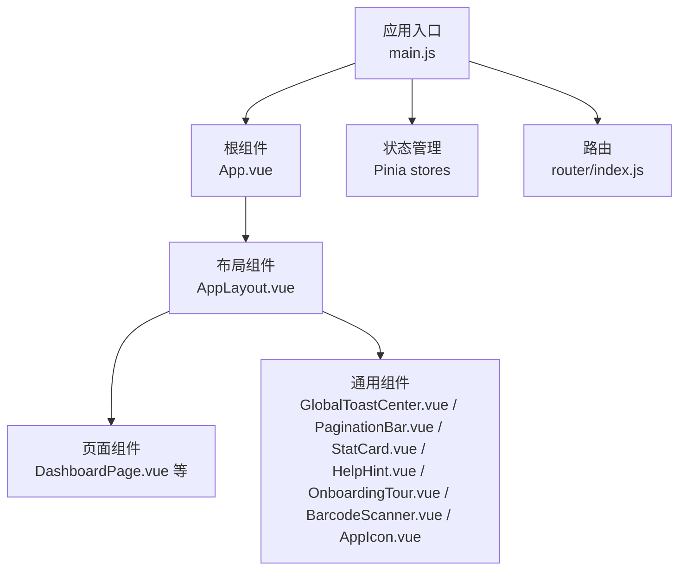
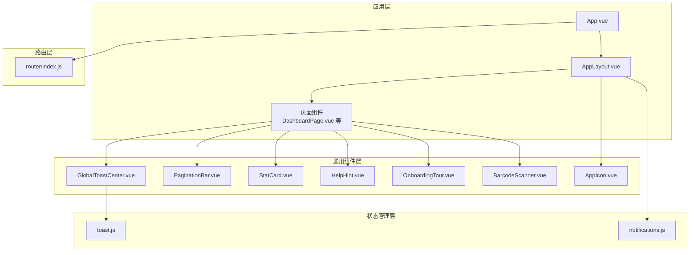
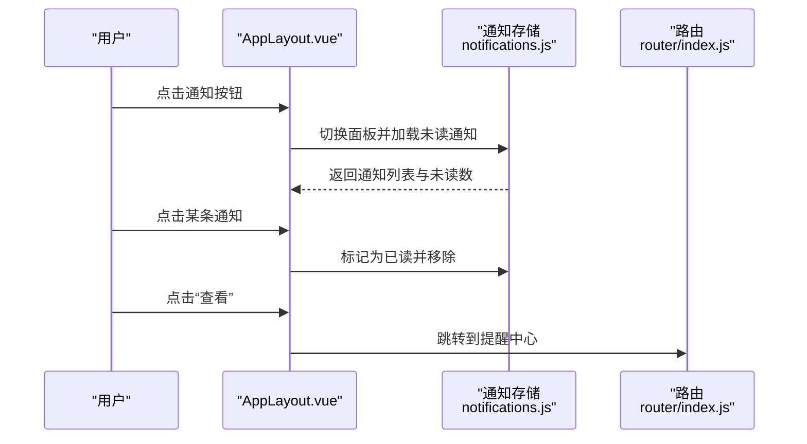
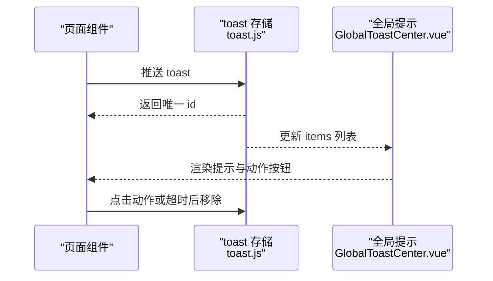
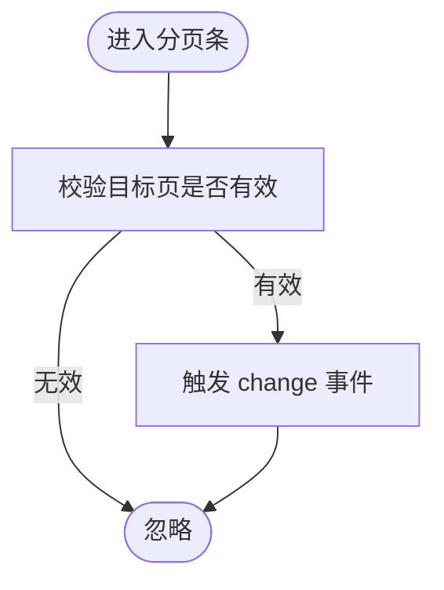
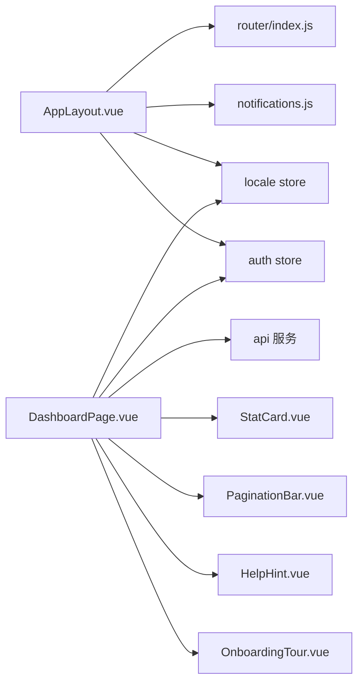

# Vue.js组件结构

<cite>
**本文引用的文件**
- [web/src/App.vue](file://web/src/App.vue)
- [web/src/main.js](file://web/src/main.js)
- [web/src/layouts/AppLayout.vue](file://web/src/layouts/AppLayout.vue)
- [web/src/router/index.js](file://web/src/router/index.js)
- [web/src/components/GlobalToastCenter.vue](file://web/src/components/GlobalToastCenter.vue)
- [web/src/components/PaginationBar.vue](file://web/src/components/PaginationBar.vue)
- [web/src/components/StatCard.vue](file://web/src/components/StatCard.vue)
- [web/src/components/BarcodeScanner.vue](file://web/src/components/BarcodeScanner.vue)
- [web/src/components/HelpHint.vue](file://web/src/components/HelpHint.vue)
- [web/src/components/OnboardingTour.vue](file://web/src/components/OnboardingTour.vue)
- [web/src/components/AppIcon.vue](file://web/src/components/AppIcon.vue)
- [web/src/stores/toast.js](file://web/src/stores/toast.js)
- [web/src/stores/notifications.js](file://web/src/stores/notifications.js)
- [web/src/pages/DashboardPage.vue](file://web/src/pages/DashboardPage.vue)
- [web/src/constants/accessGuide.js](file://web/src/constants/accessGuide.js)
</cite>

## 目录
1. [简介](#简介)
2. [项目结构](#项目结构)
3. [核心组件](#核心组件)
4. [架构总览](#架构总览)
5. [详细组件分析](#详细组件分析)
6. [依赖关系分析](#依赖关系分析)
7. [性能考虑](#性能考虑)
8. [故障排查指南](#故障排查指南)
9. [结论](#结论)
10. [附录](#附录)

## 简介
本文件系统性梳理前端应用的组件层次与组织方式，重点覆盖：
- 布局组件 AppLayout 的设计与职责（页面骨架、导航结构、面包屑、通知中心、引导向导）
- 通用 UI 组件的设计模式（全局提示、分页、统计卡片等）及其使用方法
- 业务组件的封装策略（扫描器、帮助提示、新手引导等）
- 组件间通信机制（props、事件、插槽）
- 生命周期管理与性能优化策略
- 组件复用与扩展的最佳实践
- 组件开发规范与命名约定

## 项目结构
前端代码位于 web/src 目录，采用“布局 + 页面 + 组件 + 存储 + 路由”的分层组织：
- 布局：layouts/AppLayout.vue 提供统一页面骨架与导航
- 页面：pages 下的各页面组件作为业务容器，组合通用组件
- 通用组件：components 下的全局可复用 UI 组件
- 存储：stores 下的状态管理模块（Pinia）
- 路由：router/index.js 定义页面路由与鉴权守卫
- 应用入口：main.js 初始化应用、挂载 Pinia 与路由

**图示来源**
- [web/src/main.js:1-14](file://web/src/main.js#L1-L14)
- [web/src/App.vue:1-9](file://web/src/App.vue#L1-L9)
- [web/src/layouts/AppLayout.vue:1-831](file://web/src/layouts/AppLayout.vue#L1-L831)
- [web/src/router/index.js:1-209](file://web/src/router/index.js#L1-L209)

**章节来源**
- [web/src/main.js:1-14](file://web/src/main.js#L1-L14)
- [web/src/App.vue:1-9](file://web/src/App.vue#L1-L9)
- [web/src/router/index.js:1-209](file://web/src/router/index.js#L1-L209)

## 核心组件
- AppLayout：统一页面骨架、导航、面包屑、通知中心、用户动作、新手引导
- 全局提示 GlobalToastCenter：集中展示信息/成功/错误提示，支持动作按钮与自动消失
- 分页 PaginationBar：通用分页条，支持国际化文案与页码切换
- 统计卡片 StatCard：轻量统计展示，支持提示文本
- 扫描器 BarcodeScanner：基于浏览器摄像头的条码/二维码扫描
- 帮助提示 HelpHint：悬浮帮助图标，点击触发外部回调
- 新手引导 OnboardingTour：步骤化引导弹窗，支持跳过/下一步/完成
- 图标 AppIcon：SVG 图标库，按名称映射路径集合

**章节来源**
- [web/src/layouts/AppLayout.vue:1-831](file://web/src/layouts/AppLayout.vue#L1-L831)
- [web/src/components/GlobalToastCenter.vue:1-41](file://web/src/components/GlobalToastCenter.vue#L1-L41)
- [web/src/components/PaginationBar.vue:1-51](file://web/src/components/PaginationBar.vue#L1-L51)
- [web/src/components/StatCard.vue:1-16](file://web/src/components/StatCard.vue#L1-L16)
- [web/src/components/BarcodeScanner.vue:1-68](file://web/src/components/BarcodeScanner.vue#L1-L68)
- [web/src/components/HelpHint.vue:1-27](file://web/src/components/HelpHint.vue#L1-L27)
- [web/src/components/OnboardingTour.vue:1-116](file://web/src/components/OnboardingTour.vue#L1-L116)
- [web/src/components/AppIcon.vue:1-49](file://web/src/components/AppIcon.vue#L1-L49)

## 架构总览
整体采用“布局 + 页面 + 通用组件 + 状态管理 + 路由”的分层架构。AppLayout 作为页面骨架，承载导航、面包屑、通知与用户交互；页面组件通过组合通用组件实现功能；状态管理通过 Pinia 模块化提供 toast、通知等跨组件共享能力；路由负责页面导航与鉴权。

**图示来源**
- [web/src/App.vue:1-9](file://web/src/App.vue#L1-L9)
- [web/src/layouts/AppLayout.vue:1-831](file://web/src/layouts/AppLayout.vue#L1-L831)
- [web/src/components/GlobalToastCenter.vue:1-41](file://web/src/components/GlobalToastCenter.vue#L1-L41)
- [web/src/components/PaginationBar.vue:1-51](file://web/src/components/PaginationBar.vue#L1-L51)
- [web/src/components/StatCard.vue:1-16](file://web/src/components/StatCard.vue#L1-L16)
- [web/src/components/HelpHint.vue:1-27](file://web/src/components/HelpHint.vue#L1-L27)
- [web/src/components/OnboardingTour.vue:1-116](file://web/src/components/OnboardingTour.vue#L1-L116)
- [web/src/components/BarcodeScanner.vue:1-68](file://web/src/components/BarcodeScanner.vue#L1-L68)
- [web/src/components/AppIcon.vue:1-49](file://web/src/components/AppIcon.vue#L1-L49)
- [web/src/stores/toast.js:1-51](file://web/src/stores/toast.js#L1-L51)
- [web/src/stores/notifications.js:1-52](file://web/src/stores/notifications.js#L1-L52)
- [web/src/router/index.js:1-209](file://web/src/router/index.js#L1-L209)

## 详细组件分析

### 布局组件 AppLayout 设计与职责
- 页面骨架与导航
  - 支持侧边栏与顶部导航两种模式，移动端与桌面端适配
  - 导航分组折叠/展开，持久化至本地存储
  - 侧边栏支持折叠与标题缩略显示，悬停显示完整标题
- 面包屑与标题
  - 动态生成面包屑，根据当前路由与分组计算
  - 当前页面标题与分组标签支持多语言
- 通知中心
  - 内嵌通知面板，支持刷新、标记已读、跳转到提醒中心
  - 未读数高亮，点击外部区域可关闭
- 用户动作与偏好
  - 用户信息展示、语言切换、退出登录
  - 用户操作区显隐状态持久化
- 新手引导
  - 快速引导入口，按当前路由映射引导步骤
  - 引导完成后可跳转教学中心
- 生命周期与事件
  - 窗口尺寸监听、全局点击关闭、路由变更时重置状态

**图示来源**
- [web/src/layouts/AppLayout.vue:290-308](file://web/src/layouts/AppLayout.vue#L290-L308)
- [web/src/stores/notifications.js:13-31](file://web/src/stores/notifications.js#L13-L31)
- [web/src/router/index.js:1-209](file://web/src/router/index.js#L1-L209)

**章节来源**
- [web/src/layouts/AppLayout.vue:1-831](file://web/src/layouts/AppLayout.vue#L1-L831)
- [web/src/stores/notifications.js:1-52](file://web/src/stores/notifications.js#L1-L52)

### 通用 UI 组件设计模式

#### 全局提示 GlobalToastCenter
- 设计要点
  - 单例式全局提示容器，集中渲染 toast 列表
  - 支持不同语调（信息/成功/错误），自动定时消失
  - 可选动作按钮，点击后触发回调并移除
- 使用方法
  - 在页面中通过状态管理推送 toast，组件自动渲染
  - 支持国际化关闭文案

**图示来源**
- [web/src/components/GlobalToastCenter.vue:1-41](file://web/src/components/GlobalToastCenter.vue#L1-L41)
- [web/src/stores/toast.js:1-51](file://web/src/stores/toast.js#L1-L51)

**章节来源**
- [web/src/components/GlobalToastCenter.vue:1-41](file://web/src/components/GlobalToastCenter.vue#L1-L41)
- [web/src/stores/toast.js:1-51](file://web/src/stores/toast.js#L1-L51)

#### 分页 PaginationBar
- 设计要点
  - 接收分页对象，暴露 change 事件
  - 内置上一页/下一页与总数/页码信息，支持国际化
- 使用方法
  - 页面组件传入分页对象，监听 change 事件更新数据

**图示来源**
- [web/src/components/PaginationBar.vue:1-51](file://web/src/components/PaginationBar.vue#L1-L51)

**章节来源**
- [web/src/components/PaginationBar.vue:1-51](file://web/src/components/PaginationBar.vue#L1-L51)

#### 统计卡片 StatCard
- 设计要点
  - 纯展示型卡片，支持标题、数值与提示文本
  - 结构简洁，便于在仪表盘等场景复用
- 使用方法
  - 页面组件直接传入标题、数值与可选提示

**章节来源**
- [web/src/components/StatCard.vue:1-16](file://web/src/components/StatCard.vue#L1-L16)

#### 帮助提示 HelpHint
- 设计要点
  - 小型帮助图标，带 title/aria-label 提示
  - 点击向外派发 click 事件，供父组件处理
- 使用方法
  - 在标题旁放置，点击触发引导或帮助说明

**章节来源**
- [web/src/components/HelpHint.vue:1-27](file://web/src/components/HelpHint.vue#L1-L27)

#### 新手引导 OnboardingTour
- 设计要点
  - 外层遮罩 + 步骤卡片，支持上一步/下一步/跳过/完成
  - 通过 props 控制开关、标题与步骤，完成时派发 complete
- 使用方法
  - AppLayout 中根据当前路由映射步骤，控制弹窗显示

**章节来源**
- [web/src/components/OnboardingTour.vue:1-116](file://web/src/components/OnboardingTour.vue#L1-L116)
- [web/src/layouts/AppLayout.vue:33-129](file://web/src/layouts/AppLayout.vue#L33-L129)

#### 扫描器 BarcodeScanner
- 设计要点
  - 基于浏览器摄像头解码，支持启动/停止
  - 解码成功后派发 detected 事件，释放资源
- 使用方法
  - 页面组件订阅 detected 事件，处理扫码结果

**章节来源**
- [web/src/components/BarcodeScanner.vue:1-68](file://web/src/components/BarcodeScanner.vue#L1-L68)

#### 图标 AppIcon
- 设计要点
  - 通过名称映射 SVG 路径集合，统一图标风格
  - 支持传入 class 自定义尺寸与样式
- 使用方法
  - 在导航、按钮、状态指示等处统一使用

**章节来源**
- [web/src/components/AppIcon.vue:1-49](file://web/src/components/AppIcon.vue#L1-L49)

### 业务组件封装策略
- 扫描器：独立封装相机控制与解码逻辑，通过事件向上通信，避免页面耦合
- 帮助提示：最小化职责，仅负责展示与事件派发，具体行为由父组件处理
- 新手引导：以路由为维度的步骤映射，支持多页面复用
- 通知中心：集中管理未读数与加载状态，减少重复请求与渲染

**章节来源**
- [web/src/components/BarcodeScanner.vue:1-68](file://web/src/components/BarcodeScanner.vue#L1-L68)
- [web/src/components/HelpHint.vue:1-27](file://web/src/components/HelpHint.vue#L1-L27)
- [web/src/components/OnboardingTour.vue:1-116](file://web/src/components/OnboardingTour.vue#L1-L116)
- [web/src/layouts/AppLayout.vue:290-308](file://web/src/layouts/AppLayout.vue#L290-L308)

### 组件间通信机制
- Props 传递
  - 分页条接收分页对象，统计卡片接收标题/数值/提示
  - 引导组件接收开关、标题与步骤数组
- 事件触发
  - 分页条触发 change，扫描器触发 detected，引导组件触发 complete
  - 全局提示的动作按钮触发 onAction 并移除自身
- 插槽使用
  - AppLayout 通过具名插槽提供页面侧边栏区域，实现布局与页面内容的解耦

**章节来源**
- [web/src/components/PaginationBar.vue:1-51](file://web/src/components/PaginationBar.vue#L1-L51)
- [web/src/components/BarcodeScanner.vue:1-68](file://web/src/components/BarcodeScanner.vue#L1-L68)
- [web/src/components/OnboardingTour.vue:1-116](file://web/src/components/OnboardingTour.vue#L1-L116)
- [web/src/components/GlobalToastCenter.vue:1-41](file://web/src/components/GlobalToastCenter.vue#L1-L41)
- [web/src/layouts/AppLayout.vue:797-800](file://web/src/layouts/AppLayout.vue#L797-L800)

### 生命周期管理与性能优化
- 生命周期
  - AppLayout 在 mounted 中初始化状态、绑定窗口事件；在 beforeUnmount 中解绑
  - 扫描器在组件销毁时释放摄像头资源
- 性能优化
  - 导航分组与侧边栏状态持久化，减少重复计算
  - 通知中心懒加载与未读数缓存，避免频繁请求
  - 图表组件按需注册与拖拽排序，降低首屏压力
  - 全局提示与通知面板使用固定定位，减少重排

**章节来源**
- [web/src/layouts/AppLayout.vue:332-345](file://web/src/layouts/AppLayout.vue#L332-L345)
- [web/src/components/BarcodeScanner.vue:40-42](file://web/src/components/BarcodeScanner.vue#L40-L42)
- [web/src/stores/notifications.js:13-25](file://web/src/stores/notifications.js#L13-L25)

### 组件复用与扩展最佳实践
- 布局与页面分离：AppLayout 专注骨架与导航，页面组件专注业务数据与交互
- 通用组件最小职责：图标、提示、分页、卡片等尽量无副作用
- 状态共享：通过 Pinia 模块化管理 toast、通知等跨组件状态
- 路由驱动：导航与引导以路由为依据，便于扩展新页面
- 国际化：文案统一从 locale store 获取，组件内部不硬编码

**章节来源**
- [web/src/layouts/AppLayout.vue:1-831](file://web/src/layouts/AppLayout.vue#L1-L831)
- [web/src/stores/toast.js:1-51](file://web/src/stores/toast.js#L1-L51)
- [web/src/stores/notifications.js:1-52](file://web/src/stores/notifications.js#L1-L52)

### 组件开发规范与命名约定
- 文件命名
  - 布局：AppLayout.vue
  - 通用组件：GlobalToastCenter.vue、PaginationBar.vue、StatCard.vue、HelpHint.vue、OnboardingTour.vue、BarcodeScanner.vue、AppIcon.vue
  - 页面：DashboardPage.vue 等
- 组件职责
  - 通用组件：纯展示或单一职责（如扫描器、提示、分页）
  - 布局组件：页面骨架与导航
  - 页面组件：业务容器，组合通用组件
- 状态管理
  - 以模块形式组织（toast、notifications 等），导出 useXxxStore
- 路由与导航
  - 路由 meta 中声明权限与导航键，AppLayout 依据路由动态生成导航与面包屑

**章节来源**
- [web/src/router/index.js:29-180](file://web/src/router/index.js#L29-L180)
- [web/src/layouts/AppLayout.vue:131-224](file://web/src/layouts/AppLayout.vue#L131-L224)

## 依赖关系分析
- AppLayout 依赖
  - 路由与用户状态（鉴权、角色）
  - 通知存储（加载、标记已读）
  - 本地存储（导航分组、侧边栏、用户动作显隐）
  - 多语言存储（标题与文案）
- 页面组件依赖
  - API 服务（数据拉取）
  - Pinia 状态（认证、本地化）
  - 通用组件（统计、分页、帮助提示）

**图示来源**
- [web/src/layouts/AppLayout.vue:1-831](file://web/src/layouts/AppLayout.vue#L1-L831)
- [web/src/router/index.js:1-209](file://web/src/router/index.js#L1-L209)
- [web/src/stores/notifications.js:1-52](file://web/src/stores/notifications.js#L1-L52)
- [web/src/pages/DashboardPage.vue:1-871](file://web/src/pages/DashboardPage.vue#L1-L871)

**章节来源**
- [web/src/layouts/AppLayout.vue:1-831](file://web/src/layouts/AppLayout.vue#L1-L831)
- [web/src/pages/DashboardPage.vue:1-871](file://web/src/pages/DashboardPage.vue#L1-L871)

## 性能考虑
- 渲染优化
  - 导航分组与侧边栏状态本地持久化，避免每次重新计算
  - 通知面板懒加载，首次打开才请求数据
- 计算优化
  - 面包屑与导航项按路由动态计算，避免冗余渲染
- 资源释放
  - 扫描器在组件卸载时释放摄像头资源
- 状态管理
  - toast 与通知使用响应式数组，按需更新，避免全量替换

[本节为通用指导，无需特定文件引用]

## 故障排查指南
- 扫描器无法启动
  - 检查摄像头权限与设备可用性，确认错误消息是否显示
  - 确认组件在卸载时正确释放资源
- 通知面板不显示或不更新
  - 检查鉴权 token 是否存在，确保已触发加载
  - 确认未读数与 items 是否正确更新
- 全局提示不消失
  - 检查 toast 的 duration 设置与自动移除逻辑
- 导航分组状态异常
  - 检查本地存储键值与序列化格式

**章节来源**
- [web/src/components/BarcodeScanner.vue:13-42](file://web/src/components/BarcodeScanner.vue#L13-L42)
- [web/src/stores/notifications.js:13-31](file://web/src/stores/notifications.js#L13-L31)
- [web/src/stores/toast.js:11-31](file://web/src/stores/toast.js#L11-L31)
- [web/src/layouts/AppLayout.vue:262-268](file://web/src/layouts/AppLayout.vue#L262-L268)

## 结论
该前端应用通过 AppLayout 实现统一页面骨架与导航，结合通用 UI 组件与 Pinia 状态管理，形成清晰的分层架构。组件间通过 props、事件与插槽进行松耦合通信，配合生命周期与本地存储优化，具备良好的可维护性与扩展性。建议在新增页面时遵循现有命名与职责划分，保持组件单一职责与状态共享的模式。

[本节为总结，无需特定文件引用]

## 附录
- 角色权限说明常量：用于生成访问指南与权限摘要
- 页面路由清单：包含页面名称、路径、鉴权与角色要求

**章节来源**
- [web/src/constants/accessGuide.js:1-75](file://web/src/constants/accessGuide.js#L1-L75)
- [web/src/router/index.js:29-180](file://web/src/router/index.js#L29-L180)