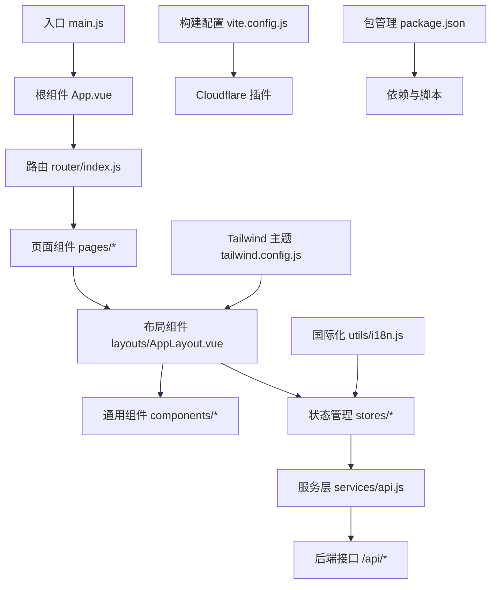
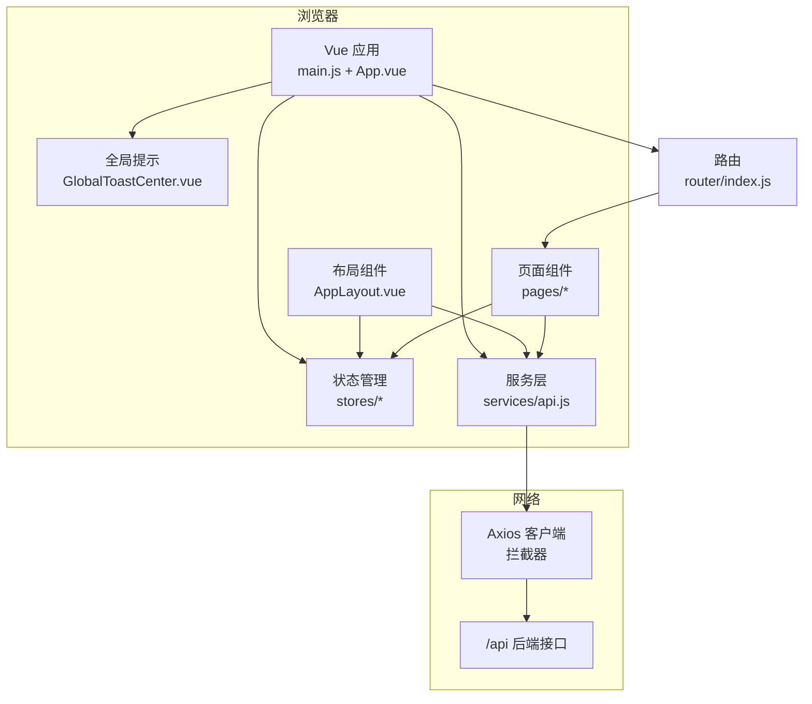
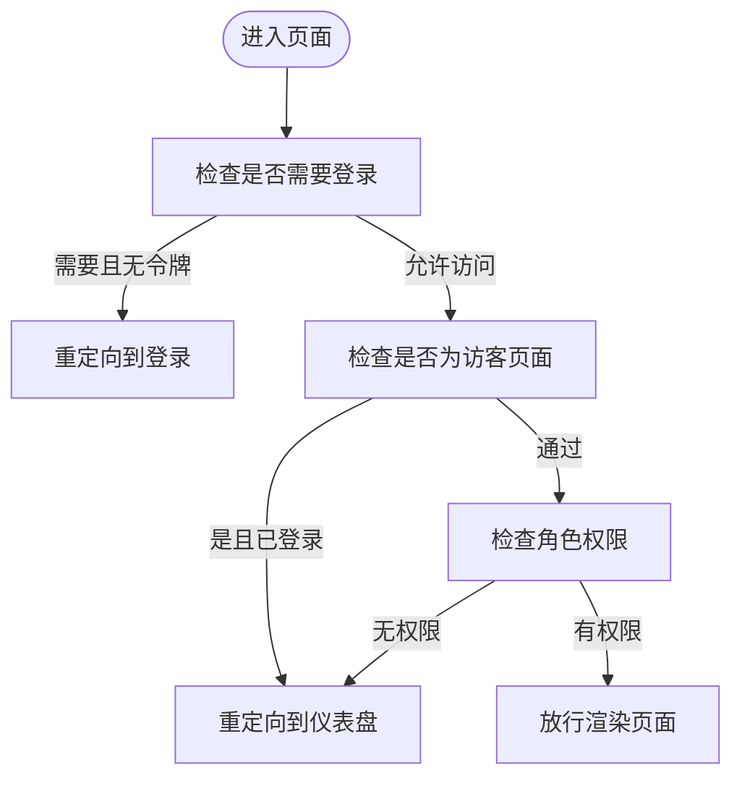
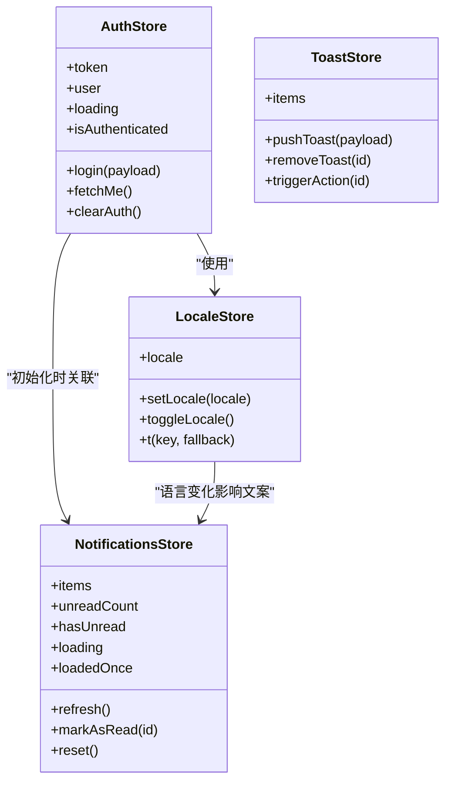
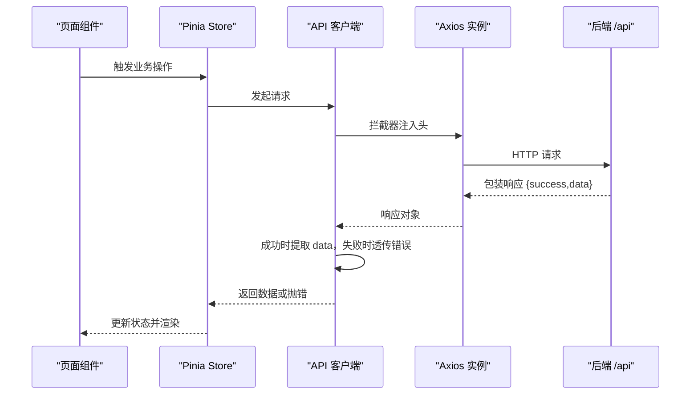
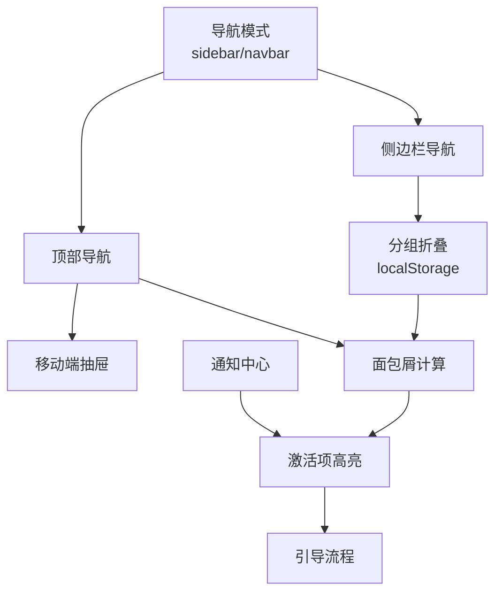
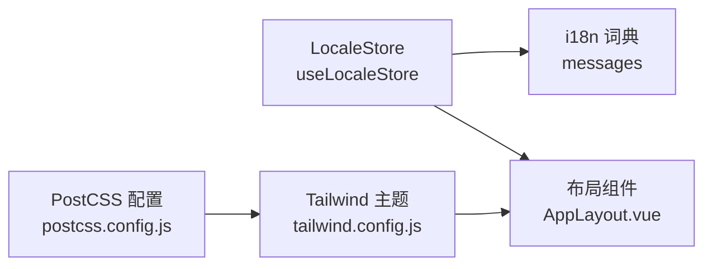
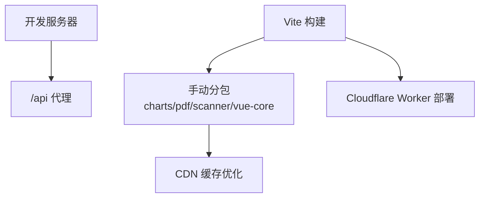
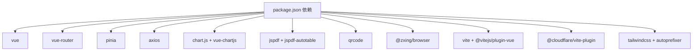

# 前端应用架构

<cite>
**本文引用的文件**
- [web/src/main.js](file://web/src/main.js)
- [web/src/App.vue](file://web/src/App.vue)
- [web/src/router/index.js](file://web/src/router/index.js)
- [web/src/services/api.js](file://web/src/services/api.js)
- [web/src/layouts/AppLayout.vue](file://web/src/layouts/AppLayout.vue)
- [web/src/components/GlobalToastCenter.vue](file://web/src/components/GlobalToastCenter.vue)
- [web/src/stores/auth.js](file://web/src/stores/auth.js)
- [web/src/stores/locale.js](file://web/src/stores/locale.js)
- [web/src/stores/notifications.js](file://web/src/stores/notifications.js)
- [web/src/stores/toast.js](file://web/src/stores/toast.js)
- [web/src/utils/i18n.js](file://web/src/utils/i18n.js)
- [web/vite.config.js](file://web/vite.config.js)
- [web/tailwind.config.js](file://web/tailwind.config.js)
- [web/postcss.config.js](file://web/postcss.config.js)
- [web/package.json](file://web/package.json)
</cite>

## 目录
1. [引言](#引言)
2. [项目结构](#项目结构)
3. [核心组件](#核心组件)
4. [架构总览](#架构总览)
5. [详细组件分析](#详细组件分析)
6. [依赖关系分析](#依赖关系分析)
7. [性能考量](#性能考量)
8. [故障排查指南](#故障排查指南)
9. [结论](#结论)
10. [附录](#附录)

## 引言
本文件系统性梳理该 Vue.js 前端应用的整体架构与实现细节，覆盖模块化组织、页面与布局组件、UI 组件、服务层、路由与权限、状态管理、国际化与主题、响应式与移动端适配、构建与部署优化、以及组件开发最佳实践。目标是帮助开发者快速理解系统设计、高效扩展功能并保持一致的工程规范。

## 项目结构
应用采用“按职责分层 + 功能域划分”的组织方式：
- 入口与根组件：应用通过入口文件挂载 Vue 实例，注入路由与状态管理，并在根组件中统一渲染路由视图与全局提示。
- 路由层：集中定义页面级路由与懒加载，配合前置守卫实现鉴权与角色校验。
- 布局层：提供统一的侧边栏/顶部导航、面包屑、通知中心与引导流程，支撑多页面一致体验。
- 页面层：按业务域拆分页面组件，如仪表盘、库存、产品、订单、报表等。
- 组件层：通用 UI 组件（如图标、分页、统计卡片）与全局提示中心。
- 服务层：封装 API 客户端，统一处理请求/响应拦截、认证头与国际化头。
- 状态管理层：基于 Pinia 的模块化 Store，覆盖认证、语言、通知、全局提示、待办等。
- 工具与配置：国际化词典、Tailwind 主题、Vite 构建与 Cloudflare Worker 集成。

**图表来源**
- [web/src/main.js:1-14](file://web/src/main.js#L1-L14)
- [web/src/App.vue:1-9](file://web/src/App.vue#L1-L9)
- [web/src/router/index.js:1-202](file://web/src/router/index.js#L1-L202)
- [web/src/services/api.js:1-45](file://web/src/services/api.js#L1-L45)
- [web/src/layouts/AppLayout.vue:1-829](file://web/src/layouts/AppLayout.vue#L1-L829)
- [web/src/components/GlobalToastCenter.vue:1-41](file://web/src/components/GlobalToastCenter.vue#L1-L41)
- [web/src/stores/auth.js:1-90](file://web/src/stores/auth.js#L1-L90)
- [web/src/utils/i18n.js:1-189](file://web/src/utils/i18n.js#L1-L189)
- [web/tailwind.config.js:1-18](file://web/tailwind.config.js#L1-L18)
- [web/vite.config.js:1-46](file://web/vite.config.js#L1-L46)
- [web/package.json:1-34](file://web/package.json#L1-L34)

**章节来源**
- [web/src/main.js:1-14](file://web/src/main.js#L1-L14)
- [web/src/App.vue:1-9](file://web/src/App.vue#L1-L9)
- [web/src/router/index.js:1-202](file://web/src/router/index.js#L1-L202)
- [web/src/services/api.js:1-45](file://web/src/services/api.js#L1-L45)
- [web/src/layouts/AppLayout.vue:1-829](file://web/src/layouts/AppLayout.vue#L1-L829)
- [web/src/components/GlobalToastCenter.vue:1-41](file://web/src/components/GlobalToastCenter.vue#L1-L41)
- [web/src/stores/auth.js:1-90](file://web/src/stores/auth.js#L1-L90)
- [web/src/stores/locale.js:1-38](file://web/src/stores/locale.js#L1-L38)
- [web/src/stores/notifications.js:1-52](file://web/src/stores/notifications.js#L1-L52)
- [web/src/stores/toast.js:1-51](file://web/src/stores/toast.js#L1-L51)
- [web/src/utils/i18n.js:1-189](file://web/src/utils/i18n.js#L1-L189)
- [web/tailwind.config.js:1-18](file://web/tailwind.config.js#L1-L18)
- [web/postcss.config.js:1-7](file://web/postcss.config.js#L1-L7)
- [web/vite.config.js:1-46](file://web/vite.config.js#L1-L46)
- [web/package.json:1-34](file://web/package.json#L1-L34)

## 核心组件
- 应用入口与挂载：创建 Vue 应用实例，统一注册 Pinia 与路由，挂载到 DOM。
- 根组件：承载路由视图与全局提示中心，确保所有页面共享提示能力。
- 路由与导航：集中声明路由与懒加载，前置守卫实现登录态与角色校验，支持访客/登录态跳转。
- 布局组件：提供侧边栏/顶部导航、面包屑、通知中心、引导流程与用户操作区，支持桌面/移动双模式。
- 服务层：Axios 客户端封装，自动注入认证令牌、成本访问令牌与 UI 语言头，统一封装响应体结构与错误消息。
- 状态管理：以 Pinia Store 模块化管理认证、语言、通知、全局提示、待办等，跨页面共享状态。
- 国际化：内置中英双语词典，Store 提供切换与查询方法，布局与页面组件按需使用。
- 构建与样式：Vite + Tailwind + PostCSS，Cloudflare 插件集成，按依赖拆分代码块提升缓存命中。

**章节来源**
- [web/src/main.js:1-14](file://web/src/main.js#L1-L14)
- [web/src/App.vue:1-9](file://web/src/App.vue#L1-L9)
- [web/src/router/index.js:1-202](file://web/src/router/index.js#L1-L202)
- [web/src/layouts/AppLayout.vue:1-829](file://web/src/layouts/AppLayout.vue#L1-L829)
- [web/src/services/api.js:1-45](file://web/src/services/api.js#L1-L45)
- [web/src/stores/auth.js:1-90](file://web/src/stores/auth.js#L1-L90)
- [web/src/stores/locale.js:1-38](file://web/src/stores/locale.js#L1-L38)
- [web/src/stores/notifications.js:1-52](file://web/src/stores/notifications.js#L1-L52)
- [web/src/stores/toast.js:1-51](file://web/src/stores/toast.js#L1-L51)
- [web/src/utils/i18n.js:1-189](file://web/src/utils/i18n.js#L1-L189)
- [web/vite.config.js:1-46](file://web/vite.config.js#L1-L46)
- [web/tailwind.config.js:1-18](file://web/tailwind.config.js#L1-L18)
- [web/postcss.config.js:1-7](file://web/postcss.config.js#L1-L7)
- [web/package.json:1-34](file://web/package.json#L1-L34)

## 架构总览
下图展示了从前端到后端的端到端交互路径，以及状态与布局如何贯穿各层：

**图表来源**
- [web/src/main.js:1-14](file://web/src/main.js#L1-L14)
- [web/src/App.vue:1-9](file://web/src/App.vue#L1-L9)
- [web/src/router/index.js:1-202](file://web/src/router/index.js#L1-L202)
- [web/src/layouts/AppLayout.vue:1-829](file://web/src/layouts/AppLayout.vue#L1-L829)
- [web/src/services/api.js:1-45](file://web/src/services/api.js#L1-L45)
- [web/src/components/GlobalToastCenter.vue:1-41](file://web/src/components/GlobalToastCenter.vue#L1-L41)

## 详细组件分析

### 路由与导航策略
- 路由定义：集中于路由入口，采用函数式懒加载导入页面组件，减少首屏体积。
- 权限控制：前置守卫检查登录态、访客限制与角色白名单，未满足条件重定向至登录或仪表盘。
- 导航增强：布局组件根据当前路由计算激活项、分组与面包屑，支持桌面/移动两种导航模式。

**图表来源**
- [web/src/router/index.js:180-199](file://web/src/router/index.js#L180-L199)

**章节来源**
- [web/src/router/index.js:1-202](file://web/src/router/index.js#L1-L202)
- [web/src/layouts/AppLayout.vue:131-222](file://web/src/layouts/AppLayout.vue#L131-L222)

### 状态管理架构（Pinia）
- 认证状态：持久化存储 token 与用户信息，提供登录、拉取个人信息、清理会话等方法。
- 语言环境：维护当前语言与切换逻辑，提供 t 查询方法，回退到默认语言。
- 通知中心：拉取未读通知、标记已读、重置状态，支持加载态与计数。
- 全局提示：统一推送/移除提示，支持带动作回调的提示条。
- 待办事项：页面级 Store（示例：todos.js），与全局提示协同使用。

**图表来源**
- [web/src/stores/auth.js:19-88](file://web/src/stores/auth.js#L19-L88)
- [web/src/stores/locale.js:7-36](file://web/src/stores/locale.js#L7-L36)
- [web/src/stores/notifications.js:5-49](file://web/src/stores/notifications.js#L5-L49)
- [web/src/stores/toast.js:4-49](file://web/src/stores/toast.js#L4-L49)

**章节来源**
- [web/src/stores/auth.js:1-90](file://web/src/stores/auth.js#L1-L90)
- [web/src/stores/locale.js:1-38](file://web/src/stores/locale.js#L1-L38)
- [web/src/stores/notifications.js:1-52](file://web/src/stores/notifications.js#L1-L52)
- [web/src/stores/toast.js:1-51](file://web/src/stores/toast.js#L1-L51)

### API 客户端与拦截器
- 基础配置：基于环境变量设置基础 URL，默认代理到本地后端。
- 请求拦截：自动附加认证令牌、成本访问令牌与 UI 语言头，避免重复代码。
- 响应拦截：统一处理后端返回的包装结构，提取 data 或修正错误消息，简化页面处理。

**图表来源**
- [web/src/services/api.js:3-42](file://web/src/services/api.js#L3-L42)

**章节来源**
- [web/src/services/api.js:1-45](file://web/src/services/api.js#L1-L45)

### 布局与导航组件
- 多模式导航：桌面端侧边栏 + 顶部导航，移动端抽屉菜单 + 移动顶部栏，支持分组折叠与本地持久化。
- 面包屑与激活项：根据路由元信息与可见菜单计算当前分组与页面标题，提升导航一致性。
- 通知中心：右上角浮动面板，支持刷新、标记已读、跳转到提醒中心。
- 引导流程：按页面维度提供新手引导步骤，支持语言切换与本地化文案。

**图表来源**
- [web/src/layouts/AppLayout.vue:131-222](file://web/src/layouts/AppLayout.vue#L131-L222)
- [web/src/layouts/AppLayout.vue:288-306](file://web/src/layouts/AppLayout.vue#L288-L306)
- [web/src/layouts/AppLayout.vue:321-328](file://web/src/layouts/AppLayout.vue#L321-L328)

**章节来源**
- [web/src/layouts/AppLayout.vue:1-829](file://web/src/layouts/AppLayout.vue#L1-L829)

### 国际化与主题
- 国际化：内置中英词典，Store 提供切换与查询方法，布局与页面组件按需调用。
- 主题：Tailwind 自定义品牌色，PostCSS 自动前缀，保证跨浏览器兼容。

**图表来源**
- [web/src/stores/locale.js:7-36](file://web/src/stores/locale.js#L7-L36)
- [web/src/utils/i18n.js:1-189](file://web/src/utils/i18n.js#L1-L189)
- [web/tailwind.config.js:1-18](file://web/tailwind.config.js#L1-L18)
- [web/postcss.config.js:1-7](file://web/postcss.config.js#L1-L7)

**章节来源**
- [web/src/stores/locale.js:1-38](file://web/src/stores/locale.js#L1-L38)
- [web/src/utils/i18n.js:1-189](file://web/src/utils/i18n.js#L1-L189)
- [web/tailwind.config.js:1-18](file://web/tailwind.config.js#L1-L18)
- [web/postcss.config.js:1-7](file://web/postcss.config.js#L1-L7)

### 组件设计模式与复用策略
- 全局组件：如全局提示中心，统一挂载于根组件，所有页面共享。
- 业务组件：页面内专用，通过 Store 与服务层解耦，便于测试与复用。
- 通用组件：图标、分页、统计卡片等，抽象为纯展示型组件，参数驱动。
- 布局组件：作为容器组件，聚合导航、通知、引导等功能，降低页面复杂度。

**章节来源**
- [web/src/components/GlobalToastCenter.vue:1-41](file://web/src/components/GlobalToastCenter.vue#L1-L41)
- [web/src/layouts/AppLayout.vue:1-829](file://web/src/layouts/AppLayout.vue#L1-L829)

### 响应式设计与移动端适配
- 双模式导航：桌面端侧边栏 + 顶部导航，移动端抽屉菜单 + 移动顶部栏，自动切换。
- 交互细节：窗口尺寸监听、点击外部关闭通知面板、分组折叠状态持久化。
- 文案与图标：根据语言切换显示中/英文，图标组件统一风格。

**章节来源**
- [web/src/layouts/AppLayout.vue:277-286](file://web/src/layouts/AppLayout.vue#L277-L286)
- [web/src/layouts/AppLayout.vue:321-328](file://web/src/layouts/AppLayout.vue#L321-L328)

### 构建配置与部署优化
- 代理与开发：本地代理到后端服务，便于前后端联调。
- 代码分割：按依赖拆分 chunks（图表、PDF、扫描器、Vue 核心），提升缓存命中率。
- 部署：Vite 构建产物，结合 Cloudflare Worker 开发与部署脚本。

**图表来源**
- [web/vite.config.js:8-45](file://web/vite.config.js#L8-L45)
- [web/package.json:6-11](file://web/package.json#L6-L11)

**章节来源**
- [web/vite.config.js:1-46](file://web/vite.config.js#L1-L46)
- [web/package.json:1-34](file://web/package.json#L1-L34)

## 依赖关系分析
- 运行时依赖：Vue 3、Vue Router、Pinia、Axios、Chart.js、QRCode、PDF 工具、扫码库等。
- 开发依赖：Vite、@cloudflare/vite-plugin、Tailwind CSS、PostCSS、Autoprefixer。
- 关键耦合点：路由与布局强耦合（导航与面包屑），Store 与服务层双向协作（认证与通知），布局与国际化强绑定（文案与主题）。

**图表来源**
- [web/package.json:12-32](file://web/package.json#L12-L32)

**章节来源**
- [web/package.json:1-34](file://web/package.json#L1-L34)

## 性能考量
- 代码分割：按功能与第三方库拆分 chunk，减少首屏体积，提升缓存命中。
- 懒加载路由：路由级异步导入页面组件，按需加载。
- 本地持久化：导航分组、侧边栏状态、语言偏好等写入 localStorage，减少重复计算与网络请求。
- 图表与 PDF：独立 chunk，避免非必要场景加载。
- 通知与提示：按需刷新与自动回收，避免内存泄漏。

[本节为通用指导，无需特定文件引用]

## 故障排查指南
- 登录态异常：检查本地存储中的令牌与用户信息，确认前置守卫逻辑与路由元信息。
- 请求失败：查看拦截器注入头是否正确，关注响应拦截对错误消息的转换。
- 通知不刷新：确认 Store 加载状态与加载一次标志位，检查网络请求与分页参数。
- 国际化显示异常：确认语言存储键值与切换逻辑，检查词典键是否存在。
- 构建/部署问题：检查 Vite 代理配置与 Cloudflare 插件版本，确认环境变量与脚本命令。

**章节来源**
- [web/src/router/index.js:180-199](file://web/src/router/index.js#L180-L199)
- [web/src/services/api.js:8-42](file://web/src/services/api.js#L8-L42)
- [web/src/stores/notifications.js:13-25](file://web/src/stores/notifications.js#L13-L25)
- [web/src/stores/locale.js:12-19](file://web/src/stores/locale.js#L12-L19)
- [web/vite.config.js:8-16](file://web/vite.config.js#L8-L16)

## 结论
该应用采用清晰的分层架构与模块化组织，借助 Pinia 实现轻量而强大的状态管理，通过 Axios 拦截器统一处理认证与响应包装，结合路由守卫与布局组件实现一致的导航与权限控制。Tailwind 与 PostCSS 提供灵活的主题扩展，Vite + Cloudflare 的构建与部署链路保证了开发效率与上线稳定性。建议在后续迭代中持续完善国际化词条、优化首屏加载、加强错误边界与埋点上报。

[本节为总结性内容，无需特定文件引用]

## 附录
- 组件开发最佳实践
  - 使用 Composition API 与 Store 组合，避免在组件内直接操作本地存储。
  - 页面组件尽量无副作用，将副作用收敛到 Store 或服务层。
  - 通用组件以 props 与事件驱动，避免硬编码文案与样式。
  - 布局组件聚焦导航与上下文，页面组件专注业务数据与交互。
- 国际化与主题
  - 新增文案统一在词典中维护，使用 Store 的 t 方法查询，避免直接拼写字符串。
  - 主题色与字体在 Tailwind 中集中扩展，避免在组件内硬编码颜色。
- 构建与部署
  - 优先使用 Vite 的预设插件，避免过度自定义 Rollup 配置。
  - 通过环境变量区分开发/生产 API 地址，确保本地与 CI 环境一致。

[本节为通用指导，无需特定文件引用]