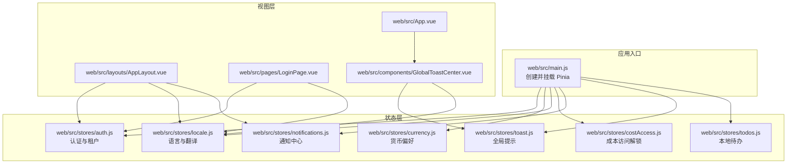
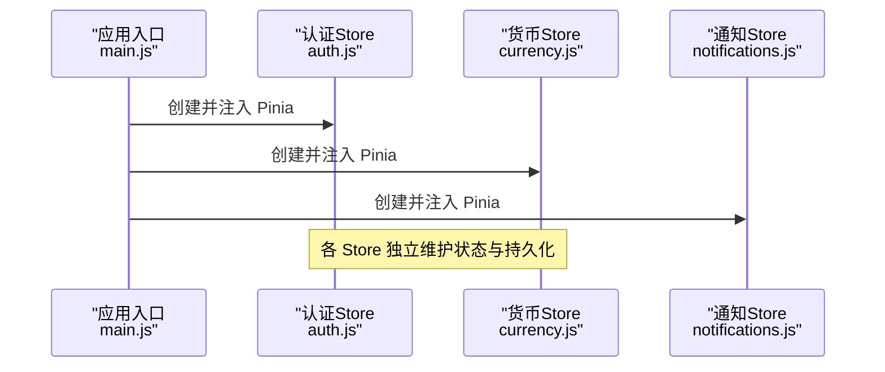
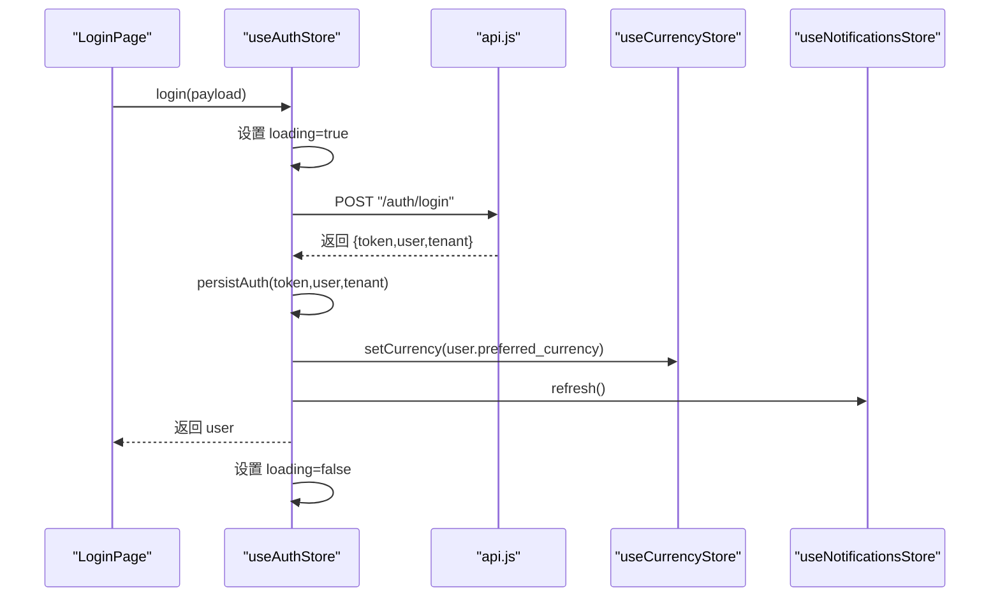
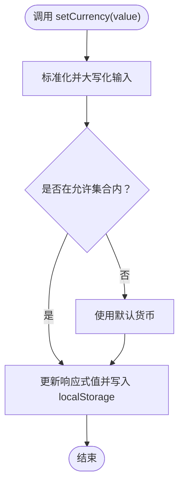
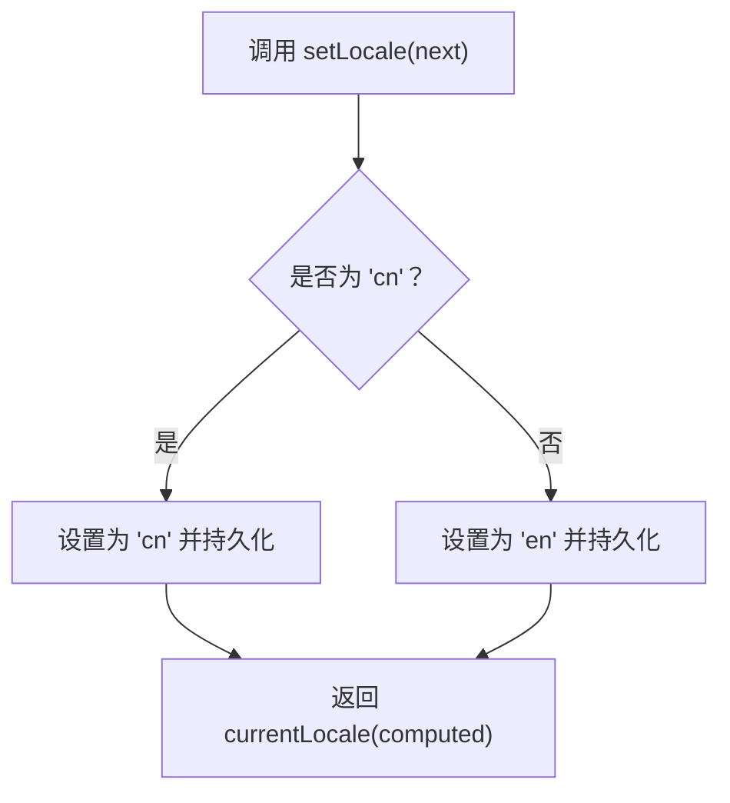
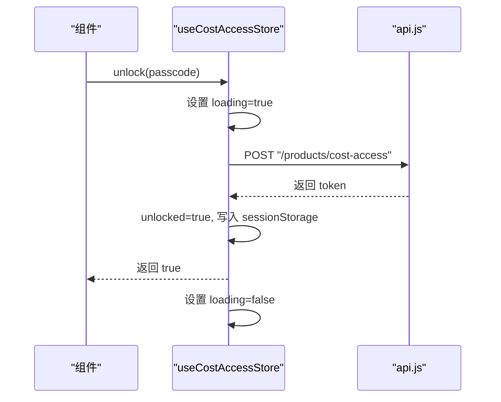
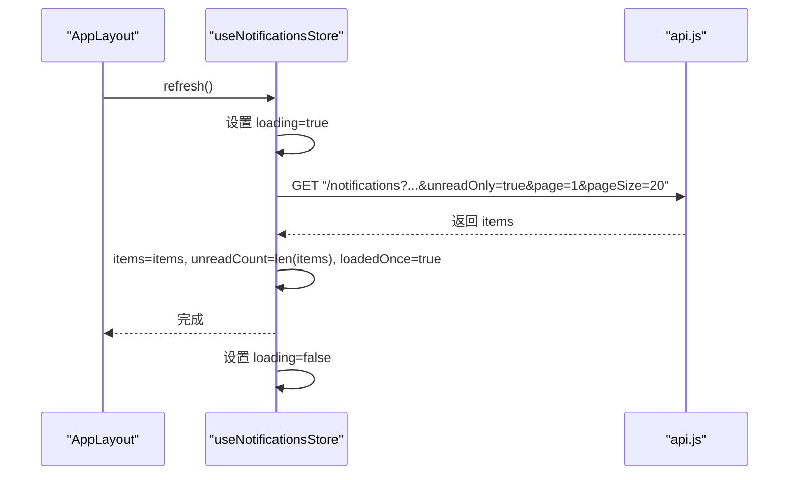
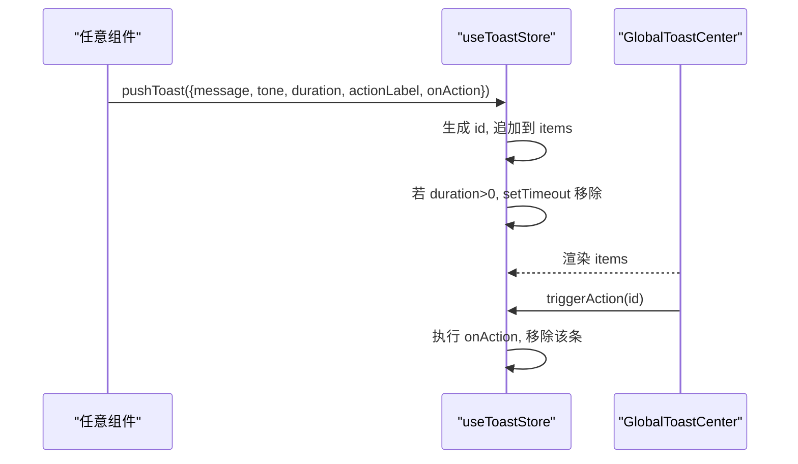
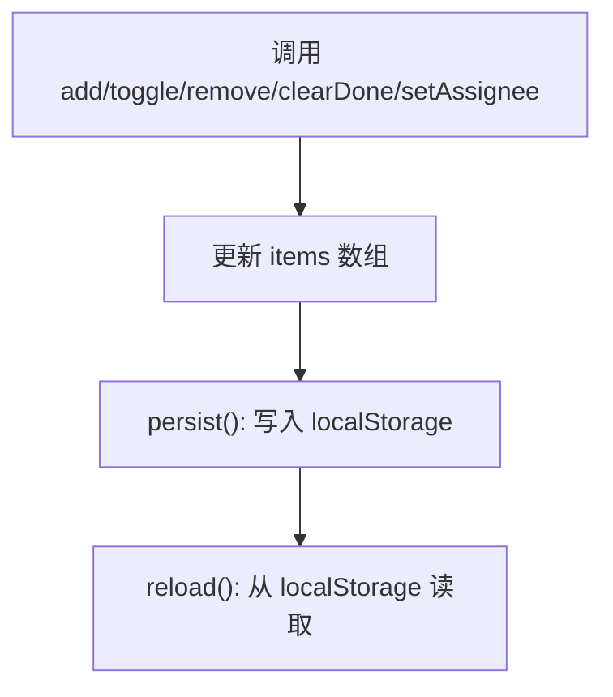
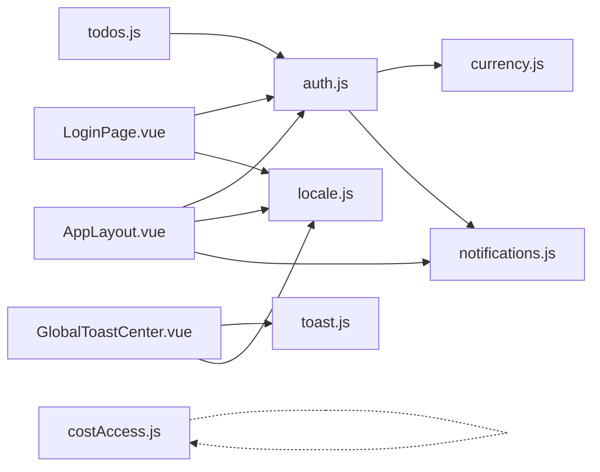

# 状态管理架构

<cite>
**本文引用的文件**
- [web/src/main.js](file://web/src/main.js)
- [web/src/stores/auth.js](file://web/src/stores/auth.js)
- [web/src/stores/currency.js](file://web/src/stores/currency.js)
- [web/src/stores/locale.js](file://web/src/stores/locale.js)
- [web/src/stores/costAccess.js](file://web/src/stores/costAccess.js)
- [web/src/stores/notifications.js](file://web/src/stores/notifications.js)
- [web/src/stores/toast.js](file://web/src/stores/toast.js)
- [web/src/stores/todos.js](file://web/src/stores/todos.js)
- [web/src/utils/i18n.js](file://web/src/utils/i18n.js)
- [web/src/App.vue](file://web/src/App.vue)
- [web/src/components/GlobalToastCenter.vue](file://web/src/components/GlobalToastCenter.vue)
- [web/src/layouts/AppLayout.vue](file://web/src/layouts/AppLayout.vue)
- [web/src/pages/LoginPage.vue](file://web/src/pages/LoginPage.vue)
</cite>

## 目录
1. [引言](#引言)
2. [项目结构](#项目结构)
3. [核心组件](#核心组件)
4. [架构总览](#架构总览)
5. [详细组件分析](#详细组件分析)
6. [依赖关系分析](#依赖关系分析)
7. [性能考量](#性能考量)
8. [故障排查指南](#故障排查指南)
9. [结论](#结论)
10. [附录](#附录)

## 引言
本文件系统性梳理前端基于 Pinia 的状态管理架构，覆盖认证、权限访问、货币、本地化、通知、全局提示与待办等核心状态域。重点阐述：
- Store 的组织结构与设计理念
- 响应式更新机制与数据流
- 持久化策略（localStorage/sessionStorage）
- 跨组件共享与通信模式
- Action 设计与异步状态管理
- 调试与开发工具使用
- 最佳实践与性能优化
- 状态重置与清理机制

## 项目结构
前端通过单一入口挂载 Pinia 并在各页面/布局中按需使用多个独立 Store。Store 放置于统一目录，每个 Store 封装自身状态、计算属性与 Action，并可相互协作。

**图表来源**
- [web/src/main.js:1-14](file://web/src/main.js#L1-L14)
- [web/src/stores/auth.js:1-120](file://web/src/stores/auth.js#L1-L120)
- [web/src/stores/currency.js:1-21](file://web/src/stores/currency.js#L1-L21)
- [web/src/stores/locale.js:1-38](file://web/src/stores/locale.js#L1-L38)
- [web/src/stores/costAccess.js:1-37](file://web/src/stores/costAccess.js#L1-L37)
- [web/src/stores/notifications.js:1-52](file://web/src/stores/notifications.js#L1-L52)
- [web/src/stores/toast.js:1-51](file://web/src/stores/toast.js#L1-L51)
- [web/src/stores/todos.js:1-91](file://web/src/stores/todos.js#L1-L91)
- [web/src/App.vue:1-9](file://web/src/App.vue#L1-L9)
- [web/src/components/GlobalToastCenter.vue:1-41](file://web/src/components/GlobalToastCenter.vue#L1-L41)
- [web/src/layouts/AppLayout.vue:1-831](file://web/src/layouts/AppLayout.vue#L1-L831)
- [web/src/pages/LoginPage.vue:1-320](file://web/src/pages/LoginPage.vue#L1-L320)

**章节来源**
- [web/src/main.js:1-14](file://web/src/main.js#L1-L14)

## 核心组件
- 认证状态（auth）
  - 关键字段：token、user、tenant、loading、isAuthenticated
  - 行为：登录、注册租户、拉取当前用户、持久化与清理
  - 依赖：货币与通知 Store，API 服务
- 货币状态（currency）
  - 关键字段：currency
  - 行为：设置货币并持久化
- 本地化状态（locale）
  - 关键字段：locale（computed）、messages
  - 行为：切换语言、翻译函数
- 成本访问（costAccess）
  - 关键字段：unlocked、loading
  - 行为：解锁/上锁（sessionStorage）
- 通知（notifications）
  - 关键字段：items、unreadCount、loading、loadedOnce、hasUnread
  - 行为：刷新、标记已读、重置
- 全局提示（toast）
  - 关键字段：items
  - 行为：推送、移除、触发动作
- 待办（todos）
  - 关键字段：items
  - 行为：增删改查、本地持久化（按用户隔离）

**章节来源**
- [web/src/stores/auth.js:19-119](file://web/src/stores/auth.js#L19-L119)
- [web/src/stores/currency.js:7-20](file://web/src/stores/currency.js#L7-L20)
- [web/src/stores/locale.js:7-36](file://web/src/stores/locale.js#L7-L36)
- [web/src/stores/costAccess.js:5-36](file://web/src/stores/costAccess.js#L5-L36)
- [web/src/stores/notifications.js:5-49](file://web/src/stores/notifications.js#L5-L49)
- [web/src/stores/toast.js:4-49](file://web/src/stores/toast.js#L4-L49)
- [web/src/stores/todos.js:19-89](file://web/src/stores/todos.js#L19-L89)

## 架构总览
Pinia 在应用入口统一初始化，随后各页面/组件通过 Composables 形式的 Store 函数获取实例，实现跨组件共享与响应式更新。Store 内部通过 ref/computed 管理状态，通过 defineStore 暴露响应式数据与方法。

**图表来源**
- [web/src/main.js:9-11](file://web/src/main.js#L9-L11)
- [web/src/stores/auth.js:19-25](file://web/src/stores/auth.js#L19-L25)
- [web/src/stores/currency.js:7-8](file://web/src/stores/currency.js#L7-L8)
- [web/src/stores/notifications.js:5-6](file://web/src/stores/notifications.js#L5-L6)

## 详细组件分析

### 认证状态（auth）
- 设计理念
  - 使用 localStorage 持久化 token、用户与租户信息，确保刷新后状态恢复
  - 登录成功后联动设置货币偏好与刷新通知
  - 提供 clearAuth 清理所有认证相关状态与通知
- 数据流
  - 登录/注册 → API 请求 → 成功后写入 localStorage → 更新响应式状态 → 触发副作用
  - 获取当前用户 → API 请求 → 更新用户与租户 → 可能更新货币偏好
- 关键点
  - 用户对象归一化处理（兼容不同字段名）
  - 租户信息可为空，需安全处理
  - 加载态 loading 控制 UI 状态

**图表来源**
- [web/src/pages/LoginPage.vue:73-90](file://web/src/pages/LoginPage.vue#L73-L90)
- [web/src/stores/auth.js:53-67](file://web/src/stores/auth.js#L53-L67)
- [web/src/stores/auth.js:29-40](file://web/src/stores/auth.js#L29-L40)
- [web/src/stores/currency.js:10-14](file://web/src/stores/currency.js#L10-L14)
- [web/src/stores/notifications.js:13-25](file://web/src/stores/notifications.js#L13-L25)

**章节来源**
- [web/src/stores/auth.js:7-17](file://web/src/stores/auth.js#L7-L17)
- [web/src/stores/auth.js:29-50](file://web/src/stores/auth.js#L29-L50)
- [web/src/stores/auth.js:52-106](file://web/src/stores/auth.js#L52-L106)

### 货币状态（currency）
- 设计理念
  - 限定允许的货币集合，非法值回退默认货币
  - 优先读取 localStorage，不存在则使用默认值
- 数据流
  - 用户切换 → setCurrency → 更新响应式值与持久化

**图表来源**
- [web/src/stores/currency.js:10-14](file://web/src/stores/currency.js#L10-L14)

**章节来源**
- [web/src/stores/currency.js:4-20](file://web/src/stores/currency.js#L4-L20)

### 本地化状态（locale）
- 设计理念
  - 仅允许 en/cn 两种语言，切换时持久化
  - 提供 t(key) 翻译函数，回退到英文
- 数据流
  - 切换语言 → 更新响应式值与持久化
  - 组件通过 computed(locale) 与 t(key) 使用

**图表来源**
- [web/src/stores/locale.js:12-19](file://web/src/stores/locale.js#L12-L19)

**章节来源**
- [web/src/stores/locale.js:7-36](file://web/src/stores/locale.js#L7-L36)
- [web/src/utils/i18n.js:1-189](file://web/src/utils/i18n.js#L1-L189)

### 成本访问（costAccess）
- 设计理念
  - 使用 sessionStorage 存储临时解锁令牌，关闭标签页即失效
  - 解锁后方可访问敏感数据
- 数据流
  - 提交验证码 → API 请求 → 成功后写入 sessionStorage → 更新解锁状态

**图表来源**
- [web/src/stores/costAccess.js:11-22](file://web/src/stores/costAccess.js#L11-L22)

**章节来源**
- [web/src/stores/costAccess.js:5-36](file://web/src/stores/costAccess.js#L5-L36)

### 通知（notifications）
- 设计理念
  - 分页拉取未读通知，首次加载标记 loadedOnce
  - 标记已读后减少未读计数并过滤列表项
- 数据流
  - 打开通知面板 → 若未加载过 → refresh → 展示未读列表

**图表来源**
- [web/src/layouts/AppLayout.vue:290-299](file://web/src/layouts/AppLayout.vue#L290-L299)
- [web/src/stores/notifications.js:13-25](file://web/src/stores/notifications.js#L13-L25)

**章节来源**
- [web/src/stores/notifications.js:5-49](file://web/src/stores/notifications.js#L5-L49)
- [web/src/layouts/AppLayout.vue:285-303](file://web/src/layouts/AppLayout.vue#L285-L303)

### 全局提示（toast）
- 设计理念
  - 推送消息时自动生成唯一 id，支持延时自动消失与动作回调
  - 通过全局组件集中渲染
- 数据流
  - 组件调用 pushToast → 写入 items → 自动定时移除 → 触发动作后移除

**图表来源**
- [web/src/stores/toast.js:11-42](file://web/src/stores/toast.js#L11-L42)
- [web/src/components/GlobalToastCenter.vue:9-39](file://web/src/components/GlobalToastCenter.vue#L9-L39)
- [web/src/App.vue:5-8](file://web/src/App.vue#L5-L8)

**章节来源**
- [web/src/stores/toast.js:4-50](file://web/src/stores/toast.js#L4-L50)
- [web/src/components/GlobalToastCenter.vue:1-41](file://web/src/components/GlobalToastCenter.vue#L1-L41)

### 待办（todos）
- 设计理念
  - 按用户 id 隔离存储键，避免跨用户污染
  - 本地持久化，支持增删改查与清空已完成
- 数据流
  - 添加/切换/删除/清空 → 更新响应式数组 → 持久化到 localStorage

**图表来源**
- [web/src/stores/todos.js:24-89](file://web/src/stores/todos.js#L24-L89)

**章节来源**
- [web/src/stores/todos.js:5-17](file://web/src/stores/todos.js#L5-L17)
- [web/src/stores/todos.js:19-89](file://web/src/stores/todos.js#L19-L89)

## 依赖关系分析
- 组件与 Store 的耦合
  - AppLayout 依赖 auth、locale、notifications
  - LoginPage 依赖 auth、locale
  - GlobalToastCenter 依赖 toast、locale
- Store 间依赖
  - auth 在登录后联动 currency 与 notifications
  - todos 依赖 auth 的用户 id 作为存储键
  - costAccess 使用 sessionStorage，不依赖其他 Store

**图表来源**
- [web/src/layouts/AppLayout.vue:6-9](file://web/src/layouts/AppLayout.vue#L6-L9)
- [web/src/pages/LoginPage.vue:3-6](file://web/src/pages/LoginPage.vue#L3-L6)
- [web/src/components/GlobalToastCenter.vue:1-4](file://web/src/components/GlobalToastCenter.vue#L1-L4)
- [web/src/stores/auth.js:24-25](file://web/src/stores/auth.js#L24-L25)
- [web/src/stores/todos.js:20-21](file://web/src/stores/todos.js#L20-L21)
- [web/src/stores/costAccess.js:6](file://web/src/stores/costAccess.js#L6)

**章节来源**
- [web/src/layouts/AppLayout.vue:1-831](file://web/src/layouts/AppLayout.vue#L1-L831)
- [web/src/pages/LoginPage.vue:1-320](file://web/src/pages/LoginPage.vue#L1-L320)
- [web/src/components/GlobalToastCenter.vue:1-41](file://web/src/components/GlobalToastCenter.vue#L1-L41)
- [web/src/stores/auth.js:19-120](file://web/src/stores/auth.js#L19-L120)
- [web/src/stores/todos.js:19-91](file://web/src/stores/todos.js#L19-L91)
- [web/src/stores/costAccess.js:5-37](file://web/src/stores/costAccess.js#L5-L37)

## 性能考量
- 响应式粒度
  - 将可独立变化的状态拆分为多个 Store，降低无关重渲染
- 异步加载控制
  - 使用 loading 标志避免重复请求与 UI 抖动
- 本地持久化
  - localStorage/sessionStorage 读写需注意序列化与异常捕获
- 计算属性复用
  - 将派生状态封装为 computed，减少模板中的复杂表达式
- 事件监听与资源释放
  - 在组件卸载时移除全局事件监听，避免内存泄漏

## 故障排查指南
- 认证失败或状态异常
  - 检查 localStorage 中 token/user/tenant 是否存在且格式正确
  - 确认登录/注册接口返回结构与 auth.store 的期望一致
  - 使用 clearAuth 清理后重试登录
- 通知未刷新
  - 确认 loadedOnce 标记与条件加载逻辑
  - 检查 API 返回字段与 items/unreadCount 的映射
- 货币/语言未生效
  - 检查 setCurrency/setLocale 是否被调用
  - 确认允许集合与默认回退逻辑
- 待办未持久化
  - 检查用户 id 是否存在以及存储键构建逻辑
  - 确认 JSON 序列化/反序列化异常处理
- 全局提示不消失
  - 检查 duration 与 setTimeout 是否执行
  - 确认 triggerAction 后移除逻辑

**章节来源**
- [web/src/stores/auth.js:42-50](file://web/src/stores/auth.js#L42-L50)
- [web/src/stores/notifications.js:13-25](file://web/src/stores/notifications.js#L13-L25)
- [web/src/stores/currency.js:10-14](file://web/src/stores/currency.js#L10-L14)
- [web/src/stores/locale.js:12-19](file://web/src/stores/locale.js#L12-L19)
- [web/src/stores/todos.js:24-26](file://web/src/stores/todos.js#L24-L26)
- [web/src/stores/toast.js:24-28](file://web/src/stores/toast.js#L24-L28)

## 结论
本状态管理架构以 Pinia 为核心，围绕认证、货币、本地化、通知、提示与待办等维度构建了清晰的 Store 层。通过 localStorage/sessionStorage 实现跨会话持久化，结合响应式与计算属性实现高效的数据流与 UI 更新。建议在大型模块中进一步拆分 Store，严格区分本地与远端状态，完善错误边界与调试工具集成，持续优化异步加载与渲染性能。

## 附录
- 开发与调试
  - 使用浏览器开发者工具查看 localStorage/sessionStorage
  - 在组件中打印 store 状态，观察响应式变更
  - 对关键 Action 添加 try/catch 与 loading 标志
- 最佳实践
  - 将“只读”派生状态放入 computed，避免在模板中做复杂计算
  - 将“可变”状态放入 ref，保持单一职责
  - 将副作用（如 API 调用）集中在 Action 中
  - 对外暴露最小 API，内部通过私有函数与常量约束
- 重置与清理
  - clearAuth：清理 token/user/tenant 与通知状态
  - notifications.reset：清空通知列表与计数
  - costAccess.lock：移除解锁令牌
  - todos.reload：从 localStorage 重建 items

**章节来源**
- [web/src/stores/auth.js:42-50](file://web/src/stores/auth.js#L42-L50)
- [web/src/stores/notifications.js:33-38](file://web/src/stores/notifications.js#L33-L38)
- [web/src/stores/costAccess.js:24-27](file://web/src/stores/costAccess.js#L24-L27)
- [web/src/stores/todos.js:77-79](file://web/src/stores/todos.js#L77-L79)