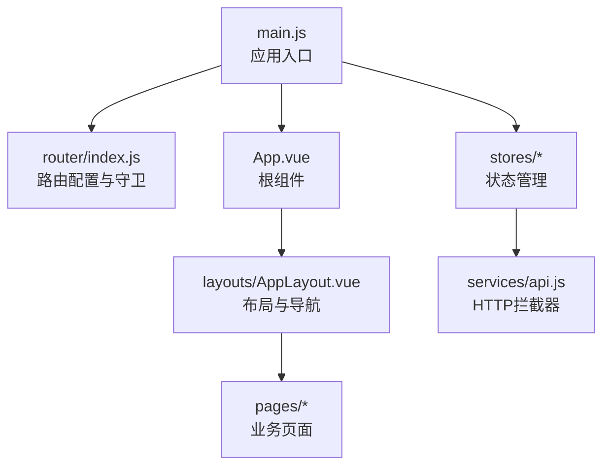
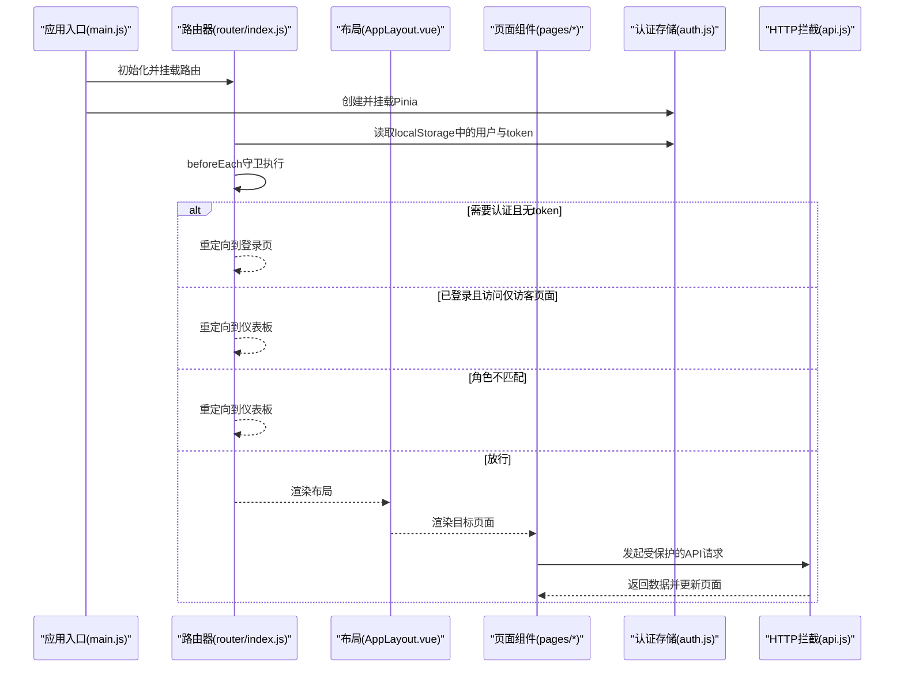
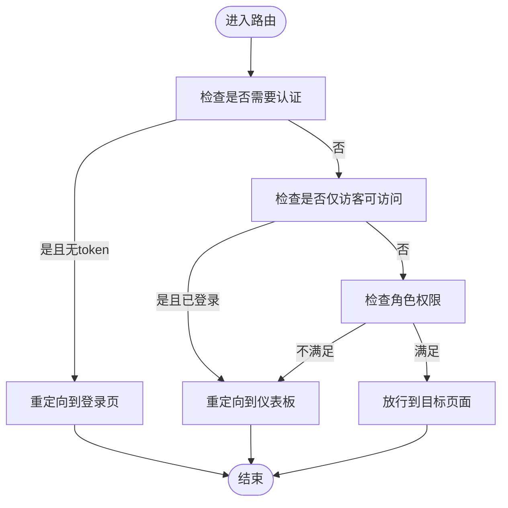
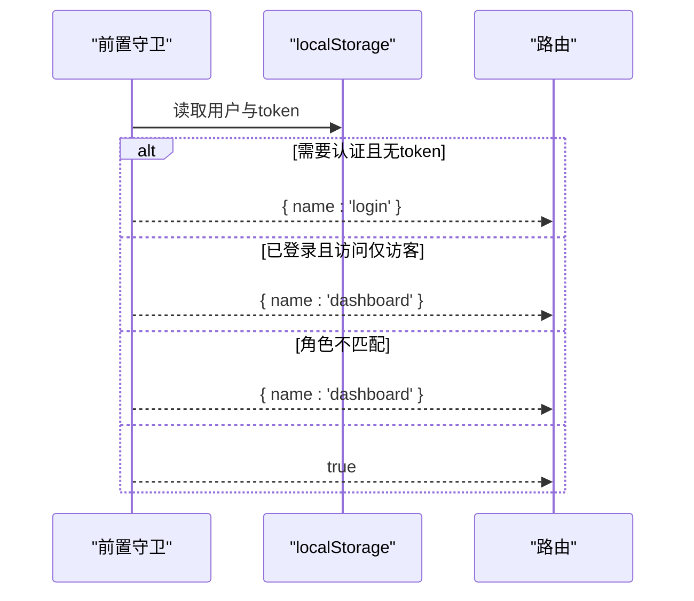
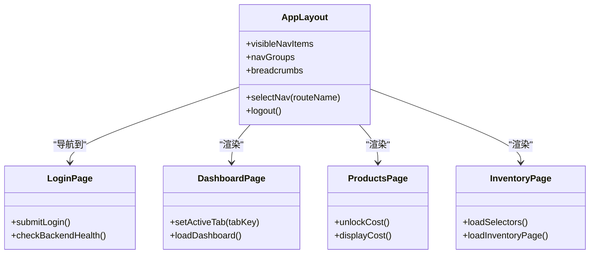
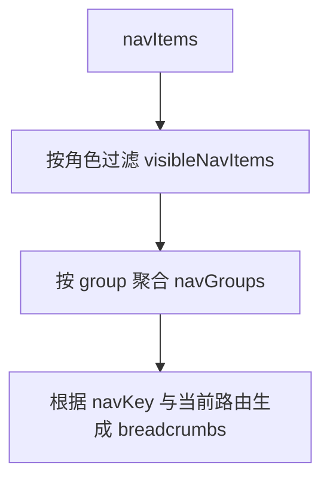
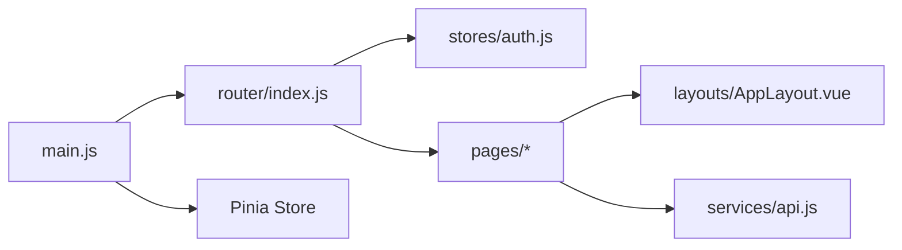

# 路由配置与导航

<cite>
**本文档引用的文件**
- [web/src/router/index.js](file://web/src/router/index.js)
- [web/src/main.js](file://web/src/main.js)
- [web/src/App.vue](file://web/src/App.vue)
- [web/src/layouts/AppLayout.vue](file://web/src/layouts/AppLayout.vue)
- [web/src/stores/auth.js](file://web/src/stores/auth.js)
- [web/src/pages/LoginPage.vue](file://web/src/pages/LoginPage.vue)
- [web/src/pages/DashboardPage.vue](file://web/src/pages/DashboardPage.vue)
- [web/src/pages/ProductsPage.vue](file://web/src/pages/ProductsPage.vue)
- [web/src/pages/InventoryPage.vue](file://web/src/pages/InventoryPage.vue)
- [web/src/services/api.js](file://web/src/services/api.js)
- [web/src/constants/accessGuide.js](file://web/src/constants/accessGuide.js)
- [web/src/components/GlobalToastCenter.vue](file://web/src/components/GlobalToastCenter.vue)
</cite>

## 目录
1. [简介](#简介)
2. [项目结构](#项目结构)
3. [核心组件](#核心组件)
4. [架构总览](#架构总览)
5. [详细组件分析](#详细组件分析)
6. [依赖关系分析](#依赖关系分析)
7. [性能考虑](#性能考虑)
8. [故障排除指南](#故障排除指南)
9. [结论](#结论)
10. [附录](#附录)

## 简介
本文件系统化梳理前端路由配置与导航策略，覆盖路由表结构设计（页面路由、嵌套路由与动态路由）、路由守卫实现（认证检查、权限验证与导航拦截）、页面组件组织（登录页、仪表板、库存管理、商品管理、订单管理等）、导航菜单动态生成与权限控制、路由懒加载与代码分割、面包屑导航与页面标题管理、路由参数传递与查询字符串处理最佳实践。

## 项目结构
前端采用 Vue 3 + Vue Router + Pinia 的组合，路由集中于 router/index.js，页面组件位于 pages 目录，布局组件位于 layouts 目录，全局状态通过 Pinia 管理，应用入口在 main.js 中挂载路由与状态管理。

**图示来源**
- [web/src/main.js:1-14](file://web/src/main.js#L1-L14)
- [web/src/router/index.js:1-202](file://web/src/router/index.js#L1-L202)
- [web/src/App.vue:1-9](file://web/src/App.vue#L1-L9)
- [web/src/layouts/AppLayout.vue:1-829](file://web/src/layouts/AppLayout.vue#L1-L829)
- [web/src/services/api.js:1-45](file://web/src/services/api.js#L1-L45)

**章节来源**
- [web/src/main.js:1-14](file://web/src/main.js#L1-L14)
- [web/src/router/index.js:1-202](file://web/src/router/index.js#L1-L202)
- [web/src/App.vue:1-9](file://web/src/App.vue#L1-L9)

## 核心组件
- 路由器与守卫：在 router/index.js 中定义路由表与前置守卫，基于 meta 字段实现认证与角色控制。
- 布局与导航：AppLayout 提供侧边栏/顶部导航、面包屑、通知中心、用户动作等，动态根据用户角色过滤可见菜单项。
- 认证状态：Pinia 存储 auth.js 管理 token、用户信息与登录流程，配合守卫进行拦截。
- 页面组件：如 LoginPage、DashboardPage、ProductsPage、InventoryPage 等，承载具体业务逻辑与交互。
- 全局提示：GlobalToastCenter 统一展示 Toast 通知。

**章节来源**
- [web/src/router/index.js:28-173](file://web/src/router/index.js#L28-L173)
- [web/src/router/index.js:180-199](file://web/src/router/index.js#L180-L199)
- [web/src/layouts/AppLayout.vue:131-202](file://web/src/layouts/AppLayout.vue#L131-L202)
- [web/src/stores/auth.js:19-88](file://web/src/stores/auth.js#L19-L88)
- [web/src/components/GlobalToastCenter.vue:1-41](file://web/src/components/GlobalToastCenter.vue#L1-L41)

## 架构总览
下图展示从应用启动到页面渲染、导航与守卫的整体流程：

**图示来源**
- [web/src/main.js:7-11](file://web/src/main.js#L7-L11)
- [web/src/router/index.js:180-199](file://web/src/router/index.js#L180-L199)
- [web/src/layouts/AppLayout.vue:1-829](file://web/src/layouts/AppLayout.vue#L1-L829)
- [web/src/stores/auth.js:19-88](file://web/src/stores/auth.js#L19-L88)
- [web/src/services/api.js:8-24](file://web/src/services/api.js#L8-L24)

## 详细组件分析

### 路由表结构与导航策略
- 页面路由：路由表以 path/name/component/meta 为核心字段，meta 包含 requiresAuth、guestOnly、roles、navKey 等控制信息。
- 嵌套路由：当前路由表未显式声明 children，但通过 RouterView 在 AppLayout.vue 中渲染子路由视图，形成嵌套布局。
- 动态路由：使用路径参数（如 /products/:id、/orders/:id）承载动态 ID，结合 navKey 实现面包屑与导航高亮。
- 导航拦截：前置守卫依据 meta 与 localStorage 中的用户信息与 token 执行放行或重定向。

**图示来源**
- [web/src/router/index.js:180-199](file://web/src/router/index.js#L180-L199)

**章节来源**
- [web/src/router/index.js:28-173](file://web/src/router/index.js#L28-L173)
- [web/src/router/index.js:180-199](file://web/src/router/index.js#L180-L199)

### 路由守卫实现
- 守卫逻辑：
  - 若目标路由要求认证且本地无 token，则重定向至登录页；
  - 若目标路由仅访客可用且已登录，则重定向至仪表板；
  - 若目标路由指定角色且当前用户角色不在允许范围内，则重定向至仪表板；
  - 否则放行。
- 用户与令牌来源：localStorage 中的 inventory_user 与 inventory_token，守卫解析并比对角色。

**图示来源**
- [web/src/router/index.js:180-199](file://web/src/router/index.js#L180-L199)

**章节来源**
- [web/src/router/index.js:180-199](file://web/src/router/index.js#L180-L199)

### 页面组件组织与导航菜单
- 登录页 LoginPage：负责健康检查、表单提交与登录成功后的跳转。
- 仪表板 DashboardPage：根据用户角色动态显示标签页（总览/图表/用户），支持查询参数 tab 控制活动标签。
- 商品管理 ProductsPage：支持商品列表、筛选、定价规则、成本解锁等功能，权限控制在组件内体现。
- 库存管理 InventoryPage：支持库存查询、出入库、调拨、分配与交易流水查看。
- 导航菜单：AppLayout 定义 navItems 与分组，visibleNavItems 过滤当前角色可见项，navGroups 将菜单按组聚合，breadcrumbs 基于 navKey 与当前路由生成。

**图示来源**
- [web/src/layouts/AppLayout.vue:131-222](file://web/src/layouts/AppLayout.vue#L131-L222)
- [web/src/pages/LoginPage.vue:41-50](file://web/src/pages/LoginPage.vue#L41-L50)
- [web/src/pages/DashboardPage.vue:164-173](file://web/src/pages/DashboardPage.vue#L164-L173)
- [web/src/pages/ProductsPage.vue:179-194](file://web/src/pages/ProductsPage.vue#L179-L194)
- [web/src/pages/InventoryPage.vue:113-150](file://web/src/pages/InventoryPage.vue#L113-L150)

**章节来源**
- [web/src/layouts/AppLayout.vue:131-222](file://web/src/layouts/AppLayout.vue#L131-L222)
- [web/src/pages/LoginPage.vue:41-50](file://web/src/pages/LoginPage.vue#L41-L50)
- [web/src/pages/DashboardPage.vue:164-173](file://web/src/pages/DashboardPage.vue#L164-L173)
- [web/src/pages/ProductsPage.vue:179-194](file://web/src/pages/ProductsPage.vue#L179-L194)
- [web/src/pages/InventoryPage.vue:113-150](file://web/src/pages/InventoryPage.vue#L113-L150)

### 导航菜单动态生成与权限控制
- 菜单项定义：navItems 包含 label、routeName、roles、shortLabel、icon、group 等字段。
- 权限过滤：visibleNavItems 仅保留当前用户角色允许访问的菜单项。
- 分组聚合：navGroups 将相同 group 的菜单项归类，支持折叠/展开。
- 面包屑：breadcrumbs 基于 navKey 与当前路由生成，若 navKey 不存在则回退到路由名称。

**图示来源**
- [web/src/layouts/AppLayout.vue:131-222](file://web/src/layouts/AppLayout.vue#L131-L222)

**章节来源**
- [web/src/layouts/AppLayout.vue:131-222](file://web/src/layouts/AppLayout.vue#L131-L222)

### 路由懒加载与代码分割
- 路由层懒加载：路由表中所有页面组件均通过函数形式导入，实现按需加载与代码分割。
- 页面内部懒加载：部分页面使用 defineAsyncComponent 对重型组件（如条码扫描）进行异步加载，降低首屏体积。

**章节来源**
- [web/src/router/index.js:3-26](file://web/src/router/index.js#L3-L26)
- [web/src/pages/ProductsPage.vue:28-28](file://web/src/pages/ProductsPage.vue#L28-L28)

### 面包屑导航与页面标题管理
- 面包屑：breadcrumbs 基于当前路由的 navKey 或 name 与分组映射生成，包含“工作区/分组/当前页面”三段式结构。
- 页面标题：页面标题由 AppLayout 中的当前导航项 label 与 group 组合呈现，支持国际化映射。

**章节来源**
- [web/src/layouts/AppLayout.vue:210-222](file://web/src/layouts/AppLayout.vue#L210-L222)
- [web/src/layouts/AppLayout.vue:657-670](file://web/src/layouts/AppLayout.vue#L657-L670)

### 路由参数传递与查询字符串处理最佳实践
- 动态路由参数：使用 /products/:id、/orders/:id 等模式传递资源标识，组件内通过 useRoute 获取 params 并加载详情。
- 查询参数：DashboardPage 使用 query.tab 控制活动标签，通过 router.replace 更新 URL 且不产生历史记录。
- 参数校验与回退：当路由参数缺失时，守卫会拦截并重定向至仪表板，避免无效访问。

**章节来源**
- [web/src/router/index.js:72-76](file://web/src/router/index.js#L72-L76)
- [web/src/router/index.js:114-118](file://web/src/router/index.js#L114-L118)
- [web/src/pages/DashboardPage.vue:164-173](file://web/src/pages/DashboardPage.vue#L164-L173)

## 依赖关系分析
- 应用入口 main.js 依赖 router 与 Pinia，确保路由与状态管理在应用启动时完成挂载。
- 路由守卫依赖 localStorage 中的用户与 token，实现全局认证拦截。
- 页面组件依赖布局组件 AppLayout 提供的导航、面包屑与通知中心。
- HTTP 请求通过 api.js 的拦截器自动附加 Authorization 与本地化信息，简化页面请求处理。

**图示来源**
- [web/src/main.js:7-11](file://web/src/main.js#L7-L11)
- [web/src/router/index.js:180-199](file://web/src/router/index.js#L180-L199)
- [web/src/stores/auth.js:19-88](file://web/src/stores/auth.js#L19-L88)
- [web/src/services/api.js:8-24](file://web/src/services/api.js#L8-L24)

**章节来源**
- [web/src/main.js:7-11](file://web/src/main.js#L7-L11)
- [web/src/router/index.js:180-199](file://web/src/router/index.js#L180-L199)
- [web/src/stores/auth.js:19-88](file://web/src/stores/auth.js#L19-L88)
- [web/src/services/api.js:8-24](file://web/src/services/api.js#L8-L24)

## 性能考虑
- 路由懒加载：路由表与页面组件均采用动态导入，减少初始包体，提升首屏加载速度。
- 页面内部懒加载：对重型组件使用 defineAsyncComponent 异步加载，进一步优化首屏。
- 状态持久化：localStorage 缓存 token 与用户信息，避免重复登录与请求。
- 请求拦截：统一注入 Authorization 与本地化头，减少重复代码与网络开销。

[本节为通用建议，无需特定文件引用]

## 故障排除指南
- 登录后被重定向到仪表板：确认守卫逻辑与 meta.roles 是否正确配置，检查 localStorage 中 token 与用户信息。
- 访问受限页面被拦截：检查用户角色与路由 meta.roles 是否匹配，必要时调整角色或路由权限。
- 面包屑不显示或错误：确认目标路由是否设置 navKey，或是否存在路由名称映射问题。
- 查询参数未生效：检查组件是否正确读取 route.query 并更新状态，避免直接修改导致历史记录异常。

**章节来源**
- [web/src/router/index.js:180-199](file://web/src/router/index.js#L180-L199)
- [web/src/layouts/AppLayout.vue:210-222](file://web/src/layouts/AppLayout.vue#L210-L222)
- [web/src/pages/DashboardPage.vue:164-173](file://web/src/pages/DashboardPage.vue#L164-L173)

## 结论
该系统通过集中式路由表与前置守卫实现了清晰的认证与权限控制，配合布局组件的动态菜单与面包屑，提供了良好的导航体验。路由懒加载与页面内部异步加载有效降低了首屏负担。建议在后续迭代中补充嵌套路由与命名视图，完善权限细化与审计追踪，并持续优化路由参数与查询字符串的处理一致性。

[本节为总结性内容，无需特定文件引用]

## 附录
- 角色权限说明：accessGuide.js 提供 ADMIN/MANAGER/STAFF 的权限概览，便于开发与测试时对照。
- 全局提示：GlobalToastCenter 统一展示成功/错误/信息类提示，提升用户体验。

**章节来源**
- [web/src/constants/accessGuide.js:1-75](file://web/src/constants/accessGuide.js#L1-L75)
- [web/src/components/GlobalToastCenter.vue:1-41](file://web/src/components/GlobalToastCenter.vue#L1-L41)