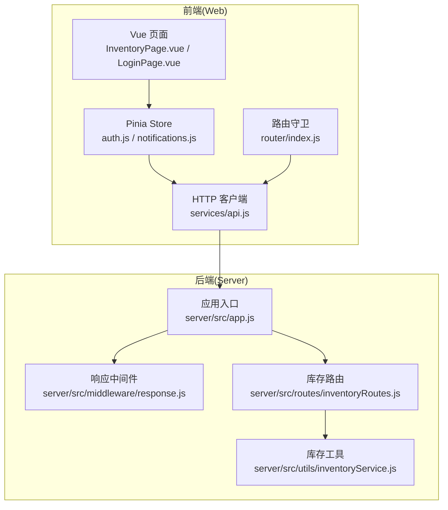
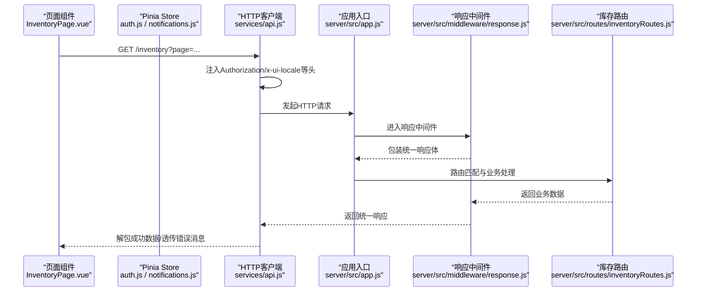
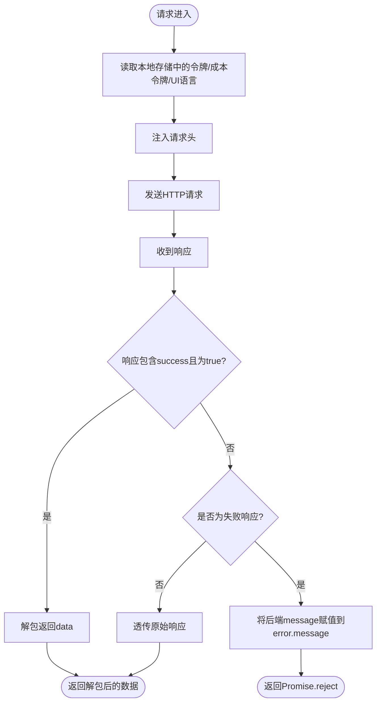
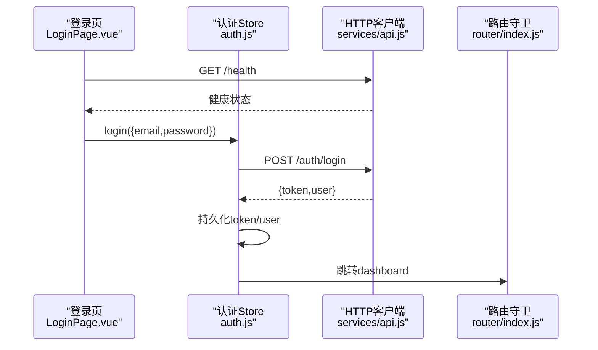
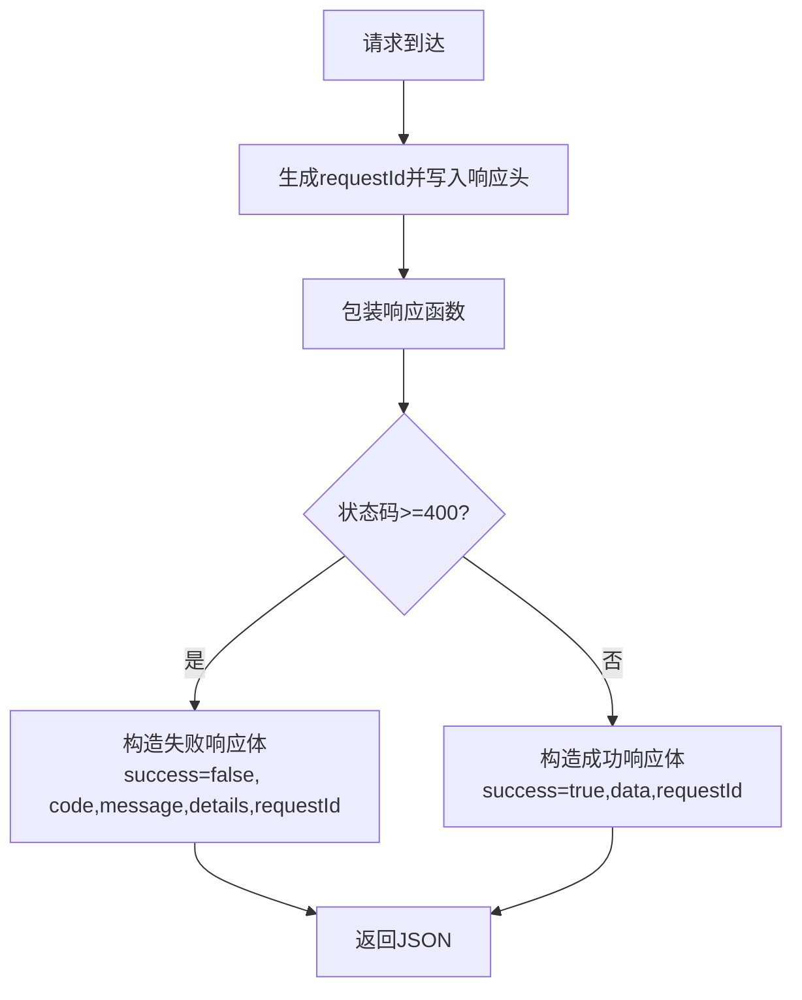
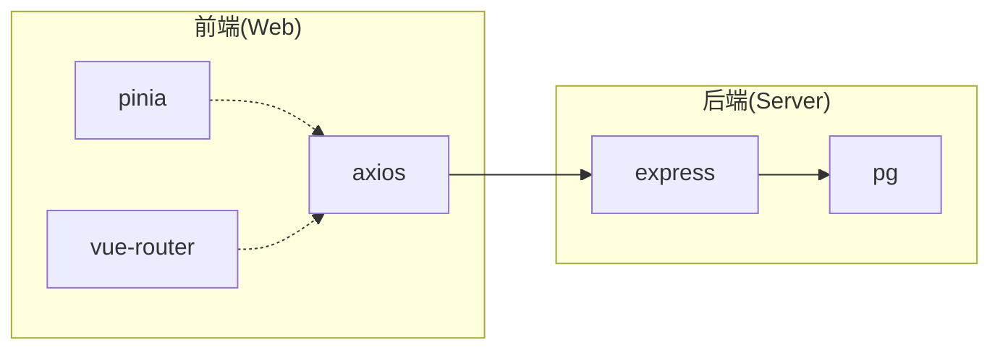

# API服务层

<cite>
**本文引用的文件**
- [web/src/services/api.js](file://web/src/services/api.js)
- [web/src/stores/auth.js](file://web/src/stores/auth.js)
- [web/src/stores/notifications.js](file://web/src/stores/notifications.js)
- [web/src/pages/InventoryPage.vue](file://web/src/pages/InventoryPage.vue)
- [web/src/pages/LoginPage.vue](file://web/src/pages/LoginPage.vue)
- [web/src/router/index.js](file://web/src/router/index.js)
- [server/src/app.js](file://server/src/app.js)
- [server/src/middleware/response.js](file://server/src/middleware/response.js)
- [server/src/routes/inventoryRoutes.js](file://server/src/routes/inventoryRoutes.js)
- [server/src/utils/inventoryService.js](file://server/src/utils/inventoryService.js)
- [web/package.json](file://web/package.json)
- [server/package.json](file://server/package.json)
</cite>

## 目录
1. [引言](#引言)
2. [项目结构](#项目结构)
3. [核心组件](#核心组件)
4. [架构总览](#架构总览)
5. [详细组件分析](#详细组件分析)
6. [依赖分析](#依赖分析)
7. [性能考虑](#性能考虑)
8. [故障排查指南](#故障排查指南)
9. [结论](#结论)
10. [附录](#附录)

## 引言
本文件聚焦于库存管理系统的API服务层，面向前端开发者与集成工程师，系统性阐述HTTP客户端封装、请求/响应拦截器、错误处理与重试机制的设计与实现；解析API服务的设计模式（模块化组织、接口定义、参数校验与响应数据处理）；并给出并发请求控制、缓存策略、超时与网络错误恢复的最佳实践。文末提供基于仓库实际代码的调用示例路径与异常处理建议。

## 项目结构
前端采用Vite + Vue 3 + Pinia + Vue Router，后端采用Express + PostgreSQL，API服务层位于前端的HTTP客户端与后端中间件之间，形成“请求预处理 -> 后端统一响应格式 -> 前端解包与错误提示”的闭环。

**图表来源**
- [web/src/pages/InventoryPage.vue](file://web/src/pages/InventoryPage.vue)
- [web/src/stores/auth.js](file://web/src/stores/auth.js)
- [web/src/services/api.js](file://web/src/services/api.js)
- [web/src/router/index.js](file://web/src/router/index.js)
- [server/src/app.js](file://server/src/app.js)
- [server/src/middleware/response.js](file://server/src/middleware/response.js)
- [server/src/routes/inventoryRoutes.js](file://server/src/routes/inventoryRoutes.js)
- [server/src/utils/inventoryService.js](file://server/src/utils/inventoryService.js)

**章节来源**
- [web/src/services/api.js](file://web/src/services/api.js)
- [server/src/app.js](file://server/src/app.js)

## 核心组件
- HTTP客户端封装与拦截器
  - 自动注入Authorization、成本访问令牌与UI语言头
  - 统一响应数据解包与错误消息透传
- 前端Store与页面协作
  - 认证状态持久化与刷新
  - 通知列表拉取与未读计数
- 路由守卫与页面级API调用
  - 登录页健康检查与错误提示
  - 库存页并发请求与分页加载
- 后端中间件与路由
  - 统一响应包装与失败降级
  - 库存相关业务接口与事务封装

**章节来源**
- [web/src/services/api.js](file://web/src/services/api.js)
- [web/src/stores/auth.js](file://web/src/stores/auth.js)
- [web/src/stores/notifications.js](file://web/src/stores/notifications.js)
- [web/src/pages/InventoryPage.vue](file://web/src/pages/InventoryPage.vue)
- [web/src/pages/LoginPage.vue](file://web/src/pages/LoginPage.vue)
- [server/src/middleware/response.js](file://server/src/middleware/response.js)
- [server/src/routes/inventoryRoutes.js](file://server/src/routes/inventoryRoutes.js)

## 架构总览
从前端到后端的数据流遵循以下顺序：页面通过Pinia Store或直接调用HTTP客户端发起请求；HTTP客户端在请求阶段注入认证信息，在响应阶段解包成功数据并透传错误消息；后端通过中间件统一包装响应体，并在路由层执行业务逻辑与数据库事务。

**图表来源**
- [web/src/pages/InventoryPage.vue](file://web/src/pages/InventoryPage.vue)
- [web/src/services/api.js](file://web/src/services/api.js)
- [server/src/app.js](file://server/src/app.js)
- [server/src/middleware/response.js](file://server/src/middleware/response.js)
- [server/src/routes/inventoryRoutes.js](file://server/src/routes/inventoryRoutes.js)

## 详细组件分析

### HTTP客户端与拦截器
- 请求拦截器
  - 自动从本地存储读取令牌与成本访问令牌，注入Authorization与自定义头
  - 为国际化提供UI语言头，确保后端日志与审计一致
- 响应拦截器
  - 成功场景：若后端返回包含success字段的对象且为true，则解包返回data
  - 失败场景：若后端返回失败对象，将message透传到error.message，便于前端统一提示
- 错误处理
  - 前端在页面中捕获错误，优先显示后端透传的消息，增强可诊断性

**图表来源**
- [web/src/services/api.js](file://web/src/services/api.js)

**章节来源**
- [web/src/services/api.js](file://web/src/services/api.js)

### 前端Store与页面协作
- 认证Store
  - 登录成功后持久化token与用户信息，刷新货币偏好与通知
  - 获取当前用户信息时，若后端返回异常则清理本地状态并抛出错误
- 通知Store
  - 拉取未读通知列表，设置未读计数，支持标记已读
- 页面调用
  - 登录页：健康检查与错误提示
  - 库存页：并发拉取产品/仓库/分类/供应商下拉数据，以及库存与交易流水，统一错误处理

**图表来源**
- [web/src/pages/LoginPage.vue](file://web/src/pages/LoginPage.vue)
- [web/src/stores/auth.js](file://web/src/stores/auth.js)
- [web/src/services/api.js](file://web/src/services/api.js)
- [web/src/router/index.js](file://web/src/router/index.js)

**章节来源**
- [web/src/stores/auth.js](file://web/src/stores/auth.js)
- [web/src/stores/notifications.js](file://web/src/stores/notifications.js)
- [web/src/pages/InventoryPage.vue](file://web/src/pages/InventoryPage.vue)
- [web/src/pages/LoginPage.vue](file://web/src/pages/LoginPage.vue)
- [web/src/router/index.js](file://web/src/router/index.js)

### 后端中间件与路由
- 响应中间件
  - 为每个请求生成唯一ID并写入响应头，统一包装响应体
  - 成功响应：success=true，data为业务数据
  - 失败响应：success=false，包含code/message/details/requestId
- 库存路由
  - 列表查询支持分页、搜索、筛选，内部使用Promise.all并发查询数据与总数
  - 事务封装：库存增减与转移均在事务中执行，保证一致性
  - 参数校验：对必填字段与正数数量进行校验，非法输入直接返回错误

**图表来源**
- [server/src/middleware/response.js](file://server/src/middleware/response.js)

**章节来源**
- [server/src/middleware/response.js](file://server/src/middleware/response.js)
- [server/src/routes/inventoryRoutes.js](file://server/src/routes/inventoryRoutes.js)
- [server/src/utils/inventoryService.js](file://server/src/utils/inventoryService.js)

## 依赖分析
- 前端依赖
  - axios用于HTTP请求
  - pinia/vue-router用于状态与导航
- 后端依赖
  - express提供路由与中间件
  - helmet/cors/morgan提供安全、跨域与日志
  - pg连接PostgreSQL

**图表来源**
- [web/package.json](file://web/package.json)
- [server/package.json](file://server/package.json)

**章节来源**
- [web/package.json](file://web/package.json)
- [server/package.json](file://server/package.json)

## 性能考虑
- 并发请求
  - 页面中多处使用Promise.all并发拉取数据，减少总等待时间
  - 建议：对高开销接口（如大数据量导出）增加节流或分批处理
- 分页与筛选
  - 后端路由支持分页与筛选，前端按需传递参数，避免一次性加载全量数据
- 缓存策略
  - 对静态下拉数据（产品/仓库/分类/供应商）可在Store内做内存缓存，结合失效策略
- 超时与重试
  - 当前未实现自动重试；建议在HTTP客户端层面增加指数退避重试与超时控制
- 错误恢复
  - 前端统一捕获并提示后端透传的message，提升可诊断性

[本节为通用指导，不直接分析具体文件]

## 故障排查指南
- 登录失败
  - 检查后端健康状态与数据库连接
  - 查看响应中间件是否正确返回失败体
- 列表加载失败
  - 检查分页参数与筛选条件是否合法
  - 关注事务回滚与错误消息
- 响应体结构异常
  - 确认后端中间件是否正确包装响应
  - 前端拦截器是否正确解包成功数据

**章节来源**
- [web/src/pages/LoginPage.vue](file://web/src/pages/LoginPage.vue)
- [web/src/pages/InventoryPage.vue](file://web/src/pages/InventoryPage.vue)
- [server/src/middleware/response.js](file://server/src/middleware/response.js)
- [server/src/routes/inventoryRoutes.js](file://server/src/routes/inventoryRoutes.js)

## 结论
本项目的API服务层以“前端HTTP客户端 + 后端统一响应中间件”为核心，实现了请求自动注入、响应统一封装与错误消息透传。页面通过Store与路由守卫完成认证与导航，库存路由提供高性能的并发查询与严谨的事务处理。建议在现有基础上补充超时与重试、缓存与节流策略，进一步提升用户体验与系统稳定性。

[本节为总结性内容，不直接分析具体文件]

## 附录

### API调用最佳实践与示例路径
- 健康检查
  - 示例路径：[web/src/pages/LoginPage.vue](file://web/src/pages/LoginPage.vue)
  - 调用方式：GET /health
- 登录与用户信息
  - 示例路径：[web/src/stores/auth.js](file://web/src/stores/auth.js)
  - 调用方式：POST /auth/login；GET /auth/me
- 通知列表
  - 示例路径：[web/src/stores/notifications.js](file://web/src/stores/notifications.js)
  - 调用方式：GET /notifications?unreadOnly=true&page=1&pageSize=20
- 库存与交易流水
  - 示例路径：[web/src/pages/InventoryPage.vue](file://web/src/pages/InventoryPage.vue)
  - 调用方式：GET /inventory；GET /inventory/transactions
- 库存操作
  - 示例路径：[server/src/routes/inventoryRoutes.js](file://server/src/routes/inventoryRoutes.js)
  - 调用方式：POST /inventory/stock-in；POST /inventory/stock-out；POST /inventory/transfer；POST /inventory/allocate

### 错误处理与异常场景
- 前端错误处理
  - 示例路径：[web/src/pages/InventoryPage.vue](file://web/src/pages/InventoryPage.vue)，[web/src/pages/LoginPage.vue](file://web/src/pages/LoginPage.vue)
  - 处理要点：优先显示后端message；必要时降级为通用提示
- 后端错误处理
  - 示例路径：[server/src/middleware/response.js](file://server/src/middleware/response.js)，[server/src/routes/inventoryRoutes.js](file://server/src/routes/inventoryRoutes.js)
  - 处理要点：统一失败体结构；记录requestId便于追踪

[本节为示例路径汇总，不包含具体代码内容]