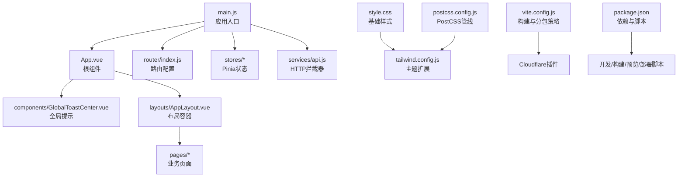
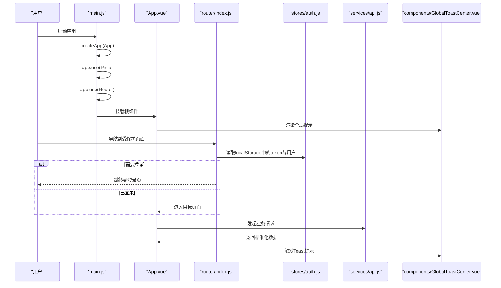
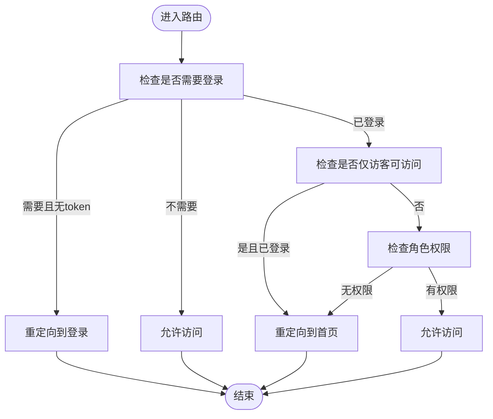
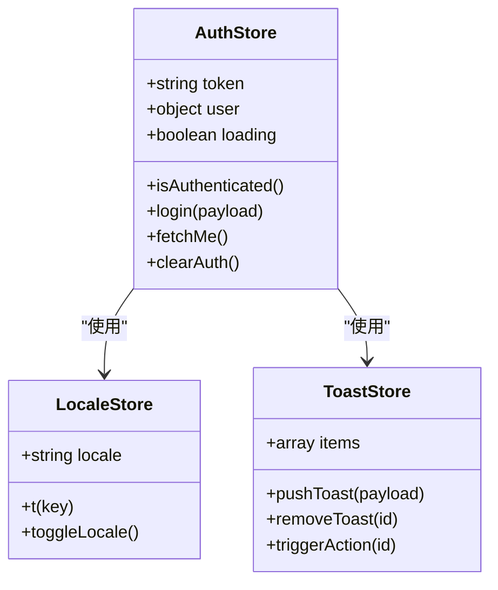
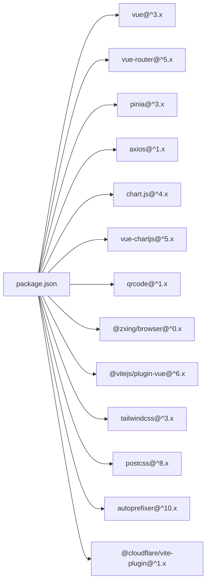

# Vue应用结构

<cite>
**本文引用的文件**
- [main.js](file://web/src/main.js)
- [App.vue](file://web/src/App.vue)
- [style.css](file://web/src/style.css)
- [vite.config.js](file://web/vite.config.js)
- [package.json](file://web/package.json)
- [router/index.js](file://web/src/router/index.js)
- [tailwind.config.js](file://web/tailwind.config.js)
- [postcss.config.js](file://web/postcss.config.js)
- [components/GlobalToastCenter.vue](file://web/src/components/GlobalToastCenter.vue)
- [stores/auth.js](file://web/src/stores/auth.js)
- [layouts/AppLayout.vue](file://web/src/layouts/AppLayout.vue)
- [pages/DashboardPage.vue](file://web/src/pages/DashboardPage.vue)
- [services/api.js](file://web/src/services/api.js)
- [stores/toast.js](file://web/src/stores/toast.js)
- [utils/i18n.js](file://web/src/utils/i18n.js)
</cite>

## 目录
1. [简介](#简介)
2. [项目结构](#项目结构)
3. [核心组件](#核心组件)
4. [架构总览](#架构总览)
5. [详细组件分析](#详细组件分析)
6. [依赖分析](#依赖分析)
7. [性能考虑](#性能考虑)
8. [故障排查指南](#故障排查指南)
9. [结论](#结论)
10. [附录](#附录)

## 简介
本文件面向Vue 3应用的结构化文档，围绕应用初始化流程、全局配置与插件注册、根组件App.vue的设计模式、样式系统组织（含Tailwind、品牌色与响应式）、应用启动流程示例、性能优化建议与最佳实践进行深入解析。文档同时提供可视化图示与分层讲解，帮助不同技术背景的读者快速理解并高效扩展该系统。

## 项目结构
前端位于 web 子目录，采用Vite构建，使用Vue 3 + Pinia + Vue Router + Tailwind CSS的现代前端栈。核心入口为 main.js，根组件为 App.vue，页面通过路由组织，状态管理由Pinia提供，UI样式基于Tailwind并自定义品牌色，国际化信息集中于i18n工具模块。

**图表来源**
- [main.js:1-14](file://web/src/main.js#L1-L14)
- [App.vue:1-9](file://web/src/App.vue#L1-L9)
- [router/index.js:1-209](file://web/src/router/index.js#L1-L209)
- [style.css:1-18](file://web/src/style.css#L1-L18)
- [tailwind.config.js:1-18](file://web/tailwind.config.js#L1-L18)
- [postcss.config.js:1-7](file://web/postcss.config.js#L1-L7)
- [vite.config.js:1-46](file://web/vite.config.js#L1-L46)
- [package.json:1-34](file://web/package.json#L1-L34)

**章节来源**
- [main.js:1-14](file://web/src/main.js#L1-L14)
- [router/index.js:1-209](file://web/src/router/index.js#L1-L209)
- [style.css:1-18](file://web/src/style.css#L1-L18)
- [tailwind.config.js:1-18](file://web/tailwind.config.js#L1-L18)
- [postcss.config.js:1-7](file://web/postcss.config.js#L1-L7)
- [vite.config.js:1-46](file://web/vite.config.js#L1-L46)
- [package.json:1-34](file://web/package.json#L1-L34)

## 核心组件
- 应用入口与初始化
  - 使用 createApp 创建应用实例，挂载 Pinia 与 Router，最后挂载到DOM节点。
  - 入口文件简洁明确，便于后续扩展全局配置与插件。
- 根组件 App.vue
  - 作为顶层容器，承载全局提示与路由视图，确保提示系统与页面切换解耦。
- 路由系统
  - 采用按需动态导入页面组件，结合前置守卫实现鉴权与角色校验。
- 状态管理
  - Pinia Store 提供认证、通知、货币、语言等跨页面共享状态。
- HTTP服务
  - Axios封装，统一注入Authorization、成本访问令牌与语言头，统一对响应体进行包装处理。
- 样式系统
  - Tailwind 基础、组件、实用类三段式引入，配合主题扩展与PostCSS管线，形成一致的视觉体系。
- 构建与分包
  - Vite配置Rollup分包策略，将图表、PDF、扫码等大依赖拆分为独立chunk，提升缓存命中与首屏性能。

**章节来源**
- [main.js:1-14](file://web/src/main.js#L1-L14)
- [App.vue:1-9](file://web/src/App.vue#L1-L9)
- [router/index.js:187-206](file://web/src/router/index.js#L187-L206)
- [stores/auth.js:19-89](file://web/src/stores/auth.js#L19-L89)
- [services/api.js:3-44](file://web/src/services/api.js#L3-L44)
- [style.css:1-18](file://web/src/style.css#L1-L18)
- [tailwind.config.js:1-18](file://web/tailwind.config.js#L1-L18)
- [postcss.config.js:1-7](file://web/postcss.config.js#L1-L7)
- [vite.config.js:17-45](file://web/vite.config.js#L17-L45)

## 架构总览
下图展示了从应用启动到页面渲染的关键交互路径，包括插件注册、路由守卫、状态持久化与全局提示的协同。

**图表来源**
- [main.js:7-13](file://web/src/main.js#L7-L13)
- [App.vue:5-8](file://web/src/App.vue#L5-L8)
- [router/index.js:187-206](file://web/src/router/index.js#L187-L206)
- [stores/auth.js:20-41](file://web/src/stores/auth.js#L20-L41)
- [services/api.js:8-24](file://web/src/services/api.js#L8-L24)
- [components/GlobalToastCenter.vue:1-41](file://web/src/components/GlobalToastCenter.vue#L1-L41)

## 详细组件分析

### 应用初始化与全局配置
- 初始化流程
  - 创建应用实例 -> 注册Pinia -> 注册Router -> 挂载DOM。
- 全局配置扩展点
  - 在 app.use(...) 之后可继续注册其他插件（如i18n、指令、全局组件等）。
  - 在入口处引入全局样式，保证首屏一致性。
- 插件注册顺序
  - Pinia与Router通常在应用早期注册，确保后续组件可直接使用$router/$store。
- 示例参考
  - 参考入口文件的插件注册位置，添加新插件时保持在同一层级。

**章节来源**
- [main.js:1-14](file://web/src/main.js#L1-L14)

### 根组件 App.vue 设计模式
- 设计要点
  - 将路由视图与全局提示分离，避免页面组件重复处理提示逻辑。
  - 通过单一出口承载所有页面，简化导航与布局切换。
- 作用
  - 作为全局提示与路由视图的容器，降低页面复杂度，提升可维护性。

**章节来源**
- [App.vue:1-9](file://web/src/App.vue#L1-L9)

### 路由系统与鉴权守卫
- 路由配置
  - 使用createRouter与createWebHistory，按需动态导入页面组件。
- 前置守卫
  - 依据meta字段执行登录态与角色校验，未满足条件重定向至登录或首页。
- 页面元信息
  - requiresAuth/guestOnly/roles/navKey等字段用于控制导航与面包屑。

**图表来源**
- [router/index.js:187-206](file://web/src/router/index.js#L187-L206)

**章节来源**
- [router/index.js:1-209](file://web/src/router/index.js#L1-L209)

### 状态管理与持久化
- 认证状态
  - Token与用户信息持久化到localStorage，刷新后仍可恢复。
  - 登录成功后统一保存状态，并联动货币偏好与通知刷新。
- Toast状态
  - 全局提示队列，支持自动移除与动作回调。
- 国际化与本地化
  - 语言切换与消息映射集中管理，页面通过store读取。

**图表来源**
- [stores/auth.js:19-89](file://web/src/stores/auth.js#L19-L89)
- [stores/toast.js:4-50](file://web/src/stores/toast.js#L4-L50)
- [utils/i18n.js:1-189](file://web/src/utils/i18n.js#L1-L189)

**章节来源**
- [stores/auth.js:19-89](file://web/src/stores/auth.js#L19-L89)
- [stores/toast.js:4-50](file://web/src/stores/toast.js#L4-L50)
- [utils/i18n.js:1-189](file://web/src/utils/i18n.js#L1-L189)

### HTTP服务与拦截器
- 请求拦截
  - 自动注入Authorization、成本访问令牌与语言头，减少重复代码。
- 响应拦截
  - 对后端统一返回结构进行标准化处理，错误时提取message并抛出。
- 使用建议
  - 所有业务请求统一通过该服务发起，便于集中处理错误与埋点。

**章节来源**
- [services/api.js:3-44](file://web/src/services/api.js#L3-L44)

### 样式系统与主题定制
- Tailwind集成
  - 通过PostCSS管线启用Tailwind，基础、组件、实用类三段式引入。
- 主题扩展
  - 在tailwind.config.js中扩展brand颜色空间，统一品牌视觉。
- 响应式设计
  - 布局组件与页面广泛使用响应式断点与弹性布局，适配桌面与移动设备。
- 基础样式
  - 在style.css中设置html/body高度与基础背景色，确保页面骨架一致。

**章节来源**
- [tailwind.config.js:1-18](file://web/tailwind.config.js#L1-L18)
- [postcss.config.js:1-7](file://web/postcss.config.js#L1-L7)
- [style.css:1-18](file://web/src/style.css#L1-L18)

### 布局与页面示例：DashboardPage
- 布局容器
  - AppLayout提供导航、面包屑、通知中心、侧边栏与移动端菜单，支撑多页面复用。
- 页面特性
  - DashboardPage集成Chart.js与Vue Chart.js，支持图表类型切换、尺寸调整与拖拽排序。
  - 用户访问列表与创建功能，按角色显示不同内容。
- 数据流
  - 通过API服务获取汇总数据，计算图表数据集，驱动可视化组件。

**章节来源**
- [layouts/AppLayout.vue:1-831](file://web/src/layouts/AppLayout.vue#L1-L831)
- [pages/DashboardPage.vue:1-871](file://web/src/pages/DashboardPage.vue#L1-L871)

## 依赖分析
- 外部依赖
  - Vue 3、Vue Router、Pinia、Axios、Chart.js + vue-chartjs、QRCode、@zxing/browser等。
- 开发依赖
  - Vite、Tailwind CSS、PostCSS、Autoprefixer、Cloudflare Vite插件。
- 依赖关系
  - main.js依赖Vue与Pinia/Router；页面依赖布局与服务；样式依赖Tailwind与PostCSS。

**图表来源**
- [package.json:12-32](file://web/package.json#L12-L32)

**章节来源**
- [package.json:1-34](file://web/package.json#L1-L34)

## 性能考虑
- 代码分割与分包
  - Vite Rollup配置将图表、PDF、扫码、Vue核心等依赖拆分为独立chunk，提升缓存命中率与首屏加载速度。
- 图表与大依赖懒加载
  - DashboardPage中图表库按需注册，避免在非必要页面加载。
- 路由懒加载
  - 页面组件采用动态导入，减少初始包体积。
- 样式与构建
  - Tailwind按需扫描，PostCSS自动前缀，减少冗余CSS。
- 最佳实践
  - 优先使用响应式工具类替代复杂样式，减少运行时开销。
  - 对长列表使用虚拟滚动或分页，避免一次性渲染过多节点。
  - 合理使用keep-alive缓存不常变的页面，减少重复请求。

**章节来源**
- [vite.config.js:17-45](file://web/vite.config.js#L17-L45)
- [pages/DashboardPage.vue:25-35](file://web/src/pages/DashboardPage.vue#L25-L35)

## 故障排查指南
- 登录态异常
  - 检查localStorage中token与用户信息是否存在；确认路由守卫逻辑与meta字段配置。
- 请求失败
  - 查看HTTP拦截器是否正确注入头信息；确认响应拦截器对错误消息的提取。
- 样式异常
  - 确认Tailwind与PostCSS配置是否正确；检查content扫描路径与主题扩展。
- 构建问题
  - 检查Vite配置中的代理与分包策略；确认依赖版本兼容性。

**章节来源**
- [router/index.js:187-206](file://web/src/router/index.js#L187-L206)
- [services/api.js:8-42](file://web/src/services/api.js#L8-L42)
- [tailwind.config.js:3-17](file://web/tailwind.config.js#L3-L17)
- [postcss.config.js:1-7](file://web/postcss.config.js#L1-L7)
- [vite.config.js:6-16](file://web/vite.config.js#L6-L16)

## 结论
该Vue 3应用以清晰的入口初始化、稳定的路由与状态管理、可扩展的HTTP服务与Tailwind样式体系为基础，结合合理的分包策略与页面级图表能力，形成了高可维护性与良好用户体验的前端架构。遵循本文的扩展建议与最佳实践，可在保证性能的同时快速迭代功能。

## 附录
- 添加新的全局配置与插件示例（步骤说明）
  - 在入口文件中找到插件注册位置，在对应 app.use(...) 之后追加新插件调用。
  - 若需全局混入或指令，可在入口处统一注册，确保在根组件之前完成。
  - 如需新增环境变量，建议在Vite配置中通过别名或环境文件管理，并在代码中通过 import.meta.env 访问。
- 常用命令
  - 开发：npm run dev
  - 构建：npm run build
  - 预览：npm run preview
  - 部署：npm run deploy

**章节来源**
- [main.js:7-13](file://web/src/main.js#L7-L13)
- [package.json:6-11](file://web/package.json#L6-L11)
- [vite.config.js:6-16](file://web/vite.config.js#L6-L16)