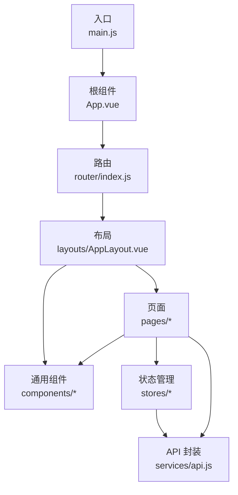
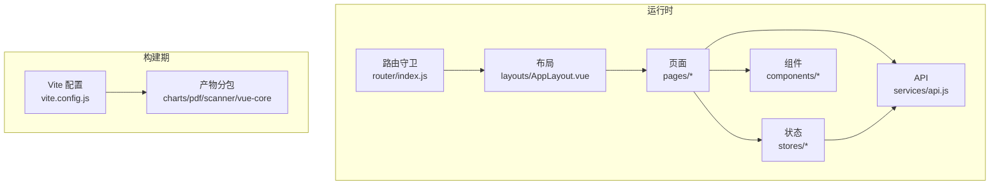
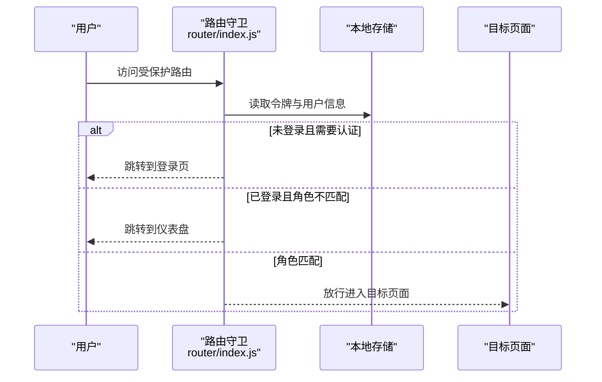
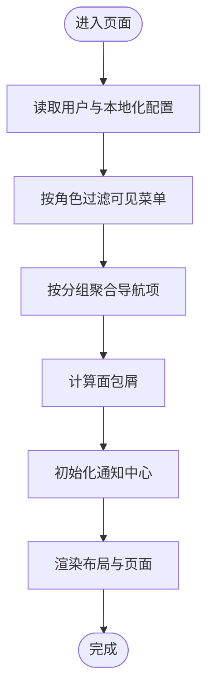
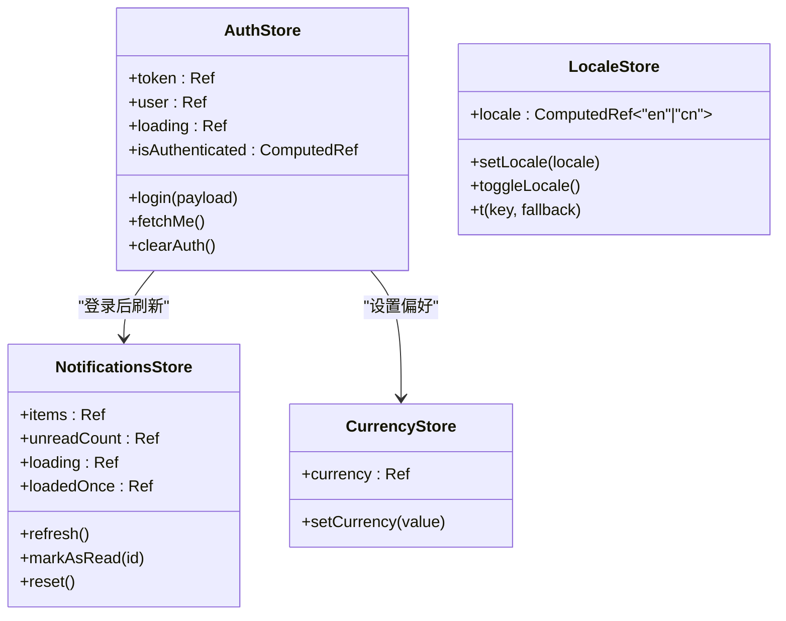
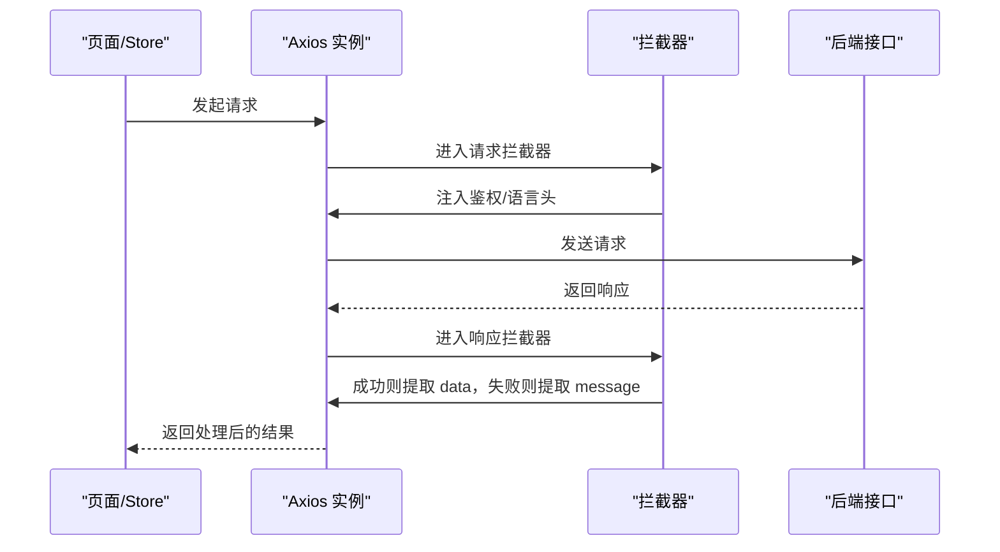
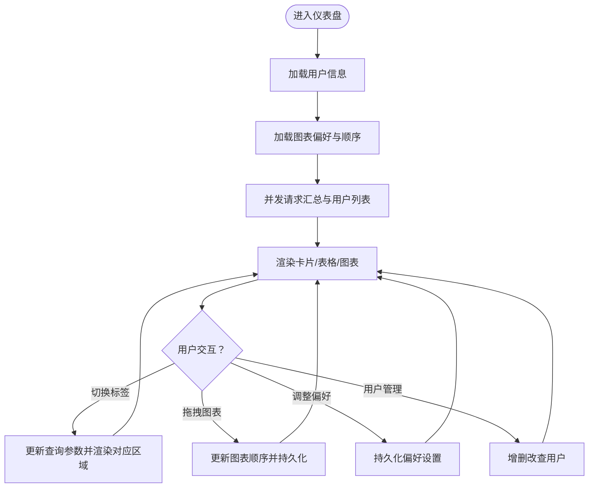
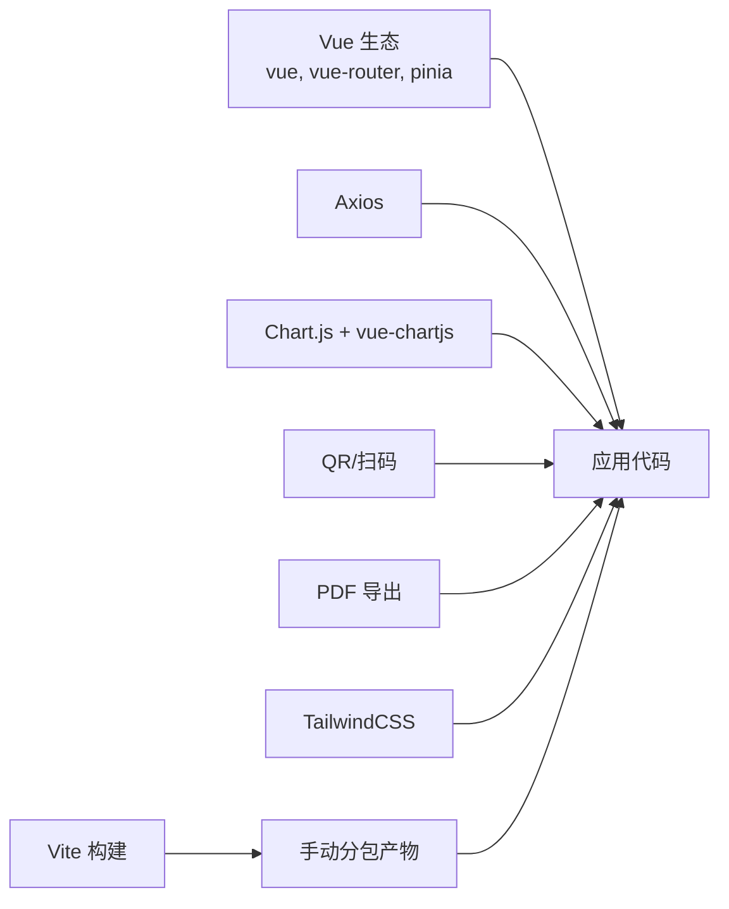

# 前端架构

<cite>
**本文引用的文件**
- [main.js](file://web/src/main.js)
- [App.vue](file://web/src/App.vue)
- [router/index.js](file://web/src/router/index.js)
- [layouts/AppLayout.vue](file://web/src/layouts/AppLayout.vue)
- [services/api.js](file://web/src/services/api.js)
- [stores/auth.js](file://web/src/stores/auth.js)
- [stores/notifications.js](file://web/src/stores/notifications.js)
- [stores/locale.js](file://web/src/stores/locale.js)
- [stores/currency.js](file://web/src/stores/currency.js)
- [components/GlobalToastCenter.vue](file://web/src/components/GlobalToastCenter.vue)
- [components/PaginationBar.vue](file://web/src/components/PaginationBar.vue)
- [pages/DashboardPage.vue](file://web/src/pages/DashboardPage.vue)
- [utils/i18n.js](file://web/src/utils/i18n.js)
- [vite.config.js](file://web/vite.config.js)
- [package.json](file://web/package.json)
</cite>

## 目录
1. [简介](#简介)
2. [项目结构](#项目结构)
3. [核心组件](#核心组件)
4. [架构总览](#架构总览)
5. [详细组件分析](#详细组件分析)
6. [依赖关系分析](#依赖关系分析)
7. [性能考量](#性能考量)
8. [故障排查指南](#故障排查指南)
9. [结论](#结论)
10. [附录](#附录)

## 简介
本文件面向库存管理系统的前端架构，围绕 Vue 3 应用进行系统化梳理，涵盖组件设计、页面组织、路由配置、状态管理（Pinia）、API 服务封装、UI 组件库使用、单页应用导航逻辑、布局系统与响应式设计、组件通信与事件处理、数据绑定最佳实践，并提供构建新页面与组件的参考路径。同时给出性能优化、浏览器兼容性与可访问性建议。

## 项目结构
前端位于 web 目录，采用基于功能域的分层组织：
- 入口与根组件：main.js、App.vue
- 路由：router/index.js
- 布局：layouts/AppLayout.vue
- 页面：pages 下各业务页面
- 通用组件：components 下全局组件
- 状态管理：stores 下各模块 store
- 工具与国际化：utils/i18n.js、stores/locale.js、stores/currency.js
- API 封装：services/api.js
- 构建与打包：vite.config.js、package.json

图示来源
- [main.js:1-14](file://web/src/main.js#L1-L14)
- [App.vue:1-9](file://web/src/App.vue#L1-L9)
- [router/index.js:1-209](file://web/src/router/index.js#L1-L209)
- [layouts/AppLayout.vue:1-831](file://web/src/layouts/AppLayout.vue#L1-L831)

章节来源
- [main.js:1-14](file://web/src/main.js#L1-L14)
- [router/index.js:1-209](file://web/src/router/index.js#L1-L209)

## 核心组件
- 应用入口与挂载：在入口文件中统一注册 Pinia 与路由，保证全局共享状态与导航能力。
- 根组件：通过路由视图承载页面内容，并挂载全局提示中心。
- 布局系统：AppLayout 提供侧边栏/顶部导航、面包屑、通知中心、用户动作等统一布局能力。
- 通用组件：如全局 Toast 中心、分页条等，复用性强，降低页面重复实现。
- 状态管理：以 Pinia Store 形式组织认证、通知、语言、货币等跨页面状态。
- API 封装：Axios 实例统一注入鉴权头、本地化头与错误消息标准化。

章节来源
- [main.js:1-14](file://web/src/main.js#L1-L14)
- [App.vue:1-9](file://web/src/App.vue#L1-L9)
- [layouts/AppLayout.vue:1-831](file://web/src/layouts/AppLayout.vue#L1-L831)
- [services/api.js:1-45](file://web/src/services/api.js#L1-L45)
- [stores/auth.js:1-90](file://web/src/stores/auth.js#L1-L90)
- [stores/notifications.js:1-52](file://web/src/stores/notifications.js#L1-L52)
- [stores/locale.js:1-38](file://web/src/stores/locale.js#L1-L38)
- [stores/currency.js:1-21](file://web/src/stores/currency.js#L1-L21)
- [components/GlobalToastCenter.vue:1-41](file://web/src/components/GlobalToastCenter.vue#L1-L41)
- [components/PaginationBar.vue:1-51](file://web/src/components/PaginationBar.vue#L1-L51)

## 架构总览
应用采用“布局 + 页面 + 组件 + 状态 + 服务”的分层架构：
- 导航与守卫：路由按模块拆分懒加载页面，前置守卫校验登录态与角色。
- 布局与导航：AppLayout 动态计算可见菜单、分组、面包屑与通知中心。
- 状态管理：Pinia Store 管理认证、通知、语言、货币等状态，持久化至 localStorage/sessionStorage。
- API 服务：统一拦截器注入鉴权与本地化头，统一封装响应体与错误消息。
- UI 与交互：TailwindCSS 提供基础样式，Chart.js + vue-chartjs 支持图表，组件间通过 props/emit 通信。

图示来源
- [router/index.js:187-206](file://web/src/router/index.js#L187-L206)
- [layouts/AppLayout.vue:131-204](file://web/src/layouts/AppLayout.vue#L131-L204)
- [services/api.js:7-42](file://web/src/services/api.js#L7-L42)
- [vite.config.js:17-44](file://web/vite.config.js#L17-L44)

## 详细组件分析

### 路由与导航
- 路由定义：采用动态导入实现页面级懒加载，减少首屏体积。
- 守卫策略：按 requiresAuth/guestOnly/roles 三段式校验，结合本地存储的用户信息与令牌进行跳转。
- 导航键：通过 navKey 将子路由归并到同一分组，便于面包屑与高亮。

图示来源
- [router/index.js:187-206](file://web/src/router/index.js#L187-L206)

章节来源
- [router/index.js:1-209](file://web/src/router/index.js#L1-L209)

### 布局系统与导航
- 可见菜单：根据用户角色过滤导航项，支持分组与本地化标题。
- 面包屑：依据当前路由的 navKey 或 name 计算，指向分组与当前页面。
- 通知中心：点击铃铛弹出通知面板，支持刷新、标记已读与跳转。
- 用户动作：支持切换语言、登出、折叠/展开用户操作区。
- 移动端适配：小屏下提供抽屉菜单与顶部导航组切换。

图示来源
- [layouts/AppLayout.vue:182-224](file://web/src/layouts/AppLayout.vue#L182-L224)
- [layouts/AppLayout.vue:290-309](file://web/src/layouts/AppLayout.vue#L290-L309)

章节来源
- [layouts/AppLayout.vue:1-831](file://web/src/layouts/AppLayout.vue#L1-L831)

### 状态管理模式（Pinia）
- 认证状态：登录、拉取用户资料、清除认证，持久化令牌与用户信息，联动通知与货币偏好。
- 通知状态：拉取未读通知、标记已读、重置状态，支持加载态与只读参数。
- 语言与货币：语言切换与持久化，货币偏好持久化与白名单校验。

图示来源
- [stores/auth.js:19-88](file://web/src/stores/auth.js#L19-L88)
- [stores/notifications.js:5-49](file://web/src/stores/notifications.js#L5-L49)
- [stores/locale.js:7-36](file://web/src/stores/locale.js#L7-L36)
- [stores/currency.js:7-19](file://web/src/stores/currency.js#L7-L19)

章节来源
- [stores/auth.js:1-90](file://web/src/stores/auth.js#L1-L90)
- [stores/notifications.js:1-52](file://web/src/stores/notifications.js#L1-L52)
- [stores/locale.js:1-38](file://web/src/stores/locale.js#L1-L38)
- [stores/currency.js:1-21](file://web/src/stores/currency.js#L1-L21)

### API 服务封装
- 基础地址：支持环境变量覆盖，默认指向 /api。
- 请求拦截：自动注入 Authorization、成本系统访问令牌、UI 语言头。
- 响应拦截：若后端返回 success 字段，自动提取 data；错误时提取 message 并透传。

图示来源
- [services/api.js:3-42](file://web/src/services/api.js#L3-L42)

章节来源
- [services/api.js:1-45](file://web/src/services/api.js#L1-L45)

### 页面组织与数据流（以仪表盘为例）
- 图表集成：注册 Chart.js 组件，按用户偏好渲染不同类型的图表。
- 数据加载：并发加载汇总数据与用户列表（管理员/经理）。
- 本地化：通过 i18n 与 locale store 提供双语文案。
- 交互：标签页切换、图表拖拽排序、图表面板展开/收起、用户 CRUD。

图示来源
- [pages/DashboardPage.vue:425-464](file://web/src/pages/DashboardPage.vue#L425-L464)
- [utils/i18n.js:1-189](file://web/src/utils/i18n.js#L1-L189)
- [stores/locale.js:7-36](file://web/src/stores/locale.js#L7-L36)

章节来源
- [pages/DashboardPage.vue:1-871](file://web/src/pages/DashboardPage.vue#L1-L871)
- [utils/i18n.js:1-189](file://web/src/utils/i18n.js#L1-L189)
- [stores/locale.js:1-38](file://web/src/stores/locale.js#L1-L38)

### 组件通信与事件处理
- 父子通信：props 传递数据，emit 传递事件（如分页变更）。
- 全局状态：通过 Pinia store 在组件间共享状态，避免深层传递。
- 事件处理：统一在布局中处理全局点击、窗口尺寸变化、路由切换等副作用。

章节来源
- [components/PaginationBar.vue:1-51](file://web/src/components/PaginationBar.vue#L1-L51)
- [layouts/AppLayout.vue:323-345](file://web/src/layouts/AppLayout.vue#L323-L345)

### 数据绑定最佳实践
- 响应式数据：使用 ref/computed/watch 管理页面状态与副作用。
- 表单绑定：使用 v-model 与占位标签提升可访问性与体验。
- 条件渲染：根据角色与路由元信息决定可见性与交互。

章节来源
- [pages/DashboardPage.vue:425-464](file://web/src/pages/DashboardPage.vue#L425-L464)
- [layouts/AppLayout.vue:182-224](file://web/src/layouts/AppLayout.vue#L182-L224)

## 依赖关系分析
- 运行时依赖：Vue 3、Vue Router、Pinia、Axios、Chart.js + vue-chartjs、QR/扫码、PDF 导出等。
- 构建依赖：Vite、@cloudflare/vite-plugin、TailwindCSS、PostCSS、autoprefixer。
- 构建优化：Rollup 手动分包，将图表、PDF、扫描器与核心框架分别拆分，提升缓存命中率。

图示来源
- [package.json:12-22](file://web/package.json#L12-L22)
- [vite.config.js:17-44](file://web/vite.config.js#L17-L44)

章节来源
- [package.json:1-34](file://web/package.json#L1-L34)
- [vite.config.js:1-46](file://web/vite.config.js#L1-L46)

## 性能考量
- 代码分割与懒加载：路由按页面懒加载，减少首屏 JS 体积。
- 手动分包：将图表、PDF、扫描器与核心框架拆分为独立 chunk，提升缓存复用。
- 请求拦截：统一注入头，避免重复拼接，减少网络往返。
- 本地化与偏好：将用户偏好与图表设置持久化到本地存储，减少重复请求与计算。
- 图表渲染：仅在可见时渲染，支持拖拽排序与面板折叠，降低 DOM 压力。

章节来源
- [router/index.js:3-27](file://web/src/router/index.js#L3-L27)
- [vite.config.js:17-44](file://web/vite.config.js#L17-L44)
- [services/api.js:7-24](file://web/src/services/api.js#L7-L24)
- [pages/DashboardPage.vue:235-271](file://web/src/pages/DashboardPage.vue#L235-L271)

## 故障排查指南
- 登录态异常：确认本地存储中的令牌与用户信息是否正确；检查路由守卫逻辑与后端鉴权。
- 通知未刷新：确认认证状态与通知 store 的 loadedOnce 标记；检查请求拦截器是否注入了正确的头。
- 语言切换无效：确认 locale store 的持久化键与 t 方法回退逻辑。
- 图表不显示：检查图表组件映射与本地偏好设置；确认数据结构与 Chart.js 注册。
- 分页无效：确认 PaginationBar 的 emit 事件与父组件监听逻辑一致。

章节来源
- [router/index.js:187-206](file://web/src/router/index.js#L187-L206)
- [stores/notifications.js:13-31](file://web/src/stores/notifications.js#L13-L31)
- [stores/locale.js:21-29](file://web/src/stores/locale.js#L21-L29)
- [components/PaginationBar.vue:14-20](file://web/src/components/PaginationBar.vue#L14-L20)

## 结论
该前端架构以 Vue 3 为核心，配合 Pinia、Vue Router、Axios 与 Chart.js，形成清晰的分层与职责边界。通过统一的布局与路由守卫，保障导航一致性与安全性；通过 Pinia store 与 API 封装，实现跨页面状态共享与请求标准化；借助 TailwindCSS 与手动分包策略，兼顾开发体验与运行性能。建议在扩展新页面时遵循现有模式：页面懒加载、布局复用、store 抽象、组件通信与事件处理规范化。

## 附录

### 新页面/组件构建参考路径
- 新增页面：在 pages 目录新建页面组件，参考仪表盘页面的数据加载、图表渲染与本地化写法。
- 新增路由：在 router/index.js 中新增路由项，设置 meta（requiresAuth/guestOnly/roles/navKey），并使用动态导入。
- 新增 store：在 stores 目录新增模块，使用 defineStore 定义状态与方法，必要时持久化到 localStorage/sessionStorage。
- 新增通用组件：在 components 目录新增组件，通过 props/emit 与父组件通信，复用布局与样式。
- 国际化：在 utils/i18n.js 中补充文案键值，使用 locale store 的 t 方法渲染。

章节来源
- [pages/DashboardPage.vue:1-871](file://web/src/pages/DashboardPage.vue#L1-L871)
- [router/index.js:29-180](file://web/src/router/index.js#L29-L180)
- [stores/auth.js:19-88](file://web/src/stores/auth.js#L19-L88)
- [components/PaginationBar.vue:1-51](file://web/src/components/PaginationBar.vue#L1-L51)
- [utils/i18n.js:1-189](file://web/src/utils/i18n.js#L1-L189)