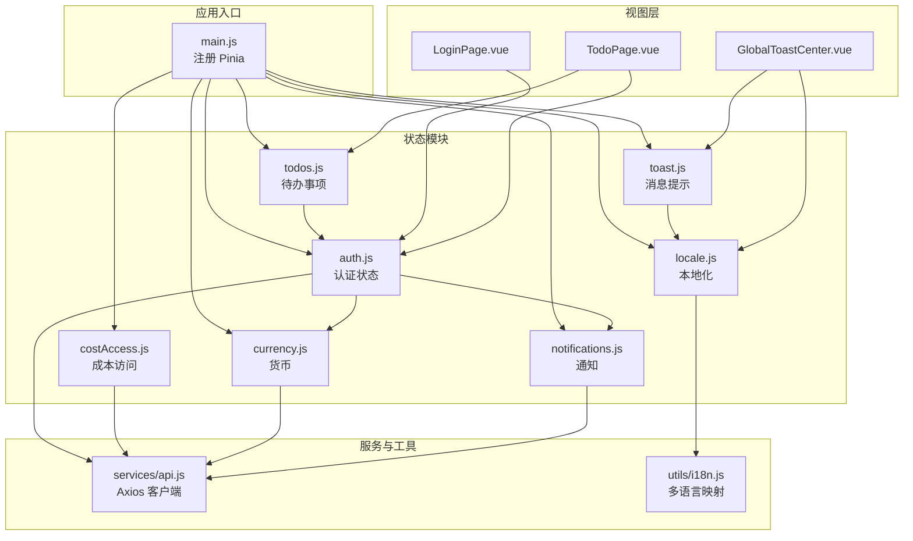
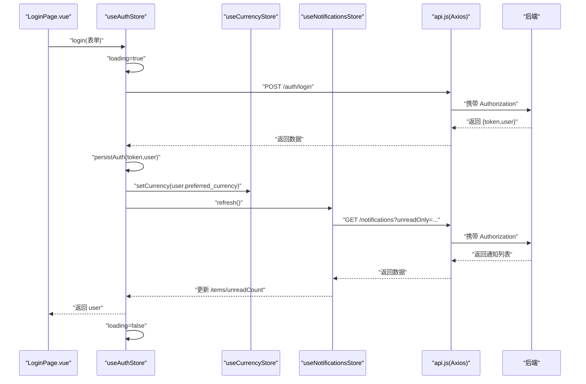
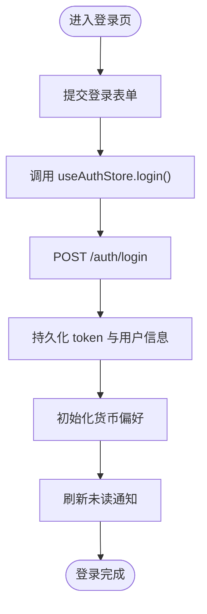
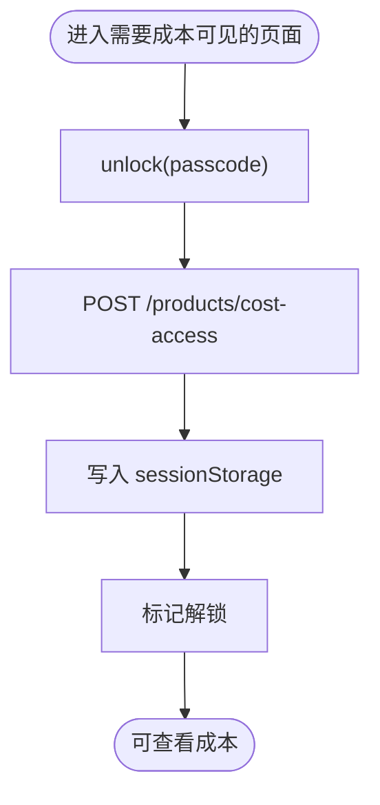
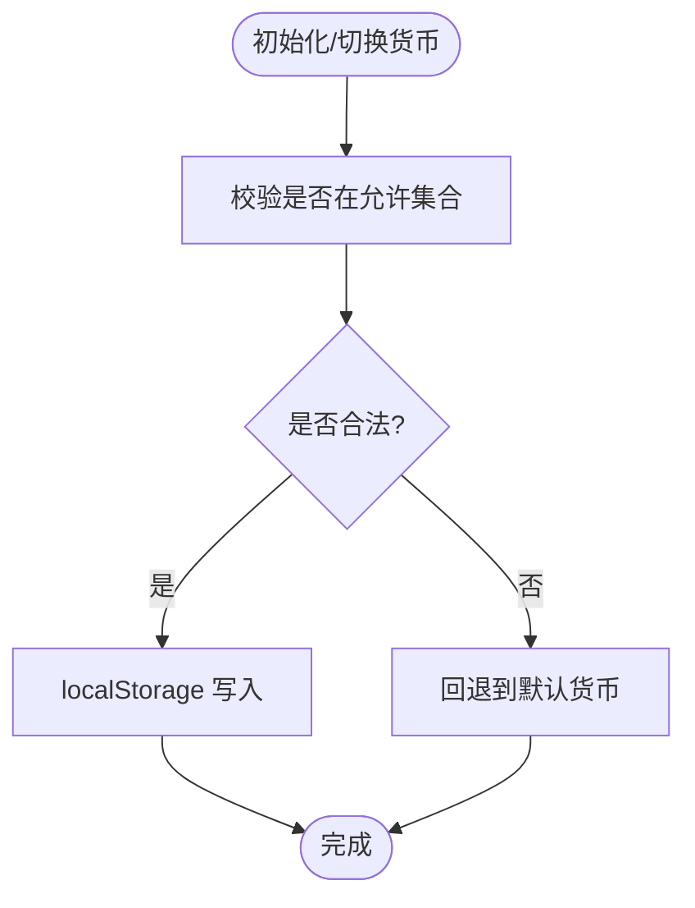
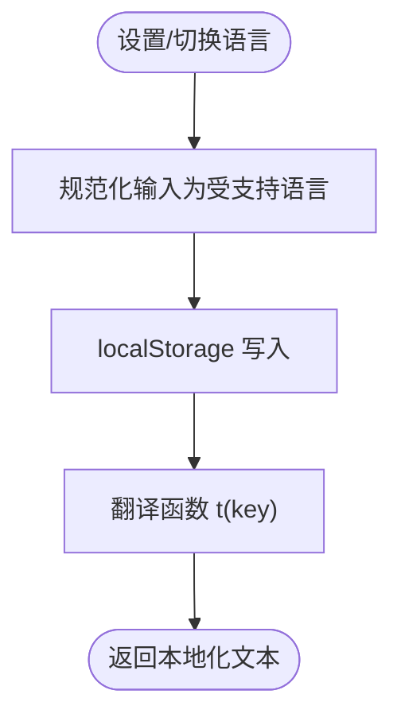
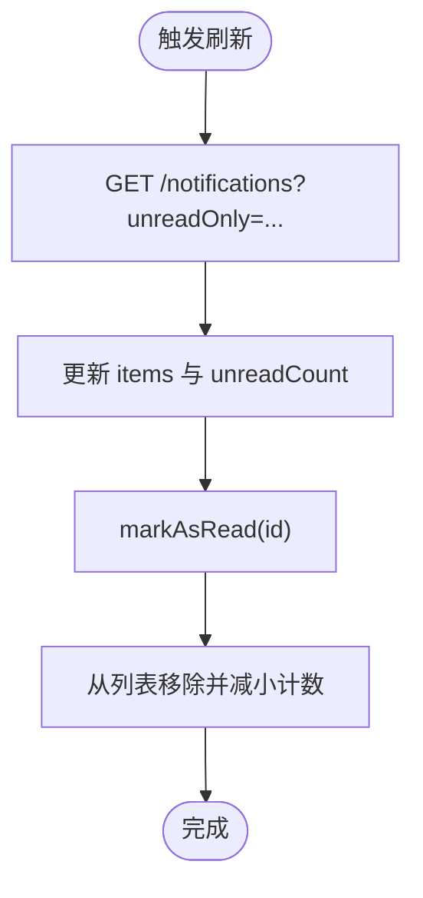
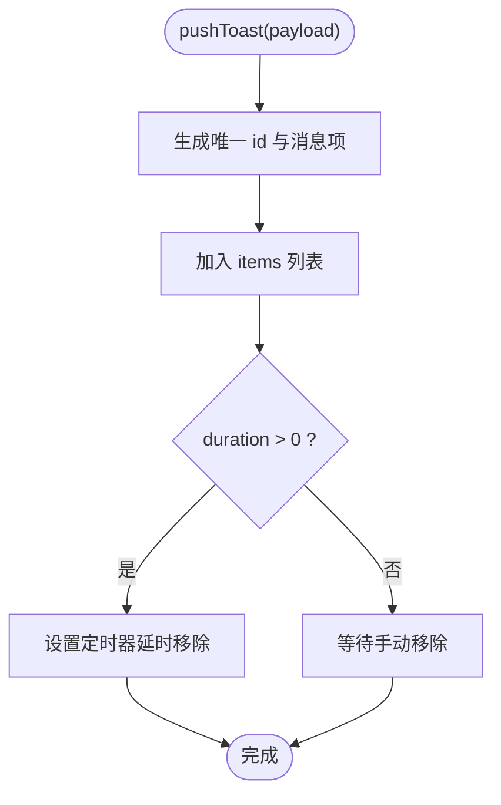
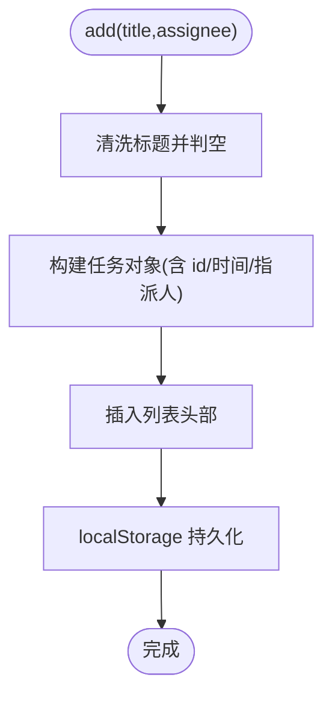
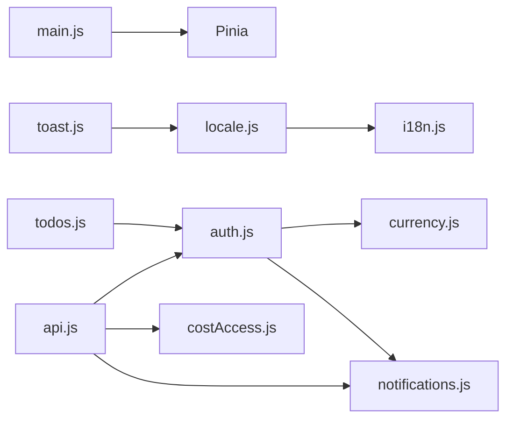

# 状态管理

<cite>
**本文引用的文件**
- [web/src/main.js](file://web/src/main.js)
- [web/src/stores/auth.js](file://web/src/stores/auth.js)
- [web/src/stores/costAccess.js](file://web/src/stores/costAccess.js)
- [web/src/stores/currency.js](file://web/src/stores/currency.js)
- [web/src/stores/locale.js](file://web/src/stores/locale.js)
- [web/src/stores/notifications.js](file://web/src/stores/notifications.js)
- [web/src/stores/toast.js](file://web/src/stores/toast.js)
- [web/src/stores/todos.js](file://web/src/stores/todos.js)
- [web/src/services/api.js](file://web/src/services/api.js)
- [web/src/utils/i18n.js](file://web/src/utils/i18n.js)
- [web/src/components/GlobalToastCenter.vue](file://web/src/components/GlobalToastCenter.vue)
- [web/src/pages/LoginPage.vue](file://web/src/pages/LoginPage.vue)
- [web/src/pages/TodoPage.vue](file://web/src/pages/TodoPage.vue)
- [web/package.json](file://web/package.json)
</cite>

## 目录
1. [简介](#简介)
2. [项目结构](#项目结构)
3. [核心组件](#核心组件)
4. [架构总览](#架构总览)
5. [详细组件分析](#详细组件分析)
6. [依赖分析](#依赖分析)
7. [性能考虑](#性能考虑)
8. [故障排查指南](#故障排查指南)
9. [结论](#结论)
10. [附录](#附录)

## 简介
本文件系统性梳理库存管理前端的状态管理方案，基于 Pinia 进行模块化状态设计与实现。内容覆盖各 store 的职责边界、状态声明、action 方法与 getter 计算属性，以及跨模块协作模式；并总结最佳实践，包括状态设计原则、异步处理、持久化策略与调试技巧。同时提供新增 store 模块的参考路径与示例定位，帮助开发者快速扩展与维护。

## 项目结构
- 状态管理入口：在应用入口统一注册 Pinia，使全局页面与组件可共享状态。
- Store 模块：按功能域划分，分别负责认证、成本访问、货币、本地化、通知、消息提示与待办事项。
- 服务层：通过统一的 API 客户端注入鉴权与国际化等请求头，确保后端接口一致性。
- 视图层：页面与组件通过组合式 API 使用 store，实现响应式更新与交互。

图表来源
- [web/src/main.js:1-14](file://web/src/main.js#L1-L14)
- [web/src/stores/auth.js:1-90](file://web/src/stores/auth.js#L1-L90)
- [web/src/stores/costAccess.js:1-37](file://web/src/stores/costAccess.js#L1-L37)
- [web/src/stores/currency.js:1-21](file://web/src/stores/currency.js#L1-L21)
- [web/src/stores/locale.js:1-38](file://web/src/stores/locale.js#L1-L38)
- [web/src/stores/notifications.js:1-52](file://web/src/stores/notifications.js#L1-L52)
- [web/src/stores/toast.js:1-51](file://web/src/stores/toast.js#L1-L51)
- [web/src/stores/todos.js:1-91](file://web/src/stores/todos.js#L1-L91)
- [web/src/services/api.js:1-45](file://web/src/services/api.js#L1-L45)
- [web/src/utils/i18n.js:1-189](file://web/src/utils/i18n.js#L1-L189)
- [web/src/components/GlobalToastCenter.vue:1-41](file://web/src/components/GlobalToastCenter.vue#L1-L41)
- [web/src/pages/LoginPage.vue:1-136](file://web/src/pages/LoginPage.vue#L1-L136)
- [web/src/pages/TodoPage.vue:1-131](file://web/src/pages/TodoPage.vue#L1-L131)

章节来源
- [web/src/main.js:1-14](file://web/src/main.js#L1-L14)

## 核心组件
本项目采用组合式 Store 定义方式，以函数式风格导出状态与方法，便于 TypeScript 推断与 Tree-shaking。核心能力包括：
- 状态声明：使用 ref 声明响应式状态，computed 声明只读派生状态。
- Action 方法：封装业务逻辑，统一处理异步请求、错误与副作用。
- Getter 计算属性：基于状态派生新值，减少模板中的重复计算。
- 跨模块协作：store 之间通过组合式 API 直接调用彼此方法，保持低耦合高内聚。

章节来源
- [web/src/stores/auth.js:19-89](file://web/src/stores/auth.js#L19-L89)
- [web/src/stores/costAccess.js:5-36](file://web/src/stores/costAccess.js#L5-L36)
- [web/src/stores/currency.js:7-20](file://web/src/stores/currency.js#L7-L20)
- [web/src/stores/locale.js:7-37](file://web/src/stores/locale.js#L7-L37)
- [web/src/stores/notifications.js:5-51](file://web/src/stores/notifications.js#L5-L51)
- [web/src/stores/toast.js:4-50](file://web/src/stores/toast.js#L4-L50)
- [web/src/stores/todos.js:19-90](file://web/src/stores/todos.js#L19-L90)

## 架构总览
下图展示了登录流程中关键组件与 store 的交互顺序，体现“视图 -> store -> 服务 -> 后端”的闭环。

图表来源
- [web/src/pages/LoginPage.vue:41-50](file://web/src/pages/LoginPage.vue#L41-L50)
- [web/src/stores/auth.js:44-78](file://web/src/stores/auth.js#L44-L78)
- [web/src/stores/currency.js:10-14](file://web/src/stores/currency.js#L10-L14)
- [web/src/stores/notifications.js:13-25](file://web/src/stores/notifications.js#L13-L25)
- [web/src/services/api.js:8-24](file://web/src/services/api.js#L8-L24)

## 详细组件分析

### 认证状态 (auth)
- 职责：维护登录态、用户信息、加载状态；提供登录、拉取用户资料、清理会话等动作。
- 关键点：
  - 使用 localStorage 持久化 token 与用户信息，刷新后可恢复。
  - 登录成功后联动货币与通知模块初始化。
  - 异常时清理本地状态并重置通知。
- 典型调用路径：[web/src/pages/LoginPage.vue:41-50](file://web/src/pages/LoginPage.vue#L41-L50) -> [web/src/stores/auth.js:44-78](file://web/src/stores/auth.js#L44-L78)

图表来源
- [web/src/pages/LoginPage.vue:41-50](file://web/src/pages/LoginPage.vue#L41-L50)
- [web/src/stores/auth.js:44-78](file://web/src/stores/auth.js#L44-L78)

章节来源
- [web/src/stores/auth.js:19-89](file://web/src/stores/auth.js#L19-L89)
- [web/src/pages/LoginPage.vue:1-136](file://web/src/pages/LoginPage.vue#L1-L136)

### 成本访问 (costAccess)
- 职责：管理成本可见性的解锁/锁定，使用 sessionStorage 临时存储令牌。
- 关键点：
  - 解锁成功后写入 sessionStorage 并标记解锁状态。
  - 锁定时移除令牌并重置状态。
- 典型调用路径：[web/src/stores/costAccess.js:11-22](file://web/src/stores/costAccess.js#L11-L22)

图表来源
- [web/src/stores/costAccess.js:11-22](file://web/src/stores/costAccess.js#L11-L22)

章节来源
- [web/src/stores/costAccess.js:1-37](file://web/src/stores/costAccess.js#L1-L37)

### 货币管理 (currency)
- 职责：维护当前货币与默认值校验，写入 localStorage。
- 关键点：
  - 只允许预设集合内的货币码，非法值回退到默认货币。
  - 与认证模块配合，优先使用用户偏好的货币。
- 典型调用路径：[web/src/stores/currency.js:10-14](file://web/src/stores/currency.js#L10-L14) -> [web/src/stores/auth.js:50-52](file://web/src/stores/auth.js#L50-L52)

图表来源
- [web/src/stores/currency.js:10-14](file://web/src/stores/currency.js#L10-L14)
- [web/src/stores/auth.js:50-52](file://web/src/stores/auth.js#L50-L52)

章节来源
- [web/src/stores/currency.js:1-21](file://web/src/stores/currency.js#L1-L21)

### 本地化 (locale)
- 职责：维护当前语言与切换逻辑，提供翻译函数 t(key)。
- 关键点：
  - 仅接受特定语言标识，非法值回退到默认语言。
  - 通过内置映射表进行文本翻译，支持回退逻辑。
- 典型调用路径：[web/src/stores/locale.js:21-29](file://web/src/stores/locale.js#L21-L29) -> [web/src/utils/i18n.js:1-189](file://web/src/utils/i18n.js#L1-L189)

图表来源
- [web/src/stores/locale.js:21-29](file://web/src/stores/locale.js#L21-L29)
- [web/src/utils/i18n.js:1-189](file://web/src/utils/i18n.js#L1-L189)

章节来源
- [web/src/stores/locale.js:1-38](file://web/src/stores/locale.js#L1-L38)
- [web/src/utils/i18n.js:1-189](file://web/src/utils/i18n.js#L1-L189)

### 通知系统 (notifications)
- 职责：拉取未读通知、标记已读、重置状态。
- 关键点：
  - 首次拉取后标记 loadedOnce，避免重复请求。
  - 已读操作从列表剔除对应项并减少未读计数。
- 典型调用路径：[web/src/stores/notifications.js:13-31](file://web/src/stores/notifications.js#L13-L31)

图表来源
- [web/src/stores/notifications.js:13-31](file://web/src/stores/notifications.js#L13-L31)

章节来源
- [web/src/stores/notifications.js:1-52](file://web/src/stores/notifications.js#L1-L52)

### 消息提示 (toast)
- 职责：集中管理全局消息提示，支持自动消失与动作回调。
- 关键点：
  - 自动定时器清理过期消息。
  - 支持触发动作回调后自动移除。
- 典型调用路径：[web/src/stores/toast.js:11-31](file://web/src/stores/toast.js#L11-L31) -> [web/src/components/GlobalToastCenter.vue:1-41](file://web/src/components/GlobalToastCenter.vue#L1-L41)

图表来源
- [web/src/stores/toast.js:11-31](file://web/src/stores/toast.js#L11-L31)
- [web/src/components/GlobalToastCenter.vue:10-39](file://web/src/components/GlobalToastCenter.vue#L10-L39)

章节来源
- [web/src/stores/toast.js:1-51](file://web/src/stores/toast.js#L1-L51)
- [web/src/components/GlobalToastCenter.vue:1-41](file://web/src/components/GlobalToastCenter.vue#L1-L41)

### 待办事项 (todos)
- 职责：本地化的任务管理，按用户维度隔离存储。
- 关键点：
  - 以用户 ID 作为存储键，保障不同用户数据隔离。
  - 所有变更均持久化到 localStorage，刷新不丢失。
- 典型调用路径：[web/src/stores/todos.js:28-75](file://web/src/stores/todos.js#L28-L75) -> [web/src/pages/TodoPage.vue:19-44](file://web/src/pages/TodoPage.vue#L19-L44)

图表来源
- [web/src/stores/todos.js:28-75](file://web/src/stores/todos.js#L28-L75)
- [web/src/pages/TodoPage.vue:19-44](file://web/src/pages/TodoPage.vue#L19-L44)

章节来源
- [web/src/stores/todos.js:1-91](file://web/src/stores/todos.js#L1-L91)
- [web/src/pages/TodoPage.vue:1-131](file://web/src/pages/TodoPage.vue#L1-L131)

## 依赖分析
- 应用入口依赖：Pinia 在入口处统一安装，保证全局可访问。
- 模块间依赖：
  - auth 依赖 currency 与 notifications。
  - locale 依赖 i18n 映射表。
  - toast 依赖 locale 进行按钮文案本地化。
  - todos 依赖 auth 获取用户上下文。
- 服务层依赖：api 客户端统一注入鉴权与本地化请求头，简化页面调用。

图表来源
- [web/src/main.js:1-14](file://web/src/main.js#L1-L14)
- [web/src/stores/auth.js:23-24](file://web/src/stores/auth.js#L23-L24)
- [web/src/stores/locale.js:1-3](file://web/src/stores/locale.js#L1-L3)
- [web/src/stores/toast.js:1-2](file://web/src/stores/toast.js#L1-L2)
- [web/src/stores/todos.js:3](file://web/src/stores/todos.js#L3)
- [web/src/services/api.js:8-24](file://web/src/services/api.js#L8-L24)

章节来源
- [web/src/main.js:1-14](file://web/src/main.js#L1-L14)
- [web/src/services/api.js:1-45](file://web/src/services/api.js#L1-L45)
- [web/package.json:12-22](file://web/package.json#L12-L22)

## 性能考虑
- 状态粒度：将独立功能拆分为独立 store，降低不必要的响应式开销。
- 异步优化：在 action 中使用 try/finally 或 finally 分支收尾，确保 loading 状态及时复位。
- 存储策略：对用户上下文敏感的数据使用 localStorage，临时态使用 sessionStorage，避免污染持久化空间。
- 渲染优化：使用 computed 复用派生状态，减少模板中的重复计算。
- 请求头注入：通过 axios 拦截器统一注入 token 与本地化头，避免在每个页面重复设置。

## 故障排查指南
- 登录失败或报错：
  - 检查后端健康状态与凭证是否正确。
  - 查看登录页错误提示与网络面板响应。
  - 参考路径：[web/src/pages/LoginPage.vue:41-50](file://web/src/pages/LoginPage.vue#L41-L50)
- 通知未刷新：
  - 确认已登录且认证 token 正确。
  - 检查拦截器是否注入 Authorization。
  - 参考路径：[web/src/stores/notifications.js:13-25](file://web/src/stores/notifications.js#L13-L25)、[web/src/services/api.js:8-24](file://web/src/services/api.js#L8-L24)
- 货币显示异常：
  - 确认 setCurrency 输入值是否在允许集合。
  - 参考路径：[web/src/stores/currency.js:10-14](file://web/src/stores/currency.js#L10-L14)
- 本地化文本缺失：
  - 检查 locale 是否为受支持值，确认 i18n 映射是否存在。
  - 参考路径：[web/src/stores/locale.js:21-29](file://web/src/stores/locale.js#L21-L29)、[web/src/utils/i18n.js:1-189](file://web/src/utils/i18n.js#L1-L189)
- 消息提示不消失：
  - 检查 pushToast 的 duration 参数与定时器是否执行。
  - 参考路径：[web/src/stores/toast.js:11-31](file://web/src/stores/toast.js#L11-L31)
- 待办事项丢失：
  - 确认用户切换或清除了浏览器缓存。
  - 参考路径：[web/src/stores/todos.js:24-26](file://web/src/stores/todos.js#L24-L26)

章节来源
- [web/src/pages/LoginPage.vue:41-50](file://web/src/pages/LoginPage.vue#L41-L50)
- [web/src/stores/notifications.js:13-25](file://web/src/stores/notifications.js#L13-L25)
- [web/src/services/api.js:8-24](file://web/src/services/api.js#L8-L24)
- [web/src/stores/currency.js:10-14](file://web/src/stores/currency.js#L10-L14)
- [web/src/stores/locale.js:21-29](file://web/src/stores/locale.js#L21-L29)
- [web/src/utils/i18n.js:1-189](file://web/src/utils/i18n.js#L1-L189)
- [web/src/stores/toast.js:11-31](file://web/src/stores/toast.js#L11-L31)
- [web/src/stores/todos.js:24-26](file://web/src/stores/todos.js#L24-L26)

## 结论
本项目以 Pinia 为核心，围绕认证、成本访问、货币、本地化、通知、消息提示与待办事项七个模块构建了清晰、可扩展的状态体系。通过统一的服务层与拦截器，实现了跨模块的一致性与可维护性。遵循本文最佳实践，可在保证性能与用户体验的同时，持续扩展更多 store 模块。

## 附录
- 新增 store 模块参考路径
  - 定义位置：[web/src/stores/](file://web/src/stores/)
  - 入口注册：[web/src/main.js:10](file://web/src/main.js#L10)
  - 依赖注入：[web/src/services/api.js:8-24](file://web/src/services/api.js#L8-L24)
  - 本地化映射：[web/src/utils/i18n.js:1-189](file://web/src/utils/i18n.js#L1-L189)
  - 组件使用示例：[web/src/pages/LoginPage.vue:9-10](file://web/src/pages/LoginPage.vue#L9-L10)、[web/src/pages/TodoPage.vue:7-12](file://web/src/pages/TodoPage.vue#L7-L12)
- 依赖版本
  - Vue 3 与 Pinia 版本：[web/package.json:18-19](file://web/package.json#L18-L19)