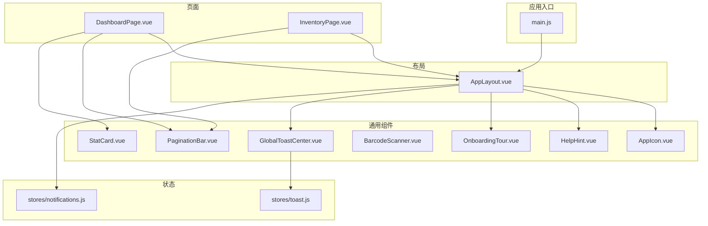
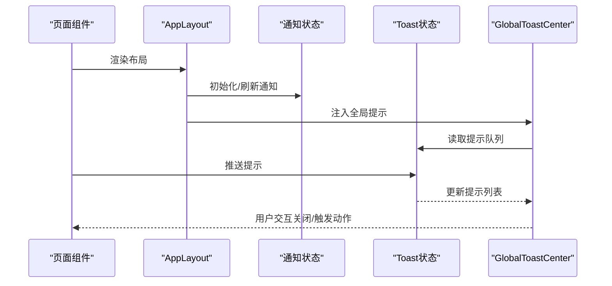
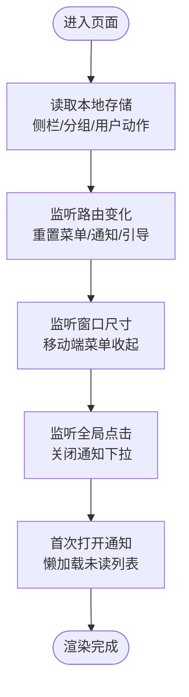
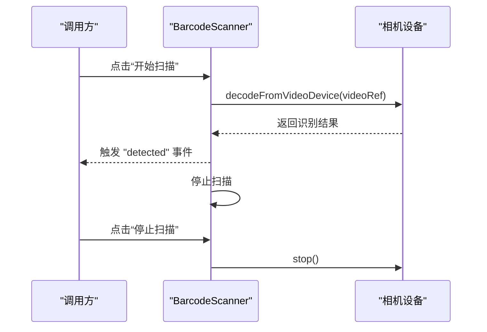
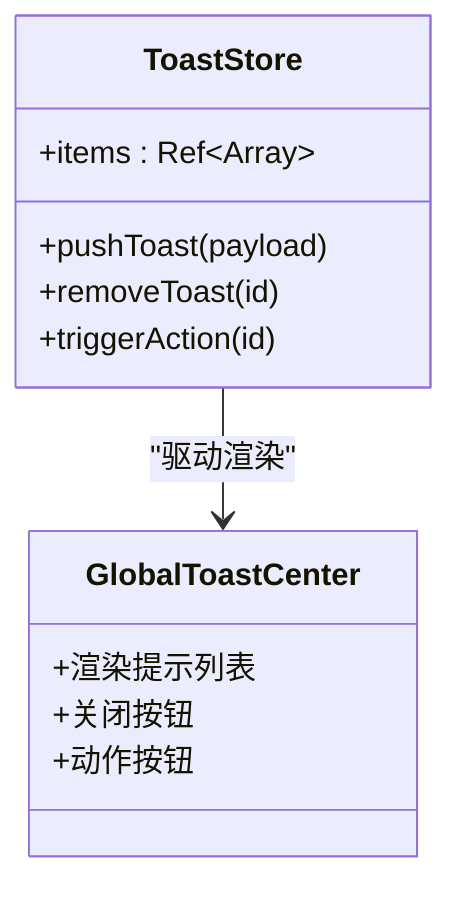
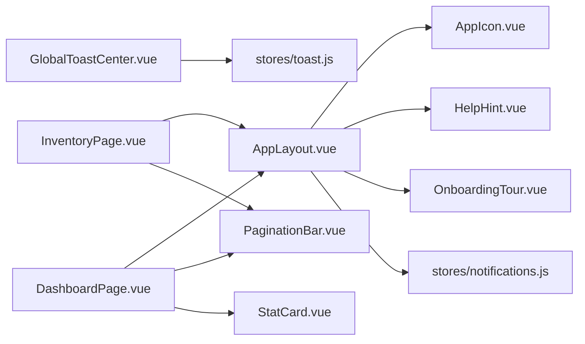

# 组件系统

<cite>
**本文引用的文件**
- [web/src/layouts/AppLayout.vue](file://web/src/layouts/AppLayout.vue)
- [web/src/components/BarcodeScanner.vue](file://web/src/components/BarcodeScanner.vue)
- [web/src/components/GlobalToastCenter.vue](file://web/src/components/GlobalToastCenter.vue)
- [web/src/components/PaginationBar.vue](file://web/src/components/PaginationBar.vue)
- [web/src/components/StatCard.vue](file://web/src/components/StatCard.vue)
- [web/src/components/HelpHint.vue](file://web/src/components/HelpHint.vue)
- [web/src/components/OnboardingTour.vue](file://web/src/components/OnboardingTour.vue)
- [web/src/components/AppIcon.vue](file://web/src/components/AppIcon.vue)
- [web/src/stores/toast.js](file://web/src/stores/toast.js)
- [web/src/stores/notifications.js](file://web/src/stores/notifications.js)
- [web/src/pages/DashboardPage.vue](file://web/src/pages/DashboardPage.vue)
- [web/src/pages/InventoryPage.vue](file://web/src/pages/InventoryPage.vue)
- [web/src/main.js](file://web/src/main.js)
- [web/src/style.css](file://web/src/style.css)
</cite>

## 目录
1. [简介](#简介)
2. [项目结构](#项目结构)
3. [核心组件](#核心组件)
4. [架构总览](#架构总览)
5. [组件详解](#组件详解)
6. [依赖关系分析](#依赖关系分析)
7. [性能考量](#性能考量)
8. [故障排查指南](#故障排查指南)
9. [结论](#结论)
10. [附录：最佳实践与示例路径](#附录最佳实践与示例路径)

## 简介
本文件面向库存管理系统的前端组件体系，聚焦可复用组件的设计原则与实现模式，覆盖布局组件 AppLayout、条形码扫描组件 BarcodeScanner、全局提示组件 GlobalToastCenter 等。文档从 props 定义、事件发射、插槽使用、生命周期管理等方面进行系统梳理，并总结组件开发最佳实践（命名规范、状态管理、样式封装、性能优化），最后提供创建新组件的参考路径与步骤。

## 项目结构
- 组件层位于 web/src/components，包含通用 UI 组件与图标组件。
- 布局层位于 web/src/layouts，AppLayout 作为全局布局容器，承载导航、面包屑、通知、引导等能力。
- 页面层位于 web/src/pages，各业务页面通过组合通用组件构建视图。
- 状态层位于 web/src/stores，采用 Pinia 进行跨组件状态管理（如 Toast、通知）。
- 应用入口位于 web/src/main.js，统一挂载 Pinia 与路由。
- 样式基于 Tailwind，基础样式位于 web/src/style.css。

**图表来源**
- [web/src/main.js:1-14](file://web/src/main.js#L1-L14)
- [web/src/layouts/AppLayout.vue:1-831](file://web/src/layouts/AppLayout.vue#L1-L831)
- [web/src/components/AppIcon.vue:1-49](file://web/src/components/AppIcon.vue#L1-L49)
- [web/src/components/HelpHint.vue:1-27](file://web/src/components/HelpHint.vue#L1-L27)
- [web/src/components/OnboardingTour.vue:1-116](file://web/src/components/OnboardingTour.vue#L1-L116)
- [web/src/components/BarcodeScanner.vue:1-68](file://web/src/components/BarcodeScanner.vue#L1-L68)
- [web/src/components/PaginationBar.vue:1-51](file://web/src/components/PaginationBar.vue#L1-L51)
- [web/src/components/GlobalToastCenter.vue:1-41](file://web/src/components/GlobalToastCenter.vue#L1-L41)
- [web/src/components/StatCard.vue:1-16](file://web/src/components/StatCard.vue#L1-L16)
- [web/src/stores/toast.js:1-51](file://web/src/stores/toast.js#L1-L51)
- [web/src/stores/notifications.js:1-52](file://web/src/stores/notifications.js#L1-L52)
- [web/src/pages/DashboardPage.vue:1-200](file://web/src/pages/DashboardPage.vue#L1-L200)
- [web/src/pages/InventoryPage.vue:1-200](file://web/src/pages/InventoryPage.vue#L1-L200)

**章节来源**
- [web/src/main.js:1-14](file://web/src/main.js#L1-L14)
- [web/src/style.css:1-18](file://web/src/style.css#L1-L18)

## 核心组件
- AppLayout：全局布局容器，负责侧边/顶部导航、面包屑、通知中心、引导向导、用户动作区、移动端菜单等。
- BarcodeScanner：基于浏览器解码库的扫码组件，提供启动/停止扫描、错误提示、结果事件。
- GlobalToastCenter：全局提示弹窗中心，基于 Pinia 状态驱动，支持成功/错误/信息三类提示与可选动作按钮。
- PaginationBar：分页条组件，接收分页对象，暴露翻页事件。
- StatCard：统计卡片组件，展示标题、数值与辅助提示。
- HelpHint：帮助提示按钮，透传点击事件。
- OnboardingTour：引导向导，支持多步引导、前后切换、完成回调。
- AppIcon：SVG 图标组件，按名称映射路径集合。

**章节来源**
- [web/src/layouts/AppLayout.vue:1-831](file://web/src/layouts/AppLayout.vue#L1-L831)
- [web/src/components/BarcodeScanner.vue:1-68](file://web/src/components/BarcodeScanner.vue#L1-L68)
- [web/src/components/GlobalToastCenter.vue:1-41](file://web/src/components/GlobalToastCenter.vue#L1-L41)
- [web/src/components/PaginationBar.vue:1-51](file://web/src/components/PaginationBar.vue#L1-L51)
- [web/src/components/StatCard.vue:1-16](file://web/src/components/StatCard.vue#L1-L16)
- [web/src/components/HelpHint.vue:1-27](file://web/src/components/HelpHint.vue#L1-L27)
- [web/src/components/OnboardingTour.vue:1-116](file://web/src/components/OnboardingTour.vue#L1-L116)
- [web/src/components/AppIcon.vue:1-49](file://web/src/components/AppIcon.vue#L1-L49)

## 架构总览
组件系统围绕“布局 + 通用组件 + 页面”的分层组织，状态通过 Pinia 在组件间共享。AppLayout 作为根布局，承载全局交互；通用组件以单一职责、明确 props/事件/插槽为设计准则；页面通过组合通用组件完成业务视图。

**图表来源**
- [web/src/layouts/AppLayout.vue:290-309](file://web/src/layouts/AppLayout.vue#L290-L309)
- [web/src/stores/notifications.js:13-25](file://web/src/stores/notifications.js#L13-L25)
- [web/src/stores/toast.js:11-31](file://web/src/stores/toast.js#L11-L31)
- [web/src/components/GlobalToastCenter.vue:1-41](file://web/src/components/GlobalToastCenter.vue#L1-L41)

## 组件详解

### AppLayout 布局组件
- 设计要点
  - 导航与分组：根据角色过滤可见导航项，按分组折叠/展开，支持桌面端侧栏与移动端抽屉菜单。
  - 面包屑：基于当前路由动态生成，支持多语言标签。
  - 通知中心：点击打开下拉，懒加载未读通知，支持刷新与标记已读。
  - 引导向导：内置多页面引导步骤，支持开始/跳过/下一步/完成。
  - 用户动作区：支持隐藏/显示，切换语言与退出登录。
  - 生命周期：监听窗口尺寸变化与全局点击，路由切换时重置状态。
- 关键 props/事件/插槽
  - 无显式 props（通过路由与全局状态驱动）。
  - 事件：无对外事件发射。
  - 插槽：支持具名 sidebar 插槽以扩展页面侧栏。
- 状态管理
  - 使用 Pinia 状态（通知、语言、认证）与本地存储（侧栏折叠、分组展开、用户动作可见性）。
- 性能与可用性
  - 分组状态持久化，避免每次进入重新展开。
  - 通知懒加载，减少初始请求压力。
  - 移动端抽屉与桌面端侧栏切换，适配不同屏幕尺寸。

**图表来源**
- [web/src/layouts/AppLayout.vue:332-366](file://web/src/layouts/AppLayout.vue#L332-L366)
- [web/src/layouts/AppLayout.vue:243-246](file://web/src/layouts/AppLayout.vue#L243-L246)
- [web/src/layouts/AppLayout.vue:258-268](file://web/src/layouts/AppLayout.vue#L258-L268)
- [web/src/layouts/AppLayout.vue:290-295](file://web/src/layouts/AppLayout.vue#L290-L295)

**章节来源**
- [web/src/layouts/AppLayout.vue:1-831](file://web/src/layouts/AppLayout.vue#L1-L831)

### BarcodeScanner 条形码扫描组件
- 设计要点
  - 基于浏览器解码库，启动/停止扫描，捕获识别结果后发出 detected 事件。
  - 错误处理：摄像头不可用或权限拒绝时显示提示。
  - 生命周期：组件卸载时自动停止扫描，避免资源泄漏。
- Props/事件/插槽
  - 无 props。
  - 事件：detected(resultText)。
  - 无插槽。
- 使用建议
  - 在需要扫码的页面中引入，订阅 detected 事件并处理结果。
  - 注意权限与设备兼容性，提供降级方案。

**图表来源**
- [web/src/components/BarcodeScanner.vue:13-38](file://web/src/components/BarcodeScanner.vue#L13-L38)

**章节来源**
- [web/src/components/BarcodeScanner.vue:1-68](file://web/src/components/BarcodeScanner.vue#L1-L68)

### GlobalToastCenter 全局提示组件
- 设计要点
  - 固定右上角区域，基于 Pinia 状态 items 驱动渲染。
  - 支持三类提示：成功/错误/信息；可选动作按钮，点击触发对应回调并移除提示。
  - 自动定时移除（默认 5 秒，可配置）。
- Props/事件/插槽
  - 无 props。
  - 无事件发射。
  - 无插槽。
- 状态管理
  - 通过 useToastStore 推送/移除提示，触发动作时异步执行并移除。

**图表来源**
- [web/src/stores/toast.js:1-51](file://web/src/stores/toast.js#L1-L51)
- [web/src/components/GlobalToastCenter.vue:1-41](file://web/src/components/GlobalToastCenter.vue#L1-L41)

**章节来源**
- [web/src/components/GlobalToastCenter.vue:1-41](file://web/src/components/GlobalToastCenter.vue#L1-L41)
- [web/src/stores/toast.js:1-51](file://web/src/stores/toast.js#L1-L51)

### PaginationBar 分页条组件
- 设计要点
  - 接收分页对象，校验边界后触发 change 事件。
  - 多语言文案：总条数、当前页/总页数、上一页/下一页。
- Props/事件/插槽
  - props: pagination(Object, 必填)。
  - 事件：change(page)。
  - 无插槽。
- 使用建议
  - 将分页对象与列表数据绑定，监听 change 后重新加载数据。

**章节来源**
- [web/src/components/PaginationBar.vue:1-51](file://web/src/components/PaginationBar.vue#L1-L51)

### StatCard 统计卡片组件
- 设计要点
  - 展示标题、数值与可选提示，简洁直观。
- Props/事件/插槽
  - props: title(String, 必填), value(String|Number, 必填), hint(String, 可选)。
  - 无事件、无插槽。
- 使用建议
  - 用于 Dashboard 的关键指标展示，配合多卡片布局。

**章节来源**
- [web/src/components/StatCard.vue:1-16](file://web/src/components/StatCard.vue#L1-L16)

### HelpHint 帮助提示组件
- 设计要点
  - 小型问号按钮，带 title/aria-label 提示文本，透传 click 事件。
- Props/事件/插槽
  - props: text(String, 默认空)。
  - 事件：click。
  - 无插槽。
- 使用建议
  - 与 AppLayout 的引导提示结合使用，增强可发现性。

**章节来源**
- [web/src/components/HelpHint.vue:1-27](file://web/src/components/HelpHint.vue#L1-L27)

### OnboardingTour 引导向导组件
- 设计要点
  - 多步引导，支持上一步/下一步/跳过/完成，完成时发射 complete。
  - 打开状态受外部控制（open）。
- Props/事件/插槽
  - props: open(Boolean, 默认 false), title(String, 默认空), steps(Array, 默认空数组)。
  - 事件：complete({ done })。
  - 无插槽。
- 使用建议
  - 与 AppLayout 内部引导映射结合，按页面动态注入步骤。

**章节来源**
- [web/src/components/OnboardingTour.vue:1-116](file://web/src/components/OnboardingTour.vue#L1-L116)

### AppIcon 图标组件
- 设计要点
  - 通过 name 映射 SVG 路径集合，支持自定义 class。
- Props/事件/插槽
  - props: name(String, 必填), class(String, 默认空)。
  - 无事件、无插槽。
- 使用建议
  - 统一图标风格，避免硬编码 SVG。

**章节来源**
- [web/src/components/AppIcon.vue:1-49](file://web/src/components/AppIcon.vue#L1-L49)

## 依赖关系分析
- 组件依赖
  - AppLayout 依赖 AppIcon、HelpHint、OnboardingTour、ToastStore、NotificationsStore。
  - GlobalToastCenter 依赖 ToastStore。
  - PaginationBar 依赖本地化存储（多语言）。
  - OnboardingTour 依赖本地化存储。
- 状态依赖
  - 通知与 Toast 通过 Pinia 独立管理，避免跨组件耦合。
- 页面依赖
  - DashboardPage 与 InventoryPage 均组合 AppLayout 与其他通用组件。

**图表来源**
- [web/src/layouts/AppLayout.vue:1-10](file://web/src/layouts/AppLayout.vue#L1-L10)
- [web/src/components/GlobalToastCenter.vue:1-7](file://web/src/components/GlobalToastCenter.vue#L1-L7)
- [web/src/stores/toast.js:1-51](file://web/src/stores/toast.js#L1-L51)
- [web/src/stores/notifications.js:1-52](file://web/src/stores/notifications.js#L1-L52)
- [web/src/pages/DashboardPage.vue:17-24](file://web/src/pages/DashboardPage.vue#L17-L24)
- [web/src/pages/InventoryPage.vue:1-8](file://web/src/pages/InventoryPage.vue#L1-L8)

**章节来源**
- [web/src/pages/DashboardPage.vue:1-200](file://web/src/pages/DashboardPage.vue#L1-L200)
- [web/src/pages/InventoryPage.vue:1-200](file://web/src/pages/InventoryPage.vue#L1-L200)

## 性能考量
- 懒加载与节流
  - 通知中心首次打开才拉取数据，避免首屏阻塞。
- 本地存储
  - 侧栏折叠、分组展开、用户动作可见性持久化，减少重复计算与网络请求。
- 资源释放
  - BarcodeScanner 卸载时停止扫描，防止后台占用。
- 渲染优化
  - 统一使用 Tailwind 类名，减少内联样式的复杂度。
- 状态粒度
  - Toast 与通知拆分为独立 Store，降低不必要的响应式开销。

[本节为通用指导，无需特定文件引用]

## 故障排查指南
- 扫描组件无法启动
  - 检查摄像头权限与 HTTPS 环境；组件会在异常时输出错误提示。
  - 参考路径：[BarcodeScanner.vue:24-31](file://web/src/components/BarcodeScanner.vue#L24-L31)
- 通知不显示或不刷新
  - 确认鉴权令牌存在且通知 Store 已初始化；检查网络请求与接口返回。
  - 参考路径：[AppLayout.vue:290-295](file://web/src/layouts/AppLayout.vue#L290-L295)、[notifications.js:13-25](file://web/src/stores/notifications.js#L13-L25)
- 全局提示不消失
  - 检查推送时是否设置了非零时长；确认触发了 remove 或自动超时。
  - 参考路径：[toast.js:24-28](file://web/src/stores/toast.js#L24-L28)
- 引导向导不出现
  - 确认传入 open 与 steps；检查本地化语言键值。
  - 参考路径：[OnboardingTour.vue:48-55](file://web/src/components/OnboardingTour.vue#L48-L55)

**章节来源**
- [web/src/components/BarcodeScanner.vue:24-31](file://web/src/components/BarcodeScanner.vue#L24-L31)
- [web/src/layouts/AppLayout.vue:290-295](file://web/src/layouts/AppLayout.vue#L290-L295)
- [web/src/stores/notifications.js:13-25](file://web/src/stores/notifications.js#L13-L25)
- [web/src/stores/toast.js:24-28](file://web/src/stores/toast.js#L24-L28)
- [web/src/components/OnboardingTour.vue:48-55](file://web/src/components/OnboardingTour.vue#L48-L55)

## 结论
该组件系统以 AppLayout 为核心，围绕通用组件与 Pinia 状态实现高内聚、低耦合的复用模式。通过清晰的 props/事件/插槽约定与生命周期管理，确保组件可测试、可维护、可扩展。建议在新增组件时遵循本文最佳实践，优先考虑状态抽取、本地化、无障碍与性能优化。

[本节为总结，无需特定文件引用]

## 附录：最佳实践与示例路径
- 命名规范
  - 组件文件名采用 PascalCase（如 AppLayout.vue、BarcodeScanner.vue）。
  - 图标组件统一使用 AppIcon，避免硬编码 SVG。
- 状态管理
  - 将跨组件共享的状态放入 Pinia Store；避免在组件内直接发起网络请求。
  - 示例路径：[toast.js:1-51](file://web/src/stores/toast.js#L1-L51)、[notifications.js:1-52](file://web/src/stores/notifications.js#L1-L52)
- 样式封装
  - 使用 Tailwind 类名，保持一致的间距、颜色与圆角规范。
  - 示例路径：[style.css:1-18](file://web/src/style.css#L1-L18)
- 生命周期与资源释放
  - 在 onBeforeUnmount 中释放外部资源（如扫描停止、定时器清理）。
  - 示例路径：[BarcodeScanner.vue:40-42](file://web/src/components/BarcodeScanner.vue#L40-L42)
- 事件与插槽
  - 明确事件语义（如 detected、change、complete），插槽用于页面级扩展（如 AppLayout.sidebar）。
  - 示例路径：[PaginationBar.vue:11-20](file://web/src/components/PaginationBar.vue#L11-L20)、[OnboardingTour.vue:23-34](file://web/src/components/OnboardingTour.vue#L23-L34)
- 创建新组件步骤
  - 新建组件文件（如 MyComponent.vue），定义 props/事件/插槽。
  - 在页面中引入并组合使用，必要时新增 Pinia Store。
  - 示例路径：[DashboardPage.vue:17-24](file://web/src/pages/DashboardPage.vue#L17-L24)、[InventoryPage.vue:1-8](file://web/src/pages/InventoryPage.vue#L1-L8)

**章节来源**
- [web/src/stores/toast.js:1-51](file://web/src/stores/toast.js#L1-L51)
- [web/src/stores/notifications.js:1-52](file://web/src/stores/notifications.js#L1-L52)
- [web/src/style.css:1-18](file://web/src/style.css#L1-L18)
- [web/src/components/BarcodeScanner.vue:40-42](file://web/src/components/BarcodeScanner.vue#L40-L42)
- [web/src/components/PaginationBar.vue:11-20](file://web/src/components/PaginationBar.vue#L11-L20)
- [web/src/components/OnboardingTour.vue:23-34](file://web/src/components/OnboardingTour.vue#L23-L34)
- [web/src/pages/DashboardPage.vue:17-24](file://web/src/pages/DashboardPage.vue#L17-L24)
- [web/src/pages/InventoryPage.vue:1-8](file://web/src/pages/InventoryPage.vue#L1-L8)