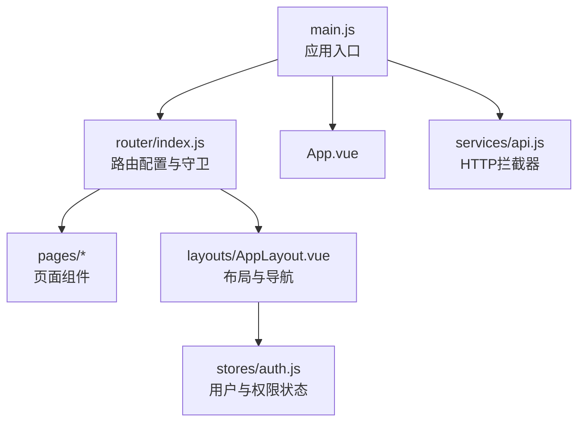
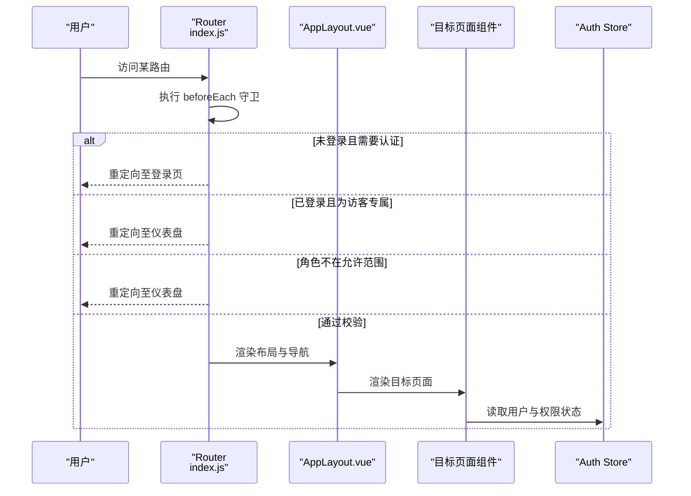
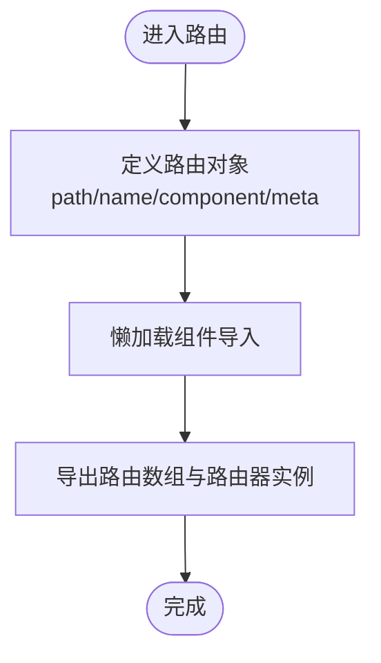
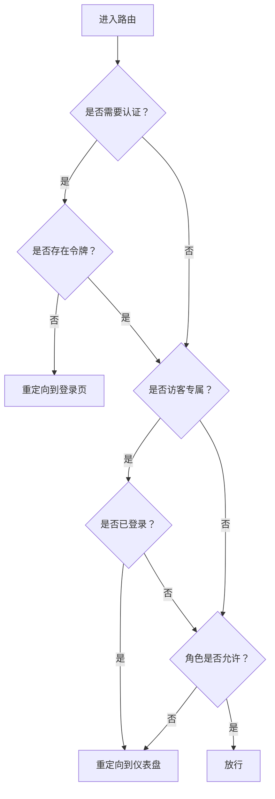
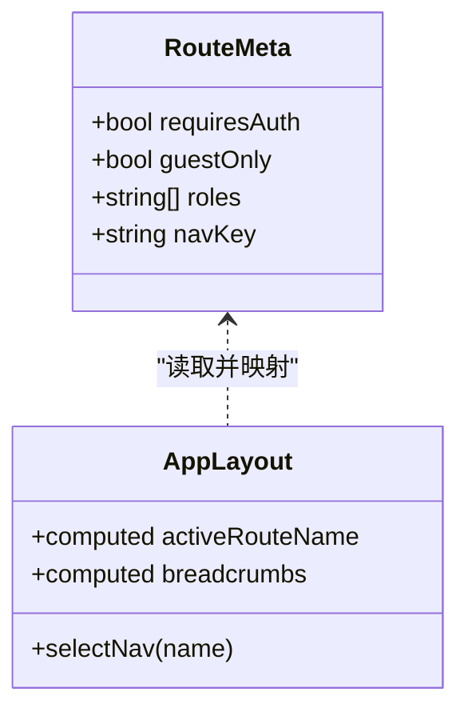
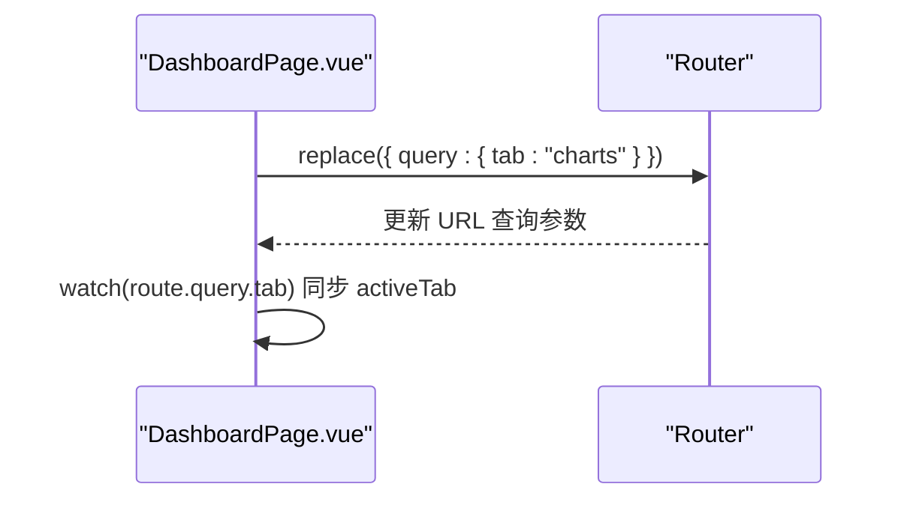
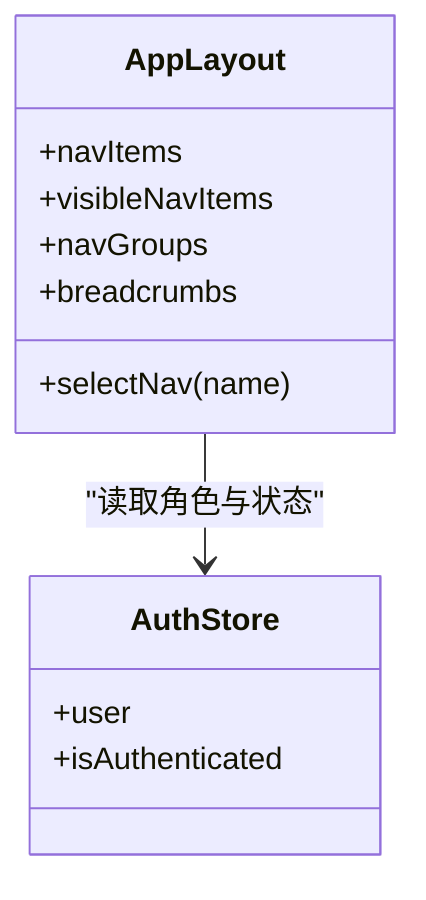
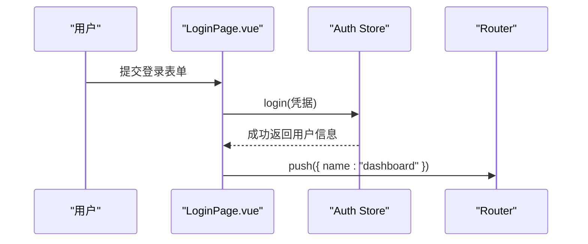
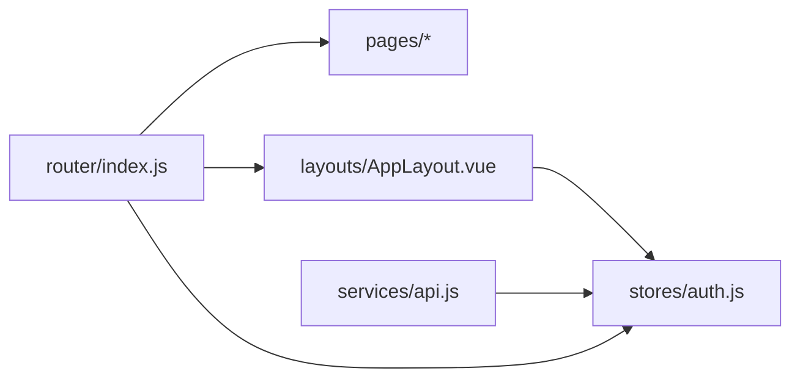

# 路由系统

<cite>
**本文引用的文件**
- [web/src/router/index.js](file://web/src/router/index.js)
- [web/src/main.js](file://web/src/main.js)
- [web/src/App.vue](file://web/src/App.vue)
- [web/src/layouts/AppLayout.vue](file://web/src/layouts/AppLayout.vue)
- [web/src/pages/DashboardPage.vue](file://web/src/pages/DashboardPage.vue)
- [web/src/pages/ProductsPage.vue](file://web/src/pages/ProductsPage.vue)
- [web/src/pages/LoginPage.vue](file://web/src/pages/LoginPage.vue)
- [web/src/stores/auth.js](file://web/src/stores/auth.js)
- [web/src/services/api.js](file://web/src/services/api.js)
- [web/src/constants/accessGuide.js](file://web/src/constants/accessGuide.js)
</cite>

## 目录
1. [简介](#简介)
2. [项目结构](#项目结构)
3. [核心组件](#核心组件)
4. [架构总览](#架构总览)
5. [详细组件分析](#详细组件分析)
6. [依赖关系分析](#依赖关系分析)
7. [性能考量](#性能考量)
8. [故障排查指南](#故障排查指南)
9. [结论](#结论)
10. [附录](#附录)

## 简介
本文件面向库存管理系统前端的 Vue Router 5 路由体系，系统性阐述路由定义、导航守卫、权限控制、懒加载与路由元信息的使用方式，并提供最佳实践与常见问题排查建议。文档同时给出路由跳转技巧、参数与查询字符串处理范式，以及新增路由的配置步骤与复杂导航逻辑的实现思路。

## 项目结构
- 路由入口与配置位于 web/src/router/index.js，集中声明所有路由与全局前置守卫。
- 应用挂载于 web/src/main.js，统一注册 Pinia 与 Router。
- 页面组件位于 web/src/pages，布局组件位于 web/src/layouts。
- 全局视图容器通过 web/src/App.vue 的 <router-view> 渲染当前路由内容。
- 权限状态来自 Pinia Store（如认证态与用户角色），并与路由元信息配合实现访问控制。

**图表来源**
- [web/src/main.js:1-14](file://web/src/main.js#L1-L14)
- [web/src/router/index.js:1-209](file://web/src/router/index.js#L1-L209)
- [web/src/App.vue:1-9](file://web/src/App.vue#L1-L9)
- [web/src/layouts/AppLayout.vue:1-831](file://web/src/layouts/AppLayout.vue#L1-L831)
- [web/src/stores/auth.js:1-90](file://web/src/stores/auth.js#L1-L90)
- [web/src/services/api.js:1-45](file://web/src/services/api.js#L1-L45)

**章节来源**
- [web/src/main.js:1-14](file://web/src/main.js#L1-L14)
- [web/src/router/index.js:1-209](file://web/src/router/index.js#L1-L209)
- [web/src/App.vue:1-9](file://web/src/App.vue#L1-L9)

## 核心组件
- 路由器实例与历史模式：使用 createRouter 与 createWebHistory 创建基于浏览器历史的路由器。
- 路由定义：集中于 routes 数组，采用路径、名称、组件与元信息（meta）组合。
- 导航守卫：全局前置守卫 router.beforeEach 实现登录态与角色校验。
- 懒加载：通过函数式组件导入实现按需加载，降低首屏体积。
- 路由元信息：requiresAuth、guestOnly、roles、navKey 等用于控制访问与导航高亮。
- 布局与导航：AppLayout 统一渲染侧边栏/面包屑/通知等，结合路由元信息 navKey 映射分组与高亮。

**章节来源**
- [web/src/router/index.js:29-180](file://web/src/router/index.js#L29-L180)
- [web/src/router/index.js:182-206](file://web/src/router/index.js#L182-L206)
- [web/src/layouts/AppLayout.vue:131-210](file://web/src/layouts/AppLayout.vue#L131-L210)

## 架构总览
路由系统围绕“路由定义 + 全局守卫 + 元信息 + 布局导航”的模式构建，形成清晰的权限控制与用户体验闭环。

**图表来源**
- [web/src/router/index.js:188-206](file://web/src/router/index.js#L188-L206)
- [web/src/layouts/AppLayout.vue:206-210](file://web/src/layouts/AppLayout.vue#L206-L210)
- [web/src/stores/auth.js:19-89](file://web/src/stores/auth.js#L19-L89)

## 详细组件分析

### 路由定义与懒加载
- 路由采用函数式组件导入实现懒加载，例如 DashboardPage、LoginPage、ProductsPage 等均通过箭头函数包裹异步导入，减少初始包体。
- 路由命名规范：采用短横线分隔的 kebab-case，如 'products'、'product-form'、'product-detail'，便于语义化与维护。
- 动态路由：/products/:id、/suppliers/:id、/orders/:id 使用路径参数承载资源标识。
- 嵌套路由：当前路由配置未显式声明 children，但 AppLayout 内部通过 <router-view> 支持子视图渲染，形成逻辑嵌套（如页面内侧边栏或子页面）。

**图表来源**
- [web/src/router/index.js:3-27](file://web/src/router/index.js#L3-L27)
- [web/src/router/index.js:29-180](file://web/src/router/index.js#L29-L180)
- [web/src/router/index.js:182-185](file://web/src/router/index.js#L182-L185)

**章节来源**
- [web/src/router/index.js:3-27](file://web/src/router/index.js#L3-L27)
- [web/src/router/index.js:29-180](file://web/src/router/index.js#L29-L180)

### 导航守卫与权限控制
- 登录态校验：若目标路由 meta.requiresAuth 且无 token，则重定向至登录页。
- 访客限制：若目标路由 meta.guestOnly 且已登录，则重定向至仪表盘。
- 角色校验：若目标路由 meta.roles 存在且不包含当前用户角色，则重定向至仪表盘。
- 用户与令牌持久化：守卫从 localStorage 读取 inventory_user 与 inventory_token，确保刷新后仍能正确判断。

**图表来源**
- [web/src/router/index.js:188-206](file://web/src/router/index.js#L188-L206)

**章节来源**
- [web/src/router/index.js:188-206](file://web/src/router/index.js#L188-L206)

### 路由元信息与导航映射
- requiresAuth/guestOnly：控制登录态与访客访问限制。
- roles：限定可访问的角色集合。
- navKey：用于 AppLayout 将路由映射到侧边栏分组与高亮，如 'products'、'suppliers'、'orders'。
- 在 AppLayout 中，activeRouteName 通过 route.meta.navKey 或 route.name 计算，从而驱动导航高亮与面包屑。

**图表来源**
- [web/src/router/index.js:40-106](file://web/src/router/index.js#L40-L106)
- [web/src/layouts/AppLayout.vue:206-224](file://web/src/layouts/AppLayout.vue#L206-L224)

**章节来源**
- [web/src/router/index.js:40-106](file://web/src/router/index.js#L40-L106)
- [web/src/layouts/AppLayout.vue:206-224](file://web/src/layouts/AppLayout.vue#L206-L224)

### 动态路由与参数传递
- 动态路由参数：/products/:id、/suppliers/:id、/orders/:id 通过路径参数传入资源 ID。
- 查询字符串处理：DashboardPage 使用 router.replace 更新 query.tab，实现标签页切换而无历史堆叠。
- 参数校验与回退：AppLayout 在路由变化时重置移动端菜单、通知浮层等状态，保证导航一致性。

**图表来源**
- [web/src/pages/DashboardPage.vue:164-173](file://web/src/pages/DashboardPage.vue#L164-L173)

**章节来源**
- [web/src/pages/DashboardPage.vue:164-173](file://web/src/pages/DashboardPage.vue#L164-L173)
- [web/src/layouts/AppLayout.vue:347-357](file://web/src/layouts/AppLayout.vue#L347-L357)

### 布局与导航
- AppLayout 提供侧边栏/顶部导航/面包屑/通知中心等统一布局能力。
- 可见导航项根据用户角色过滤，分组显示（如 Master Data、Operations、Analytics 等）。
- 通过 navKey 将路由与分组/图标关联，实现导航高亮与快速跳转。

**图表来源**
- [web/src/layouts/AppLayout.vue:131-210](file://web/src/layouts/AppLayout.vue#L131-L210)
- [web/src/stores/auth.js:19-89](file://web/src/stores/auth.js#L19-L89)

**章节来源**
- [web/src/layouts/AppLayout.vue:131-210](file://web/src/layouts/AppLayout.vue#L131-L210)
- [web/src/stores/auth.js:19-89](file://web/src/stores/auth.js#L19-L89)

### 登录流程与路由联动
- LoginPage 通过 Auth Store 发起登录，成功后跳转至仪表盘。
- 守卫在登录前已对 guestOnly 做限制，避免已登录用户访问登录页。

**图表来源**
- [web/src/pages/LoginPage.vue:41-50](file://web/src/pages/LoginPage.vue#L41-L50)
- [web/src/stores/auth.js:44-58](file://web/src/stores/auth.js#L44-L58)
- [web/src/router/index.js:197-199](file://web/src/router/index.js#L197-L199)

**章节来源**
- [web/src/pages/LoginPage.vue:41-50](file://web/src/pages/LoginPage.vue#L41-L50)
- [web/src/stores/auth.js:44-58](file://web/src/stores/auth.js#L44-L58)
- [web/src/router/index.js:197-199](file://web/src/router/index.js#L197-L199)

### 权限说明与角色对照
- accessGuide.js 提供角色权限概览，便于理解路由 meta.roles 的设计意图与覆盖范围。

**章节来源**
- [web/src/constants/accessGuide.js:1-75](file://web/src/constants/accessGuide.js#L1-L75)

## 依赖关系分析
- 路由器依赖：Vue Router 5、浏览器 History API。
- 页面依赖：AppLayout、Pinia Store（auth、locale、notifications 等）、API 服务。
- 守卫依赖：localStorage 中的用户与令牌信息，用于判定登录态与角色。

**图表来源**
- [web/src/router/index.js:1-209](file://web/src/router/index.js#L1-L209)
- [web/src/layouts/AppLayout.vue:1-831](file://web/src/layouts/AppLayout.vue#L1-L831)
- [web/src/stores/auth.js:1-90](file://web/src/stores/auth.js#L1-L90)
- [web/src/services/api.js:1-45](file://web/src/services/api.js#L1-L45)

**章节来源**
- [web/src/router/index.js:1-209](file://web/src/router/index.js#L1-L209)
- [web/src/layouts/AppLayout.vue:1-831](file://web/src/layouts/AppLayout.vue#L1-L831)
- [web/src/stores/auth.js:1-90](file://web/src/stores/auth.js#L1-L90)
- [web/src/services/api.js:1-45](file://web/src/services/api.js#L1-L45)

## 性能考量
- 懒加载：通过函数式组件导入减少首屏脚本体积，提升初始加载速度。
- 路由缓存：当前未使用 keep-alive 缓存策略，可在频繁切换的页面考虑按需缓存。
- 请求拦截：API 拦截器统一注入 Authorization 与语言头，避免重复代码与网络开销。
- 导航优化：使用 replace 更新查询参数而非 push，减少历史栈增长。

[本节为通用指导，无需特定文件引用]

## 故障排查指南
- 无法访问受保护页面
  - 检查 localStorage 是否存在 inventory_token 与 inventory_user。
  - 确认目标路由 meta.roles 是否包含当前用户角色。
  - 若已登录却跳转仪表盘，检查 guestOnly 与 roles 的冲突。
- 登录后未跳转
  - 确认 LoginPage 登录成功后调用 router.push 并指向 dashboard。
  - 检查守卫逻辑与路由名称是否一致。
- 导航高亮异常
  - 确认目标路由 meta.navKey 与 AppLayout 的映射一致。
  - 检查路由名称与 navItems 的对应关系。
- 查询参数未生效
  - 确认使用 router.replace 而非 router.push 更新 query。
  - 检查 watch(route.query.xxx) 的监听是否正确触发。

**章节来源**
- [web/src/router/index.js:188-206](file://web/src/router/index.js#L188-L206)
- [web/src/pages/LoginPage.vue:41-50](file://web/src/pages/LoginPage.vue#L41-L50)
- [web/src/layouts/AppLayout.vue:206-210](file://web/src/layouts/AppLayout.vue#L206-L210)
- [web/src/pages/DashboardPage.vue:164-173](file://web/src/pages/DashboardPage.vue#L164-L173)

## 结论
该路由系统以“元信息 + 全局守卫”为核心，结合懒加载与布局导航，实现了清晰的权限控制与良好的用户体验。通过规范化的命名、参数与查询处理，以及与 Pinia Store 的协同，系统具备良好的扩展性与可维护性。后续可在路由缓存、动态路由与更细粒度的导航守卫方面进一步优化。

[本节为总结性内容，无需特定文件引用]

## 附录

### 新增路由配置步骤
- 在路由数组中添加新路由对象，包含 path、name、component 与必要的 meta（如 requiresAuth、roles、navKey）。
- 如需懒加载，将 component 替换为函数式导入。
- 在 AppLayout 的 navItems 中补充导航项，确保角色可见与分组正确。
- 在 LoginPage 或登录流程中，确认登录成功后的跳转目标与路由名称一致。

**章节来源**
- [web/src/router/index.js:29-180](file://web/src/router/index.js#L29-L180)
- [web/src/layouts/AppLayout.vue:131-150](file://web/src/layouts/AppLayout.vue#L131-L150)
- [web/src/pages/LoginPage.vue:41-50](file://web/src/pages/LoginPage.vue#L41-L50)

### 路由开发最佳实践
- 命名规范：使用 kebab-case，语义明确，如 'product-form'、'product-detail'。
- 参数传递：优先使用路径参数（/resource/:id）承载主键；使用查询参数（?tab=...）承载 UI 状态。
- 导航跳转：同页面标签切换使用 router.replace 更新 query；跨页面跳转使用 router.push。
- 权限控制：在 meta.roles 中精确列出允许角色；对敏感页面统一设置 requiresAuth。
- 导航映射：为每个页面设置 navKey，以便 AppLayout 自动映射分组与高亮。
- 错误处理：在守卫中对异常情况进行统一重定向，避免页面白屏。

**章节来源**
- [web/src/router/index.js:40-106](file://web/src/router/index.js#L40-L106)
- [web/src/pages/DashboardPage.vue:164-173](file://web/src/pages/DashboardPage.vue#L164-L173)
- [web/src/layouts/AppLayout.vue:206-210](file://web/src/layouts/AppLayout.vue#L206-L210)