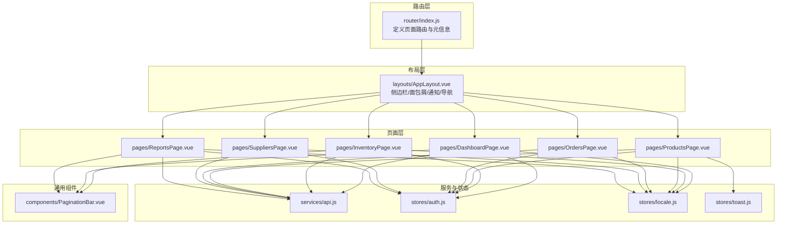
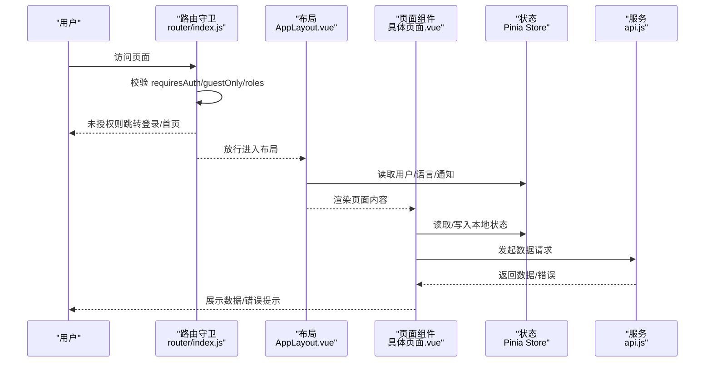
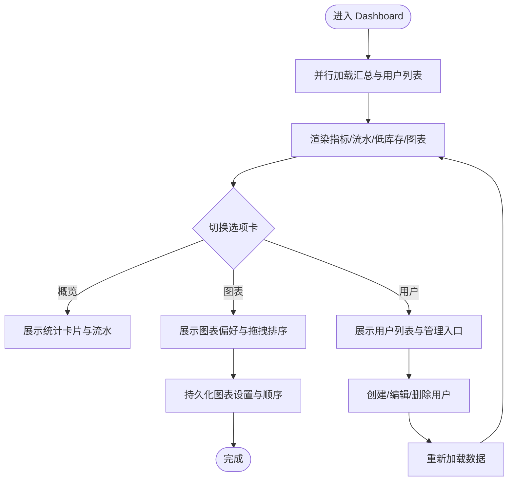
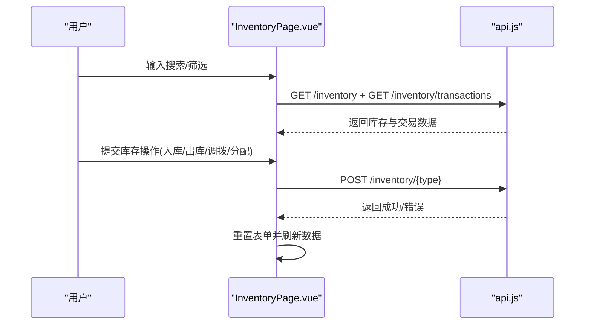
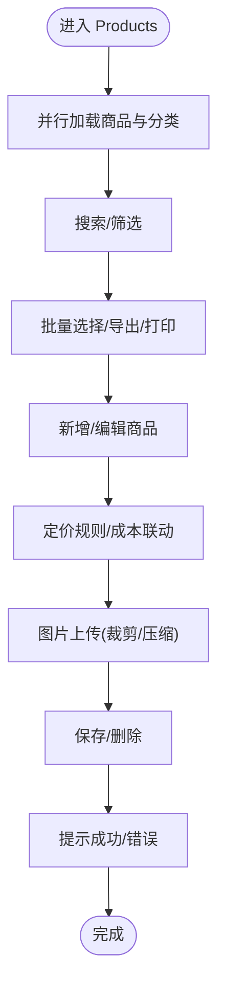
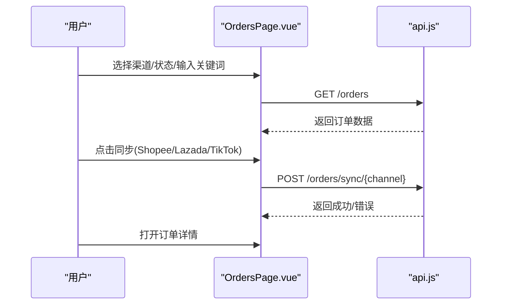
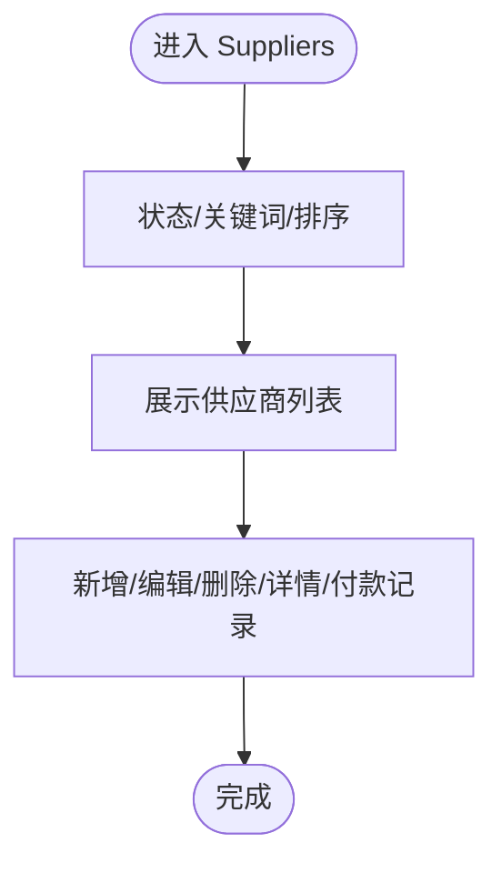
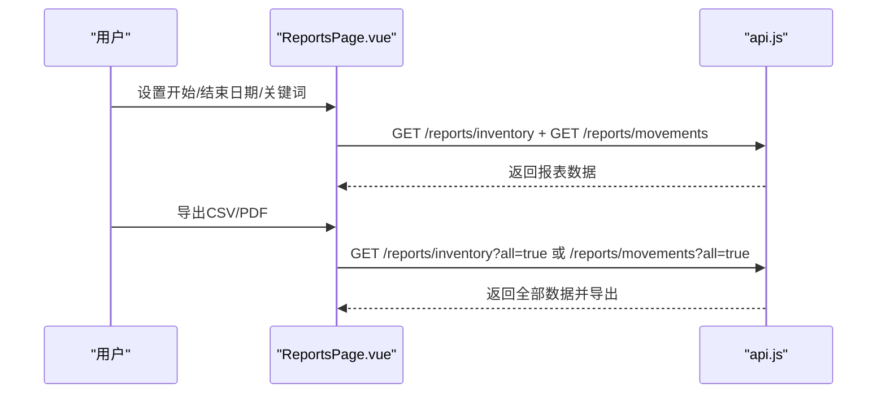
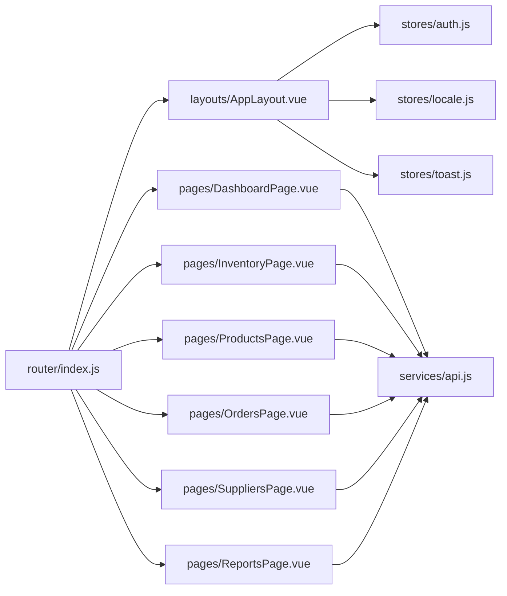

# 页面组织

<cite>
**本文引用的文件**
- [web/src/pages/DashboardPage.vue](file://web/src/pages/DashboardPage.vue)
- [web/src/pages/InventoryPage.vue](file://web/src/pages/InventoryPage.vue)
- [web/src/pages/ProductsPage.vue](file://web/src/pages/ProductsPage.vue)
- [web/src/pages/OrdersPage.vue](file://web/src/pages/OrdersPage.vue)
- [web/src/pages/SuppliersPage.vue](file://web/src/pages/SuppliersPage.vue)
- [web/src/pages/ReportsPage.vue](file://web/src/pages/ReportsPage.vue)
- [web/src/router/index.js](file://web/src/router/index.js)
- [web/src/layouts/AppLayout.vue](file://web/src/layouts/AppLayout.vue)
- [web/src/components/PaginationBar.vue](file://web/src/components/PaginationBar.vue)
- [web/src/services/api.js](file://web/src/services/api.js)
- [web/src/stores/auth.js](file://web/src/stores/auth.js)
- [web/src/stores/locale.js](file://web/src/stores/locale.js)
- [web/src/stores/toast.js](file://web/src/stores/toast.js)
- [web/src/utils/export.js](file://web/src/utils/export.js)
- [web/src/utils/productHelpers.js](file://web/src/utils/productHelpers.js)
</cite>

## 目录
1. [引言](#引言)
2. [项目结构](#项目结构)
3. [核心组件](#核心组件)
4. [架构总览](#架构总览)
5. [详细组件分析](#详细组件分析)
6. [依赖关系分析](#依赖关系分析)
7. [性能考量](#性能考量)
8. [故障排查指南](#故障排查指南)
9. [结论](#结论)
10. [附录](#附录)

## 引言
本文件聚焦于库存管理系统的“页面组织”，系统性梳理各页面级组件的设计模式与实现方式，覆盖 Dashboard 仪表板、Inventory 库存管理、Products 产品管理、Orders 订单处理、Suppliers 供应商管理、Reports 报表分析等页面。文档从职责分工、数据获取模式、用户交互流程三个维度展开，并提供路由配置、权限控制、加载状态管理与错误处理的最佳实践，同时给出创建新页面组件的参考路径。

## 项目结构
前端采用 Vue 3 + Vite 架构，页面位于 web/src/pages，通用布局与导航位于 web/src/layouts，路由配置位于 web/src/router，全局状态通过 Pinia Store 管理，HTTP 请求封装于 web/src/services/api.js。页面普遍遵循“布局容器 + 数据加载 + 交互表单/表格 + 分页器”的组合模式。

图示来源
- [web/src/router/index.js:29-180](file://web/src/router/index.js#L29-L180)
- [web/src/layouts/AppLayout.vue:131-150](file://web/src/layouts/AppLayout.vue#L131-L150)
- [web/src/pages/DashboardPage.vue:1-800](file://web/src/pages/DashboardPage.vue#L1-L800)
- [web/src/pages/InventoryPage.vue:1-567](file://web/src/pages/InventoryPage.vue#L1-L567)
- [web/src/pages/ProductsPage.vue:1-1005](file://web/src/pages/ProductsPage.vue#L1-L1005)
- [web/src/pages/OrdersPage.vue:1-192](file://web/src/pages/OrdersPage.vue#L1-L192)
- [web/src/pages/SuppliersPage.vue:1-272](file://web/src/pages/SuppliersPage.vue#L1-L272)
- [web/src/pages/ReportsPage.vue:1-384](file://web/src/pages/ReportsPage.vue#L1-L384)
- [web/src/components/PaginationBar.vue:1-51](file://web/src/components/PaginationBar.vue#L1-L51)
- [web/src/services/api.js:1-45](file://web/src/services/api.js#L1-L45)
- [web/src/stores/auth.js:1-90](file://web/src/stores/auth.js#L1-L90)
- [web/src/stores/locale.js:1-38](file://web/src/stores/locale.js#L1-L38)
- [web/src/stores/toast.js:1-51](file://web/src/stores/toast.js#L1-L51)

章节来源
- [web/src/router/index.js:29-180](file://web/src/router/index.js#L29-L180)
- [web/src/layouts/AppLayout.vue:131-150](file://web/src/layouts/AppLayout.vue#L131-L150)

## 核心组件
- 布局与导航：AppLayout 提供统一的侧边栏、面包屑、分组导航、通知中心、用户操作区，支持移动端抽屉式菜单与桌面端顶部导航两种模式。
- 页面容器：各页面均包裹 AppLayout，内部通过 API 获取数据、渲染表格/卡片/表单，并使用 PaginationBar 实现分页。
- 通用组件：PaginationBar 封装分页交互；api.js 统一注入认证与语言头；Pinia Store 管理认证、语言、消息提示等跨页面状态。

章节来源
- [web/src/layouts/AppLayout.vue:1-831](file://web/src/layouts/AppLayout.vue#L1-L831)
- [web/src/components/PaginationBar.vue:1-51](file://web/src/components/PaginationBar.vue#L1-L51)
- [web/src/services/api.js:1-45](file://web/src/services/api.js#L1-L45)
- [web/src/stores/auth.js:1-90](file://web/src/stores/auth.js#L1-L90)
- [web/src/stores/locale.js:1-38](file://web/src/stores/locale.js#L1-L38)
- [web/src/stores/toast.js:1-51](file://web/src/stores/toast.js#L1-L51)

## 架构总览
页面级组件遵循“布局容器 + 数据加载 + 用户交互 + 分页/导出”的统一模式。路由层负责鉴权与角色校验，布局层负责导航与用户体验，页面层负责业务数据与交互，服务层负责网络请求与响应拦截，状态层负责用户态与国际化等共享状态。

图示来源
- [web/src/router/index.js:187-206](file://web/src/router/index.js#L187-L206)
- [web/src/layouts/AppLayout.vue:332-366](file://web/src/layouts/AppLayout.vue#L332-L366)
- [web/src/services/api.js:8-42](file://web/src/services/api.js#L8-L42)

## 详细组件分析

### Dashboard 仪表板
- 职责分工
  - 汇总关键指标（商品数、仓库数、低库存数、在库总数）、近期流水、低库存预览。
  - 图表模块：支持折线/柱状/圆环图切换、尺寸调整、拖拽排序、本地持久化。
  - 用户管理（管理员/经理可见）：创建、编辑、删除用户，支持搜索与分页。
- 数据获取模式
  - 并行请求仪表板汇总与用户列表（受角色限制），统一装载到响应式对象。
  - 图表设置与顺序通过 localStorage 持久化，组件挂载时恢复。
- 用户交互流程
  - 选项卡切换（概览/图表/用户），图表偏好设置，拖拽重排，创建/编辑/删除用户。
- 最佳实践
  - 使用 Promise.all 并行加载，减少首屏等待。
  - 本地存储键按用户 ID 区分，避免跨用户冲突。
  - 错误信息统一展示，避免重复请求。

图示来源
- [web/src/pages/DashboardPage.vue:310-344](file://web/src/pages/DashboardPage.vue#L310-L344)
- [web/src/pages/DashboardPage.vue:425-463](file://web/src/pages/DashboardPage.vue#L425-L463)

章节来源
- [web/src/pages/DashboardPage.vue:1-871](file://web/src/pages/DashboardPage.vue#L1-L871)

### Inventory 库存管理
- 职责分工
  - 左侧库存明细（按仓库聚合），右侧工具面板提供筛选与库存操作（入库/出库/调拨/分配）。
  - 右侧流水列表展示最近交易记录。
- 数据获取模式
  - 并行加载库存与交易数据，支持关键词/分类/仓库/低库存/流水类型等筛选。
  - 选择器数据（产品/仓库/分类/供应商）异步加载，减少初始负担。
- 用户交互流程
  - 输入搜索/筛选 -> 触发查询 -> 更新分页 -> 提交库存操作 -> 成功后重置表单并刷新数据。
- 最佳实践
  - 表单重置函数统一管理，避免脏数据残留。
  - 调拨功能仅管理员/经理可见，通过角色判断控制 UI。

图示来源
- [web/src/pages/InventoryPage.vue:113-150](file://web/src/pages/InventoryPage.vue#L113-L150)
- [web/src/pages/InventoryPage.vue:185-193](file://web/src/pages/InventoryPage.vue#L185-L193)

章节来源
- [web/src/pages/InventoryPage.vue:1-567](file://web/src/pages/InventoryPage.vue#L1-L567)

### Products 产品管理
- 职责分工
  - 商品列表（支持搜索、筛选、批量操作、批量打印/导出标签）。
  - 成本保护：通过 passcode 解锁成本字段，解锁后才显示成本相关数据。
  - 商品表单：支持图片上传（自动裁剪压缩）、定价规则（模板/默认/拖拽排序）、条形码/二维码生成与打印。
- 数据获取模式
  - 列表与分类并行加载；编辑时按定价通道参数获取对应价格策略。
  - 图片处理通过本地 Canvas 处理后再提交，提升上传效率。
- 用户交互流程
  - 搜索/筛选 -> 列表展示 -> 批量选择 -> 导出/打印 -> 新增/编辑 -> 保存 -> 成功提示。
- 最佳实践
  - 定价规则与成本联动计算，保持一致性。
  - 批量操作前先校验选择集合，避免空操作。
  - 成本解锁/锁定通过独立 Store 管理，避免跨组件耦合。

图示来源
- [web/src/pages/ProductsPage.vue:208-242](file://web/src/pages/ProductsPage.vue#L208-L242)
- [web/src/pages/ProductsPage.vue:334-381](file://web/src/pages/ProductsPage.vue#L334-L381)
- [web/src/utils/productHelpers.js:168-195](file://web/src/utils/productHelpers.js#L168-L195)

章节来源
- [web/src/pages/ProductsPage.vue:1-1005](file://web/src/pages/ProductsPage.vue#L1-L1005)
- [web/src/utils/productHelpers.js:1-196](file://web/src/utils/productHelpers.js#L1-L196)

### Orders 订单处理
- 职责分工
  - 订单列表（按平台渠道/状态/关键词筛选），支持一键同步外部平台订单。
  - 打开订单详情页进行后续处理。
- 数据获取模式
  - GET /orders 带分页与过滤参数；同步接口 POST /orders/sync/{channel}。
- 用户交互流程
  - 选择渠道/状态/输入关键词 -> 查询列表 -> 同步平台订单 -> 打开详情。

图示来源
- [web/src/pages/OrdersPage.vue:33-78](file://web/src/pages/OrdersPage.vue#L33-L78)

章节来源
- [web/src/pages/OrdersPage.vue:1-192](file://web/src/pages/OrdersPage.vue#L1-L192)

### Suppliers 供应商管理
- 职责分工
  - 供应商列表（支持状态筛选、关键词搜索、排序），提供新增/编辑/删除/详情/付款记录入口。
- 数据获取模式
  - GET /suppliers 带分页与过滤参数；删除接口 404 时提示重启服务。
- 用户交互流程
  - 搜索/筛选/排序 -> 列表展示 -> 新增/编辑/删除/详情/付款记录。

图示来源
- [web/src/pages/SuppliersPage.vue:44-99](file://web/src/pages/SuppliersPage.vue#L44-L99)

章节来源
- [web/src/pages/SuppliersPage.vue:1-272](file://web/src/pages/SuppliersPage.vue#L1-L272)

### Reports 报表分析
- 职责分工
  - 库存估值报表与流水报表，支持日期范围/关键词筛选，导出 CSV/PDF。
- 数据获取模式
  - GET /reports/inventory 与 GET /reports/movements，支持 all 参数导出全部数据。
- 用户交互流程
  - 设置筛选 -> 加载报表 -> 导出 CSV/PDF。

图示来源
- [web/src/pages/ReportsPage.vue:62-97](file://web/src/pages/ReportsPage.vue#L62-L97)
- [web/src/pages/ReportsPage.vue:115-181](file://web/src/pages/ReportsPage.vue#L115-L181)
- [web/src/utils/export.js:1-91](file://web/src/utils/export.js#L1-L91)

章节来源
- [web/src/pages/ReportsPage.vue:1-384](file://web/src/pages/ReportsPage.vue#L1-L384)
- [web/src/utils/export.js:1-91](file://web/src/utils/export.js#L1-L91)

## 依赖关系分析
- 路由与权限
  - 路由守卫根据 meta.requiresAuth/guestOnly/roles 控制访问；登录态与用户信息来自 localStorage。
- 布局与导航
  - AppLayout 动态构建导航分组与面包屑，支持移动端/桌面端双模式。
- 页面与服务
  - 页面通过 api.js 统一发起请求，自动注入 Authorization、成本访问令牌与 UI 语言头。
- 状态管理
  - 认证状态、语言、通知、消息提示等通过 Pinia Store 共享，避免重复请求与跨组件通信复杂度。

图示来源
- [web/src/router/index.js:29-180](file://web/src/router/index.js#L29-L180)
- [web/src/layouts/AppLayout.vue:1-831](file://web/src/layouts/AppLayout.vue#L1-L831)
- [web/src/services/api.js:1-45](file://web/src/services/api.js#L1-L45)
- [web/src/stores/auth.js:1-90](file://web/src/stores/auth.js#L1-L90)
- [web/src/stores/locale.js:1-38](file://web/src/stores/locale.js#L1-L38)
- [web/src/stores/toast.js:1-51](file://web/src/stores/toast.js#L1-L51)

章节来源
- [web/src/router/index.js:187-206](file://web/src/router/index.js#L187-L206)
- [web/src/layouts/AppLayout.vue:182-210](file://web/src/layouts/AppLayout.vue#L182-L210)
- [web/src/services/api.js:8-42](file://web/src/services/api.js#L8-L42)

## 性能考量
- 并行加载：多处使用 Promise.all 并行请求，缩短首屏等待时间（如 Dashboard、Inventory、Products）。
- 本地持久化：图表设置、顺序、侧边栏折叠状态、导航分组状态等通过 localStorage 缓存，减少重复请求与计算。
- 分页与导出：列表分页避免一次性加载大量数据；导出支持 all 参数按需拉取全部数据。
- 图片处理：Products 页面对上传图片进行本地 Canvas 压缩，降低带宽与服务器压力。
- 请求拦截：统一注入认证与语言头，减少重复配置与请求头拼接开销。

## 故障排查指南
- 登录态与权限
  - 若出现未授权跳转登录，检查路由守卫是否正确设置 meta.requiresAuth/guestOnly/roles。
  - 若角色受限无法访问，确认用户角色与路由 meta.roles 是否匹配。
- 请求失败
  - api.js 对响应进行统一封装，若后端返回 success=false 且携带 message，拦截器会将其透传到错误对象。
  - 建议在页面捕获错误并展示友好提示，避免直接抛出原始错误。
- 供应商删除异常
  - 若返回 404，提示“删除接口不存在，请重启后端服务”，属于后端路由缺失问题。
- 成功提示
  - 使用 toast Store 推送成功/错误消息，注意 duration 与 action 回调配置。

章节来源
- [web/src/router/index.js:187-206](file://web/src/router/index.js#L187-L206)
- [web/src/services/api.js:26-42](file://web/src/services/api.js#L26-L42)
- [web/src/pages/SuppliersPage.vue:68-79](file://web/src/pages/SuppliersPage.vue#L68-L79)
- [web/src/stores/toast.js:11-31](file://web/src/stores/toast.js#L11-L31)

## 结论
页面组织遵循统一的“布局 + 数据 + 交互 + 分页/导出”模式，结合路由守卫与 Pinia Store 实现清晰的权限控制与状态管理。通过并行加载、本地持久化与请求拦截等手段优化性能与体验。建议在新增页面时复用现有模式与组件，确保一致的交互与可维护性。

## 附录

### 页面开发最佳实践清单
- 路由配置
  - 在 router/index.js 中注册新路由，合理设置 meta.requiresAuth/guestOnly/roles。
  - 为页面命名规范（如 products、product-form、product-detail），便于导航与跳转。
- 权限控制
  - 在页面组件中读取 auth Store 用户信息，动态控制 UI（如调拨按钮仅管理员/经理可见）。
  - 布局层 AppLayout 根据用户角色过滤导航项，保证界面一致性。
- 加载状态管理
  - 使用 loading/错误信息统一展示加载与错误，避免空白屏。
  - 对长耗时操作（如导出）提供进度反馈。
- 错误处理
  - 统一捕获并展示错误信息；必要时区分业务错误与网络错误。
  - 对 404/403 等特殊状态提供明确提示。
- 数据获取
  - 优先使用 Promise.all 并行请求，减少等待时间。
  - 对列表数据使用分页，避免一次性加载过多。
- 用户交互
  - 表单提交后统一重置与刷新，避免脏数据。
  - 批量操作前校验选择集合，提供确认对话框。
- 导出与打印
  - 使用 export.js 的 CSV/PDF 导出能力；对大体量数据使用 all 参数分批导出。
  - 打印场景使用 printHtmlDocument 输出简洁易读的打印页。

### 创建新页面组件参考路径
- 新建页面文件：在 web/src/pages 下创建新文件，如 NewPage.vue。
- 注册路由：在 web/src/router/index.js 中添加路由条目，设置 meta 与命名。
- 引入布局：在页面内引入 AppLayout 作为根容器。
- 数据加载：使用 api.js 发起请求，结合 loading/错误信息与分页组件 PaginationBar。
- 权限控制：在页面中读取 auth Store 用户信息，按角色控制 UI。
- 状态管理：需要跨页面共享的状态放入 Pinia Store，避免重复请求。
- 导出/打印：如需导出，引入 web/src/utils/export.js；如需二维码/标签，引入 web/src/utils/productHelpers.js。

章节来源
- [web/src/router/index.js:29-180](file://web/src/router/index.js#L29-L180)
- [web/src/layouts/AppLayout.vue:1-831](file://web/src/layouts/AppLayout.vue#L1-L831)
- [web/src/services/api.js:1-45](file://web/src/services/api.js#L1-L45)
- [web/src/stores/auth.js:1-90](file://web/src/stores/auth.js#L1-L90)
- [web/src/stores/locale.js:1-38](file://web/src/stores/locale.js#L1-L38)
- [web/src/stores/toast.js:1-51](file://web/src/stores/toast.js#L1-L51)
- [web/src/utils/export.js:1-91](file://web/src/utils/export.js#L1-L91)
- [web/src/utils/productHelpers.js:1-196](file://web/src/utils/productHelpers.js#L1-L196)