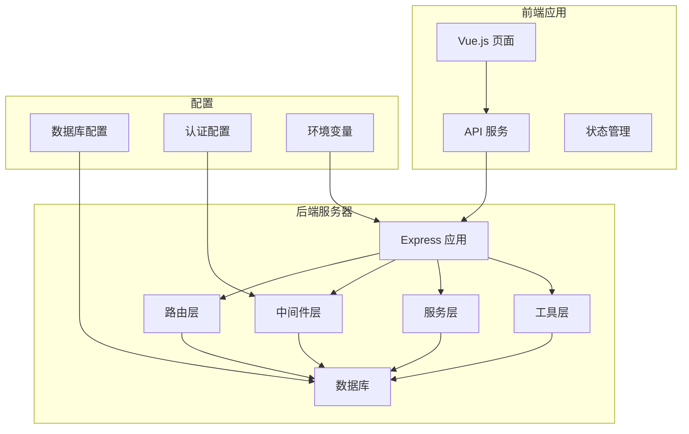
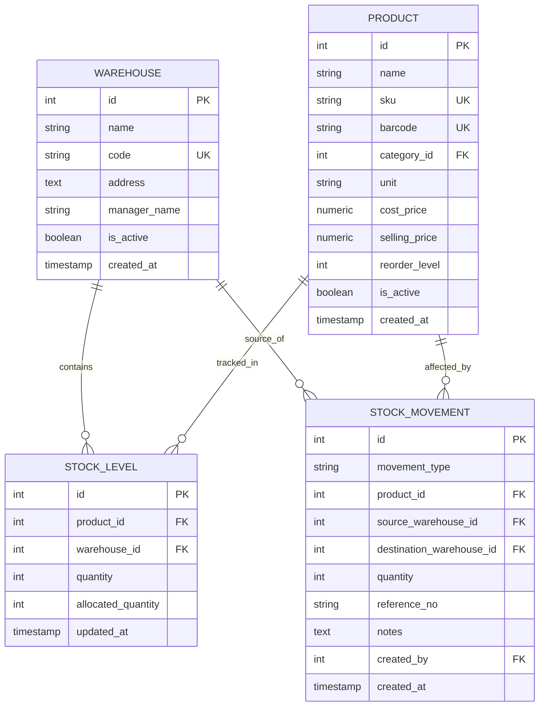
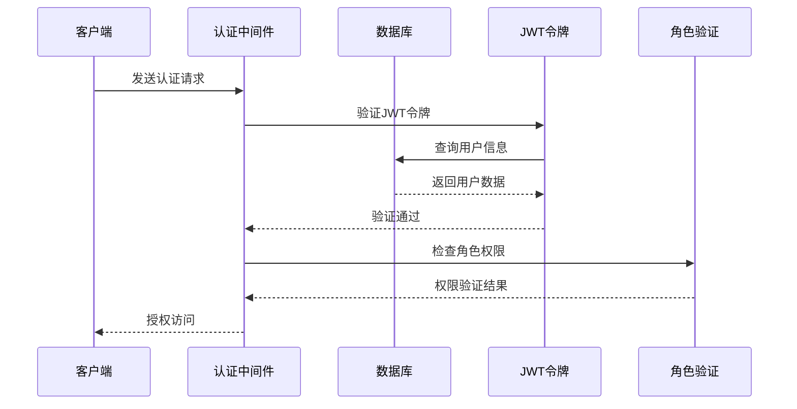
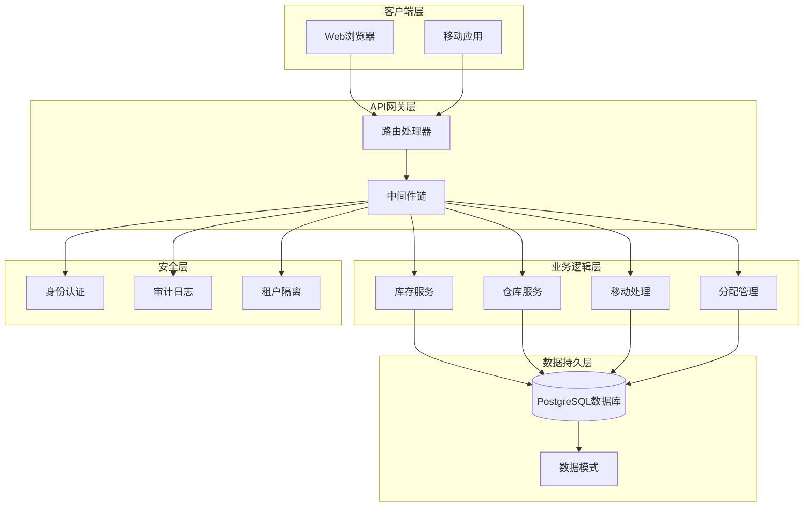
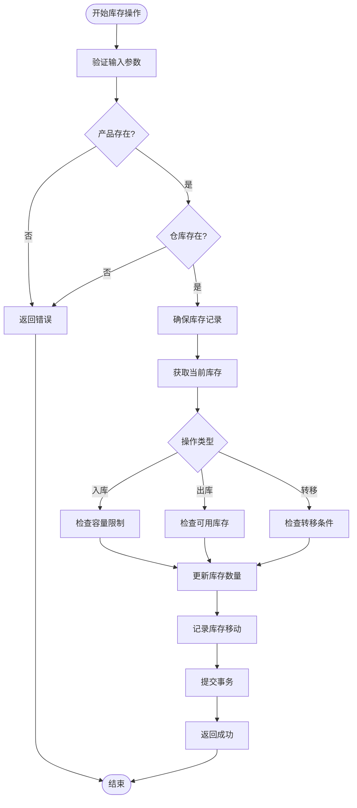
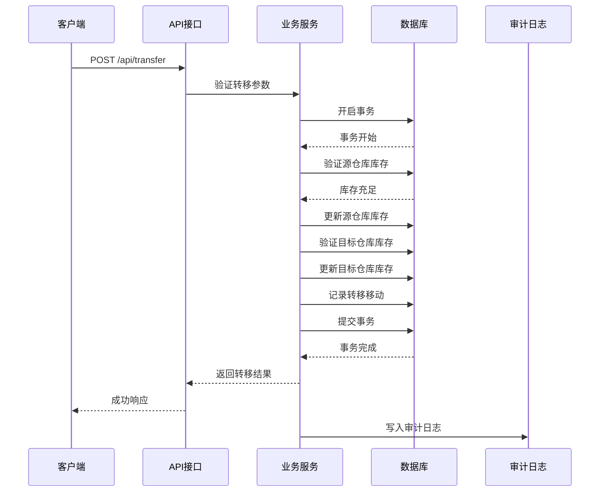
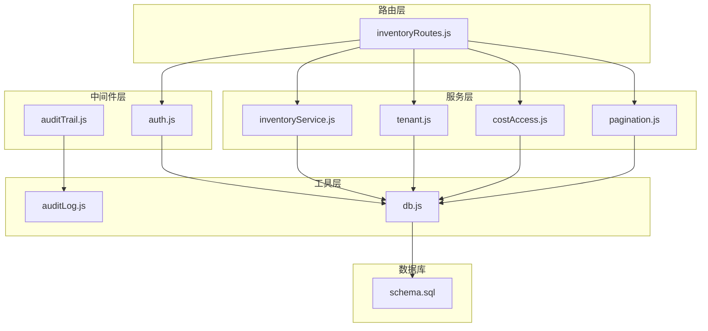
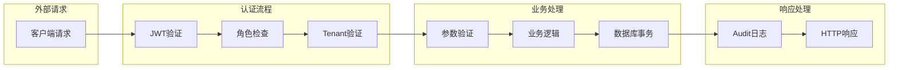

# 仓库管理API

<cite>
**本文档引用的文件**
- [inventoryRoutes.js](file://server/src/routes/inventoryRoutes.js)
- [inventoryService.js](file://server/src/utils/inventoryService.js)
- [schema.sql](file://server/database/schema.sql)
- [auth.js](file://server/src/middleware/auth.js)
- [auditTrail.js](file://server/src/middleware/auditTrail.js)
- [tenant.js](file://server/src/utils/tenant.js)
- [pagination.js](file://server/src/utils/pagination.js)
- [auditLog.js](file://server/src/utils/auditLog.js)
- [seed.sql](file://server/database/seed.sql)
- [WarehousesPage.vue](file://web/src/pages/WarehousesPage.vue)
- [api.js](file://web/src/services/api.js)
</cite>

## 目录
1. [简介](#简介)
2. [项目结构](#项目结构)
3. [核心组件](#核心组件)
4. [架构概览](#架构概览)
5. [详细组件分析](#详细组件分析)
6. [依赖关系分析](#依赖关系分析)
7. [性能考虑](#性能考虑)
8. [故障排除指南](#故障排除指南)
9. [结论](#结论)
10. [附录](#附录)

## 简介

本仓库管理API是库存管理系统的核心模块，负责管理仓库的CRUD操作、库存分配和转移业务逻辑。该系统采用多租户架构设计，确保不同公司之间的数据完全隔离，同时提供了完善的权限控制、审计日志和数据完整性约束。

系统支持以下主要功能：
- 仓库创建、读取、更新、删除（CRUD）操作
- 多仓库库存管理与容量控制
- 库存分配与释放机制
- 库存入库、出库和仓库间转移
- 完整的操作审计和权限控制

## 项目结构



**图表来源**
- [inventoryRoutes.js:1-536](file://server/src/routes/inventoryRoutes.js#L1-L536)
- [auth.js:1-87](file://server/src/middleware/auth.js#L1-L87)

**章节来源**
- [inventoryRoutes.js:1-536](file://server/src/routes/inventoryRoutes.js#L1-L536)
- [schema.sql:1-447](file://server/database/schema.sql#L1-L447)

## 核心组件

### 数据模型架构

系统基于以下核心数据模型构建：



**图表来源**
- [schema.sql:22-248](file://server/database/schema.sql#L22-L248)

### 认证与授权架构



**图表来源**
- [auth.js:5-61](file://server/src/middleware/auth.js#L5-L61)
- [auth.js:64-72](file://server/src/middleware/auth.js#L64-L72)

**章节来源**
- [schema.sql:22-248](file://server/database/schema.sql#L22-L248)
- [auth.js:1-87](file://server/src/middleware/auth.js#L1-L87)

## 架构概览

### 系统架构图



**图表来源**
- [inventoryRoutes.js:1-536](file://server/src/routes/inventoryRoutes.js#L1-L536)
- [auditTrail.js:47-81](file://server/src/middleware/auditTrail.js#L47-L81)

## 详细组件分析

### 仓库管理API

#### 仓库CRUD操作

仓库管理API提供了完整的CRUD操作接口：

**仓库创建接口**
- **URL**: `POST /api/warehouses`
- **权限**: ADMIN, MANAGER
- **请求体**: 仓库名称、代码、地址、负责人等信息
- **响应**: 创建成功的仓库信息

**仓库读取接口**
- **URL**: `GET /api/warehouses`
- **权限**: ADMIN, MANAGER, STAFF
- **查询参数**: 搜索关键词、分页参数
- **响应**: 仓库列表和分页信息

**仓库更新接口**
- **URL**: `PUT /api/warehouses/:id`
- **权限**: ADMIN, MANAGER
- **路径参数**: 仓库ID
- **请求体**: 更新的仓库信息

**仓库删除接口**
- **URL**: `DELETE /api/warehouses/:id`
- **权限**: ADMIN
- **路径参数**: 仓库ID
- **注意**: 删除前需要检查是否有库存关联

#### 库存管理核心逻辑



**图表来源**
- [inventoryRoutes.js:237-437](file://server/src/routes/inventoryRoutes.js#L237-L437)
- [inventoryService.js:30-39](file://server/src/utils/inventoryService.js#L30-L39)

#### 多仓库库存分配

系统支持灵活的多仓库库存分配机制：

**分配流程**
1. 验证产品和仓库归属同一租户
2. 确保库存记录存在
3. 检查可用库存是否足够
4. 更新分配数量
5. 记录分配移动

**释放流程**
1. 验证分配数量不超过已分配数量
2. 减少分配数量
3. 更新库存状态
4. 记录释放移动

#### 仓库间库存转移



**图表来源**
- [inventoryRoutes.js:358-427](file://server/src/routes/inventoryRoutes.js#L358-L427)

### 权限控制与安全

#### 角色权限矩阵

| 角色 | 仓库管理 | 库存操作 | 系统管理 |
|------|----------|----------|----------|
| ADMIN | 全部权限 | 全部权限 | 全部权限 |
| MANAGER | 读取/更新 | 入库/出库 | 有限权限 |
| STAFF | 读取 | 入库/出库 | 无权限 |

#### 租户隔离机制

系统通过以下方式实现租户数据隔离：
1. **JWT令牌验证**: 确保用户属于正确的租户
2. **SQL查询过滤**: 所有查询都包含租户ID条件
3. **中间件拦截**: 在路由处理前验证租户上下文

**章节来源**
- [inventoryRoutes.js:11-11](file://server/src/routes/inventoryRoutes.js#L11-L11)
- [auth.js:35-38](file://server/src/middleware/auth.js#L35-L38)
- [tenant.js:9-14](file://server/src/utils/tenant.js#L9-L14)

## 依赖关系分析

### 组件依赖图



**图表来源**
- [inventoryRoutes.js:1-8](file://server/src/routes/inventoryRoutes.js#L1-L8)
- [inventoryService.js:1-46](file://server/src/utils/inventoryService.js#L1-L46)

### 数据流分析



**图表来源**
- [auth.js:5-61](file://server/src/middleware/auth.js#L5-L61)
- [auditTrail.js:47-81](file://server/src/middleware/auditTrail.js#L47-L81)

**章节来源**
- [inventoryRoutes.js:1-536](file://server/src/routes/inventoryRoutes.js#L1-L536)
- [auditTrail.js:1-86](file://server/src/middleware/auditTrail.js#L1-L86)

## 性能考虑

### 查询优化策略

1. **索引优化**: 为常用查询字段建立索引
   - `stock_levels(product_id, warehouse_id)`
   - `stock_movements(created_at)`
   - `products(category_id)`

2. **分页处理**: 支持大数据量的分页查询
   - 默认每页10条记录
   - 最大支持100条记录/页

3. **批量查询**: 使用Promise.all并行执行查询

### 缓存策略

- **库存缓存**: 高频访问的库存数据可考虑缓存
- **配置缓存**: 系统配置信息可缓存减少数据库查询

### 并发控制

- **事务隔离**: 使用数据库事务确保数据一致性
- **锁机制**: 对关键资源使用适当的锁策略
- **重试机制**: 对并发冲突提供合理的重试策略

## 故障排除指南

### 常见错误及解决方案

**认证失败**
- 检查JWT令牌格式和有效期
- 验证用户账户状态
- 确认租户上下文匹配

**权限不足**
- 确认用户角色是否具备相应权限
- 检查API端点的权限要求
- 验证租户数据隔离设置

**库存操作失败**
- 检查产品和仓库是否存在且属于同一租户
- 验证库存数量是否足够
- 查看事务回滚日志

**数据完整性错误**
- 检查数据库约束条件
- 验证外键关系
- 确认唯一性约束

### 调试工具

1. **审计日志**: 查看所有API调用记录
2. **错误追踪**: 使用统一的错误处理机制
3. **性能监控**: 监控API响应时间和数据库查询

**章节来源**
- [auditTrail.js:47-81](file://server/src/middleware/auditTrail.js#L47-L81)
- [auditLog.js:1-40](file://server/src/utils/auditLog.js#L1-L40)

## 结论

本仓库管理API提供了完整的企业级仓库管理解决方案，具有以下特点：

**技术优势**
- 多租户架构确保数据安全隔离
- 完善的权限控制和审计日志
- 高性能的数据库设计和查询优化
- 可扩展的微服务架构

**业务价值**
- 支持复杂的多仓库库存管理
- 提供灵活的库存分配和转移机制
- 完整的业务流程覆盖
- 用户友好的API设计

**最佳实践建议**
- 始终使用事务处理关键业务操作
- 实施适当的缓存策略提升性能
- 定期备份数据库确保数据安全
- 监控系统性能和错误率

## 附录

### API使用示例

#### 仓库管理示例

**创建仓库**
```javascript
// 前端调用示例
const warehouseData = {
  name: "新仓库",
  code: "WH-NEW",
  address: "新地址",
  managerName: "负责人",
  isActive: true
};

await api.post('/warehouses', warehouseData);
```

**获取仓库列表**
```javascript
// 分页获取仓库列表
const response = await api.get('/warehouses', {
  params: {
    page: 1,
    pageSize: 10,
    search: '仓库名称'
  }
});
```

**更新仓库信息**
```javascript
// 更新特定仓库
await api.put('/warehouses/1', {
  name: "更新后的名称",
  isActive: false
});
```

**删除仓库**
```javascript
// 删除仓库（需确认无库存关联）
await api.delete('/warehouses/1');
```

#### 库存操作示例

**库存入库**
```javascript
const stockInData = {
  productId: 1,
  warehouseId: 1,
  quantity: 100,
  referenceNo: "PO-001",
  notes: "采购入库"
};

await api.post('/api/stock-in', stockInData);
```

**库存出库**
```javascript
const stockOutData = {
  productId: 1,
  warehouseId: 1,
  quantity: 50,
  referenceNo: "SO-001",
  notes: "销售出库"
};

await api.post('/api/stock-out', stockOutData);
```

**仓库间转移**
```javascript
const transferData = {
  productId: 1,
  sourceWarehouseId: 1,
  destinationWarehouseId: 2,
  quantity: 25,
  referenceNo: "TR-001",
  notes: "库存转移"
};

await api.post('/api/transfer', transferData);
```

**库存分配**
```javascript
const allocationData = {
  productId: 1,
  warehouseId: 1,
  quantity: 10,
  mode: "reserve", // 或 "release"
  referenceNo: "AL-001",
  notes: "订单预留"
};

await api.post('/api/allocate', allocationData);
```

### 数据模型参考

**仓库表结构**
- 主键: `id`
- 唯一约束: `code`
- 状态字段: `is_active`
- 时间戳: `created_at`

**库存表结构**
- 复合唯一键: `(product_id, warehouse_id)`
- 数量字段: `quantity`, `allocated_quantity`
- 检查约束: 非负数

**库存移动表结构**
- 枚举字段: `movement_type` (IN, OUT, TRANSFER)
- 外键关系: 关联产品、仓库、用户

**章节来源**
- [schema.sql:22-248](file://server/database/schema.sql#L22-L248)
- [seed.sql:37-42](file://server/database/seed.sql#L37-L42)