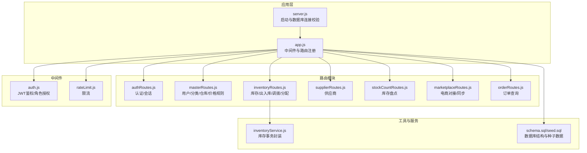
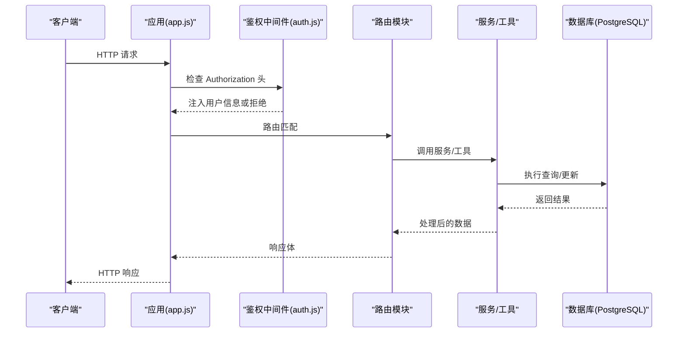
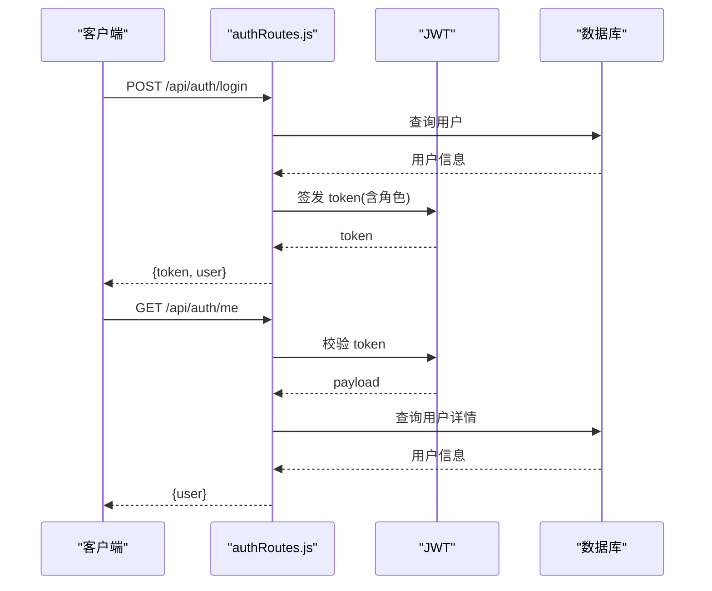
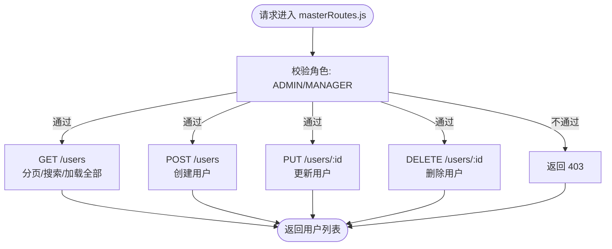
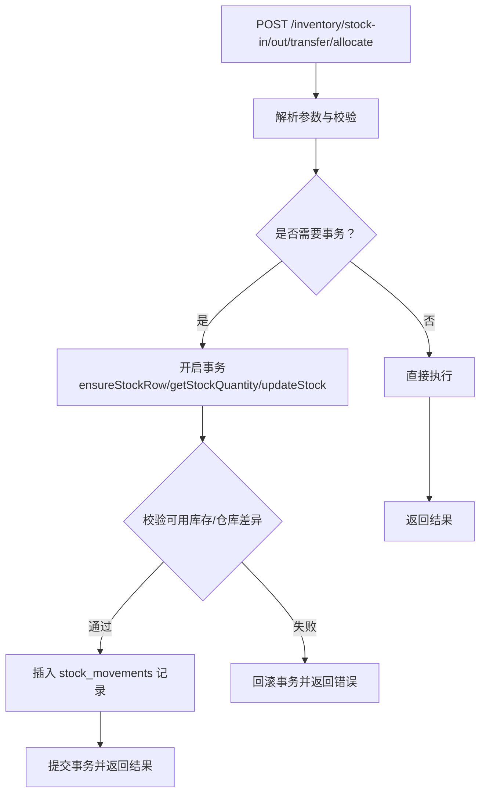
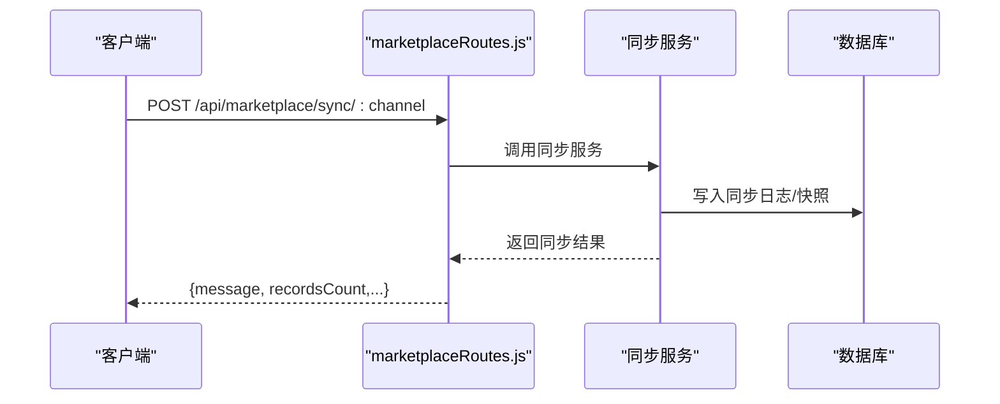
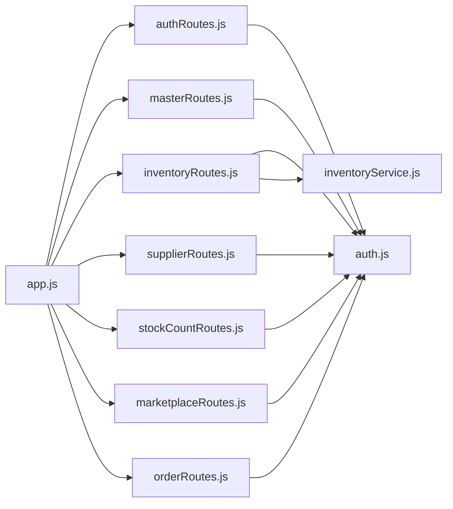
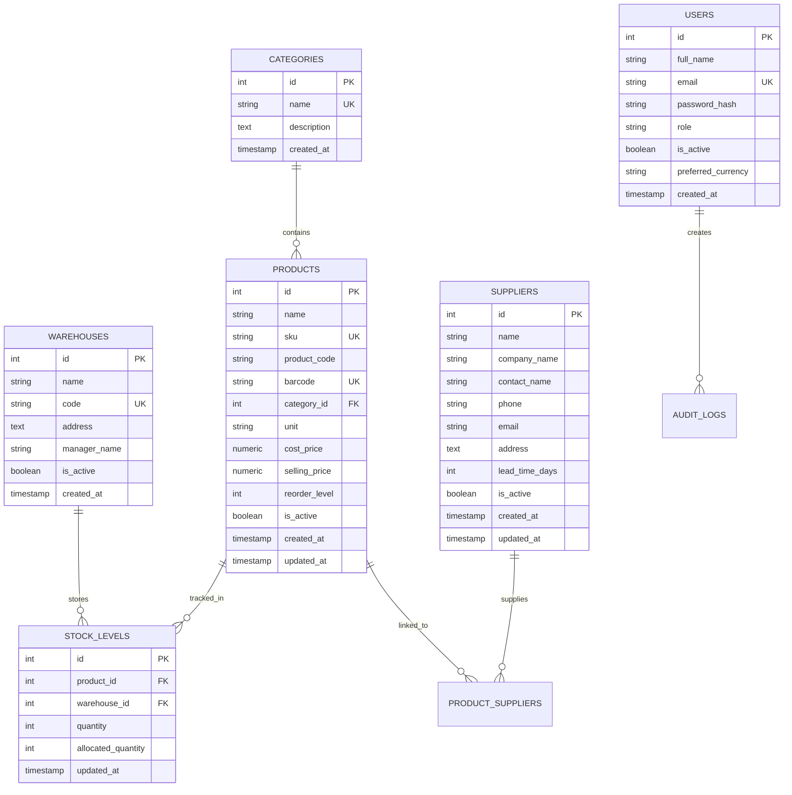

# 后端API文档

<cite>
**本文档引用的文件**
- [server/src/app.js](file://server/src/app.js)
- [server/src/server.js](file://server/src/server.js)
- [server/src/routes/authRoutes.js](file://server/src/routes/authRoutes.js)
- [server/src/routes/masterRoutes.js](file://server/src/routes/masterRoutes.js)
- [server/src/routes/inventoryRoutes.js](file://server/src/routes/inventoryRoutes.js)
- [server/src/routes/supplierRoutes.js](file://server/src/routes/supplierRoutes.js)
- [server/src/routes/stockCountRoutes.js](file://server/src/routes/stockCountRoutes.js)
- [server/src/routes/marketplaceRoutes.js](file://server/src/routes/marketplaceRoutes.js)
- [server/src/routes/orderRoutes.js](file://server/src/routes/orderRoutes.js)
- [server/src/middleware/auth.js](file://server/src/middleware/auth.js)
- [server/src/middleware/rateLimit.js](file://server/src/middleware/rateLimit.js)
- [server/src/utils/inventoryService.js](file://server/src/utils/inventoryService.js)
- [server/database/schema.sql](file://server/database/schema.sql)
- [server/database/seed.sql](file://server/database/seed.sql)
- [server/package.json](file://server/package.json)
</cite>

## 目录
1. [简介](#简介)
2. [项目结构](#项目结构)
3. [核心组件](#核心组件)
4. [架构总览](#架构总览)
5. [详细组件分析](#详细组件分析)
6. [依赖关系分析](#依赖关系分析)
7. [性能考量](#性能考量)
8. [故障排查指南](#故障排查指南)
9. [结论](#结论)
10. [附录](#附录)

## 简介
本项目为库存管理系统后端，基于 Express + PostgreSQL 提供 RESTful API，覆盖认证与授权、用户与角色管理、商品与分类、仓库与库存、供应商、电商渠道对接（Shopee/Lazada/TikTok）、订单与物流同步、库存盘点与调拨、审计与通知等功能。本文档面向开发者与集成方，提供完整接口规范、认证与授权机制、错误处理策略、安全与限流、以及常见用例与性能优化建议。

## 项目结构
后端采用模块化路由组织，核心入口在应用层注册中间件与路由；数据库结构通过迁移脚本定义，初始数据用于演示。

**图表来源**
- [server/src/app.js:1-65](file://server/src/app.js#L1-L65)
- [server/src/server.js:1-28](file://server/src/server.js#L1-L28)
- [server/src/routes/authRoutes.js:1-72](file://server/src/routes/authRoutes.js#L1-L72)
- [server/src/routes/masterRoutes.js:1-800](file://server/src/routes/masterRoutes.js#L1-L800)
- [server/src/routes/inventoryRoutes.js:1-493](file://server/src/routes/inventoryRoutes.js#L1-L493)
- [server/src/routes/supplierRoutes.js:1-328](file://server/src/routes/supplierRoutes.js#L1-L328)
- [server/src/routes/stockCountRoutes.js:1-434](file://server/src/routes/stockCountRoutes.js#L1-L434)
- [server/src/routes/marketplaceRoutes.js:1-641](file://server/src/routes/marketplaceRoutes.js#L1-L641)
- [server/src/routes/orderRoutes.js:1-113](file://server/src/routes/orderRoutes.js#L1-L113)
- [server/src/middleware/auth.js:1-46](file://server/src/middleware/auth.js#L1-L46)
- [server/src/middleware/rateLimit.js:1-40](file://server/src/middleware/rateLimit.js#L1-L40)
- [server/src/utils/inventoryService.js:1-45](file://server/src/utils/inventoryService.js#L1-L45)
- [server/database/schema.sql:1-420](file://server/database/schema.sql#L1-L420)
- [server/database/seed.sql:1-114](file://server/database/seed.sql#L1-L114)

**章节来源**
- [server/src/app.js:1-65](file://server/src/app.js#L1-L65)
- [server/src/server.js:1-28](file://server/src/server.js#L1-L28)
- [server/database/schema.sql:1-420](file://server/database/schema.sql#L1-L420)
- [server/database/seed.sql:1-114](file://server/database/seed.sql#L1-L114)

## 核心组件
- 应用入口与中间件
  - 安全头、跨域、日志、统一响应包装、审计日志中间件
  - 健康检查端点
- 路由模块
  - 认证与会话、用户与角色管理、商品与分类、仓库管理、库存与事务、供应商、库存盘点、电商对接与订单、物流、设置、银行对账单、通知、仪表盘、报表、告警、审计日志等
- 中间件
  - JWT 鉴权与角色授权
  - 请求限流
- 工具与服务
  - 库存事务封装（确保行存在、读取数量、更新数量）
- 数据库
  - 用户、分类、仓库、产品、库存、电商连接、订单、物流、库存盘点、审计日志、通知、设置、银行对账单等表结构与索引

**章节来源**
- [server/src/app.js:25-65](file://server/src/app.js#L25-L65)
- [server/src/middleware/auth.js:1-46](file://server/src/middleware/auth.js#L1-L46)
- [server/src/middleware/rateLimit.js:1-40](file://server/src/middleware/rateLimit.js#L1-L40)
- [server/src/utils/inventoryService.js:1-45](file://server/src/utils/inventoryService.js#L1-L45)
- [server/database/schema.sql:1-420](file://server/database/schema.sql#L1-L420)

## 架构总览
系统采用“中间件 + 路由 + 服务/工具 + 数据库”的分层设计。JWT 作为无状态认证载体，结合角色授权控制资源访问；库存相关操作使用数据库事务保证一致性；电商对接通过独立服务模块与限流保护。

**图表来源**
- [server/src/app.js:25-65](file://server/src/app.js#L25-L65)
- [server/src/middleware/auth.js:1-46](file://server/src/middleware/auth.js#L1-L46)
- [server/src/routes/inventoryRoutes.js:229-403](file://server/src/routes/inventoryRoutes.js#L229-L403)
- [server/src/utils/inventoryService.js:1-45](file://server/src/utils/inventoryService.js#L1-L45)
- [server/database/schema.sql:1-420](file://server/database/schema.sql#L1-L420)

## 详细组件分析

### 认证与授权 API
- 接口概览
  - 登录：POST /api/auth/login
  - 当前用户：GET /api/auth/me
- 认证机制
  - 使用 JWT，密钥来自环境变量
  - 成功登录后返回 token 与用户信息
  - 后续请求需在 Authorization 头中携带 Bearer Token
- 授权机制
  - 角色中间件按 ADMIN/MANAGER/STAFF 控制访问
- 限流
  - 登录接口限流，防止暴力破解
- 错误处理
  - 缺少 token、无效/过期 token、用户不存在或未激活均返回 401
  - 权限不足返回 403

**图表来源**
- [server/src/routes/authRoutes.js:17-69](file://server/src/routes/authRoutes.js#L17-L69)
- [server/src/middleware/auth.js:5-29](file://server/src/middleware/auth.js#L5-L29)

**章节来源**
- [server/src/routes/authRoutes.js:1-72](file://server/src/routes/authRoutes.js#L1-L72)
- [server/src/middleware/auth.js:1-46](file://server/src/middleware/auth.js#L1-L46)
- [server/src/middleware/rateLimit.js:1-40](file://server/src/middleware/rateLimit.js#L1-L40)

### 用户管理 API
- 路由前缀：/api
- 支持分页与搜索，支持加载全部（all=true）以满足下拉选择场景
- 权限：仅 ADMIN 可创建/更新/删除用户
- 关键端点
  - GET /users：分页列出用户
  - POST /users：创建用户（ADMIN）
  - PUT /users/:id：更新用户（ADMIN）
  - DELETE /users/:id：删除用户（ADMIN）

**图表来源**
- [server/src/routes/masterRoutes.js:492-661](file://server/src/routes/masterRoutes.js#L492-L661)
- [server/src/middleware/auth.js:32-40](file://server/src/middleware/auth.js#L32-L40)

**章节来源**
- [server/src/routes/masterRoutes.js:492-661](file://server/src/routes/masterRoutes.js#L492-L661)

### 商品与分类 API
- 路由前缀：/api
- 分类管理
  - GET /categories：分页/搜索/加载全部
  - POST /categories：创建（ADMIN/MANAGER）
  - PUT /categories/:id：更新（ADMIN/MANAGER）
  - DELETE /categories/:id：删除（ADMIN/MANAGER）
- 仓库管理
  - GET /warehouses：支持搜索、启用状态筛选、分页、加载全部
  - 其余 CRUD 在 masterRoutes 中实现（如需要请参考对应段落）

**章节来源**
- [server/src/routes/masterRoutes.js:663-773](file://server/src/routes/masterRoutes.js#L663-L773)

### 供应商管理 API
- 路由前缀：/api/suppliers
- 支持分页、搜索、状态筛选、排序
- 权限：ADMIN/MANAGER
- 关键端点
  - GET /：分页查询
  - POST /：创建
  - GET /:id：详情（含关联产品与最近采购）
  - PUT /:id：更新
  - PATCH /:id/status：更新状态
  - DELETE /:id：删除

**章节来源**
- [server/src/routes/supplierRoutes.js:1-328](file://server/src/routes/supplierRoutes.js#L1-L328)

### 库存管理 API
- 路由前缀：/api/inventory
- 总览与事务
  - GET /：库存总览（支持搜索、分类、仓库、低库存筛选、分页、加载全部）
  - GET /transactions：出入库流水（支持搜索、类型筛选、分页）
- 业务操作（需事务）
  - POST /stock-in：入库（ADMIN/MANAGER/STAFF）
  - POST /stock-out：出库（ADMIN/MANAGER/STAFF）
  - POST /transfer：调拨（ADMIN/MANAGER）
  - POST /allocate：预留/释放占用（ADMIN/MANAGER/STAFF）
- 库存事务封装
  - 确保存在库存行、读取当前数量、更新数量，使用数据库事务保证一致性

**图表来源**
- [server/src/routes/inventoryRoutes.js:229-490](file://server/src/routes/inventoryRoutes.js#L229-L490)
- [server/src/utils/inventoryService.js:1-45](file://server/src/utils/inventoryService.js#L1-L45)

**章节来源**
- [server/src/routes/inventoryRoutes.js:16-151](file://server/src/routes/inventoryRoutes.js#L16-L151)
- [server/src/routes/inventoryRoutes.js:153-227](file://server/src/routes/inventoryRoutes.js#L153-L227)
- [server/src/routes/inventoryRoutes.js:405-415](file://server/src/routes/inventoryRoutes.js#L405-L415)
- [server/src/routes/inventoryRoutes.js:409-411](file://server/src/routes/inventoryRoutes.js#L409-L411)
- [server/src/routes/inventoryRoutes.js:413-415](file://server/src/routes/inventoryRoutes.js#L413-L415)
- [server/src/routes/inventoryRoutes.js:417-490](file://server/src/routes/inventoryRoutes.js#L417-L490)
- [server/src/utils/inventoryService.js:1-45](file://server/src/utils/inventoryService.js#L1-L45)

### 库存盘点 API
- 路由前缀：/api/stock-counts
- 生命周期：创建 → 编辑 → 完成 → 应用
- 关键端点
  - GET /：分页查询
  - POST /：创建（自动填充仓库内所有有效商品）
  - GET /:id：查看盘点单与明细
  - PUT /:id/items：保存明细（仅 OPEN）
  - POST /:id/complete：完成（仅 OPEN）
  - POST /:id/apply：应用（仅 COMPLETED，ADMIN/MANAGER）
- 应用时根据差异生成出入库流水并更新库存

**章节来源**
- [server/src/routes/stockCountRoutes.js:14-85](file://server/src/routes/stockCountRoutes.js#L14-L85)
- [server/src/routes/stockCountRoutes.js:87-164](file://server/src/routes/stockCountRoutes.js#L87-L164)
- [server/src/routes/stockCountRoutes.js:166-219](file://server/src/routes/stockCountRoutes.js#L166-L219)
- [server/src/routes/stockCountRoutes.js:221-271](file://server/src/routes/stockCountRoutes.js#L221-L271)
- [server/src/routes/stockCountRoutes.js:273-324](file://server/src/routes/stockCountRoutes.js#L273-L324)
- [server/src/routes/stockCountRoutes.js:326-431](file://server/src/routes/stockCountRoutes.js#L326-L431)

### 电商集成 API
- 路由前缀：/api/marketplace
- 连接与配置
  - GET /connections：查询已配置渠道
  - PUT /connections/:channel：更新渠道配置（ADMIN/MANAGER）
  - POST /connections/:channel/test：测试连接（ADMIN/MANAGER）
- 同步
  - POST /sync/:channel：同步库存（ADMIN/MANAGER，带限流）
  - POST /orders/sync/:channel：同步订单（ADMIN/MANAGER，带限流）
- OAuth
  - POST /oauth/:channel/start：开始授权（ADMIN/MANAGER）
  - GET /oauth/:channel/callback：回调处理（ADMIN/MANAGER）
- 监控
  - GET /sync-logs：同步日志
  - GET /snapshots：库存快照
  - GET /status/overview：渠道概览
  - GET /errors：错误日志

**图表来源**
- [server/src/routes/marketplaceRoutes.js:144-202](file://server/src/routes/marketplaceRoutes.js#L144-L202)
- [server/src/routes/marketplaceRoutes.js:595-638](file://server/src/routes/marketplaceRoutes.js#L595-L638)

**章节来源**
- [server/src/routes/marketplaceRoutes.js:47-142](file://server/src/routes/marketplaceRoutes.js#L47-L142)
- [server/src/routes/marketplaceRoutes.js:144-202](file://server/src/routes/marketplaceRoutes.js#L144-L202)
- [server/src/routes/marketplaceRoutes.js:204-375](file://server/src/routes/marketplaceRoutes.js#L204-L375)
- [server/src/routes/marketplaceRoutes.js:377-435](file://server/src/routes/marketplaceRoutes.js#L377-L435)
- [server/src/routes/marketplaceRoutes.js:437-554](file://server/src/routes/marketplaceRoutes.js#L437-L554)
- [server/src/routes/marketplaceRoutes.js:556-593](file://server/src/routes/marketplaceRoutes.js#L556-L593)
- [server/src/routes/marketplaceRoutes.js:595-638](file://server/src/routes/marketplaceRoutes.js#L595-L638)

### 订单管理 API
- 路由前缀：/api/orders
- 关键端点
  - POST /sync/:channel：同步订单（ADMIN/MANAGER）
  - GET /：分页查询（ADMIN/MANAGER/STAFF）
  - GET /:id：订单详情（ADMIN/MANAGER/STAFF）

**章节来源**
- [server/src/routes/orderRoutes.js:1-113](file://server/src/routes/orderRoutes.js#L1-L113)

### 物流管理 API
- 路由前缀：/api/shipping
- 功能：查询物流发货状态、跟踪号、标签等（具体字段与端点见 schema）

**章节来源**
- [server/database/schema.sql:221-235](file://server/database/schema.sql#L221-L235)

### 设置与银行对账 API
- 路由前缀：/api/settings, /api/bank-statements
- 功能：系统设置项读写、银行对账单上传与查询（具体端点见对应路由文件）

**章节来源**
- [server/src/app.js:39-53](file://server/src/app.js#L39-L53)

### 通知与审计日志 API
- 路由前缀：/api/notifications, /api/audit-logs
- 功能：系统通知、审计日志查询（具体端点见对应路由文件）

**章节来源**
- [server/src/app.js:45-53](file://server/src/app.js#L45-L53)

## 依赖关系分析
- 组件耦合
  - 路由依赖中间件（鉴权/限流），部分路由依赖工具函数（库存事务）
  - 电商对接路由依赖同步服务模块
- 外部依赖
  - JWT、PostgreSQL、bcrypt、helmet、cors、morgan、multer 等
- 潜在循环依赖
  - 未发现路由间直接循环导入；工具函数被路由间接使用

**图表来源**
- [server/src/app.js:9-53](file://server/src/app.js#L9-L53)
- [server/src/routes/authRoutes.js:1-72](file://server/src/routes/authRoutes.js#L1-L72)
- [server/src/routes/masterRoutes.js:1-800](file://server/src/routes/masterRoutes.js#L1-L800)
- [server/src/routes/inventoryRoutes.js:1-493](file://server/src/routes/inventoryRoutes.js#L1-L493)
- [server/src/routes/supplierRoutes.js:1-328](file://server/src/routes/supplierRoutes.js#L1-L328)
- [server/src/routes/stockCountRoutes.js:1-434](file://server/src/routes/stockCountRoutes.js#L1-L434)
- [server/src/routes/marketplaceRoutes.js:1-641](file://server/src/routes/marketplaceRoutes.js#L1-L641)
- [server/src/routes/orderRoutes.js:1-113](file://server/src/routes/orderRoutes.js#L1-L113)
- [server/src/middleware/auth.js:1-46](file://server/src/middleware/auth.js#L1-L46)
- [server/src/utils/inventoryService.js:1-45](file://server/src/utils/inventoryService.js#L1-L45)

**章节来源**
- [server/src/app.js:9-53](file://server/src/app.js#L9-L53)
- [server/src/middleware/auth.js:1-46](file://server/src/middleware/auth.js#L1-L46)
- [server/src/utils/inventoryService.js:1-45](file://server/src/utils/inventoryService.js#L1-L45)

## 性能考量
- 分页与索引
  - 多数列表接口支持分页与搜索，配合数据库索引（如产品、库存、订单、审计日志等）提升查询性能
- 批量与并发
  - 电商同步与订单同步使用限流中间件，避免瞬时高并发冲击
- 事务与一致性
  - 库存出入库/调拨/分配使用数据库事务，确保数据一致性
- 前端渲染优化
  - 列表支持 all=true 加载全部，适用于小规模下拉选择；默认分页以降低传输与渲染压力

[本节为通用指导，无需特定文件引用]

## 故障排查指南
- 认证与授权
  - 401 未认证：检查 Authorization 头是否为 Bearer Token，确认 token 未过期
  - 403 权限不足：确认用户角色是否满足端点要求
- 限流
  - 429 Too Many Requests：等待 retry-after 秒后再试
- 数据库连接
  - 启动阶段若数据库连接超时，服务将退出；检查数据库连通性与凭据
- 库存操作
  - 出库/调拨库存不足：检查可用库存（已分配量不应超过在手量）
  - 调拨源仓与目的仓相同：请修正参数
- 电商对接
  - 渠道不支持：确认 channel 是否为 shopee/lazada/tiktok
  - OAuth state 校验失败：确认 state 是否存在且未过期

**章节来源**
- [server/src/middleware/auth.js:5-29](file://server/src/middleware/auth.js#L5-L29)
- [server/src/middleware/rateLimit.js:9-35](file://server/src/middleware/rateLimit.js#L9-L35)
- [server/src/server.js:13-25](file://server/src/server.js#L13-L25)
- [server/src/routes/inventoryRoutes.js:292-351](file://server/src/routes/inventoryRoutes.js#L292-L351)
- [server/src/routes/marketplaceRoutes.js:16-18](file://server/src/routes/marketplaceRoutes.js#L16-L18)
- [server/src/routes/marketplaceRoutes.js:271-303](file://server/src/routes/marketplaceRoutes.js#L271-L303)

## 结论
本系统提供了完整的库存管理后端能力，涵盖认证授权、用户与角色管理、商品与分类、仓库与库存、供应商、电商对接、订单与物流、库存盘点、审计与通知等模块。通过中间件与工具函数抽象公共逻辑，结合数据库事务与索引优化，保障了功能完整性与运行稳定性。建议在生产环境中完善监控与告警、接入更严格的输入校验与审计策略，并持续优化热点查询与缓存策略。

[本节为总结性内容，无需特定文件引用]

## 附录

### 数据模型概览（简化）

**图表来源**
- [server/database/schema.sql:2-54](file://server/database/schema.sql#L2-L54)
- [server/database/schema.sql:125-133](file://server/database/schema.sql#L125-L133)
- [server/database/schema.sql:302-318](file://server/database/schema.sql#L302-L318)

### 端点清单与认证方式
- 认证与会话
  - POST /api/auth/login：登录，返回 token
  - GET /api/auth/me：获取当前用户信息
- 用户管理（ADMIN/MANAGER）
  - GET /api/users
  - POST /api/users
  - PUT /api/users/:id
  - DELETE /api/users/:id
- 商品与分类（ADMIN/MANAGER）
  - GET /api/categories
  - POST /api/categories
  - PUT /api/categories/:id
  - DELETE /api/categories/:id
- 仓库（ADMIN/MANAGER）
  - GET /api/warehouses
- 供应商（ADMIN/MANAGER）
  - GET /api/suppliers
  - POST /api/suppliers
  - GET /api/suppliers/:id
  - PUT /api/suppliers/:id
  - PATCH /api/suppliers/:id/status
  - DELETE /api/suppliers/:id
- 库存（ADMIN/MANAGER/STAFF）
  - GET /api/inventory
  - GET /api/inventory/transactions
  - POST /api/inventory/stock-in
  - POST /api/inventory/stock-out
  - POST /api/inventory/transfer
  - POST /api/inventory/allocate
- 库存盘点（ADMIN/MANAGER）
  - GET /api/stock-counts
  - POST /api/stock-counts
  - GET /api/stock-counts/:id
  - PUT /api/stock-counts/:id/items
  - POST /api/stock-counts/:id/complete
  - POST /api/stock-counts/:id/apply
- 电商对接（ADMIN/MANAGER）
  - GET /api/marketplace/connections
  - PUT /api/marketplace/connections/:channel
  - POST /api/marketplace/sync/:channel
  - POST /api/marketplace/orders/sync/:channel
  - POST /api/marketplace/oauth/:channel/start
  - GET /api/marketplace/oauth/:channel/callback
  - POST /api/marketplace/connections/:channel/test
  - GET /api/marketplace/sync-logs
  - GET /api/marketplace/snapshots
  - GET /api/marketplace/status/overview
  - GET /api/marketplace/errors
- 订单（ADMIN/MANAGER/STAFF）
  - POST /api/orders/sync/:channel
  - GET /api/orders
  - GET /api/orders/:id
- 物流（ADMIN/MANAGER/STAFF）
  - GET /api/shipping
- 设置与银行对账（ADMIN/MANAGER）
  - GET /api/settings
  - POST /api/bank-statements
- 通知与审计日志（ADMIN/MANAGER/STAFF）
  - GET /api/notifications
  - GET /api/audit-logs

**章节来源**
- [server/src/routes/authRoutes.js:17-69](file://server/src/routes/authRoutes.js#L17-L69)
- [server/src/routes/masterRoutes.js:492-661](file://server/src/routes/masterRoutes.js#L492-L661)
- [server/src/routes/masterRoutes.js:663-773](file://server/src/routes/masterRoutes.js#L663-L773)
- [server/src/routes/supplierRoutes.js:23-92](file://server/src/routes/supplierRoutes.js#L23-L92)
- [server/src/routes/supplierRoutes.js:94-148](file://server/src/routes/supplierRoutes.js#L94-L148)
- [server/src/routes/supplierRoutes.js:150-211](file://server/src/routes/supplierRoutes.js#L150-L211)
- [server/src/routes/supplierRoutes.js:213-271](file://server/src/routes/supplierRoutes.js#L213-L271)
- [server/src/routes/supplierRoutes.js:273-302](file://server/src/routes/supplierRoutes.js#L273-L302)
- [server/src/routes/supplierRoutes.js:304-325](file://server/src/routes/supplierRoutes.js#L304-L325)
- [server/src/routes/inventoryRoutes.js:17-151](file://server/src/routes/inventoryRoutes.js#L17-L151)
- [server/src/routes/inventoryRoutes.js:154-227](file://server/src/routes/inventoryRoutes.js#L154-L227)
- [server/src/routes/inventoryRoutes.js:405-415](file://server/src/routes/inventoryRoutes.js#L405-L415)
- [server/src/routes/inventoryRoutes.js:409-411](file://server/src/routes/inventoryRoutes.js#L409-L411)
- [server/src/routes/inventoryRoutes.js:413-415](file://server/src/routes/inventoryRoutes.js#L413-L415)
- [server/src/routes/inventoryRoutes.js:417-490](file://server/src/routes/inventoryRoutes.js#L417-L490)
- [server/src/routes/stockCountRoutes.js:14-85](file://server/src/routes/stockCountRoutes.js#L14-L85)
- [server/src/routes/stockCountRoutes.js:87-164](file://server/src/routes/stockCountRoutes.js#L87-L164)
- [server/src/routes/stockCountRoutes.js:166-219](file://server/src/routes/stockCountRoutes.js#L166-L219)
- [server/src/routes/stockCountRoutes.js:221-271](file://server/src/routes/stockCountRoutes.js#L221-L271)
- [server/src/routes/stockCountRoutes.js:273-324](file://server/src/routes/stockCountRoutes.js#L273-L324)
- [server/src/routes/stockCountRoutes.js:326-431](file://server/src/routes/stockCountRoutes.js#L326-L431)
- [server/src/routes/marketplaceRoutes.js:47-142](file://server/src/routes/marketplaceRoutes.js#L47-L142)
- [server/src/routes/marketplaceRoutes.js:144-202](file://server/src/routes/marketplaceRoutes.js#L144-L202)
- [server/src/routes/marketplaceRoutes.js:204-375](file://server/src/routes/marketplaceRoutes.js#L204-L375)
- [server/src/routes/marketplaceRoutes.js:377-435](file://server/src/routes/marketplaceRoutes.js#L377-L435)
- [server/src/routes/marketplaceRoutes.js:437-554](file://server/src/routes/marketplaceRoutes.js#L437-L554)
- [server/src/routes/marketplaceRoutes.js:556-593](file://server/src/routes/marketplaceRoutes.js#L556-L593)
- [server/src/routes/marketplaceRoutes.js:595-638](file://server/src/routes/marketplaceRoutes.js#L595-L638)
- [server/src/routes/orderRoutes.js:13-29](file://server/src/routes/orderRoutes.js#L13-L29)
- [server/src/routes/orderRoutes.js:31-81](file://server/src/routes/orderRoutes.js#L31-L81)
- [server/src/routes/orderRoutes.js:83-110](file://server/src/routes/orderRoutes.js#L83-L110)

### 安全与限流
- 安全头与日志
  - Helmet、CORS、Morgan 已启用
- 认证
  - JWT 密钥来自环境变量；登录与 OAuth 流程需谨慎保护 state 与 token
- 限流
  - 登录、电商同步、OAuth、订单同步等端点均配置限流桶，避免滥用
- 审计
  - 审计中间件与审计日志表记录关键操作

**章节来源**
- [server/src/app.js:27-33](file://server/src/app.js#L27-L33)
- [server/src/middleware/rateLimit.js:9-35](file://server/src/middleware/rateLimit.js#L9-L35)
- [server/src/routes/marketplaceRoutes.js:10-12](file://server/src/routes/marketplaceRoutes.js#L10-L12)
- [server/src/routes/orderRoutes.js:8-9](file://server/src/routes/orderRoutes.js#L8-L9)

### 常见用例与客户端实现建议
- 客户端实现
  - 存储登录返回的 token 并在后续请求头添加 Authorization: Bearer <token>
  - 对分页列表使用 page/pageSize 参数，避免一次性加载过多数据
  - 对电商同步与订单同步使用轮询或回调机制，结合限流策略
- 性能优化
  - 使用 all=true 仅在需要全量下拉时使用
  - 对高频查询建立并利用数据库索引
  - 对库存操作使用批量提交与事务，减少往返

[本节为通用指导，无需特定文件引用]