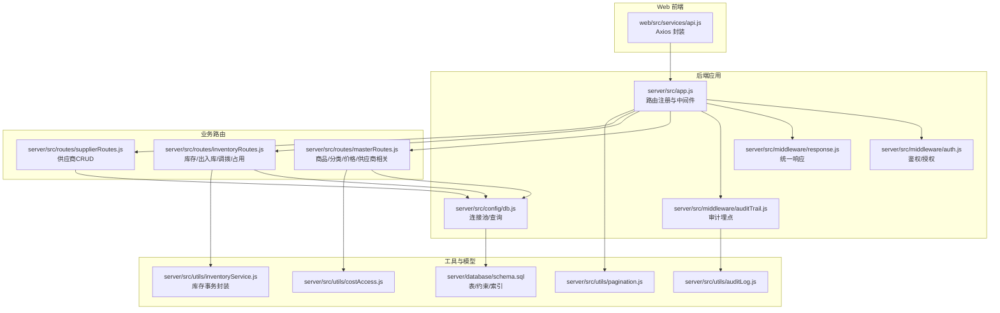
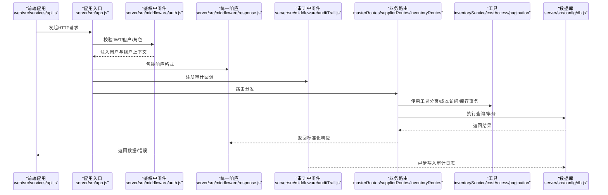
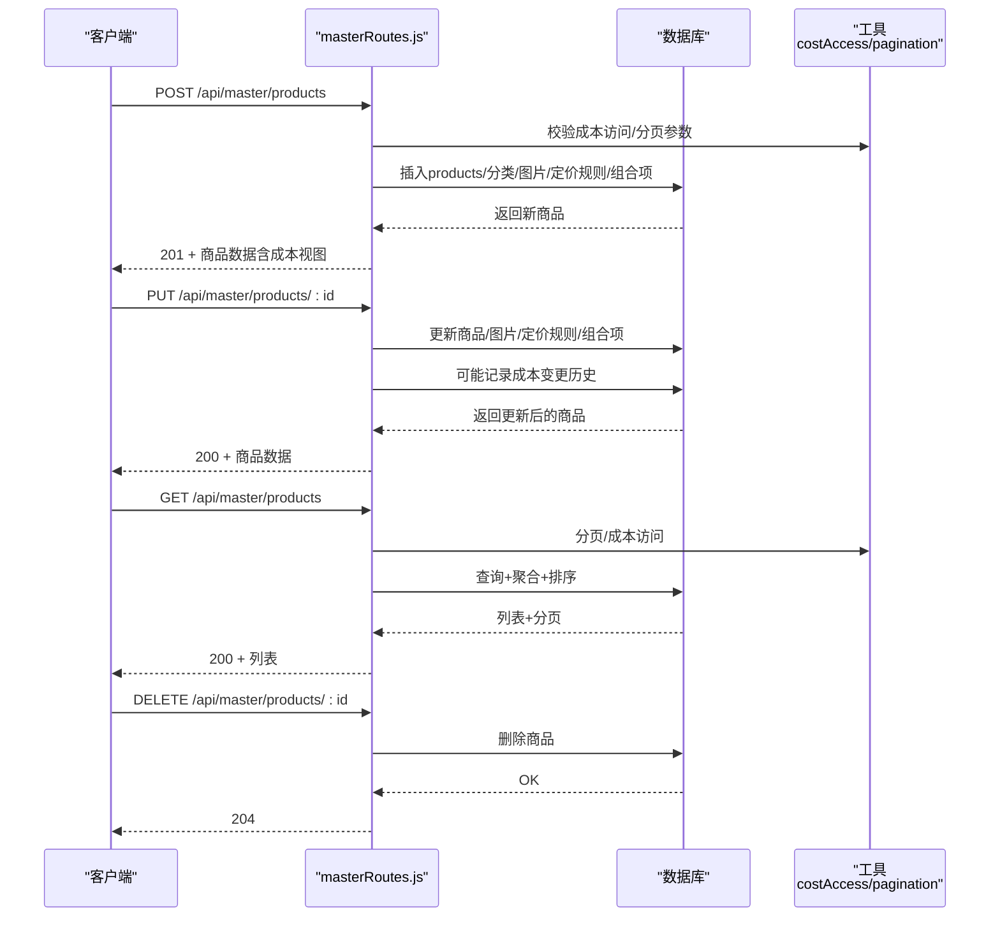
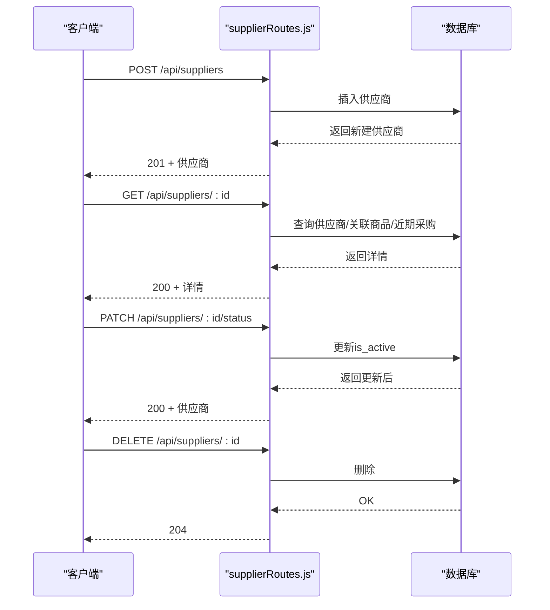
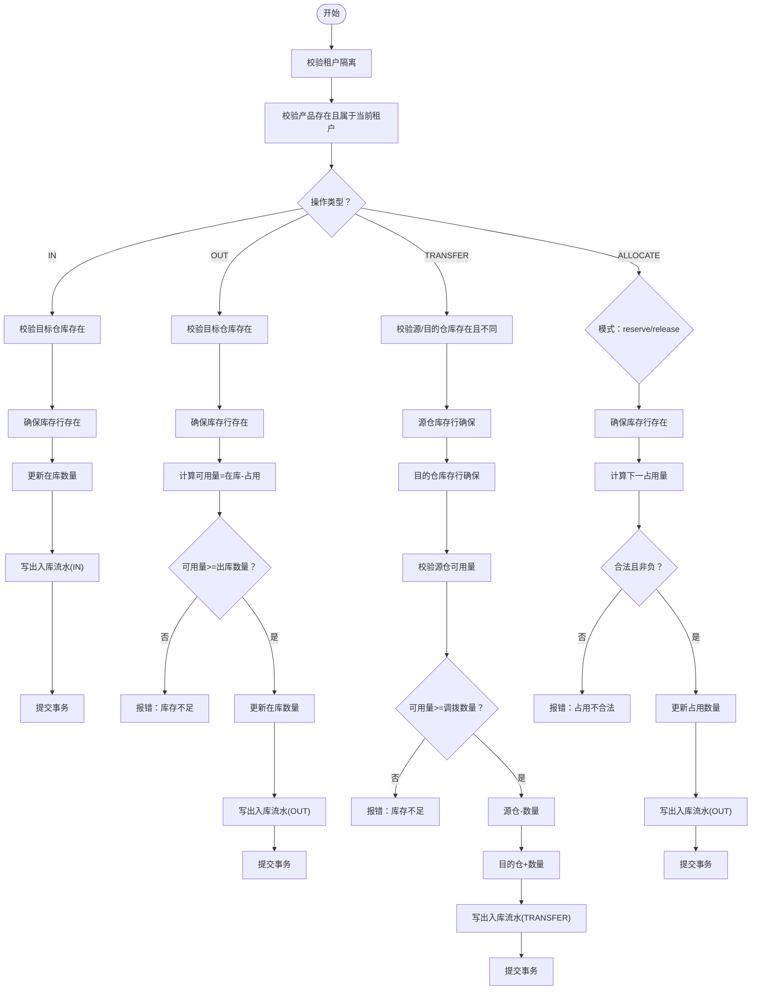
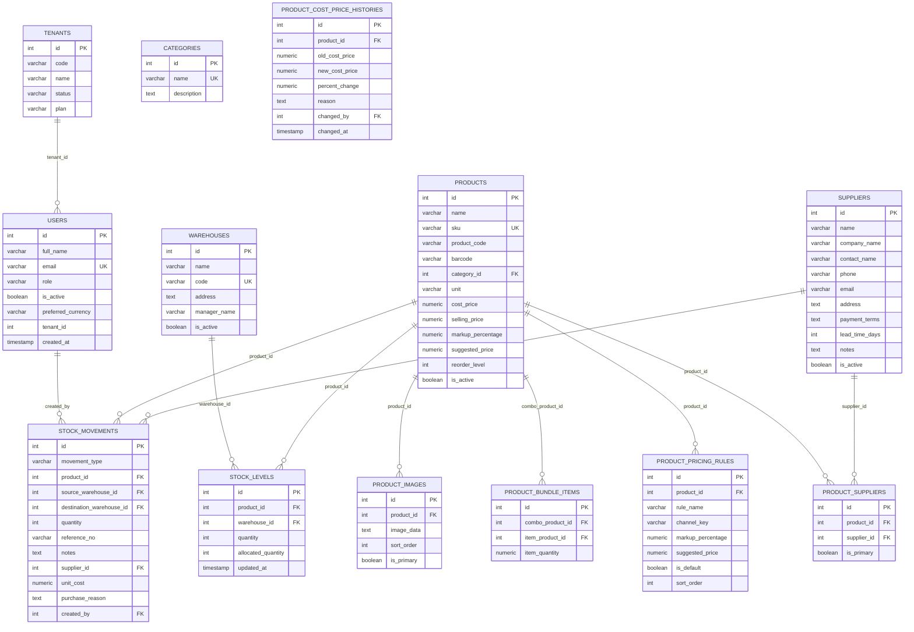
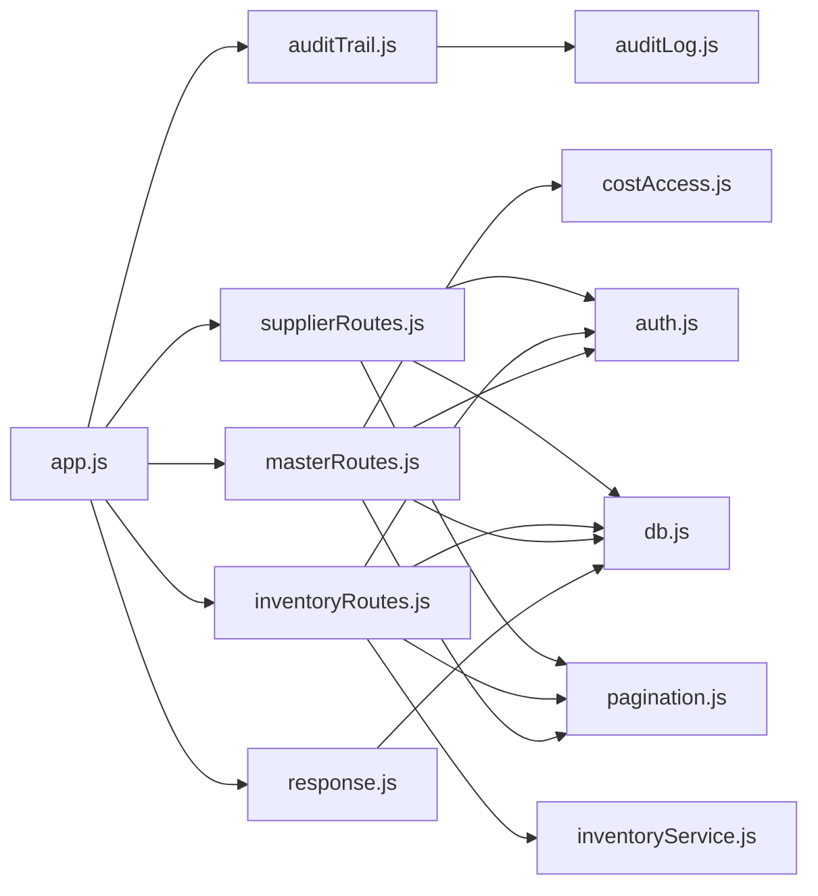

# 商品管理API

<cite>
**本文引用的文件**
- [server/src/routes/masterRoutes.js](file://server/src/routes/masterRoutes.js)
- [server/src/routes/inventoryRoutes.js](file://server/src/routes/inventoryRoutes.js)
- [server/src/routes/supplierRoutes.js](file://server/src/routes/supplierRoutes.js)
- [server/src/utils/inventoryService.js](file://server/src/utils/inventoryService.js)
- [server/src/middleware/auth.js](file://server/src/middleware/auth.js)
- [server/src/middleware/response.js](file://server/src/middleware/response.js)
- [server/src/middleware/auditTrail.js](file://server/src/middleware/auditTrail.js)
- [server/src/utils/auditLog.js](file://server/src/utils/auditLog.js)
- [server/src/utils/pagination.js](file://server/src/utils/pagination.js)
- [server/src/utils/costAccess.js](file://server/src/utils/costAccess.js)
- [server/src/config/db.js](file://server/src/config/db.js)
- [server/database/schema.sql](file://server/database/schema.sql)
- [web/src/services/api.js](file://web/src/services/api.js)
- [server/src/app.js](file://server/src/app.js)
- [POSTMAN_BACKEND_GUIDE.md](file://POSTMAN_BACKEND_GUIDE.md)
</cite>

## 目录
1. [简介](#简介)
2. [项目结构](#项目结构)
3. [核心组件](#核心组件)
4. [架构总览](#架构总览)
5. [详细组件分析](#详细组件分析)
6. [依赖关系分析](#依赖关系分析)
7. [性能考量](#性能考量)
8. [故障排查指南](#故障排查指南)
9. [结论](#结论)
10. [附录](#附录)

## 简介
本文件面向“商品管理API”的使用与维护，系统性梳理以下能力：
- 商品（产品）CRUD：创建、查询、更新、删除
- 商品分类管理：创建、查询、更新
- 供应商管理：创建、查询、更新、状态变更、删除
- 价格管理与成本访问控制：成本解锁、建议售价计算、价格历史
- 库存与出入库/调拨/占用：库存一致性、事务保障、可用量校验
- 数据模型与业务规则：唯一约束、检查约束、索引与外键
- 审计与错误响应：统一审计、统一响应包装、错误码与追踪ID

## 项目结构
后端采用 Express + PostgreSQL，路由集中在 server/src/routes 下，通用工具在 server/src/utils，中间件在 server/src/middleware，数据库结构在 server/database/schema.sql。

图表来源
- [server/src/app.js:1-91](file://server/src/app.js#L1-L91)
- [server/src/routes/masterRoutes.js:1-200](file://server/src/routes/masterRoutes.js#L1-L200)
- [server/src/routes/inventoryRoutes.js:1-536](file://server/src/routes/inventoryRoutes.js#L1-L536)
- [server/src/routes/supplierRoutes.js:1-383](file://server/src/routes/supplierRoutes.js#L1-L383)
- [server/src/utils/inventoryService.js:1-46](file://server/src/utils/inventoryService.js#L1-L46)
- [server/src/utils/pagination.js:1-28](file://server/src/utils/pagination.js#L1-L28)
- [server/src/utils/costAccess.js:1-32](file://server/src/utils/costAccess.js#L1-L32)
- [server/src/middleware/auth.js:1-87](file://server/src/middleware/auth.js#L1-L87)
- [server/src/middleware/response.js:1-62](file://server/src/middleware/response.js#L1-L62)
- [server/src/middleware/auditTrail.js:1-86](file://server/src/middleware/auditTrail.js#L1-L86)
- [server/src/utils/auditLog.js:1-40](file://server/src/utils/auditLog.js#L1-L40)
- [server/src/config/db.js:1-29](file://server/src/config/db.js#L1-L29)
- [server/database/schema.sql:1-447](file://server/database/schema.sql#L1-L447)
- [web/src/services/api.js:1-45](file://web/src/services/api.js#L1-L45)

章节来源
- [server/src/app.js:1-91](file://server/src/app.js#L1-L91)
- [server/src/routes/masterRoutes.js:1-200](file://server/src/routes/masterRoutes.js#L1-L200)
- [server/src/routes/inventoryRoutes.js:1-536](file://server/src/routes/inventoryRoutes.js#L1-L536)
- [server/src/routes/supplierRoutes.js:1-383](file://server/src/routes/supplierRoutes.js#L1-L383)
- [server/database/schema.sql:1-447](file://server/database/schema.sql#L1-L447)

## 核心组件
- 商品（产品）管理：在 masterRoutes.js 中实现商品 CRUD、分类管理、价格策略与成本访问控制
- 供应商管理：在 supplierRoutes.js 中实现供应商 CRUD、状态变更与关联商品/采购明细查询
- 库存与事务：在 inventoryRoutes.js 中实现库存总览、出入库、调拨、占用分配；通过 inventoryService.js 封装库存行确保与更新
- 鉴权与授权：auth.js 提供 JWT 校验、租户隔离与角色授权
- 统一响应与审计：response.js 包装统一响应格式；auditTrail.js 记录审计日志
- 分页与成本访问：pagination.js 统一分页；costAccess.js 控制成本查看令牌

章节来源
- [server/src/routes/masterRoutes.js:1306-1568](file://server/src/routes/masterRoutes.js#L1306-L1568)
- [server/src/routes/supplierRoutes.js:23-380](file://server/src/routes/supplierRoutes.js#L23-L380)
- [server/src/routes/inventoryRoutes.js:18-533](file://server/src/routes/inventoryRoutes.js#L18-L533)
- [server/src/utils/inventoryService.js:1-46](file://server/src/utils/inventoryService.js#L1-L46)
- [server/src/middleware/auth.js:1-87](file://server/src/middleware/auth.js#L1-L87)
- [server/src/middleware/response.js:1-62](file://server/src/middleware/response.js#L1-L62)
- [server/src/middleware/auditTrail.js:1-86](file://server/src/middleware/auditTrail.js#L1-L86)
- [server/src/utils/pagination.js:1-28](file://server/src/utils/pagination.js#L1-L28)
- [server/src/utils/costAccess.js:1-32](file://server/src/utils/costAccess.js#L1-L32)

## 架构总览
下图展示从 Web 前端到后端路由、中间件、工具与数据库的整体交互。

图表来源
- [server/src/app.js:1-91](file://server/src/app.js#L1-L91)
- [server/src/middleware/auth.js:1-87](file://server/src/middleware/auth.js#L1-L87)
- [server/src/middleware/response.js:1-62](file://server/src/middleware/response.js#L1-L62)
- [server/src/middleware/auditTrail.js:1-86](file://server/src/middleware/auditTrail.js#L1-L86)
- [server/src/routes/masterRoutes.js:1306-1568](file://server/src/routes/masterRoutes.js#L1306-L1568)
- [server/src/routes/supplierRoutes.js:23-380](file://server/src/routes/supplierRoutes.js#L23-L380)
- [server/src/routes/inventoryRoutes.js:18-533](file://server/src/routes/inventoryRoutes.js#L18-L533)
- [server/src/utils/inventoryService.js:1-46](file://server/src/utils/inventoryService.js#L1-L46)
- [server/src/utils/costAccess.js:1-32](file://server/src/utils/costAccess.js#L1-L32)
- [server/src/utils/pagination.js:1-28](file://server/src/utils/pagination.js#L1-L28)
- [server/src/config/db.js:1-29](file://server/src/config/db.js#L1-L29)

## 详细组件分析

### 商品（产品）CRUD 与分类管理
- 接口概览
  - 获取商品列表：支持搜索、分类过滤、状态过滤、分页、渠道定价
  - 获取单个商品详情：支持渠道定价选择
  - 创建商品：支持多图、多定价规则、组合SKU、默认建议价计算
  - 更新商品：支持图片、定价规则、组合项、主供应商更新、成本变更记录
  - 删除商品：仅管理员可删
  - 创建/更新主供应商：支持设置主供应商
  - 成本访问：管理员/经理凭密码换取成本访问令牌
  - 成本价格历史：查询最近变更记录
- 关键参数与规则
  - 必填：名称、SKU
  - 建议价计算：若显式提供则以之为准，否则基于成本价与标价百分比推导
  - 定价规则：默认零售规则，可自定义多渠道规则
  - 主供应商：可选设置，更新时可置空
  - 成本访问：需 ADMIN/MANAGER 角色，携带 x-cost-access-token
- 错误与一致性
  - 未登录/过期/跨租户：鉴权失败
  - 权限不足：403
  - 参数缺失或非法：400
  - 删除不存在资源：404
  - 成功：201/200/204

图表来源
- [server/src/routes/masterRoutes.js:1306-1568](file://server/src/routes/masterRoutes.js#L1306-L1568)
- [server/src/utils/costAccess.js:1-32](file://server/src/utils/costAccess.js#L1-L32)
- [server/src/utils/pagination.js:1-28](file://server/src/utils/pagination.js#L1-L28)
- [server/src/config/db.js:1-29](file://server/src/config/db.js#L1-L29)

章节来源
- [server/src/routes/masterRoutes.js:1306-1568](file://server/src/routes/masterRoutes.js#L1306-L1568)
- [POSTMAN_BACKEND_GUIDE.md:70-157](file://POSTMAN_BACKEND_GUIDE.md#L70-L157)

### 供应商管理API
- 接口概览
  - 获取供应商列表：支持搜索、状态过滤、排序（名称/创建时间/更新时间/交货周期）、分页
  - 创建供应商：必填公司名，其他字段可空
  - 获取供应商详情：返回供应商基础信息、关联商品、近期采购记录
  - 更新供应商：可更新全部字段
  - 更新供应商状态：激活/停用
  - 删除供应商：仅管理员
- 关键参数与规则
  - 必填：公司名
  - 排序字段白名单：name/created_at/updated_at/lead_time_days
  - 状态：all/active/inactive
  - 成功：201/200/204；失败：400/404/500
- 审计
  - 创建/更新/状态变更/删除均写入审计日志

图表来源
- [server/src/routes/supplierRoutes.js:23-380](file://server/src/routes/supplierRoutes.js#L23-L380)
- [server/src/middleware/auditTrail.js:14-81](file://server/src/middleware/auditTrail.js#L14-L81)
- [server/src/utils/auditLog.js:1-40](file://server/src/utils/auditLog.js#L1-L40)

章节来源
- [server/src/routes/supplierRoutes.js:23-380](file://server/src/routes/supplierRoutes.js#L23-L380)

### 库存与价格管理（出入库/调拨/占用）
- 库存总览
  - 支持搜索（商品/SKU/条码/分类/仓库/编码）、分类过滤、仓库过滤、仅低库存过滤、分页
  - 返回字段包含可用量（在库-占用）、成本价（受成本访问控制）
- 出入库/调拨/占用流程
  - 共同点：严格校验租户隔离、产品与仓库归属、事务包裹、库存行确保
  - 入库：校验目标仓库，更新在库数量，写出入库流水
  - 出库：校验可用量（在库-占用），更新在库数量，写出入库流水
  - 调拨：校验源/目的仓库不同且存在，校验源仓可用量，分别更新源/目的仓
  - 占用：支持预留/释放，更新占用数量，写出入库流水
- 价格与成本
  - 入库可记录单价与采购原因
  - 成本访问：通过成本访问令牌控制成本价可见性

图表来源
- [server/src/routes/inventoryRoutes.js:237-533](file://server/src/routes/inventoryRoutes.js#L237-L533)
- [server/src/utils/inventoryService.js:1-46](file://server/src/utils/inventoryService.js#L1-L46)

章节来源
- [server/src/routes/inventoryRoutes.js:18-533](file://server/src/routes/inventoryRoutes.js#L18-L533)
- [server/src/utils/inventoryService.js:1-46](file://server/src/utils/inventoryService.js#L1-L46)

### 数据模型与业务规则
- 核心实体
  - 用户、租户、仓库、分类、产品、产品图片、产品组合项、产品定价规则、库存级别、库存流水、供应商、产品-供应商关联、成本价格历史等
- 约束与索引
  - 唯一约束：SKU/条码/产品编码/仓库编码/供应商名等
  - 检查约束：数量非负、角色枚举、移动类型枚举、交货周期非负
  - 外键约束：产品/仓库/供应商级联删除策略
  - 索引覆盖：高频查询字段（如产品分类、库存级别、流水创建时间、供应商状态等）
- 价格与成本
  - 成本价与建议价字段，支持成本访问令牌控制可见性
  - 成本变更记录表，保留变更历史

图表来源
- [server/database/schema.sql:1-447](file://server/database/schema.sql#L1-L447)

章节来源
- [server/database/schema.sql:1-447](file://server/database/schema.sql#L1-L447)

## 依赖关系分析
- 路由依赖
  - masterRoutes 依赖鉴权、分页、成本访问、租户工具
  - inventoryRoutes 依赖鉴权、库存事务工具、分页、成本访问
  - supplierRoutes 依赖鉴权、分页
- 中间件依赖
  - app.js 注册统一响应、审计、CORS、日志、路由
  - 鉴权中间件负责 JWT 校验与租户隔离
  - 审计中间件在响应完成后异步写入审计日志
- 工具依赖
  - inventoryService 封装库存行确保、查询与更新
  - costAccess 提供成本访问令牌解析与判定
  - pagination 统一分页参数与结构
- 数据库依赖
  - config/db 提供连接池与查询方法
  - schema 定义表结构、约束与索引

图表来源
- [server/src/app.js:1-91](file://server/src/app.js#L1-L91)
- [server/src/routes/masterRoutes.js:1-200](file://server/src/routes/masterRoutes.js#L1-L200)
- [server/src/routes/inventoryRoutes.js:1-536](file://server/src/routes/inventoryRoutes.js#L1-L536)
- [server/src/routes/supplierRoutes.js:1-383](file://server/src/routes/supplierRoutes.js#L1-L383)
- [server/src/middleware/auth.js:1-87](file://server/src/middleware/auth.js#L1-L87)
- [server/src/middleware/response.js:1-62](file://server/src/middleware/response.js#L1-L62)
- [server/src/middleware/auditTrail.js:1-86](file://server/src/middleware/auditTrail.js#L1-L86)
- [server/src/utils/inventoryService.js:1-46](file://server/src/utils/inventoryService.js#L1-L46)
- [server/src/utils/pagination.js:1-28](file://server/src/utils/pagination.js#L1-L28)
- [server/src/utils/costAccess.js:1-32](file://server/src/utils/costAccess.js#L1-L32)
- [server/src/config/db.js:1-29](file://server/src/config/db.js#L1-L29)
- [server/src/utils/auditLog.js:1-40](file://server/src/utils/auditLog.js#L1-L40)

章节来源
- [server/src/app.js:1-91](file://server/src/app.js#L1-L91)
- [server/src/middleware/auth.js:1-87](file://server/src/middleware/auth.js#L1-L87)
- [server/src/middleware/response.js:1-62](file://server/src/middleware/response.js#L1-L62)
- [server/src/middleware/auditTrail.js:1-86](file://server/src/middleware/auditTrail.js#L1-L86)
- [server/src/utils/inventoryService.js:1-46](file://server/src/utils/inventoryService.js#L1-L46)
- [server/src/utils/pagination.js:1-28](file://server/src/utils/pagination.js#L1-L28)
- [server/src/utils/costAccess.js:1-32](file://server/src/utils/costAccess.js#L1-L32)
- [server/src/config/db.js:1-29](file://server/src/config/db.js#L1-L29)

## 性能考量
- 列表查询优化
  - 使用 LIMIT/OFFSET 分页，避免一次性加载大量数据
  - 对高频查询字段建立索引（如产品分类、库存级别、流水创建时间、供应商状态）
- 并行查询
  - 列表与总数并行查询，减少往返延迟
- 事务与锁
  - 库存操作使用 BEGIN/COMMIT 包裹，避免并发导致的超卖
  - 库存行确保（ON CONFLICT DO NOTHING）降低重复初始化开销
- 成本访问
  - 成本价按需解密显示，避免不必要的敏感信息泄露

## 故障排查指南
- 鉴权失败
  - 缺少 Token 或过期：401
  - 用户不存在或非活跃：401
  - 租户状态异常或跨租户：403
  - 角色权限不足：403
- 参数错误
  - 缺少必填字段（如商品名称/SKU、供应商公司名）：400
  - 数量/价格非法：400
  - 库存不足：400
- 资源不存在
  - 商品/供应商不存在：404
- 事务回滚
  - 库存操作异常会回滚，确保数据一致性
- 统一响应与追踪
  - 所有错误响应包含统一结构与请求ID，便于前端与运维定位问题
  - 审计日志记录关键动作与元数据，支持事后追溯

章节来源
- [server/src/middleware/auth.js:1-87](file://server/src/middleware/auth.js#L1-L87)
- [server/src/middleware/response.js:1-62](file://server/src/middleware/response.js#L1-L62)
- [server/src/middleware/auditTrail.js:1-86](file://server/src/middleware/auditTrail.js#L1-L86)
- [server/src/routes/inventoryRoutes.js:237-533](file://server/src/routes/inventoryRoutes.js#L237-L533)
- [server/src/routes/supplierRoutes.js:23-380](file://server/src/routes/supplierRoutes.js#L23-L380)
- [server/src/routes/masterRoutes.js:1306-1568](file://server/src/routes/masterRoutes.js#L1306-L1568)

## 结论
本系统围绕“商品-供应商-库存”三线业务构建了完善的API体系：
- 商品CRUD与定价策略灵活，支持成本访问控制与历史追踪
- 供应商管理覆盖全生命周期，支持状态与关联商品/采购明细查询
- 库存管理以事务为核心，保障在库与占用数据一致性
- 中间件层提供统一鉴权、响应与审计，增强可观测性与安全性
- 数据模型具备强约束与索引优化，满足高并发场景下的稳定性要求

## 附录
- 常见用例
  - 创建商品并绑定主供应商：先创建供应商，再创建商品并传入主供应商ID
  - 入库：提供产品ID、仓库ID、数量、可选单价与采购原因
  - 出库：提供产品ID、仓库ID、数量
  - 调拨：提供源/目的仓库ID与数量
  - 占用：预留/释放，提供产品ID、仓库ID、数量与模式
  - 成本访问：管理员/经理调用成本访问接口获取令牌后，在后续请求头携带
- 请求头与环境
  - 前端 Axios 默认注入 Authorization 与 x-cost-access-token
  - 审计日志包含请求体与状态码，便于问题定位

章节来源
- [web/src/services/api.js:1-45](file://web/src/services/api.js#L1-L45)
- [POSTMAN_BACKEND_GUIDE.md:70-157](file://POSTMAN_BACKEND_GUIDE.md#L70-L157)