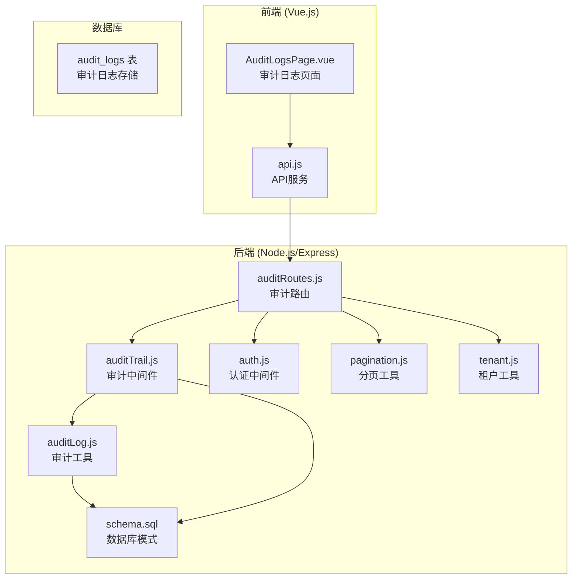
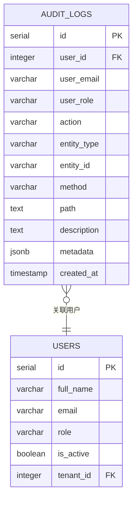
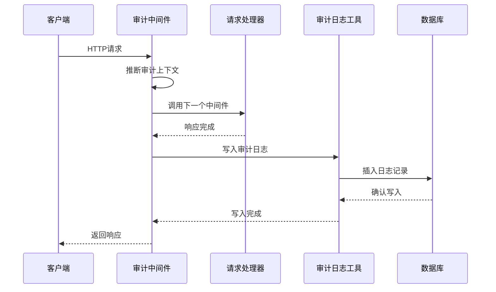
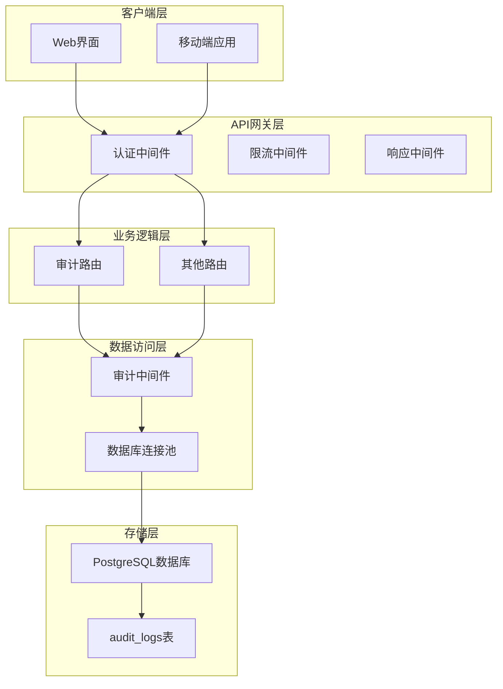
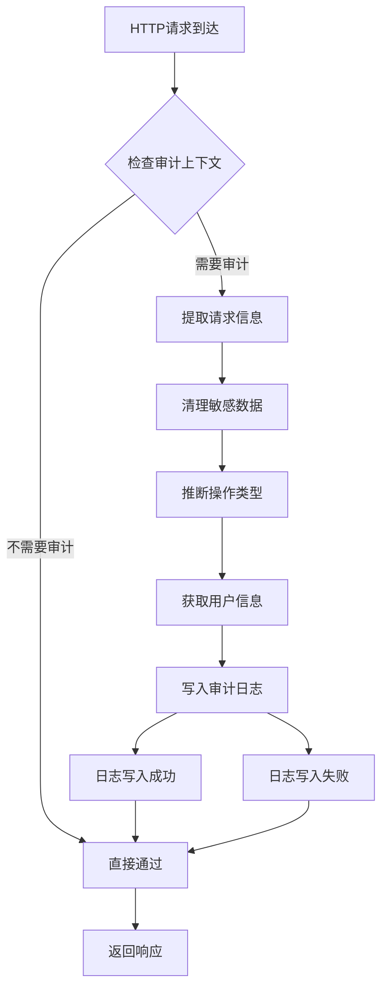
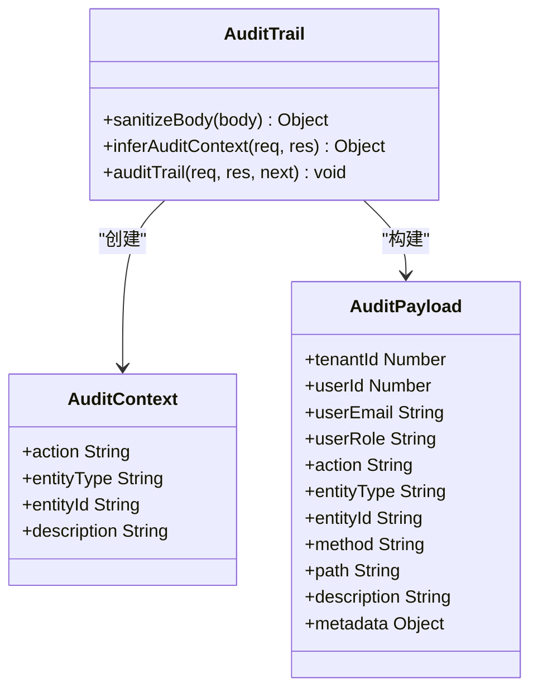
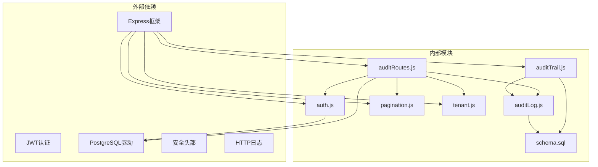
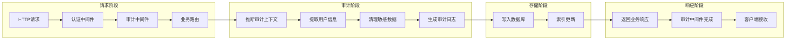

# 审计日志API

<cite>
**本文档引用的文件**
- [auditTrail.js](file://server/src/middleware/auditTrail.js)
- [auditLog.js](file://server/src/utils/auditLog.js)
- [auditRoutes.js](file://server/src/routes/auditRoutes.js)
- [schema.sql](file://server/database/schema.sql)
- [AuditLogsPage.vue](file://web/src/pages/AuditLogsPage.vue)
- [api.js](file://web/src/services/api.js)
- [auth.js](file://server/src/middleware/auth.js)
- [pagination.js](file://server/src/utils/pagination.js)
- [app.js](file://server/src/app.js)
- [tenant.js](file://server/src/utils/tenant.js)
</cite>

## 目录
1. [简介](#简介)
2. [项目结构](#项目结构)
3. [核心组件](#核心组件)
4. [架构概览](#架构概览)
5. [详细组件分析](#详细组件分析)
6. [依赖关系分析](#依赖关系分析)
7. [性能考虑](#性能考虑)
8. [故障排除指南](#故障排除指南)
9. [结论](#结论)
10. [附录](#附录)

## 简介

审计日志API是库存管理系统中的关键组件，负责记录所有用户行为和系统事件，提供完整的操作追踪能力。该系统实现了全面的审计日志记录机制，包括用户行为追踪、系统事件记录、查询过滤功能以及安全存储保护。

系统采用多租户架构设计，确保不同租户之间的数据隔离，同时提供了灵活的查询接口和强大的过滤功能。审计日志不仅记录基本的操作信息，还包含详细的元数据，支持深入的分析和监控。

## 项目结构

库存管理系统的审计日志功能分布在前后端两个主要部分：



**图表来源**
- [AuditLogsPage.vue:1-457](file://web/src/pages/AuditLogsPage.vue#L1-L457)
- [auditRoutes.js:1-113](file://server/src/routes/auditRoutes.js#L1-L113)
- [auditTrail.js:1-86](file://server/src/middleware/auditTrail.js#L1-L86)
- [auditLog.js:1-40](file://server/src/utils/auditLog.js#L1-L40)

**章节来源**
- [app.js:1-91](file://server/src/app.js#L1-L91)
- [schema.sql:275-288](file://server/database/schema.sql#L275-L288)

## 核心组件

### 审计日志表结构

系统使用PostgreSQL数据库存储审计日志，采用JSONB格式存储元数据，支持灵活的数据结构和高效的查询性能。



**图表来源**
- [schema.sql:275-288](file://server/database/schema.sql#L275-L288)

### 审计中间件架构

审计中间件作为全局拦截器，自动捕获HTTP请求和响应信息，生成标准化的审计日志条目。



**图表来源**
- [auditTrail.js:47-81](file://server/src/middleware/auditTrail.js#L47-L81)
- [auditLog.js:1-40](file://server/src/utils/auditLog.js#L1-L40)

**章节来源**
- [auditTrail.js:1-86](file://server/src/middleware/auditTrail.js#L1-L86)
- [auditLog.js:1-40](file://server/src/utils/auditLog.js#L1-L40)

## 架构概览

### 整体系统架构



**图表来源**
- [app.js:26-80](file://server/src/app.js#L26-L80)
- [auditTrail.js:1-86](file://server/src/middleware/auditTrail.js#L1-L86)

### 审计日志流程



**图表来源**
- [auditTrail.js:47-81](file://server/src/middleware/auditTrail.js#L47-L81)

## 详细组件分析

### 审计中间件 (auditTrail.js)

审计中间件是整个审计系统的核心组件，负责拦截HTTP请求和响应，自动记录用户行为和系统事件。

#### 主要功能特性

1. **智能审计上下文推断**
   - 自动识别登录操作
   - 推断实体类型和操作动作
   - 提取请求参数和响应状态

2. **敏感数据保护**
   - 自动屏蔽密码字段
   - 清理敏感请求体内容
   - 保护用户隐私信息

3. **多租户支持**
   - 自动获取租户ID
   - 支持租户间数据隔离
   - 防止跨租户数据访问

#### 关键实现细节



**图表来源**
- [auditTrail.js:4-81](file://server/src/middleware/auditTrail.js#L4-L81)

**章节来源**
- [auditTrail.js:1-86](file://server/src/middleware/auditTrail.js#L1-L86)

### 审计日志工具 (auditLog.js)

审计日志工具负责将审计信息持久化到数据库，使用PostgreSQL的JSONB类型存储元数据。

#### 数据模型设计

| 字段名 | 类型 | 约束 | 描述 |
|--------|------|------|------|
| id | serial | PK | 主键标识 |
| tenant_id | integer | FK | 租户ID |
| user_id | integer | FK | 用户ID |
| user_email | varchar(150) |  | 用户邮箱 |
| user_role | varchar(20) |  | 用户角色 |
| action | varchar(80) | NOT NULL | 操作类型 |
| entity_type | varchar(80) | NOT NULL | 实体类型 |
| entity_id | varchar(120) |  | 实体ID |
| method | varchar(10) | NOT NULL | HTTP方法 |
| path | text | NOT NULL | 请求路径 |
| description | text |  | 操作描述 |
| metadata | jsonb | NOT NULL | 元数据JSON |
| created_at | timestamp | NOT NULL | 创建时间 |

#### 性能优化策略

1. **索引优化**
   - 用户ID索引：`idx_audit_logs_user_id`
   - 时间索引：`idx_audit_logs_created_at`
   - 复合索引：按常用查询条件建立

2. **JSONB存储优势**
   - 灵活的数据结构
   - 高效的查询性能
   - 支持全文搜索

**章节来源**
- [auditLog.js:1-40](file://server/src/utils/auditLog.js#L1-L40)
- [schema.sql:275-288](file://server/database/schema.sql#L275-L288)

### 审计路由 (auditRoutes.js)

审计路由提供RESTful API接口，支持复杂的查询、过滤和分页功能。

#### API接口规范

##### 获取审计日志列表

**请求URL**: `GET /api/audit-logs`

**认证要求**: 需要管理员或经理权限

**查询参数**:

| 参数名 | 类型 | 必需 | 默认值 | 描述 |
|--------|------|------|--------|------|
| search | string | 否 | '' | 搜索关键词（邮箱、路径、动作） |
| action | string | 否 | 'all' | 操作类型过滤 |
| entityType | string | 否 | 'all' | 实体类型过滤 |
| startDate | string | 否 | '' | 开始日期 (YYYY-MM-DD) |
| endDate | string | 否 | '' | 结束日期 (YYYY-MM-DD) |
| page | number | 否 | 1 | 页码 |
| pageSize | number | 否 | 10 | 每页数量 (1-100) |
| all | boolean | 否 | false | 是否获取全部数据 |

**响应结构**:

```javascript
{
  "items": [
    {
      "id": 1,
      "user_id": 1,
      "user_email": "admin@example.com",
      "user_role": "ADMIN",
      "action": "LOGIN",
      "entity_type": "AUTH",
      "entity_id": null,
      "method": "POST",
      "path": "/api/auth/login",
      "description": "User logged in",
      "metadata": {
        "body": "[REDACTED]",
        "statusCode": 200
      },
      "created_at": "2024-01-15T10:30:00Z"
    }
  ],
  "pagination": {
    "total": 100,
    "page": 1,
    "pageSize": 10,
    "totalPages": 10
  }
}
```

**章节来源**
- [auditRoutes.js:16-110](file://server/src/routes/auditRoutes.js#L16-L110)

### 前端审计日志页面 (AuditLogsPage.vue)

前端页面提供用户友好的审计日志查看界面，支持多种过滤选项和导出功能。

#### 功能特性

1. **高级过滤功能**
   - 文本搜索框
   - 操作类型下拉选择
   - 实体类型下拉选择
   - 日期范围选择器
   - 重置过滤器按钮

2. **预设过滤器**
   - 本地存储过滤器配置
   - 保存当前过滤器为预设
   - 应用预设过滤器
   - 设置默认预设
   - 重命名和删除预设

3. **数据导出功能**
   - 导出为CSV格式
   - 导出为JSON格式
   - 导出为PDF格式
   - 支持全量导出

4. **交互体验**
   - 分页导航
   - 详细信息展开/收起
   - 加载状态指示
   - 错误消息显示

**章节来源**
- [AuditLogsPage.vue:1-457](file://web/src/pages/AuditLogsPage.vue#L1-L457)

### 认证和授权 (auth.js)

系统使用JWT令牌进行身份验证，确保只有授权用户才能访问审计日志。

#### 角色权限控制

| 角色 | 权限级别 | 可访问功能 |
|------|----------|------------|
| ADMIN | 最高权限 | 所有功能，包括审计日志 |
| MANAGER | 管理权限 | 审计日志查看，部分系统管理 |
| STAFF | 基础权限 | 仅限基础业务操作 |

#### 安全特性

1. **JWT令牌验证**
   - 令牌签名验证
   - 过期时间检查
   - 租户ID一致性验证

2. **跨域安全**
   - CORS白名单机制
   - 凭据支持
   - 安全头部设置

**章节来源**
- [auth.js:1-87](file://server/src/middleware/auth.js#L1-L87)

## 依赖关系分析

### 组件依赖图



**图表来源**
- [app.js:15-25](file://server/src/app.js#L15-L25)
- [auditTrail.js:1-2](file://server/src/middleware/auditTrail.js#L1-L2)

### 数据流分析



**图表来源**
- [auditTrail.js:47-81](file://server/src/middleware/auditTrail.js#L47-L81)
- [auditLog.js:1-40](file://server/src/utils/auditLog.js#L1-L40)

**章节来源**
- [app.js:47-58](file://server/src/app.js#L47-L58)

## 性能考虑

### 查询优化策略

1. **索引优化**
   - `audit_logs_created_at`: 按时间排序查询
   - `audit_logs_user_id`: 用户过滤查询
   - 复合索引：`(tenant_id, created_at DESC)`

2. **查询性能监控**
   - 使用EXPLAIN ANALYZE分析慢查询
   - 监控索引使用情况
   - 定期维护统计信息

3. **缓存策略**
   - 热点数据缓存
   - 查询结果缓存
   - 预计算聚合数据

### 存储优化

1. **数据压缩**
   - JSONB数据压缩
   - 重复字段去重
   - 历史数据归档

2. **分区策略**
   - 按时间分区
   - 按租户分区
   - 混合分区策略

### 并发处理

1. **连接池管理**
   - 合理的连接数配置
   - 连接超时设置
   - 连接复用策略

2. **事务优化**
   - 短事务原则
   - 死锁预防
   - 乐观锁机制

## 故障排除指南

### 常见问题及解决方案

#### 审计日志未记录

**可能原因**:
1. 审计中间件未正确配置
2. 请求方法不支持审计
3. 响应状态码异常

**解决步骤**:
1. 检查中间件注册顺序
2. 验证请求方法是否在支持列表中
3. 查看响应状态码是否小于400

#### 查询结果为空

**可能原因**:
1. 租户ID过滤
2. 过滤条件过于严格
3. 数据不存在

**解决步骤**:
1. 验证租户上下文
2. 调整过滤条件
3. 检查数据是否存在

#### 性能问题

**可能原因**:
1. 缺少必要索引
2. 查询条件不优化
3. 数据量过大

**解决步骤**:
1. 添加缺失索引
2. 优化查询条件
3. 考虑数据归档

**章节来源**
- [auditTrail.js:58-78](file://server/src/middleware/auditTrail.js#L58-L78)
- [auditRoutes.js:107-109](file://server/src/routes/auditRoutes.js#L107-L109)

### 日志分析最佳实践

1. **实时监控**
   - 设置告警阈值
   - 监控异常操作模式
   - 实时通知机制

2. **定期分析**
   - 用户行为分析
   - 系统使用统计
   - 安全事件检测

3. **合规报告**
   - 定期生成合规报告
   - 审计轨迹完整性检查
   - 合规性验证

## 结论

审计日志API为库存管理系统提供了全面的操作追踪和合规保障能力。系统采用现代化的技术架构，实现了高效、安全、可扩展的审计日志功能。

### 主要优势

1. **自动化程度高**: 审计中间件自动捕获所有HTTP请求和响应
2. **安全性强**: 敏感数据保护和多租户隔离
3. **查询灵活**: 支持复杂的过滤和搜索功能
4. **性能优化**: 合理的索引设计和查询优化
5. **用户体验好**: 前端提供直观的查询界面

### 技术亮点

- **智能审计上下文推断**: 自动识别用户操作类型
- **JSONB元数据存储**: 支持灵活的数据结构
- **多租户架构**: 确保数据隔离和安全
- **高性能查询**: 优化的索引和查询策略
- **完整监控**: 从API到数据库的全方位监控

该系统为企业的审计合规需求提供了坚实的技术基础，支持各种规模的企业应用。

## 附录

### API使用示例

#### 获取审计日志列表

```javascript
// 基本查询
fetch('/api/audit-logs')

// 带过滤条件
fetch('/api/audit-logs?search=admin&action=LOGIN&entityType=AUTH')

// 分页查询
fetch('/api/audit-logs?page=2&pageSize=20')
```

#### 导出审计数据

```javascript
// 导出为CSV
fetch('/api/audit-logs?all=true').then(response => response.json())
  .then(data => exportToCsv('audit-logs.csv', columns, data.items))
```

### 审计合规性要求

1. **数据完整性**: 确保审计日志不可篡改
2. **数据可用性**: 保证长期可访问性
3. **隐私保护**: 敏感信息脱敏处理
4. **访问控制**: 严格的权限管理
5. **审计轨迹**: 完整的操作记录

### 维护建议

1. **定期备份**: 审计日志数据定期备份
2. **性能监控**: 持续监控系统性能
3. **安全更新**: 及时更新安全补丁
4. **容量规划**: 预测数据增长趋势
5. **合规审查**: 定期进行合规性检查