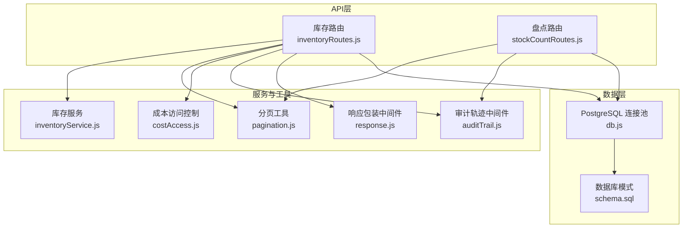
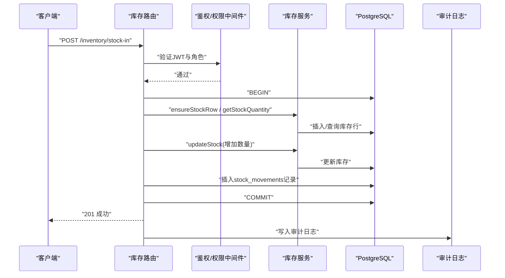
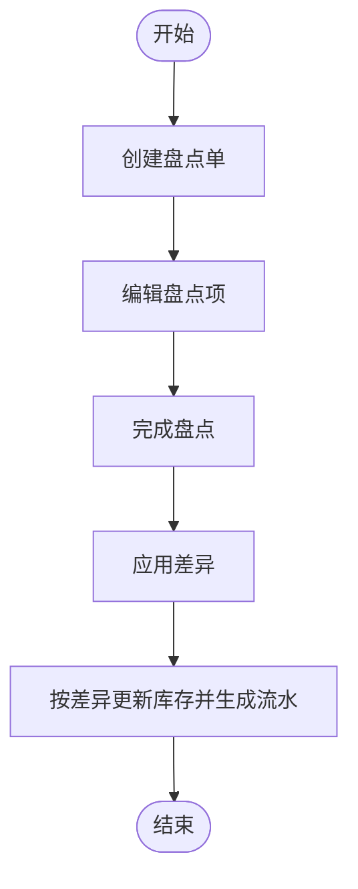
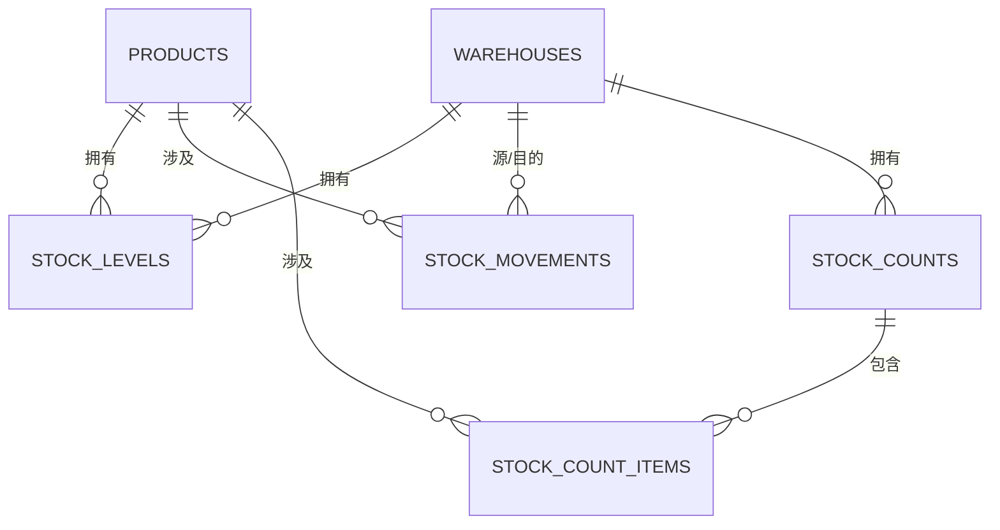
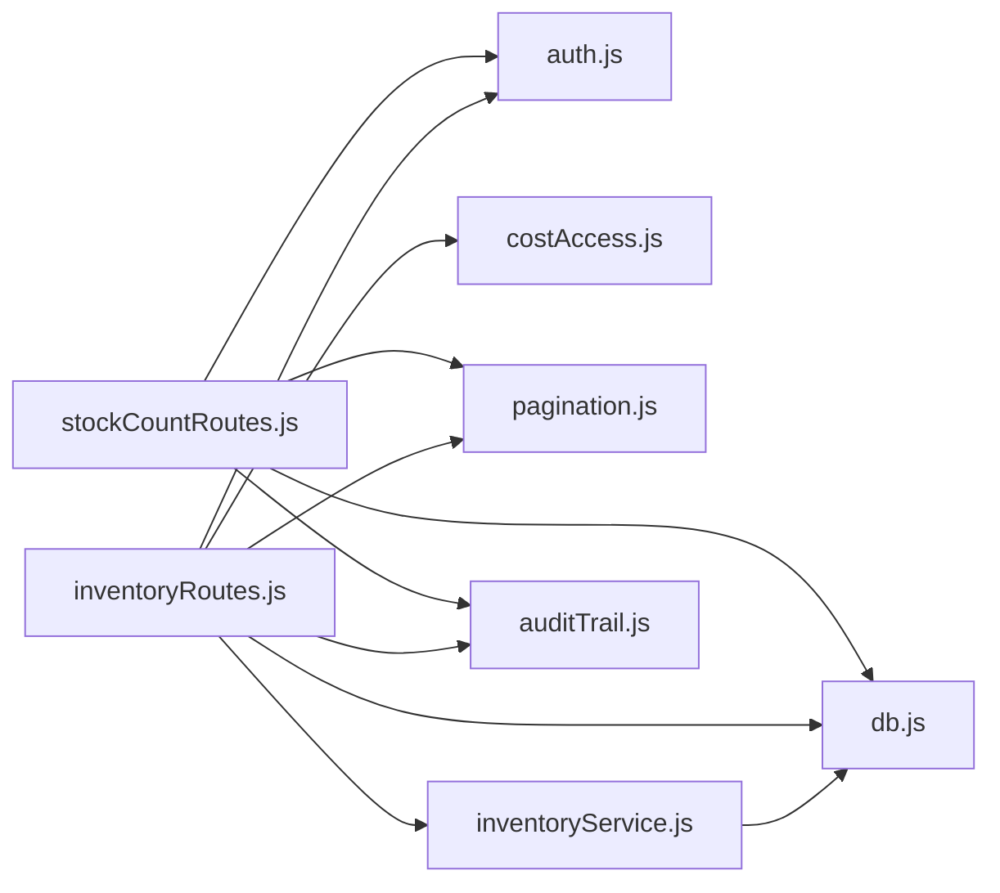

# 库存管理API

<cite>
**本文引用的文件**
- [server/src/routes/inventoryRoutes.js](file://server/src/routes/inventoryRoutes.js)
- [server/src/utils/inventoryService.js](file://server/src/utils/inventoryService.js)
- [server/src/routes/stockCountRoutes.js](file://server/src/routes/stockCountRoutes.js)
- [server/database/schema.sql](file://server/database/schema.sql)
- [server/src/middleware/auth.js](file://server/src/middleware/auth.js)
- [server/src/config/db.js](file://server/src/config/db.js)
- [server/src/utils/pagination.js](file://server/src/utils/pagination.js)
- [server/src/utils/costAccess.js](file://server/src/utils/costAccess.js)
- [server/src/middleware/auditTrail.js](file://server/src/middleware/auditTrail.js)
- [server/src/middleware/response.js](file://server/src/middleware/response.js)
- [postman/inventory_system_backend.postman_collection.json](file://postman/inventory_system_backend.postman_collection.json)
- [POSTMAN_BACKEND_GUIDE.md](file://POSTMAN_BACKEND_GUIDE.md)
- [README.md](file://README.md)
</cite>

## 目录
1. [简介](#简介)
2. [项目结构](#项目结构)
3. [核心组件](#核心组件)
4. [架构总览](#架构总览)
5. [详细组件分析](#详细组件分析)
6. [依赖关系分析](#依赖关系分析)
7. [性能考量](#性能考量)
8. [故障排查指南](#故障排查指南)
9. [结论](#结论)
10. [附录](#附录)

## 简介
本文件面向库存管理API的使用者与维护者，系统性梳理入库、出库、调拨、盘点等业务流程的接口规范与实现细节；同时覆盖库存查询、库存调整与分配、批次与成本管理、事务原子性与数据一致性保障、业务规则与异常处理策略，并提供性能优化建议与实际代码示例路径。

## 项目结构
后端采用Express + PostgreSQL，库存相关能力集中在以下模块：
- 路由层：库存路由与盘点路由
- 通用工具：库存服务封装、分页、成本访问控制、审计日志中间件
- 数据层：PostgreSQL表结构定义
- 安全与中间件：鉴权、响应包装、审计轨迹

图表来源
- [server/src/routes/inventoryRoutes.js:1-536](file://server/src/routes/inventoryRoutes.js#L1-L536)
- [server/src/routes/stockCountRoutes.js:1-458](file://server/src/routes/stockCountRoutes.js#L1-L458)
- [server/src/utils/inventoryService.js:1-46](file://server/src/utils/inventoryService.js#L1-L46)
- [server/src/utils/pagination.js:1-28](file://server/src/utils/pagination.js#L1-L28)
- [server/src/utils/costAccess.js:1-32](file://server/src/utils/costAccess.js#L1-L32)
- [server/src/middleware/auditTrail.js:1-86](file://server/src/middleware/auditTrail.js#L1-L86)
- [server/src/middleware/response.js:1-62](file://server/src/middleware/response.js#L1-L62)
- [server/src/config/db.js:1-29](file://server/src/config/db.js#L1-L29)
- [server/database/schema.sql:1-447](file://server/database/schema.sql#L1-L447)

章节来源
- [README.md:22-29](file://README.md#L22-L29)

## 核心组件
- 库存路由：提供库存总览、交易流水、入库、出库、调拨、分配等接口
- 盘点路由：提供盘点单生命周期管理（创建、编辑、完成、应用）
- 库存服务：统一封装库存行确保、查询与更新，保证事务内一致性
- 分页工具：统一分页参数与返回结构
- 成本访问控制：基于自定义头部的成本字段解封机制
- 审计轨迹：自动记录关键操作的审计日志
- 响应包装：统一错误/成功响应格式与请求ID

章节来源
- [server/src/routes/inventoryRoutes.js:17-156](file://server/src/routes/inventoryRoutes.js#L17-L156)
- [server/src/routes/stockCountRoutes.js:15-91](file://server/src/routes/stockCountRoutes.js#L15-L91)
- [server/src/utils/inventoryService.js:1-46](file://server/src/utils/inventoryService.js#L1-L46)
- [server/src/utils/pagination.js:1-28](file://server/src/utils/pagination.js#L1-L28)
- [server/src/utils/costAccess.js:1-32](file://server/src/utils/costAccess.js#L1-L32)
- [server/src/middleware/auditTrail.js:14-86](file://server/src/middleware/auditTrail.js#L14-L86)
- [server/src/middleware/response.js:3-62](file://server/src/middleware/response.js#L3-L62)

## 架构总览
库存API通过Express路由接收请求，经鉴权与权限校验后，调用库存服务或盘点服务在PostgreSQL事务中执行数据变更，同时写入审计日志与库存流水。

图表来源
- [server/src/routes/inventoryRoutes.js:237-437](file://server/src/routes/inventoryRoutes.js#L237-L437)
- [server/src/utils/inventoryService.js:3-39](file://server/src/utils/inventoryService.js#L3-L39)
- [server/src/middleware/auditTrail.js:47-81](file://server/src/middleware/auditTrail.js#L47-L81)

## 详细组件分析

### 库存查询API
- 接口：GET /inventory
  - 功能：支持分页、搜索（产品名/SKU/条码/分类/仓库名/仓库编码）、低库存筛选、租户隔离
  - 参数：
    - search：模糊搜索关键词
    - categoryId：按分类过滤
    - warehouseId：按仓库过滤
    - lowStockOnly：仅展示低于安全线的商品
    - page/pageSize：分页
    - all：是否加载全部（不分页）
  - 返回：items + pagination，其中 cost_price 在未解锁时为 null
  - 权限：需登录
  - 性能：默认分页查询，支持 all=true 一次性拉取全部（谨慎使用）

- 接口：GET /inventory/transactions
  - 功能：最近库存流水，支持按类型筛选（IN/OUT/TRANSFER/all）与分页
  - 参数：search、movementType、page、pageSize
  - 返回：items + pagination

章节来源
- [server/src/routes/inventoryRoutes.js:17-156](file://server/src/routes/inventoryRoutes.js#L17-L156)
- [server/src/utils/pagination.js:2-22](file://server/src/utils/pagination.js#L2-L22)
- [server/src/utils/costAccess.js:25-27](file://server/src/utils/costAccess.js#L25-L27)

### 库存操作API

#### 入库（Stock-In）
- 接口：POST /inventory/stock-in
- 角色：ADMIN/MANAGER/STAFF
- 请求体字段：
  - productId：必填
  - warehouseId：必填
  - quantity：必填（>0）
  - referenceNo、notes、supplierId、unitCost、purchaseReason（可选）
- 业务规则：
  - 校验产品与仓库属于当前租户
  - 若库存行不存在则自动创建
  - 可选供应商与单价写入流水
- 事务：BEGIN/COMMIT，失败ROLLBACK
- 审计：写入审计日志

章节来源
- [server/src/routes/inventoryRoutes.js:439-441](file://server/src/routes/inventoryRoutes.js#L439-L441)
- [server/src/routes/inventoryRoutes.js:258-310](file://server/src/routes/inventoryRoutes.js#L258-L310)
- [server/src/utils/inventoryService.js:3-12](file://server/src/utils/inventoryService.js#L3-L12)

#### 出库（Stock-Out）
- 接口：POST /inventory/stock-out
- 角色：ADMIN/MANAGER/STAFF
- 请求体字段：
  - productId、warehouseId、quantity、referenceNo、notes
- 业务规则：
  - 校验可用库存（已出库预留不计入可用）
  - 不允许负可用
- 事务：BEGIN/COMMIT，失败ROLLBACK

章节来源
- [server/src/routes/inventoryRoutes.js:443-445](file://server/src/routes/inventoryRoutes.js#L443-L445)
- [server/src/routes/inventoryRoutes.js:312-356](file://server/src/routes/inventoryRoutes.js#L312-L356)

#### 调拨（Transfer）
- 接口：POST /inventory/transfer
- 角色：ADMIN/MANAGER
- 请求体字段：
  - productId、sourceWarehouseId、destinationWarehouseId、quantity、referenceNo、notes
- 业务规则：
  - 源与目的仓库必须不同
  - 校验源仓可用库存充足
  - 同时更新源仓扣减与目的仓增加
- 事务：BEGIN/COMMIT，失败ROLLBACK

章节来源
- [server/src/routes/inventoryRoutes.js:447-449](file://server/src/routes/inventoryRoutes.js#L447-L449)
- [server/src/routes/inventoryRoutes.js:358-431](file://server/src/routes/inventoryRoutes.js#L358-L431)

#### 库存分配（Allocate）
- 接口：POST /inventory/allocate
- 角色：ADMIN/MANAGER/STAFF
- 请求体字段：
  - productId、warehouseId、quantity、mode(reserve/release)、referenceNo、notes
- 业务规则：
  - 仅允许reserve/release两种模式
  - 分配数不可为负，且不可超过在手数
  - 更新allocated_quantity，生成OUT流水

章节来源
- [server/src/routes/inventoryRoutes.js:451-533](file://server/src/routes/inventoryRoutes.js#L451-L533)

### 盘点管理API
- 创建盘点单：POST /stock-counts
  - 参数：warehouseId、notes
  - 行为：校验仓库存在且有活动商品，批量生成盘点项（预期=实际=当前库存）
- 查询盘点单：GET /stock-counts/:id
  - 返回：盘点单详情+明细
- 编辑盘点项：PUT /stock-counts/:id/items
  - 参数：items数组（id、countedQuantity、notes）
  - 限制：仅OPEN状态可编辑
- 完成盘点：POST /stock-counts/:id/complete
  - 行为：将未填写的数量补齐为预期，状态置为COMPLETED
- 应用差异：POST /stock-counts/:id/apply
  - 行为：按差异进行IN/OUT调整，更新库存与生成流水，状态置为APPLIED
  - 事务：FOR UPDATE锁定，确保并发安全

图表来源
- [server/src/routes/stockCountRoutes.js:93-178](file://server/src/routes/stockCountRoutes.js#L93-L178)
- [server/src/routes/stockCountRoutes.js:237-288](file://server/src/routes/stockCountRoutes.js#L237-L288)
- [server/src/routes/stockCountRoutes.js:290-345](file://server/src/routes/stockCountRoutes.js#L290-L345)
- [server/src/routes/stockCountRoutes.js:347-455](file://server/src/routes/stockCountRoutes.js#L347-L455)

章节来源
- [server/src/routes/stockCountRoutes.js:15-91](file://server/src/routes/stockCountRoutes.js#L15-L91)
- [server/src/routes/stockCountRoutes.js:180-235](file://server/src/routes/stockCountRoutes.js#L180-L235)

### 数据模型与关系
库存与盘点相关的核心表：
- stock_levels：按产品+仓库聚合的库存快照（在手、已分配）
- stock_movements：出入库与调拨流水
- stock_counts / stock_count_items：盘点单与明细

图表来源
- [server/database/schema.sql:125-133](file://server/database/schema.sql#L125-L133)
- [server/database/schema.sql:237-248](file://server/database/schema.sql#L237-L248)
- [server/database/schema.sql:250-273](file://server/database/schema.sql#L250-L273)

## 依赖关系分析
- 路由依赖：
  - 鉴权中间件：authenticateToken、authorizeRoles
  - 成本访问控制：canViewCost
  - 分页工具：getPaginationParams、buildPagination
  - 审计中间件：auditTrail
- 服务依赖：
  - 数据库连接池：pool、query
  - 库存服务：ensureStockRow、getStockQuantity、updateStock
- 数据库约束：
  - stock_levels唯一性约束（product_id, warehouse_id）
  - stock_movements.check(movement_type IN ('IN','OUT','TRANSFER'))

图表来源
- [server/src/routes/inventoryRoutes.js:1-9](file://server/src/routes/inventoryRoutes.js#L1-L9)
- [server/src/routes/stockCountRoutes.js:1-7](file://server/src/routes/stockCountRoutes.js#L1-L7)
- [server/src/utils/inventoryService.js:1-46](file://server/src/utils/inventoryService.js#L1-L46)
- [server/src/middleware/auth.js:1-87](file://server/src/middleware/auth.js#L1-L87)
- [server/src/utils/costAccess.js:1-32](file://server/src/utils/costAccess.js#L1-L32)
- [server/src/utils/pagination.js:1-28](file://server/src/utils/pagination.js#L1-L28)
- [server/src/middleware/auditTrail.js:1-86](file://server/src/middleware/auditTrail.js#L1-L86)
- [server/src/config/db.js:1-29](file://server/src/config/db.js#L1-L29)

章节来源
- [server/src/routes/inventoryRoutes.js:1-9](file://server/src/routes/inventoryRoutes.js#L1-L9)
- [server/src/routes/stockCountRoutes.js:1-7](file://server/src/routes/stockCountRoutes.js#L1-L7)
- [server/src/utils/inventoryService.js:1-46](file://server/src/utils/inventoryService.js#L1-L46)
- [server/src/middleware/auth.js:64-72](file://server/src/middleware/auth.js#L64-L72)
- [server/src/utils/costAccess.js:25-27](file://server/src/utils/costAccess.js#L25-L27)
- [server/src/utils/pagination.js:2-22](file://server/src/utils/pagination.js#L2-L22)
- [server/src/middleware/auditTrail.js:47-81](file://server/src/middleware/auditTrail.js#L47-L81)
- [server/src/config/db.js:17-28](file://server/src/config/db.js#L17-L28)

## 性能考量
- 列表查询分页：默认分页，支持 page/pageSize；当数据量大时优先使用分页，避免一次性加载全部
- 搜索与过滤：对多表关联查询使用索引列（如stock_movements.created_at、stock_levels.product_id/warehouse_id等）
- 并发与锁：盘点应用阶段使用FOR UPDATE锁定，避免并发写导致的超卖/多计
- 事务边界：所有库存变更均在事务中执行，减少长事务时间，必要时拆分批量操作
- 成本字段访问：成本字段默认隐藏，通过成本访问令牌解封，避免不必要的敏感信息传输

章节来源
- [server/src/routes/inventoryRoutes.js:17-156](file://server/src/routes/inventoryRoutes.js#L17-L156)
- [server/src/routes/stockCountRoutes.js:298-319](file://server/src/routes/stockCountRoutes.js#L298-L319)
- [server/database/schema.sql:415-418](file://server/database/schema.sql#L415-L418)

## 故障排查指南
- 鉴权失败：检查Authorization头中的Bearer Token是否有效，租户上下文是否匹配
- 权限不足：确认用户角色是否满足接口要求（如调拨需ADMIN/MANAGER）
- 库存不足：出库/调拨前检查可用库存（在手-已分配），避免负可用
- 事务回滚：若出现400错误，查看具体错误消息（如“库存不足”、“仓库不存在”等）
- 审计追踪：关键操作均有审计日志，可通过审计中间件定位问题
- 统一响应：所有错误均以统一格式返回，包含success=false、code、message、details与requestId

章节来源
- [server/src/middleware/auth.js:5-61](file://server/src/middleware/auth.js#L5-L61)
- [server/src/middleware/response.js:14-54](file://server/src/middleware/response.js#L14-L54)
- [server/src/middleware/auditTrail.js:47-81](file://server/src/middleware/auditTrail.js#L47-L81)
- [server/src/routes/inventoryRoutes.js:243-433](file://server/src/routes/inventoryRoutes.js#L243-L433)
- [server/src/routes/stockCountRoutes.js:250-341](file://server/src/routes/stockCountRoutes.js#L250-L341)

## 结论
本库存管理API围绕事务一致性与租户隔离设计，提供完整的入库、出库、调拨、分配与盘点流程；通过统一的鉴权、权限、分页、审计与响应包装中间件，确保系统在高并发场景下的稳定性与可观测性。建议在生产环境中配合索引优化、批量处理与监控告警，持续保障性能与可靠性。

## 附录

### 接口清单与示例（路径参考）
- 获取库存总览：GET /inventory
  - 参数：search、categoryId、warehouseId、lowStockOnly、page、pageSize、all
  - 示例路径：[POSTMAN集合:124-144](file://postman/inventory_system_backend.postman_collection.json#L124-L144)
- 获取交易流水：GET /inventory/transactions
  - 参数：search、movementType、page、pageSize
  - 示例路径：[POSTMAN集合:173-177](file://postman/inventory_system_backend.postman_collection.json#L173-L177)
- 入库：POST /inventory/stock-in
  - 示例请求体：[POSTMAN集合:179-188](file://postman/inventory_system_backend.postman_collection.json#L179-L188)
- 出库：POST /inventory/stock-out
  - 示例请求体：[POSTMAN集合:190-199](file://postman/inventory_system_backend.postman_collection.json#L190-L199)
- 调拨：POST /inventory/transfer
  - 示例请求体：[POSTMAN集合:201-211](file://postman/inventory_system_backend.postman_collection.json#L201-L211)
- 盘点：创建/编辑/完成/应用
  - 创建：POST /stock-counts
  - 编辑：PUT /stock-counts/:id/items
  - 完成：POST /stock-counts/:id/complete
  - 应用：POST /stock-counts/:id/apply
  - 示例路径：[POSTMAN集合:290-345](file://postman/inventory_system_backend.postman_collection.json#L290-L345)

章节来源
- [POSTMAN_BACKEND_GUIDE.md:162-250](file://POSTMAN_BACKEND_GUIDE.md#L162-L250)
- [postman/inventory_system_backend.postman_collection.json:179-211](file://postman/inventory_system_backend.postman_collection.json#L179-L211)