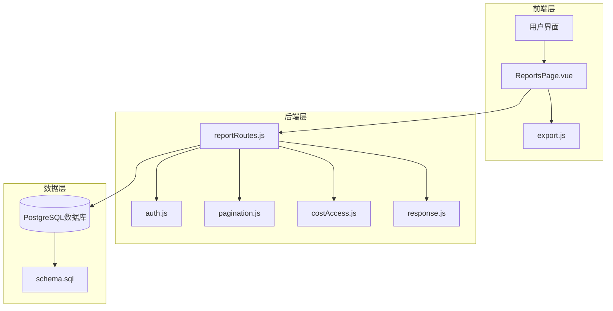
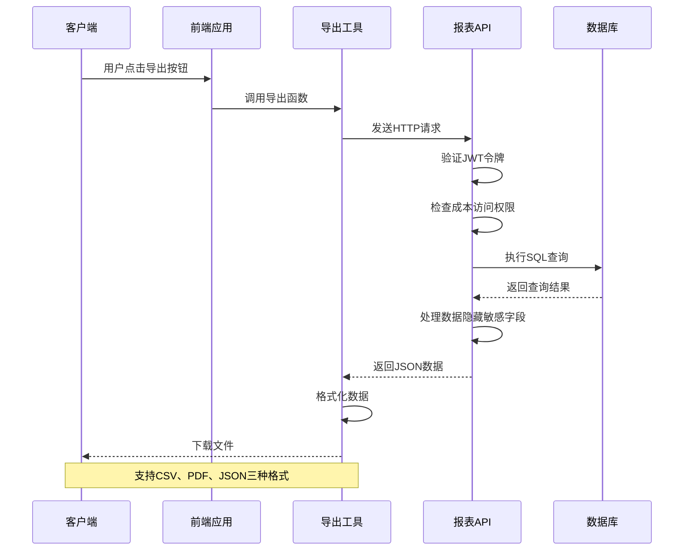
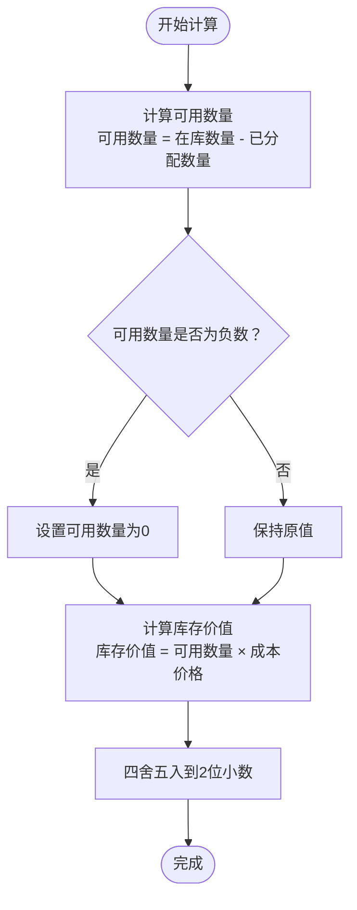
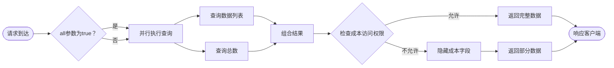
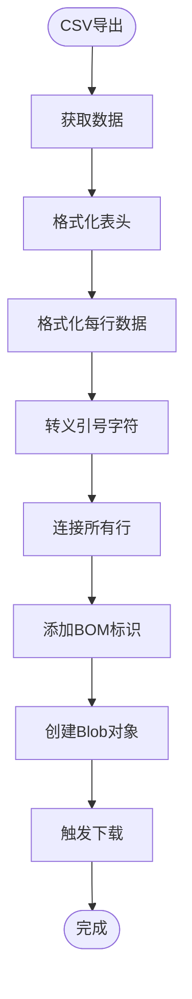
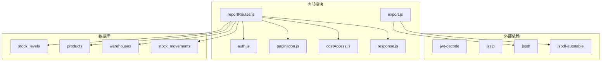
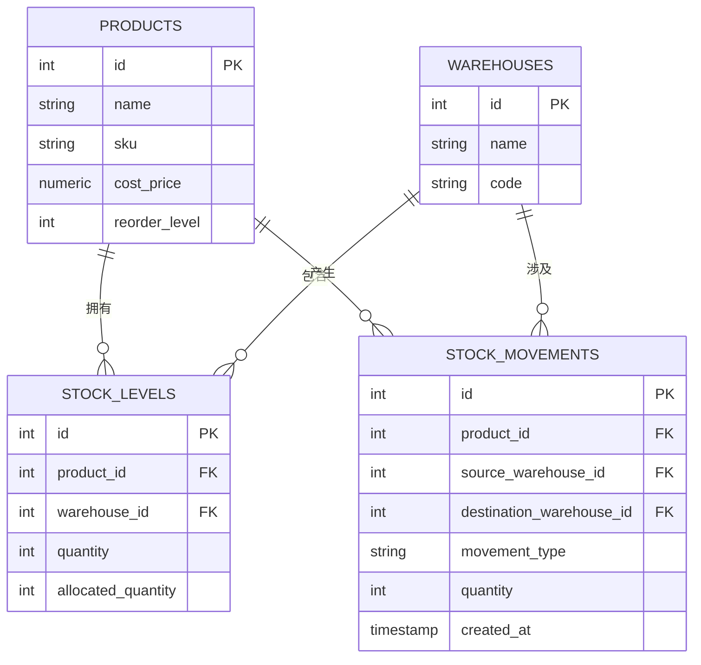

# 报表导出API

<cite>
**本文档引用的文件**
- [reportRoutes.js](file://server/src/routes/reportRoutes.js)
- [export.js](file://web/src/utils/export.js)
- [ReportsPage.vue](file://web/src/pages/ReportsPage.vue)
- [schema.sql](file://server/database/schema.sql)
- [pagination.js](file://server/src/utils/pagination.js)
- [costAccess.js](file://server/src/utils/costAccess.js)
- [auth.js](file://server/src/middleware/auth.js)
- [response.js](file://server/src/middleware/response.js)
- [POSTMAN_BACKEND_GUIDE.md](file://POSTMAN_BACKEND_GUIDE.md)
- [inventory_system_backend.postman_collection.json](file://postman/inventory_system_backend.postman_collection.json)
- [marketplaceSyncService.js](file://server/src/services/marketplaceSyncService.js)
- [orderSyncService.js](file://server/src/services/orderSyncService.js)
</cite>

## 目录
1. [简介](#简介)
2. [项目结构](#项目结构)
3. [核心组件](#核心组件)
4. [架构概览](#架构概览)
5. [详细组件分析](#详细组件分析)
6. [依赖关系分析](#依赖关系分析)
7. [性能考虑](#性能考虑)
8. [故障排除指南](#故障排除指南)
9. [结论](#结论)
10. [附录](#附录)

## 简介

本文件详细文档化了库存系统的报表导出API，涵盖库存报表生成、销售报表和财务报表的API接口规范。系统实现了库存汇总、库存周转率分析和成本统计功能，并提供了CSV、PDF和JSON等多种导出格式支持。

系统采用多租户架构设计，通过JWT令牌进行身份验证和授权，确保不同租户间的数据隔离。报表查询支持分页和搜索功能，同时提供"导出全部"选项以处理大数据量场景。

## 项目结构



**图表来源**
- [reportRoutes.js:1-261](file://server/src/routes/reportRoutes.js#L1-L261)
- [export.js:1-91](file://web/src/utils/export.js#L1-L91)
- [schema.sql:1-447](file://server/database/schema.sql#L1-L447)

**章节来源**
- [reportRoutes.js:1-261](file://server/src/routes/reportRoutes.js#L1-L261)
- [export.js:1-91](file://web/src/utils/export.js#L1-L91)
- [schema.sql:1-447](file://server/database/schema.sql#L1-L447)

## 核心组件

### 报表路由模块

报表路由模块提供了两个主要的报表接口：

1. **库存报表接口** (`/reports/inventory`)
2. **库存流水报表接口** (`/reports/movements`)

两个接口都支持相同的查询参数：
- `search`: 关键词搜索
- `page`: 页码（默认1）
- `pageSize`: 每页条数（1-100之间）
- `all`: 导出全部标记

### 数据访问控制

系统实现了基于角色的成本价格访问控制机制：
- ADMIN和MANAGER角色可以查看完整的库存信息
- STAFF角色只能看到部分信息（成本价格显示为null）
- 通过专门的JWT令牌进行成本访问授权

### 分页机制

统一的分页参数处理：
- 最小页大小：1
- 最大页大小：100
- 默认页大小：10
- 自动计算offset值

**章节来源**
- [reportRoutes.js:17-132](file://server/src/routes/reportRoutes.js#L17-L132)
- [reportRoutes.js:135-258](file://server/src/routes/reportRoutes.js#L135-L258)
- [pagination.js:1-28](file://server/src/utils/pagination.js#L1-L28)
- [costAccess.js:1-32](file://server/src/utils/costAccess.js#L1-L32)

## 架构概览



**图表来源**
- [ReportsPage.vue:131-181](file://web/src/pages/ReportsPage.vue#L131-L181)
- [export.js:1-91](file://web/src/utils/export.js#L1-L91)
- [reportRoutes.js:17-132](file://server/src/routes/reportRoutes.js#L17-L132)

## 详细组件分析

### 库存报表组件

库存报表提供了全面的库存视图，包含以下关键字段：

#### 核心字段说明

| 字段名 | 类型 | 描述 | 访问控制 |
|--------|------|------|----------|
| product_name | string | 商品名称 | 全部可见 |
| sku | string | SKU编码 | 全部可见 |
| warehouse_name | string | 仓库名称 | 全部可见 |
| on_hand_quantity | integer | 在库数量 | 全部可见 |
| order_allocated_quantity | integer | 已分配数量 | 全部可见 |
| warehouse_available_quantity | integer | 可用数量 | 全部可见 |
| reorder_level | integer | 补货线 | 全部可见 |
| cost_price | numeric | 成本价格 | 需要授权 |
| stock_value | numeric | 库存金额 | 需要授权 |

#### 库存价值计算逻辑



**图表来源**
- [reportRoutes.js:36-40](file://server/src/routes/reportRoutes.js#L36-L40)

#### 查询优化策略

系统采用了双查询并行执行策略：



**图表来源**
- [reportRoutes.js:68-128](file://server/src/routes/reportRoutes.js#L68-L128)

**章节来源**
- [reportRoutes.js:17-132](file://server/src/routes/reportRoutes.js#L17-L132)
- [ReportsPage.vue:33-42](file://web/src/pages/ReportsPage.vue#L33-L42)

### 库存流水报表组件

库存流水报表追踪所有库存变动历史：

#### 流水记录字段

| 字段名 | 类型 | 描述 |
|--------|------|------|
| id | integer | 流水ID |
| movement_type | enum | 变动类型（IN/OUT/TRANSFER） |
| quantity | integer | 变动数量 |
| reference_no | string | 单据编号 |
| notes | text | 备注信息 |
| created_at | timestamp | 创建时间 |
| product_name | string | 商品名称 |
| sku | string | SKU编码 |
| source_warehouse_name | string | 来源仓库 |
| destination_warehouse_name | string | 目标仓库 |
| created_by_name | string | 操作人姓名 |

#### 时间范围查询

系统支持灵活的时间范围查询：
- `startDate`: 开始日期（可选）
- `endDate`: 结束日期（可选）
- 两个参数都为空时返回所有记录
- 仅设置一个参数时按单边过滤

**章节来源**
- [reportRoutes.js:135-258](file://server/src/routes/reportRoutes.js#L135-L258)
- [ReportsPage.vue:44-52](file://web/src/pages/ReportsPage.vue#L44-L52)

### 导出功能组件

前端实现了多种导出格式的支持：

#### CSV导出功能



**图表来源**
- [export.js:1-20](file://web/src/utils/export.js#L1-L20)

#### PDF导出功能

PDF导出使用jsPDF库实现：
- 横向A4页面布局
- 自动表格插件支持
- 自定义样式配置
- 表头背景色设置

#### JSON导出功能

直接将原始数据序列化为JSON格式，便于程序化处理。

**章节来源**
- [export.js:1-91](file://web/src/utils/export.js#L1-L91)
- [ReportsPage.vue:131-181](file://web/src/pages/ReportsPage.vue#L131-L181)

## 依赖关系分析



**图表来源**
- [reportRoutes.js:1-10](file://server/src/routes/reportRoutes.js#L1-L10)
- [export.js:23-26](file://web/src/utils/export.js#L23-L26)

**章节来源**
- [reportRoutes.js:1-10](file://server/src/routes/reportRoutes.js#L1-L10)
- [export.js:1-91](file://web/src/utils/export.js#L1-L91)

## 性能考虑

### 查询优化策略

1. **索引优化**
   - stock_movements表按created_at降序索引
   - stock_levels表按product_id和warehouse_id索引
   - audit_logs表按created_at降序索引

2. **查询并行化**
   - 使用Promise.all并行执行数据查询和总数查询
   - 减少往返延迟，提高响应速度

3. **分页限制**
   - 最大页大小限制为100条记录
   - 防止超大数据量查询导致内存溢出

### 大数据量处理

对于需要导出全部数据的场景：

1. **分批处理**
   - 前端通过设置`all=true`参数触发全量导出
   - 后端返回完整数据集供前端处理

2. **内存管理**
   - CSV导出使用流式处理
   - PDF导出支持异步加载库文件

3. **超时处理**
   - 设置合理的请求超时时间
   - 提供进度反馈机制

### 缓存策略

虽然报表查询没有实现缓存，但可以通过以下方式优化：
- 对频繁查询的报表结果进行短期缓存
- 实现智能缓存失效机制
- 提供缓存状态监控

## 故障排除指南

### 常见错误及解决方案

#### 1. 认证失败
**问题**: 返回401状态码
**原因**: JWT令牌缺失或过期
**解决**: 重新登录获取新令牌

#### 2. 权限不足
**问题**: 成本价格显示为null
**原因**: 用户角色不支持查看成本信息
**解决**: 申请成本访问权限或使用管理员账户

#### 3. 查询超时
**问题**: 大数据量查询响应缓慢
**解决**: 
- 使用分页参数限制数据量
- 添加适当的搜索条件
- 考虑使用更精确的时间范围

#### 4. 导出失败
**问题**: PDF或CSV导出异常
**原因**: 浏览器兼容性或内存不足
**解决**:
- 尝试不同的浏览器
- 减少导出的数据量
- 检查浏览器的弹窗拦截设置

**章节来源**
- [auth.js:5-61](file://server/src/middleware/auth.js#L5-L61)
- [costAccess.js:25-27](file://server/src/utils/costAccess.js#L25-L27)
- [response.js:14-27](file://server/src/middleware/response.js#L14-L27)

## 结论

本报表导出API系统提供了完整的库存管理报表功能，具有以下特点：

1. **安全性**: 多层认证和授权机制，确保数据安全
2. **灵活性**: 支持多种导出格式和查询参数
3. **性能**: 优化的查询策略和分页机制
4. **可扩展性**: 模块化的架构设计，易于功能扩展

系统能够满足中小型企业到大型企业的各种报表需求，为库存管理和决策分析提供强有力的技术支撑。

## 附录

### API接口规范

#### 库存报表接口
- **URL**: `/reports/inventory`
- **方法**: GET
- **查询参数**:
  - `search`: 关键词搜索
  - `page`: 页码，默认1
  - `pageSize`: 每页条数，默认10，最大100
  - `all`: 导出全部，true/false

#### 库存流水报表接口
- **URL**: `/reports/movements`
- **方法**: GET
- **查询参数**:
  - `startDate`: 开始日期
  - `endDate`: 结束日期
  - `search`: 关键词搜索
  - `page`: 页码，默认1
  - `pageSize`: 每页条数，默认10，最大100
  - `all`: 导出全部，true/false

#### 响应格式
```json
{
  "success": true,
  "data": {
    "items": [],
    "pagination": {
      "total": 0,
      "page": 1,
      "pageSize": 10,
      "totalPages": 1
    }
  },
  "requestId": "uuid"
}
```

### 数据模型关系



**图表来源**
- [schema.sql:32-248](file://server/database/schema.sql#L32-L248)

### 导出格式示例

#### CSV格式
- 文件扩展名: `.csv`
- 编码: UTF-8 with BOM
- 分隔符: 逗号
- 引号: 双引号

#### PDF格式
- 页面尺寸: A4
- 方向: 横向
- 字体大小: 9pt
- 表头样式: 深色背景

#### JSON格式
- 编码: UTF-8
- 格式: 美式缩进
- 排序: 字典序