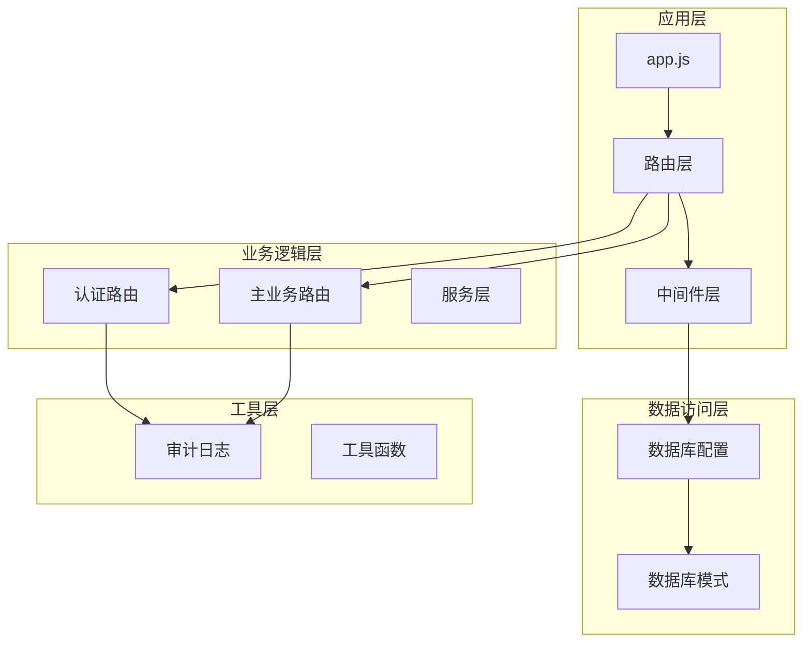
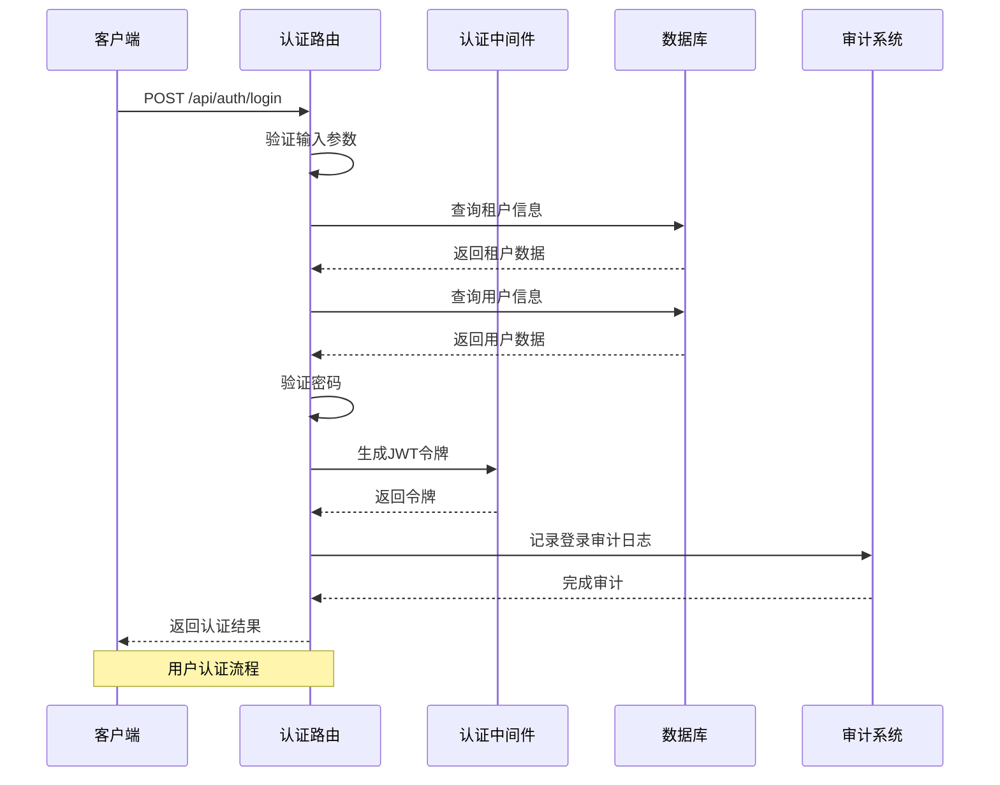
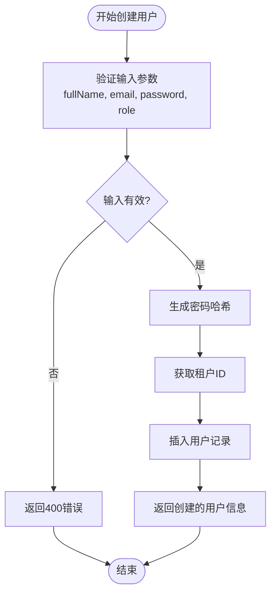
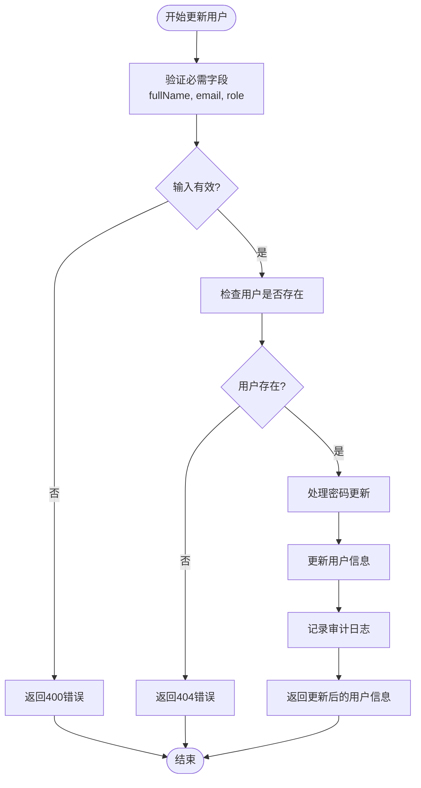
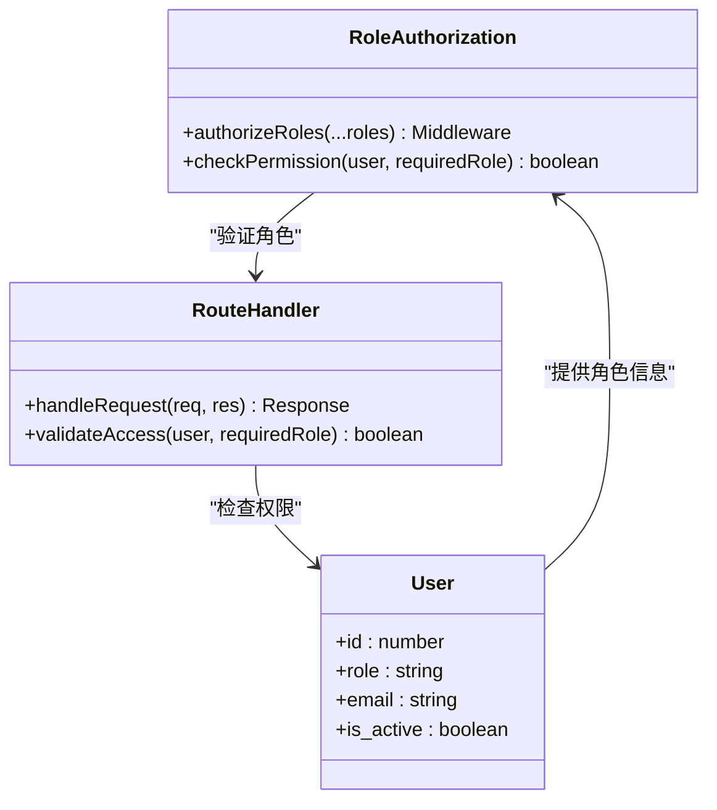
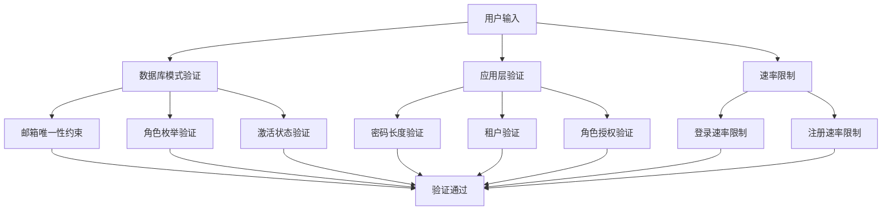
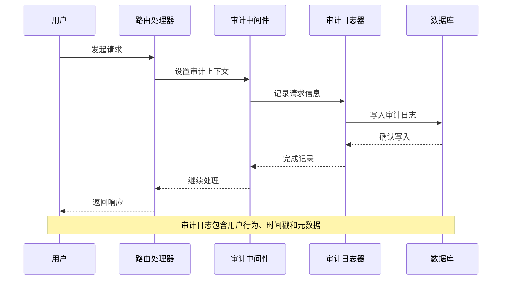
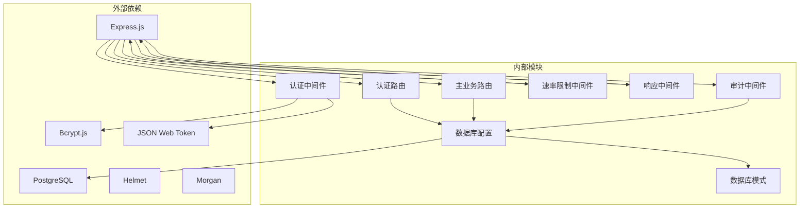

# 用户管理API

<cite>
**本文档引用的文件**
- [authRoutes.js](file://server/src/routes/authRoutes.js)
- [masterRoutes.js](file://server/src/routes/masterRoutes.js)
- [auth.js](file://server/src/middleware/auth.js)
- [rateLimit.js](file://server/src/middleware/rateLimit.js)
- [response.js](file://server/src/middleware/response.js)
- [auditTrail.js](file://server/src/middleware/auditTrail.js)
- [auditLog.js](file://server/src/utils/auditLog.js)
- [db.js](file://server/src/config/db.js)
- [schema.sql](file://server/database/schema.sql)
- [app.js](file://server/src/app.js)
- [package.json](file://server/package.json)
</cite>

## 目录
1. [简介](#简介)
2. [项目结构](#项目结构)
3. [核心组件](#核心组件)
4. [架构概览](#架构概览)
5. [详细组件分析](#详细组件分析)
6. [依赖关系分析](#依赖关系分析)
7. [性能考虑](#性能考虑)
8. [故障排除指南](#故障排除指南)
9. [结论](#结论)

## 简介

本文件详细说明了库存管理系统的用户管理API，包括用户CRUD操作、角色权限管理、状态管理和数据验证规则。系统采用多租户架构，支持用户在不同租户间的隔离管理，并提供了完整的审计跟踪功能。

## 项目结构

库存管理系统采用模块化的Express.js架构，主要分为以下几个层次：

**图表来源**
- [app.js:1-91](file://server/src/app.js#L1-91)
- [authRoutes.js:1-180](file://server/src/routes/authRoutes.js#L1-180)
- [masterRoutes.js:1-1571](file://server/src/routes/masterRoutes.js#L1-1571)

**章节来源**
- [app.js:1-91](file://server/src/app.js#L1-91)
- [package.json:1-31](file://server/package.json#L1-31)

## 核心组件

### 认证与授权中间件

系统实现了基于JWT的认证机制和基于角色的访问控制：

- **authenticateToken**: 验证JWT令牌并注入用户上下文
- **authorizeRoles**: 实现基于角色的权限控制
- **requireTenant**: 确保租户上下文存在

### 用户管理路由

用户管理功能集中在masterRoutes.js中，提供完整的CRUD操作：

- **用户列表查询**: 支持搜索、分页和过滤
- **用户创建**: 仅管理员可创建新用户
- **用户更新**: 支持密码更新和状态变更
- **用户删除**: 安全的用户删除机制

### 数据验证与约束

数据库层面实现了严格的数据完整性约束：

- **角色验证**: 仅允许ADMIN、MANAGER、STAFF三种角色
- **邮箱唯一性**: 确保用户邮箱的唯一性
- **激活状态**: 支持用户激活/禁用状态管理

**章节来源**
- [auth.js:1-87](file://server/src/middleware/auth.js#L1-87)
- [masterRoutes.js:497-673](file://server/src/routes/masterRoutes.js#L497-673)
- [schema.sql:2-11](file://server/database/schema.sql#L2-11)

## 架构概览

系统采用分层架构设计，确保职责分离和代码可维护性：

**图表来源**
- [authRoutes.js:23-98](file://server/src/routes/authRoutes.js#L23-98)
- [auth.js:5-61](file://server/src/middleware/auth.js#L5-61)

**章节来源**
- [authRoutes.js:1-180](file://server/src/routes/authRoutes.js#L1-180)
- [auth.js:1-87](file://server/src/middleware/auth.js#L1-87)

## 详细组件分析

### 用户CRUD操作实现

#### 用户创建功能

用户创建功能由管理员专用路由实现，具有严格的安全控制：

**图表来源**
- [masterRoutes.js:572-595](file://server/src/routes/masterRoutes.js#L572-595)

#### 用户读取功能

系统提供两种用户查询方式：

1. **分页查询**: 支持搜索和过滤，适用于大量用户数据
2. **全量查询**: 支持all=true参数，适用于下拉框等场景

**章节来源**
- [masterRoutes.js:497-569](file://server/src/routes/masterRoutes.js#L497-569)

#### 用户更新功能

用户更新支持多种字段的修改，包括敏感信息的处理：

**图表来源**
- [masterRoutes.js:597-646](file://server/src/routes/masterRoutes.js#L597-646)

**章节来源**
- [masterRoutes.js:597-646](file://server/src/routes/masterRoutes.js#L597-646)

#### 用户删除功能

删除操作包含安全检查，防止误删当前登录用户：

**章节来源**
- [masterRoutes.js:648-673](file://server/src/routes/masterRoutes.js#L648-673)

### 角色权限管理

系统实现了基于角色的访问控制（RBAC）：

**图表来源**
- [auth.js:64-72](file://server/src/middleware/auth.js#L64-72)
- [masterRoutes.js:572-595](file://server/src/routes/masterRoutes.js#L572-595)

**章节来源**
- [auth.js:64-72](file://server/src/middleware/auth.js#L64-72)
- [masterRoutes.js:572-595](file://server/src/routes/masterRoutes.js#L572-595)

### 用户状态管理

系统支持用户激活/禁用状态管理：

| 状态 | 描述 | 影响 |
|------|------|------|
| ACTIVE | 用户账户正常激活 | 可以正常登录和使用系统 |
| INACTIVE | 用户账户被禁用 | 无法登录，但记录保留 |
| SUSPENDED | 租户账户暂停 | 所有用户都无法访问 |

**章节来源**
- [auth.js:26-28](file://server/src/middleware/auth.js#L26-28)
- [authRoutes.js:43-45](file://server/src/routes/authRoutes.js#L43-45)

### 数据验证规则

系统在多个层面实施数据验证：

**图表来源**
- [schema.sql:2-11](file://server/database/schema.sql#L2-11)
- [authRoutes.js:101-120](file://server/src/routes/authRoutes.js#L101-120)
- [rateLimit.js:9-35](file://server/src/middleware/rateLimit.js#L9-35)

**章节来源**
- [schema.sql:2-11](file://server/database/schema.sql#L2-11)
- [authRoutes.js:101-120](file://server/src/routes/authRoutes.js#L101-120)
- [rateLimit.js:1-40](file://server/src/middleware/rateLimit.js#L1-40)

### 审计跟踪系统

系统实现了完整的审计日志功能：

**图表来源**
- [auditTrail.js:47-81](file://server/src/middleware/auditTrail.js#L47-81)
- [auditLog.js:1-40](file://server/src/utils/auditLog.js#L1-40)

**章节来源**
- [auditTrail.js:1-86](file://server/src/middleware/auditTrail.js#L1-86)
- [auditLog.js:1-40](file://server/src/utils/auditLog.js#L1-40)

## 依赖关系分析

系统依赖关系清晰，各模块职责明确：

**图表来源**
- [package.json:15-25](file://server/package.json#L15-25)
- [app.js:1-91](file://server/src/app.js#L1-91)

**章节来源**
- [package.json:1-31](file://server/package.json#L1-31)
- [app.js:1-91](file://server/src/app.js#L1-91)

## 性能考虑

系统在设计时充分考虑了性能优化：

### 数据库优化
- **索引优化**: 为常用查询字段建立索引
- **连接池**: 使用PostgreSQL连接池管理数据库连接
- **查询优化**: 实现分页查询避免大数据集全量加载

### 缓存策略
- **内存缓存**: 使用Map存储速率限制桶
- **会话缓存**: JWT令牌验证结果缓存
- **查询缓存**: 审计日志异步写入

### 安全优化
- **速率限制**: 防止暴力破解和DDoS攻击
- **输入验证**: 多层验证确保数据完整性
- **SQL注入防护**: 使用参数化查询

## 故障排除指南

### 常见问题及解决方案

#### 认证失败
**症状**: 用户无法登录，返回401错误
**可能原因**:
- 无效的用户名或密码
- 用户账户被禁用
- 租户状态异常

**解决步骤**:
1. 验证用户邮箱和密码
2. 检查用户激活状态
3. 确认租户状态为ACTIVE

#### 权限不足
**症状**: 返回403错误
**可能原因**:
- 当前用户角色权限不足
- 尝试访问不允许的操作

**解决步骤**:
1. 确认用户角色为ADMIN或MANAGER
2. 检查目标操作的权限要求

#### 数据库连接问题
**症状**: 数据库操作失败
**可能原因**:
- 连接字符串配置错误
- 数据库服务器不可达
- SSL配置问题

**解决步骤**:
1. 检查DATABASE_URL环境变量
2. 验证数据库服务器状态
3. 检查SSL配置参数

**章节来源**
- [auth.js:26-28](file://server/src/middleware/auth.js#L26-28)
- [authRoutes.js:39-45](file://server/src/routes/authRoutes.js#L39-45)
- [db.js:3-23](file://server/src/config/db.js#L3-23)

## 结论

本用户管理API实现了完整的多租户用户管理体系，具有以下特点：

### 安全特性
- 基于JWT的强认证机制
- 基于角色的细粒度权限控制
- 完整的审计日志追踪
- 多层数据验证和约束

### 功能完整性
- 支持用户CRUD操作
- 提供状态管理功能
- 实现角色权限控制
- 包含完整的错误处理

### 性能优化
- 分页查询避免大数据集加载
- 连接池管理数据库连接
- 速率限制防止滥用
- 异步审计日志写入

该系统为企业级应用提供了可靠的基础用户管理能力，支持多租户场景下的用户隔离和权限管理。