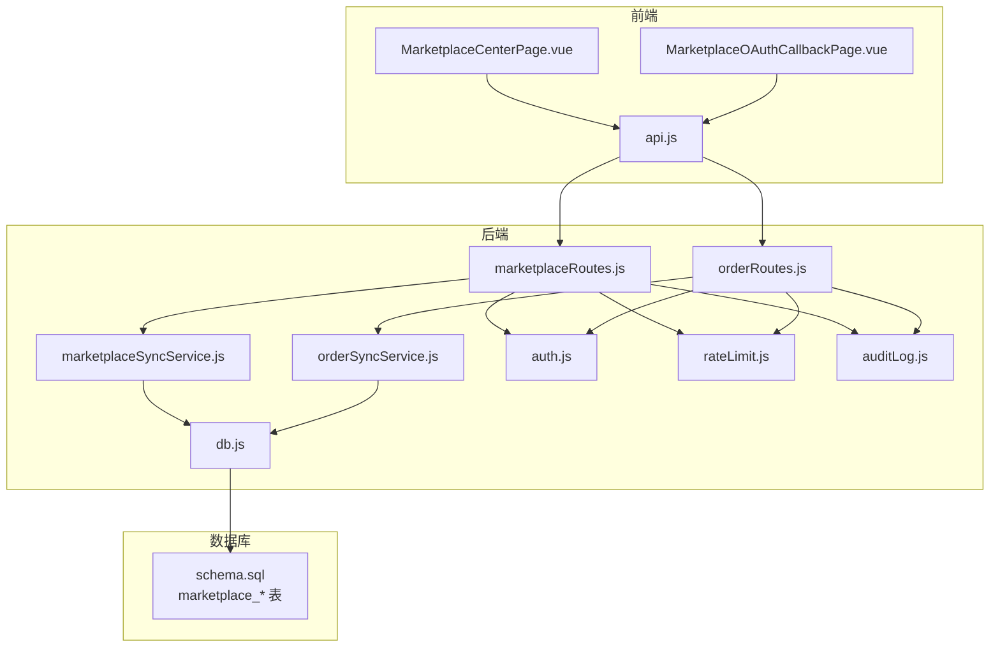
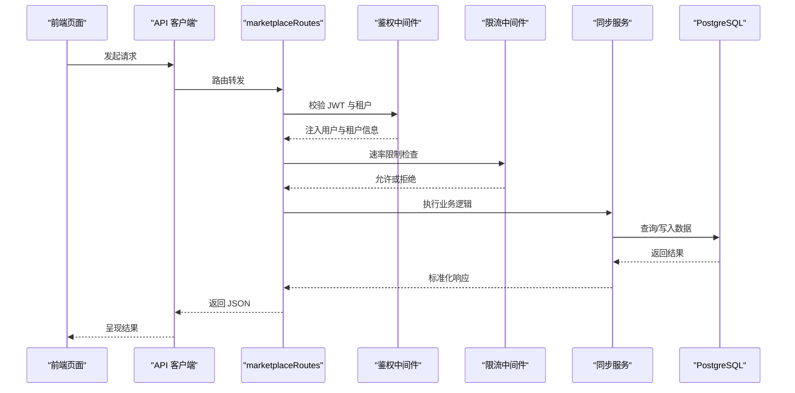
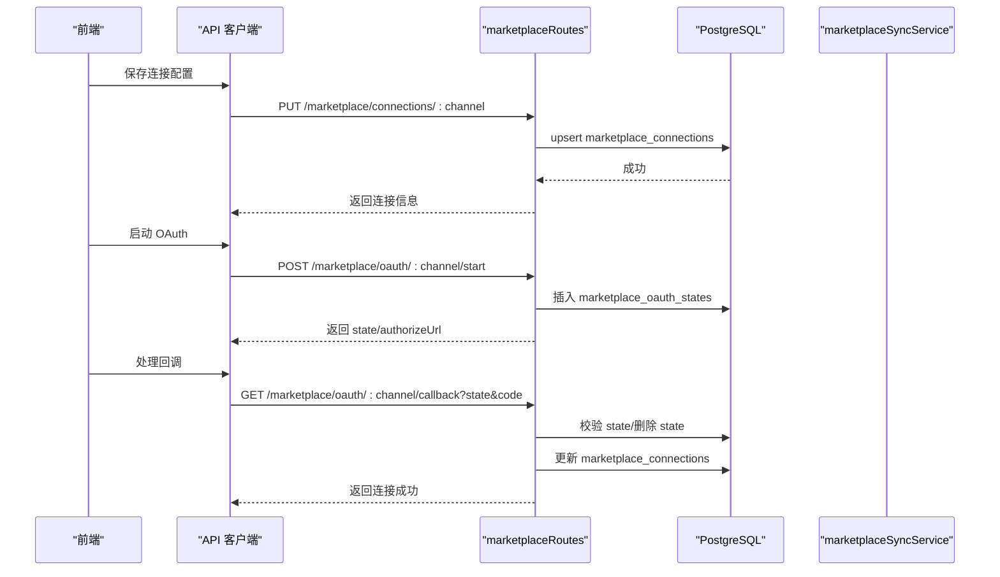
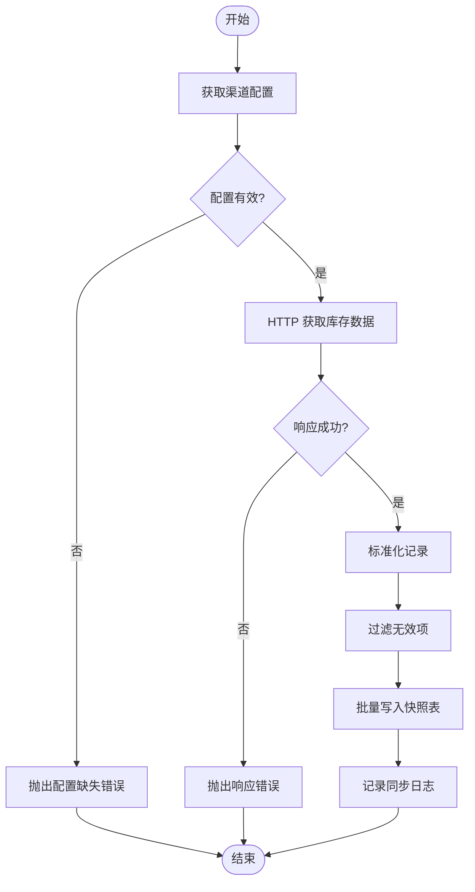
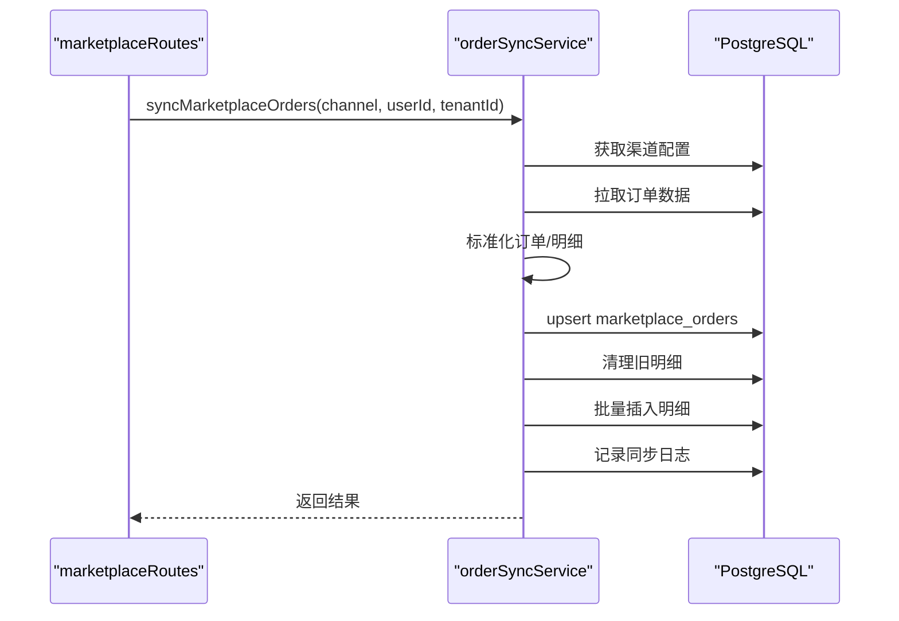
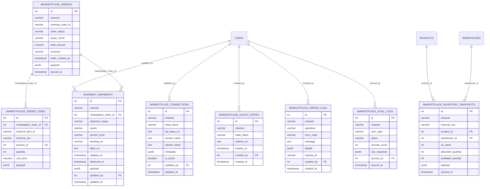
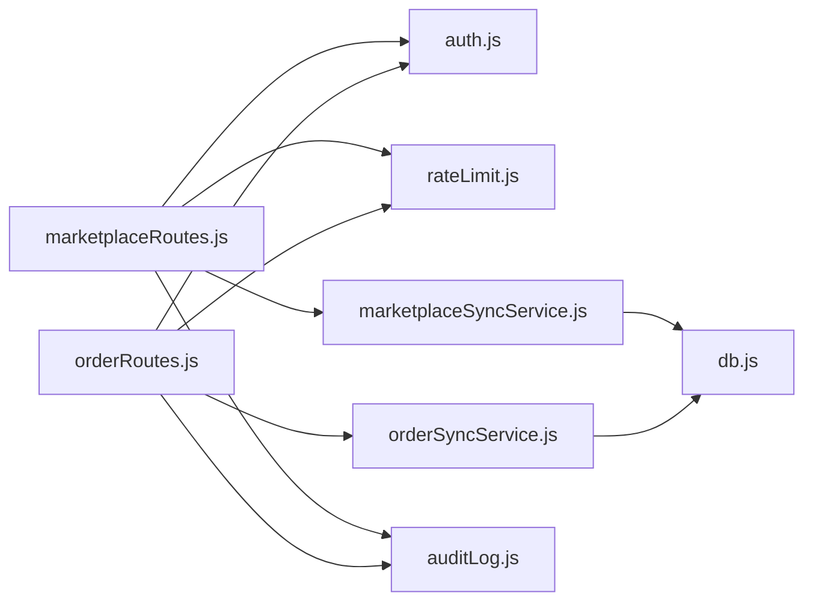

# 电商集成API

<cite>
**本文引用的文件列表**
- [marketplaceRoutes.js](file://server/src/routes/marketplaceRoutes.js)
- [marketplaceSyncService.js](file://server/src/services/marketplaceSyncService.js)
- [orderRoutes.js](file://server/src/routes/orderRoutes.js)
- [orderSyncService.js](file://server/src/services/orderSyncService.js)
- [db.js](file://server/src/config/db.js)
- [rateLimit.js](file://server/src/middleware/rateLimit.js)
- [auth.js](file://server/src/middleware/auth.js)
- [auditLog.js](file://server/src/utils/auditLog.js)
- [schema.sql](file://server/database/schema.sql)
- [MarketplaceCenterPage.vue](file://web/src/pages/MarketplaceCenterPage.vue)
- [MarketplaceOAuthCallbackPage.vue](file://web/src/pages/MarketplaceOAuthCallbackPage.vue)
- [api.js](file://web/src/services/api.js)
</cite>

## 目录
1. [简介](#简介)
2. [项目结构](#项目结构)
3. [核心组件](#核心组件)
4. [架构总览](#架构总览)
5. [详细组件分析](#详细组件分析)
6. [依赖关系分析](#依赖关系分析)
7. [性能考量](#性能考量)
8. [故障排查指南](#故障排查指南)
9. [结论](#结论)
10. [附录](#附录)

## 简介
本项目为一个全栈库存管理系统，提供电商集成API，支持对接 Shopee、Lazada、TikTok 等电商平台。核心能力包括：
- 平台连接配置与 OAuth 授权流程
- 商品库存同步（上传、更新、下架可通过库存快照与订单映射间接体现）
- 订单同步与状态管理
- 完整的审计日志、错误日志与限流保护
- 前端可视化管理界面，便于配置、测试与监控

## 项目结构
后端采用 Express + PostgreSQL，前端使用 Vue 3 + Vite。电商集成相关的核心模块分布如下：
- 后端路由：电商连接、OAuth、库存同步、订单同步、状态概览、错误日志等
- 服务层：统一的渠道配置解析、库存/订单同步逻辑
- 数据库：完整的电商数据模型（连接、快照、订单、错误日志、审计日志等）
- 前端页面：电商连接中心、OAuth 回调处理页面
- 工具与中间件：认证、限流、审计日志

图表来源
- [marketplaceRoutes.js:12-685](file://server/src/routes/marketplaceRoutes.js#L12-L685)
- [orderRoutes.js:1-124](file://server/src/routes/orderRoutes.js#L1-L124)
- [marketplaceSyncService.js:1-159](file://server/src/services/marketplaceSyncService.js#L1-L159)
- [orderSyncService.js:1-128](file://server/src/services/orderSyncService.js#L1-L128)
- [db.js:1-29](file://server/src/config/db.js#L1-L29)
- [rateLimit.js:1-40](file://server/src/middleware/rateLimit.js#L1-L40)
- [auth.js:1-87](file://server/src/middleware/auth.js#L1-L87)
- [auditLog.js:1-40](file://server/src/utils/auditLog.js#L1-L40)
- [schema.sql:137-235](file://server/database/schema.sql#L137-L235)

章节来源
- [marketplaceRoutes.js:12-685](file://server/src/routes/marketplaceRoutes.js#L12-L685)
- [orderRoutes.js:1-124](file://server/src/routes/orderRoutes.js#L1-L124)
- [marketplaceSyncService.js:1-159](file://server/src/services/marketplaceSyncService.js#L1-L159)
- [orderSyncService.js:1-128](file://server/src/services/orderSyncService.js#L1-L128)
- [db.js:1-29](file://server/src/config/db.js#L1-L29)
- [rateLimit.js:1-40](file://server/src/middleware/rateLimit.js#L1-L40)
- [auth.js:1-87](file://server/src/middleware/auth.js#L1-L87)
- [auditLog.js:1-40](file://server/src/utils/auditLog.js#L1-L40)
- [schema.sql:137-235](file://server/database/schema.sql#L137-L235)

## 核心组件
- 电商连接与 OAuth
  - 支持 Shopee、Lazada、TikTok 三类渠道
  - 提供连接配置保存、连接测试、OAuth 启动与回调处理
- 库存同步
  - 从各平台拉取库存数据，标准化并写入快照表，同时记录同步日志
- 订单同步
  - 从各平台拉取订单数据，标准化后写入订单与订单明细表，同时记录同步日志
- 错误与审计
  - 统一记录错误日志与审计日志，支持分页查询与概览统计
- 限流与鉴权
  - 基于令牌的认证与角色授权，多处接口设置速率限制

章节来源
- [marketplaceRoutes.js:50-456](file://server/src/routes/marketplaceRoutes.js#L50-L456)
- [marketplaceSyncService.js:113-153](file://server/src/services/marketplaceSyncService.js#L113-L153)
- [orderSyncService.js:19-123](file://server/src/services/orderSyncService.js#L19-L123)
- [auditLog.js:1-35](file://server/src/utils/auditLog.js#L1-L35)
- [rateLimit.js:9-35](file://server/src/middleware/rateLimit.js#L9-L35)
- [auth.js:5-61](file://server/src/middleware/auth.js#L5-L61)

## 架构总览
电商集成API采用“路由层-服务层-数据层”三层架构，配合中间件实现鉴权与限流，数据库以 PostgreSQL 为核心存储。

图表来源
- [marketplaceRoutes.js:16-213](file://server/src/routes/marketplaceRoutes.js#L16-L213)
- [orderRoutes.js:12-31](file://server/src/routes/orderRoutes.js#L12-L31)
- [auth.js:5-61](file://server/src/middleware/auth.js#L5-L61)
- [rateLimit.js:9-35](file://server/src/middleware/rateLimit.js#L9-L35)
- [marketplaceSyncService.js:113-153](file://server/src/services/marketplaceSyncService.js#L113-L153)
- [orderSyncService.js:19-123](file://server/src/services/orderSyncService.js#L19-L123)
- [db.js:17-28](file://server/src/config/db.js#L17-L28)

## 详细组件分析

### 电商连接与 OAuth 实现
- 连接配置
  - 支持保存渠道基础信息（店铺名、API 基础地址、访问令牌、刷新令牌、元数据、是否启用）
  - 若数据库中未配置，则回退到环境变量中的渠道配置
- OAuth 启动
  - 生成一次性 state，持久化到 OAuth 状态表，设置过期时间
  - 返回授权 URL，前端可直接打开平台授权页
- OAuth 回调
  - 校验 state 存在性与有效期
  - 将回调参数写入连接元数据，标记为已连接
  - 删除临时 state，记录审计日志
- 连接测试
  - 基于配置的 endpoint 与 token，调用健康检查接口验证连通性

图表来源
- [marketplaceRoutes.js:78-394](file://server/src/routes/marketplaceRoutes.js#L78-L394)
- [marketplaceSyncService.js:19-38](file://server/src/services/marketplaceSyncService.js#L19-L38)

章节来源
- [marketplaceRoutes.js:78-394](file://server/src/routes/marketplaceRoutes.js#L78-L394)
- [marketplaceSyncService.js:19-38](file://server/src/services/marketplaceSyncService.js#L19-L38)

### 商品库存同步 API
- 功能概述
  - 从各平台拉取库存数据，标准化字段（外部 SKU、仓库编码、在手/占用/可用数量）
  - 将标准化后的数据写入库存快照表，同时记录同步日志
- 关键流程
  - 获取渠道配置（优先数据库，其次环境变量）
  - 发起 HTTP 请求获取库存数据
  - 标准化并过滤无效数据
  - 批量写入快照表
  - 记录成功日志

图表来源
- [marketplaceSyncService.js:113-153](file://server/src/services/marketplaceSyncService.js#L113-L153)

章节来源
- [marketplaceSyncService.js:113-153](file://server/src/services/marketplaceSyncService.js#L113-L153)
- [marketplaceRoutes.js:153-213](file://server/src/routes/marketplaceRoutes.js#L153-L213)

### 订单同步 API
- 功能概述
  - 从各平台拉取订单数据，标准化订单与订单明细
  - 写入订单主表与明细表，按租户+渠道+外部订单号去重
  - 记录同步日志
- 关键流程
  - 获取渠道配置
  - 发起 HTTP 请求获取订单数据
  - 标准化订单与明细
  - 写入订单与明细表（先清理旧明细）
  - 记录成功日志

图表来源
- [orderRoutes.js:14-31](file://server/src/routes/orderRoutes.js#L14-L31)
- [orderSyncService.js:19-123](file://server/src/services/orderSyncService.js#L19-L123)

章节来源
- [orderRoutes.js:14-31](file://server/src/routes/orderRoutes.js#L14-L31)
- [orderSyncService.js:19-123](file://server/src/services/orderSyncService.js#L19-L123)

### 数据模型与索引
电商集成相关的数据库表包括：
- marketplace_connections：渠道连接配置
- marketplace_oauth_states：OAuth 状态缓存
- marketplace_error_logs：错误日志
- marketplace_sync_logs：同步日志
- marketplace_inventory_snapshots：库存快照
- marketplace_orders / marketplace_order_items：订单与明细
- shipping_shipments：物流单据（为后续订单状态与物流跟踪预留）

图表来源
- [schema.sql:161-235](file://server/database/schema.sql#L161-L235)

章节来源
- [schema.sql:161-235](file://server/database/schema.sql#L161-L235)

### 前端集成与使用
- 电商连接中心
  - 支持保存/测试/同步库存/同步订单
  - 支持 OAuth 启动与回调处理
- OAuth 回调页面
  - 自动处理回调参数并提示结果
- API 客户端
  - 自动注入 JWT 与成本访问令牌
  - 统一处理响应结构

章节来源
- [MarketplaceCenterPage.vue:136-246](file://web/src/pages/MarketplaceCenterPage.vue#L136-L246)
- [MarketplaceOAuthCallbackPage.vue:19-54](file://web/src/pages/MarketplaceOAuthCallbackPage.vue#L19-L54)
- [api.js:3-44](file://web/src/services/api.js#L3-L44)

## 依赖关系分析
- 路由层依赖
  - 鉴权中间件：确保用户身份与租户上下文
  - 限流中间件：对关键接口进行速率限制
  - 服务层：封装业务逻辑（库存/订单同步）
- 服务层依赖
  - 数据库连接池：统一查询与事务
  - 审计日志：记录关键操作
- 数据库依赖
  - 多张电商相关表支撑连接、同步、错误与审计
  - 多处索引提升查询性能（如订单状态、错误日志时间等）

图表来源
- [marketplaceRoutes.js:1-11](file://server/src/routes/marketplaceRoutes.js#L1-L11)
- [orderRoutes.js:1-10](file://server/src/routes/orderRoutes.js#L1-L10)
- [auth.js:1-87](file://server/src/middleware/auth.js#L1-L87)
- [rateLimit.js:1-40](file://server/src/middleware/rateLimit.js#L1-L40)
- [marketplaceSyncService.js:1-2](file://server/src/services/marketplaceSyncService.js#L1-L2)
- [orderSyncService.js:1-2](file://server/src/services/orderSyncService.js#L1-L2)
- [auditLog.js:1-35](file://server/src/utils/auditLog.js#L1-L35)
- [db.js:1-29](file://server/src/config/db.js#L1-L29)

章节来源
- [marketplaceRoutes.js:1-11](file://server/src/routes/marketplaceRoutes.js#L1-L11)
- [orderRoutes.js:1-10](file://server/src/routes/orderRoutes.js#L1-L10)
- [auth.js:1-87](file://server/src/middleware/auth.js#L1-L87)
- [rateLimit.js:1-40](file://server/src/middleware/rateLimit.js#L1-L40)
- [marketplaceSyncService.js:1-2](file://server/src/services/marketplaceSyncService.js#L1-L2)
- [orderSyncService.js:1-2](file://server/src/services/orderSyncService.js#L1-L2)
- [auditLog.js:1-35](file://server/src/utils/auditLog.js#L1-L35)
- [db.js:1-29](file://server/src/config/db.js#L1-L29)

## 性能考量
- 速率限制
  - 对库存/订单同步与 OAuth 启动/回调设置独立命名空间的限流桶，避免突发流量影响平台稳定性
- 数据库连接
  - 使用连接池并根据连接字符串动态决定是否启用 SSL，降低连接失败概率
- 查询优化
  - 电商相关表建立多处索引（如订单状态、错误日志时间、快照渠道等），提升分页与筛选性能
- 批量写入
  - 库存快照与订单明细采用批量写入，减少往返次数
- 建议
  - 在高并发场景下，建议为不同渠道配置独立的限流窗口与最大请求数
  - 对长耗时的同步任务考虑异步化（队列/定时任务），避免阻塞请求线程

章节来源
- [rateLimit.js:9-35](file://server/src/middleware/rateLimit.js#L9-L35)
- [db.js:17-28](file://server/src/config/db.js#L17-L28)
- [schema.sql:419-427](file://server/database/schema.sql#L419-L427)

## 故障排查指南
- 常见错误类型
  - 不支持的渠道：检查请求路径中的 channel 是否为 shopee/lazada/tiktok
  - OAuth 状态无效或过期：确认 state 是否存在且未过期
  - 连接配置缺失：检查数据库连接记录或环境变量是否正确
  - 同步失败：查看同步日志与错误日志，定位具体失败原因
- 日志与审计
  - 错误日志表包含操作类型、错误码、消息与详情，支持按渠道与时间筛选
  - 审计日志记录关键动作与元数据，便于追踪
- 建议排查步骤
  - 先执行连接测试，确认 endpoint 与 token 正确
  - 查看错误日志与同步日志，定位失败阶段
  - 检查限流状态，必要时调整窗口与配额
  - 核对租户上下文与用户角色，确保有权限执行相应操作

章节来源
- [marketplaceRoutes.js:22-32](file://server/src/routes/marketplaceRoutes.js#L22-L32)
- [marketplaceRoutes.js:284-394](file://server/src/routes/marketplaceRoutes.js#L284-L394)
- [marketplaceRoutes.js:396-456](file://server/src/routes/marketplaceRoutes.js#L396-L456)
- [marketplaceRoutes.js:637-682](file://server/src/routes/marketplaceRoutes.js#L637-L682)
- [auditLog.js:1-35](file://server/src/utils/auditLog.js#L1-L35)
- [schema.sql:184-194](file://server/database/schema.sql#L184-L194)

## 结论
本电商集成API提供了完整的连接配置、OAuth 授权、库存与订单同步能力，并配套完善的审计与错误日志体系。通过合理的限流与数据库索引设计，能够在保证稳定性的同时满足日常同步需求。建议在生产环境中结合异步任务与更细粒度的限流策略，进一步提升吞吐与可靠性。

## 附录
- 前端页面与 API 调用示例
  - 电商连接中心：保存配置、测试连接、同步库存/订单、启动 OAuth
  - OAuth 回调页面：自动处理回调并提示结果
  - API 客户端：自动注入 JWT 与成本访问令牌，统一封装响应

章节来源
- [MarketplaceCenterPage.vue:136-246](file://web/src/pages/MarketplaceCenterPage.vue#L136-L246)
- [MarketplaceOAuthCallbackPage.vue:19-54](file://web/src/pages/MarketplaceOAuthCallbackPage.vue#L19-L54)
- [api.js:3-44](file://web/src/services/api.js#L3-L44)